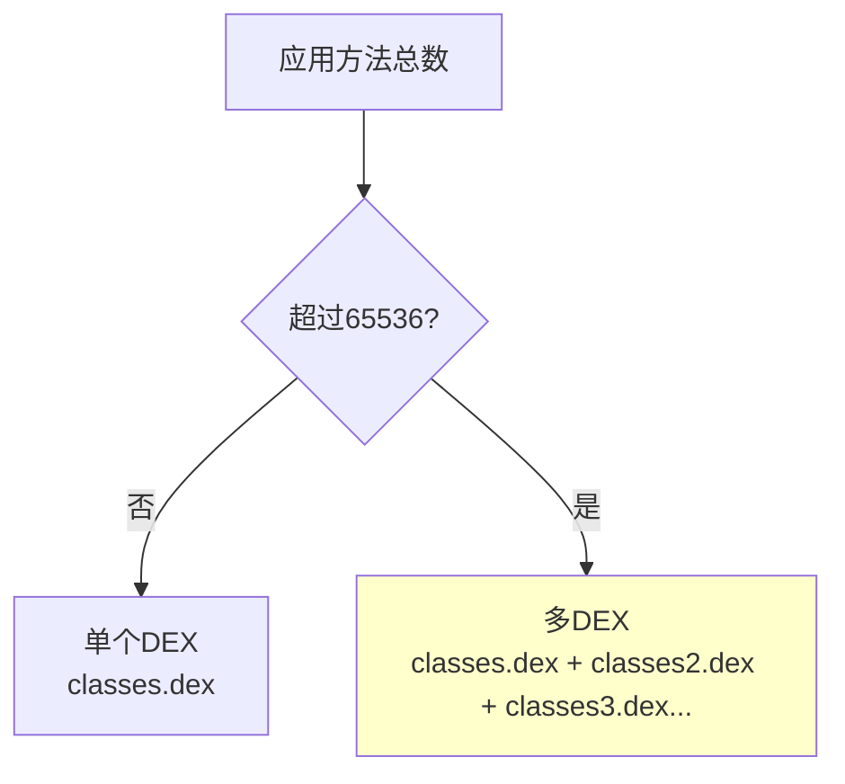
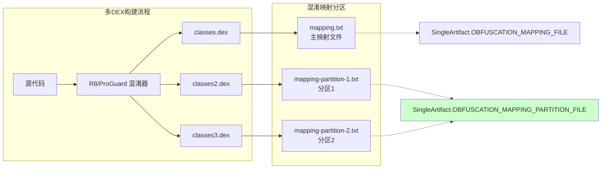
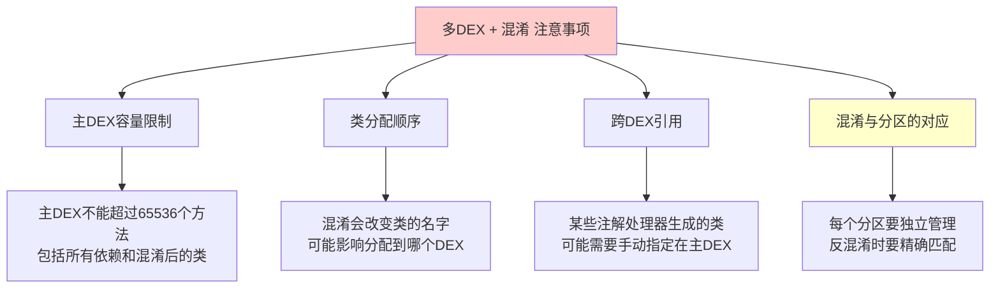
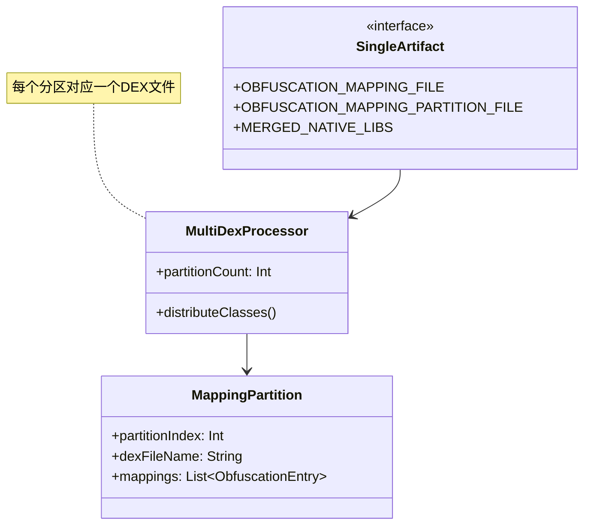
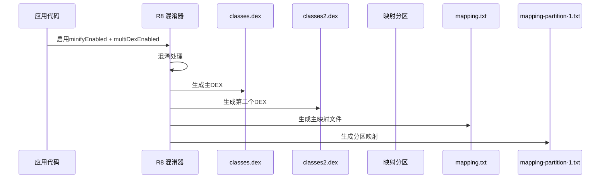

# 21.1.45 SingleArtifact.OBFUSCATION_MAPPING_PARTITION_FILE——多DEX的密码分页

星星已经铺满了整个天空，像银色的沙砾洒在深蓝色的天鹅绒上。偶尔有流星划过，引来伊莎的一阵低呼。夜晚的露营地比白天更加安静，只有蟋蟀的鸣叫声此起彼伏，还有远处偶尔传来的猫头鹰的叫声。

洛芙裹紧了自己的外套，虽然是夏天，但夜里的山间还是有些凉意。她的目光从星空收回，看向黛琳刚才在白板上画的图。

“刚才讲的混淆映射文件真的很实用，”洛芙说道，“以后我知道怎么用mapping.txt来还原崩溃日志了。”

“那是当然，”希尔点点头，“不过今天我要讲的是它的进阶版本——你们有没有想过，如果你的app很大，有很多个DEX文件该怎么办？”

“很多个DEX文件？”洛芙歪着头，“这是什么意思？”

黛琳笑着翻开白板的新的一页：“这就要讲到我们今天的主题了——SingleArtifact.OBFUSCATION_MAPPING_PARTITION_FILE，混淆映射分区文件！”

---

## 大部头的烦恼：什么是多DEX

希尔打开笔记本电脑，调出一个图表。

“你们知道吗？Android系统有一个限制，”希尔说道，“每个DEX文件最多只能包含65536个方法。如果你的app用了太多库，方法数超过这个限制怎么办？”

“那怎么办？”洛芙问道，“难道不能打包进一个app吗？”

“这就是多DEX的由来，”希尔解释道，“Android会把app拆分成多个DEX文件——第一个叫classes.dex，第二个叫classes2.dex，第三个叫classes3.dex，以此类推。”

她在白板上画了一幅图：



“你们看，”希尔指着图说，“如果方法数超过限制，系统会自动创建多个DEX文件来容纳所有代码。”

伊莎好奇地问：“那混淆映射文件会怎么样呢？也会分成多个吗？”

“问得好！”黛琳接过话题，“这就是我们今天要讲的重点了——当启用多DEX时，混淆映射文件也会被分成多个分区，每个DEX文件对应一个映射分区。”

---

## 密码本的分页：混淆映射分区

黛琳把白板翻到新的一页，开始画新的图示。

“你们先想想，”黛琳问道，“如果一个app有3个DEX文件，每个DEX里有成千上万个被混淆的类和方法，全部塞进一个mapping.txt里会怎样？”

洛芙想了想：“文件会变得非常大，找东西很麻烦？”

“不仅如此，”黛琳笑着说，“而且在反混淆的时候，你很难知道某个混淆后的类到底在哪个DEX文件里。混淆映射分区就是为了解决这个问题！”

她接着画出一幅更详细的图：



“你们看，”黛琳指着图说，“OBFUSCATION_MAPPING_FILE是主映射文件，而OBFUSCATION_MAPPING_PARTITION_FILE就是代表这些分区映射文件的Artifact类型！”

洛芙恍然大悟：“原来是这样！那每个分区文件里装的就是对应DEX的混淆映射？”

“没错！”黛琳点点头，“这样分区的好处是：反混淆的时候，可以根据崩溃发生的位置，快速定位到对应的分区文件进行还原。”

---

## 获取混淆映射分区文件

伊莎问道：“那我们怎么在构建过程中获取这些分区映射文件呢？”

“这就要用到Android Gradle Plugin提供的Artifact API了，”黛琳说，“我们可以通过Provider来获取OBFUSCATION_MAPPING_PARTITION_FILE类型的输出。”

她示意希尔演示一下具体的代码。

希尔清了清嗓子，在电脑上敲起来：

```kotlin
// 在 Android Gradle Plugin 8.0+ 中获取混淆映射分区文件
abstract class ObfuscationMappingPartitionPlugin : Plugin<Project> {
    override fun apply(project: Project) {
        val androidExtension = project.extensions.getByType(AppExtension::class.java)
        
        androidExtension.onVariants(selector().all()) { variant ->
            val variantName = variant.name
            println("处理变体: $variantName")
            
            // 检查是否启用了多DEX
            val isMultiDexEnabled = variant.namespace?.let { namespace ->
                // 获取应用的 multiDexKeepFile 配置
                project.file("app/src/main/${project.files("multiDexKeepFile.txt")}")
            } ?: false
            
            // 获取混淆映射分区文件的Artifact（返回文件集合）
            val mappingPartitions = variant.artifacts.get(SingleArtifact.OBFUSCATION_MAPPING_PARTITION_FILE)
            
            // 输出所有分区文件的路径
            mappingPartitions.asFiles.files.forEachIndexed { index, file ->
                println("分区 ${index + 1}: ${file.absolutePath}")
            }
            
            // 同时获取主映射文件
            val mainMappingFile = variant.artifacts.get(SingleArtifact.OBFUSCATION_MAPPING_FILE)
            println("主映射文件: ${mainMappingFile.asFile.get().absolutePath}")
        }
    }
}
```

“这里的关键是`variant.artifacts.get(SingleArtifact.OBFUSCATION_MAPPING_PARTITION_FILE)`，”希尔解释道，“它返回一个FileCollection，包含了所有的混淆映射分区文件。”

洛芙好奇地问：“那主映射文件和分区文件有什么区别？”

“很好的问题！”黛琳接过话题，“主映射文件包含所有混淆的对应关系，是一个完整的大全；而分区文件是按DEX文件分割的，每个分区只包含对应DEX中的混淆映射。”

她在白板上写了一个对比表：

| 特性 | OBFUSCATION_MAPPING_FILE | OBFUSCATION_MAPPING_PARTITION_FILE |
|-----|-------------------------|-----------------------------------|
| 类型 | 单个文件 | 文件集合 |
| 内容 | 所有混淆映射的完整集合 | 按DEX分区切割的映射 |
| 用途 | 通用反混淆 | 多DEX场景下的精确反混淆 |
| 获取方式 | `artifacts.get()` | `artifacts.get()` |

---

## 多DEX的配置与混淆规则

希尔补充道：“要启用多DEX，需要在build.gradle里配置。”

她在电脑上敲了一段配置：

```kotlin
// build.gradle (app level)
android {
    defaultConfig {
        // 启用多DEX支持
        multiDexEnabled true
    }
    
    buildTypes {
        release {
            minifyEnabled true
            // 启用资源混淆
            shrinkResources true
            // 指定混淆规则文件
            proguardFiles getDefaultProguardFile('proguard-android-optimize.txt'), 'proguard-rules.pro'
        }
    }
}

// 如果需要指定哪些类必须在主DEX中，可以配置 multiDexKeepFile
// 创建一个文件 app/src/main/multiDexKeepFile.txt
// 格式：每行一个完整类名
/*
com/example/myapp/MyApp.class
com/example/myapp/ui/MainActivity.class
*/
```

“multiDexKeepFile是用来指定哪些类必须放在第一个DEX文件里的，”希尔解释道，“有些类必须在主DEX中，比如Application子类、启动Activity等。”

洛赛举手提问：“那混淆映射分区是怎么决定的呢？是按字母顺序还是别的规则？”

黛琳解释道：“默认情况下，R8会根据类名和一些启发式规则来分配类到不同的DEX。分区映射文件的顺序和DEX文件的顺序是对应的——classes.dex对应主映射文件，classes2.dex对应partition-1，classes3.dex对应partition-2，以此类推。”

---

## 实际案例：调试多DEX应用的崩溃

希尔兴奋地说：“让我来演示一个真实的场景——假如我们的多DEX app崩溃了，用户发来这样的崩溃日志。”

她切换到一个模拟的崩溃报告界面：

```
java.lang.NullPointerException: 
    at a.onCreate(Unknown Source)
    at b.doSomething(Unknown Source)
    at c.processData(Unknown Source)
    at android.app.ActivityThread.performLaunchActivity(ActivityThread.java:2691)
    ...
```

“天哪，这又是乱码！”洛芙惊呼。

“别急，”希尔笑着说，“这次我们有多个映射文件，需要精确匹配。”

她打开映射文件目录，展示了文件结构：

```
outputs/
├── mapping/
│   └── release/
│       ├── mapping.txt                 # 主映射文件（包含所有）
│       ├── mapping-partition-1.txt      # classes2.dex 的映射
│       └── mapping-partition-2.txt      # classes3.dex 的映射
```

希尔解释说：“我们需要先判断崩溃发生在哪个DEX，然后使用对应的分区文件来还原。”

她展示了查找过程：

```kotlin
// 模拟：根据方法签名判断在哪个DEX分区

// 方法 a.onCreate -> 需要在 mapping.txt 中查找
// 方法 b.doSomething -> 可能在 partition-1 中
// 方法 c.processData -> 可能在 partition-2 中

// 实际应用中，可以通过类名来判断所在的DEX
// 例如：com.example.liba.SomeClass 通常在 classes.dex
//       com.example.libb.SomeClass 通常在 classes2.dex
```

洛芙看得很认真：“原来多DEX的调试这么复杂！”

“所以映射分区文件就派上用场了，”黛琳总结道，“通过分区文件，我们可以快速定位到对应的DEX，然后精确地进行反混淆。”

---

## 分区映射的内部结构

伊莎好奇地问：“分区映射文件和主映射文件的格式是一样的吗？”

“格式是一样的，”黛琳点点头，“只是内容范围不同。让我给你们展示一下分区文件的实际内容。”

她在白板上写下示例：

```
# mapping-partition-1.txt (classes2.dex 的映射)
com.example.lib.network.HttpClient -> a.com.example.lib.network.HttpClient:
    void sendRequest(java.lang.String) -> a
    void onResponseReceived(byte[]) -> a

com.example.lib.utils.ImageLoader -> a.com.example.lib.utils.ImageLoader:
    void loadImage(java.lang.String, android.widget.ImageView) -> a
    void clearCache() -> a

# mapping-partition-2.txt (classes3.dex 的映射)  
com.example.lib.analytics.AnalyticsTracker -> a.com.example.lib.analytics.AnalyticsTracker:
    void trackEvent(java.lang.String, java.util.Map) -> a
    void flushEvents() -> a
```

“你们看，”黛琳指着格式说，“每个分区文件都是标准mapping格式，只是只包含对应DEX中的类。”

希尔补充道：“而且分区文件之间不会有重复——每个类只出现在一个分区中。这是R8自动处理好的。”

---

## 多DEX与混淆的注意事项

洛芙举手提问：“多DEX和混淆一起用的时候，有没有什么特别需要注意的？”

“好问题！”黛琳严肃地说，“确实有几个常见的陷阱。”

她在白板上列出注意事项：



“有几种情况需要特别注意，”黛琳讲解道：

“第一，主DEX容量限制。应用启动时只会加载主DEX，如果主DEX里的方法数超过65536，多DEX就失效了。所以要确保关键的启动类在主DEX中。”

“第二，混淆会改变类名。混淆后的类名更短，可能会改变原本的方法数分布，从而影响DEX分区。”

“第三，跨DEX调用有性能开销。如果频繁调用不同DEX之间的类，可能会稍微影响性能。不过现代设备这个影响已经很小了。”

“第四，反混淆时必须精确匹配。使用错误的分区文件会导致还原失败，或者定位到错误的代码位置。”

---

## 手动管理多DEX混淆映射

希尔演示了一个更高级的用法：“有时候我们需要手动管理哪些类在哪个DEX，这时候就需要配置multiDexKeepProguard规则。”

她在电脑上敲了一段配置：

```kotlin
// proguard-rules.pro

# 指定哪些类必须在主DEX中
# 这里使用-keep而不是-file名单，因为是在混淆规则中
-keep class com.example.myapp.MyApplication { *; }
-keep class com.example.myapp.ui.SplashActivity { *; }
-keep class com.example.myapp.ui.MainActivity { *; }

# 指定哪些类可以放到后面的DEX
# 通过-assumenosideeffects告诉R8这些类的成员可以安全移除
-assumenosideeffects class com.example.myapp.debug.** { *; }

# 确保某些库类在主DEX中
-keep class com.google.android.gms.** { *; }
-keep class androidx.** { *; }
```

“通过这些规则，”希尔解释道，“我们可以精确控制类的分布，确保重要的类在主DEX中。”

洛芙问道：“那怎么查看最终每个DEX里有哪些类呢？”

黛琳笑着回答：“构建完成后，在outputs目录下会有一个manifest-merger-release-report.txt文件，里面详细记录了每个类被分配到了哪个DEX。”

---

## 构建变体与分区映射

黛琳补充道：“不同的构建变体也会生成不同的混淆映射分区文件。”

她在白板上画了一个表格：

| 构建变体 | 多DEX | 混淆 | 分区文件数量 |
|---------|-------|------|------------|
| debug | 可能启用 | 否 | 0 |
| release | 启用 | 是 | N (根据方法数) |
| 自定义变体 | 启用 | 是 | N (根据方法数) |

“每个启用了混淆的变体都会生成自己的映射分区，”黛琳解释道，“分区数量取决于最终的方法数，通常是1-3个。”

洛芙问道：“debug版本也会生成映射分区吗？”

“debug版本默认不混淆，”希尔回答，“但如果开启minifyEnabled，也会生成映射文件。不过debug版本通常只在开发阶段使用，不需要太关心。”

---

## 守护者的升级：分区管理策略

伊莎轻声说：“我觉得混淆映射分区文件应该像宝贝一样保存好。”

“对！”黛琳认真地说，“这是多DEX应用最重要的工件之一。每次发布release版本，都要妥善保存所有映射分区文件。”

她扳着手指说：“第一，每次发版都要存档所有mapping*.txt文件；第二，把映射文件和apk的版本号对应起来；第三，在崩溃分析平台上正确配置所有分区文件。”

希尔点头同意：“现在很多平台支持多DEX的自动反混淆，只要上传所有映射分区文件就可以了。”

她在电脑上展示了配置：

```kotlin
// 手动上传所有映射文件到 Crashlytics
// 在 CI/CD 脚本中：
/*
./gradlew assembleRelease

// 构建完成后，所有映射文件会自动上传到 Crashlytics
// 如果手动上传：
cp outputs/mapping/release/mapping.txt ./crashlytics/
cp outputs/mapping/release/mapping-partition-*.txt ./crashlytics/
*/
```

---

## 夜空下的思考

洛芙仰头看着星空，心中感慨万千。

“所以混淆映射分区文件，”她总结道，“就是我们多DEX应用的'分页密码本'——平时它让每个DEX的代码都变得面目全非保护我们，但当需要的时候，它又能帮我们精确还原每个DEX的真相。”

伊莎微笑着说：“就像夜空中的星星——虽然分散在不同的地方，但每颗星都有自己的位置，共同组成了美丽的星空。”

黛琳把白板笔收起来：“今天我们学完了SingleArtifact.OBFUSCATION_MAPPING_PARTITION_FILE。它代表的就是混淆映射分区文件这个Artifact类型。掌握了它，你就能在发布多DEX应用时保护代码，同时在遇到崩溃时快速定位问题。”

希尔打了个响指：“好了，今晚的露营课堂到此为止！明天我们继续讲别的Artifact类型！”

夜风吹过，蟋蟀的鸣叫声更加响亮了。洛芙最后抬头看了一眼星空，那些星星就像无数个守护者，在黑夜中闪闪发光，每个都有属于自己的位置。

---

## 专业技术总结

> **SingleArtifact.OBFUSCATION_MAPPING_PARTITION_FILE** 是 Android Gradle Plugin 中表示混淆映射分区文件的 Artifact 类型。该类型在多 DEX 场景下使用，当应用方法数超过 65536 时，R8/ProGuard 会将混淆映射分成多个分区文件，每个 DEX 文件对应一个映射分区，主要用于精确反混淆多 DEX 应用中的堆栈跟踪。

### 结构图





### 复杂度与影响

- **构建时间**：多DEX会增加构建时间，分区映射生成会有轻微额外开销
- **运行时性能**：首次启动加载多DEX有轻微延迟，现代设备影响可忽略
- **调试复杂度**：多DEX场景下反混淆需要精确匹配对应的分区文件

### 反模式与陷阱

1. **未保存分区文件**：只保存主映射文件，忽略分区文件，导致部分崩溃无法还原
2. **主DEX容量超限**：未正确配置multiDexKeepFile，导致主DEX方法数超限，多DEX失效
3. **分区文件与DEX不匹配**：使用错误版本的分区文件进行反混淆，导致定位错误

### 设计哲学

- **分区隔离**：按DEX文件隔离映射，便于精确查找和反混淆
- **完整存档**：每个发布版本需要保存所有映射文件（主文件+所有分区）
- **版本对应**：分区文件的版本必须与对应的APK版本完全匹配

### 🏕️ 动手练习

**目标**：理解混淆映射分区的生成和使用方法，掌握多DEX应用的反混淆技能

**Task 1：启用多DEX**

- 目标：在 Android 项目中启用多DEX支持
- 步骤：
  1. 在 app/build.gradle 的 defaultConfig 中设置 multiDexEnabled true
  2. 添加 multiDex 依赖库
  3. 如果有自定义 Application 类，继承 MultiDexApplication
  4. 执行 assembleRelease 构建
- 验收标准：
  - [ ] 构建成功完成
  - [ ] 在 outputs/apk/release/ 目录下找到多个 dex 文件（classes.dex, classes2.dex 等）
- 提示：
  ```kotlin
  android {
      defaultConfig {
          multiDexEnabled true
      }
  }
  
  dependencies {
      implementation 'androidx.multidex:multidex:2.0.1'
  }
  ```

**Task 2：生成并查看混淆映射分区**

- 目标：生成混淆映射分区文件并查看其结构
- 步骤：
  1. 在 app/build.gradle 中启用 minifyEnabled true
  2. 确保 multiDexEnabled true
  3. 执行 assembleRelease 构建
  4. 在 outputs/mapping/release/ 目录下查看生成的文件
- 验收标准：
  - [ ] 找到 mapping.txt 主文件
  - [ ] 找到 mapping-partition-*.txt 分区文件（如果有多个DEX）
  - [ ] 验证分区文件内容格式正确
- 提示：
  ```bash
  # 查看生成的文件
  ls -la app/build/outputs/mapping/release/
  ```

**Task 3：手动管理主DEX类**

- 目标：使用 multiDexKeepProguard 规则控制类的分布
- 步骤：
  1. 创建一个自定义 Application 类
  2. 在 proguard-rules.pro 中添加 -keep 规则指定主DEX类
  3. 重新构建并验证类确实在主DEX中
- 验收标准：
  - [ ] 指定类出现在 classes.dex 中
  - [ ] 构建日志显示类被分配到主DEX
- 提示：
  ```proguard
  # proguard-rules.pro
  -keep class com.example.myapp.MyApplication { *; }
  -keep class com.example.myapp.ui.MainActivity { *; }
  ```

**Task 4：多DEX崩溃日志反混淆**

- 目标：使用分区映射文件还原多DEX应用的崩溃日志
- 步骤：
  1. 准备一个多DEX应用的混淆崩溃日志
  2. 根据类名判断崩溃发生在哪个DEX
  - 3. 使用对应的分区映射文件进行还原
- 验收标准：
  - [ ] 能判断出崩溃发生在哪个DEX
  - [ ] 使用正确的分区文件成功还原
  - [ ] 还原后的日志包含原始类名和方法名
- 提示：
  ```bash
  # 使用 retrace 工具指定特定的映射文件
  ./retrace.sh mapping-partition-1.txt obfuscated_stacktrace.txt
  ```

**Task 5：配置 Firebase Crashlytics 多DEX支持**

- 目标：配置 Crashlytics 自动处理多DEX映射文件
- 步骤：
  1. 确保 Firebase Crashlytics 已配置
  2. 确保 multiDexEnabled 和 minifyEnabled 都已启用
  3. 执行 crashlyticsUploadDistributionRelease 任务
  4. 在 Crashlytics 控制台查看崩溃报告
- 验收标准：
  - [ ] 所有映射文件自动上传
  - [ ] Crashlytics 控制台显示正确的反混淆堆栈
- 提示：
  ```kotlin
  // build.gradle (app)
  android {
      buildTypes {
          release {
              minifyEnabled true
              firebaseCrashlytics {
                  mappingFileUploadEnabled true
              }
          }
      }
  }
  ```

### 面试热身

Q1: 请解释什么是多DEX（Multi-Dex），为什么Android需要多DEX机制？

Q2: OBFUSCATION_MAPPING_FILE 和 OBFUSCATION_MAPPING_PARTITION_FILE 有什么区别？分别在什么场景下使用？

Q3: 如何判断一个崩溃发生在哪个DEX文件中？应该使用哪个映射文件进行反混淆？

Q4: 多DEX应用在配置混淆时，有哪些常见的陷阱和注意事项？

Q5: 如果应用在发布后出现多DEX相关的崩溃，但只保存了主映射文件而丢失了分区文件，你还能定位问题吗？如果可以，有哪些替代方案？

### 参考实现要点

1. 每次 release 构建都必须保存所有映射文件（主文件 + 所有分区），建议使用版本控制系统或专门的存储服务
2. 确保 Application 类继承自 MultiDexApplication，或者在 attachBaseContext 中调用 MultiDex.install(this)
3. 使用 multiDexKeepProguard 或 multiDexKeepFile 规则控制关键类（如 Application、启动 Activity）必须在主DEX中
4. 在 CI/CD 流程中集成多DEX混淆构建，确保每次发布都有完整的映射文件存档
5. 使用 Firebase Crashlytics 或类似工具自动管理所有映射文件，可以实现多DEX崩溃报告的自动反混淆

> 学习建议：多DEX是大型应用的必经之路，混淆映射分区文件的管理同样重要。建议在开发阶段就启用多DEX并测试，确保所有功能正常工作后再发布。同时，每次发布都要妥善保存所有映射文件，这是调试线上问题的关键。

## 洛芙的小小日记本

今晚学到了混淆映射分区文件！原来多DEX应用会有多个映射分区，每个DEX对应一个。黛琳说每个分区都要保存好，不然崩溃的时候就无法精准还原了。看来做Android大应用开发真的要很细心呢，要管理这么多"密码本"！

---

## 今日关键词

- **SingleArtifact.OBFUSCATION_MAPPING_PARTITION_FILE**：Android Gradle Plugin中表示混淆映射分区文件的Artifact类型，用于在多DEX场景下获取按DEX分区的混淆映射文件
- **多DEX（Multi-Dex）**：Android系统将应用代码拆分到多个DEX文件的机制，用于解决单个DEX文件65536个方法的限制
- **DEX文件**：Android虚拟机可执行的文件格式，classes.dex、classes2.dex等都是DEX文件
- **65536限制**：Android单个DEX文件最多只能包含65536个方法的限制，超过则需要启用多DEX
- **multiDexEnabled**：Gradle配置选项，设置为true时启用多DEX支持
- **multiDexKeepFile**：用于指定哪些类必须放在主DEX中的配置文件
- **-keep规则**：ProGuard/R8的配置文件指令，用于指定哪些类或成员不需要混淆
- **mapping-partition**：R8生成的分区的混淆映射文件，按DEX文件一一对应
- **Firebase Crashlytics**：Google提供的崩溃报告服务，支持自动上传映射文件并实现崩溃日志自动反混淆
- **retrace工具**：ProGuard/R8提供的命令行工具，用于手动将混淆后的堆栈跟踪还原为可读形式
