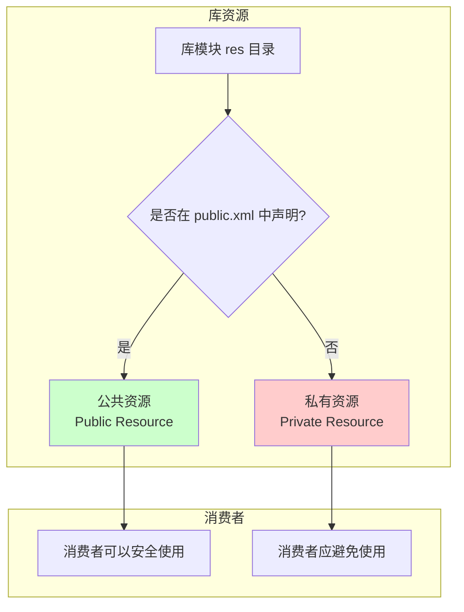
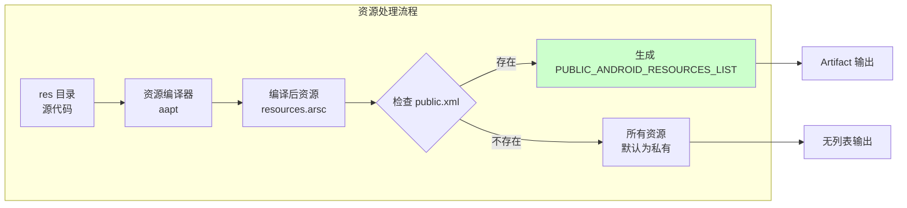
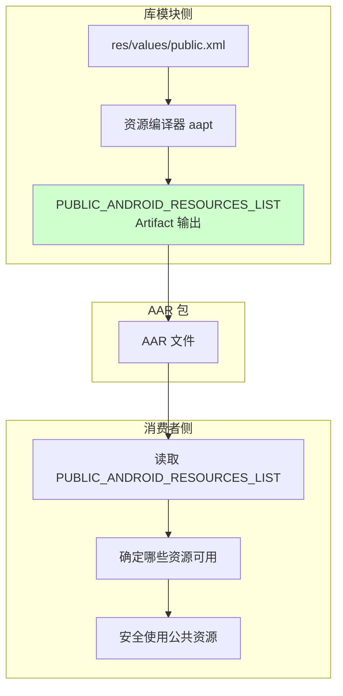

# 21.1.46 SingleArtifact.PUBLIC_ANDROID_RESOURCES_LIST——库的公开名片

深夜的露营地愈发安静了。

月亮升高了，银色的月光洒在帐篷上，给白色的帆布镀上了一层柔柔的光边。蟋蟀的鸣叫声依然在继续，但已经变得不那么密集，像是山野里最自然的催眠曲。远处的湖面在月光下泛着粼粼波光，偶尔有鱼儿跃出水面，溅起一小圈涟漪。

洛芙靠在折叠椅上，仰头看着星空。刚才黛琳讲的多DEX混淆映射分区让她学到了不少新东西，但她总觉得还有什么问题没问完。

“黛琳，”洛芙突然想到什么，转过身来，“你刚才说的都是代码方面的东西，那……资源呢？比如我们app里用的图片、字符串、样式这些，它们也会被混淆吗？”

黛琳正在收拾白板笔，听到这个问题，动作微微一顿，然后露出赞许的微笑。

“你问到点上了，”黛琳把白板笔盖好，走回来，“代码会混淆，但资源……资源有另一种保护机制，叫做'公开'。”

“公开？”洛芙眨眨眼，“资源还有公开不公开的说法？”

“对，”黛琳重新打开白板，“这就是我们今天要讲的内容——SingleArtifact.PUBLIC_ANDROID_RESOURCES_LIST，公共Android资源列表工件。”

---

## 资源的公开与私有：什么是公共资源

希尔听到这里，也凑了过来。

“这个问题其实很常见，”希尔说，“你们有没有遇到过这种情况——你用了一个第三方库，过了一段时间库更新了，结果你之前用的某个图片或者某个字符串ID突然不能用了？”

洛芙回忆了一下：“好像有……有一次我用一个图片加载库，之前它里面有个叫placeholder_image的资源，我直接用了，结果库一更新，那个资源就消失了，app直接崩溃了。”

“这就是因为那个资源是私有的，”希尔解释道，“私有资源随时可能被库作者删除或修改，而公共资源则是库作者保证会长期稳定存在的。”

伊莎端着一杯热可可走了过来，刚好听到这段对话。

“就像酒店的房间号一样呢，”伊莎轻声说，“有些房间是对客人公开的，永远不会变；但有些是员工才能用的内部房间，哪天重新装修就可能改编号。”

黛琳笑着点头：“伊莎的比喻很贴切。在Android中，库作者可以通过在res/values/public.xml文件中声明哪些资源是公共的，哪些是私有的。”

她在白板上画了一幅图：



“你们看，”黛琳指着图说，“在public.xml里声明过的资源就是公共资源，Android Gradle构建系统会生成一个PUBLIC_ANDROID_RESOURCES_LIST文件，记录所有公共资源的名字和ID。这样消费者就知道哪些资源是安全的，可以放心使用。”

---

## 公共资源列表的本质

洛芙好奇地问：“那这个PUBLIC_ANDROID_RESOURCES_LIST文件里面到底有什么呢？”

“问得好，”黛琳说，“我们来看一下它的结构。”

她示意希尔演示一下，希尔点点头，调出一个模拟的文件内容：

```
# public-resources.txt 示例内容
int string app_name 0x7f0e0001
int drawable ic_launcher 0x7f0f0001
int layout activity_main 0x7f030001
int color primary 0x7f050001
int style Theme_App 0x7f060001
```

“你们看，”希尔指着屏幕说，“每一行的格式是：类型 资源名 资源ID。比如第一行，string类型的app_name资源，它的ID是0x7f0e0001。”

伊莎歪着头看：“这个ID好像很眼熟……是不是我们在代码里用R.string.app_name引用的时候就是这个ID？”

“没错！”希尔打了个响指，“正是这个ID。所以PUBLIC_ANDROID_RESOURCES_LIST实际上就是一个'白名单'，告诉所有的消费者：'这些资源是库公开承诺会保留的，你们可以放心用。'”

黛琳补充道：“而且这个列表非常重要，因为它直接关系到库的API稳定性。如果一个库经常修改或删除公共资源，那它的使用者就会苦不堪言——每次更新都可能导致app崩溃。”

---

## 在构建中获取公共资源列表

洛芙跃跃欲试：“那我们怎么在构建过程中获取这个列表呢？”

“这就要用到Artifact API了，”黛琳说，“和之前获取混淆映射文件类似，我们可以通过Provider来获取PUBLIC_ANDROID_RESOURCES_LIST类型的输出。”

希尔再次演示具体的代码：

```kotlin
// 在 Android Gradle Plugin 中获取公共资源列表文件
abstract class PublicResourcesPlugin : Plugin<Project> {
    override fun apply(project: Project) {
        val androidExtension = project.extensions.getByType(LibraryExtension::class.java)
        
        androidExtension.onVariants(selector().all()) { variant ->
            val variantName = variant.name
            println("处理变体: $variantName")
            
            // 获取公共资源列表文件
            val publicResourcesList = variant.artifacts.get(
                SingleArtifact.PUBLIC_ANDROID_RESOURCES_LIST
            )
            
            // 读取并打印内容
            val file = publicResourcesList.asFile.get()
            println("公共资源列表位置: ${file.absolutePath}")
            
            // 解析公共资源
            file.readText().lines()
                .filter { it.isNotBlank() && !it.startsWith("#") }
                .forEach { line ->
                    val parts = line.split(" ")
                    if (parts.size >= 3) {
                        val type = parts[0]
                        val name = parts[1]
                        val id = parts[2]
                        println("  $type $name -> $id")
                    }
                }
        }
    }
}
```

洛芙看着代码：“感觉和我们之前获取混淆映射文件的方式差不多呢！”

“对，”黛琳点头，“Artifact API的用法都是统一的——先获取ArtifactType，然后通过Provider得到输出，最后读取文件内容。”

---

## 为什么要区分公共和私有资源

伊莎忽然问道：“那为什么不干脆把所有资源都公开呢？这样消费者不就可以用所有资源了吗？”

“这是个好问题，”黛琳解释说，“原因有几个。”

她在白板上列出几点：

1. **稳定性考虑**：私有资源是库的"内部实现"，随时可能改变。把它们全部公开意味着库的作者以后修改内部实现时会受到很大限制。

2. **减少依赖**：消费者应该依赖库的公开API，而不是内部实现。如果所有资源都公开，消费者可能会不自觉地用到不该用的资源，导致过度耦合。

3. **优化体积**：私有资源可以被进一步处理（比如重命名、压缩），而公共资源需要保持ID稳定，不能随意处理。

洛芙若有所思：“也就是说，公共资源相当于库的'正式API'，而私有资源相当于'内部实现细节'？”

“完全正确，”黛琳微笑着说，“这和代码中的public、private方法是一个道理。”

---

## 实际应用场景

希尔补充了一些实际使用场景：“其实这个机制在大型项目中特别有用。”

她举例说明：

“比如你做一个SDK给其他app用，这时候你就要仔细考虑哪些资源应该公开、哪些不应该。公开的资源要保证长期稳定，不能随随便便就改掉。”

“再比如你用别人的库，如果你发现某个资源不在PUBLIC_ANDROID_RESOURCES_LIST里，那就说明它是私有的，最好不要直接引用它。”

黛琳点头：“没错。很多app崩溃就是因为开发者直接用了库的私有资源，结果库一更新就挂了。正确的做法是只用公共资源，或者联系库作者请求把需要的资源加入公共列表。”

---

## 代码层：如何声明公共资源

洛芙好奇地问：“那如果我是一个库作者，怎么声明哪些资源是公共的呢？”

“这就要用到public.xml文件了，”黛琳说，“在库的res/values目录下创建public.xml，然后在里面列出所有要公开的资源。”

希尔演示了一个例子：

```xml
<!-- res/values/public.xml -->
<resources>
    <!-- 公开字符串资源 -->
    <public name="app_name" type="string" />
    <public name="welcome_message" type="string" />
    <public name="button_submit" type="string" />
    
    <!-- 公开图片资源 -->
    <public name="ic_launcher" type="drawable" />
    <public name="ic_placeholder" type="drawable" />
    
    <!-- 公开布局资源 -->
    <public name="activity_main" type="layout" />
    <public name="dialog_loading" type="layout" />
    
    <!-- 公开样式资源 -->
    <public name="Theme_App" type="style" />
    <public name="Button_Primary" type="style" />
</resources>
```

“你们看，”希尔指着代码说，“格式很简单，就是public标签加上资源名和类型。没有列在里面的资源就是私有的。”

洛芙恍然大悟：“原来是这样！那如果我想用某个库的资源，但不确定它是不是公共的，就可以查PUBLIC_ANDROID_RESOURCES_LIST文件！”

“对，”黛琳笑着说，“这就是这个Artifact类型的价值所在——它提供了一个明确的'安全使用清单'。”

---

## 与资源编译的关联

伊莎忽然想到一个问题：“那这个列表是什么时候生成的呢？是在资源编译之前还是之后？”

“问得很深入，”黛琳赞许地说，“实际上，这个列表是在资源编译器处理完所有资源之后生成的。”

她在白板上画出了资源处理的流程：



“你们看，”黛琳指着图说，“资源编译器aapt会检查public.xml文件。如果存在，就生成公共资源列表；如果不存在，那么默认所有资源都是私有的。”

希尔补充道：“而且这个列表生成之后，会被打包进AAR文件里，供消费者使用。”

---

## 反模式：滥用私有资源

黛琳特意强调了一个常见的错误做法：“很多开发者会直接用反射或者其他方式去访问库的私有资源，觉得这样很方便。但这其实是非常危险的做法。”

她在白板上写了一个反例：

```kotlin
// 反模式：直接访问私有资源
fun getPrivateDrawable(context: Context): Drawable? {
    // 私有资源的ID不在PUBLIC_ANDROID_RESOURCES_LIST中
    // 这种做法随时可能崩溃
    val privateId = 0x7f0f0002  // 假设这是私有资源的ID
    return context.getDrawable(privateId)
}

// 正确的做法：只使用公共资源
fun getPublicDrawable(context: Context): Drawable? {
    // 从R类中引用公共资源，ID是稳定的
    return context.getDrawable(R.drawable.ic_launcher)
}
```

洛芙看到这里，连连点头：“我以后再也不随便用库的私有资源了！”

---

## 章节总结：公共资源列表的意义

夜色更深了，月亮已经挂到了头顶的位置。远处的山轮廓模糊，只能看到黑黢黢的剪影。风变得更凉了，吹得帐篷的帆布轻轻晃动。

黛琳总结道：“今天我们学习了SingleArtifact.PUBLIC_ANDROID_RESOURCES_LIST，它代表了库模块中公开声明的公共资源列表。这个列表相当于库的'公开API清单'，告诉消费者哪些资源是稳定可用的。”

“公共资源和私有资源的区分，”伊莎轻声说，“就像人与人之间的界限。有些东西是愿意分享给大家的，有些是自己私密的。尊重这个界限，大家才能和谐共处呢。”

希尔笑着说：“伊莎总是能说出很有哲理的话呢！”

洛芙看着星空，心中若有所思。今天学到的不仅仅是技术知识，更是一种设计思想——如何优雅地暴露自己的API，同时保护内部实现。

---

> 本章核心技术总结见下方

---

#### 结构图



#### 复杂度与影响

- 公共资源列表本身是一个文本文件，解析简单，对构建性能影响可忽略
- 正确使用公共资源可以显著降低因库更新导致的app崩溃风险
- 私有资源虽然可以访问，但存在高风险，不建议依赖

#### 反模式与陷阱

1. **直接使用私有资源ID**：通过硬编码或反射访问不在PUBLIC_ANDROID_RESOURCES_LIST中的资源 → 修复：只使用R类中引用的公共资源
2. **不声明public.xml**：库作者不声明公共资源，导致消费者无法判断哪些可用 → 修复：在res/values/public.xml中明确列出所有要公开的资源
3. **随意修改公共资源**：库作者频繁修改公共资源的名称或ID → 修复：遵循语义化版本，公共资源变更需要major版本升级

#### 设计哲学

- **最小暴露原则**：只公开必要的资源，其余保持私有
- **稳定性承诺**：一旦声明为公共资源，就应该长期保持兼容
- **消费者保护**：通过明确的公共资源列表，帮助消费者安全使用库资源

#### 动手练习

**项目目标**：创建一个包含公共资源声明的Android库模块，并验证PUBLIC_ANDROID_RESOURCES_LIST的生成

**Task 1：创建库模块**
- 目标：创建一个Android库模块
- 步骤：File → New → New Module → Android Library → 输入模块名（如 mylibrary）
- 验收标准：[ ] 库模块创建成功 [ ] build.gradle 中有 apply plugin: 'com.android.library'

**Task 2：添加资源文件**
- 目标：在库中添加字符串、图片、布局等资源
- 步骤：
  1. 在 res/values/strings.xml 中添加字符串资源
  2. 在 res/drawable/ 添加图片资源（可用shape drawable）
  3. 在 res/layout/ 添加布局文件
- 验收标准：[ ] 至少3种类型的资源 [ ] 资源可以正常编译

**Task 3：创建 public.xml 声明公共资源**
- 目标：声明部分资源为公共资源
- 步骤：
  1. 创建 res/values/public.xml
  2. 在其中声明要公开的资源（名称和类型）
- 验收标准：[ ] public.xml 文件存在 [ ] 至少声明3个公共资源

**Task 4：构建并检查输出**
- 目标：验证PUBLIC_ANDROID_RESOURCES_LIST的生成
- 步骤：
  1. 执行 ./gradlew :mylibrary:assembleDebug
  2. 在 build/intermediates/library_public_resources/ 目录下查找输出文件
- 验收标准：[ ] 构建成功 [ ] 找到 PUBLIC_ANDROID_RESOURCES_LIST 文件 [ ] 文件内容包含之前声明的公共资源

**Task 5：编写测试用例验证**
- 目标：通过代码读取并验证公共资源列表
- 步骤：
  1. 在库的 build.gradle 中添加代码读取 Artifact
  2. 打印公共资源列表内容
- 验收标准：[ ] 代码能成功运行 [ ] 打印出的资源列表与 public.xml 声明一致

**面试热身**

- Q1：请解释Android中公共资源与私有资源的区别
- Q2：为什么库作者应该谨慎声明公共资源？
- Q3：如果消费者使用了库的私有资源，可能会有什么风险？
- Q4：请描述public.xml文件的格式和作用
- Q5：如何判断一个库资源是否适合在生产环境中使用？

#### 参考实现要点

1. 库模块应该始终包含public.xml，明确声明公共资源
2. 消费者应该优先使用R类引用资源，而非直接使用ID数字
3. 使用库时，可以从AAR中解压出PUBLIC_ANDROID_RESOURCES_LIST查看可用资源
4. 公共资源的ID在库的不同版本间应保持稳定（这是库的承诺）
5. 如果必须使用某个私有资源，考虑fork库并自行修改，或联系作者请求公开

---

> **学习建议**：公共资源列表是库模块开发中的重要概念，掌握它有助于设计稳定、可维护的Android库。建议读者在日常开发中养成习惯——使用任何第三方库时，先查看其公共资源列表，确认要使用的资源是否在"白名单"中。

洛芙裹紧外套，夜风越来越凉了。她抬头看着星空，心里想着：原来一个简单的资源也有这么多门道。看来做任何事情都不能随随便便，要像这些资源一样，有明确的"公开"和"界限"呢。

---

# 洛芙的小小日记本

今天学到了资源的公开与私有！黛琳说公共资源就像库的"正式名片"，只有公开的资源才能放心使用。以后用第三方库的时候，要记得检查它的PUBLIC_ANDROID_RESOURCES_LIST，可不能再随便乱用私有资源啦！尊重界限，大家才能愉快地玩耍呀~

---

# 今日关键词

- **SingleArtifact.PUBLIC_ANDROID_RESOURCES_LIST**：Android Gradle Plugin中的Artifact类型，代表库模块的公共资源列表文件
- **公共资源（Public Resource）**：在public.xml中明确声明的资源，库作者承诺长期稳定
- **私有资源（Private Resource）**：未在public.xml中声明的资源，属于库的内部实现，可能随时变化
- **public.xml**：库模块中用于声明公共资源的配置文件，位于res/values/目录
- **AAR**：Android Archive，Android库的打包格式，包含编译后的代码和资源
- **aapt**：Android Asset Packaging Tool，Android资源打包工具，负责编译资源和生成列表
- **资源ID**：Android中用于唯一标识资源的整数值，格式为0x7fxxxxxx
- **Artifact API**：Android Gradle Plugin提供的API，用于获取构建过程中的各种输出文件
- **Provider**：Artifact API中用于获取Artifact输出的接口
- **R类**：Android编译时自动生成的资源引用类，包含所有资源的静态常量
