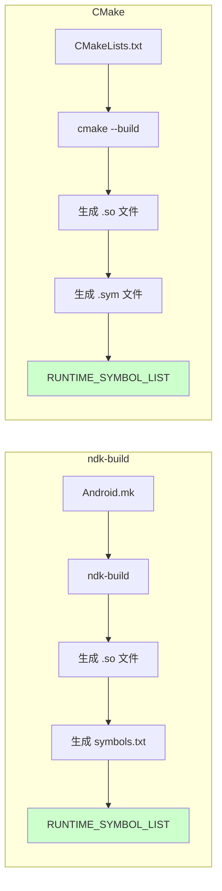
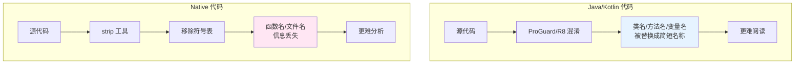
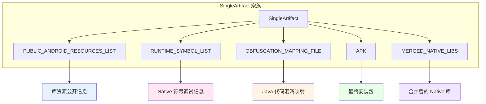
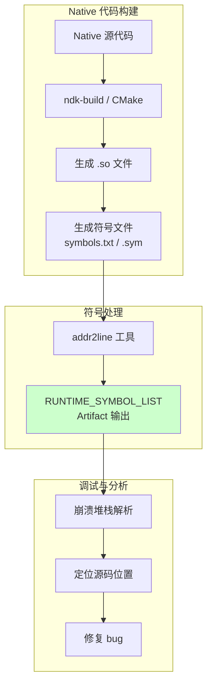

# 21.1.47 SingleArtifact.RUNTIME_SYMBOL_LIST——调试与分析的密码本

深夜的营地愈发宁静了。

月亮升高了，银色的月光如水般倾泻在帐篷上，给白色的帆布镀上了一层柔和的光边。蟋蟀的鸣叫声依然在继续，但已经变得不那么密集，像是山野里最自然的催眠曲。洛芙靠在折叠椅上，仰头看着星空，脑海里还在回味刚才学的公共资源知识。

“黛琳，”洛芙突然想到什么，转过身来，“你刚才说的都是关于资源的，那……如果是代码呢？比如我们app里用的native代码，那些C/C++的函数，它们也会有什么列表吗？”

黛琳正在收拾白板笔，听到这个问题，动作微微一顿，然后露出赞许的微笑。

“你问到更深入的问题了，”黛琳把白板笔盖好，走回来，“代码层面的东西确实有另一套机制。今天我们要讲的内容就和这个有关——SingleArtifact.RUNTIME_SYMBOL_LIST，运行时符号列表工件。”

---

## 从代码到符号：什么是运行时符号

希尔听到这里，也凑了过来。

“这个问题问得好，”希尔说，“你们有没有遇到过app崩溃的时候，看Logcat上的堆栈信息，结果显示的是一堆十六进制地址，根本看不懂在哪个函数崩溃的？”

洛芙回忆了一下：“有！有一次我的app在native层崩溃了，Logcat上全是类似这样的内容——libnative-lib.so 0x00001234这样的地址，完全不知道发生了什么。”

“那就是因为没有符号表，”希尔解释道，“运行时符号列表就是解决这个问题的——它记录了所有native函数的名称、地址等信息，相当于一个'密码本'，可以把那些十六进制地址翻译成我们能看懂的函数名。”

伊莎端着一杯热可可走了过来，刚好听到这段对话。

“就像破译密码一样呢，”伊莎轻声说，“一堆乱码有了密码本，就能变成有意义的信息。”

黛琳笑着点头：“伊莎的比喻很贴切。在Android构建系统中，RUNTIME_SYMBOL_LIST就是这样的'密码本'，记录了native代码的符号信息。”

她在白板上画了一幅图：

```mermaid
flowchart TD
    subgraph 没有符号表
        A[Native 崩溃] --> B[Logcat 输出]
        B --> C[&#35;00 pc 00001234 libnative-lib.so]
        C --> D[无法理解]
    end
    
    subgraph 有符号表
        E[Native 崩溃] --> F[Logcat 输出]
        F --> G[&#35;00 pc 00001234 libnative-lib.so]
        G --> H[符号表解码]
        H --> I[&#35;00 pc 00001234 libnative-lib.so<br/>com_example_MainActivity_nativeInit<br/>native-lib.cpp:42]
    end
    
    style H fill:#ccffcc
    style I fill:#ccffcc
```



“你们看，”黛琳指着图说，“有了符号表，那些十六进制地址就能被翻译成具体的函数名、文件名和行号，调试起来就方便多了。”

---

## 运行时符号列表的本质

洛芙好奇地问：“那这个RUNTIME_SYMBOL_LIST文件里面到底有什么呢？”

“问得好，”黛琳说，“我们来看一下它的结构。”

她示意希尔演示一下，希尔点点头，调出一个模拟的文件内容：

```
# RUNTIME_SYMBOL_LIST 示例内容
# 格式：地址 函数名 文件名:行号
0x00001234 Java_com_example_MainActivity_nativeInit native-lib.cpp:42
0x00001280 Java_com_example_Utils_processData native-lib.cpp:68
0x00001300 __android_log_print native-log.cpp:15
0x00001350 _ZN7android11RefBaseRefNative:onFirstRef native-ref.cpp:32
```

“你们看，”希尔指着屏幕说，“每一行的格式是：地址 函数名 源文件:行号。这样我们就能精确定位到崩溃发生在哪个函数的哪一行。”

伊莎歪着头看：“这些函数名好长啊……前面好像都是Java_开头的？”

“对，”希尔解释道，“这是JNI函数的命名规则。Java_前缀后面跟着完整的包名和类名，最后是native方法的名称。这样JVM才能正确找到对应的native函数。”

黛琳补充道：“而且你们注意到没有，有些符号前面有下划线，有些还有很长的后缀——这些是C++的name mangling（名字改编），用来支持函数重载的。”

---

## 在构建中获取运行时符号列表

洛芙跃跃欲试：“那我们怎么在构建过程中获取这个列表呢？”

“这就要用到Artifact API了，”黛琳说，“和之前获取公共资源列表类似，我们可以通过Provider来获取RUNTIME_SYMBOL_LIST类型的输出。”

希尔再次演示具体的代码：

```kotlin
// 在 Android Gradle Plugin 中获取运行时符号列表文件
abstract class SymbolListPlugin : Plugin<Project> {
    override fun apply(project: Project) {
        val androidExtension = project.extensions.getByType(LibraryExtension::class.java)
        
        androidExtension.onVariants(selector().all()) { variant ->
            val variantName = variant.name
            println("处理变体: $variantName")
            
            // 获取运行时符号列表文件
            val symbolList = variant.artifacts.get(
                SingleArtifact.RUNTIME_SYMBOL_LIST
            )
            
            // 读取并打印内容
            val file = symbolList.asFile.get()
            println("运行时符号列表位置: ${file.absolutePath}")
            
            // 解析符号列表
            file.readText().lines()
                .filter { it.isNotBlank() && !it.startsWith("#") }
                .forEach { line ->
                    val parts = line.split(" ")
                    if (parts.size >= 2) {
                        val address = parts[0]
                        val symbol = parts[1]
                        val location = if (parts.size > 2) parts[2] else "unknown"
                        println("  $address: $symbol ($location)")
                    }
                }
        }
    }
}
```

洛芙看着代码：“感觉和我们之前获取公共资源列表的方式差不多呢！”

“对，”黛琳点头，“Artifact API的用法都是统一的——先获取ArtifactType，然后通过Provider得到输出，最后读取文件内容。”

---

## 符号信息的来源：ndk-build 与 CMake

伊莎忽然问道：“那这些符号信息是从哪里来的呢？是自动生成的吗？”

“这是个好问题，”黛琳解释说，“符号信息的生成和构建系统有关——ndk-build和CMake生成符号的方式不太一样。”

她在白板上画出两种构建系统的对比：



希尔补充道：“ndk-build会生成一个symbols.txt文件，而CMake会生成.sym文件。这些文件里面包含了所有符号的地址和名称信息。”

“那它们是怎么变成RUNTIME_SYMBOL_LIST的呢？”洛芙问。

“Android Gradle Plugin会自动处理这个转换，”黛琳说，“它会调用相应的工具（llvm-addr2line或者arm-linux-androideabi-addr2line）来解析符号，然后把结果输出为RUNTIME_SYMBOL_LIST。”

---

## 为什么要区分调试符号与发布版本

伊莎忽然想到一个问题：“那为什么不干脆在发布版本里也保留完整的符号信息呢？这样调试起来多方便啊。”

“这是因为符号信息会暴露代码细节，”黛琳解释说，“如果在正式发布的产品里保留了完整符号，攻击者就能轻易分析你的代码逻辑，这就相当于把源代码直接送给别人。”

她在白板上列出几点：

1. **安全性考虑**：发布版本去掉符号（strip）可以防止逆向工程
2. **体积优化**：符号表文件可能很大，去掉可以显著减小APK体积
3. **性能考虑**：运行时不需要加载额外的符号信息

洛芙若有所思：“也就是说，符号表是给开发者用的，而发布版本要'脱掉'这层衣服？”

“完全正确，”黛琳微笑着说，“调试版本保留完整符号，方便开发调试；发布版本去掉符号，减小体积并保护代码安全。”

---

## 实际应用场景

希尔补充了一些实际使用场景：“其实这个RUNTIME_SYMBOL_LIST在很多场景下都很有用。”

她举例说明：

“比如你做native开发的时候，每次崩溃都可以用符号表来定位问题。这在开发阶段非常重要。”

“再比如你集成第三方native库，遇到了崩溃，用它的符号表就能快速定位问题。”

黛琳点头：“没错。很多公司会保存每一版APK对应的符号表文件，这样线上崩溃时就能用对应的符号表来解析堆栈，快速定位问题。”

---

## 代码层：如何使用符号表进行调试

洛芙好奇地问：“那具体怎么用这个符号表来调试呢？”

“这就要用到addr2line工具了，”黛琳说，“它可以把地址翻译成文件名和行号。”

希尔演示了一个例子：

```bash
# 使用 addr2line 将地址翻译成源码位置
# 语法：addr2line -e <so文件路径> <地址>

# 示例：addr2line -e libnative-lib.so 0x00001234
# 输出：native-lib.cpp:42

# 在实际项目中，可以批量处理
cat symbols.txt | while read addr symbol file; do
    echo "$addr $symbol"
    arm-linux-androideabi-addr2line -e libnative-lib.so $addr
done
```

洛芙看着命令：“感觉好专业啊……有没有更简单的方式？”

“有，”黛琳笑着说，“现在Android Studio已经内置了符号解析功能，你在Logcat里看到的崩溃堆栈会自动翻译成源码位置。但如果你用的是命令行或者处理dump文件，就需要手动用符号表了。”

---

## 符号表与 ProGuard/R8 的关系

伊莎忽然想到一个问题：“我之前学过ProGuard可以混淆Java代码，那native代码也需要混淆吗？”

“这是两个不同的概念，”黛琳解释说，“ProGuard/R8主要处理Java/Kotlin代码的混淆，而native代码的混淆通常是通过移除符号表来实现的。”

她在白板上画出了对比：



希尔补充道：“而且Java代码即使混淆了，如果有mapping文件就能还原；但native代码的符号一旦被strip，就很难恢复了。”

---

## 反模式：不保存符号表

黛琳特意强调了一个常见的错误做法：“很多开发者开发完成后就把符号表删掉了，结果线上崩溃时欲哭无泪。”

她在白板上写了一个反例：

```kotlin
// 反模式：发布版本时不保存符号表
android.buildTypes.release {
    // 正确：应该保留符号表用于调试
    // ndk {
    //     debugSymbolLevel = 'symbols'  // ← 不要这样配置
    // }
    
    // 错误：完全丢弃符号表
    ndk {
        debugSymbolLevel = 'none'  // ← 这样会导致无法调试
    }
}

// 正确做法：保存符号表到指定位置
android.buildTypes.release {
    ndk {
        // 生成符号表文件
        debugSymbolLevel = 'full'
    }
    
    // 或者手动保存
    tasks.withType<BuildSymbolTableTask> {
        destinationDir = file("${projectDir}/symbols/${variant.name}")
    }
}
```

洛芙看到这里，连连点头：“我以后发布版本时一定要记得保存符号表！”

---

## 与其他 Artifact 的关系

伊莎好奇地问：“那这个RUNTIME_SYMBOL_LIST和之前学的其他Artifact有什么联系吗？”

“好问题，”黛琳说，“它们都是SingleArtifact家族的一员，但用途各不相同。”

她在白板上列出对比：



“你们看，”黛琳指着图说，“每个Artifact都有自己的用途。RUNTIME_SYMBOL_LIST专门用于native代码的调试和分析。”

---

## 章节总结：运行时符号列表的意义

夜色更深了，月亮已经挂到了头顶的位置。远处的山轮廓模糊，只能看到黑黢黢的剪影。风变得更凉了，吹得帐篷的帆布轻轻晃动。

黛琳总结道：“今天我们学习了SingleArtifact.RUNTIME_SYMBOL_LIST，它代表了应用或库的运行时符号列表。这个列表相当于native代码的'调试密码本'，可以把抽象的内存地址翻译成具体的函数名和行号。”

“符号信息就像星空一样呢，”伊莎轻声说，“白天看不见，但夜晚迷路的时候，它能指引我们找到方向。”

希尔笑着说：“伊莎总是能说出很有哲理的话呢！”

洛芙看着星空，心中若有所思。今天学到的不仅仅是技术知识，更是一种工程思想——开发时保留完整信息，发布时适当隐藏，但永远保存好"还原密码"，以备不时之需。

---

> 本章核心技术总结见下方

---

#### 结构图



#### 复杂度与影响

- 运行时符号列表是一个文本文件，解析简单
- 完整符号表文件可能较大（MB级别），对构建性能和APK体积有影响
- 正确保留符号表可以显著提高崩溃调试效率
- 发布版本去掉符号可以减小APK体积并提高安全性

#### 反模式与陷阱

1. **发布版本不保存符号表**：导致线上崩溃无法定位 → 修复：始终保存符号表到版本管理系统或指定位置
2. **使用错误版本的符号表**：用旧版本的符号表解析新版本的崩溃 → 修复：确保符号表与APK版本一一对应
3. **混淆native代码但不处理符号**：native代码被strip后无法调试 → 修复：保留符号表用于调试，同时在发布版本中移除

#### 设计哲学

- **开发与发布分离**：开发时保留完整信息便于调试，发布时适当隐藏保护安全
- **可追溯性**：每一个发布版本都应该有对应的符号表，便于问题追溯
- **最小暴露**：发布版本不暴露符号信息，但内部保存完整信息用于调试

#### 动手练习

**项目目标**：创建一个包含native代码的Android项目，生成并验证RUNTIME_SYMBOL_LIST

**Task 1：创建支持native的项目**
- 目标：创建一个包含native代码的Android项目
- 步骤：
  1. File → New → New Project → 选择 "Native C++" 模板
  2. 配置项目名称和包名
- 验收标准：[ ] 项目创建成功 [ ] 包含 cpp 目录和 CMakeLists.txt

**Task 2：编写 native 函数**
- 目标：添加自定义的native函数用于测试
- 步骤：
  1. 在 cpp/native-lib.cpp 中添加新函数
  2. 在 Java/Kotlin 中声明 native 方法
  3. 在 static{} 块中加载 native 库
- 验收标准：[ ] native 代码编译成功 [ ] Java/Kotlin 能调用 native 方法

**Task 3：配置构建生成符号表**
- 目标：配置构建生成运行时符号列表
- 步骤：在 build.gradle 中添加：
  ```groovy
  android.buildTypes.debug {
      ndk {
          debugSymbolLevel = 'full'
      }
  }
  ```
- 验收标准：[ ] 构建配置成功 [ ] 不报语法错误

**Task 4：构建并检查输出**
- 目标：验证RUNTIME_SYMBOL_LIST的生成
- 步骤：
  1. 执行 ./gradlew assembleDebug
  2. 在 build/intermediates/ndk/ 目录下查找符号文件
- 验收标准：[ ] 构建成功 [ ] 找到符号表文件 [ ] 文件包含native函数信息

**Task 5：使用符号表进行地址翻译**
- 目标：练习使用addr2line工具翻译地址
- 步骤：
  1. 记录一个native函数的地址
  2. 使用 addr2line 工具翻译地址
  3. 验证输出是否指向正确源码位置
- 验收标准：[ ] addr2line 命令执行成功 [ ] 输出包含正确的文件名和行号

**Task 6：保存符号表用于发布版本**
- 目标：为发布版本配置符号表保存
- 步骤：在 build.gradle 中添加保存符号表的逻辑
- 验收标准：[ ] 符号表被保存到指定目录 [ ] 文件命名包含版本信息

**面试热身**

- Q1：请解释运行时符号列表的作用是什么
- Q2：为什么发布版本要去掉符号表？
- Q3：如何将一个十六进制地址翻译成源码位置？
- Q4：ndk-build 和 CMake 生成的符号文件有什么区别？
- Q5：如果线上崩溃没有对应版本的符号表，还能定位问题吗？

#### 参考实现要点

1. 开发版本应始终保留完整符号表（debugSymbolLevel = 'full'）
2. 发布版本应该去掉符号以减小体积和提高安全性
3. 符号表应该与APK一起版本化管理，确保每个发布版本都有对应的符号表
4. 使用 addr2line 工具进行地址翻译时，需要使用正确版本的 .so 文件
5. Android Studio 的 Logcat 会自动解析崩溃堆栈，但处理 raw dump 文件时需要手动使用符号表

---

> **学习建议**：运行时符号列表是native开发中的重要概念，掌握它有助于快速定位和解决native层的崩溃问题。建议读者在日常开发中养成习惯——每次发布新版本时，都保存好对应的符号表，以备线上问题排查之用。

洛芙裹紧外套，夜风越来越凉了。她抬头看着星空，心里想着：原来native代码也有这么多门道。开发的时候要保留完整信息，发布的时候要学会隐藏，但关键时候要有"还原密码"——这不仅是做技术，也是做人的道理呢。

---

# 洛芙的小小日记本

今晚学到了RUNTIME_SYMBOL_LIST！黛琳说这个就像native代码的"调试密码本"，可以把那些看不懂的十六进制地址翻译成能看懂的函数名和行号。以后遇到native崩溃就不用抓瞎啦！不过要记得保存符号表哦，不然发布后就找不到"密码本"了~

---

# 今日关键词

- **SingleArtifact.RUNTIME_SYMBOL_LIST**：Android Gradle Plugin中的Artifact类型，代表运行时符号列表文件
- **运行时符号（Runtime Symbol）**：native代码中的函数名、地址等信息，用于调试定位
- **符号表（Symbol Table）**：记录符号信息的表，包含地址到函数名的映射
- **addr2line**：将内存地址翻译成源码文件名和行号的工具
- **JNI（Java Native Interface）**：Java/Kotlin与native代码互调的接口
- **name mangling**：C++的函数名改编，用于支持函数重载
- **strip**：移除符号表的操作，用于减小体积和保护代码
- **ndk-build**：Android NDK的构建系统
- **CMake**：跨平台的构建系统，Android NDK也支持
- **native 代码**：使用C/C++等语言编写的代码，运行在Android设备的native层
- **debugSymbolLevel**：控制符号表生成级别的构建配置选项
- **Artifact API**：Android Gradle Plugin提供的API，用于获取构建过程中的各种输出文件
- **Provider**：Artifact API中用于获取Artifact输出的接口
