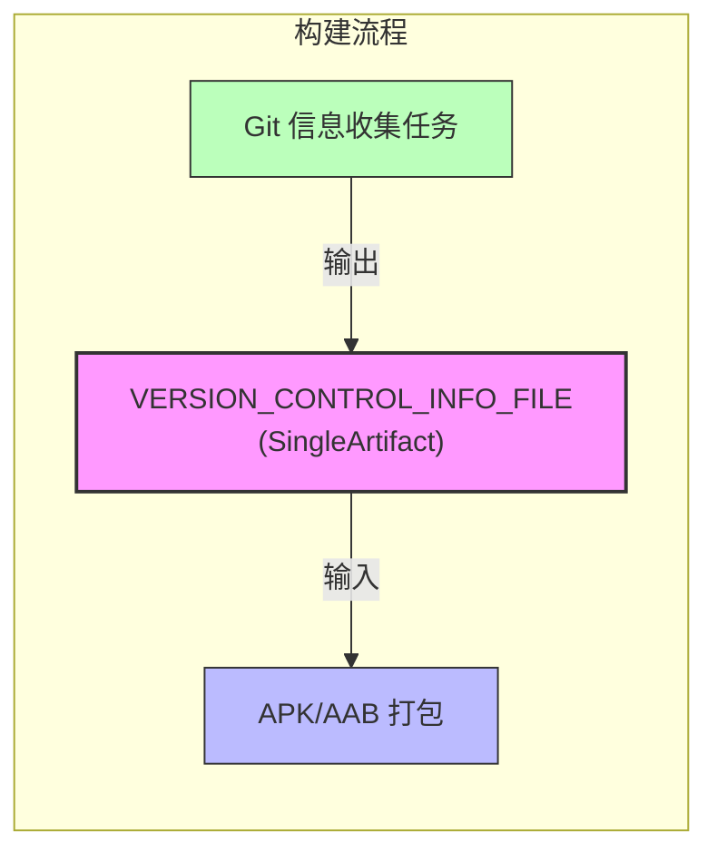
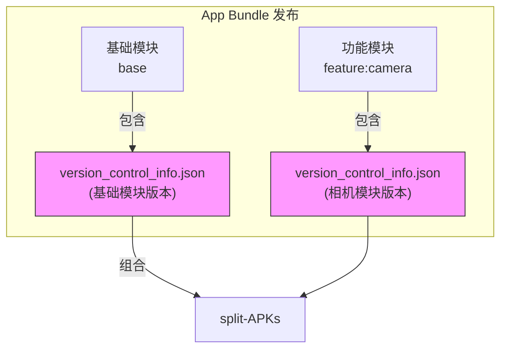

# 21.1.48 SingleArtifact.VERSION_CONTROL_INFO_FILE

夜空像一块缀满碎钻的天鹅绒，沉甸甸地压在头顶。蟋蟀的鸣叫此起彼伏，像是一首永不停歇的夏日交响曲。营火已经燃成了温热的炭火，映照着四张专注的脸庞。

黛琳轻轻拨弄着炭火，一块小木炭发出轻微的爆裂声，火星子打着旋儿飘向夜空。

“昨天我们讲了运行时符号列表，”黛琳抬起头，眼里映着橘红色的火光，“今天我们来聊聊另一个很有意思的工件——版本控制信息文件。”

“版本控制？”洛芙眨了眨眼，“是说 Git 吗？”

“对，就是你想的那个。”希尔不知道什么时候掏出了笔记本，屏幕的蓝光在黑暗中格外明显，“不过我们今天要聊的，不是你日常写代码时用的 Git，而是构建时自动收集的版本信息——它会被打包进 APK 里。”

伊莎歪着头，手指绕着一缕发丝：“可是……为什么要把版本信息打包进 App 里呢？”

“这是个好问题。”黛琳微微一笑，“想象一下——线上 App 出了问题，用户报错说'闪退'，你作为开发者，怎么知道是哪个版本的代码出的问题？”

“查日志？”洛芙说。

“如果有日志的话。”黛琳点点头，又摇摇头，“但很多线上问题，用户根本不会给你日志。那时候，如果你能在 App 里看到构建时的 Git commit hash，你就可以精准地定位到那一行代码。”

“所以——”希尔接过话头，兴奋地敲了一下键盘，“VERSION_CONTROL_INFO_FILE 就是用来干这个的！它会把构建时的版本信息——比如 Git commit hash、branch name、构建时间——全部记录下来，打包进 APK。”

她把笔记本转过来给大家看，屏幕上显示着一段代码：

```kotlin
// 在 Android Gradle Plugin 中访问 VERSION_CONTROL_INFO_FILE
// 这是一个 SingleArtifact 类型的工件

abstract class VersionInfoTask : DefaultTask() {
    @get:OutputFile
    abstract val versionInfoFile: RegularFileProperty

    @TaskAction
    fun collectVersionInfo() {
        // 获取 Git 信息
        val gitCommitHash = "git rev-parse HEAD".execute().stdout.trim()
        val gitBranch = "git rev-parse --abbrev-ref HEAD".execute().stdout.trim()
        val buildTime = System.currentTimeMillis().toString()
        
        // 写入版本信息文件
        val content = """
            |commit=$gitCommitHash
            |branch=$gitBranch
            |buildTime=$buildTime
        """.trimMargin()
        
        versionInfoFile.get().asFile.writeText(content)
    }
}
```

“等等，”洛芙凑近屏幕，“这看起来像是自定义的一个任务啊？VERSION_CONTROL_INFO_FILE 本身呢？”

黛琳笑着摇头：“你问得很精准。VERSION_CONTROL_INFO_FILE 本身其实不是一个现成的东西——它是一个工件类型的标记。Android Gradle Plugin 定义了这个artifact类型，你可以把自己的版本信息任务挂载到这个类型上。”

她从背包里掏出一张叠好的纸，展开来是一张手绘的架构图。火光摇曳中，可以看到图上画着几个方框，用箭头连在一起。

“看这里，”黛琳指着图说，“这是构建流程。左边是 Gradle 任务，右边是生成的 APK。在中间这个地方，”她点了点两个区域之间的空白处，“就是 Artifacts API 的天下。”



“原来如此！”洛芙恍然大悟，“所以 VERSION_CONTROL_INFO_FILE 就像是一个'接口’——你把符合这个接口的工件挂上去，它就会被自动打包进 APK？”

“Exactly！”希尔打了个响指，“这就是 SingleArtifact 的精髓——它定义了一种artifact类型，你可以往上面挂载任何符合规范的输出。Android Gradle Plugin 会帮你把它放到正确的位置。”

伊莎轻轻拍了拍手，像是在欢迎一个老朋友：“所以，它就像露营时的'标记旗’——插在那里，就知道这一队人是从哪儿来的、什么时候到这里的。”

“对！这个比喻太贴切了。”黛琳笑着说，“VERSION_CONTROL_INFO_FILE 就是那面旗子——它插在 APK 这座'营地'里，记录着'我们是哪一天、从哪个分支出发的'。”

“那……这个工件具体包含什么信息呢？”洛芙问。

希尔重新敲了几下键盘，调出一段更详细的代码：

```kotlin
// 定义一个提供 VERSION_CONTROL_INFO_FILE 的任务
abstract class VersionControlInfoProvider : DefaultTask() {
    
    @get:OutputFile
    @get:Artifact(
        type = SingleArtifact.VERSION_CONTROL_INFO_FILE,
        architecture = Artifact.Architecture.ALL
    )
    abstract val outputFile: RegularFileProperty
    
    @TaskAction
    fun generate() {
        val gitProperties = mutableMapOf<String, String>()
        
        // 收集 Git 信息
        try {
            gitProperties["git.commit.hash"] = 
                "git rev-parse HEAD".execute().stdout.trim().take(7)
            gitProperties["git.branch"] = 
                "git rev-parse --abbrev-ref HEAD".execute().stdout.trim()
            gitProperties["git.commit.count"] = 
                "git rev-list --count HEAD".execute().stdout.trim()
            gitProperties["git.commit.author"] = 
                "git log -1 --format=%an".execute().stdout.trim()
            gitProperties["git.commit.date"] = 
                "git log -1 --format=%ai".execute().stdout.trim()
        } catch (e: Exception) {
            // Git 不可用时提供默认值
            gitProperties["git.commit.hash"] = "unknown"
            gitProperties["git.branch"] = "unknown"
        }
        
        // 添加构建信息
        gitProperties["build.timestamp"] = System.currentTimeMillis().toString()
        gitProperties["build.gradle.version"] = project.gradle.gradleVersion
        gitProperties["build.plugin.version"] = 
            project.plugins.findPlugin("com.android.application")?.let {
                (it as? com.android.build.gradle.BasePlugin)
                    ?.analyticsService?.get()?.buildId ?: "unknown"
            }
        
        // 写入 JSON 格式的文件
        val json = gitProperties.entries.joinToString(",\n") { 
            "\"${it.key}\": \"${it.value}\"" 
        }
        outputFile.get().asFile.writeText("{\n$json\n}")
    }
}
```

“哇，信息好全啊！”洛芙惊叹道，“连 commit 作者和日期都有。”

“这样一来，”黛琳补充道，“线上 App 崩溃时，你只需要让用户在反馈里附带这个文件，或者 App 自动上报，你就能知道——'哦，原来是昨天那个 commit 引入的问题'。”

伊莎托着腮帮子，若有所思：“那它和普通的 buildConfigField 有什么区别呢？我记得 buildConfig 也能放版本信息啊。”

“好问题！”希尔点点头，“buildConfig 是编译期常量，适合放一些不太会变的信息，比如 versionName、versionCode。但 VERSION_CONTROL_INFO_FILE 不一样——它是构建时动态生成的，每次构建都会更新，而且可以包含更多信息。”

```kotlin
// 对比：buildConfig vs VERSION_CONTROL_INFO_FILE

// buildConfig - 编译期静态配置
buildConfigField "String", "VERSION_NAME", "\"1.0.0\""
buildConfigField "int", "VERSION_CODE", "1"

// VERSION_CONTROL_INFO_FILE - 构建时动态生成
// 每次 git commit 变化时都会自动更新
// 包含：完整 commit hash、分支名、提交次数、构建时间等
// 适合：问题排查、审计追踪
```

“所以，”黛琳总结道，“如果你只是想在 UI 上显示'当前版本 1.0.0'，用 buildConfig 就够了。但如果你要做线上问题的根因分析，VERSION_CONTROL_INFO_FILE 是更好的选择。”

“那……怎么在代码里读取这个文件呢？”洛芙问。

希尔又敲了一段代码：

```kotlin
// Android 应用中读取 VERSION_CONTROL_INFO_FILE
class VersionInfoManager(private val context: Context) {
    
    data class VersionInfo(
        val commitHash: String,
        val branch: String,
        val buildTimestamp: Long,
        val commitCount: String,
        val commitAuthor: String
    )
    
    fun getVersionInfo(): VersionInfo? {
        return try {
            // 读取 assets 目录下的版本信息文件
            val inputStream = context.assets.open("version_control_info.json")
            val json = inputStream.bufferedReader().use { it.readText() }
            val root = org.json.JSONObject(json)
            
            VersionInfo(
                commitHash = root.optString("git.commit.hash", "unknown"),
                branch = root.optString("git.branch", "unknown"),
                buildTimestamp = root.optString("build.timestamp", "0").toLongOrNull() ?: 0L,
                commitCount = root.optString("git.commit.count", "unknown"),
                commitAuthor = root.optString("git.commit.author", "unknown")
            )
        } catch (e: Exception) {
            null
        }
    }
    
    fun formatVersionInfo(): String {
        val info = getVersionInfo() ?: return "版本信息不可用"
        return buildString {
            appendLine("📦 Build Info")
            appendLine("─".repeat(20))
            appendLine("Commit: ${info.commitHash}")
            appendLine("Branch: ${info.branch}")
            appendLine("Author: ${info.commitAuthor}")
            appendLine("Build:  ${formatTimestamp(info.buildTimestamp)}")
        }
    }
    
    private fun formatTimestamp(timestamp: Long): String {
        if (timestamp == 0L) return "unknown"
        val sdf = java.text.SimpleDateFormat("yyyy-MM-dd HH:mm:ss", 
            java.util.Locale.getDefault())
        return sdf.format(java.util.Date(timestamp))
    }
}
```

“简单来说就是这样，”希尔指着代码解释道，“App 启动时，从 assets 目录读取这个 JSON 文件，解析出版本信息。如果需要上报崩溃，你就可以把这些信息一起传回服务器。”

“那这个文件是放在 assets 目录下的吗？”洛芙好奇地问。

“对，这是最常见的做法。”黛琳点点头，“你可以通过 Gradle 任务，把生成的文件复制到 src/main/assets 目录下。这样打包的时候就会自动包含进去。”

```kotlin
// 在 build.gradle 中配置
android {
    sourceSets {
        main {
            assets.srcDirs += file("${buildDir}/generated/version-info/")
        }
    }
}

// 注册任务依赖
tasks.matching { it.name.startsWith("merge") }.configureEach {
    dependsOn(generateVersionInfoTask)
}
```

夜风轻轻吹过，炭火的红光映得每个人的脸都暖烘烘的。洛芙仰头看着星空，忽然想到一个问题：“那……如果我是用 App Bundle 发布的，这个文件会怎么样？”

黛琳赞许地点点头：“你问得很深入。App Bundle 会为每个模块生成对应的版本信息，所以理论上，你可以为不同的模块追踪不同的构建版本。”



“也就是说，”希尔补充道，“如果你的 App 是模块化开发的，不同模块可以有不同的版本信息。这样就能更精准地定位问题——到底是基础库的问题，还是某个功能模块的问题。”

伊莎轻轻打了个哈欠，眼皮有点犯困：“那……这个工件有没有什么需要注意的坑呢？”

“有！”黛琳正色道，“最大的坑是——不要在正式发布版本中泄露敏感信息。”

她指着代码说：“看，这里我们收集了 Git 的提交作者、提交日期。这些信息在内部测试时很有用，但如果你的 App 是面向公众的，要小心——某些组织可能不想让外界知道具体的 commit 作者是谁。”

```kotlin
// ❌ 反模式：发布版本暴露了所有 Git 信息
// version_control_info.json 包含：
// {
//   "git.commit.author": "John Doe",
//   "git.commit.date": "2024-01-15 10:30:00",
//   "git.commit.message": "Fix security vulnerability"
// }

// ✅ 正确做法：发布版本只保留必要信息
buildConfigField "boolean", "INCLUDE_FULL_GIT_INFO", "false"

// 或者在 Release 构建时排除敏感字段
@TaskAction
fun generateRelease() {
    val isRelease = project.hasProperty("release")
    val info = collectGitInfo()
    
    if (isRelease) {
        // 发布版本只保留 hash
        outputFile.get().asFile.writeText(
            """{"git.commit.hash": "${info.commitHash}"}"""
        )
    } else {
        // 调试版本保留完整信息
        outputFile.get().asFile.writeText(info.toJson())
    }
}
```

洛芙认真地点头：“原来如此！既要方便排查问题，又要保护隐私——这中间的平衡很重要。”

“对，”黛琳温柔地笑了，“这就像露营——我们要享受星空的美丽，但也要注意安全，不要走夜路掉进沟里。”

希尔合上笔记本，伸了个懒腰：“好啦，今天的干货就到这里。总结一下——VERSION_CONTROL_INFO_FILE 是一个 SingleArtifact 类型的工件，它把构建时的版本控制信息打包进 APK，帮助开发者精准定位线上问题。使用时注意隐私保护就行。”

伊莎轻轻鼓掌：“又一个强大的魔法道具！”

洛芙看着星空，心里默默记下了今天学到的知识。她打开手机备忘录，快速记下：

> **VERSION_CONTROL_INFO_FILE**
> - SingleArtifact 类型
> - 收集 Git commit hash、branch、timestamp 等
> - 打包进 APK 用于问题排查
> - 注意发布版隐私

夜已深，蟋蟀的歌声渐渐稀疏，营火只剩下温热的余烬。四个女孩收拾好笔记本钻进帐篷，月亮悄悄爬上了天空中央。

---

## 专业技术总结

> **SingleArtifact.VERSION_CONTROL_INFO_FILE** 是 Android Gradle Plugin 中定义的一种工件类型，用于在构建时收集版本控制信息（如 Git commit hash、branch、构建时间等），并将这些信息打包进 APK 或 AAB，以便在运行时读取和上报，帮助开发者精准定位线上问题。

#### 结构图

```mermaid
flowchart LR
    subgraph Collection["版本信息收集"]
        GitCLI["Git 命令\n(git rev-parse 等)"]
        GradleTask["Gradle 任务\n(自定义 Task)"]
    end
    
    subgraph Artifact["SingleArtifact"]
        VCFile["VERSION_CONTROL_INFO_FILE\n(JSON/Properties)"]
    end
    
    subgraph Packaging["打包流程"]
        Merge["APK/AAB Merge"]
        Assets["src/main/assets/"]
    end
    
    subgraph Runtime["运行时"]
        App["Android App"]
        Parse["解析 JSON"]
        Report["上报服务器"]
    end
    
    GitCLI -->|提供数据| GradleTask
    GradleTask -->|输出| VCFile
    VCFile -->|打包| Assets
    Assets -->|合并| Merge
    Merge -->|生成| APK["APK/AAB"]
    APK -->|安装| App
    App -->|读取| Parse
    Parse -->|上报| Report
    
    style VCFile fill:#f9f,stroke:#333,stroke-width:2px
```



#### 复杂度与影响

- **空间开销**：JSON 文件通常 1-3KB，对 APK 大小影响可忽略
- **构建时间影响**：Git 命令执行时间约 10-50ms，增量构建时几乎无感知
- **运行时性能**：仅在启动时读取一次文件，无持续性能影响

#### 反模式与陷阱

1. **发布版本泄露隐私**：将完整的 Git author、commit message 打入发布 APK
   - 修复：根据构建类型（debug/release）动态过滤敏感字段
   
2. **文件路径错误**：未正确配置 assets 路径，导致文件未被打包
   - 修复：在 sourceSets 中显式指定 assets 目录

3. **JSON 解析未容错**：运行时读取失败导致崩溃
   - 修复：使用 try-catch 包裹读取逻辑，提供默认值

#### 设计哲学

**可追溯性（Traceability）原则**：
- 每次构建都可追溯到具体的代码版本
- 出现问题时能快速定位到对应的 commit
- 适用于：崩溃分析、安全审计、版本回溯

**隐私保护原则**：
- 内部测试版：保留完整信息（hash、author、date、message）
- 发布版：仅保留必要信息（hash），过滤敏感字段

#### 动手练习

**目标**：创建一个收集版本信息并打包进 APK 的 Gradle 任务

**Task 1：创建版本信息收集任务**
- 目标：编写一个 Gradle 任务，收集 Git commit hash 和 branch
- 步骤：
  1. 在 app/build.gradle 中添加一个自定义任务 `generateVersionInfo`
  2. 使用 `git rev-parse HEAD` 获取当前 commit hash
  3. 使用 `git rev-parse --abbrev-ref HEAD` 获取 branch 名称
  4. 将信息写入 JSON 文件到 build 目录
- 验收标准：
  - [ ] 运行 `./gradlew generateVersionInfo` 成功
  - [ ] 在 build/outputs/version-info/ 目录下生成 JSON 文件
  - [ ] JSON 内容包含 commit 和 branch 字段
- 提示代码：
  ```kotlin
  tasks.register<DefaultTask>("generateVersionInfo") {
      group = "versioning"
      doLast {
          val outputDir = file("${buildDir}/outputs/version-info")
          outputDir.mkdirs()
          // Git 命令执行...
      }
  }
  ```

**Task 2：挂载为 SingleArtifact**
- 目标：将生成的文件声明为 VERSION_CONTROL_INFO_FILE artifact
- 步骤：
  1. 使用 @Artifact 注解声明输出
  2. 配置 artifact 输出到正确位置
- 验收标准：
  - [ ] artifact 类型为 SingleArtifact.VERSION_CONTROL_INFO_FILE
  - [ ] 文件在构建时被正确打包

**Task 3：在应用中读取并显示**
- 目标：在 Android 代码中读取版本信息并在 UI 中显示
- 步骤：
  1. 将生成的 JSON 文件放入 src/main/assets/ 目录
  2. 在 Application 类中读取并解析 JSON
  3. 在设置页面显示版本信息
- 验收标准：
  - [ ] App 启动不崩溃
  - [ ] 设置页面显示 Git commit hash
  - [ ] 显示格式如：`Commit: abc1234`

**Task 4：添加隐私保护**
- 目标：在 Release 构建时过滤敏感信息
- 步骤：
  1. 检测当前构建类型
  2. Release 构建时仅保留 commit hash
  3. Debug 构建时保留完整信息
- 验收标准：
  - [ ] Debug APK 包含完整 Git 信息
  - [ ] Release APK 仅包含 commit hash

**面试热身**

1. Q: 为什么要把版本信息打包进 APK？
   - A: 用于线上问题排查，能精准定位到具体代码版本

2. Q: VERSION_CONTROL_INFO_FILE 和 buildConfig 有什么区别？
   - A: buildConfig 是编译期静态配置；VERSION_CONTROL_INFO_FILE 是构建时动态生成，可包含更多信息且每次构建自动更新

3. Q: 如何保护发布版本的隐私？
   - A: 根据构建类型动态过滤敏感字段，仅在内部测试版保留完整信息

4. Q: SingleArtifact 和 OutputFile 有什么区别？
   - A: SingleArtifact 是 artifact 类型定义，可被 Gradle Plugin 识别并在打包流程中自动处理；OutputFile 是任务输出的一般性声明

5. Q: App Bundle 场景下如何使用这个工件？
   - A: 可为不同模块分别生成版本信息文件，精准定位是哪个模块的问题

#### 参考实现要点

1. **优先使用官方推荐方式**：通过 Artifacts API 声明 artifact，让 Gradle Plugin 自动处理打包流程
2. **Git 命令需要容错**：在 CI 环境或非 Git 仓库中，Git 命令可能失败，需要提供合理的默认值
3. **JSON 格式优于 Properties**：JSON 支持嵌套结构，更适合存储复杂的版本信息
4. **与 Crashlytics 集成**：可将版本信息与 Crashlytics 的崩溃日志关联，实现自动化的版本匹配
5. **CI/CD 集成**：在 Jenkins/GitHub Actions 中，可在构建日志中输出版本信息，便于排查 CI 构建问题

---

> **学习建议**：从最简单的单文件收集开始，逐步增加字段。先在 Debug 版本中验证功能，确认无误后再添加 Release 版本的隐私保护逻辑。版本信息的收集看似简单，但要做好需要考虑 CI 环境、隐私合规等多个方面。

---

## 洛芙的小小日记本

今天学会了用 VERSION_CONTROL_INFO_FILE！原来 APK 里也可以藏“彩蛋”——只要把 Git 信息打包进去，线上出问题的时候就能快速定位到具体是哪一次提交出的错。不过黛琳提醒我要注意隐私保护，发布版本不能随便暴露作者信息。看来写代码和露营一样，都要考虑“安全”和“方便”的平衡呀。🌙

---

## 今日关键词

- **SingleArtifact**：Android Gradle Plugin 中的工件类型接口，定义了一类构建输出的规范
- **VERSION_CONTROL_INFO_FILE**：版本控制信息文件工件，用于存储构建时的 Git 版本信息
- **Git commit hash**：Git 提交的唯一标识符，用于精确定位代码版本
- **Artifact**：构建产物，可以是 APK、AAB、文件等
- **buildConfig**：Gradle 编译时生成的配置类，用于存储静态配置信息
- **App Bundle**：Google Play 发布的应用格式，支持按设备分发优化后的 APK
- **Assets**：Android 应用资源目录，用于存放运行时需要读取的原始文件
- **JSON**：一种轻量级数据交换格式，用于存储结构化的版本信息
- **CI/CD**：持续集成/持续部署，构建流程自动化的常见实践
