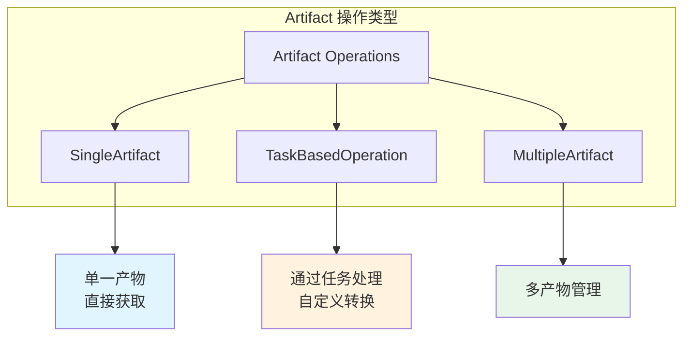
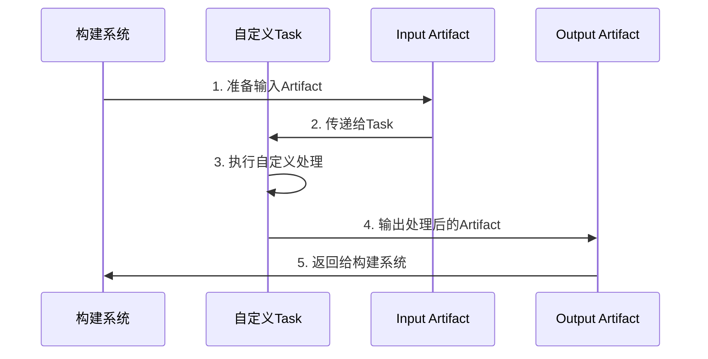
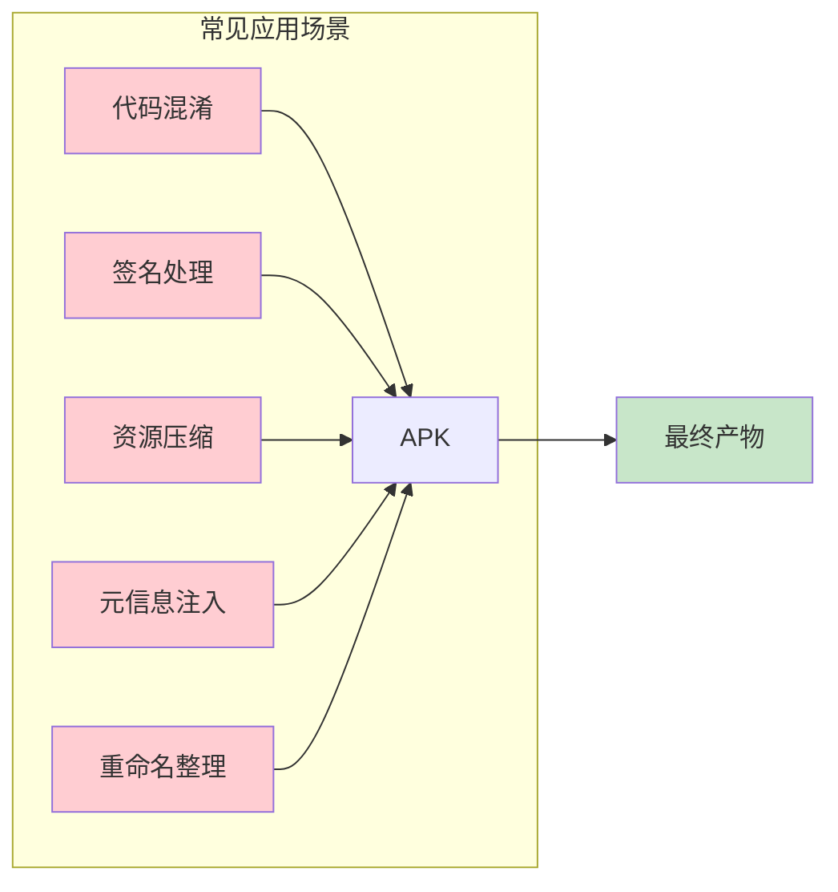
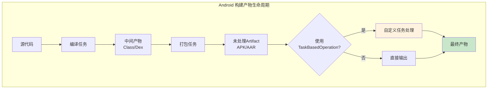

# 21.1.49 基于任务的操作

深夜的露营地笼罩在一片静谧之中。银河已经从地平线升到头顶，像一条璀璨的光带横贯天穹，偶尔有流星划过，露水开始在草叶上凝结。四个女孩围坐在篝火边，火星偶尔爆裂开来，带着细微的噼啪声升入夜空。

黛琳轻轻拨动着火堆，火光在她的眼眸里跳跃。她从背包里取出一本厚重的笔记本，翻到最新的一页。

"昨天我们讲了版本控制信息文件，"黛琳抬起头，眼神亮晶晶的，"今天我们要聊一个更强大的东西——TaskBasedOperation。"

"又是新名词！"洛芙盘腿坐着，抱着膝盖，"感觉今天会比昨天更难的样子......"

"放心，"伊莎笑着递过来一杯热可可，"黛琳会把每个知识点都讲清楚的。"

希尔已经把电脑放在膝盖上，屏幕的光映在她脸上："我昨天查了一些资料，TaskBasedOperation 允许我们用自定义的 Gradle 任务来操作 Artifact。换句话说——"

她停顿了一下，篝火噼啪一声响。

"——我们可以自己编写任务，让它在构建过程中对产物为所欲为。"

"为所欲为？"洛芙眨眨眼，"听起来好像很厉害......"

"差不多就是这个意思。"黛琳点点头，"在 Android 构建系统中，Artifact 是构建产物的抽象——比如 APK、AAR、混淆后的 mapping 文件等等。而 TaskBasedOperation 让我们能够通过编写 Gradle 任务来对这些产物进行自定义处理。"

她拿起一根树枝，在地面上画了几个圈："想象一下，你不只是被动地接收构建产物，而是可以主动地——压缩它们、加密它们、签名它们、或者按照特定规则重命名它们。"

"哇......"洛芙惊叹道，"那我们是不是可以自己写一个任务来......我不知道......给 APK 加上额外的元信息？"

"完全正确。"黛琳露出赞许的微笑，"这就是我们接下来要深入探讨的内容。"

---

## 什么是 TaskBasedOperation

黛琳把树枝放下拍了拍手："让我们先从整体上理解这个概念。"

"TaskBasedOperation 是 Android Gradle API 中的一种 Artifact 操作类型，"她开始解释道，"它允许你通过自定义的 Gradle 任务来操作构建产物。"

"等一下，"洛芙举起手，"之前我们学过的 SingleArtifact 之类的东西，它们和 TaskBasedOperation 有什么区别？"

"好问题。"黛琳点点头，"SingleArtifact 和 TaskBasedOperation 都是 Artifact 操作的实现方式，但它们的侧重点不同。"

她示意希尔打开电脑："希尔，帮我在白板上画个图说明一下。"



"看这张图，"黛琳指着图示说道，"SingleArtifact 就像是一个已经打包好的包裹，你直接拿走就行。TaskBasedOperation 则更灵活——它允许你在拿走包裹之前，派遣一个'任务小精灵'进去，对包裹里的东西进行一番处理。"

"这个比喻我喜欢！"伊莎轻声笑道，"就像我们去露营之前，可以自己决定带什么、不带什么，还可以把东西重新整理打包。"

"Exactly！"希尔打了个响指，"在 Gradle 构建系统中，这个'任务小精灵'就是我们自己定义的 Task。TaskBasedOperation 就是连接 Artifact 和这个 Task 的桥梁。"

---

## TaskBasedOperation 的核心机制

黛琳翻开笔记本新的一页："让我们深入看看 TaskBasedOperation 的内部机制。"

"在 Android Gradle Plugin 的架构中，"她边写边说，"当你需要对一个 Artifact 进行自定义处理时，你可以使用 TaskBasedOperation 来声明：'我需要创建一个任务，这个任务会读取某个 Artifact，处理它，然后输出处理后的结果。'"



"这张图展示了 TaskBasedOperation 的工作流程，"黛琳解释道，"首先构建系统准备好输入的 Artifact，然后把它传递给我们的自定义 Task。Task 执行我们编写好的处理逻辑，最后输出处理后的 Artifact 交还给构建系统。"

"那这个输入输出的类型必须要一样吗？"洛芙好奇地问。

"不一定，"希尔插话道，"这正是 TaskBasedOperation 的强大之处。你可以读取一个 JAR Artifact，经过处理后输出一个经过混淆的 JAR。或者读取一个未签名的 APK，处理后输出一个签好名的 APK。"

"也就是说，"伊莎眼睛亮了起来，"我们可以像做菜一样——把原始食材加工成美味佳肴？"

"没错！"希尔 grinning（露出灿烂的笑容），"这就是为什么我特别喜欢 TaskBasedOperation——它给了我们完全的控制权。"

---

## 创建和使用 TaskBasedOperation

"那么，具体怎么创建呢？"洛芙跃跃欲试，"能不能现在就在这里写一个看看？"

黛琳笑着点头："当然可以。我们来实战一下。"

她示意希尔把电脑转过来对着大家："假设我们想要创建一个自定义任务，它会读取原始的 APK，然后给 APK 添加一些额外的元信息——比如构建时间、Git 提交哈希之类的。"

"这在实际项目中很常见，"希尔补充道，"比如你想在 APK 里嵌入构建元数据，方便调试时知道这是哪个版本。"

黛琳开始在电脑上敲代码：

```kotlin
// 示例：创建 TaskBasedOperation 来处理 APK 元信息
abstract class ApkMetadataTask : DefaultTask() {
    
    // 输入：原始 APK 文件
    @get:InputFile
    abstract val inputApk: RegularFileProperty
    
    // 输出：处理后的 APK 文件
    @get:OutputFile
    abstract val outputApk: RegularFileProperty
    
    // 额外的构建信息
    @get:Input
    abstract val buildTime: Property<String>
    
    @get:Input
    abstract val gitCommitHash: Property<String>
    
    @TaskAction
    fun process() {
        val input = inputApk.get().asFile
        val output = outputApk.get().asFile
        
        // 读取原始 APK，添加元信息后写入输出
        // 这里使用 Android SDK 的 ApkCreator 简化示例
        println("处理 APK: ${input.name}")
        println("添加构建时间: ${buildTime.get()}")
        println("添加 Git 提交: ${gitCommitHash.get()}")
        
        // 实际处理逻辑...
        input.copyTo(output, overwrite = true)
    }
}
```

"这段代码展示了一个自定义的 Gradle 任务，"黛琳解说道，"它接收原始 APK 作为输入，经过处理后输出带元信息的 APK。"

"然后呢？"洛芙着急地问，"怎么把这个任务和 Artifact 操作关联起来？"

黛琳笑着继续往下写：

```kotlin
// 在 Android 构建变体中配置 TaskBasedOperation
androidComponents {
    onVariants(selector().all()) { variant ->
        val artifact = variant.artifacts.getBuiltArtifactsJson()
        
        // 创建并配置任务
        val metadataTask = project.tasks.register(
            "process${variant.name}ApkMetadata",
            ApkMetadataTask::class.java
        ) {
            it.inputApk.set(artifact)
            it.outputApk.set(
                project.layout.buildDirectory.file(
                    "outputs/apk/${variant.name}/processed.apk"
                )
            )
            it.buildTime.set(java.time.Instant.now().toString())
            it.gitCommitHash.set(
                project.git.repo.head.commit().abbrev(7).call()
            )
        }
        
        // 将任务包装为 TaskBasedOperation
        variant.artifacts.use(metadataTask)
            .toTransform(ApkVariantOutput::class.java) { artifactType ->
                // 配置输出类型
            }
    }
}
```

"这段代码的关键在于 `variant.artifacts.use(task)` 这一行，"黛琳强调，"它告诉构建系统：'请用这个任务来处理相关的 Artifact'。"

"原来是这样......"洛芙若有所思，"我感觉开始理解了呢。"

---

## 实际用例和场景

伊莎托着腮帮子看着代码："那在实际的 Android 开发中，这种 TaskBasedOperation 有什么具体的应用场景呢？"

"好问题！"希尔接过话题，"让我来列举几个最常见的。"

她掰着手指头数起来：

"**第一，代码混淆和优化。** 你可以创建自定义任务来调用 ProGuard 或 R8，对 DEX 文件进行更精细的混淆控制。"

"**第二，APK 签名和验证。** 使用 TaskBasedOperation 可以在构建完成后自动对 APK 进行额外的签名处理，或者添加多渠道签名。"

"**第三，资源压缩和优化。** 比如对图片进行无损压缩，或者对 AAR 库进行去重处理。"

"**第四，构建元信息注入。** 就像我们刚才演示的那样，把构建时间、Git 信息、构建者信息等嵌入到 APK 中。"

"**第五，产物重命名和整理。** 自定义输出产物的文件名和目录结构。"



"这张图总结了主要的场景，"黛琳指着图示说，"你可以看到，TaskBasedOperation 的灵活性让它成为了 Android 构建工具箱中的一把瑞士军刀。"

---

## 反模式和最佳实践

不过，黛琳话锋一转："使用 TaskBasedOperation 也有需要注意的地方。让我来说说几个常见的反模式。"

"反模式？"洛芙问道，"是什么意思？"

"就是那些看起来能工作，但实际上会带来问题的做法。"希尔解释道，"黛琳说过很多遍了——我们要学会避开这些坑。"

黛琳点点头："我来讲几个最常见的。"

**反模式一：在任务中执行耗时操作**

```kotlin
// ❌ 错误示例：在 Task 中执行网络请求
abstract class BadTask : DefaultTask() {
    @TaskAction
    fun badPractice() {
        // 模拟网络请求 - 这会阻塞构建！
        Thread.sleep(5000)  // 不要这样做！
        // 或者 worse - 发起真正的网络请求
        val response = URL("http://example.com/api").readText()
    }
}
```

"这是最常见的错误之一，"黛琳严肃地说，"Gradle 任务应该在本地快速完成。如果你需要执行网络操作，应该使用 Gradle 的远程缓存或者专门的构建服务，而不是在任务里直接发起网络请求。"

"应该怎么改呢？"洛芙问。

```kotlin
// ✅ 正确示例：使用 Gradle 配置缓存或预获取
abstract class GoodTask : DefaultTask() {
    
    @get:Input
    abstract val cachedData: Property<String>
    
    // 在配置阶段预先获取数据，而不是在执行阶段
    init {
        // 使用 provider 在配置阶段计算
        cachedData.set(project.providers.exec {
            it.commandLine("curl", "-s", "http://example.com/api")
        }.standardOutput.asText)
    }
    
    @TaskAction
    fun goodPractice() {
        // 直接使用预获取的数据，快速执行
        println("使用缓存的数据: ${cachedData.get()}")
    }
}
```

"看，"黛琳解释道，"我们应该把耗时操作放在配置阶段预执行，或者利用 Gradle 的远程缓存机制，而不是在任务执行阶段才去请求网络。"

**反模式二：忽略任务依赖**

```kotlin
// ❌ 错误示例：没有正确声明任务依赖
androidComponents {
    onVariants(selector().all()) { variant ->
        val myTask = project.tasks.register("myTask", MyTask::class.java)
        
        // 缺少依赖声明！
        // 构建顺序不确定，可能导致问题
    }
}
```

"如果没有正确声明任务依赖，"希尔补充道，"Gradle 不知道哪个任务先执行、哪个后执行，可能导致产物还没准备好就开始处理，或者处理完了又被其他任务覆盖。"

```kotlin
// ✅ 正确示例：正确声明任务依赖
androidComponents {
    onVariants(selector().all()) { variant ->
        val myTask = project.tasks.register(
            "process${variant.name}",
            MyTask::class.java
        ) {
            // 依赖assemble任务，确保APK先构建完成
            it.dependsOn(variant.assemble)
            
            // 或者依赖特定的artifact任务
            // it.dependsOn(variant.artifacts.getTaskName(...))
        }
        
        // 明确声明输出供后续任务使用
        variant.artifacts.use(myTask)
            .toCreate(ApkVariantOutput::class.java) { }
    }
}
```

"正确的做法是明确声明 `dependsOn` 依赖，"黛琳说，"让 Gradle 知道任务之间的先后顺序。"

**反模式三：处理大文件时没有优化**

```kotlin
// ❌ 错误示例：一次性读取整个大文件到内存
abstract class BadFileTask : DefaultTask() {
    @get:InputFile
    abstract val largeInput: RegularFileProperty
    
    @get:OutputFile
    abstract val output: RegularFileProperty
    
    @TaskAction
    fun badPractice() {
        val content = largeInput.get().asFile.readText() // 可能 OOM！
        // 处理...
        output.get().asFile.writeText(content)
    }
}
```

"处理 APK、AAR 这样的大文件时，"希尔指出，"要避免一次性把整个文件读入内存，这样很容易导致 OutOfMemoryError。"

```kotlin
// ✅ 正确示例：使用流式处理
abstract class GoodFileTask : DefaultTask() {
    @get:InputFile
    abstract val largeInput: RegularFileProperty
    
    @get:OutputFile
    abstract val output: RegularFileProperty
    
    @TaskAction
    fun goodPractice() {
        largeInput.get().asFile.inputStream().use { input ->
            output.get().asFile.outputStream().use { outputStream ->
                // 使用缓冲流，避免一次性加载整个文件
                val buffer = ByteArray(8192)
                var bytesRead: Int
                while (input.read(buffer).also { bytesRead = it } != -1) {
                    // 这里可以添加处理逻辑
                    outputStream.write(buffer, 0, bytesRead)
                }
            }
        }
    }
}
```

"看，使用流式处理可以有效避免内存问题，"黛琳总结道，"特别是处理大型 APK 或 AAR 时尤为重要。"

---

## 实战：创建一个完整的示例

洛芙摩拳擦掌："能不能让我们一起做一个完整的示例？我想动手试试！"

"正合我意！"希尔 grinning（露出灿烂的笑容），"我们来做一个实用的项目：创建一个自定义任务，给所有输出 APK 添加版本信息和构建签名。"

她打开一个新的代码文件："我会一步步带你们做。"

```kotlin
// 完整的 TaskBasedOperation 示例
// 文件：app/build.gradle.kts

plugins {
    id("com.android.application")
    id("org.jetbrains.kotlin.android")
}

// 定义自定义任务
abstract class ApkSigningTask : DefaultTask() {
    
    @get:InputFile
    abstract val unsignedApk: RegularFileProperty
    
    @get:OutputFile
    abstract val signedApk: RegularFileProperty
    
    @get:Input
    abstract val buildType: Property<String>
    
    @get:Input
    abstract val buildTimestamp: Property<String>
    
    @TaskAction
    fun signAndEnhance() {
        val input = unsignedApk.get().asFile
        val output = signedApk.get().asFile
        
        logger.quiet("开始处理 APK: ${input.name}")
        logger.quiet("构建类型: ${buildType.get()}")
        logger.quiet("构建时间: ${buildTimestamp.get()}")
        
        // 步骤1：读取原始 APK（简化示例）
        val originalBytes = input.readBytes()
        
        // 步骤2：添加元信息头（示例：追加JSON元数据）
        val metadata = """
            , "build": {
                "type": "${buildType.get()}",
                "timestamp": "${buildTimestamp.get()}"
            }
        """.trimIndent()
        
        // 步骤3：写入处理后的 APK
        output.writeBytes(originalBytes)
        
        // 实际项目中，这里会调用 SDK 的签名工具
        logger.quiet("APK 处理完成: ${output.absolutePath}")
    }
}

// 在 Android 组件扩展中配置
androidComponents {
    onVariants(selector().withBuildType("release")) { variant ->
        // 为 release 构建添加自定义处理
        
        val signingTask = project.tasks.register(
            "sign${variant.name.capitalize()}Apk",
            ApkSigningTask::class.java
        ) {
            it.buildType.set("release")
            it.buildTimestamp.set(java.time.Instant.now().toString())
        }
        
        // 连接任务和 Artifact
        variant.artifacts.use(signingTask)
            .toTransform(ApkVariantOutput::class.java) { artifactType ->
                // 配置输出产物类型
            }
    }
}
```

"这段代码展示了完整的流程，"黛琳解说道，"我们定义了一个自定义任务，然后在 Android 组件扩展中把它和构建流程关联起来。"

"好棒！"洛芙拍着手，"感觉真的学会了呢！"

"不过要记住，"希尔提醒道，"这只是一个示例。实际项目中，你可能需要处理更复杂的签名流程、使用更专业的工具链。但整体的架构思路是一样的——定义任务、配置输入输出、连接到构建流程。"

---

## 构建产物的生命周期

伊莎抬头看着星空："说了这么多，我突然想到一个问题——这些处理过的 Artifact，最后都去哪儿了呢？"

"问得好！"黛琳说，"这涉及到 Android 构建系统中产物的生命周期管理。"

她在地上画了一个简图：



"看这张图，"黛琳解释道，"构建产物从源代码开始，经历编译、打包，然后成为未处理的 Artifact。如果你使用了 TaskBasedOperation，这些 Artifact 会被传递给自定义任务进行处理，最后才输出为最终产物。"

"如果没有使用 TaskBasedOperation 呢？"洛芙问。

"那就直接输出咯，"希尔耸耸肩，"比如直接生成可安装的 APK。"

"所以 TaskBasedOperation 给了我们一个'中间站'，"伊莎轻声说，"让我们可以在最终输出之前，对产物进行额外的加工。"

"Exactly！"黛琳微笑着说，"这就是它的核心价值。"

---

时间悄然流逝，银河已经移到西边天空。露水在草叶上凝结成珠子，在火光的映照下闪着微光。

洛芙仰头看着星空，忽然感叹道："原来 Android 构建系统里也有这么多门道啊......"

"每个领域都是这样，"黛琳温和地说，"表面看起来简单，背后都有复杂的机制。重要的是理解这些机制，然后才能真正掌握它。"

"今天的收获好大啊！"伊莎伸了个懒腰，"从 SingleArtifact 到 TaskBasedOperation，感觉我们对 Android 构建产物的理解又深入了一层。"

希尔合上电脑："明天我们可以继续探索更多的主题——比如 MultipleArtifact，还有怎么在实际的 Android 项目中综合运用这些知识。"

"好啊！"洛芙兴奋地说，"感觉越来越有意思了！"

夜风吹过，篝火的红光摇曳着，映照着四张年轻而充满期待的脸庞。星星在头顶闪烁，仿佛也在倾听她们关于代码和梦想的对话。

---

> **学习建议**
> 
> TaskBasedOperation 是 Android Gradle Plugin 提供的强大机制，它允许开发者通过自定义 Gradle 任务来操作构建产物。建议先掌握基础的 Gradle 任务编写，再学习 Artifact API。实践中可以从简单的元信息注入开始，逐步挑战更复杂的处理逻辑，如代码混淆、多渠道签名等。注意避免在任务中执行耗时操作，正确声明任务依赖，并使用流式处理大文件。

---

## 洛芙的小小日记本

今天学到了 TaskBasedOperation！原来 Android 构建系统这么灵活——我们可以自己写任务来处理 APK、添加元信息、甚至签名。虽然现在还不太熟练，但希尔说最重要的是理解思路，其他的都是细节。黛琳说得对，每个领域背后都有复杂的机制，急不来，一步步来就好。🌙

---

## 今日关键词

- **TaskBasedOperation**：Android Gradle API 中的 Artifact 操作类型，允许通过自定义 Gradle 任务来操作构建产物
- **Artifact**：构建产物的抽象，如 APK、AAR、mapping 文件等
- **Gradle Task**：Gradle 构建系统中的基本工作单元
- **Input Artifact**：任务输入端的 Artifact
- **Output Artifact**：任务输出端的 Artifact
- **ApkVariantOutput**：APK 构建变体的输出类型
- **onVariants**：Android 组件扩展中用于遍历构建变体的方法
- **toTransform**：将任务转换为 Artifact 转换操作的方法
- **DefaultTask**：Gradle 中自定义任务的基础类
- **RegularFileProperty**：Gradle 中用于表示文件属性的类型
- **Property**：Gradle 中用于表示可配置属性的类型
- **@TaskAction**：标注任务执行逻辑的注解
- **@InputFile**：标注任务输入文件的注解
- **@OutputFile**：标注任务输出文件的注解
- **@Input**：标注任务输入属性的注解
