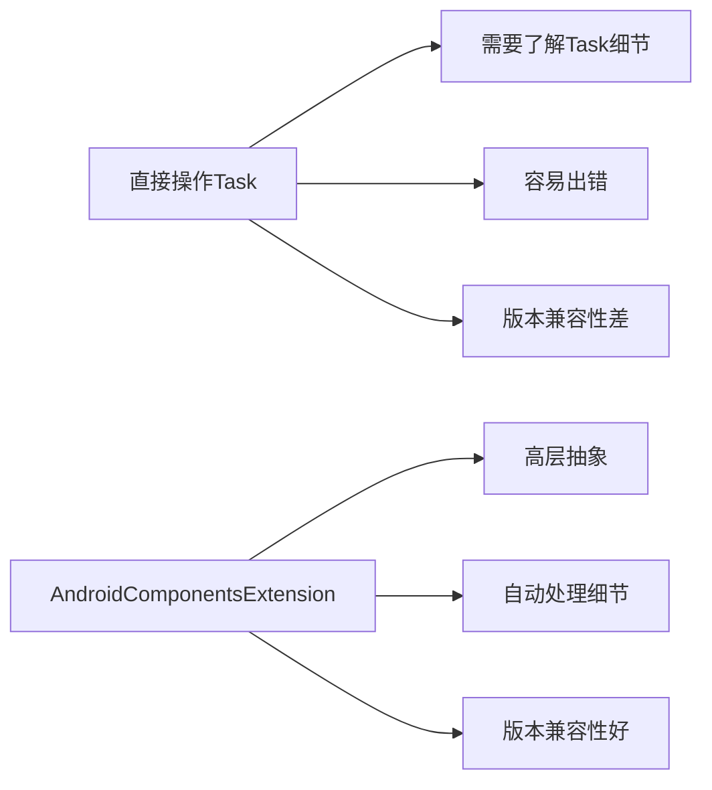
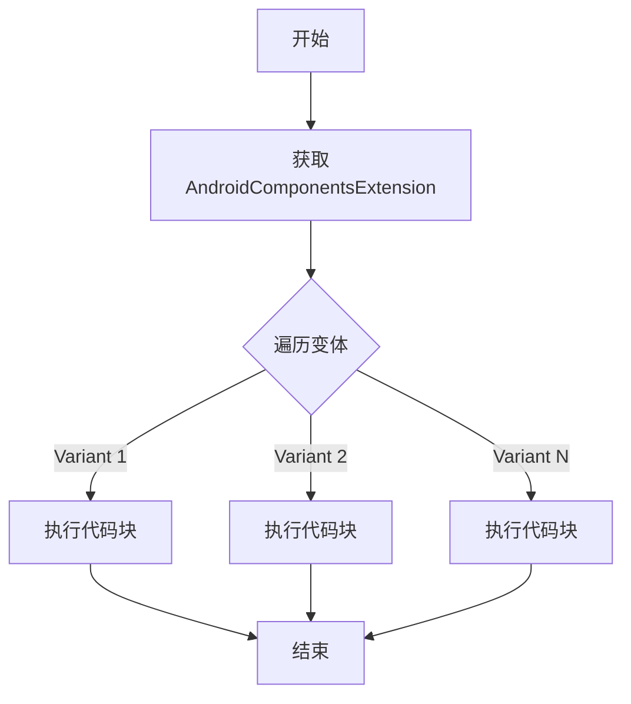
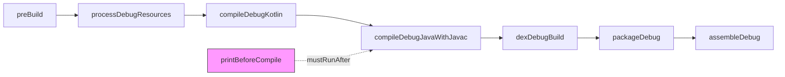

# 21.1.5 com.android.build.api

午后的营地笼罩在一片金色的光晕中，知了的叫声此起彼伏，像是夏天独有的背景音乐。

洛芙把草帽摘下来扇着风，汗水顺着她的刘海滴下来。今天的太阳特别毒辣，连平时最爱在外面跑的希尔都躲到了帐篷的阴影里。

“黛琳姐姐，”洛芙凑到正在摆弄电脑的黛琳身边，“昨天我们学了怎么检测AGP版本，那检测完版本之后，我们能做什么呀？”

黛琳抬起头，阳光在她的眼镜片上反射出一道白光：“问得好！检测版本只是第一步，接下来我们要学会怎么去配置和修改构建任务——这才是AGP API的核心所在。”

“任务？”洛芙眨了眨眼，“就是那个每次编译时运行的一大堆tasks吗？”

“对，就是它们。”伊莎从素描本里抬起头来，她的画本上画满了各种形状的积木，“想象一下，编译一个App就像搭积木——有负责编译Java代码的积木，有负责处理资源的积木，还有负责打包APK的积木。我们今天要学的，就是怎么往这些积木堆里添加我们自己的积木。”

希尔一下子来了精神，从帐篷里跳了出来：“是不是可以自己写task了？走走走，我们快点开始吧！”

---

## 任务配置是什么？

黛琳笑着摆摆手，让希尔稍安勿躁。她把电脑屏幕转过来对着大家：“在讲怎么写task之前，我先问你们一个问题——你们知道一个Android项目编译时，会运行多少个task吗？”

洛芙摇摇头。

“少则几十个，多则上百个。”黛琳说，“编译Java代码是javac task，处理资源是aapt task，打包dex是dx task……每个task各司其职，最后才能组装成一个完整的APK。”

她在屏幕上敲了一行命令，然后展示了输出：

```bash
./gradlew tasks --group=build
```

输出结果滚动显示了几十行task：

```
> Task :app:assembleDebug
> Task :app:assembleRelease
> Task :app:compileDebugJavaWithJavac
> Task :app:processDebugResources
> Task :app:compileDebugKotlin
> Task :app:dexDebugBuild
> Task :app:packageDebug
...
```

“你们看，这些都是build group里的task。”黛琳指着屏幕说，“我们今天要学的，就是怎么在这些已有的task基础上，添加我们自己的自定义task，或者修改现有task的行为。”

---

## AndroidComponentsExtension：任务的控制中心

伊莎凑近屏幕：“黛琳，这些task是怎么被创建出来的呀？”

“这就是我们要介绍的第二个重要API——AndroidComponentsExtension。”黛琳调出了一段代码，“这个扩展是AGP 7.0之后引入的新API，它允许我们在不直接操作Gradle task的情况下，通过更高级的API来配置构建过程。”

```kotlin
// 获取AndroidComponentsExtension
val androidComponents = project.extensions.getByType(AndroidComponentsExtension::class.java)
```

洛芙歪着头：“这个和直接操作task有什么区别吗？”

“区别大了。”黛琳摇摇头，“直接操作Gradle task就像直接修理汽车的发动机——你得了解发动机的每一个零件。而AndroidComponentsExtension就像有一个智能助手，你告诉它你想要什么，它帮你配置去那些底层的task。”

她画了一张简单的对比图：



“AndroidComponentsExtension会在内部根据AGP版本创建合适的task，我们只需要关注自己想要实现的功能就行。”黛琳解释道，“这也是为什么昨天我们要先学版本检测——因为不同AGP版本提供的API可能不一样。”

---

## onEach：遍历所有变体

希尔迫不及待地问：“那具体怎么用啊？给我们看看代码吧！”

“好，我们从一个最简单的例子开始。”黛琳敲起了代码，“假设我们想在每个build variant编译时，都打印一条日志。该怎么做？”

```kotlin
androidComponents.onEach { variant ->
    // variant 就是当前的构建变体（debug、release等）
    println("正在处理变体: ${variant.name}")
}
```

洛芙举手：“这个onEach是什么意思？”

“onEach是一个回调方法——它会对项目中的每个构建变体执行一次后面的代码块。”黛琳解释道，“比如你有一个debug版本和一个release版本，onEach就会执行两次——一次针对debug，一次针对release。”

她在屏幕上画了一个简单的流程图：



“如果我们只想处理特定的变体呢？”伊莎问。

“那就用onVariant方法配合过滤条件。”黛琳又敲了一段代码：

```kotlin
// 只处理debug变体
androidComponents.onVariant("debug") { variant ->
    println("只处理debug变体: ${variant.name}")
}

// 使用lambda过滤
androidComponents.onEach {
    if (it.name.contains("debug")) {
        println("处理debug变体: ${it.name}")
    }
}
```

---

## 任务配置实战

洛芙看得跃跃欲试：“能不能给我们看点更实际的例子？比如添加一个自定义task什么的？”

黛琳笑着点头：“好，我们来写一个真正有用的自定义task。”

她新建了一个Kotlin文件，开始敲代码：

```kotlin
// 定义一个自定义Task
abstract class PrintVariantInfoTask : DefaultTask() {
    @TaskAction
    fun printInfo() {
        println("=== 自定义Task执行了 ===")
    }
}
```

“现在我们有了自定义task的定义，接下来要把它注册到build过程中。”黛琳继续敲代码，使用onEach来配置：

```kotlin
androidComponents.onEach { variant ->
    // 为每个变体创建一个自定义task
    project.tasks.register("print${variant.name.capitalize()}Info", PrintVariantInfoTask::class.java) {
        // 配置task的依赖关系
        // 确保这个task在变体的assemble task之前运行
        mustRunAfter(variant.getTask("preBuild"))
    }
}
```

希尔眼睛亮了：“哦！mustRunAfter是设置执行顺序的！”

“对，这很重要。”黛琳点点头，“如果我们想让自定义task在某个特定task之后运行，或者之前运行，就要设置依赖关系。比如我们想让这个打印信息的task在编译之前运行，可以这样：”

```kotlin
androidComponents.onEach { variant ->
    val compileTask = variant.getTask("compileDebugJavaWithJavac")
    
    project.tasks.register("printBeforeCompile", PrintVariantInfoTask::class.java) {
        mustRunAfter(compileTask)
    }
}
```

洛芙注意到一个新东西：“variant.getTask()是怎么用的？”

“这是获取变体关联的特定task的方法。”黛琳解释道，“variant对象代表一个构建变体，它知道这个变体对应的所有task。我们可以通过getTask()方法获取具体的task，然后设置依赖关系。”

---

## 任务依赖图解

伊莎放下素描本，提出了一个关键问题：“黛琳，我有点混淆了——这些task之间的依赖关系，到底是怎么工作的呀？”

“好问题！”黛琳又在白板上画了起来，“我们用一张图来解释task的依赖关系。”

她在白板上画了一个简单的依赖图：



“你们看，这是一个简化版的debug编译流程。”黛琳指着图说，“每个箭头表示‘依赖于’——比如compileDebugKotlin依赖于processDebugResources，意味着只有processDebugResources完成后，compileDebugKotlin才会开始执行。”

“那我们添加的custom task在哪里？”洛芙问。

“这里！”黛琳指向图中新添加的粉色节点H，“printBeforeCompile通过mustRunAfter依赖到compileDebugJavaWithJavac，意味着它会在compileDebugJavaWithJavac之后执行。”

她补充道：“还有两种设置依赖关系的方式：”

```kotlin
// 方式1：mustRunAfter - 必须在某个task之后运行
task.mustRunAfter(otherTask)

// 方式2：dependsOn - 依赖于某个task（前置条件）
task.dependsOn(otherTask)

// 方式3：finalizedBy - 在某个task之后运行（收尾工作）
task.finalizedBy(cleanupTask)
```

“它们有什么区别？”希尔问。

“dependsOn是强制依赖——如果你不先完成otherTask，task根本没法运行。mustRunAfter是软依赖——你可以先运行task，但otherTask必须已经完成。finalizedBy则是用来做收尾工作的——无论task成功还是失败，finalizedBy的task都会执行。”

---

## 常见反模式

黛琳突然严肃起来：“不过在配置task的时候，有几个常见的错误一定要避免。”

她切换到代码视图：

```kotlin
// ❌ 错误示例：直接修改AGP内置task
androidComponents.onEach { variant ->
    val compileTask = variant.getTask("compileDebugJavaWithJavac")
    compileTask.doFirst {
        println("在编译前做点什么")
    }
}
```

“为什么错了？”洛芙问。

“因为AGP内部会重写这些task，我们添加的doFirst/doLast可能会被覆盖。”黛琳解释道，“正确的方式是创建一个新的依赖task，而不是直接修改原有的task。”

```kotlin
// ✅ 正确示例：通过依赖链添加行为
androidComponents.onEach { variant ->
    // 创建一个新的依赖task
    val preCompileTask = project.tasks.register("preCompile${variant.name.capitalize()}", 
        PreCompileCheckTask::class.java)
    
    // 让原有task依赖新task
    variant.getTask("compileDebugJavaWithJavac").apply {
        dependsOn(preCompileTask)
    }
}
```

伊莎又问：“那如果我想在编译后做点什么呢？”

“另一个常见错误是——在错误的地方做耗时操作。”黛琳又展示了第二个反模式：

```kotlin
// ❌ 错误示例：在配置阶段执行耗时操作
androidComponents.onEach { variant ->
    // 这会在配置阶段执行，而不是执行阶段
    Thread.sleep(1000)  // 模拟耗时操作
    println("配置阶段的操作")
}
```

“配置阶段是Gradle解析build.gradle文件的时候，这时候不能做耗时操作，否则会卡住整个构建。”黛琳严肃地说，“正确的做法是把操作放到task的action里：”

```kotlin
// ✅ 正确示例：在task执行阶段做耗时操作
abstract class DelayedOperationTask : DefaultTask() {
    @TaskAction
    fun execute() {
        // 这里才是真正的执行阶段
        println("执行阶段的操作")
        Thread.sleep(1000)  // 模拟耗时操作
    }
}
```

---

## 完整的任务配置示例

希尔再也坐不住了：“好了好了，道理我都懂了，快给我们看一个完整的例子吧！”

黛琳笑着点头：“好，我们来写一个完整的例子——创建一个在每次编译前自动检查版本兼容性的task。”

```kotlin
// 第一步：定义Task
abstract class VersionCheckTask : DefaultTask() {
    @TaskAction
    fun checkVersion() {
        val androidComponents = project.extensions
            .getByType(AndroidComponentsExtension::class.java)
        
        androidComponents.onEach { variant ->
            println("=== 版本兼容性检查 ===")
            println("变体: ${variant.name}")
            println("最低SDK: ${variant.minSdk}")
            println("目标SDK: ${variant.targetSdk}")
            
            // 检查版本兼容性
            if (variant.minSdk < 21) {
                println("⚠️ 警告: minSdk低于21将无法使用一些现代API")
            }
        }
    }
}

// 第二步：注册Task并配置依赖
androidComponents.onEach { variant ->
    // 注册新的task
    val checkTask = project.tasks.register(
        "check${variant.name.capitalize()}Version",
        VersionCheckTask::class.java
    )
    
    // 获取变体的assemble task
    val assembleTask = variant.getTask("assemble${variant.name.capitalize()}")
    
    // 设置依赖关系：check task要在assemble之前运行
    assembleTask.dependsOn(checkTask)
}
```

洛芙兴奋地说：“这个太有用了！每次编译前都能自动检查版本信息！”

“对，这就是自定义task的实用之处。”黛琳说，“你们还可以根据需要添加更多的检查逻辑，比如检查依赖版本、检查签名配置、检查资源文件等等。”

---

## 与旧版API的对比

伊莎突然想到一个问题：“黛琳，你之前说这是AGP 7.0之后的新API，那之前是怎么做的？”

“好问题！”黛琳调出了旧版API的代码，“在7.0之前，我们需要直接操作Gradle的task，比较繁琐。”

```kotlin
// ❌ 旧版方式（AGP < 7.0）
project.afterEvaluate {
    project.tasks.withType<JavaCompile> {
        // 这里直接操作JavaCompile task
        options.compilerArgs.add("-Xlint:deprecation")
    }
    
    // 或者通过名称获取task
    project.tasks.getByName("assembleDebug") {
        // 配置task
    }
}
```

“旧版方式有两个问题。”黛琳解释说，“第一，afterEvaluate是配置阶段的回调，这时候task已经创建好了，但配置顺序不一定，容易出问题。第二，我们得知道具体task的名称和类型，这需要了解AGP的内部实现。”

“新API就好多了——”

```kotlin
// ✅ 新版方式（AGP >= 7.0）
androidComponents.onEach { variant ->
    // 通过高层API配置
    variant.enableUnitTest = false  // 禁用unit test
}
```

“新API隐藏了底层细节，让我们可以更专注于业务逻辑。”黛琳总结道。

---

## 章节回顾

太阳慢慢偏西，晚霞染红了半边天空。洛芙躺在草地上，望着天边的云朵出神。

“今天学的东西好多啊。”她掰着手指头数，“AndroidComponentsExtension、onEach遍历变体、自定义task、任务依赖关系……”

伊莎把素描本收进背包：“最重要的是理解任务配置背后的思想——通过高层API来间接配置底层task，这样既简洁又安全。”

“对，就像我们露营时要先把帐篷支好，再往里面放东西一样。”希尔补充道，“先搭建好任务框架，再往里面填具体的逻辑。”

黛琳笑着总结：“自定义task的核心是——不要去修改已有的task，而是创建新的task并建立依赖关系。这样即使AGP升级了，你的代码也能正常工作。”

---

> 学习建议：在实际项目中，自定义task常用于代码检查、资源验证、自动化测试等场景。建议先在头脑中画出task依赖图，明确每个task的执行时机和顺序，再编写代码。对于复杂的依赖关系，可以使用mustRunAfter、dependsOn、finalizedBy组合使用。

---

## 洛芙的小小日记本

今天好热！但是学到的东西好有用！原来编译背后有这么多task在运转，而且我们还能自己添加新的task。黛琳说不要直接修改已有的task，要创建新的再建立依赖关系——这就像搭积木一样，要先想好顺序再动手。明天想自己动手写一个自动生成版本信息的task试试看！

---

## 今日关键词

- **AndroidComponentsExtension**：AGP 7.0引入的高层API，用于配置构建过程和变体
- **onEach**：遍历项目中所有构建变体的回调方法
- **onVariant**：针对特定变体执行代码的方法
- **variant**：构建变体，代表一个特定的编译版本（如debug、release）
- **Task**：Gradle中的最小工作单元，执行具体的构建操作
- **dependsOn**：设置task依赖关系，前置task必须完成
- **mustRunAfter**：软依赖，确保执行顺序但不强制
- **finalizedBy**：在task执行完毕后执行收尾task
- **DefaultTask**：Gradle内置的task基类
- **@TaskAction**：标注task执行时调用的方法
- **build variant**：构建变体，debug/release等的组合
