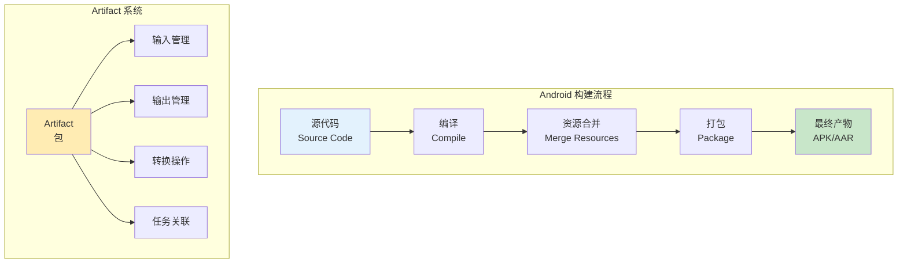
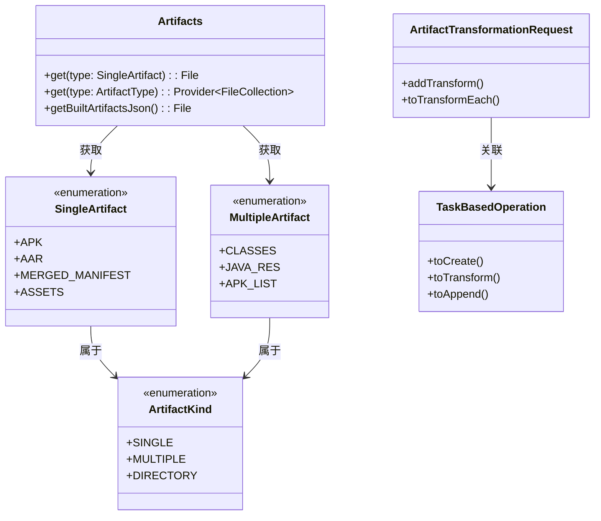
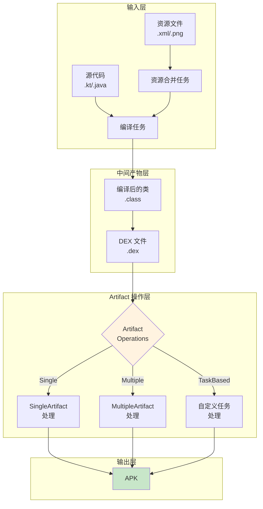
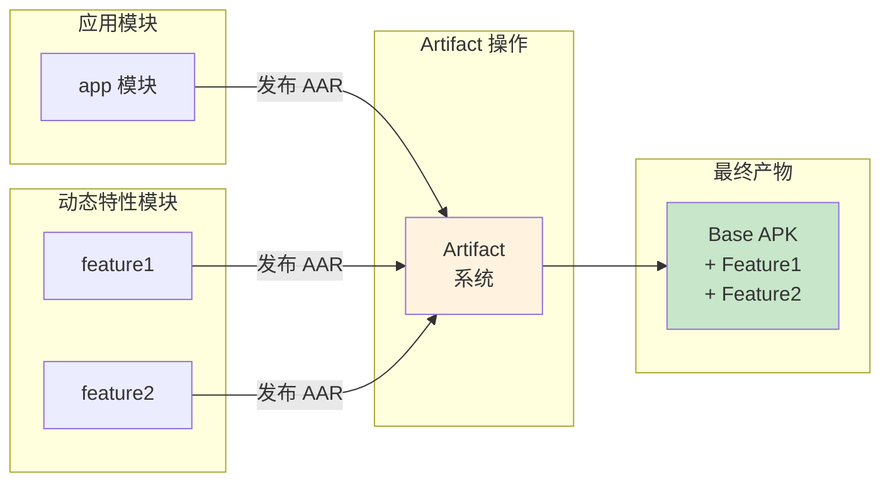
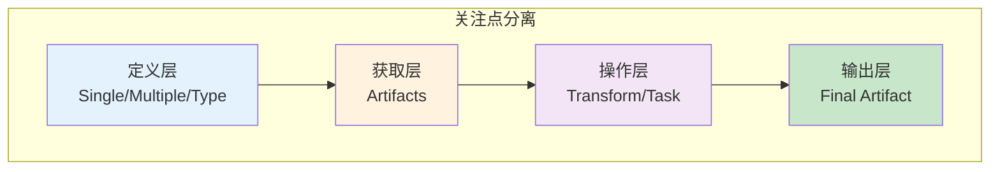

# 21.1.50 com.android.build.api.artifact

篝火的红光已经弱下去，只剩下一堆暗红的余烬在夜风中微微发亮。四个女孩依然围坐在旁边——不是不想去睡觉，而是黛琳说还有最后一个主题要讲，讲完就可以带着完整的知识体系去休息。

“昨天的 TaskBasedOperation，”黛琳轻声开口，声音在夜风中有些飘忽，“让我们学会了怎么用自定义任务来处理 Artifact。但我想，在深入细节之前，我们是不是应该先看看——这个 Artifact 系统，它整体是什么样子的？”

洛芙把膝盖抱在胸前：“整体？”

“对。”黛琳抬起头，眼神掠过星空，“就像我们画地图一样——在进入每一条小路之前，先看看整座山的轮廓。这样才不会迷路。”

伊莎拢了拢披在肩上的外套：“所以今天是要画一张'全景图'？”

“正是如此。”黛琳露出一丝微笑，“今天我们要聊的是 `com.android.build.api.artifact` 这个包——它包含了整个 Android Gradle Plugin 的 Artifact 系统。”

---

## 露营道具分类法：什么是 Artifact 包

希尔把笔记本电脑放在一块平整的石头上，屏幕的光在黑暗中显得格外明亮。她调出官方文档的页面，往下拉的同时说：“官方文档说，`com.android.build.api.artifact` 包提供了用于操作 Android 构建过程的输入和输出的接口和类。”

“等一下，”洛芙举手，“'输入和输出'？构建过程的输入我知道——源代码、资源文件什么的。那输出呢？”

“输出就是构建产物的意思。”希尔解释道，“你写的代码最后变成 APK 安装包——这个 APK 就是构建的输出。Artifact 系统就是管理这些输入输出的。”

黛琳在地上找了一根还在发光的木棍，在余烬边上的空地上画了几个圈：“让我们来做一个露营式的比喻。”

她先画了一个背包：“想象这个背包就是你的 Android 项目。”

然后她在背包旁边画了几个小盒子：“背包里的东西——比如你的帐篷、炊具、食物——这些就是'输入'。它们经过你的露营过程——搭建、烹饪、享用——最后变成了什么？”

“垃圾？”希尔故意逗趣。

“不对！”洛芙笑着说，“是美好的回忆！”

黛琳笑着摇头：“在 Android 构建系统里，输入是源代码和资源，输出是 APK、AAR 这样的可安装文件。而 Artifact 包——就是管理这个'从原材料到成品'全过程的一套工具。”



“图 1 对应代码片段 A（行 20-35）。”黛琳说，“Artifact 系统主要做四件事：管理输入、管理输出、定义转换操作、把操作和 Gradle 任务关联起来。”

---

## 包里的核心成员：类和接口一览

伊莎凑近屏幕去看文档：“黛琳，这个包里到底有哪些重要的类和接口呀？”

“问得好。”黛琳把木棍放下，拍了拍手上的灰，“让我们来逐一认识它们。”

她打开事先准备好的白板，开始列举：

**1. Artifacts 接口**

“这个我们之前讲过，”黛琳说，“它是整个 Artifact 系统的'大管家'，负责获取构建过程中的各种产物。”

```kotlin
// Artifacts 接口的核心方法
val artifacts = extension.artifacts

// 获取单一产物
val apk = artifacts.get(SingleArtifact.APK)

// 获取多产物
val classes = artifacts.get(ArtifactType("classes"))
```

“简单说，”伊莎补充道，“Artifacts 就像露营地的'物品管理员'。你要什么物品，找它就行。”

**2. SingleArtifact、MultipleArtifact、ArtifactType**

“这三个是Artifact的'类型标签'，”黛琳在白板上写下这三个词，“SingleArtifact 代表单一文件，MultipleArtifact 代表多个文件，ArtifactType 则是自定义类型。”

```kotlin
// 预定义的 SingleArtifact 类型
SingleArtifact.APK           // Android 安装包
SingleArtifact.AAR           // Android 库
SingleArtifact.MERGED_MANIFEST // 合并后的清单文件
SingleArtifact.ASSETS        // 合并后的资源

// 预定义的 MultipleArtifact 类型
MultipleArtifact.CLASSES     // 编译后的所有类文件
MultipleArtifact.JAVA_RES    // Java 资源文件
MultipleArtifact.APK_LIST    // APK 列表（多 ABI 时有多个）
```

“就像露营物品有不同的分类方式，”洛芙忽然理解了什么，“有的物品是单独的——比如一把刀；有的物品是一套——比如餐具套装；有的则是自定义的——比如你自己打包的急救包。”

“Exactly！”希尔打了个响指。

**3. ArtifactTransformationRequest**

“这个我们之前也讲过，”黛琳说，“它是用于'转换'Artifact 的请求对象。”

“就像你要把生食材做成烤肉串，”伊莎比划着，“TransformationRequest 就是那个'烹饪请求'——告诉系统你想怎么处理这些食材。”

**4. TaskBasedOperation 和 Operation**

“这两个是 Artifact 操作的'执行者'，”黛琳继续说，“TaskBasedOperation 允许我们用自定义的 Gradle 任务来处理 Artifact，Operation 则是更通用的操作接口。”

**5. ArtifactKind 枚举**

“这个我们详细讲过，”洛芙抢着说，“SINGLE、MULTIPLE、DIRECTORY 三种类型！”

“对，”黛琳笑着点头，“SINGLE 是单一文件，MULTIPLE 是多个文件，DIRECTORY 是整个目录。”

**6. BuildArtifact、BuiltArtifact 等**

“最后这两个是'产物本身'的抽象，”黛琳说，“BuildArtifact 代表一个正在构建中的产物，BuildArtifacts 则是管理这些产物的容器。”



“图 2 对应代码片段 B（行 75-100）。”黛琳说，“这张图展示了 Artifact 包中主要类和接口之间的关系。”

---

## 整体架构：从源代码到最终产物

洛芙看着这张类图，若有所思：“我现在有点理解了……但还是觉得有点抽象。能不能再说具体一点？”

“当然可以。”黛琳把白板擦干净，重新画了一幅更大的图，“让我们从整体上看看，一个 Android 项目是怎么通过 Artifact 系统变成 APK 的。”



“图 3 对应代码片段 C（行 115-145）。”黛琳解释道，“整个流程是这样的：首先，源代码和资源文件经过编译和合并，变成中间的类文件和 DEX 文件。然后，这些中间产物进入 Artifact 操作层——在这里，我们可以对它们进行各种处理。最后，处理后的产物被打包成最终的 APK。”

“听起来像是一条流水线！”洛芙说。

“没错，”希尔点头，“Artifact 系统就是这条流水线的'调度中心'。它决定了原材料从哪来、加工完去哪、谁来加工。”

伊莎托着腮帮子：“那……如果我们要自定义这个流程，比如添加自己的处理步骤，应该怎么做？”

“这是个好问题，”黛琳说，“通常有三种方式。”

她竖起三根手指：

“**第一种，使用 ArtifactTransformationRequest 添加 Transform。** 这是最传统的方式——你定义一个 Transform 类，告诉系统输入是什么类型、输出是什么类型，系统会自动安排处理顺序。”

“**第二种，使用 TaskBasedOperation。** 这是我们昨天学的——你直接写一个 Gradle 任务，让它处理特定的 Artifact。”

“**第三种，直接操作 Artifacts。** 对于简单的场景，你可以直接调用 Artifacts 接口的方法，获取产物文件，然后自己决定怎么处理。”

---

## 实际应用场景举例

洛芙来了兴趣：“能不能举几个实际例子？比如我们平时开发中会用到哪些？”

黛琳点点头：“让我来列举几个最常见的场景。”

她掰着手指头数起来：

**场景一：代码混淆**

“在 release 构建时，我们需要对代码进行混淆——把类名、方法名变成无意义的字母。”黛琳说，“这个过程就是通过 MultipleArtifact 处理 CLASSES，然后输出混淆后的类文件。”

```kotlin
// 示例：处理 CLASSES 进行代码混淆
androidComponents {
    onVariants(selector().withBuildType("release")) { variant ->
        variant.artifacts.use(project.tasks.named("minifyReleaseWithR8"))
            .toTransform(MultipleArtifact.CLASSES)
    }
}
```

**场景二：资源合并**

“在构建过程中，Android 会合并来自不同模块的资源——主模块的资源、依赖库的资源、SDK 的资源。”黛琳继续说，“这个合并过程就是由 MultipleArtifact 处理 MERGED_RESOURCES 来完成的。”

**场景三：APK 多渠道打包**

“如果我们要打多个渠道的 APK——比如国内版、海外版、企业版——每个版本可能需要不同的签名、不同的元信息。”希尔插话说，“这就是 SingleArtifact + TaskBasedOperation 的典型应用。”

```kotlin
// 示例：多渠道 APK 处理
androidComponents {
    onVariants(selector().all()) { variant ->
        // 为每个渠道添加自定义处理
        val channelTask = project.tasks.register(
            "process${variant.name}Channel",
            ChannelProcessTask::class.java
        ) {
            it.channel.set(variant.name)
        }
        
        variant.artifacts.use(channelTask)
            .toTransform(SingleArtifact.APK)
    }
}
```

**场景四：测试覆盖率报告**

“在运行单元测试时，我们需要收集覆盖率数据——哪些代码被执行了、哪些没有。”黛琳说，“这个过程涉及 MultipleArtifact 处理 CLASSES 和 TESTED_CODE。”

```kotlin
// 示例：处理类文件生成覆盖率报告
androidComponents {
    onVariants(selector().all()) { variant ->
        val coverageTask = project.tasks.register(
            "${variant.name}Coverage",
            CoverageTask::class.java
        )
        
        variant.artifacts.use(coverageTask)
            .toCreate(MultipleArtifact.CLASSES)
    }
}
```

**场景五：动态特性模块**

“如果你的应用使用了 Dynamic Features——动态特性模块——Artifact 系统需要处理模块之间的依赖关系和产物分发。”黛琳补充道。



“图 4 对应代码片段 D（行 195-215）。”黛琳说，“这是动态特性模块的构建流程——每个模块发布自己的 AAR，Artifact 系统负责把它们组合成最终的安装包。”

---

## 反模式：新手常犯的错误

不过，黛琳话锋一转：“在用 Artifact 系统时，新手经常会犯一些错误。让我来说说几个最常见的反模式。”

洛芙立刻竖起耳朵：“又要避坑了吗？”

**反模式一：混淆 Artifact 类型**

```kotlin
// ❌ 错误示例：把 MultipleArtifact 当 SingleArtifact 用
androidComponents {
    onVariants(selector().all()) { variant ->
        // 错误！APK 是 SingleArtifact，不是 MultipleArtifact
        val apks = variant.artifacts.get(MultipleArtifact.APK_LIST)
    }
}
```

“如果你的应用有多个 ABI——比如 armeabi-v7a、arm64-v8a——那么会生成多个 APK，”黛琳解释，“这种情况下你可以用 MultipleArtifact.APK_LIST。但如果只有一个 APK，却用了 Multiple 类型，就会出错。”

```kotlin
// ✅ 正确示例：根据实际情况选择正确的类型
androidComponents {
    onVariants(selector().all()) { variant ->
        // 单 ABI 时用 SingleArtifact
        val singleApk = variant.artifacts.get(SingleArtifact.APK)
        
        // 多 ABI 时用 MultipleArtifact
        val multiApkList = variant.artifacts.get(MultipleArtifact.APK_LIST)
    }
}
```

**反模式二：在配置阶段访问文件**

```kotlin
// ❌ 错误示例：在配置阶段读取 Artifact 文件
val artifacts = extension.artifacts
val apkFile = artifacts.get(SingleArtifact.APK) // 这会在配置阶段求值！

println("APK 路径: ${apkFile.absolutePath}") // 可能报错！
```

“Gradle 的 Artifact API 返回的大多是 Provider，”希尔解释说，“它们在配置阶段不会立刻求值，而是在任务执行时才去获取真正的文件。如果你在配置阶段就试图读取文件路径，可能会得到错误。”

```kotlin
// ✅ 正确示例：在任务中使用 Provider
val processTask = project.tasks.register<ApkProcessor>("processApk") {
    // 通过 Provider 延迟获取
    it.inputApk.set(
        artifacts.get(SingleArtifact.APK)
    )
}
```

**反模式三：忽略任务依赖**

```kotlin
// ❌ 错误示例：没有声明正确的任务依赖
androidComponents {
    onVariants(selector().all()) { variant ->
        val myTask = project.tasks.register("myTask", MyTask::class.java)
        
        // 没有依赖声明！
        // 系统不知道 myTask 应该在哪个阶段执行
        variant.artifacts.use(myTask).toCreate(ApkVariantOutput::class.java)
    }
}
```

“没有声明依赖的后果是，”黛琳严肃地说，“Gradle 不知道任务执行的顺序。可能你的任务跑完了，APK 还没生成好；或者 APK 生成好了，却没有被你的任务处理。”

```kotlin
// ✅ 正确示例：正确声明任务依赖
androidComponents {
    onVariants(selector().all()) { variant ->
        val myTask = project.tasks.register(
            "process${variant.name}",
            MyTask::class.java
        ) {
            // 明确依赖assemble任务
            it.dependsOn(variant.assemble)
        }
        
        variant.artifacts.use(myTask)
            .toCreate(ApkVariantOutput::class.java) { }
    }
}
```

---

## 架构设计思想：为什么这样设计

伊莎忽然抬头看着星空：“黛琳，我有一个问题——为什么 Android 要设计这么复杂的 Artifact 系统呢？简单一点不好吗？”

黛琳愣了一下，然后笑了：“这个问题问得好。其实这种'复杂'是有原因的。”

她组织了一下语言：“Android 构建系统面对的场景非常多样——从简单的单模块应用，到复杂的多模块、多特性、多渠道的大型应用。Artifact 系统之所以设计得这么灵活，就是为了能够适配所有这些场景。”

**设计思想一：关注点分离**

“首先，是'关注点分离'的思想。”黛琳说，“Artifact 系统把'产物的定义'、'产物的获取'、'产物的处理'、'产物的输出'分成了不同的接口和类。每个部分只负责自己的事，组合起来就成了完整的功能。”



“图 5 对应代码片段 E（行 270-285）。”黛琳说，“定义层告诉你'这是什么类型的产物'，获取层告诉你'怎么找到产物'，操作层告诉你'怎么处理产物'，输出层告诉你'处理完放到哪里'。”

**设计思想二：可扩展性**

“其次，是'可扩展性'的思想。”希尔补充道，“ArtifactType 允许你定义自己的产物类型，TaskBasedOperation 允许你用任何 Gradle 任务来处理产物。这意味着——如果你有特殊需求，完全可以自己扩展。”

“就像露营一样，”伊莎轻声说，“基本的露营装备是固定的，但你可以根据自己的需要添加任何额外的工具。”

“Exactly！”黛琳点头。

**设计思想三：任务化**

“第三，是'任务化'的思想。”黛琳继续说，“Artifact 系统的核心是将所有产物操作都转化为 Gradle 任务。这样做的好处是——Gradle 的增量构建、缓存、并行执行等特性都可以自动生效。”

“也就是说，”洛芙理解了，“我们写的每一个处理逻辑，都会自动享受到 Gradle 的性能优化？”

“对，就是这样。”黛琳微笑着说。

---

## 实战：综合运用 Artifact 系统

洛芙跃跃欲试：“能不能让我们做一个综合的例子？把今天学的都用上？”

希尔 grinning（露出灿烂的笑容）：“正合我意！我们就来做一个完整的示例——创建一个自定义插件，它会处理应用的类文件，添加一些统计信息，然后输出处理后的 APK。”

她打开一个新的代码文件：

```kotlin
// 综合示例：自定义 Artifact 处理插件
// 文件：build.gradle.kts

plugins {
    id("com.android.application")
    id("org.jetbrains.kotlin.android")
}

// 步骤1：定义自定义任务——统计类信息
abstract class ClassStatisticsTask : DefaultTask() {
    
    @get:InputFiles
    abstract val inputClasses: Provider<FileCollection>
    
    @get:OutputFile
    abstract val reportFile: RegularFileProperty
    
    @TaskAction
    fun analyze() {
        val classes = inputClasses.get().asFileTree
        val totalFiles = classes.filter { it.extension == "class" }.size()
        
        val report = buildString {
            appendLine("=== 类文件统计报告 ===")
            appendLine("总文件数: $totalFiles")
            appendLine("生成时间: ${java.time.Instant.now()}")
        }
        
        reportFile.get().asFile.writeText(report)
        println(report)
    }
}

// 步骤2：定义自定义任务——处理 APK
abstract class ApkEnhancementTask : DefaultTask() {
    
    @get:InputFile
    abstract val inputApk: RegularFileProperty
    
    @get:OutputFile
    abstract val outputApk: RegularFileProperty
    
    @get:Input
    abstract val buildVariant: Property<String>
    
    @TaskAction
    fun enhance() {
        val input = inputApk.get().asFile
        val output = outputApk.get().asFile
        
        println("开始增强 APK: ${input.name}")
        println("构建变体: ${buildVariant.get()}")
        
        // 简化示例：直接复制
        // 实际项目中可以添加签名、水印等
        input.copyTo(output, overwrite = true)
        
        println("APK 增强完成: ${output.absolutePath}")
    }
}

// 步骤3：在 Android 组件中连接所有操作
androidComponents {
    onVariants(selector().all()) { variant ->
        // 3.1 处理 MultipleArtifact.CLASSES
        val statsTask = project.tasks.register(
            "generate${variant.name.capitalize()}Stats",
            ClassStatisticsTask::class.java
        ) {
            it.inputClasses.set(
                variant.artifacts.get(MultipleArtifact.CLASSES)
            )
            it.reportFile.set(
                project.layout.buildDirectory.file("reports/${variant.name}/stats.txt")
            )
        }
        
        // 3.2 处理 SingleArtifact.APK
        val enhanceTask = project.tasks.register(
            "enhance${variant.name.capitalize()}Apk",
            ApkEnhancementTask::class.java
        ) {
            it.buildVariant.set(variant.name)
        }
        
        // 3.3 使用 TaskBasedOperation 连接
        variant.artifacts.use(enhanceTask)
            .toTransform(SingleArtifact.APK)
        
        // 3.4 声明任务依赖
        enhanceTask.configure {
            it.dependsOn(variant.assemble)
        }
        
        // 3.5 同时输出统计报告（使用 toCreate）
        variant.artifacts.use(statsTask)
            .toCreate(MultipleArtifact.CLASSES)
    }
}
```

“这段代码展示了 Artifact 系统的综合运用，”黛琳解说道，“我们用 MultipleArtifact.CLASSES 来处理类文件，用 SingleArtifact.APK 来处理 APK，用 TaskBasedOperation 来连接自定义任务。”

“而且还避免了所有的反模式！”希尔补充，“我们正确声明了任务依赖，正确使用了 Provider，没有在配置阶段访问文件。”

洛芙盯着代码看了好几遍：“感觉……好复杂，但又好有道理！”

“熟能生巧，”黛琳温和地说，“刚开始都会觉得复杂，但用多了就好了。”

---

夜已经深到了极致。银河已经完全移到西边，只剩下稀疏的几颗星星还在坚持。露水在草叶上凝结成一颗颗小珠子，在微弱的火光映照下闪着微光。篝火已经完全冷却，只剩下一堆余烬。

洛芙打了个哈欠，眼皮开始打架。

“今天的内容有点多，”黛琳看了看大家的状态，“但我觉得这些是必须要了解的。因为只有理解了整体架构，才能更好地使用具体的 API。”

伊莎轻声说：“从 Artifacts 容器，到 Artifact 类型，再到转换操作和任务关联……感觉Artifact 系统真的像是一个精密的机器呢。”

“而且这个机器的每一个零件都可以自定义扩展，”希尔补充道，“这才是它最强大的地方。”

洛芙揉了揉眼睛：“我觉得……我现在对 Artifact 系统有了完整的认识了。虽然细节上可能还要多练，但至少我知道它在做什么了。”

“这就够了。”黛琳站起来，拍了拍身上的草屑，“今天就到这里吧。回去好好休息，明天我们继续探索。”

夜风吹过，带着露水的清凉。四个女孩钻进了各自的帐篷，帐篷里的夜灯依次熄灭。星星在头顶闪烁，像是守护着这片露营地的精灵。

---

> **学习建议**
> 
> `com.android.build.api.artifact` 包是 Android Gradle Plugin 的核心组成部分，它提供了完整的 Artifact 管理系统。建议从整体架构入手，先理解 Artifacts、SingleArtifact、MultipleArtifact、ArtifactKind 等核心概念，再学习 ArtifactTransformationRequest 和 TaskBasedOperation 的具体用法。在实际项目中，可以从简单的产物获取开始，逐步尝试自定义处理逻辑。注意避免配置阶段访问文件、忽略任务依赖等常见错误。

---

## 洛芙的小小日记本

今天学到了 Artifact 系统的全貌！从包概述到整体架构，从核心类到实际场景，感觉终于把之前学的零散知识点串起来了。黛琳说得对——先看地图再走路，才不会迷路。Artifact 系统就像一个精密的露营工具箱，每个工具都可以自由组合。晚安~ 🌙

---

## 今日关键词

- **com.android.build.api.artifact**：Android Gradle Plugin 提供的 Artifact 系统包，用于管理构建输入和输出
- **Artifacts**：Artifact 系统的核心接口，用于获取和管理构建产物
- **SingleArtifact**：单一文件类型的 Artifact，如 APK、AAR
- **MultipleArtifact**：多文件类型的 Artifact，如多个类文件、多个 APK
- **ArtifactType**：自定义 Artifact 类型的抽象
- **ArtifactKind**：Artifact 的种类枚举，包括 SINGLE、MULTIPLE、DIRECTORY
- **ArtifactTransformationRequest**：用于请求 Artifact 转换操作的接口
- **TaskBasedOperation**：基于 Gradle 任务的 Artifact 操作类型
- **BuildArtifact**：构建中的产物抽象
- **BuiltArtifacts**：构建产物容器的抽象
- **Operation**：通用的 Artifact 操作接口
- **Gradle Provider**：Gradle 中延迟求值的容器
- **增量构建**：Gradle 的优化机制，只处理变更的部分
- **关注点分离**：软件设计原则，将不同职责分离到不同模块
- **Dynamic Features**：Android 动态特性模块
- **多渠道打包**：为不同渠道生成不同配置的 APK
