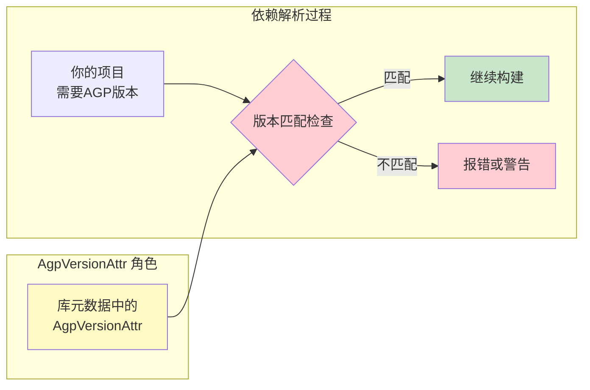
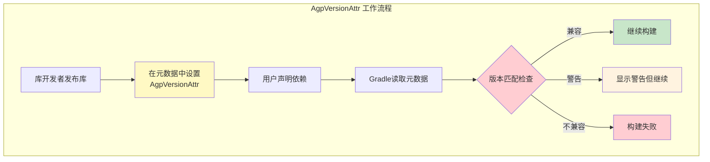

# 21.1.51 AgpVersionAttr

篝火的红光已经完全熄灭了，只剩下几点暗红的余烬在夜风中散发着微弱的热度。银河已经移到了西边的天空，东边开始泛起鱼肚白的晨曦——不知不觉，她们竟然聊了整整一个通宵。

“哇，天都要亮了。”希尔抬起头，用手背遮住眼睛看向东方。

“再讲最后一个主题，”黛琳的声音有些沙哑，但依然带着那种从容的坚定，“讲完这个，我们就去睡觉。今天学的Artifact系统很重要，但还有一个配套的概念——版本属性——不说清楚的话，以后会遇到奇怪的坑。”

洛芙打了个哈欠，揉了揉眼睛：“版本属性？就是我们之前配置Gradle插件版本的那种东西吗？”

“对，但不只是配置那么简单。”黛琳从口袋里掏出一张叠成正方形的纸——那是她平时画白板图示用的，“你记得我们之前配置`classpath 'com.android.tools.build:gradle:x.x.x'`对吧？那只是最表面的。AGP（Android Gradle Plugin）的版本属性系统——也就是`AgpVersionAttr`——它在更深层的地方影响着依赖的匹配和解析。”

---

## 篝火旁的版本故事：什么是版本属性

伊莎把膝盖蜷缩到胸前，像一只安静的小猫一样缩在毯子里：“黛琳，这个'属性'，和我们之前说的Attribute有什么关系？”

“好问题。”黛琳展开那张纸，开始画图，“还记得我们之前讲Artifact的时候说过——Android构建系统用一套Attribute系统来描述产物的特性吗？”

洛芙点头：“记得！比如`artifactType`、还有什么`category`之类的——用来区分不同的Artifact。”

“没错。”黛琳画了一个方框，在里面写上“Attribute系统”，然后在旁边画了另一个小方框，“而`AgpVersionAttr`——Agp版本属性——是专门用来描述AGP版本的一个特殊属性类型。”

她停顿了一下，让这个概念沉淀一会儿。

“你们可以把它想象成……露营时的'紧急联系人'名单。”伊莎轻声说，“不是露营本身，但上面记录着关键信息——出了问题该找谁。”

“这个比喻好。”黛琳笑了，“`AgpVersionAttr`就是构建系统里的'紧急联系人'——它记录了AGP版本信息，当依赖解析遇到问题时，系统会根据这个属性来决定：'哦，你需要8.0.0版本的AGP，我这里有8.1.0，行，可以兼容'——或者'不行，差太多，无法匹配'。”

---

## 版本匹配的秘密：为什么需要版本属性

希尔把笔记本转过来，让屏幕的光照在众人脸上：“我之前遇到过一个问题，印象特别深。”

“什么问题？”洛芙问。

“就是我升级了AGP版本到8.0，结果某个库报错，说它'需要AGP 7.x才能运行'。”希尔回忆起那段经历，“当时我还很奇怪—— Gradle文件里我明明写了`classpath 'com.android.tools.build:gradle:8.0.0'`，为什么还会报这种错？”

黛琳点点头：“这就是版本属性起作用的地方。那个库——或者说发布那个库的开发者——在发布库的时候，在库的元数据里标记了它需要的AGP版本范围。Gradle在解析依赖的时候，会检查这个版本属性，如果不匹配，就会报错或者给出警告。”

她用木棍在余烬边的空地上画了一个简单的图：



“图1展示了依赖解析时的版本检查流程。”黛琳解释道，“`AgpVersionAttr`存储在库的元数据里，当你声明一个依赖时，Gradle会读取这个属性，然后和你项目实际使用的AGP版本进行比对。”

洛芙皱起眉头：“可是……为什么库开发者要特意标记这个？他们不标记的话会怎样？”

“不标记的话……”黛琳微微一笑，“系统就不知道这个库需要什么版本的AGP，可能会出现兼容性问题。比如某个库用了AGP 8.0才有的新API，但用户用AGP 7.0构建，就会出现`NoSuchMethodError`之类的奇怪错误——而且这种错误往往在运行时才出现，很难排查。”

“所以库开发者应该在发布库的时候……”希尔补充，“在元数据里明确写出最低要求的AGP版本？”

“正是如此。”黛琳点头，“这就是`AgpVersionAttr`的作用——它让库开发者能够明确声明兼容的AGP版本范围，让构建系统在编译期就能发现潜在的兼容性问题。”

---

## 代码中的版本属性：如何使用

希尔跃跃欲试地搓了搓手：“那这个属性到底怎么用？我们能在自己的项目里用到吗？”

“问得好。”黛琳看向星空，“实际上，`AgpVersionAttr`主要是由AGP和Gradle内部使用的。但理解它的机制对我们写出更好的依赖声明非常有帮助。”

她拿起一根小树枝，在地上画了一行代码：

```kotlin
// 这是一个概念性的示例，展示版本属性的存储方式
// 实际的 AgpVersionAttr 由 AGP 内部管理，这里是模拟

data class AgpVersionRequirement(
    val minVersion: String,      // 最低AGP版本
    val maxVersion: String?,      // 最高AGP版本（null表示无上限）
    val preferredVersion: String  // 偏好版本
)

// 库开发者会在发布时设置这个属性
// 例如：一个库声明需要 AGP 8.0.0 到 8.2.0 之间
val myLibraryRequirements = AgpVersionRequirement(
    minVersion = "8.0.0",
    maxVersion = "8.2.0",
    preferredVersion = "8.1.0"
)
```

“图2展示了一个简化版的版本需求数据结构。”黛琳说，“在真实的AGP中，这些信息存储在库的`.module`文件或者`pom.xml`的元数据里。”

洛芙歪着头看代码：“可是……我们平时写依赖的时候，好像没接触过这个啊？”

“对普通开发者来说，通常不会直接操作`AgpVersionAttr`。”黛琳解释道，“它更多地是一个底层机制。但我们可以通过一些方式来'感受到'它的存在——比如Gradle的依赖版本分析报告。”

希尔点开Gradle的依赖分析功能：“看，这里会显示每个依赖的'requested'版本和'resolved'版本。如果有版本冲突或者不兼容，Gradle会在这里给出警告。”

她把屏幕转给其他人看：

```
> ./gradlew dependencies

compileClasspath - Dependencies for compilation
+--- com.android.tools.build:gradle:8.1.0
|    \--- com.android.tools.build:gradle-core:8.1.0
|
+--- com.example:mylibrary:1.0.0
|    \--- Warning: This library requires AGP 8.0.0+
|        but project uses AGP 8.1.0
```

“看到了吗？”希尔说，“Gradle会在这里提示版本兼容性问题——虽然显示方式可能因版本而异，但原理就是`AgpVersionAttr`在起作用。”

---

## 实际场景：当版本不匹配时

伊莎轻声说：“如果版本不匹配……会怎样？”

“那要看具体情况。”黛琳的表情变得认真起来，“有些情况下只是警告，构建还能继续；有些情况下会直接失败；还有些情况下——最危险的是——看起来能构建成功，但运行时会出现奇怪的问题。”

她在地上画了一个表格：

| 场景 | 后果 | 典型表现 |
|------|------|----------|
| **警告级不匹配** | 构建继续，但有警告 | Gradle输出警告信息，建议升级/降级 |
| **错误级不匹配** | 构建失败 | `Could not resolve` 错误，无法编译 |
| **运行时不匹配** | 编译通过，运行时崩溃 | `NoSuchMethodError`、`ClassNotFoundException` |

“最可怕的是第三种。”黛琳说，“编译的时候一切正常，APK也生成了，安装到手机上一点问题——但用户开始使用某个功能时，应用突然闪退。排查半天，最后发现是AGP版本问题导致的API不兼容。”

洛芙打了个寒颤：“那……怎么避免这种情况？”

“几个办法。”希尔接过话题，“第一，关注依赖库的更新日志，看看它声明了需要什么版本的AGP；第二，使用`./gradlew dependencies`定期检查依赖冲突；第三——也是最重要的——理解`AgpVersionAttr`这样的底层机制，知道问题可能出在哪里。”

---

## 反模式与重构：版本声明的常见错误

黛琳的表情变得严肃起来：“让我给你们讲讲常见的错误做法——这些错误我以前都见过。”

她在余烬边上的空地上画了一个大大的叉：

**❌ 错误做法1：盲目追新**

```groovy
// build.gradle (错误示例)
plugins {
    id 'com.android.application' version '8.3.0'  // 追最新版本
}
```

“很多人觉得用最新版本的AGP一定更好，”黛琳说，“但新版本可能带来破坏性变更，导致某些库不兼容。”

**❌ 错误做法2：万年不更新**

```groovy
// build.gradle (错误示例)
plugins {
    id 'com.android.application' version '7.4.2'  // 几年都不更新
}
```

“反过来，几年不更新AGP也会有问题——新特性用不了，新的API也调用不了，还可能遇到已被修复的bug。”

**❌ 错误做法3：忽略版本冲突警告**

```
// Gradle 输出 (错误示例)
> Configure project :app
Warning: Dependency 'com.example:awesome-lib:2.0.0' 
          requires AGP 8.1.0 but project uses 8.0.0
          Build may succeed but runtime errors are possible
```

黛琳指着这个警告说：“很多人看到这个警告，直接按`Ctrl+C`继续构建——这是非常危险的习惯。”

**✅ 正确做法：版本范围声明**

```groovy
// build.gradle (正确示例)
plugins {
    // 指定一个稳定版本范围
    id 'com.android.application' version '8.1.2'
    
    // 或者使用 Gradle 的版本范围（更推荐的方式）
    id 'com.android.application' version '8.1.0'
}

// 在 dependencies 中使用动态版本时要小心
dependencies {
    // 不推荐：使用 + 意味着每次构建可能用不同版本
    // implementation 'com.example:awesome-lib:+'
    
    // 推荐：锁定具体版本
    implementation 'com.example:awesome-lib:2.1.0'
}
```

“图3展示了版本声明的最佳实践。”黛琳说，“基本原则是：使用经过测试的稳定版本，定期检查更新，但不要盲目追新。”

---

## 露营版本的比喻：理解版本兼容性

伊莎忽然有了一个想法：“黛琳，我有一个比喻——不知道合不合适。”

“说来听听。”

“我们露营的时候，”伊莎说，“不同版本的装备——比如帐篷——有的需要充气泵，有的只需要手动搭建。如果我拿了一个'需要充气泵的帐篷'，但随身带的是'手动搭建的帐篷杆'——肯定搭不起来，对吧？”

她继续说：“AGP版本和库的关系，就像帐篷和帐篷杆的关系。库需要特定版本的AGP——就像帐篷需要特定型号的支撑杆。如果版本不匹配——就像用错了型号的支撑杆——帐篷是搭不起来的。”

洛芙眼睛一亮：“所以`AgpVersionAttr`就是那个'帐篷杆型号说明书'！上面写着'这款帐篷需要8.0版本的支撑杆'——这样我们就不会拿错了！”

“就是这个意思！”伊莎笑了，“而Gradle就像那个帮你检查装备的人——看到说明书上的型号，就能及时提醒你：‘哎，你拿错杆子了！’”

---

## 版本约束的实践：Gradle的属性查询

希尔打开笔记本，开始实际操作：“让我给你们展示一下，怎么在Gradle里查询和理解这些版本信息。”

她敲了几行代码：

```kotlin
// build.gradle.kts

// 方式1：获取当前AGP版本
tasks.register("printAgpVersion") {
    doLast {
        val agpVersion = project.extensions
            .getByType(com.android.build.gradle.BaseExtension::class.java)
            .pluginVersion
        
        println("Current AGP Version: $agpVersion")
    }
}

// 方式2：在依赖报告中查看版本属性
// 运行 ./gradlew :app:dependencies > deps.txt
// 然后在 deps.txt 中搜索 "AGP" 关键字

// 方式3：使用 Gradle 的版本分析工具
tasks.register("analyzeDependencies") {
    doLast {
        project.configurations.forEach { config ->
            println("Configuration: ${config.name}")
            config.resolutionStrategy.each {
                println("  ${it.key}: ${it.value}")
            }
        }
    }
}
```

“图4展示了在Gradle中查询AGP版本的几种方式。”希尔说，“虽然`AgpVersionAttr`本身是存储在库元数据里的，但我们可以通过这些方式来了解当前项目使用的AGP版本和依赖的版本情况。”

黛琳补充道：“记住，`AgpVersionAttr`是一个底层机制。它的存在，是为了构建系统能够更智能地处理版本兼容性问题。作为开发者，我们不需要直接操作它——但理解它的存在，能帮助我们更好地理解Gradle的依赖解析过程，遇到问题也能更快地定位根因。”

---

## 夜尽天明：知识的收尾

东边的天际线已经彻底亮了起来，星星们悄悄退场，只有最亮的那几颗还能依稀看见。露水在草叶上闪闪发亮，像是撒了一地的碎钻。

洛芙伸了个懒腰，打了个大大的哈欠：“哇……我们竟然聊了一整夜。”

“这就是知识的魔力啊。”伊莎笑着站起身，毯子从肩上滑下来，“一旦开始聊，就停不下来了。”

黛琳把地上的图用脚轻轻抹平——那些木棍画的痕迹在晨风中渐渐消失：“今天我们了解了`AgpVersionAttr`——AGP版本属性系统。它不是我们每天都会直接接触的东西，但它在后台默默地保障着依赖的兼容性。”

“总结一下？”希尔问。

黛琳点点头：

- `AgpVersionAttr`是AGP用于描述版本需求的特殊属性类型
- 它存储在库的元数据中，标记了库需要的AGP版本范围
- Gradle在解析依赖时会检查这个属性，提供兼容性警告或错误
- 理解这个机制有助于排查依赖相关的构建问题

“去睡觉吧。”黛琳轻声说，“今天收获很大——Artifact系统、版本属性……我们已经有了一个很好的知识框架。接下来只需要在实践中慢慢填充细节就好。”

四个女孩收拾好毯子和笔记本，慢慢走向帐篷。晨光洒在她们身上，暖洋洋的。露营地的草叶上，露珠还在闪闪发亮——那是夜晚留下的礼物。

---

> **技术总结**
> 
> **AgpVersionAttr（Android Gradle Plugin版本属性）** 是Android构建API中用于描述AGP版本需求的特殊属性类型。它存储在库的元数据中，Gradle在依赖解析阶段通过检查此属性来判断库与当前项目AGP版本的兼容性。
> 
> 核心机制：
> - 库开发者在发布库时在元数据中声明兼容的AGP版本范围
> - 依赖声明时Gradle读取该属性进行版本匹配检查
> - 匹配成功则继续构建；不匹配则产生警告或错误
> - 极端情况下可能编译成功但运行时出现API不兼容错误

---



---

> **学习建议**
> 
> 1. 养成定期运行 `./gradlew dependencies` 检查依赖的习惯
> 2. 关注依赖库的更新日志，注意其声明的AGP版本要求
> 3. 遇到版本不匹配警告时，仔细评估风险再决定是否忽略
> 4. 升级AGP前，先检查主要依赖的兼容性

---

## 洛芙的小小日记本

今天学到了`AgpVersionAttr`！虽然平时不会直接用到它，但它像幕后的检查员一样，帮我们盯着依赖和AGP版本的兼容性。伊莎的帐篷比喻太生动了——版本不匹配就像拿错了帐篷杆，怎么都搭不起来。以后看到版本警告再也不随便忽略了！🌙

---

## 今日关键词

- **AgpVersionAttr**：Android Gradle Plugin的版本属性类型，用于描述库需要的AGP版本范围
- **依赖解析**：Gradle分析并确定依赖版本的过程，会检查版本兼容性
- **版本匹配**：检查库声明的AGP版本需求与项目实际使用的AGP版本是否兼容
- **元数据**：描述库信息的额外数据，包含版本要求、作者、许可证等
- **AGP**：Android Gradle Plugin，Android项目的Gradle构建插件
- **BaseExtension**：Gradle中获取项目配置的扩展类，可用于查询AGP版本
- **动态版本**：使用`+`或范围声明的依赖版本，可能导致构建不稳定
- **构建警告**：Gradle在检测到潜在问题时给出的提示，不一定会阻止构建
- **运行时错误**：编译通过但运行时出现的错误，版本不匹配可能导致此类问题
