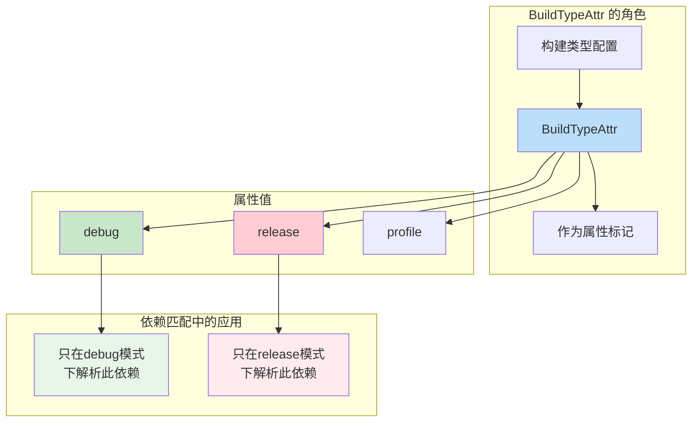
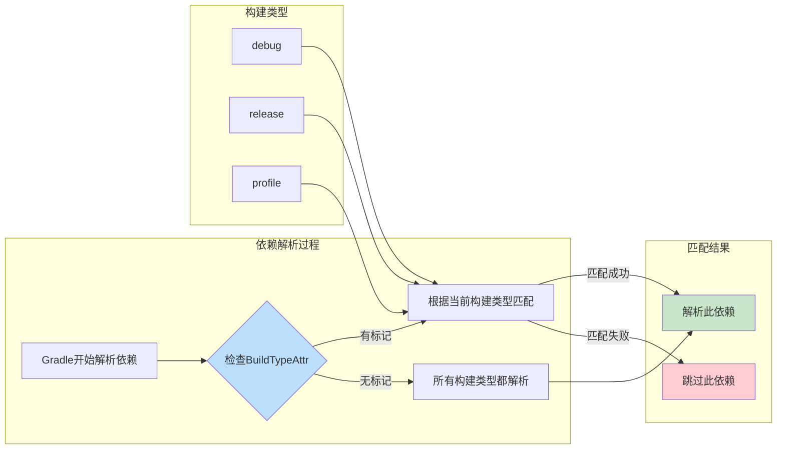
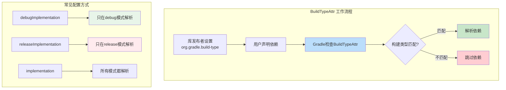

# 21.1.52 BuildTypeAttr

东边的天际线已经彻底亮了起来，星星们悄悄退场，只有最亮的那几颗还能依稀看见。露水在草叶上闪闪发亮，像是撒了一地的碎钻。

就在四个女孩收拾好毯子，准备回帐篷睡觉的时候，洛芙忽然停住了脚步。

“黛琳，等一下。”洛芙眨了眨眼，“你刚才说的那个版本属性……我是说AgpVersionAttr，它说的是AGP的版本。那如果我们想指定——比如这个库只在debug模式下用，那个库只在release模式下用——有没有类似的属性？”

黛琳愣了一下，然后露出一个赞许的微笑：“洛芙，你这个问题问得太好了。”

希尔已经把迈进帐篷的脚又收了回来：“对啊！我之前就想过这个问题——有些库，比如LeakCanary，只能在debug用；有些分析工具，release模式下根本不需要。能不能在依赖声明的时候就指定清楚？”

“能的。”黛琳重新把毯子裹好，“这就涉及到我们今天要讲的最后一个概念——`BuildTypeAttr`，构建类型属性。”

伊莎又把膝盖蜷缩起来，像一只好奇的小猫：“构建类型……是说debug和release那种吗？”

“没错。”黛琳看向东方刚刚升起的晨曦，“debug、release、debuggable、release……这些就是Android构建系统中的'构建类型'。而`BuildTypeAttr`，就是用来描述这些构建类型的属性类型。”

---

## 晨曦中的新话题：什么是构建类型属性

洛芙揉了揉刚要闭上又睁开的眼睛：“所以……这个属性是做什么的？”

“简单说，”黛琳伸出手指，在空中画了一个简单的方框，“`BuildTypeAttr`——构建类型属性——是用来在依赖匹配时指定'这个依赖需要在什么构建类型下才能使用'的属性。”

她停顿了一下，让这个概念沉淀。

“你们还记得我们之前配置build.gradle的时候，会有`buildTypes`这个配置项吗？”黛琳问。

希尔点头：“记得！就是debug、release、profile这些。”

“对。”黛琳说，“`BuildTypeAttr`就是描述这些构建类型的属性。比如你有一个库，它标记了自己需要`debug`构建类型——那意思就是'这个库只能在debug模式下使用，release模式下不要来找我'。”

伊莎轻声说：“这就像是……露营时的'分工表'？有的人只在白天值班，有的人只在晚上值班？”

“很好的比喻！”黛琳笑了，“`BuildTypeAttr`就是构建系统里的'分工表'——它告诉系统，哪个依赖应该在哪种构建类型下工作。”

---

## 构建类型的层次：debug与release的秘密

希尔把笔记本打开，屏幕上还残留着之前代码的余光：“让我给你们看一下，我们平时配置的构建类型长什么样。”

她在键盘上敲了几下，调出一个典型的build.gradle配置：

```groovy
android {
    buildTypes {
        debug {
            debuggable true
            minifyEnabled false
        }
        release {
            debuggable false
            minifyEnabled true
            shrinkResources true
        }
        profile {
            initWith release
            debuggable true
        }
    }
}
```

“图1展示了典型的构建类型配置。”希尔说，“我们通常有debug、release这两种基本类型，有时候还会自定义profile类型。每个类型有不同的设置——比如debug版本可以调试，release版本会压缩和混淆代码。”

黛琳点点头：“而`BuildTypeAttr`，就是描述这些'类型'的属性。它不是配置本身，而是描述这些配置的'标签'。”

她在空中画了一个简单的图：



“图2展示了BuildTypeAttr的工作流程。”黛琳解释道，“当你声明一个依赖时，如果那个库在元数据里标记了`BuildTypeAttr`，Gradle就会根据你当前的构建类型，决定是否解析这个依赖——或者说，在什么构建类型下才能使用这个依赖。”

---

## 实际场景：什么时候需要构建类型属性

洛芙举手提问：“那……现实中什么时候会用到这个？感觉我们平时写代码，没有特别指定过build type啊？”

希尔笑了笑：“那是因为很多库已经帮你处理好了。让我给你举几个例子——你肯定遇到过。”

她在笔记本上列举了几个常见场景：

**场景1：调试库只在debug模式下使用**

```groovy
// build.gradle
dependencies {
    // LeakCanary - 内存泄漏检测库
    // 只在debug变体中自动引入
    debugImplementation 'com.squareup.leakcanary:leakcanary-android:2.12'
    
    // 这个依赖在release构建时根本不会被解析
    // 不会增加release APK的体积
}
```

“看到了吗？”希尔说，“这里用的是`debugImplementation`，不是普通的`implementation`——这就是利用了构建类型属性的结果。”

洛芙眼睛瞪大了：“哦！原来`debugImplementation`是这么回事！”

“`debugImplementation`是Gradle提供的一个语法糖。”黛琳补充道，“它的底层原理就是BuildTypeAttr——Gradle知道当前是'debug'构建类型，就会去解析带有`debug`标记的依赖；如果是'release'构建，就忽略这些依赖。”

**场景2：Release专用库**

```groovy
// build.gradle
dependencies {
    // Facebook的代码压缩库，只在release时需要
    releaseImplementation 'com.facebook.fresco:ImagePipeline:3.6.0'
    
    // 分析工具，release模式下自动开启
    releaseImplementation 'com.crashlytics.sdk.android:crashlytics:18.4.0'
}
```

希尔继续说：“还有一种反向的场景——某些库只在release模式下需要。比如代码混淆、分析上报——debug模式下根本用不到。”

伊莎轻声说：“这样就不会把不需要的东西打包进去，减轻了APK的负担。”

“正是如此！”黛琳打了个响指，“这正是BuildTypeAttr的精髓——让构建系统能够智能地根据构建类型筛选依赖，实现APK体积优化。”

---

## 深入理解：BuildTypeAttr的底层机制

黛琳的表情变得认真起来：“如果说前面的AgpVersionAttr是'版本检查员'，那BuildTypeAttr就是'类型过滤器'——它不是检查版本兼容性，而是直接在源头过滤掉不需要的依赖。”

她在余烬旁边的空地上画了一个更详细的图：



“图3展示了BuildTypeAttr的匹配流程。”黛琳说，“核心逻辑是：如果一个依赖在元数据里标记了`BuildTypeAttr`，那Gradle就会检查当前构建类型是否匹配——匹配就解析，不匹配就跳过；如果没有标记，那就在所有构建类型下都解析。”

洛芙问：“那……如果我想让自己的库支持这个，应该怎么做？”

“好问题。”黛琳看向希尔，“希尔，你之前发布过库吗？是怎么处理的？”

希尔想了想：“我之前发布库的时候，会在gradle.properties或者通过Maven发布配置来指定这个。但实际上，Android Gradle Plugin在发布AAR的时候，会自动根据你的构建类型配置来设置这个属性。”

她打开一个真实的AAR元数据示例：

```json
{
    "format_version": 1,
    "component": {
        "group": "com.example",
        "module": "mylibrary",
        "version": "1.0.0",
        "attributes": {
            "org.gradle.build-type": "debug"
        }
    }
}
```

“看到没有？”希尔指着屏幕说，“这里有个`org.gradle.build-type`属性——它就是BuildTypeAttr的实际存储形式。库的发布者可以通过这个属性，声明自己的库适合哪种构建类型。”

---

## 反模式与重构：构建类型声明的常见错误

黛琳的表情变得严肃起来：“让我给你们讲讲常见的错误做法——这些错误我见过很多次。”

她在空地上画了一个大大的叉：

**❌ 错误做法1：把调试库放进implementation**

```groovy
// build.gradle (错误示例)
dependencies {
    // LeakCanary 放进了普通 implementation
    implementation 'com.squareup.leakcanary:leakcanary-android:2.12'
    
    // 结果：release APK也会包含LeakCanary
    // 不仅浪费空间，还可能导致问题
}
```

“这种错误很常见。”黛琳说，“把只在debug需要的库放进了普通依赖，结果就是release包也包含了这些调试工具——体积变大不说，还可能引发奇怪的问题。”

**❌ 错误做法2：release模式使用了debug专用库**

```groovy
// build.gradle (错误示例)
dependencies {
    // 某些日志库只在debug模式下安全
    implementation 'com.jakewharton.timber:timber:5.0.1'
    
    // 如果在代码里没有做好 Timber.tag().d() 这样的保护
    // release模式可能会有性能问题
}
```

黛琳补充道：“还有一些库，虽然技术上可以在所有模式下使用，但如果在release模式下不做好防护，可能会影响性能或安全——比如某些调试日志库。”

**❌ 错误做法3：混淆了build variant和build type**

```groovy
// build.gradle (错误示例)
android {
    buildTypes {
        debug { ... }
        release { ... }
    }
    
    // 产品风味（productFlavors）和构建类型（buildTypes）是两个概念
    // 有些人把它们混为一谈
    productFlavors {
        free { ... }    // 这是产品风味
        paid { ... }    // 不是构建类型！
    }
}
```

希尔解释道：“productFlavors（产品风味）和buildTypes（构建类型）是两个不同的概念。BuildTypeAttr只管buildTypes，不管flavors——别把它们搞混了。”

**✅ 正确做法：合理使用构建类型依赖**

```groovy
// build.gradle (正确示例)
dependencies {
    // 调试库只在debug模式下引入
    debugImplementation 'com.squareup.leakcanary:leakcanary-android:2.12'
    
    // release专用库
    releaseImplementation 'com.crashlytics.sdk.android:crashlytics:18.4.0'
    
    // 两者都需要
    implementation 'com.jakewharton.timber:timber:5.0.1'
    
    // 仅供测试的依赖
    testImplementation 'junit:junit:4.13.2'
    androidTestImplementation 'androidx.test.ext:junit:1.1.5'
}
```

“图4展示了正确的构建类型依赖配置方式。”黛琳说，“基本原则是：只在需要的地方引入依赖，不要把调试工具带进正式发布。”

---

## 代码实验：验证BuildTypeAttr的效果

希尔跃跃欲试地搓了搓手：“让我演示一下，怎么验证BuildTypeAttr是不是在工作。”

她打开终端，敲了几个命令：

```bash
# 先用debug构建，看看依赖树
./gradlew :app:dependencies --configuration debugRuntimeClasspath | grep leakcanary

# 输出示例：
# +--- com.squareup.leakcanary:leakcanary-android:2.12
# |    \--- com.squareup.leakcanary:leakcanary-core:2.12

# 再用release构建，看看依赖树
./gradlew :app:dependencies --configuration releaseRuntimeClasspath | grep leakcanary

# 输出示例：
# (no dependencies)
```

“看！”希尔兴奋地说，“debug模式下能看到LeakCanary，release模式下完全没有——这就是BuildTypeAttr在起作用。”

洛芙惊叹道：“原来构建系统背后做了这么多事情！”

黛琳点点头：“你们现在理解了吧——`BuildTypeAttr`就是让这种智能过滤成为可能的关键属性。它不是凭空存在的，而是存储在库的元数据里，告诉Gradle'这个库适合哪种构建类型'。”

---

## 构建类型的进阶：自定义与组合

伊莎好奇地问：“如果我想创建自己的构建类型……可以吗？”

黛琳笑了：“当然可以。让我给你们展示一下。”

她在空中画了一个示意：

```kotlin
// build.gradle.kts (进阶用法)
android {
    // 创建自定义构建类型
    buildTypes {
        create("staging") {
            initWith(getByName("debug"))
            applicationIdSuffix = ".staging"
            versionNameSuffix = "-staging"
        }
        
        create("production") {
            initWith(getByName("release"))
            isMinifyEnabled = true
            isShrinkResources = true
            proguardFiles(
                getDefaultProguardFile("proguard-android-optimize.txt"),
                "proguard-rules.pro"
            )
        }
    }
}
```

“图5展示了自定义构建类型的方式。”黛琳说，“你可以基于现有的debug或release，创建自己的构建类型——比如staging（预发布）、production（正式生产）等。”

希尔补充道：“而且你可以在dependencies里针对这些自定义构建类型声明依赖：”

```groovy
dependencies {
    // staging 专用
    stagingImplementation 'com.example:staging-tools:1.0.0'
    
    // production 专用
    productionImplementation 'com.example:analytics:2.0.0'
}
```

---

## 露营比喻：理解构建类型的分工

伊莎忽然有了一个想法：“黛琳，我有一个比喻——不知道合不合适。”

“说吧。”

“我们露营的时候，”伊莎说，“白天大家轮流做饭、打扫、搭帐篷——这些都是'日常任务'。但到了晚上守夜，只需要两个人就够了，对吧？其他人可以睡觉。”

她继续说：“构建类型也是这样——有些库是'白天用的'（debug模式），比如调试工具、Log日志；有些库是'晚上用的'（release模式），比如性能监控、Crash上报。它们各司其职，互不干扰。”

洛芙眼睛一亮：“所以BuildTypeAttr就是那个'排班表'！它告诉系统，谁应该在什么时候工作——debug模式下请debug的依赖来帮忙，release模式下请release的依赖来帮忙！”

“完全正确！”伊莎笑了，“而且这样做的可不止是省事——它还能让我们的APK更小，因为不需要的东西根本不会被放进去。”

---

## 知识的收尾：构建系统的精妙设计

东边的太阳已经完全升起来了，金色的阳光洒在露营地上，露珠开始蒸发，空气里弥漫着青草的清香。

洛芙伸了个懒腰，打了个大大的哈欠：“哇……我们竟然又聊了一整夜。”

“但是值得，对吧？”黛琳笑着说，“今天我们学了两个重要的概念——AgpVersionAttr和BuildTypeAttr。它们就像是构建系统的两个守护者：一个管版本兼容性，一个管构建类型匹配。”

希尔总结道：

- `BuildTypeAttr`是描述构建类型（debug、release等）的属性
- 它存储在库的元数据中，标记库适合哪种构建类型
- Gradle根据当前构建类型，决定是否解析某个依赖
- 使用`debugImplementation`、`releaseImplementation`等语法糖可以轻松利用这个机制
- 合理使用可以显著减小APK体积

“去睡觉吧。”黛琳轻声说，“今天收获太大了——Artifact、VersionAttr、BuildTypeAttr……我们已经有了一个很完整的构建知识框架。接下来只需要在实践中慢慢体会就好。”

四个女孩收拾好毯子和笔记本，慢慢走向帐篷。晨光洒在她们身上，暖洋洋的。露营地的草叶上，露珠在阳光下闪闪发亮——那是夜晚留下的礼物，也是新一天开始的象征。

---

> **技术总结**
> 
> **BuildTypeAttr（构建类型属性）** 是Android Gradle API中用于描述构建类型（如debug、release、profile）的属性类型。它在依赖解析阶段发挥作用，使得Gradle能够根据当前构建类型智能地筛选依赖。
> 
> 核心机制：
> - 库的元数据中通过`org.gradle.build-type`属性标记适用的构建类型
> - Gradle在解析依赖时检查此属性，根据当前构建类型决定是否解析
> - 使用`debugImplementation`、`releaseImplementation`等配置可以轻松利用此机制
> - 此机制可有效减小特定构建类型的APK体积，避免不必要的依赖被包含

---



---

> **学习建议**
> 
> 1. 记住一个原则：调试工具用`debugImplementation`，发布工具用`releaseImplementation`
> 2. 定期检查依赖树，了解哪些依赖在哪些构建类型下被解析
> 3. 使用`./gradlew dependencies`命令验证BuildTypeAttr的效果
> 4. 不要把调试库放进普通`implementation`，会增加APK体积
> 5. 区分`buildTypes`和`productFlavors`——它们是两种不同的维度

---

## 洛芙的小小日记本

今天学到了BuildTypeAttr！原来debug和release不仅仅是配置项，它们背后还有一套属性系统在工作。伊莎的"排班表"比喻太形象了——各司其职，不多不少。用好debugImplementation和releaseImplementation，APK体积能小好多呢！明天睡醒要试试看。🌅

---

## 今日关键词

- **BuildTypeAttr**：构建类型属性，用于描述debug、release等构建类型
- **buildTypes**：Gradle中定义构建类型的配置块
- **debugImplementation**：只在debug构建类型下解析的依赖配置
- **releaseImplementation**：只在release构建类型下解析的依赖配置
- **构建类型**：Android Gradle中的构建变体类型，如debug、release、profile
- **org.gradle.build-type**：库元数据中存储构建类型属性的键名
- **依赖解析**：Gradle分析并确定依赖版本的过程
- **APK体积优化**：通过排除不必要的依赖来减小APK大小
- **productFlavors**：产品风味，与buildTypes不同的另一个维度
- **build variant**：构建变体，由productFlavor和buildType组合而成
