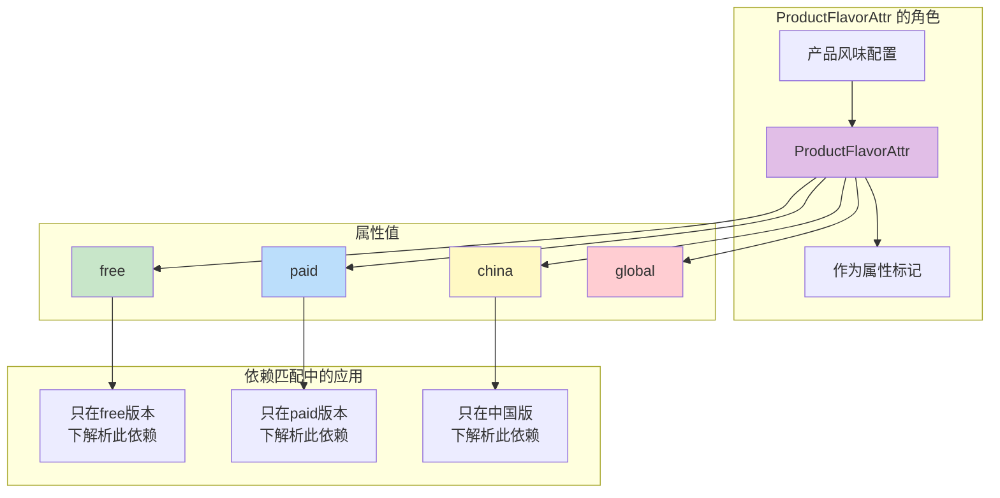
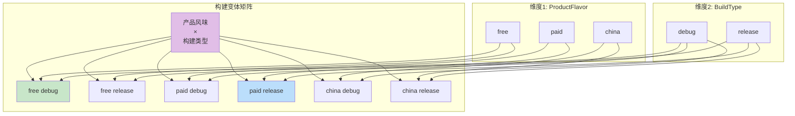
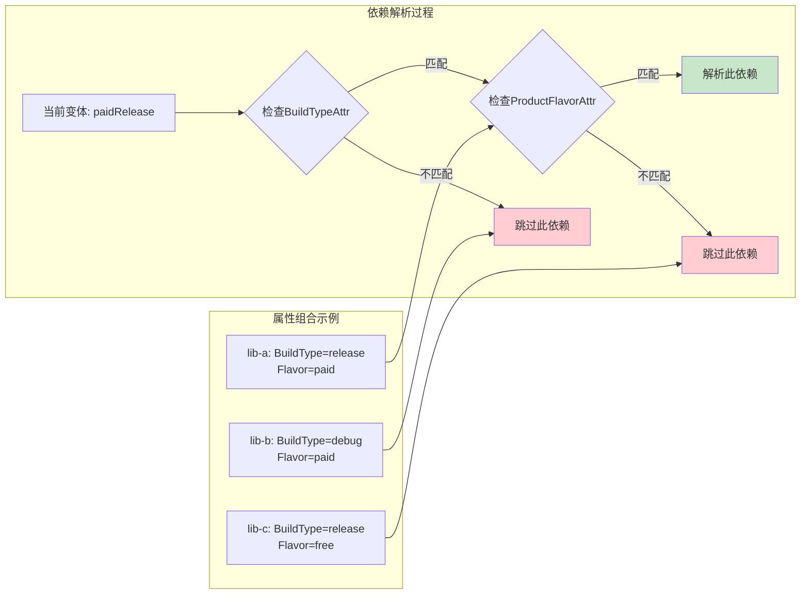
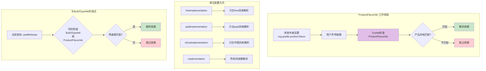

# 21.1.53 ProductFlavorAttr

太阳已经完全跃出了地平线，金色的光芒像瀑布一样倾泻在露营地上。草叶上的露珠开始蒸发，空气里弥漫着潮湿的青草香气——那是清晨特有的味道。

洛芙打了个大大的哈欠，眼皮有点沉，但脑子却异常清醒。

“黛琳，”她揉了揉眼睛，“刚才说的BuildTypeAttr我好像懂了——它管的是debug、release这种构建类型。那……如果我想区分不同的产品版本呢？比如免费版和付费版的那种？”

黛琳刚要开口，希尔已经从草地上跳了起来。

“对！我正想这个问题！”希尔兴奋地说，“我们公司有个App，分为free和paid两个版本，有些库只在付费版里用——这该怎么弄？”

“问得好。”黛琳微笑着重新坐好，“这就要用到我们今天要讲的第二个重要概念——`ProductFlavorAttr`，产品风味属性。”

伊莎把膝盖蜷起来，像一只好奇的小猫：“产品……风味？这名字听起来好像一道菜。”

“确实很有意思的名字，对吧？”黛琳说，“产品风味——Product Flavor——是Android构建系统里的另一个维度。它和构建类型（Build Type）一起，构成了我们常说的'变体'（Variant）。”

---

## 清晨的新概念：什么是产品风味属性

洛芙远东边的山丘轮廓清晰：“所以……这个ProductFlavorAttr到底是做什么的？”

“简单说，”黛琳用手比划着，“`ProductFlavorAttr`——产品风味属性——是用来在依赖匹配时指定'这个依赖需要在什么产品风味下才能使用'的属性。”

她指向还在冒热气的咖啡杯：“打个比方——如果你有一款露营App，分为'基础版'和'进阶版'。基础版用的是免费的地图服务，进阶版用的是付费的高级地图服务。这两种'版本'，在Gradle里就是'产品风味'。”

希尔补充道：“ProductFlavorAttr就是描述这些'风味'的属性标签。比如你有一个库，它标记了自己需要'paid'产品风味——那意思就是'这个库只能在付费版里使用，免费版不要来找我'。”

伊莎轻声说：“这和BuildTypeAttr好像啊……一个是按构建类型筛，一个是按产品风味筛。”

“完全正确！”黛琳打了个响指，“它们的工作原理几乎一样，只是筛选的维度不同——BuildTypeAttr管的是'debug'、'release'这种构建类型；ProductFlavorAttr管的是'free'、'paid'这种产品风味。”

---

## 产品风味的层次：free与paid的秘密

希尔把笔记本摊开在草地上，阳光照得屏幕有点反光：“让我给你们看一下典型的产品风味配置长什么样。”

她在键盘上敲了几下，调出一个典型的build.gradle配置：

```groovy
android {
    // 定义两种产品风味
    productFlavors {
        free {
            applicationIdSuffix ".free"
            versionNameSuffix "-free"
            // 免费版特有的配置
            buildConfigField "boolean", "IS_PREMIUM", "false"
        }
        paid {
            applicationIdSuffix ".paid"
            versionNameSuffix "-paid"
            // 付费版特有的配置
            buildConfigField "boolean", "IS_PREMIUM", "true"
        }
        // 甚至可以按地区分发不同版本
        china {
            applicationIdSuffix ".cn"
            buildConfigField "String", "SERVER_REGION", "\"CN\""
        }
        global {
            applicationIdSuffix ".global"
            buildConfigField "String", "SERVER_REGION", "\"GLOBAL\""
        }
    }
}
```

“图1展示了典型的产品风味配置。”希尔说，“产品风味可以有很多种——最常见的是免费版/付费版（free/paid），还有按地区分的（中国版/全球版china/global），按功能分的（基础版/专业版）等等。每个风味可以有不同的配置。”

黛琳点点头：“而`ProductFlavorAttr`，就是描述这些'风味'的属性。它不是配置本身，而是描述这些配置的'标签'。”

她在草地上画了一个简单的示意：



“图2展示了ProductFlavorAttr的工作流程。”黛琳解释道，“当你声明一个依赖时，如果那个库在元数据里标记了`ProductFlavorAttr`，Gradle就会根据你当前的产品风味，决定是否解析这个依赖——或者说，在什么产品风味下才能使用这个依赖。”

---

## 实际场景：什么时候需要产品风味属性

洛芙举手提问：“那……现实中什么时候会用到这个？感觉我们平时写代码，也没有特别指定过flavor啊？”

希尔笑了笑：“那是因为很多库已经帮你处理好了。让我给你举几个例子——你肯定遇到过。”

她在笔记本上列举了几个常见场景：

**场景1：付费版专用功能库**

```groovy
// build.gradle
dependencies {
    // 免费版：使用广告SDK
    freeImplementation 'com.google.android.gms:admob:22.3.0'
    
    // 付费版：使用高级分析库
    paidImplementation 'com.google.firebase:firebase-analytics:21.5.0'
    
    // 付费版专用的UI组件库
    paidImplementation 'com.github.bumptech.glide:glide:4.15.1'
}
```

“看到了吗？”希尔说，“这里用的是`freeImplementation`和`paidImplementation`——这就是利用了产品风味属性的结果。免费版不会有付费版的依赖，付费版也不会有广告SDK。”

洛芙眼睛瞪大了：“所以我们平时说的'免费版没有广告'，背后是这么实现的！”

**场景2：地区专用库**

```groovy
// build.gradle
dependencies {
    // 中国版：使用国内支付SDK
    chinaImplementation 'com.alipay.sdk:alipay-sdk:15.7.6'
    
    // 全球版：使用PayPal
    globalImplementation 'com.paypal.sdk:paypal-android-sdk:5.0.2'
    
    // 共同的依赖
    implementation 'com.squareup.retrofit2:retrofit:2.9.0'
}
```

希尔继续说：“还有一种场景——不同地区需要不同的SDK。比如中国版需要支付宝SDK，全球版需要PayPal SDK——这些都是通过产品风味来区分的。”

伊莎轻声说：“这样就不会把不需要的SDK打包进去，既节省空间又避免冲突。”

“正是如此！”黛琳打了个响指，“这正是ProductFlavorAttr的精髓——让构建系统能够智能地根据产品风味筛选依赖，实现APK定制化。”

---

## 构建变体：产品风味与构建类型的组合

黛琳的表情变得认真起来：“接下来我要讲一个很重要的概念——构建变体（Build Variant）。它是我们之前学的BuildType和今天学的ProductFlavor的组合。”

她在草地上画了一个矩阵：



“图3展示了构建变体的概念。”黛琳说，“每一个变体 = 产品风味 + 构建类型。比如'freeDebug'、'paidRelease'、'chinaRelease'等等。”

洛芙问：“那……依赖匹配的时候，是怎么工作的？”

“好问题！”黛琳解释道，“当Gradle解析依赖时，它会同时检查BuildTypeAttr和ProductFlavorAttr两个属性。只有当两个属性都匹配当前变体时，依赖才会被解析。”

她在空中画了一个更详细的流程：



“图4展示了双重过滤机制。”黛琳说，“只有当BuildTypeAttr和ProductFlavorAttr同时匹配当前变体时，依赖才会被解析。这种机制非常强大，可以实现非常精细的依赖控制。”

---

## 反模式与重构：产品风味声明的常见错误

黛琳的表情变得严肃起来：“让我给你们讲讲常见的错误做法——这些错误我见过很多次。”

她在空中画了一个大大的叉：

**❌ 错误做法1：把付费库放进普通implementation**

```groovy
// build.gradle (错误示例)
dependencies {
    // 高级分析库放进了普通 implementation
    implementation 'com.google.firebase:firebase-analytics:21.5.0'
    
    // 结果：免费版也会包含这个库
    // 不仅浪费空间，还要为不需要的功能付钱
}
```

“这种错误很常见。”黛琳说，“把只在付费版需要的库放进了普通依赖，结果就是所有版本都包含了这些库——APK体积变大，成本也增加了。”

**❌ 错误做法2：混淆了productFlavor和buildType**

```groovy
// build.gradle (错误示例)
android {
    productFlavors {
        debug { ... }    // 错误！debug是buildType，不是flavor
        release { ... }  // 错误！release是buildType，不是flavor
    }
    
    buildTypes {
        free { ... }     // 错误！free是flavor，不是buildType
        paid { ... }     // 错误！paid是flavor，不是buildType
    }
}
```

希尔补充道：“productFlavors和buildTypes是两个不同的概念，不能混用。flavor通常用来区分不同的产品版本，type通常用来区分不同的构建方式。”

**❌ 错误做法3：没有正确使用维度**

```groovy
// build.gradle (错误示例)
android {
    // 只定义了一个flavor维度
    flavorDimensions += "version"
    productFlavors {
        free { }
        paid { }
    }
    
    // 但是某个依赖想指定多维度
    // 不知道怎么做
}
```

黛琳解释道：“多维度产品风味需要正确配置`flavorDimensions`。Gradle支持多维度 flavors，可以实现更复杂的变体组合。”

**✅ 正确做法：合理使用产品风味依赖**

```groovy
// build.gradle (正确示例)
android {
    // 正确配置flavor维度
    flavorDimensions += "version"
    flavorDimensions += "region"
    
    productFlavors {
        free { dimension "version" }
        paid { dimension "version" }
        china { dimension "region" }
        global { dimension "region" }
    }
}

dependencies {
    // 免费版专用
    freeImplementation 'com.google.android.gms:admob:22.3.0'
    
    // 付费版专用
    paidImplementation 'com.google.firebase:firebase-analytics:21.5.0'
    
    // 中国版专用
    chinaImplementation 'com.alipay.sdk:alipay-sdk:15.7.6'
    
    // 全球版专用
    globalImplementation 'com.paypal.sdk:paypal-android-sdk:5.0.2'
    
    // 所有版本都需要
    implementation 'com.squareup.retrofit2:retrofit:2.9.0'
}
```

“图5展示了正确的产品风味依赖配置方式。”黛琳说，“基本原则是：只在需要的地方引入依赖，不要把不需要的东西打包进去。”

---

## 代码实验：验证ProductFlavorAttr的效果

希尔跃跃欲试地搓了搓手：“让我演示一下，怎么验证ProductFlavorAttr是不是在工作。”

她打开终端，敲了几个命令：

```bash
# 查看freeDebug变体的依赖树
./gradlew :app:dependencies --configuration freeDebugRuntimeClasspath | grep admob

# 输出示例：
# +--- com.google.android.gms:admob:22.3.0
# |    \--- com.google.android.gms:play-services-ads:22.3.0

# 查看paidDebug变体的依赖树
./gradlew :app:dependencies --configuration paidDebugRuntimeClasspath | grep firebase

# 输出示例：
# +--- com.google.firebase:firebase-analytics:21.5.0
# |    \--- com.google.firebase:firebase-common:21.0.0

# 查看freeDebug变体的firebase依赖（应该没有）
./gradlew :app:dependencies --configuration freeDebugRuntimeClasspath | grep firebase

# 输出示例：
# (no dependencies)
```

“看！”希尔兴奋地说，“free版本能看到Admob（广告），没有Firebase（分析）；paid版本能看到Firebase，没有Admob——这就是ProductFlavorAttr在起作用。”

洛芙惊叹道：“原来构建系统背后做了这么多事情！而且还能同时检查BuildType和ProductFlavor两个维度！”

黛琳点点头：“你们现在理解了吧——`ProductFlavorAttr`就是让这种智能过滤成为可能的关键属性。它不是凭空存在的，而是存储在库的元数据里，告诉Gradle'这个库适合哪种产品风味'。”

---

## 产品风味的进阶：多维度与变体命名

伊莎好奇地问：“如果我想创建很多种产品风味……可以吗？”

黛琳笑了：“当然可以。让我给你们展示一下更复杂的用法。”

她在空中画了一个示意：

```kotlin
// build.gradle.kts (进阶用法)
android {
    // 定义多个flavor维度
    flavorDimensions += "version"
    flavorDimensions += "region"
    flavorDimensions += "device"
    
    productFlavors {
        // 第一个维度：版本
        create("free") {
            dimension = "version"
            applicationIdSuffix = ".free"
        }
        create("paid") {
            dimension = "version"
            applicationIdSuffix = ".paid"
        }
        
        // 第二个维度：地区
        create("china") {
            dimension = "region"
        }
        create("global") {
            dimension = "region"
        }
        
        // 第三个维度：设备类型
        create("phone") {
            dimension = "device"
        }
        create("tablet") {
            dimension = "device"
        }
    }
}
```

“图6展示了多维度产品风味的配置方式。”黛琳说，“你可以创建多个维度的flavor——比如同时按版本、地区、设备类型来区分。”

希尔补充道：“而且生成的变体名称会按维度组合：”

```text
freeChinaPhoneDebug
freeChinaPhoneRelease
freeChinaTabletDebug
freeGlobalPhoneDebug
paidChinaPhoneDebug
...
```

“变体数量 = flavor1数量 × flavor2数量 × ... × buildType数量。”黛琳说，“如果配置了3个flavor维度，每个维度2个选项，再加上debug和release两种buildType，那就是 2×2×2×2 = 16 个变体！”

---

## 露营比喻：理解产品风味的分工

伊莎忽然有了一个想法：“黛琳，我有一个比喻——不知道合不合适。”

“说吧。”

“我们露营的时候，”伊莎说，“如果同时有'夏令营'和'冬令营'——它们虽然都是露营，但是装备不同、时间不同、参与的人也不同。对吧？”

她继续说：“产品风味也是这样——同样是一个App，但是面向不同的'市场'——免费用户和付费用户，中国用户和全球用户。它们共享大部分代码，但是根据不同的'风味'，配置不同的依赖和功能。”

洛芙眼睛一亮：“所以ProductFlavorAttr就是那个'市场定位器'！它告诉系统，这个依赖应该卖给哪个'市场'——free市场的用户看不到paid的依赖，china市场的用户用不到global的SDK！”

“完全正确！”伊莎笑了，“而且这样做的可不止是省事——它还能让我们的APK更精准，因为每个版本只包含它真正需要的东西。”

---

## 知识的收尾：构建系统的完整框架

太阳已经完全升起来了，温暖的阳光照在四个女孩身上。草叶上的露珠已经消失不见，空气里弥漫着阳光和青草混合的温暖香气。

洛芙伸了个懒腰，打了第二个大大的哈欠：“哇……我们学了好多了。”

“确实很多。”黛琳笑着说，“今天我们学了两个重要的概念——BuildTypeAttr和ProductFlavorAttr。它们就像是构建系统的两个守护者：一个管构建类型匹配，一个管产品风味匹配。”

希尔总结道：

- `ProductFlavorAttr`是描述产品风味（如free、paid、china、global等）的属性
- 它存储在库的元数据中，标记库适合哪种产品风味
- Gradle在解析依赖时同时检查BuildTypeAttr和ProductFlavorAttr
- 使用`freeImplementation`、`paidImplementation`等配置可以轻松利用此机制
- 多维度产品风味可以实现非常精细的依赖控制
- 合理使用可以显著减小特定变体的APK体积

“去睡觉吧。”黛琳轻声说，“今天收获太大了——Artifact、VersionAttr、BuildTypeAttr、ProductFlavorAttr……我们已经有了一个很完整的构建属性知识框架。接下来只需要在实践中慢慢体会就好。”

四个女孩收拾好毯子和笔记本，慢慢走向帐篷。阳光洒在她们身上，暖洋洋的。露营地的草叶在风中轻轻摇曳，像是和大自然一起送别的挥手。

---

> **技术总结**
> 
> **ProductFlavorAttr（产品风味属性）** 是Android Gradle API中用于描述产品风味（如free、paid、china、global等）的属性类型。它在依赖解析阶段发挥作用，使得Gradle能够根据当前产品风味智能地筛选依赖。
> 
> 核心机制：
> - 库的元数据中通过`org.gradle.product-flavor`属性标记适用的产品风味
> - Gradle在解析依赖时检查此属性，根据当前产品风味决定是否解析
> - 使用`freeImplementation`、`paidImplementation`、`chinaImplementation`等配置可以轻松利用此机制
> - 多维度产品风味可以创建复杂的变体组合
> - 此机制可有效减小特定变体的APK体积，避免不必要的依赖被包含

---



---

> **学习建议**
> 
> 1. 记住一个原则：免费版用`freeImplementation`，付费版用`paidImplementation`
> 2. 定期检查依赖树，了解哪些依赖在哪些变体下被解析
> 3. 使用`./gradlew dependencies`命令验证ProductFlavorAttr的效果
> 4. 不要把付费版库放进普通`implementation`，会增加免费版APK体积
> 5. 区分`productFlavors`和`buildTypes`——它们是两种不同的维度
> 6. 多维度产品风味要注意变体数量爆炸问题

---

## 洛芙的小小日记本

今天学到了ProductFlavorAttr！原来free和paid版本背后是这样实现的——通过产品风味属性来区分依赖。黛琳说构建系统有两个守护者：一个管构建类型，一个管产品风味。伊莎的"市场定位器"比喻太形象了！用好flavor实现，APK可以精准定制呢。💤

---

## 今日关键词

- **ProductFlavorAttr**：产品风味属性，用于描述free、paid等产品风味
- **productFlavors**：Gradle中定义产品风味的配置块
- **freeImplementation**：只在free产品风味下解析的依赖配置
- **paidImplementation**：只在paid产品风味下解析的依赖配置
- **产品风味**：Android Gradle中的变体维度之一，如free、paid、china、global
- **org.gradle.product-flavor**：库元数据中存储产品风味属性的键名
- **构建变体**：由产品风味和构建类型组合而成的最终产物
- **flavorDimensions**：定义产品风味维度的配置
- **变体数量计算**：各维度flavor数量相乘，再乘以buildType数量
- **依赖解析**：Gradle分析并确定依赖版本的过程
- **APK体积优化**：通过排除不必要的依赖来减小APK大小