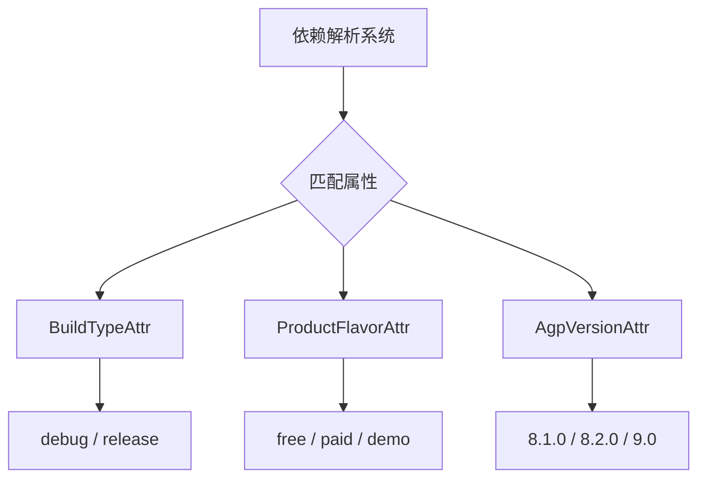

# 21.1.54 com.android.build.api.attributes

星空低垂，远处的山峦在夜色中呈现出温柔的黛蓝色。露水已经相当浓重了，草叶上挂满了晶莹的水珠，像撒了一地的碎钻。银河的光带静静地横亘天际，偶尔有流星划过，引来伊莎轻声的赞叹。

黛琳轻轻拍了拍手，把大家的注意力重新集中起来。

“刚才我们讲了ProductFlavorAttr，”她说道，“但其实它只是属性系统里的一个成员。今天我们要聊的，是整个属性家族——com.android.build.api.attributes这个包。”

“听起来像是一个大家族呢。”洛芙裹紧了身上的薄毯。

“没错，”黛琳微笑着点头，“这个包里藏着三个重要的属性类型，它们各自有不同的职责，但又配合得天衣无缝。伊莎，你来说说我们之前讲过的那个比喻？”

伊莎歪着头想了想：“你是说——露营地的不同区域？比如烧烤区、帐篷区、篝火区？”

“对，”黛琳打了个响指，“如果把整个Android项目的构建系统比作一个大露营地，那么属性就是在告诉每个‘货物’——也就是依赖库——应该被放在哪个区域。BuildType决定了它是放在‘ debug区’还是’release区'，ProductFlavor决定了它是放在‘付费版区'还是’免费版区'。”

“那AgpVersionAttr呢？”希尔好奇地问。

黛琳的表情变得认真起来：“这可是个很特别的属性。它是在Android Gradle Plugin 7.1.0版本才加入的，负责记录AGP本身的版本信息。想象一下——它就像露营地的管理员胸牌，标明了这个营地是由哪个版本的‘管理员’在管理。”

洛芙若有所思地点点头：“也就是说，三个属性分别管不同的事情？BuildType管构建类型，ProductFlavor管产品风味，AgpVersionAttr管AGP版本？”

“Exactly！”希尔打了个响指，“而且它们都遵循同一个规则——实现org.gradle.api.Named接口。这意味着每个属性都必须有一个名字，就像每个人都有身份证一样。”

黛琳站起身来，在草地上画了一个简单的示意图：



“图1展示了三属性在依赖解析中的作用，”黛琳解释道，“当Gradle要决定哪个依赖库适合当前配置时，它会检查这三个属性是否匹配。就像是露营地的保安会检查你戴的工作牌——BuildType属性决定你能不能进debug区域，ProductFlavor属性决定你能不能进free版本区域，而AgpVersionAttr则确保你带的‘装备'（库）与当前AGP版本兼容。”

希尔打开笔记本电脑：“我给你们看一个实际的例子。这是我之前做的一个项目，里面用到了不同的库——”

她噼里啪啦地敲了一阵，屏幕上出现了这样的配置：

```kotlin
// build.gradle.kts (app模块)

android {
    // 定义两种产品风味
    flavorDimensions += "version"
    productFlavors {
        create("free") {
            dimension = "version"
            applicationIdSuffix = ".free"
        }
        create("paid") {
            dimension = "version"
            applicationIdSuffix = ".paid"
        }
    }
}

dependencies {
    // 这是一个只在debug构建中使用的库
    "debugImplementation"("com.example:logger:1.0")
    
    // 这是一个只在release构建中使用的库
    "releaseImplementation"("com.example:analytics:1.0")
    
    // 这是一个只在free风味中使用的库
    "freeImplementation"("com.example:ads:1.0")
    
    // 这是一个只在paid风味中使用的库  
    "paidImplementation"("com.example:premium:1.0")
}
```

“看，”希尔指着屏幕说，“这些依赖声明看起来很简单，但背后发生的事情可复杂了。当我们构建'freeDebug'版本时，Gradle会检查每个库的属性：”

```kotlin
// Gradle内部属性匹配逻辑（简化版）
// 当解析 freeDebugImplementation 依赖时

fun resolveDependency(dependencies: List<Dependency>) {
    val buildType = "debug"      // 来自BuildTypeAttr
    val productFlavor = "free"   // 来自ProductFlavorAttr
    val agpVersion = "9.0"      // 来自AgpVersionAttr
    
    for (dep in dependencies) {
        // 检查库的属性是否与当前配置匹配
        if (dep.matchingAttributes[BuildTypeAttr] == buildType ||
            dep.matchingAttributes[BuildTypeAttr] == null) {
            // 允许匹配或未指定（兼容旧库）
            if (dep.matchingAttributes[ProductFlavorAttr] == productFlavor ||
                dep.matchingAttributes[ProductFlavorAttr] == null) {
                // 属性完全匹配，纳入候选
                candidates.add(dep)
            }
        }
    }
}
```

“等等，”洛芙举手提问，“为什么有些属性可以是null？要是没人指定怎么办？”

“好问题！”黛琳赞赏地说，“这就要说到属性的默认值和兼容性策略了。对于没有明确指定属性的库，Gradle有一个‘向后兼容’的机制——它会尝试用最宽松的方式匹配。这就像是一个露营地对待新来的客人：如果客人没有明确说要住帐篷区，那就让他们住公共休息区好了。”

伊莎轻声补充道：“而且啊，不同版本的AGP对这个属性系统的支持程度也不一样。AgpVersionAttr是7.1.0才加入的，如果是更老的项目，可能就看不到它。”

“那旧版本的AGP怎么办？”洛芙追问。

“旧版本会用其他方式记录版本信息，”黛琳解释道，“AgpVersionAttr只是提供了一种更标准、更类型安全的方式来做这件事。就像是用电子登记系统代替手写登记本——更规范，但也需要更新的系统支持。”

希尔切换了一下屏幕：“我再来给你们演示一个更复杂的场景——多模块项目中的属性传递。”

```kotlin
// 库模块 build.gradle.kts
android {
    defaultConfig {
        // 这里设置的属性会向下传递
    }
}

androidComponents {
    onVariants(selector().all()) { variant ->
        // 可以在这里查看每个变体的属性
        println("BuildType: ${variant.buildType}")
        println("ProductFlavor: ${variant.productFlavors}")
    }
}

// 使用 AttributeContainer API
val attributes = attributes {
    attribute(BuildTypeAttr, "debug")
    attribute(ProductFlavorAttr, "free")
    attribute(AgpVersionAttr, "9.0")
}

// 创建带属性的配置
val myConfiguration = configurations.create("myConfiguration") {
    attributes.attributes {
        attribute(BuildTypeAttr, "release")
    }
}
```

洛芙眼睛亮了起来：“我好像明白了！这个属性系统就像是一个过滤器，帮我们在构建时筛选出正确的依赖库！”

“对，”黛琳微笑着说，“而且它比简单的字符串匹配要强大得多。因为它是类型安全的——BuildTypeAttr只能是Named类型，ProductFlavorAttr也只能是Named类型。这就避免了像'freE'和'free'这样的拼写错误导致的匹配失败。”

夜风轻拂，帐蓬的帆布微微晃动。远处偶尔传来蟋蟀的低吟，整个营地笼罩在一种宁静而专注的氛围中。

伊莎仰头看着星空：“说起来，这三个属性就像是我们露营的三件宝——”

“是什么？”希尔好奇地问。

“地图、指南针、还有管理员手册，”伊莎轻声说，“BuildType像地图，告诉我们现在在哪里（debug还是release）；ProductFlavor像指南针，告诉我们方向对不对（免费还是付费）；AgpVersionAttr就像管理员手册，确保我们用的工具和营地规则匹配。”

黛琳忍不住笑了：“这个比喻真美。不过说真的，理解这个属性系统对于大型项目的依赖管理至关重要。特别是当你需要发布到不同的应用商店、维护多个版本的APP时——”

“那时候，这些属性就是你的好帮手！”希尔接过话头，“好了，时间也不早了。我们来总结一下吧？”

洛芙点点头：“我今晚学到的最重要的东西是——属性系统不是三个独立的东西，而是一个整体。BuildTypeAttr、ProductFlavorAttr和AgpVersionAttr各有分工，但它们共同构成了Android Gradle Plugin依赖匹配的基石。”

夜空中的星星仿佛在眨眼睛，露水在草叶上越聚越多。四个女孩相视一笑，今天的露营编程课堂又结束了一课。

---

> **学习建议**
> 
> com.android.build.api.attributes是Android Gradle Plugin依赖系统的核心抽象。理解属性匹配机制对于解决复杂的依赖冲突、设计多维度构建变体至关重要。建议先在小型项目中实验不同BuildType和ProductFlavor的组合，观察依赖解析的实际行为，再尝试自定义属性以实现更高级的变体控制。

## 洛芙的小小日记本

今晚的露营课好充实！黛琳把整个属性系统比作露营地的不同区域——BuildType是debug/release区，ProductFlavor是free/paid区，AgpVersionAttr是管理员胸牌。三个属性各管一摊，但一起工作的时候才能精准地找到对的依赖库。希尔演示的代码让我看到属性匹配的实际过程，原来gradle在背后默默做了这么多事情！明天还要继续探索~

---

## 今日关键词

**com.android.build.api.attributes**：Android Gradle Plugin提供的属性类型包，用于在依赖匹配中标识构建变体的特征。

**AgpVersionAttr**：Android Gradle Plugin版本属性类型（7.1.0+），用于记录和匹配AGP版本信息，确保依赖库与构建工具版本兼容。

**BuildTypeAttr**：构建类型属性类型（4.2.0+），用于标识debug/release等构建类型，决定依赖库在何种构建模式下生效。

**ProductFlavorAttr**：产品风味属性类型，用于标识free/paid/demo等产品维度，决定依赖库在何种产品配置下生效。

**Attribute<T>**：Gradle提供的通用属性容器接口，用于在Configuration上附加类型安全的属性键值对。

**Named**：Gradle的基础接口，所有属性类型都实现此接口以获得命名能力，属性值必须是命名过的（如"debug"、"free"）。

**Configuration**：Gradle的配置对象，表示一组依赖及其属性，用于变体匹配和依赖解析。

**依赖解析**：Gradle根据变体的属性值，从多个候选依赖中筛选出符合条件的最优解的过程。

**变体（Variant）**：Android构建系统中BuildType与ProductFlavor的组合，如freeDebug、paidRelease等。

**向后兼容**：属性系统对未明确指定属性的依赖库采用的宽松匹配策略，允许使用默认或最宽松的属性值。
