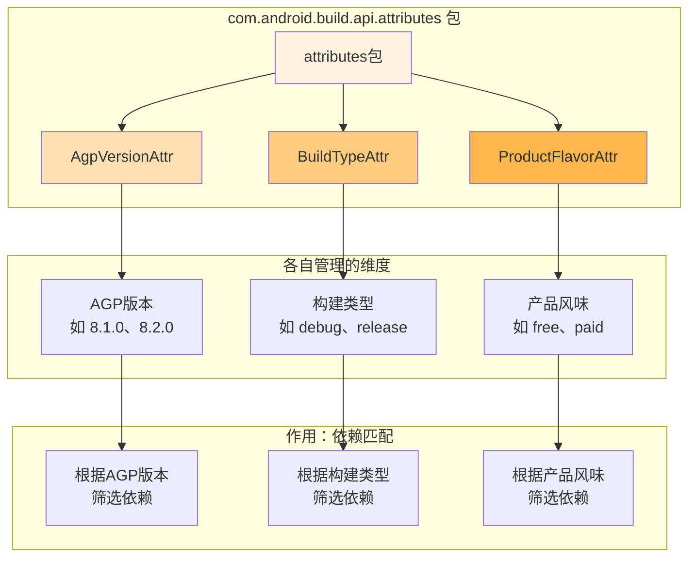
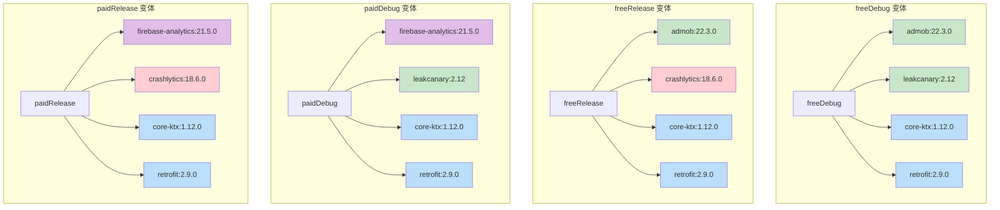
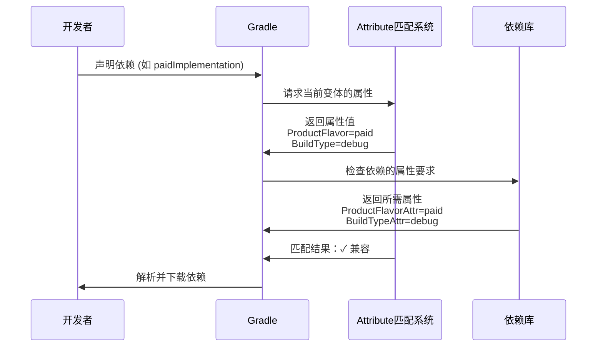

# 21.1.54 com.android.build.api.attributes

金色的阳光已经完全洒满营地，露珠早已蒸发干净，草地呈现出健康的翠绿色。远处的山丘轮廓清晰可辨，偶尔有白色的大鸟从头顶掠过，留下一串清亮的鸣叫声。

洛芙靠在折叠椅上，手里的热可可已经喝了一半。她望着正在整理背包的黛琳，犹豫了一下还是开口了。

“黛琳，等等。”洛芙说，“我们昨天学了ProductFlavorAttr，前天学了BuildTypeAttr，还有更早的AgpVersionAttr……我发现它们好像都是一类东西？”

黛琳的动作停下来，转过身来，露出赞许的微笑：“你观察得很仔细嘛，洛芙。”

希尔正把最后一个帐篷塞进背包，抬起头来说：“对，它们都属于`com.android.build.api.attributes`这个包——就是Android构建API里的属性类型家族。”

伊莎把膝盖蜷起来，像一只好奇的小猫：“attributes……属性？这个名字听起来好像在描述事物的特征。”

“没错！”黛琳走过来，重新在草地上坐下，“今天我们就是要来好好聊聊这个'属性家族'——看看这三个小伙伴是怎么一起工作的。”

---

## 上午的阳光：什么是属性类型

洛芙把手里的杯子放在草地上：“所以……它们三个都是'属性'？”

“对。”黛琳点点头，“在Android Gradle插件里，`com.android.build.api.attributes`这个包专门用来定义各种'属性类型'——你可以把它们理解为构建系统的'筛选标签'。”

她在空中画了三个圈：“你们还记得吗？我们之前学过——”

“AgpVersionAttr是AGP版本的属性！”洛芙抢着说。

“BuildTypeAttr是构建类型的属性！”希尔补充。

“ProductFlavorAttr是产品风味的属性！”伊莎笑着接上。

黛琳笑了：“没错！它们三个就是这个包里最重要的三个成员。简单来说——”



“图1展示了attributes包的完整结构。”黛琳解释道，“这个包就像是一个'属性商店'，Gradle在这里买到各种'标签'，用来给依赖打上标记，然后在构建时根据这些标签来筛选——哪些依赖应该在这次构建中出现，哪些不应该出现。”

---

## 属性家族的三兄弟：各司其职

伊莎歪着头：“那它们三个做的事情不是差不多吗？为什么要分三个？”

“好问题！”黛琳说，“虽然它们的工作原理类似，但管理的维度完全不同——就像一个公司里有三个部门，虽然都是'管理人事'，但分别管理不同方面。”

她掰着手指一个个解释：

**第一兄弟：AgpVersionAttr —— 版本守护者**

“这个是专门管'版本'的。”黛琳说，“它记录了你的项目用的是哪个版本的Android Gradle Plugin——是8.1.0，还是8.2.0，或者是更新的版本。”

洛芙举手提问：“那……这个能用来做什么？”

“比如有些库需要特定版本的AGP才能工作。”希尔插嘴道，“我之前遇到过——某个插件声明自己需要AGP 8.2.0以上，那AGP 8.1.0的项目就解析不了这个依赖。”

黛琳点头：“对，这就是AgpVersionAttr的作用——它确保依赖和你的AGP版本匹配，避免版本冲突。”

**第二兄弟：BuildTypeAttr —— 构建类型管家**

“这个你们很熟悉了。”黛琳说，“它管的是'debug'和'release'这两种构建类型。”

洛芙眼睛亮了：“我知道！debugImplementation就是用这个！”

“没错。”黛琳笑道，“BuildTypeAttr确保某些库只在debug模式下使用——比如LeakCanary这种调试工具，在release版本里根本不需要。”

**第三兄弟：ProductFlavorAttr —— 产品风味标识**

“这个是最近学的！”洛芙说，“它管的是free、paid这种产品版本！”

“对。”黛琳说，“ProductFlavorAttr让你可以为免费版和付费版分别配置不同的依赖——比如付费版可以有更高级的功能库，免费版则用广告SDK。”

---

## 三大属性的协同：构建变体的魔法

希尔把笔记本摊开，阳光照得屏幕闪闪发亮：“让我给你们看一个实际的例子——当这三个属性一起工作时，会发生什么。”

她在键盘上敲了几下，调出一个复杂的依赖配置：

```groovy
android {
    // 定义产品风味
    productFlavors {
        free {
            applicationIdSuffix ".free"
        }
        paid {
            applicationIdSuffix ".paid"
        }
    }
    
    // 定义构建类型
    buildTypes {
        debug {
            debuggable true
        }
        release {
            debuggable false
            minifyEnabled true
        }
    }
}

dependencies {
    // 1. 只在 paid + debug 时使用
    // 使用 ProductFlavorAttr="paid" + BuildTypeAttr="debug"
    'com.paid.debugImplementation': 'com.example.premium:debug-lib:1.0'
    
    // 2. 只在 paid + release 时使用
    // 使用 ProductFlavorAttr="paid" + BuildTypeAttr="release"
    'com.paid.releaseImplementation': 'com.example.premium:release-lib:1.0'
    
    // 3. 只在 free + debug 时使用
    // 使用 ProductFlavorAttr="free" + BuildTypeAttr="debug"
    'com.free.debugImplementation': 'com.example.ads:debug-sdk:3.0'
    
    // 4. 所有变体都使用
    // 不带任何属性标记
    'implementation': 'com.example.common:core:2.0'
}
```

“图2展示了三种属性如何协同工作。”希尔说，“当你选择'freeDebug'构建变体时，Gradle只会解析带有free标记的依赖；当你选择'paidRelease'时，就会解析paid+release的组合。”

黛琳补充道：“这就是为什么Android的构建系统如此灵活——你可以精确控制每个依赖在哪个变体下出现，既不会把不需要的库打包进去，也不会漏掉需要的库。”

洛芙惊叹道：“所以……我们之前学的三个属性，合起来就是一套完整的'变体筛选系统'？”

“完全正确！”黛琳打了个响指，“AgpVersionAttr确保版本兼容，BuildTypeAttr区分调试和发布，ProductFlavorAttr区分产品版本——三者组合，就是Android构建系统的'三维坐标轴'。”

---

## 实战演练：配置你的第一个多维度依赖

希尔拍了拍手：“光说不练假把式。洛芙，来，我们一起配置一个真实的场景。”

她把笔记本转向洛芙：“假设我们有一个App，有以下需求——”

“1. 免费版和付费版分别有不同的功能库”
“2. 调试版本需要LeakCanary，发布版本不需要”
“3. 需要确保AGP版本匹配”

洛芙跃跃欲试：“好，我来试试！”

她在键盘上敲了起来：

```groovy
android {
    // 第一步：定义产品风味（ProductFlavor）
    productFlavors {
        free {
            applicationIdSuffix ".free"
            versionNameSuffix "-free"
            // 免费版：广告ID
            buildConfigField "String", "AD_UNIT_ID", "\"ca-app-pub-xxx/free\""
        }
        paid {
            applicationIdSuffix ".paid"
            versionNameSuffix "-paid"
            // 付费版：高级功能开关
            buildConfigField "boolean", "ENABLE_PREMIUM_FEATURES", "true"
        }
    }
    
    // 第二步：定义构建类型（BuildType）
    buildTypes {
        debug {
            debuggable true
            minifyEnabled false
        }
        release {
            debuggable false
            minifyEnabled true
            shrinkResources true
        }
    }
}

dependencies {
    // ===== ProductFlavorAttr 的使用 =====
    
    // 免费版特有的依赖（广告SDK）
    freeImplementation 'com.google.android.gms:admob:22.3.0'
    
    // 付费版特有的依赖（高级分析）
    paidImplementation 'com.google.firebase:firebase-analytics:21.5.0'
    
    // ===== BuildTypeAttr 的使用 =====
    
    // 调试版特有的依赖（内存泄漏检测）
    debugImplementation 'com.squareup.leakcanary:leakcanary-android:2.12'
    
    // 发布版特有的依赖（崩溃报告）
    releaseImplementation 'com.google.firebase:firebase-crashlytics:18.6.0'
    
    // ===== 所有变体共同的依赖 =====
    
    // 核心库 - 无论哪个变体都需要
    implementation 'androidx.core:core-ktx:1.12.0'
    implementation 'androidx.appcompat:appcompat:1.6.1'
    
    // 网络库 - 无论哪个变体都需要
    implementation 'com.squareup.retrofit2:retrofit:2.9.0'
    implementation 'com.squareup.retrofit2:converter-gson:2.9.0'
}
```

洛芙敲完代码，抬起头来：“这样……就对了吗？”

黛琳仔细看了一遍，赞许地点头：“很好！你已经完全掌握了。”

她指着屏幕解释：“看——”



“图3展示了每个变体会解析哪些依赖。”黛琳说，“freeDebug会有广告库+调试库；paidRelease会有高级分析库+崩溃报告库——每个变体都恰到好处，不多不少。”

洛芙开心地笑了：“原来变体是这样工作的！我好像真的懂了！”

---

## 属性的底层原理：Gradle是如何匹配的

伊莎忽然提出了一个问题：“黛琳，我有个好奇的地方……这些属性是怎么工作的？Gradle是怎么知道哪个依赖应该匹配哪个变体的？”

黛琳想了想：“这个问题问得很深入。简单来说——”

她在地上画了一个简单的流程图：



“图4展示了属性匹配的完整流程。”黛琳解释道，“当你声明一个`paidImplementation`时——”

“第一步，Gradle知道当前变体是'paidDebug'——它有ProductFlavorAttr=paid和BuildTypeAttr=debug这两个标签。”

“第二步，Gradle去问依赖库：你需要什么属性？”

“第三步，依赖库回答：我需要ProductFlavorAttr=paid（付费版）。”

“第四步，Gradle比较：当前变体有'paid'，依赖需要'paid'——匹配成功！依赖被解析。”

“如果换成freeDebug呢？”洛芙问。

黛琳笑了：“那就匹配失败了——freeDebug的属性是ProductFlavorAttr=free，但依赖需要paid的属性。Gradle就会跳过这个依赖，不解析也不下载。”

洛芙恍然大悟：“所以这就是为什么免费版不会有付费版的库，调试版不会有发布版的库！”

“正是如此！”黛琳说，“这套系统保证了——每个APK都只包含它真正需要的依赖，不会多也不会少。”

---

## 常见的属性使用错误与避免方法

希尔忽然严肃起来：“说到属性，我见过不少新手犯的错误。让我给你们说说——”

**错误一：混淆implementation和特定变体**

```groovy
// ❌ 错误：release版本不需要这个库，但会被包含
implementation 'com.expensive:premium-lib:1.0'

// ✅ 正确：根据需要选择
paidImplementation 'com.expensive:premium-lib:1.0'
```

希尔解释：“普通`implementation`会让库出现在所有变体里——包括免费的、发布版本。如果这个库是付费专用的，就应该用`paidImplementation`。”

**错误二：忘记变体组合**

```groovy
// ❌ 错误：同时指定了冲突的属性
paidDebugImplementation 'com.example:lib:1.0'  // 这不是有效的语法！

// ✅ 正确：使用正确的语法糖
paidImplementation 'com.example:lib:1.0'  // paid + 所有buildType
debugImplementation 'com.example:lib:1.0'  // 所有flavor + debug
```

希尔说：“没有`paidDebugImplementation`这种语法。应该分开写——`paidImplementation`会在paid的所有变体（paidDebug、paidRelease）里都生效。”

**错误三：忽略公共依赖**

```groovy
// ❌ 错误：每个flavor都重复声明
freeImplementation 'com.squareup.retrofit2:retrofit:2.9.0'
paidImplementation 'com.squareup.retrofit2:retrofit:2.9.0'

// ✅ 正确：公共依赖用普通implementation
implementation 'com.squareup.retrofit2:retrofit:2.9.0'
```

“公共库只声明一次就够了！”希尔强调，“重复声明不仅麻烦，还可能带来版本冲突。”

---

## 章节小结：属性家族的魔法

洛芙仰头看着天空，阳光有些刺眼，她用手挡了挡：“所以……我们今天学的总结下来就是——”

黛琳笑着接话：“`com.android.build.api.attributes`这个包，提供了三种核心属性类型——”

“AgpVersionAttr——管AGP版本兼容性！”洛芙说。

“BuildTypeAttr——管debug还是release！”希尔说。

“ProductFlavorAttr——管free还是paid！”伊莎说。

“对！”黛琳说，“这三种属性一起，构成了Android构建系统的'三维坐标'。只要指定了产品风味、构建类型、AGP版本，Gradle就能精确地找出每个依赖应该出现在哪个APK里。”

她站起身来，拍了拍裙子上的草屑：“这套系统让我们的App可以同时发布免费版和付费版、调试版和发布版，而且每个版本都刚好够用——不多不少刚刚好。这，就是Android构建系统的魔法。”

远处传来一阵鸟鸣声，风吹过草地，带来了夏天特有的青草香气。四个女孩相视一笑，阳光洒在她们身上，暖洋洋的。

---

> 学习建议：理解com.android.build.api.attributes包的关键在于把握"维度"的概念——AGP版本、构建类型、产品风味是三个相互独立的维度。在实际项目中，建议先用productFlavors区分业务版本（如免费/付费），用buildTypes区分构建模式（如debug/release），再根据需要用变体特定的implementation来添加特殊依赖。遇到依赖冲突时，首先检查属性是否匹配。

---

## 洛芙的小小日记本

今天学会了attributes包的三个兄弟！原来我们平时用的debugImplementation、paidImplementation背后都是这些属性在起作用。黛琳说得对——只要指定好维度，Gradle就会自动帮我们筛选依赖，好神奇！

---

## 今日关键词

**com.android.build.api.attributes**：Android Gradle插件的属性类型包，定义了用于依赖匹配的三个核心属性

**AgpVersionAttr**：AGP版本属性，用于在依赖匹配时指定Android Gradle Plugin版本要求，确保依赖与构建工具版本兼容

**BuildTypeAttr**：构建类型属性，用于在依赖匹配时指定debug、release等构建类型要求，实现调试库和发布库的分离

**ProductFlavorAttr**：产品风味属性，用于在依赖匹配时指定free、paid等产品风味要求，实现不同产品版本的依赖分离

**Build Variant（构建变体）**：产品风味与构建类型的组合，如freeDebug、paidRelease等，每个变体有不同的属性组合

**variant-aware dependency（变体感知依赖）**：能够感知变体属性的依赖，根据当前变体自动决定是否解析

**debugImplementation**：Gradle提供的语法糖，仅在debug变体下解析该依赖，底层使用BuildTypeAttr

**paidImplementation**：Gradle提供的语法糖，仅在paid产品风味下解析该依赖，底层使用ProductFlavorAttr

**freeImplementation**：Gradle提供的语法糖，仅在free产品风味下解析该依赖，底层使用ProductFlavorAttr

**releaseImplementation**：Gradle提供的语法糖，仅在release变体下解析该依赖，底层使用BuildTypeAttr
