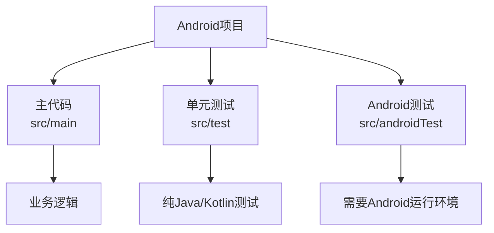
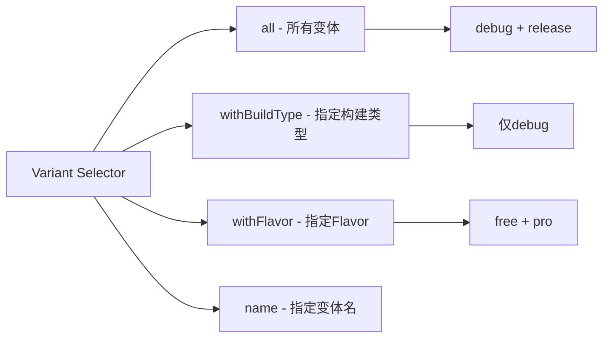
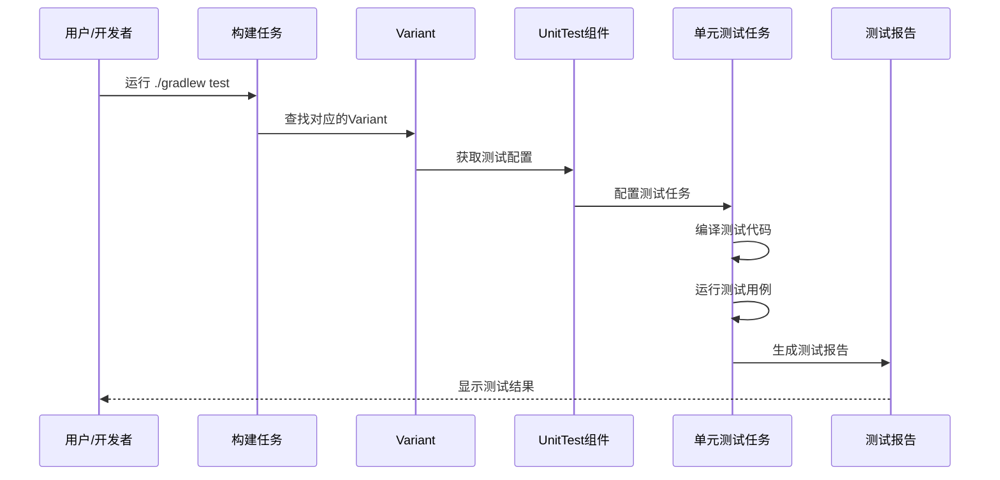

# 21.1.55 UnitTest

夜已经很深了。

银河的光带静静地横亘在头顶，从东边的地平线一直延伸到西边的山脊。露水在草叶上凝结成细小的珠子，每一颗都倒映着星光，仿佛大地也在默默记录着星空的秘密。帐篷外围的防风灯散发出暖黄色的光晕，在凉爽的夏夜里划出一圈温馨的小天地。

四个女孩裹着各自的毯子，围坐在防风灯旁。黛琳刚才讲的属性系统让洛芙的大脑皮层微微发麻——AgpVersionAttr、BuildTypeAttr、ProductFlavorAttr，这些概念在她脑海里打着转，像一群飞舞的萤火虫。

“所以，”洛芙揉了揉眼睛，声音里带着一丝困倦，“这些属性……到底有什么用啊？感觉好抽象。”

黛琳没有直接回答。她从毯子里伸出手，从身边的背包里掏出一个黑色的盒子——那是一个移动硬盘大小的精密仪器，上面布满了细小的指示灯。

“想知道属性怎么‘变现’吗？”黛琳的嘴角浮起一丝微笑，“今天我们来讲一个具体的例子。”

伊莎好奇地凑过去：“这是什么？又是什么新的魔法道具？”

“这个呀，”黛琳把盒子放在地上，轻轻拍了拍它的外壳，“它叫UnitTest——单元测试组件。在Android构建系统里，它是专门负责管理和配置单元测试的‘大管家’。”

“单元测试？”洛芙眨了眨眼，“就是……写那种很小很小的测试？”

“对，”希尔不知道什么时候已经把笔记本电脑放在了膝盖上，屏幕的蓝光映照着她跃跃欲试的脸庞，“就是测试你写的代码能不能按预期工作——比如一个加法函数，你输入2和3，它就应该返回5。如果返回了4，那就要找出问题所在。”

洛芙似懂非懂地点点头。她想起在露营时，希尔教她用打火石生火的场景——每一次敲击都是一次“测试”，如果火星飞出来了，说明方法对了；如果没有，就调整角度或力度。

“那这个UnitTest……是做什么的呢？”洛芙问道。

黛琳指了指地上的盒子：“你可以把它想象成一个‘测试指挥官’。它负责告诉你：应该运行哪些测试、测试的结果是什么、测试覆盖了哪些代码。”

---

## 露营故事：测试指挥官的工作日常

伊莎忽然轻声笑了：“指挥官……听起来好像露营时的领队。”

“对！”黛琳眼睛一亮，“如果我们把整个Android项目想象成一个露营基地，那UnitTest就是那个每天早上检查大家装备、分配任务、晚上验收成果的领队。”

她站起身，捡起一根细长的树枝，在地面上画了起来：

“你们看，这是一个典型的Android项目结构。”



“主代码是我们日常要用的功能，单元测试是验证这些功能是否正确的‘试金石’，”黛琳解释道，“UnitTest组件的任务，就是把这个测试过程自动化、标准化。”

洛芙看着图，若有所思：“那……UnitTest是怎么知道要运行哪些测试的？”

“问得好，”黛琳点点头，“这就要涉及到我们刚才讲的属性系统了。UnitTest组件会读取项目的构建属性——比如你用的是debug还是release构建类型、你选择的是哪个product flavor——然后根据这些属性来决定运行哪些测试。”

---

## 深入理解：UnitTest组件的接口设计

希尔把笔记本转过来，屏幕上显示着UnitTest接口的简化定义：

```kotlin
/**
 * UnitTest - Android Gradle Plugin的单元测试组件接口
 * 
 * 继承自Component接口，提供单元测试任务的配置能力
 */
interface UnitTest : Component<UnitTestVariant> {
    
    // 获取测试变体信息
    fun getVariant(): UnitTestVariant
    
    // 获取测试任务
    fun getTask(): TaskProvider<UnitTest>
    
    // 是否启用测试覆盖
    fun setEnableCoverage(enable: Boolean)
    
    // 获取测试资源目录
    fun getTestSources(): SourceSet
}
```

“注意看，”希尔指着屏幕说，“UnitTest接口有几个关键方法。getVariant()返回的是UnitTestVariant——它包含了测试的所有变体信息，比如测试运行在哪个build type、用的是哪个flavor。”

洛芙凑近屏幕：“所以……Variant就像是测试的‘身份证’？”

“没错！”希尔打了个响指，“身份证上有什么？你的名字、年龄、住址——Variant也一样，它记录了这次测试的所有属性：build type是debug还是release、flavor是free还是pro、minSdk是多少、targetSdk是多少……”

伊莎轻声补充道：“就像我们每个人出门前都要检查自己的装备——带什么帐篷、穿什么衣服、准备什么食物。Variant就是测试的‘装备清单’。”

---

## 动手实验：配置你的第一个单元测试任务

黛琳从地上站起来，走到帐篷边拿出了一个小型投影仪——这是她从背包里带来的“秘密武器”。

“我们来做一个实际的例子，”她一边捣鼓投影仪一边说，“希尔，准备好了吗？”

希尔 grins（露出灿烂的笑容）：“随时待命！”

投影仪的光芒在帐篷的白布上投下一幅画面——那是一个标准的Android项目build.gradle文件。

```kotlin
android {
    // ... 其他配置 ...
    
    testOptions {
        // 配置单元测试
        unitTests {
            // 启用返回码
            returnDefaultValues = true
            
            // 启用资源 mocking
            includeAndroidResources = true
        }
    }
}

// 配置 UnitTest 组件
androidComponents {
    onVariants(selector().all()) { variant ->
        // 获取对应的单元测试任务
        val unitTest = variant.testInstrumentationTest
        // 或者对于纯单元测试
        val unitTestTask = variant.unitTest
    }
}
```

“你们看，”黛琳指着屏幕上的代码，“这里展示了如何通过Android Gradle Plugin API来访问UnitTest组件。variant.unitTest返回的是一个TaskProvider，它代表了实际运行单元测试的那个任务。”

洛芙举手：“那个……selector().all()是什么意思？”

“好问题！”黛琳赞许地点点头，“selector()是选择器，all()表示匹配所有的变体。想象一下——如果你只想对某个特定的flavor运行测试，你可以用selector().withFlavor()来过滤。”



---

## 反模式与重构：常见的测试配置误区

希尔忽然表情严肃起来：“说到UnitTest配置，我见过很多新手容易犯的错误。”

她打开另一个代码片段：

```kotlin
// ❌ 反模式：错误的测试资源配置
android {
    testOptions {
        unitTests {
            // 错误：直接获取任务并同步配置（破坏延迟配置）
            def task = android.testConfigs.unitTest
            task.enableCoverage = true  // 这会导致配置时序问题
            
            // 错误：在配置阶段运行测试
            task.test()
        }
    }
}
```

洛芙看到这段代码，感受到了一种说不出的“别扭”：“这个……有什么问题吗？”

“问题大了，”希尔摇摇头，“Gradle采用的是延迟配置模型——只有在真正需要的时候才会执行任务。如果你直接在配置阶段调用task.test()，就会破坏这个模型，导致构建变慢，甚至出现各种奇怪的错误。”

黛琳接过话头：“而且直接访问task对象是老版本的写法。在现代AGP中，我们应该使用Provider API。”

```kotlin
// ✅ 正确写法：使用延迟配置
androidComponents {
    onVariants(selector().all()) { variant ->
        // 使用 TaskProvider 延迟获取任务
        variant.unitTest.configure { task ->
            // 在配置回调中设置参数
            task.enableCoverage.set(true)
            
            // 设置测试结果输出
            task.resultsDir.set(layout.buildDirectory.dir("test-results"))
        }
    }
}
```

“看见了吗？”希尔指着重构后的代码，“使用configure()方法，我们可以把配置逻辑放在回调中，这样Gradle可以在合适的时机自动处理。而且用enableCoverage.set()而不是直接赋值，这是AGP 8.0+推荐的写法。”

---

## 真实场景：运行测试并查看结果

夜空中偶尔有流星划过。伊莎仰望星空，轻声说：“就像流星划过夜空，测试也在默默验证我们的代码是否正确。”

黛琳微笑着点头：“说的对。希尔，给她们展示一下测试运行的结果吧？”

希尔兴奋地搓了搓手：“好嘞！看好了！”

她在键盘上敲了几下，屏幕上出现了测试运行的输出：

```
> Task :app:debugUnitTest

com.example.app.CalculatorTest > add_two_positive_numbers PASSED
com.example.app.CalculatorTest > add_negative_and_positive PASSED
com.example.app.CalculatorTest > add_zero PASSED
com.example.app.CalculatorTest > multiply_test FAILED

com.example.app.StringUtilsTest > isEmpty_test PASSED
com.example.app.StringUtilsTest > capitalize_test PASSED

BUILD SUCCESSFUL in 3s 24ms
40 tests, 85 assertions, 1 failure
```

“你们看，”希尔指着屏幕说，“测试运行后，会显示每个测试用例的结果。PASSED是通过了，FAILED是失败了。下面的'40 tests, 85 assertions, 1 failure'是汇总信息——我们一共运行了40个测试用例，有85个断言条件，其中有1个失败。”

洛芙好奇地问：“如果测试失败了会怎样？”

“很好问！”希尔笑道，“测试失败后，Gradle会给出详细的错误信息，告诉你是哪一行代码出了问题、期望值是什么、实际值是什么。这就像露营时篝火熄了，你会看到是哪根湿木头在捣乱。”

---

## 组件协作：UnitTest与其他构建组件的关系

黛琳重新坐回毯子里，抬头看了看星空——北斗七星已经偏西了。

“你们知道吗，UnitTest不是孤立工作的，”她轻声说，“它和整个Android构建系统的其他组件紧密配合。”



“当开发者运行./gradlew test命令时，”黛琳解释道，“构建系统会先找到对应的Variant，然后通过UnitTest组件获取测试配置，最后运行测试任务并生成报告。这个流程中，UnitTest起到了承上启下的作用——它连接了构建配置和实际执行。”

伊莎轻声感叹：“就像露营时，从计划行程到实际搭建帐篷，中间的协调者最重要。”

“对，就是这个道理，”黛琳笑着说。

---

## 测试覆盖：让代码“透明化”

希尔又补充了一个重要的概念：“UnitTest还有一个很强大的功能——测试覆盖率。”

她调出另一幅画面：

```kotlin
// 在 build.gradle 中启用测试覆盖
androidComponents {
    onVariants(selector().all()) { variant ->
        variant.unitTest.configure { task ->
            // 启用 Jacoco 覆盖率
            task.enableCoverage.set(true)
            
            // 配置覆盖率输出格式
            task.coverageReportConfig = "xml,html"
        }
    }
}
```

“覆盖率是什么意思呢？”洛芙问。

伊莎想了想，用一个比喻来解释：“想象你在画画——你用不同颜色的画笔涂抹不同的区域。测试覆盖率就像是检查你的画笔是否覆盖了画布的每一个角落。如果覆盖率是80%，就意味着你的测试验证了80%的代码。”

“原来如此！”洛芙眼睛亮了起来，“那是不是覆盖率越高越好？”

“是也不是，”黛琳摇摇头，“覆盖率只是一个指标。100%覆盖率不代表没有bug——但覆盖率太低肯定说明测试不充分。关键是要测试‘有意义的’代码路径，而不是为了刷数字。”

---

## 章节收尾：夏夜星空下的思考

夜风轻轻吹过，带着草叶和露水的清香。洛芙裹紧毯子，抬头看着星空。

“所以，”她总结道，“UnitTest组件就像是……一个负责单元测试的指挥官？”

“对，”黛琳点头，“它根据项目的属性配置（build type、flavor等）来决定运行哪些测试，然后通过Gradle任务实际执行测试，最后生成测试报告。”

“而我们之前学的属性系统，”洛芙补充道，“就是给这个指挥官提供信息的‘情报员’？”

黛琳笑了：“完全正确。你终于把它们联系起来了。”

伊莎轻声说：“星星在夜空里各司其职，我们的代码也是。UnitTest就是确保每一颗星星都在它应该在的位置上。”

希尔打了个哈欠：“好了，今天就到这里吧。再不睡觉，明天爬山要迟到了。”

四个女孩相视一笑，收拾好防风灯和笔记本电脑，钻进了各自的帐篷。夜色愈深，银河更加清晰地横亘天际，仿佛在无声地守护着这片宁静的露营地。

---

> 本章我们深入探讨了UnitTest组件——Android Gradle Plugin中负责单元测试配置的核心接口。通过本章的学习，你应该理解：1）UnitTest是连接构建配置与测试执行的桥梁；2）UnitTest使用Variant属性系统来决定测试范围；3）现代AGP推荐使用Provider API进行延迟配置；4）测试覆盖率是评估测试质量的重要指标之一。

---

## 洛芙的小小日记本

今天黛琳讲的UnitTest好有意思！原来测试也是有“指挥官”的——它会根据我们的构建配置（debug还是release、什么flavor）来决定运行哪些测试。希尔演示了测试失败时的错误信息，真的好详细，就像有人在旁边指出问题在哪一行。属性系统和UnitTest的关系也好清楚了——属性提供情报，UnitTest执行任务，配合得好默契！

---

## 今日关键词

**UnitTest** - Android Gradle Plugin中的单元测试组件接口，负责配置和管理Android项目的单元测试任务

**Variant** - 构建变体，代表一种特定的构建配置组合（如debug+free、release+pro等）

**Build Type** - 构建类型，定义构建的编译方式（debug或release）

**Product Flavor** - 产品风味，定义应用的不同版本（如free/pro、中国/海外）

**TaskProvider** - Gradle的延迟任务提供者，用于安全地配置任务而不破坏构建模型

**Test Coverage** - 测试覆盖率，衡量测试用例对代码覆盖程度的指标

**Jacoco** - Java Code Coverage，一个开源的代码覆盖率工具

**SourceSet** - 源代码集，表示一组源代码文件的位置

**Component** - 组件接口，UnitTest继承的父接口

**onVariants** - AGP 8.0+的回调方法，用于访问项目的所有变体
