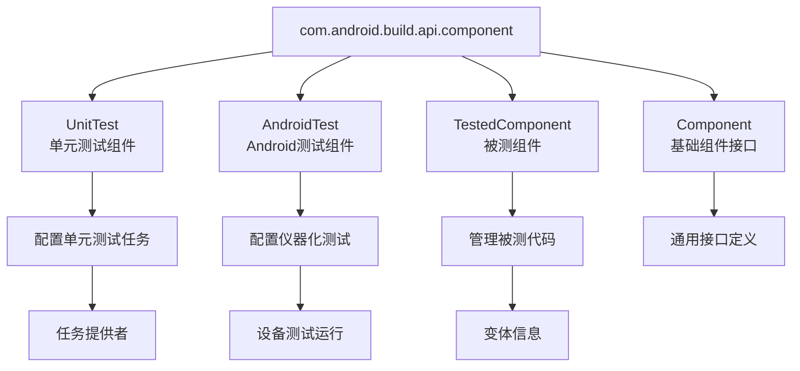
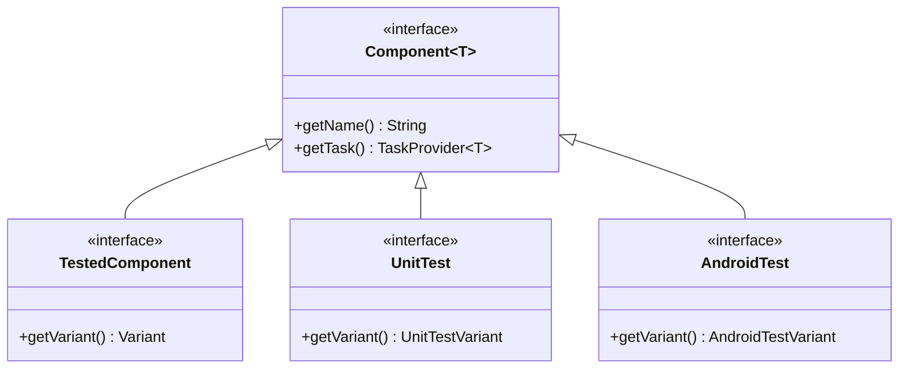
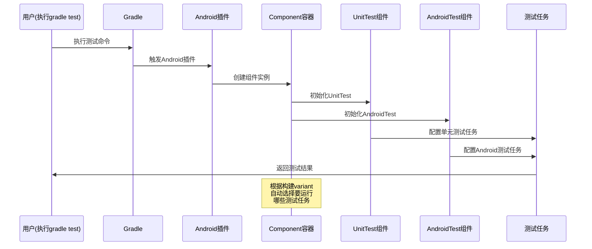

# 21.1.56 com.android.build.api.component

夜已经很深了。

银河的光带静静地横亘在头顶，从东边的地平线一直延伸到西边的山脊。露水在草叶上凝结成细小的珠子，每一颗都倒映着星光，仿佛大地也在默默记录着星空的秘密。帐篷外围的防风灯散发出暖黄色的光晕，在凉爽的夏夜里划出一圈温馨的小天地。

四个女孩裹着各自的毯子，围坐在防风灯旁。黛琳刚才讲的UnitTest组件让洛芙对接下来的内容充满了期待。

“刚才我们讲了UnitTest这个具体的组件，”黛琳拨了拨防风灯的灯芯，让火光更亮一些，“但如果把视角抬高一点，你们知道UnitTest是属于哪个更大的家族吗？”

伊莎想了想：“是……构建系统？”

“对，”黛琳微笑着点头，“在Android Gradle Plugin的API世界里，有一个包叫com.android.build.api.component——它就像一个大型的‘露营营地’，里面住着各种不同类型的‘居民’，UnitTest只是其中之一。”

洛芙好奇地眨眨眼：“那里面还有什么其他的居民呀？”

---

## 组件世界的居民们

希尔把笔记本放在膝盖上，屏幕的蓝光在夜色中显得格外清晰。她打开了一个API文档页面：“我找到了！官方文档说这个包下面包含了多种组件类型。”

“你们看，”黛琳又捡起那根树枝，在地面上画了起来，“如果我们把整个Android构建系统比作一个完整的露营基地，那com.android.build.api.component就是这个基地的‘行政区’——它管理着所有和‘构建’相关的‘部门’。”



“原来UnitTest不是一个人，”洛芙恍然大悟，“它还有兄弟姐妹！”

“对，”伊莎温柔地补充道，“就像我们露营的时候，有人负责生火，有人负责搭帐篷，有人负责找水——每个角色都有自己独特的职责，但都在同一个营地里协同工作。”

黛琳点点头：“官方文档把这个包称为‘组件包’，里面的每个接口或类都有自己的职责。UnitTest负责单元测试，AndroidTest负责需要真机或模拟器的Android测试，还有其他的组件负责处理被测试的代码。”

---

## 为什么需要这么多组件？

洛芙托着下巴：“为什么要分这么多组件呀？不能一个组件搞定所有测试吗？”

黛琳笑着摇头：“这个问题问得好。我们来打个比方——”

她指了指防风灯：“假设你要测试这盏灯能不能正常工作，你会怎么做？”

“打开开关，看它亮不亮？”洛芙回答。

“对，”黛琳说，“但如果我告诉你，这个测试要分两种场景呢？”

“两种？”

“第一种，”黛琳掰着手指，“测试灯丝本身的质量——你不用真的点亮灯，只需要检查灯丝的材料、厚度、弹性这些物理特性。这就像单元测试（UnitTest）——测试的是最小单位的代码逻辑，不需要整个系统运行起来。”

“第二种呢？”

“第二种，你要真的把灯点亮，检查它发出的光够不够亮、颜色对不对、会不会发热、会不会闪烁。这就像AndroidTest——需要完整的Android运行环境，因为有些功能只有在整个系统跑起来才能验证。”

洛芙眼睛亮了：“所以UnitTest是‘单独测试零件’，AndroidTest是‘整体测试成品’！”

“完全正确，”黛琳打了个响指，“这两种测试的性质完全不同，所以Android Gradle Plugin提供了两个不同的组件来分别管理它们。这就是com.android.build.api.component包存在的意义——为不同类型的构建任务提供专门的‘负责人’。”

---

## 组件的层级关系

希尔把笔记本转过来，屏幕上显示着组件接口的简化继承关系：

“你们看，这些组件不是平级的，它们有层级关系。”



“原来它们都是从Component这个‘祖先’派生出来的！”洛芙指着屏幕惊呼。

“对，”黛琳解释道，“Component是一个通用接口，定义了所有组件都应该有的基本能力——比如获取组件名称、获取关联的任务等。然后，UnitTest和AndroidTest分别继承自Component，并扩展了自己特有的功能。”

伊莎轻声说道：“这就像……祖先留给后代的基因。每个人都从祖先那里继承了一些基本能力，然后又发展出了自己独特的本领。”

“伊莎的比喻很贴切，”黛琳点头笑道，“在Android Gradle Plugin的设计中，这种层级结构很常见——先定义一个通用的基础接口，然后针对不同的场景创建专门的子接口。”

---

## 实际应用：如何获取组件实例

希尔切换到代码视图：“我们来看看在实际项目中，这些组件是怎么被使用的。”

```kotlin
/**
 * 在build.gradle.kts中访问UnitTest组件
 */
androidComponents {
    // 获取UnitTest组件
    onVariants(selector().all()) { variant ->
        // 通过variant获取对应的UnitTest任务
        val unitTest = variant.unitTest
        
        // 配置UnitTest任务
        unitTest?.configure {
            // 设置测试运行时的Java版本
            it.javaCompilerOptions {
                options.compilerArgs.add("-Xlint:deprecation")
            }
            
            // 配置测试覆盖率
            it.extensions.getByType<JacocoTaskExtension>()?.apply {
                isIncludeNoLocationClasses = true
                excludes = listOf("jdk.internal.*")
            }
        }
    }
}

/**
 * 访问AndroidTest组件
 */
androidComponents {
    onVariants(selector().all()) { variant ->
        // 获取AndroidTest组件
        val androidTest = variant.androidTest
        
        androidTest?.configure {
            // 配置设备测试参数
            it.deviceSpecs += listOf(
                DeviceSpec("model" to "Pixel 4", "api" to "30"),
                DeviceSpec("model" to "Pixel 7", "api" to "33")
            )
            
            // 配置测试超时
            it.testInstrumentationRunnerArguments += mapOf(
                "timeoutMs" to "300000"
            )
        }
    }
}
```

洛芙盯着代码看了半天：“这个……看起来好复杂啊。”

“一步一步来，”黛琳指着代码解释道，“首先，androidComponents是一个DSL块，你可以在里面访问项目的所有组件。然后，通过variant.unitTest或variant.androidTest，你可以获取对应的测试组件实例。”

“拿到组件实例之后呢？”洛芙问。

“就可以配置它了，”希尔补充道，“比如设置Java编译器选项、配置代码覆盖率、或者指定测试设备的参数。这些配置会影响最终生成的测试任务。”

---

## 组件的工作流程

黛琳重新在地上画了起来，这次是一幅更大的图：

“我们来梳理一下，这些组件在构建过程中是怎么配合工作的。”



“原来是这样！”洛芙恍然大悟，“组件就是帮我们‘配置’任务的‘中间人’——它们知道怎么把配置变成具体的任务。”

“对，”黛琳总结道，“com.android.build.api.component包提供的，就是这样一个统一的‘组件框架’。无论你是要配置单元测试、Android测试，还是其他类型的构建任务，都可以通过这个框架来操作。”

---

## 组件与变体的关系

伊莎忽然想到了一个问题：“黛琳，我记得之前提到过‘变体（variant）'……组件和变体之间是什么关系呢？”

好问题，”黛琳点头道，“变体是构建的‘产品’——比如debug版本、release版本、或者不同flavor的组合。而组件是管理这些产品‘测试’的管理员。”

她重新画了一幅图：

```mermaid
graph LR
    subgraph BuildVariants[构建变体]
        V1[debug]
        V2[release]
        V3[freeDebug]
        V4[paidDebug]
    end
    
    subgraph Components[组件]
        C1[UnitTest]
        C2[AndroidTest]
    end
    
    V1 --> C1
    V1 --> C2
    V2 --> C1
    V2 --> C2
    V3 --> C1
    V3 --> C2
    V4 --> C1
    V4 --> C2
    
    Note: 每个变体都关联<br/>对应的测试组件
```

“每一个构建变体，”黛琳解释道，“都会对应一个UnitTest组件和一个AndroidTest组件。比如你有一个debug变体，就会生成debugUnitTest和debugAndroidTest两个任务。”

“那如果是release呢？”洛芙问。

“release变体对应releaseUnitTest和releaseAndroidTest，”黛琳回答，“它们各自独立配置、互不干扰。这就是Android构建系统的灵活性——你可以为不同的变体定制不同的测试策略。”

---

## 实际用例：按变体配置不同的测试策略

希尔打开了一个更复杂的示例：

“有时候，我们需要根据不同的变体采用不同的测试策略。比如，免费版的测试可以少跑一些，付费版的测试要跑全套。”

```kotlin
/**
 * 按变体类型配置不同的测试策略
 */
androidComponents {
    onVariants(selector().withBuildType("debug")) { variant ->
        // Debug版本：详细测试，启用完整覆盖率
        variant.unitTest?.configure {
            it.extensions.getByType<JacocoTaskExtension>()?.apply {
                isIncludeNoLocationClasses = false
            }
        }
    }
    
    onVariants(selector().withBuildType("release")) {
        // Release版本：只运行关键测试
        it.unitTest?.configure {
            // Release版本不运行单元测试（可选）
            // it.enabled = false
        }
    }
    
    // 按flavor配置
    onVariants(selector().withProductFlavor("free")) { variant ->
        // 免费版：轻量级测试
        variant.androidTest?.configure {
            it.deviceSpecs = listOf(
                DeviceSpec("api" to "24")  // 最低支持的API级别
            )
        }
    }
    
    onVariants(selector().withProductFlavor("paid")) { variant ->
        // 付费版：完整测试
        variant.androidTest?.configure {
            it.deviceSpecs = listOf(
                DeviceSpec("api" to "26"),
                DeviceSpec("api" to "29"),
                DeviceSpec("api" to "33")
            )
        }
    }
}
```

洛芙看完代码，若有所思：“原来组件不仅可以配置测试，还能控制测试的‘范围’和‘强度’……”

“对，”黛琳总结道，“这就是com.android.build.api.component包的强大之处——它提供了一套统一的API，让你能够精细地控制每一种测试组件的行为。无论你是要按构建类型、还是按产品风味来区分配置，都能轻松实现。”

---

## 露营感悟：测试的分层哲学

夜更深了，头顶的银河更加璀璨。伊莎仰望着星空，忽然轻声说道：“你们觉不觉得，这种‘分层测试’的理念，和我们露营的时候很像？”

“怎么说？”希尔好奇地问。

“比如我们今晚，”伊莎指了指周围的营地道具，“要检查帐篷是否牢固——单元测试就像检查每一根支架、每一块布料；而当所有部件都检查完，我们要真正把帐篷搭起来、感受一下是否抗风——这就像AndroidTest，需要整体运行才能验证。”

洛芙眼睛亮了：“而且，不同的‘变体’就像不同的露营场景！如果是去森林深处露营，我们要更仔细地检查防潮垫；如果是公园轻露营，就可以简单一些……”

“对！”伊莎笑了，“这就是分层的力量——把复杂的问题拆解成小的、可管理的部分，然后针对每个部分设计专门的验证方式。com.android.build.api.component包，正是这种哲学在Android构建系统中的体现。”

黛琳点点头：“无论是写代码还是露营，先想清楚要验证什么、怎么验证，然后选择合适的工具——这是共通的智慧。”

夜风轻轻吹过，银河在头顶静静流淌。四个女孩裹紧了毯子，心中充满了对知识的敬畏和对露营的热爱。

---

> 本章我们探索了com.android.build.api.component包的奥秘。这个包是Android Gradle Plugin中管理测试组件的核心框架，提供了UnitTest（单元测试）和AndroidTest（Android测试）两种主要组件类型。组件之间通过层级结构组织，都继承自通用的Component接口，并根据不同的构建变体生成对应的测试任务。通过这套API，开发者可以精细地配置测试策略，实现按需定制的自动化测试流程。

---

## 洛芙的小小日记本

今晚学到了好棒的东西！原来UnitTest和AndroidTest是“兄弟组件”，各有各的职责——一个是单独测试零件，一个是整体测试成品。就像露营时要检查每一根帐篷支架有没有问题、还要真的搭起来看看能不能抗风一样。分级测试的思路，不只是写代码的道理，好像也是做任何事情的方法论呢！

---

## 今日关键词

- **com.android.build.api.component**：Android Gradle Plugin中的组件包，提供了测试相关组件的统一接口
- **UnitTest**：单元测试组件接口，用于配置和管理纯Java/Kotlin代码的单元测试
- **AndroidTest**：Android测试组件接口，用于配置需要Android运行环境的仪器化测试
- **TestedComponent**：被测组件接口，管理需要被测试的代码变体信息
- **Component**：基础组件接口，定义所有组件共有的能力（如获取名称、获取任务）
- **Variant**：构建变体，代表一个具体的构建产物（如debug、release、不同flavor的组合）
- **TaskProvider**：任务提供者，用于在Gradle构建图中查找和配置任务
- **JacocoTaskExtension**：代码覆盖率工具的Gradle扩展，用于配置测试覆盖率
- **DeviceSpec**：设备规格定义，用于指定AndroidTest运行的设备参数（型号、API版本等）
- **androidComponents**：Gradle DSL块，用于访问Android构建组件
