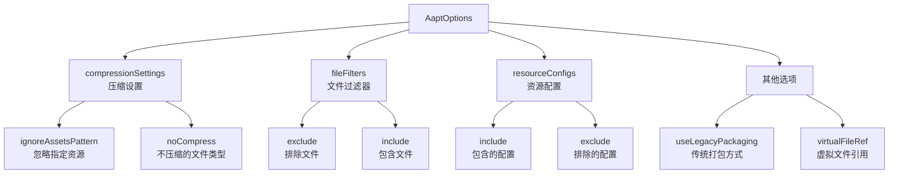
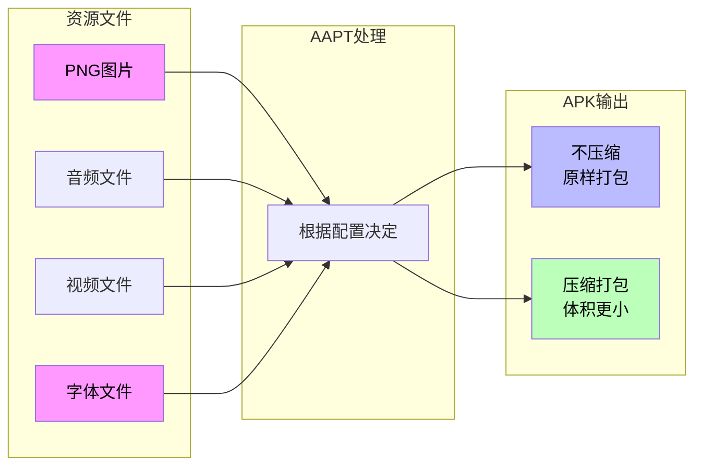

# 21.1.57 AaptOptions

夜已经很深了。

银河的光带静静地横亘在头顶，从东边的地平线一直延伸到西边的山脊。露水在草叶上凝结成细小的珠子，每一颗都倒映着星光，仿佛大地也在默默记录着星空的秘密。帐篷外围的防风灯散发出暖黄色的光晕，在凉爽的夏夜里划出一圈温馨的小天地。

四个女孩裹着各自的毯子，围坐在防风灯旁。黛琳刚才讲的Component组件让洛芙对接下来的内容充满了期待。

“刚才我们讲了Component——管理测试的‘负责人’，”黛琳拨了拨防风灯的灯芯，让火光更亮一些，“但如果把视角再往资源处理的方向移一点——你们知道我们App里的那些图片、字符串、布局文件，是怎么变成最终安装包里的资源的吗？”

伊莎想了想：“是……编译的时候自动处理的吧？”

“对，”黛琳微笑着点头，“但在编译过程中，有一个很重要的工具在默默工作——它叫AAPT，全称是Android Asset Packaging Tool。而我们今天要讲的AaptOptions，就是用来配置这个工具的‘控制面板’。”

洛芙好奇地眨眨眼：“控制面板？AAPT也需要配置吗？”

“当然需要，”黛琳说道，“就像我们露营的时候，要根据天气决定带什么装备、要根据人数决定带多少食物——AAPT也要根据我们的需求来决定怎么处理资源。”

---

## AAPT是何方神圣？

希尔把笔记本放在膝盖上，屏幕的蓝光在夜色中显得格外清晰。她打开了一个文档页面：“我找到了！官方文档说AaptOptions是‘Android Asset Packaging Tool的配置选项类型’。简单来说，就是用来配置AAPT怎么打包我们的资源文件。”

“你们看，”黛琳又捡起那根树枝，在地面上画了起来，“如果说我们的App是一个露营营地，那资源就是营地里的各种装备——帐篷、睡袋、炊具、食材。AAPT就像一个负责打包这些装备的管理员，它要把所有东西整理好、压缩好、标记好，放进最终的‘行李箱’里。”

“那AaptOptions呢？”洛芙问。

“AaptOptions就是给这个管理员的‘工作手册’，”黛琳笑道，“你可以在里面写：哪些东西要优先打包、哪些东西不要压缩、哪些文件夹要特别处理……就像告诉管理员‘食材要放冰箱里’‘帐篷要单独打包’一样。”

---

## AaptOptions的核心功能

希尔把笔记本转过来，屏幕上显示着AaptOptions的主要配置项：

“官方文档说，AaptOptions主要有这几个方面的配置能力：”



“原来AaptOptions管的事情还挺多的！”洛芙惊呼。

“对，”黛琳点头道，“我们一个一个来说。首先是最常用的——压缩设置。”

---

## 压缩设置：不压缩什么？

“你们有没有想过，”黛琳问道，“为什么有些App安装包很大，有些却很小？”

洛芙想了想：“是不是因为图片多少？”

“那是原因之一，”黛琳说，“但还有一个很重要的因素——资源压缩。AAPT在打包的时候会尽量压缩资源文件，这样可以减小APK的体积。但有些文件压缩了反而不好——比如已经压缩过的图片（PNG、JPG），或者需要快速访问的文件。”

伊莎举起手：“我知道了！是不是就像我们的行李——衣服可以叠起来压缩，但睡袋如果压缩得太紧，下次打开就不蓬松了？”

“伊莎的比喻太恰当了！”黛琳笑道，“有些文件压缩后不仅不会变小，反而可能变大——这就像把已经叠好的衣服再压缩，结果反而皱巴巴的。”

希尔打开一个代码示例：“我们来看看怎么配置不压缩的文件类型。”

```kotlin
/**
 * 在build.gradle.kts中配置AaptOptions
 */
android {
    // AAPT配置
    aaptOptions {
        // 不压缩的文件类型列表
        // 这些文件会原样打包进APK，不进行压缩
        noCompress("png", "jpg", "jpeg", "gif", "mp3", "ogg", "wav", "mp4", "webm")
        
        // 忽略匹配此模式的文件（不打包进APK）
        ignoreAssetsPattern("!.svn:!.git:!.ds_store:!*.scc:!CVS:!thumbs.db:!picasa.ini:!*~")
        
        // 资源配置文件过滤
        // 只包含指定语言的资源配置（节省空间）
        // resourceConfigurations += listOf("en", "zh-rCN", "zh-rTW")
        
        // 是否使用旧版打包方式（默认false）
        // useLegacyPackaging = false
    }
}
```

洛芙盯着代码看了半天：“这个noCompress……是说不压缩这些文件吗？”

“对，”黛琳解释道，“noCompress告诉AAPT：这些文件类型不要压缩，直接原样打包进去。为什么呢？因为PNG、JPG这些图片已经是压缩格式了，再次压缩不仅不会变小，反而可能因为压缩算法开销而略微变大——这就叫‘负压缩’。”

“那为什么要列出来呢？”洛芙又问，“不列的话，AAPT也会压缩它们吗？”

“会的，”希尔补充道，“默认情况下，AAPT会尝试压缩所有资源。但对于某些已经压缩过的文件，压缩是浪费时间——所以我们主动告诉它‘这些别压了’。”

---

## 文件过滤器：谁该进，谁该出？

黛琳捡起一块小石头，在地上画了一个圈：“如果说资源打包是一个筛选过程，那文件过滤器就是筛子——决定哪些文件可以进、哪些要出局。”

“你们看，”黛琳继续说道，“我们的项目里总会有一些不需要打包进APK的文件——比如.svn文件夹、.git文件夹、还有一些临时文件。但有时候，AAPT会不分青红皂白地把所有东西都打包进去。”

“那怎么办？”洛芙问。

“用ignoreAssetsPattern来过滤，”黛琳说，“这个配置项使用类似正则表达式的模式来匹配要忽略的文件。”

伊莎轻声说道：“这就像我们整理露营行李时，会把不需要的东西挑出来——比如过期的食品、坏掉的餐具……只带真正有用的。”

“对，”黛琳点头笑道，“ignoreAssetsPattern就是一个‘过滤网’，把不需要的文件筛掉。”

希尔又展示了一个更复杂的例子：

```kotlin
/**
 * 复杂的文件过滤配置
 */
android {
    aaptOptions {
        // 忽略特定模式的文件
        // 语法：!表示排除匹配的文件
        // 支持通配符：* 匹配任意字符，? 匹配单个字符
        
        // 忽略所有SVN相关文件
        ignoreAssetsPattern("!.svn")
        
        // 忽略所有Git相关文件
        ignoreAssetsPattern("!.git")
        
        // 忽略Mac系统文件
        ignoreAssetsPattern("!.DS_Store")
        
        // 忽略源代码控制相关文件
        ignoreAssetsPattern("!CVS:!thumbs.db:!picasa.ini")
        
        // 忽略临时文件和备份文件
        ignoreAssetsPattern("!*~:!*.tmp:!*.bak")
        
        // 组合写法
        ignoreAssetsPattern("!.svn:!.git:!.ds_store:!CVS:!thumbs.db:!picasa.ini:!*~")
    }
}
```

“原来ignoreAssetsPattern支持这么多模式！”洛芙眼睛亮了。

“对，”黛琳说，“这个配置非常灵活，你可以根据项目的实际情况来过滤不需要的文件。”

---

## 资源配置：只打包需要的语言

黛琳抬头看了看星空，忽然想到一个问题：“你们有没有注意过一个问题——为什么有些App支持几十种语言，有些只支持几种？”

洛芙想了想：“是因为开发者设置的？”

“对，”黛琳说，“但你们知道这些语言资源是怎么被打包的吗？默认情况下，AAPT会打包所有语言的资源——这意味着你的APK会包含英语、中文、日语、韩语、法语、德语……所有语言的字符串。”

“那岂不是很占空间？”伊莎问。

“对的，”黛琳点头道，“这就是resourceConfigurations发挥作用的地方了。”

希尔打开一个示例：

```kotlin
/**
 * 资源配置过滤示例
 */
android {
    aaptOptions {
        // 只打包特定语言的资源配置
        // 这样可以显著减小APK体积
        
        // 只打包中文和英文
        resourceConfigurations += listOf("en", "zh-rCN", "zh-rTW")
        
        // 或者只打包主要语言（英文+主流语言）
        resourceConfigurations += listOf(
            "en",
            "zh-rCN",
            "zh-rTW",
            "ja",
            "ko",
            "fr",
            "de",
            "es",
            "pt",
            "ru"
        )
        
        // 排除特定语言
        // 注意：exclude语法可能需要查看具体版本文档
    }
}
```

洛芙看完，若有所思：“所以如果我只做中文版的App，可以只打包中文资源？”

“对，”黛琳说，“但要注意一个问题——如果用户手机的系统语言不在你打包的语言范围内，会发生什么？”

洛芙摇头。

“会fallback到默认语言，通常是英语，”黛琳解释道，“所以如果你只打包中文，至少也要保留英语作为fallback。”

---

## 实际用例：按渠道配置不同的资源

希尔打开了一个更复杂的示例：“有时候，不同的App渠道需要不同的资源配置。比如国内渠道只需要中文，海外渠道需要多语言。”

```kotlin
/**
 * 按渠道配置不同的AaptOptions
 */
android {
    // 根据渠道配置资源过滤
    // 这种方式需要在productFlavors中配合使用
    
    // 假设有两个flavor：国内版和海外版
    flavorDimensions += "version"
    
    productFlavors {
        create("china") {
            dimension = "version"
            // 国内版：只打包中文
            aaptOptions {
                resourceConfigurations += listOf("zh-rCN", "zh-rTW", "en")
            }
        }
        
        create("global") {
            dimension = "version"
            // 海外版：打包主流语言
            aaptOptions {
                resourceConfigurations += listOf(
                    "en", "zh-rCN", "zh-rTW", "ja", "ko",
                    "fr", "de", "es", "pt", "it", "ru"
                )
            }
        }
    }
}
```

“这也太灵活了吧！”洛芙惊呼。

“这还没完，”黛琳笑道，“还有更高级的用法——压缩策略。”

---

## 压缩策略：平衡大小和性能

黛琳重新在地上画了起来：“我们来说说压缩的另一个面——有些资源需要压缩（减小体积），有些资源需要保持原样（保证性能）。”



“你们看，”黛琳指着她画的图解释道，“不同类型的资源需要不同的处理方式。PNG、JPG这些图片已经压缩过了，再压缩没用；但有些资源（比如某些特定格式的文件）压缩后体积会明显变小。”

伊莎轻声说道：“这就像不同的露营装备要用不同的打包方式——睡袋要压缩（节省空间），但炊具不用压（怕压坏）。”

“完全正确！”黛琳笑道，“AaptOptions就是让开发者能够精细控制这种‘打包策略’。”

---

## 反模式：错误的压缩配置

希尔忽然严肃起来：“不过，AaptOptions如果配置错了，也会带来问题。我见过几个常见的错误用法。”

```kotlin
/**
 * ❌ 错误示例：把不该压缩的资源也列到noCompress
 */
android {
    aaptOptions {
        // 错误：把不该不压缩的文件也加进去
        // 这会导致APK体积变大！
        noCompress("txt", "json", "xml")
        
        // 错误：忽略太多文件，导致App功能异常
        ignoreAssetsPattern("*")
        
        // 错误：resourceConfigurations写错语言代码
        // 正确的代码是zh-rCN，不是zh-CN！
        resourceConfigurations += listOf("zh-CN")  // 这行无效！
    }
}

/**
 * ✅ 正确示例
 */
android {
    aaptOptions {
        // 正确：只对已压缩格式使用noCompress
        noCompress("png", "jpg", "jpeg", "gif", "mp3", "ogg", "wav")
        
        // 正确：只忽略不需要的文件
        ignoreAssetsPattern("!.svn:!.git:!.ds_store:!CVS:!thumbs.db")
        
        // 正确：使用正确的语言代码
        resourceConfigurations += listOf("en", "zh-rCN")
    }
}
```

洛芙看着对比，吐了吐舌头：“原来配置错了反而会让APK变大！”

“对，”黛琳说，“这就是为什么理解AaptOptions的工作原理很重要——不是把所有东西都配置上就好，而是要根据实际情况来调整。”

---

## AaptOptions与构建变体的配合

黛琳抬头看了看银河：“说了这么多，你们有没有想过——AaptOptions能不能根据不同的构建变体来调整？”

洛芙眨眼：“你是说debug版和release版用不同的配置？”

“对，”黛琳说，“比如release版我们希望APK尽可能小，可以多压缩一些资源；debug版我们希望调试方便，可以保留更多的原始资源。”

希尔展示了代码示例：

```kotlin
/**
 * 按构建类型配置不同的AaptOptions
 */
androidComponents {
    onVariants(selector().withBuildType("debug")) {
        // Debug版本：减少压缩，保留更多原始资源便于调试
        aaptOptions {
            // Debug版本可以多保留一些资源
            noCompress("png", "jpg", "json", "xml")
        }
    }
    
    onVariants(selector().withBuildType("release")) {
        // Release版本：最大化压缩，减小APK体积
        aaptOptions {
            // Release版本只保留必须不压缩的文件
            noCompress("png", "jpg")
            
            // 进一步过滤资源语言
            resourceConfigurations += listOf("en", "zh-rCN")
        }
    }
}
```

“这也太强了吧！”洛芙眼睛亮晶晶的，“这样就能针对不同场景优化！”

“对，”黛琳总结道，“这就是AaptOptions的灵活性——你可以在不同维度上配置不同的策略。”

---

## 露营感悟：整理的艺术

夜更深了，头顶的银河更加璀璨。伊莎仰望着星空，忽然轻声说道：“你们觉不觉得，AaptOptions的配置理念，和我们整理露营行李的时候特别像？”

“怎么说？”希尔好奇地问。

“你看，”伊莎解释道，“我们整理行李的时候，会想——什么东西要压缩（衣服）、什么东西不能压（睡袋）、什么东西要扔掉（垃圾）、什么东西要单独放（炊具）——这不就是AaptOptions做的事情吗？”

洛芙眼睛亮了：“而且根据不同的露营地点，我们还会调整带的東西——去森林要多带防虫的，去海边要多带防晒的——这就像按渠道配置不同的资源！”

“完全正确！”黛琳笑道，“无论是写代码还是露营，‘整理’都是一门艺术——知道什么该留、什么该舍、什么该压缩、什么该保持原样。AaptOptions就是Android开发中的‘整理术’——让你的APK更小、加载更快、用户体验更好。”

夜风轻轻吹过，银河在头顶静静流淌。四个女孩裹紧了毯子，心中充满了对知识的敬畏和对露营的热爱。

---

> 本章我们探索了AaptOptions的奥秘。AaptOptions是Android Asset Packaging Tool（AAPT）的配置选项类型，用于精细控制资源打包的各个方面。主要配置包括：noCompress（指定不压缩的文件类型）、ignoreAssetsPattern（过滤不需要打包的文件）、resourceConfigurations（控制打包哪些语言的资源）。通过这些配置，开发者可以显著优化APK体积、提升加载性能，并根据不同渠道和构建类型采用不同的资源策略。

---

## 洛芙的小小日记本

今晚学到了AaptOptions——原来是控制资源打包的“整理术”！就像露营时要决定什么压缩、什么不压、什么带走、什么扔掉一样。noCompress、ignoreAssetsPattern、resourceConfigurations……每个配置都有它的道理。代码也是需要“整理”的东西呢！

---

## 今日关键词

- **AaptOptions**：Android Asset Packaging Tool的配置选项类型，用于控制资源打包行为
- **AAPT**：Android Asset Packaging Tool，Android资源打包工具，负责将资源文件打包进APK
- **noCompress**：AaptOptions的配置项，指定哪些文件类型不进行压缩
- **ignoreAssetsPattern**：AaptOptions的配置项，使用模式匹配过滤不需要打包的文件
- **resourceConfigurations**：AaptOptions的配置项，控制打包哪些语言的资源配置
- **compressionSettings**：压缩设置，控制资源的压缩策略
- **fileFilters**：文件过滤器，决定哪些文件可以打包进APK
- **useLegacyPackaging**：传统打包方式配置项
- **负压缩**：对已压缩文件进行二次压缩，不仅不会变小反而可能变大的现象
- **fallback**：当指定资源配置不存在时，回退到默认语言
