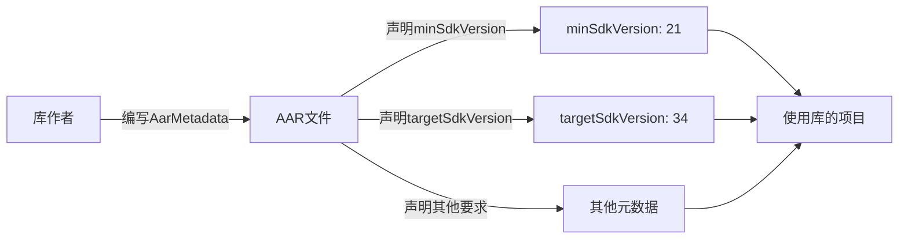
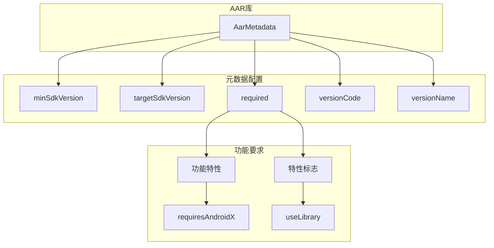
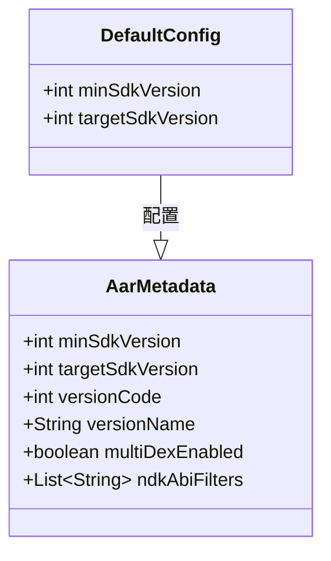

# 21.1.58 AarMetadata

蝉鸣声不知什么时候渐渐弱了下去，取而代之的是夜风吹过草叶的沙沙声。洛芙裹紧了身上的薄毯，头顶的银河已经悄咪咪地移到了西边的天空，露水开始在草叶尖上凝结。

“刚才讲的AaptOptions都记下了吗？”黛琳轻声问道，手里的白板笔在月光下闪着微光。

“记是记下了……”洛芙点了点头，又摇了摇头，“可是我突然在想，我们一直在讲怎么打包资源、怎么配置压缩规则……那如果我们用的是别人写的库，也就是AAR文件，有没有办法反过来告诉Gradle，‘这个库需要特定的Android版本才能运行’之类的？”

伊莎正把最后一根烟花棒塞进带来的小玻璃瓶里，听到这话抬起头来：“洛芙这个问题问得好诶——就像我们在露营之前要先确认天气预报一样，总得知道这个库‘怕’什么环境嘛。”

“说得好，”黛琳微微一笑，“这就要讲到今天的主角了——AarMetadata。”

她从背包里翻出一本手掌大的小笔记本，封面上贴着一张星空的贴纸。

“之前我们学的AaptOptions，是告诉AAPT怎么打包我们自己的资源。但AarMetadata的作用正好相反——它是用来声明一个AAR库本身的‘最低要求’的。”

“最低要求？”洛芙眨了眨眼，“是说这个库需要Android几以上才能用吗？”

“对，”黛琳翻开笔记本，“AarMetadata的中文名字叫‘AAR元数据’，它最核心的功能就是配置AAR库的最低SDK版本要求。你想啊，如果我们自己写了一个库，这个库用到了某个只有新版Android才有的API，那使用我们这个库的人，如果不注意版本兼容，不就炸了吗？”

希尔不知道什么时候已经把笔记本掏出来了，屏幕上是Android Studio的界面：“所以AarMetadata就是让库作者提前声明——‘嘿，想用我的库？你的项目至少要达到这个SDK版本！’这样使用的人就会收到警告，或者直接报错，不会等到运行的时候才傻眼。”

黛琳点点头，在白板上画了一个简单的示意图：



“你们看这张图，”黛琳用白板笔点了点图上的C和D，“AarMetadata里最常用的两个配置就是minSdkVersion和targetSdkVersion。minSdkVersion告诉Gradle，这个库最低需要哪个Android版本；targetSdkVersion则声明这个库是为哪个版本优化的。”

洛芙凑近看了看图：“那……如果我的项目minSdkVersion是14，但我想用的库要求minSdkVersion是21，会怎么样？”

“会报错，或者至少给你一个警告，”希尔接话道，“Gradle会检测到版本不兼容，拒绝让你把这个库加到依赖里。这是好事，总比运行的时候Crash强。”

伊莎把烟花棒的空瓶子摆成一排，轻轻推了一下，让它们骨碌碌滚到一边：“那如果我想在自己的库里设置这个AarMetadata，应该怎么写呢？”

“好问题，”黛琳笑了笑，“我们来看代码。”

她在白板上写了几行Groovy代码：

```groovy
android {
    // 在android块里配置AarMetadata
    defaultConfig {
        // 这里可以配置库的元数据
        // 声明最低SDK版本
        minSdkVersion 21
        
        // 声明目标SDK版本
        targetSdkVersion 34
        
        // 还可以声明其他特性要求
        // 例如：需要某些特性
    }
}
```

“等等，”洛芙举手，“我有点晕……这个defaultConfig我认识，是我们之前讲过的构建变体配置嘛。但AarMetadata是直接写在这里的吗？”

“是，也不是，”黛琳点点头，“在Android Gradle插件的DSL里，AarMetadata是通过defaultConfig块来配置的。你可以把defaultConfig理解为库的‘默认配置’，而AarMetadata就是其中的一部分。”

希尔补充道：“我记得官方文档里其实有专门的AarMetadata DSL类型，但实际用起来，大部分人都是在defaultConfig里直接设置minSdkVersion这些属性。效果是一样的。”

黛琳表示同意：“对，我们继续往下看。AarMetadata还有一个很实用的功能——它可以用来声明库对某些特性的依赖。”

她在白板上又画了一幅图：



“看起来好复杂的样子……”洛芙吐了吐舌头。

“不复杂，”黛琳柔声说道，“你想啊，一个库可能不仅仅要求Android版本，还可能需要某些系统特性。比如有些库需要Camera2 API，有些需要指纹识别，还有些需要Google Play服务。”

“那怎么声明这些？”伊莎好奇地问。

“在AarMetadata里，可以通过`usesLibrary`或者`require`方法来声明对某些系统库的依赖，”黛琳解释道，“比如这样：”

```groovy
android {
    defaultConfig {
        // 声明需要Google Play服务的基础库
        // 这会在库被依赖时自动传递这个依赖
        multiDexEnabled true
        
        // 还可以配置ndk ABI过滤器
        ndk {
            abiFilters 'armeabi-v7a', 'arm64-v8a', 'x86', 'x86_64'
        }
    }
}
```

“原来如此！”洛芙恍然大悟，“所以AarMetadata其实就是库作者用来‘提前打招呼’的东西——告诉用库的人，‘想用我？你得满足这些条件！’”

“Exactly！”希尔打了个响指，“而且这个‘打招呼’是在编译期就进行的，不像运行时的兼容性检查，那可就麻烦大了。”

夜风变得更凉爽了，天边的星星一颗一颗地亮起来。洛芙裹紧毯子，眼睛亮晶晶的：“那……如果我用的是第三方库，但那个库没有正确配置AarMetadata怎么办呢？”

“好问题，”黛琳赞许地看了洛芙一眼，“如果库没有声明minSdkVersion，那Gradle就不会帮你做这个检查。但是！你可以在自己的项目里通过`resolutionStrategy`或者`configurations.all`来强制覆盖依赖的SDK版本要求。”

她在白板上写了一段代码示例：

```groovy
// 在app的build.gradle里
configurations.all {
    resolutionStrategy {
        // 强制设置所有依赖的minSdkVersion
        // 这样即使库没有声明，也会使用这个值
        force 'androidx.core:core-ktx:1.12.0'
    }
    
    // 或者针对特定依赖做处理
    resolutionEach { DependencyResolveDetails details ->
        if (details.requested.group == 'com.example' && 
            details.requested.name == 'mylibrary') {
            // 可以在这里做一些特殊处理
            details.useTarget "com.example:mylibrary:1.0.0"
        }
    }
}
```

“听起来好专业……”洛芙吐了吐舌头，“不过原理我懂了。”

伊莎把空的烟花棒瓶子一个个捡起来，放进随身的袋子里：“那AarMetadata和AaptOptions到底有什么关系呢？我感觉它们好像都是处理AAR的？”

黛琳笑着摇摇头：“这个问题问得好。AaptOptions是处理资源打包的——也就是‘怎么把东西塞进AAR里’；AarMetadata是声明元数据的——也就是‘这个AAR是什么、有什么要求’。一个管‘内容’，一个管‘属性’。”

“就像，”伊莎打了个比方，“AaptOptions是教你怎么写一封信的内容，AarMetadata则是信封上写的收件人地址和快递要求？”

“差不多是这个意思！”黛琳笑道，“AaptOptions管的是打包过程，AarMetadata管的是包的属性和要求。两者配合，才能让AAR库正确地流通和使用。”

希尔把笔记本屏幕转过来给大家看：“我找到一个更完整的AarMetadata DSL示例，我们一起看看官方是怎么定义的。”

屏幕上显示着从官方文档摘录的代码结构：

```groovy
android {
    // AAR库的默认配置
    defaultConfig {
        // 最小SDK版本（必需）
        minSdkVersion 21
        
        // 目标SDK版本
        targetSdkVersion 34
        
        // 版本号
        versionCode 15
        versionName "2.3.0"
        
        // 多Dex支持
        multiDexEnabled true
        
        // NDK ABI配置
        ndk {
            abiFilters 'armeabi-v7a', 'arm64-v8a'
        }
        
        // 消费者ProGuard规则
        consumerProguardFiles 'proguard-rules.pro'
        
        // 资源配置
        resourceConfigurations += ['en', 'zh-rCN', 'ja']
    }
}
```

“原来有这么多可以配置的！”洛芙感叹道。

“等等，”伊莎突然想到了什么，“如果我是一个库的作者，我应该把什么放进AarMetadata里呢？”

黛琳想了想：“一般来说，至少要放这三个：”

“第一，minSdkVersion——这是最重要的，声明库需要的最低Android版本。”

“第二，targetSdkVersion——声明库是为哪个版本优化的，虽然不是强制要求，但最好写上。”

“第三，versionCode和versionName——让使用的人知道用的是哪个版本。”

“除此之外，”希尔补充道，“如果你的库需要特殊的系统库、NDK支持或者其他特性，也要记得声明。这样使用者在集成的时候，Gradle会自动处理这些依赖传递。”

洛芙把这些要点都记在了心里。她抬头看了看天空，银河已经完全移到西边去了，北斗七星的勺柄清晰地指向北方。

“那……AarMetadata会在什么时候被检查？”洛芙又问了一个问题。

“编译时，”黛琳肯定地说，“当你添加依赖的时候，Gradle会读取库里的AarMetadata信息，跟你项目的minSdkVersion做比较。如果不兼容，会在同步阶段就报错，不会等到运行。”

“太好了！”洛芙打了个哈欠，“这样我们就能在写代码的时候就发现问题，不用等到手机上都跑起来了才崩溃。”

夜更深了，露水在草叶上凝结成一颗颗细小的珠子，在月光下闪着微光。四个女孩又往一起凑了凑，裹紧了各自的毯子。

“对了，”希尔突然想起来什么，“我之前还看到一个实际用例——Google Play Core库就用了AarMetadata来声明它对某些API的依赖。如果你在低版本Android上使用它，它会提示你需要升级系统或者使用特定的兼容版本。”

“听起来很智能的样子，”洛芙说道，“感觉AarMetadata就像是一个‘守门人’，帮我们把不兼容的库挡在门外。”

“这个比喻好，”伊莎轻声笑道，“守门人——很形象！”

黛琳把白板笔盖好，放进背包的侧袋里：“好啦，今晚就到这里吧。AarMetadata是一个很简单但很重要的概念，它让库的使用变得更安全、更可控。明天我们可以继续讲讲其他和库相关的话题。”

洛芙点点头，看着远处的山峦在夜色中变成深蓝色的剪影。晚风吹过来，带着青草和泥土的清香。

“黛琳，”洛芙突然说道，“我今天学到了很多……感觉Android的构建系统真的好像一个精密的机器，每个零件都有它的作用。”

“对呀，”黛琳温柔地笑了，“所以我们才要一个一个零件地了解它们呀。晚安，洛芙。”

“晚安！”

---

## 专业技术总结

> AarMetadata 是 Android Gradle Plugin 提供的一种 DSL 类型，用于在 AAR 库中声明其元数据要求。通过配置 AarMetadata，库作者可以向使用方声明该库所需的最低 Android 版本、目标版本以及其他系统要求，从而在依赖解析阶段就能检测出版本兼容性问题，避免运行时才出现 Crash。

#### 结构图



#### 复杂度与影响

- **使用场景**：库开发者声明依赖要求，项目开发者接收警告/错误
- **性能影响**：仅在编译时检查，无运行时性能损耗
- **兼容性**：通过版本检测机制，提前发现不兼容问题

#### 反模式与陷阱

- ❌ 库作者不声明 minSdkVersion，导致低版本设备运行时 Crash
- ❌ 项目开发者忽略版本不兼容警告，强行使用不兼容库
- ❌ 在 AarMetadata 中设置过高的 minSdkVersion，导致用户流失
- ✅ 建议：库作者应尽量使用较低的 minSdkVersion 以覆盖更多设备

#### 设计哲学

- **声明式配置**：通过声明而非推断来传达依赖要求
- **编译期检查**：将运行时问题前置到编译期
- **最小权限原则**：仅声明真正需要的版本和特性

#### 🏕️ 动手练习

**项目目标**：为一个自定义 Android 库配置 AarMetadata，并验证其效果。

**Task 1：创建库模块并配置基础 AarMetadata**

- **目标**：创建一个 Android 库模块，配置基本的 AarMetadata
- **你需要做的事**：
  1. 在现有项目中创建一个新的 library module（`./gradlew createLibrary` 或手动创建）
  2. 在 library 的 `build.gradle` 中配置 `defaultConfig`，设置 `minSdkVersion 21`、`targetSdkVersion 34`、`versionCode 1`、`versionName "1.0.0"`
  3. 在库中添加一个简单的工具类（任意内容）
- **验收标准**：
  - [ ] library module 创建成功
  - [ ] build.gradle 中包含完整的 defaultConfig 配置
  - [ ] 执行 `./gradlew :library:assembleRelease` 成功
- **提示**：
  ```groovy
  // library/build.gradle
  plugins {
      id 'com.android.library'
      id 'org.jetbrains.kotlin.android'
  }
  
  android {
      namespace 'com.example.mylibrary'
      compileSdk 34
  
      defaultConfig {
          minSdkVersion 21
          targetSdkVersion 34
          versionCode 1
          versionName "1.0.0"
      }
  }
  ```

**Task 2：在主应用中依赖库并测试版本检查**

- **目标**：在主应用中依赖上一步创建的库，验证版本检查机制
- **你需要做的事**：
  1. 在主应用的 `build.gradle` 中添加对 library 的依赖：`implementation project(':library')`
  2. 将主应用的 `minSdkVersion` 改为 14（低于库的 21）
  3. 尝试同步 Gradle，观察错误信息
  4. 将主应用的 `minSdkVersion` 改为 21，重新同步
- **验收标准**：
  - [ ] minSdkVersion 14 时，Gradle 报错并提示版本不兼容
  - [ ] minSdkVersion 21 时，Gradle 同步成功
  - [ ] 运行主应用验证库功能正常
- **提示**：错误信息示例：`Execution failed for task ':app:processDebugMainManifest' > Manifest merger failed : uses-sdk:minSdkVersion 14 < library's minSdkVersion 21`

**Task 3：添加 NDK ABI 过滤配置**

- **目标**：在库中配置 NDK ABI 要求
- **你需要做的事**：
  1. 在库的 `defaultConfig` 中添加 `ndk { abiFilters 'armeabi-v7a', 'arm64-v8a' }`
  2. 重新构建库
  3. 检查生成的 AAR 文件中的 `aar-metadata.json`
- **验收标准**：
  - [ ] ndk 配置添加成功
  - [ ] 构建无错误
  - [ ] 可通过解压 AAR 文件验证 ABI 配置（可选）
- **提示**：
  ```groovy
  defaultConfig {
      ndk {
          abiFilters 'armeabi-v7a', 'arm64-v8a'
      }
  }
  ```

#### 面试热身

- Q1: 什么是 AarMetadata？它在 Android 构建系统中起什么作用？
- Q2: 如果一个库的 minSdkVersion 是 21，而项目的 minSdkVersion 是 14，会发生什么？
- Q3: 库作者应该如何选择合适的 minSdkVersion？
- Q4: AarMetadata 和 defaultConfig 是什么关系？
- Q5: 如果你依赖的第三方库没有正确配置 AarMetadata，你有什么办法处理？

#### 参考实现要点

1. 库作者应始终声明 minSdkVersion，避免低版本设备运行时 Crash
2. 尽量使用较低的 minSdkVersion 以覆盖更多用户设备
3. 同时声明 targetSdkVersion，表明库的优化目标版本
4. 如果库依赖特定系统特性，应使用 `usesLibrary` 声明
5. 项目开发者遇到版本不兼容时，优先考虑升级项目 SDK 版本，而非降低库的要求

---

> 学习建议：AarMetadata 是一个简单但重要的概念，建议库开发者都养成配置它的好习惯。它就像库的"简历"，让使用者在添加依赖之前就能了解库的要求，避免后续的兼容性头痛。

## 洛芙的小小日记本

今晚好充实！原来每个AAR库都有自己的"简历"，告诉别人它需要什么。黛琳说这就是Android的"门神"——不符合要求的库连门都进不来。虽然我现在还是新手，但能感觉到构建系统好智能啊……明天继续加油！✨

## 今日关键词

- **AarMetadata**：AAR库的元数据配置类型，用于声明库的最低要求
- **minSdkVersion**：库所需的最低Android版本
- **targetSdkVersion**：库的目标优化Android版本
- **AAR (Android Archive)**：Android库的打包格式
- **Gradle**：Android项目的构建系统
- **defaultConfig**：Gradle中的默认构建配置块
- **ABI (Application Binary Interface)**：应用程序二进制接口
- **multiDexEnabled**：启用多DEX文件支持
- **consumerProguardFiles**：库的ProGuard混淆规则文件
- **resolutionStrategy**：Gradle依赖解析策略
- **版本兼容性**：不同SDK版本之间的API兼容关系
- **编译时检查**：在编译阶段检测版本不兼容问题
