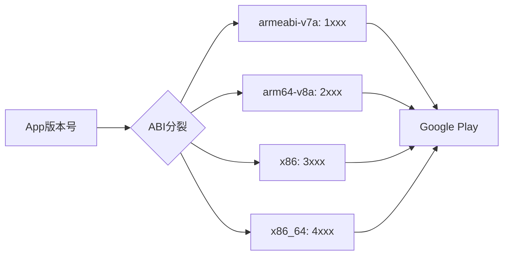

# 21.1.59 阿比斯普利特

蝉鸣声不知什么时候渐渐弱了下去，取而代之的是夜风吹过草叶的沙沙声。洛芙裹紧了身上的薄毯，头顶的银河已经悄咪咪地移到了西边的天空，露水开始在草叶尖上凝结。

“刚才讲的AarMetadata都记下了吗？”黛琳轻声问道，手里的白板笔在月光下闪着微光。

“记是记下了……”洛芙点了点头，又摇了摇头，“可是我突然在想，我们一直在讲怎么配置库的元数据、怎么声明最低版本……那如果我们想给不同的手机发不同版本的APK，有没有办法让Gradle帮我们自动做这件事？”

伊莎正把最后一根烟花棒塞进带来的小玻璃瓶里，听到这话抬起头来：“洛芙这个问题问得好诶——就像我们露营的时候，有的帐篷大有的帐篷小，不同人数用不同的帐篷，那我们的App是不是也可以‘因手机而异’？”

“说得好，”黛琳微微一笑，“这就要讲到今天的主角了——AbiSplit。”

她从背包里翻出一本手掌大的小笔记本，封面上贴着一张星空的贴纸。

“之前我们学的AarMetadata，是用来配置AAR库的元数据的。但AbiSplit的作用是——让Gradle帮我们生成多个APK，每个APK只包含特定CPU架构的原生代码。”

“CPU架构？”洛芙眨了眨眼，“是说有的手机是骁龙、有的是联发科之类的吗？”

“不是完全一样，但差不多是这个意思，”黛琳翻开笔记本，“在Android世界里，CPU架构有个专业的名字叫ABI——Application Binary Interface，应用二进制接口。不同的CPU需要不同的二进制指令，比如有的是arm架构，有的是x86架构。”

希尔不知道什么时候已经把笔记本掏出来了，屏幕上是Android Studio的界面：“我知道！这个我知道！常见的ABI有四种——arm64-v8a、armeabi-v7a、x86、x86_64。对应不同的CPU指令集。”

“对，”黛琳点点头，“AbiSplit就是用来配置‘我要为哪些ABI生成单独的APK’的。比如你的App在华为手机上用的是arm64-v8a，在某些平板模拟器上用的是x86_64，那就可以让Gradle分别生成对应的APK，用户只需要下载自己手机能用那个就行，不用下载一整个大包。”

洛芙凑近看了看图：“那……这有什么用呢？”

“最大的好处是减小APK体积，”伊莎接口道，“你想啊，如果你的App只需要在arm64-v8a的手机上运行，那干吗还要把x86、x86_64的代码都塞进去呢？那不是浪费吗？就像你去露营，只带自己用的东西就好了，别人的装备不必要背着跑。”

黛琳笑着补充：“而且有些设备真的不支持某些ABI。比如有些老设备只支持armeabi-v7a，有些模拟器只支持x86。如果你打包的时候把所有ABI都塞进去，反而可能在某些设备上出问题。”

“原来如此！”洛芙恍然大悟，“那AbiSplit应该怎么写呢？”

“好问题，”黛琳笑了笑，“我们来看代码。”

她在白板上写了几行Groovy代码：

```groovy
android {
    // ...
    splits {
        abi {
            // 启用ABI分裂
            enable true
            
            // 重置默认的ABI列表
            // 这样我们可以只指定我们需要的
            reset()
            
            // 指定要生成APK的ABI列表
            include "armeabi-v7a", "arm64-v8a", "x86", "x86_64"
            
            // 是否生成通用APK（包含所有ABI）
            universalApk true
        }
    }
}
```

“等等，”洛芙举手，“我有点晕……这个`splits`块是干什么的？还有`reset()`是什么意思？”

“是这样的，”黛琳耐心地解释，“在Android Gradle里，`splits`是一个总的分裂配置块，里面可以放`abi`块（ABI分裂）、`density`块（屏幕密度分裂）、`language`块（语言分裂）。我们今天只讲ABI分裂。”

“那`reset()`呢？”

“‘重置’的意思，”希尔接过话头，“Gradle默认会包含所有支持的ABI，如果你想只保留特定的几个，就要先调用`reset()`清空列表，然后用`include`添加你想要的ABI。就像先把碗里的东西倒掉，再装新的。”

伊莎把烟花棒的空瓶子摆成一排，轻轻推了一下，让它们骨碌碌滚到一边：“那如果我想排除某些ABI呢？比如我的App不支持x86_64？”

“好问题，”黛琳在白板上画了一幅示意图，“如果你想排除特定的ABI，而不是指定要包含哪些，可以用`exclude`。比如这样：”

```groovy
splits {
    abi {
        enable true
        
        // 排除x86_64，只生成其他三种ABI的APK
        exclude "x86_64"
        
        // 仍然生成通用APK
        universalApk true
    }
}
```

“听起来好专业……”洛芙吐了吐舌头，“不过原理我懂了。那生成出来的APK会有什么不同呢？”

希尔把笔记本屏幕转过来给大家看：“我刚才查了一下官方文档，生成出来的APK文件名会有变化。比如对于一个叫MyApp的应用，版本号是1.0，生成的APK可能是这样的：”

```text
MyApp-1.0-armeabi-v7a.apk    // 仅包含armeabi-v7a的原生代码
MyApp-1.0-arm64-v8a.apk      // 仅包含arm64-v8a的原生代码
MyApp-1.0-x86.apk            // 仅包含x86的原生代码
MyApp-1.0-x86_64.apk         // 仅包含x86_64的原生代码
MyApp-1.0-universal.apk      // 包含所有ABI的通用APK
```

“原来APK文件名里会带上ABI的名字！”洛芙眼睛亮晶晶的，“那如果我想给不同的ABI设置不同的版本号呢？我记得Google Play好像不允许同一个版本号有多个APK？”

“你说对了，”黛琳赞许地看了洛芙一眼，“Google Play Store不允许同一个versionCode有多个APK。所以如果我们想用ABI分裂，就需要给每个ABI的APK分配不同的versionCode。”

她在白板上又画了一幅图：



“你们看这张图，”黛琳用白板笔点了点图上的C到F，“常见的做法是给每个ABI分配一个‘千位’编号。比如armeabi-v7a用1000系列，arm64-v8a用2000系列，x86用3000系列，x86_64用4000系列。这样每个ABI的APK都有独特的versionCode，Google Play就不会报错了。”

洛芙凑近看了看图：“那代码应该怎么写呢？”

“好问题，”黛琳笑了笑，“我们来看代码。”

她在白板上写了一段代码：

```groovy
android {
    // 默认版本号
    defaultConfig {
        versionCode 4
        versionName "1.0"
    }
    
    splits {
        abi {
            enable true
            reset()
            include "armeabi-v7a", "arm64-v8a", "x86", "x86_64"
            universalApk true
        }
    }
}

// ABI到版本号的映射
ext.abiCodes = [
    'armeabi-v7a': 1,
    'arm64-v8a': 2,
    'x86': 3,
    'x86_64': 4
]

// 为每个输出变体设置对应的versionCode
android.applicationVariants.all { variant ->
    variant.outputs.each { output ->
        def abiFilter = output.getFilter(com.android.build.OutputFile.ABI)
        if (abiFilter != null) {
            // 根据ABI计算新的versionCode
            def abiCode = ext.abiCodes[abiFilter]
            output.versionCodeOverride = abiCode * 1000 + variant.versionCode
        }
    }
}
```

“原来如此！”洛芙恍然大悟，“先用`ext.abiCodes`定义ABI和编号的映射，然后在`applicationVariants.all`块里，根据当前的ABI计算新的versionCode！”

“对，”希尔补充道，“`variant.versionCode`是默认的版本号，`abiCode * 1000`就是每个ABI的‘千位’偏移。加起来就是最终的版本号。比如默认版本号是4，armeabi-v7a的ABI编号是1，那最终版本号就是1 * 1000 + 4 = 1004。”

黛琳见洛芙理解了这个难点，便继续往下讲：“不过，使用ABI分裂也有一些需要注意的地方。”

她的话题一转：“第一个问题是，ABI分裂会生成多个APK，这意味着你的构建时间会变长。如果你同时还配置了多个productFlavor或者buildType，那APK数量会成倍增长。”

“明白，”伊莎点点头，“就像我们露营的时候，如果每个人都要单独搭一个帐篷，那花的时间肯定比一起搭一个大军帐要多。”

“第二个问题是，”黛琳继续说道，“如果你用了ABI分裂，那就不能再用App Bundle了。因为App Bundle本身就是Google Play用来做动态分发的，你再手动做ABI分裂，反而会冲突。”

“那应该什么时候用ABI分裂呢？”洛芙好奇地问。

“主要是这两个场景，”希尔扳着手指说，“一个是Google Play以外的分发渠道，比如直接给用户发APK文件，那他们只需要下对应的版本就好；另一个是你的App体积太大，想用ABI分裂来减小每个APK的体积，特别是如果你确定只需要支持特定的几种ABI的话。”

黛琳表示同意：“对，还有一点要记住——如果你用了NDK，写了C/C++代码，那ABI分裂才真正有意义。因为ABI分裂主要针对的是原生代码。如果你全是Kotlin/Java代码，那分裂了也没区别。”

“原来如此！”洛芙裹紧毯子，眼睛亮晶晶的，“那如果我的App需要同时支持armeabi-v7a和arm64-v8a，我应该怎么配置呢？”

“这个问得好，”黛琳笑了笑，“现在主流的Android设备大部分都支持arm64-v8a了，但还有少量老设备只支持armeabi-v7a。如果你想兼顾两类设备，可以这样配置：”

```groovy
splits {
    abi {
        enable true
        
        // 只生成这两种ABI的APK
        reset()
        include "armeabi-v7a", "arm64-v8a"
        
        // 同时生成包含所有ABI的通用APK
        universalApk true
    }
}
```

“这样的话，”洛芙若有所思地说，“arm64-v8a的手机会下载arm64-v8a版本的APK，armeabi-v7a的老手机会下载对应版本，而如果用户的手机不在这两个ABI之列，还能用universal APK兜底？”

“Exactly！”希尔打了个响指，“这就是所谓的‘分层支持’策略——先针对主流ABI做优化，再保留一个通用版本作为后备。”

夜风变得更凉爽了，天边的星星一颗一颗地亮起来。洛芙裹紧毯子，眼睛亮晶晶的：“那……ABI分裂和App Bundle到底有什么区别呢？我有点分不清。”

“好问题，”黛琳赞许地看了洛芙一眼，“ABI分裂是你在构建时手动把APK拆开，而App Bundle是Google Play在后台根据用户设备动态组合最终的APK。ABI分裂的优点是完全可控，你可以精确知道每个APK会包含什么；App Bundle的优点是更灵活，Google Play会自动帮你做所有优化，而且用户只需要下载真正用到的代码。”

伊莎把空的烟花棒瓶子一个个捡起来，放进随身的袋子里：“那如果我想在Google Play上发布，又想减小APK体积，应该选哪个呢？”

“选App Bundle，”黛琳笑道，“Google官方推荐用App Bundle，因为它会自动处理ABI分裂、屏幕密度分裂、语言分裂等等，你只需要提交一个Bundle文件就行。而且App Bundle还能支持动态功能模块，这是ABI分裂做不到的。”

“原来如此！”洛芙吐了吐舌头，“不过了解一下ABI分裂也不错，至少知道Gradle在底层是怎么工作的。”

希尔把笔记本屏幕转过来给大家看：“我找到一个更完整的AbiSplit DSL示例，我们一起看看官方是怎么定义的。”

屏幕上显示着从官方文档摘录的代码结构：

```groovy
android {
    // ABI分裂配置
    splits {
        // ABI分裂设置
        abi {
            // 是否启用ABI分裂
            enable true
            
            // 重置默认ABI列表（必须配合include使用）
            reset()
            
            // 指定要生成的ABI列表
            include "armeabi-v7a", "arm64-v8a", "x86", "x86_64"
            
            // 排除特定ABI（与include二选一）
            // exclude "mips", "mips64"
            
            // 是否生成通用APK
            universalApk true
        }
    }
}
```

“你们看，”黛琳用白板笔点了点屏幕上的代码，“AbiSplit的核心配置就是这些。`enable`是开关，`reset()`配合`include`是指定ABI列表，`exclude`是排除特定ABI，`universalApk`是决定是否生成包含所有代码的兜底APK。”

洛芙若有所思地点了点头：“感觉ABI分裂就像……给不同的人发不同的露营装备一样。的去徒步，带徒步的装备；的去划船，带划船的装备；不确定的，就带一套通用的。”

“這個比喻好！”伊莎眼睛弯成了月牙，“就是這個意思——让每个用户只下载自己真正需要的东西。”

黛琳把白板收起来，轻轻拍了拍手：“今天的内容就到这里。AbiSplit是一个非常强大的工具，可以帮助我们优化APK体积，但也要记住它的适用场景——主要是针对有原生代码的App，以及需要在Google Play以外渠道分发的情况。”

星空依旧璀璨，夜风轻轻吹拂着帐篷的帆布。洛芙靠在黛琳身边，看着头顶的银河：“黛琳，你觉得我们明天会学什么呢？”

“谁知道呢？”黛琳微微一笑，“不过不用担心，不管学什么，我们都会一起面对的。”

洛芙安心地点了点头，夜色渐深，露营地上的四个女孩慢慢进入了梦乡。

---

> ** AbiSplit（ABI分裂配置类型）** 是Android Gradle插件提供的DSL类型，用于配置基于不同ABI（Application Binary Interface）生成多个APK的构建策略。通过AbiSplit，开发者可以为不同的CPU架构（armeabi-v7a、arm64-v8a、x86、x86_64等）生成专门的APK，从而减小每个APK的体积，因为用户只需要下载自己设备支持的那个版本。ABI分裂主要适用于包含原生代码（C/C++）的App，通过NDK编译的原生库会针对特定ABI进行编译，使用ABI分裂可以让每个APK只包含对应ABI的原生代码。

#### 结构图

```mermaid
flowchart TB
    subgraph Gradle构建
    A[android块] --> B[splits块]
    B --> C[abi块 - AbiSplit]
    end
    
    subgraph AbiSplit配置
    C --> D[enable: Boolean]
    C --> E[reset(): Unit]
    C --> F[include: List<String>]
    C --> G[exclude: List<String>]
    C --> H[universalApk: Boolean]
    end
    
    subgraph 生成的APK
    D --> I[APK输出]
    F --> I
    G --> I
    H --> I
    end
    
    subgraph 实际ABI
    I --> J[armeabi-v7a.apk]
    I --> K[arm64-v8a.apk]
    I --> L[x86.apk]
    I --> M[x86_64.apk]
    I --> N[universal.apk]
    end
```

#### 复杂度与影响

- **构建时间**：ABI分裂会生成多个APK，构建时间会线性增长（每增加一个ABI，构建时间约增加30-50%）
- **APK体积优化**：每个ABI的APK只包含对应架构的原生代码，体积通常比通用APK小40-60%
- **测试复杂度**：需要针对每个ABI的APK进行测试，确保功能正常

#### 反模式与陷阱

- ❌ **同时使用ABI分裂和App Bundle**：Google Play会自动处理ABI分裂，手动配置会导致冲突
- ❌ **对纯Kotlin/Java代码使用ABI分裂**：如果没有NDK原生代码，ABI分裂没有意义，只会增加构建时间
- ❌ **忘记配置universalApk作为兜底**：某些设备可能不在指定的ABI列表中，没有universalApk会导致安装失败
- ❌ **versionCode冲突**：上传到Google Play时，不同ABI的APK必须有独特的versionCode，需要使用`abiCodes`映射

#### 设计哲学

ABI分裂体现了**按需分发**的设计思想——让每个用户只获取自己真正需要的内容。这与App Bundle的核心理念一致，只是在构建时而非运行时做分发决策。设计时考虑：

1. **最小化原则**：只包含必需的代码，不打包用不到的ABI
2. **兼容性保障**：通过universalApk提供兜底，确保所有设备都能安装
3. **版本管理**：通过versionCode映射解决Google Play的冲突检测

#### 🏕️ 动手练习

**目标**：为Android项目配置ABI分裂，生成针对不同架构的APK

**Task 1：基础ABI分裂配置**
- 目标：理解AbiSplit的基本配置方法
- 操作步骤：
  1. 创建一个新的Android项目或打开现有项目
  2. 在模块级`build.gradle`的`android`块中添加`splits`块
  3. 配置`abi`块启用分裂
- 验收标准：
  - [ ] `build.gradle`中正确配置了`splits.abi`块
  - [ ] `enable`设置为`true`
  - [ ] 包含`include`或`exclude`配置
- 提示代码：
```groovy
splits {
    abi {
        enable true
        reset()
        include "armeabi-v7a", "arm64-v8a"
    }
}
```

**Task 2：添加通用APK**
- 目标：同时生成包含所有ABI的通用APK
- 操作步骤：
  1. 在Task 1的基础上添加`universalApk true`
  2. 执行`./gradlew assembleDebug`
  3. 检查`app/build/outputs/apk`目录下的输出
- 验收标准：
  - [ ] 生成了单独ABI的APK
  - [ ] 生成了universal APK
  - [ ] APK文件名正确包含ABI标识
- 提示代码：
```groovy
abi {
    enable true
    reset()
    include "armeabi-v7a", "arm64-v8a"
    universalApk true
}
```

**Task 3：配置versionCode映射**
- 目标：解决Google Play的versionCode冲突问题
- 操作步骤：
  1. 在`android`块外定义`ext.abiCodes`映射
  2. 在`applicationVariants.all`块中为每个输出设置versionCode
- 验收标准：
  - [ ] 每个ABI的APK有不同的versionCode
  - [ ] versionCode计算公式正确（abiCode * 1000 + baseVersionCode）
- 提示代码：
```groovy
ext.abiCodes = ['armeabi-v7a': 1, 'arm64-v8a': 2]

android.applicationVariants.all { variant ->
    variant.outputs.each { output ->
        def abiFilter = output.getFilter("ABI")
        if (abiFilter != null) {
            output.versionCodeOverride = ext.abiCodes[abiFilter] * 1000 + variant.versionCode
        }
    }
}
```

**Task 4：NDK项目验证（进阶）**
- 目标：验证ABI分裂对原生代码的实际影响
- 操作步骤：
  1. 在项目中添加NDK支持（`ndk { abiFilters 'armeabi-v7a', 'arm64-v8a' }`）
  2. 编写一个简单的C++ native方法
  3. 生成APK后，用`unzip -l`检查不同ABI的APK中的`libnative-lib.so`
- 验收标准：
  - [ ] arm64-v8a的APK只包含`lib/arm64-v8a/libnative-lib.so`
  - [ ] armeabi-v7a的APK只包含`lib/armeabi-v7a/libnative-lib.so`
  - [ ] universal APK包含所有架构的so文件

#### 面试热身

- Q1: ABI分裂和App Bundle有什么区别？分别在什么场景下使用？
- Q2: 如果不使用ABI分裂，有什么办法可以减小APK体积？
- Q3: 为什么Google Play要求不同ABI的APK有不同的versionCode？
- Q4: universal APK的作用是什么？什么时候应该启用它？
- Q5: 如果你的App只支持arm64-v8a，但用户设备是armeabi-v7a，会发生什么？

#### 参考实现要点

1. 优先使用App Bundle而非ABI分裂，Google Play会自动优化分发
2. 如果需要ABI分裂，记得配置universalApk作为兜底方案
3. 上传到Google Play前务必配置versionCode映射，避免版本冲突
4. 纯Kotlin/Java项目不需要ABI分裂，不会带来体积收益
5. 发布到Google Play以外的渠道时，ABI分裂可以显著减小下载体积

> 学习建议：AbiSplit是构建优化的重要工具，但需要与App Bundle区分使用场景。建议先理解概念，在实际项目需要优化APK体积时再深入实践。

---

## 洛芙的小小日记本

今天学会了ABI分裂！黛琳说就像给不同的人发不同的露营装备一样——徒步的发徒步的，划船的发划船的，不需要的一大堆带着多累啊。不过希尔说Google Play现在都用App Bundle了，原理差不多但是更智能。管他呢，先记下来再说~

---

## 今日关键词

- **AbiSplit**：Android Gradle插件的DSL类型，用于配置基于ABI生成多个APK
- **ABI**：Application Binary Interface，应用二进制接口，不同CPU架构需要不同的二进制指令
- **armeabi-v7a**：32位ARM架构，支持ARMv7及以上的CPU
- **arm64-v8a**：64位ARM架构，支持ARMv8及以上的CPU
- **x86**：Intel/AMD的32位x86架构
- **x86_64**：Intel/AMD的64位x86架构
- **universalApk**：包含所有ABI代码的通用APK
- **splits**：Gradle中配置APK分裂的块
- **reset()**：清空默认ABI列表的方法
- **include**：指定要包含的ABI列表
- **exclude**：指定要排除的ABI列表
- **versionCodeOverride**：覆盖默认versionCode的API
- **NDK**：Native Development Kit，用于开发C/C++原生代码
- **App Bundle**：Google推荐的发布格式，Google Play会自动优化分发
