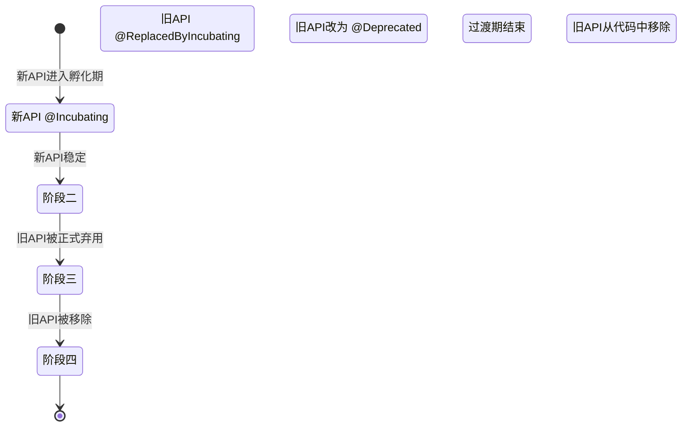

# 21.1.6 被孵化取代

午后的阳光像融化的蜂蜜一样流淌在帐篷顶上，洛芙整个人都懒洋洋地蜷在睡袋里，手里把玩着一根草茎。

“洛芙，别发呆了。”黛琳的声音从旁边传来，“昨天我们讲到自定义Gradle任务，今天来点更实际的——你知道API也会'新老交替'吗？”

洛芙抬起头，眼睛里写着大大的问号：“API也会像露营装备一样更新换代？”

“差不多是这个意思。”伊莎笑着递过来一杯凉白开，“就像我们今年买了新帐篷，不代表旧帐篷立刻就不能用了对吧？但是你得知道，哪些装备正在被淘汰，哪些又是未来的主流。”

希尔不知道什么时候已经把电脑搬到了树荫下，屏幕上是Android Gradle Plugin的API文档页面。她招招手示意大家过去看。

“你们看这个注解，”希尔指着屏幕说，“叫`ReplacedByIncubating`，专门用来处理API的新老交替问题。”

洛芙凑近屏幕，看到了那个看起来有点眼生的注解名称：“ReplacedByIncubating……被孵化取代？这个名字好奇怪呀。”

“这就是我们今天要讲的内容。”黛琳从背包里抽出白板笔，“在Android Gradle Plugin的世界里，每当有新API要取代旧API时，就会用到这个注解。听起来是不是很像我们露营时的'新旧装备过渡期'？”

洛芙眼睛亮了：“是不是就像我那件旧的冲锋衣，虽然还在穿，但是姐姐说以后会给我买新的？”

“没错！”伊莎轻轻鼓掌，“就是这个感觉。不过在代码世界里，这个过渡可比买衣服复杂多了。”

---

## 孵化中的API：为什么要"暂不弃用"？

黛琳在白板上画了一个简单的流程图。

“你们有没有遇到过这种情况，”黛琳开始解释，“当你想要用一个新方法的时候，发现它还在'孵化'阶段？”

洛芙点点头：“孵化……是说还在测试的意思吗？”

“差不多。”黛琳写道，“在Gradle的世界里，有些API会被标记为'孵化中'——也就是说，它们可能还不够稳定，未来可能会改变。用术语来说，就是`org.gradle.api.Incubating`。”

```kotlin
// 新API - 处于孵化中状态
@org.gradle.api.Incubating
fun newMethod(): String {
    return "这是新的API方法"
}
```

希尔补充道：“问题来了——如果你是一个库开发者，想要用新API替换旧API，按照常规做法，你应该把旧API标记为'已弃用'（Deprecated）。但这样做的话，用户就陷入了两难：到底该用已弃用的旧API，还是用可能不稳定的孵化中新API？”

洛芙皱起眉头：“这也太为难人了吧……就像在说，你是要用旧帐篷，还是用可能漏水的新帐篷？”

“对！所以Android Gradle Plugin想出了一个聪明的办法。”黛琳微微一笑，在白板上写下几个要点。

---

## ReplacedByIncubating的工作原理

黛琳翻开白板的另一页，开始详细讲解。

“当一个稳定的API要被孵化中的新API取代时，会发生这样的故事——”

“旧API不会直接被标记为弃用，而是会被打上`ReplacedByIncubating`这个标记。”黛琳写道。

```kotlin
// 旧的稳定API - 被打上"被取代"标记
@com.android.build.api.annotations.ReplacedByIncubating(
    message = "请使用新的 newMethod() 方法",
    bugId = 1234567L
)
fun oldMethod(): String {
    return "这是旧的API方法"
}
```

洛芙好奇地问：“这个注解有两个参数，message和bugId，分别是做什么的呀？”

“好问题！”希尔把代码投影到电脑上，“`message`就是告诉开发者应该用什么新API，`bugId`则是关联的bug编号，方便追踪这次替换的原因。”

伊莎端起水杯，轻声说：“这就好像在旧帐篷上贴了个便签——'新帐篷在那边，虽然还在测试，但如果你不介意的话可以先用新的。'”

“而新API会继续带着`@Incubating`注解。”黛琳补充道。

```kotlin
// 新的孵化中API
@org.gradle.api.Incubating
fun newMethod(): String {
    return "这是新的API方法"
}
```

---

## API过渡的生命周期

洛芙举手提问：“那这个'替代'过程会一直持续下去吗？旧API会不会最后真的被删除呀？”

“当然会！”黛琳点点头，“这个替代是有时间限制的，整个过程可以分为几个阶段。”

她在白板上画了一条时间线：



“听起来好像蚕蛹变成蝴蝶的过程！”洛芙兴奋地说。

“完全正确！”伊莎笑着说，“这就是为什么叫'孵化'——新API从蛹里羽化出来，旧API则慢慢退出历史舞台。”

黛琳详细解释道：

“**阶段一：新API孵化期**
- 新API带有`@Incubating`注解
- 旧API带有`@ReplacedByIncubating`注解（但还不是Deprecated）
- 开发者可以选择使用新API，或者继续用旧API

**阶段二：新API稳定**
- 当新API成熟后，`@ReplacedByIncubating`被替换为`@Deprecated`
- 旧API正式进入弃用倒计时

**阶段三：弃用期结束**
- 经过一定的弃用期后，旧API被移除
- 代码中只保留新API”

---

## 实战：自定义任务中的API替换

希尔把电脑转过来，展示一个真实的例子：“我们在实际开发中经常会遇到这种情况。假设你正在写一个自定义的Gradle任务，需要处理一些构建变体相关的东西。”

```kotlin
// 这是一个自定义的Gradle任务
abstract class MyCustomTask : DefaultTask() {

    // 旧API - 获取变体列表
    @get:InputFiles
    @get:Incremental
    abstract val oldVariantList: ListProperty<String>

    // 使用了ReplacedByIncubating的旧方法
    @Deprecated("请使用新的 getStableVariants() 方法")
    @ReplacedByIncubating(
        message = "请使用新的 getStableVariants() 方法",
        bugId = 287419503L
    )
    fun getVariants(): List<String> {
        return oldVariantList.get()
    }

    // 新API - 获取稳定的变体列表
    @org.gradle.api.Incubating
    fun getStableVariants(): List<String> {
        // 新的实现，更稳定
        return oldVariantList.get()
    }

    @TaskAction
    fun execute() {
        println("开始处理变体...")
        // 暂时使用旧的实现
        val variants = getVariants()
        println("处理的变体: ${variants.joinToString()}")
    }
}
```

洛芙仔细看着代码：“我注意到`getVariants()`同时有`@Deprecated`和`@ReplacedByIncubating`两个注解，这是为什么呀？”

“问得好！”黛琳解释道，“当新API稳定之后，旧API的`@ReplacedByIncubating`就会被替换为`@Deprecated`。这时候开发者就知道——旧API进入了真正的弃用倒计时，是时候迁移到新API了。”

“如果我们继续使用旧API会怎样？”洛芙问。

“Gradle会给警告。”希尔调出编译输出示例：

```
> Task :app:compileDebugKotlin
w: API 'com.android.build.api.variant.Variant' is marked as @ReplacedByIncubating
   注意: 请使用新的 getStableVariants() 方法
   相关bug: https://issuetracker.google.com/287419503
w: API 'getVariants()' 已在 8.8 版本中被 ReplacedByIncubating
   请迁移到新的 getStableVariants() API
```

“编译时会给出警告，提醒开发者该迁移了。”希尔说，“这就是`ReplacedByIncubating`存在的意义——温和地提醒，而不是一刀切地强制弃用。”

---

## 为什么要用这个机制？

伊莎轻轻拨动着水杯里的吸管：“洛芙，你觉得这个机制像什么？”

洛芙思考了一会儿：“像……商店里的'新产品试用装'？会给顾客一些时间来适应新产品？”

“非常接近！”伊莎笑道，“实际上，这是一个非常人性化的设计。想象一下——”

“如果直接弃用旧API会发生什么？”黛琳反问。

洛芙摇头表示不知道。

“用户会很头疼。”希尔说，“你想啊，如果你正在用旧API开发项目，突然间不能用 了，你必须马上学习新API，还要冒着新API不稳定的风险。这就像逼你在暴风雨中换帐篷——很狼狈的。”

“但是有了`ReplacedByIncubating`机制，”黛琳总结道，“用户有两个选择：要么继续用熟悉的旧API（虽然知道它会被取代），要么主动尝试新API（虽然可能还不够完美）。这是一种'软着陆'策略。”

---

## 实际使用场景

黛琳打开Android Studio，展示一个真实的项目配置：“在我们的露营App项目中，如果要添加一个自定义的构建逻辑，可能就会遇到这种情况。”

```kotlin
// 露营App的自定义构建逻辑
androidComponents {
    onVariants(selector().all()) { variant ->
        // 这是一个新的API，正在孵化中
        @org.gradle.api.Incubating
        fun configureVariant(variant: Variant) {
            // 配置变体属性
            variant.outputs.forEach { output ->
                output.versionCode.set(
                    output.versionCode.get() + 1
                )
            }
        }

        // 这是旧的方法，被打上了替代标记
        @Deprecated("请使用新的 configureVariant API")
        @ReplacedByIncubating(
            message = "请使用 configureVariant(Variant) 替代",
            bugId = 309508743L
        )
        fun configureVariantLegacy(variant: com.android.build.api.variant.LegacyVariant) {
            // 旧的实现
            variant.outputs.forEach { output ->
                output.versionCode.set(
                    output.versionCode.get() + 1
                )
            }
        }
    }
}
```

洛芙看得似懂非懂：“这个配置看起来好复杂呀……不过我大概理解了新旧API的区别。”

“没关系，”伊莎温柔地说，“重要的是理解这个概念——当你看到`ReplacedByIncubating`注解时，就知道这是一个'过渡期'的API，未来的版本可能会稳定下来并正式弃用旧API。”

---

## 代码层面的细节

希尔打开注解的定义页面：“其实这个注解本身也很简单，只有两个属性。”

```kotlin
/**
 * 用于标记正在被孵化中API取代的API
 *
 * @param message 提示用户应该使用的新API信息
 * @param bugId 关联的Google Issue Tracker编号
 */
@Target(
    AnnotationTarget.CLASS,
    AnnotationTarget.FUNCTION,
    AnnotationTarget.FIELD,
    AnnotationTarget.CONSTRUCTOR,
    AnnotationTarget.PROPERTY_GETTER,
    AnnotationTarget.PROPERTY_SETTER
)
@Retention(AnnotationRetention.RUNTIME)
annotation class ReplacedByIncubating(
    val message: String,
    val bugId: Long
)
```

“你们看，”希尔指着代码说，“这个注解可以用于类、函数、字段、构造函数和属性getter/setter。保留策略是RUNTIME，意味着在运行时可以通过反射获取到这个注解信息。”

洛芙好奇地问：“那这些属性都是必需的吗？”

“对，`message`和`bugId`都是必需的。”黛琳补充道，“`message`告诉开发者应该用什么新API，`bugId`方便开发者去Google Issue Tracker查看更多背景信息。”

---

## 如何应对API过渡

洛芙问道：“那如果我们在项目里遇到这种被标记的API，应该怎么做呢？”

黛琳给出了建议：

“**首先，看看警告信息。**Gradle会告诉你应该迁移到哪个新API。”

“**其次，检查新API的稳定性。**如果新API还带着`@Incubating`注解，说明它可能还有变化的风险。你可以选择——继续用旧API（虽然会被警告），或者冒险尝试新API（可能需要跟进未来的变化）。”

“**最后，关注版本更新。**当新API稳定后，旧API会被正式弃用。这时候你就有明确的弃用窗口期，可以从容地迁移到新API。”

希尔补充了一个实用技巧：“如果你的项目对稳定性要求很高，可以设置Gradle忽略某些弃用警告——但这不是长久之计。”

```groovy
// 在 build.gradle 中忽略特定弃用警告
tasks.withType(JavaCompile).configureEach {
    options.compilerArgs.add("-Xlint:deprecation")
    // 或者使用Gradle的API过滤
}
```

---

## 章节小结

伊莎总结道：“今天我们学到了一个很有趣的API过渡机制——`ReplacedByIncubating`。”

“这就像露营时的'新旧装备过渡期'，”洛芙开心地说，“旧帐篷还能用，但你知道新帐篷会是主流；新帐篷虽然在测试，但你知道它以后会取代旧的。”

“对！”黛琳微笑着说，“这就是Android Gradle Plugin的'软着陆'策略——让开发者有时间适应新变化，而不是一刀切地强制升级。”

洛芙伸了个懒腰，看着头顶的树叶在风中轻轻摇曳：“原来代码世界里也有这么多温柔的设计呀……”

---

> 本章介绍了一个独特的API过渡机制——`ReplacedByIncubating`注解。它用于在旧稳定API被新的孵化中API取代时，提供一个温和的过渡期。当新API成熟后，旧API会被正式弃用并最终移除，开发者有充足的时间进行迁移。

---

### 核心知识点回顾

- **ReplacedByIncubating**：Android Gradle Plugin特有的注解，用于标记正在被孵化中API取代的稳定API
- **过渡机制**：旧API不会被直接弃用，而是标记为"将被取代"，给开发者缓冲时间
- **生命周期**：孵化期（`@Incubating`）→ 稳定后替换为弃用（`@Deprecated`）→ 最终移除
- **两个属性**：`message`提示新API信息，`bugId`关联Google Issue Tracker便于追踪

---

> **学习建议**
> - 在实际项目中遇到`ReplacedByIncubating`警告时，不要急于修改，先评估新API的成熟度
> - 关注Android Gradle Plugin的版本更新日志，了解哪些API正在进入过渡期
> - 如果你是库作者，使用`ReplacedByIncubating`可以让用户有更平滑的迁移体验

---

## 洛芙的小小日记本

今天学会了`ReplacedByIncubating`！就像露营时新旧帐篷的过渡期——不是一刀切地换掉，而是给足够的时间让你慢慢适应。黛琳说得对，代码世界里也有很多温柔的设计呢。

---

## 今日关键词

**ReplacedByIncubating**：Android Gradle Plugin的注解，用于标记正在被孵化中API取代的旧稳定API。

**@org.gradle.api.Incubating**：Gradle的注解，表示API处于实验阶段，可能不稳定。

**@Deprecated**：Java/Kotlin的标准弃用注解，表示API不再推荐使用。

**API生命周期**：从孵化到稳定再到弃用的演进过程。

**软着陆策略**：通过渐进式过渡而非强制弃用来更新API的设计理念。

**Variant**：Android构建系统中的构建变体（如debug、release）。

**DefaultTask**：Gradle中自定义任务的基础类。

**AnnotationTarget**：Kotlin注解的作用目标类型。

**AnnotationRetention**：注解的保留策略（RUNTIME表示运行时可访问）。

**Google Issue Tracker**：Google用于跟踪bug和问题跟踪系统。
