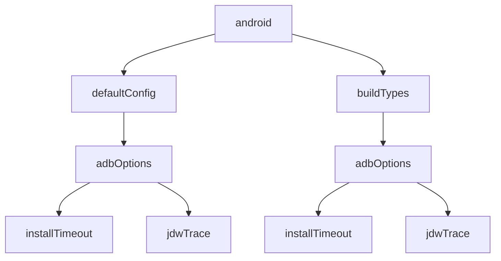
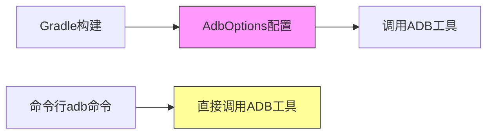
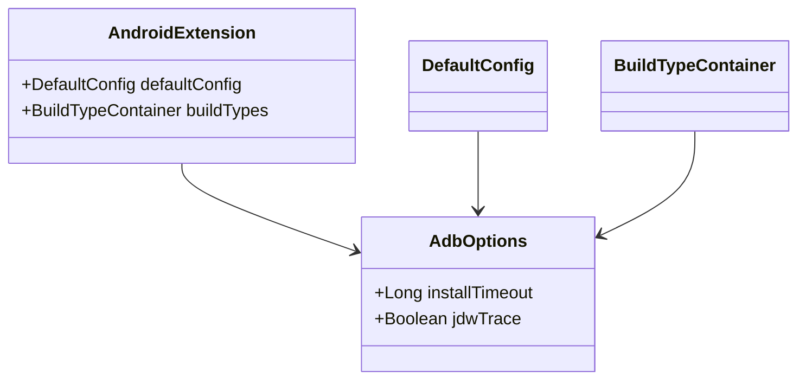

# 21.1.60 AdbOptions

蝉鸣声不知什么时候渐渐弱了下去，取而代之的是夜风吹过草叶的沙沙声。洛芙裹紧了身上的薄毯，头顶的银河已经悄咪咪地移到了西边的天空，露水开始在草叶尖上凝结。

“刚才讲的AbiSplit都记下了吗？”黛琳轻声问道，手里的白板笔在月光下闪着微光。

“记是记下了……”洛芙点了点头，又摇了摇头，“可是我突然在想，我们刚才说的AbiSplit是帮我们生成不同的APK，那……如果我们想要调试这些APK，或者把它们安装到手机上，有没有工具可以帮我们更方便地管理这个过程？”

伊莎正把最后一根烟花棒塞进带来的小玻璃瓶里，听到这话抬起头来：“洛芙这个问题问得好诶——就像我们露营的时候，帐篷搭好了，还要想办法生火做饭，那这个‘生火’的过程需不需要一些工具来帮忙？”

“说得好，”黛琳微微一笑，“这就要讲到今天的主角了——AdbOptions。”

她从背包里翻出一本手掌大的小笔记本，封面上贴着一张星空的贴纸。

“刚才我们学的AbiSplit，是用来配置APK的输出的。但AdbOptions的作用是——帮我们配置Android调试桥，也就是ADB的各种连接和安装选项。”

“ADB？”洛芙眨了眨眼，“是说我们平时用Android Studio调试手机的时候用的那个ADB吗？”

“没错，”黛琳翻开笔记本，“ADB是Android Debug Bridge的缩写，中文叫安卓调试桥。你可以把它想象成连接电脑和手机的‘桥梁’，我们通过这根桥梁把APK安装到手机上，也可以通过它来调试程序、查看日志。”

希尔不知道什么时候已经把笔记本掏出来了，屏幕上显示着Android Studio的界面：“我知道！这个我知道！平时我们用adb install安装APK，用adb logcat看日志，还有adb shell、adb push等等。”

“对，”黛琳点点头，“而AdbOptions就是用来在Gradle构建时配置这些ADB行为的。比如你可以设置安装超时时间、开启JDWP调试跟踪、配置调试端口等等。”

洛芙凑近看了看图：“那……这些配置具体能帮我们做什么呢？”

---

黛琳的白板在月光下泛着柔和的光，她拿起笔开始在白板上画了一个简单的示意图。

“首先我们要知道，ADB是怎么工作的。”她在白板上画了一个电脑的图标，又画了一个手机的图标，中间用一根线连起来，“当你执行adb install的时候，计算机会通过USB或者WiFi连接到手机，然后发送APK文件过去。这个过程可能会遇到各种问题——比如手机没反应、安装太慢、连接断开等等。”

“那AdbOptions就是用来解决这些问题的吗？”洛芙问道。

“准确地说，是用来配置解决这些问题的行为的。”黛琳点点头，“比如最常见的installTimeout属性——安装超时时间。你知道的吧，有时候APK比较大，或者手机比较慢，安装可能会花比较久的时间。如果超过默认时间还没安装成功，ADB就会报错说安装失败。”

伊莎歪着头：“那……设置更长一点不就好了？”

“对，”黛琳笑着说，“installTimeout就是用来设置这个超时时间的。单位是毫秒。比如你设置为60000毫秒，那就是60秒。在某些大应用或者比较慢的设备上，这个设置很有用。”

“那如果我不设置会怎样？”洛芙好奇地问。

“不设置的话，ADB会有一个默认超时时间，大概是60秒左右。”黛琳解释道，“对于大多数应用来说足够了，但如果你在调试一个特别大的应用，或者同时安装多个应用，可能就需要调大这个值。”

希尔在笔记本上敲了几行代码，然后转过来给她们看：

```kotlin
android {
    defaultConfig {
        // 设置安装超时为120秒
        adbOptions {
            installTimeout = 120000
        }
    }
}
```

“对了！”希尔兴奋地说，“我刚才试了一下，这个installTimeout的单位是毫秒，所以120000就是120秒。你们看，代码写起来很简单吧？”

洛芙看着代码：“哦……原来是这样。那除了installTimeout，还有什么其他的选项呢？”

黛琳又在白板上补充了几个要点：“还有几个比较常用的——”

“第一个是jdwTrace。JDWP是Java Debug Wire Protocol的缩写，简单来说就是一种调试协议。如果你开启jdwTrace，ADB会在调试过程中输出更详细的协议信息，帮助开发者诊断调试问题。”

“这个……普通开发者会用吗？”洛芙问道。

“一般开发者不太会直接用到，”黛琳老实地说，“但如果你在做调试工具的开发，或者需要深入理解Android的调试机制，了解这个会很有帮助。”

伊莎举手：“那……我可以把它理解为像我们在山里走夜路的时候，JDWP就像是给我们的一盏灯笼，让我们能看得更清楚？”

“对，这个比喻很贴切！”黛琳笑着说，“正常情况下我们摸黑也能走，但如果有盏灯笼，就能看到更多平时注意不到的细节。”

“还有吗？”洛芙又问。

“还有几个，不过使用频率没那么高。”黛琳继续说，“比如adbOptions可以配置的连接选项——你可以设置是否启用USB调试、是否允许通过WiFi连接等等。不过这些通常有默认的安全值，一般不需要手动改。”

---

夜风轻轻吹过，洛芙裹紧了毯子，又想到了一个问题：“黛琳，我突然在想……我们平时用Android Studio调试应用的时候，好像也没怎么配置过这些AdbOptions啊？它是怎么工作的？”

黛琳点点头：“问得好。实际上，当你用Android Studio直接Run或者Debug应用的时候，Android Gradle插件会在内部帮你处理这些连接配置。你不一定会直接看到AdbOptions的代码，但它确实在后台工作。”

“那……什么情况下我们会需要手动配置它呢？”洛芙追问。

“很好的问题。”黛琳微微笑着说，“主要有几种场景——”

“第一种是你在做自动化测试的时候。比如你用CI/CD系统自动跑测试，需要把应用安装到很多设备上。这时候可能需要调整installTimeout，因为测试设备可能比开发机慢。”

“第二种是你在开发调试工具或者插件的时候。你可能需要开启jdwTrace来调试ADB本身的通信过程。”

“第三种是你在做特殊的部署场景。比如你需要通过WiFi无线安装APK，或者需要同时控制多台设备的安装过程。”

希尔补充道：“对了，还有一个常见的场景是——当你的应用比较大，安装时间比较长的时候。如果默认的60秒超时不够用，你就会需要调大installTimeout。”

洛芙点了点头：“原来是这样。那……这些配置是放在哪里的呢？是放在build.gradle里吗？”

“对，”黛琳指着她画的代码示例说，“AdbOptions是android.defaultConfig或者android.buildTypes的一个子配置项。你可以在defaultConfig里配置所有变体共用的选项，也可以在特定的buildTypes里单独配置。”

她在白板上画了一个简单的结构图：



“这个图展示了AdbOptions在Gradle配置中的位置。”黛琳解释道，“你可以看到，它可以在defaultConfig（所有变体的默认配置）里设置，也可以在特定的buildTypes（比如debug、release）里单独设置。”

“如果两边都设置了会怎么样？”洛芙问。

“buildTypes里的会覆盖defaultConfig里的。”黛琳回答说，“这个和我们之前学的其他配置项的优先级规则是一样的。”

---

夜已经很深了，营地上的露水越来越重。洛芙打了个小哈欠，但又不想错过这个有趣的话题。

“黛琳，我还有一个问题……”洛芙揉了揉眼睛说。

“你说。”

“就是我们刚才说的这些AdbOptions，和我们之前学的AbiSplit，它们之间是什么关系呀？我有点把它们搞混了。”

黛琳微笑着点了点头：“这个问题问得好。其实它们解决的问题不一样——”

“AbiSplit解决的问题是‘输出什么样的APK’。它帮你把APK按照CPU架构（ABI）分裂成多个，这样用户只需要下载适合自己手机的那个，省流量。”

“而AdbOptions解决的问题是‘怎么把APK安装到手机上去’。它帮你配置ADB连接和安装过程中的各种行为，比如等待超时、调试协议等等。”

伊莎灵机一动：“那我能不能这样理解——AbiSplit像是决定‘做什么样的帐篷’，而AdbOptions像是决定‘怎么把帐篷搭起来’？”

“太对了！”黛琳笑着说，“一个是产品配置，一个是过程配置。两者解决的问题不同，但都很重要。”

希尔也补充道：“而且它们可以配合使用。比如你用AbiSplit生成了针对不同ABI的APK，然后用AdbOptions配置安装时的超时时间，确保这些大APK都能顺利安装到设备上。”

洛芙若有所思地点了点头：“原来是这样……那我现在大概明白了。AdbOptions就是用来配置ADB这个‘桥梁’的各种参数，让我们安装调试APK的时候更顺利。”

“对，就是这样。”黛琳温柔地笑了，“你总结得很好。”

---

洛芙又想起了什么：“对了黛琳，我之前看到有些人用命令行直接调用adb命令，和我们这里说的AdbOptions有什么关系吗？”

“这是个好问题。”黛琳点点头，“其实AdbOptions是Gradle构建系统里配置ADB行为的方式，而你在命令行里直接敲的adb命令是直接调用ADB工具本身。”

她画了另一个简单的对比图：



“这个图展示了两种使用ADB的方式。”黛琳解释道，“上面的路径是通过Gradle构建系统，AdbOptions会在构建时生效；下面的路径是你直接在命令行敲adb命令，和Gradle没关系。”

“平时我们用Android Studio Run应用，走的是上面的路径，AdbOptions会在后台生效。”希尔补充说，“但如果你在终端里敲adb install，那就直接走下面的路径，和AdbOptions无关。”

洛芙明白了：“所以AdbOptions是给Gradle构建用的，不是给命令行用的？”

“准确地说，是这样。”黛琳确认道，“AdbOptions是Android Gradle插件提供的配置项，它会在构建过程中影响插件调用ADB的行为。但如果你不用Gradle构建，而是直接调用adb命令，那这些配置就不起作用了。”

---

夜更深了，银河已经快要落到西边的地平线下。四个女孩裹着毯子，围着渐渐微弱的篝火。

“今天学的都记住了吗？”黛琳轻声问道。

“记住了！”洛芙点头说，“AdbOptions是用来配置ADB安装和调试行为的，比如installTimeout设置安装超时，jdwTrace开启调试协议跟踪。它们在android.defaultConfig或buildTypes里配置，会在Gradle构建时生效。”

“很好，”黛琳微笑着说，“而且要记住，AdbOptions解决的是‘怎么安装’的问题，而AbiSplit解决的是‘输出什么APK’的问题。两者配合使用，可以让APK的生成和安装都更高效。”

伊莎伸了个懒腰：“今天真是学到不少啊……从AarMetadata到AbiSplit，再到AdbOptions，感觉Gradle的API好庞大啊。”

“确实很多，”黛琳点点头，“但不用一下子全记住。重要的是理解每个API解决的问题是什么，然后需要用的时候再查文档。今天学的这几个，都是在实际开发中经常会遇到的。”

希尔打了个响指：“对！而且这些知识都是有连贯性的。你看我们从库的元数据配置（AarMetadata），到APK输出配置（AbiSplit），再到安装过程配置（AdbOptions），其实是一个完整的构建流程。”

洛芙看着远处的星空：“希尔说得对……感觉像是从不同角度看同一个东西。我们学的不是孤立的知识点，而是一条链。”

黛琳温柔地笑了：“没错，就是这样。学习API最重要的是理解它们在整体流程中的位置，这样遇到问题的时候就知道该调哪个配置了。”

夜风轻拂，篝火的余烬闪着微弱的光。四个女孩就这样裹着毯子，在夏夜的星空下静静地聊着天，仿佛整个世界都安静了下来。

---

## 专业技术总结

> AdbOptions 是 Android Gradle 插件提供的 DSL 类型，用于配置 ADB（Android Debug Bridge）连接和安装行为。

#### 结构图



#### 核心机制

- **installTimeout**: 设置ADB安装APK的超时时间（毫秒），默认约60000ms
- **jdwTrace**: 开启Java Debug Wire Protocol的调试跟踪，用于诊断调试问题
- AdbOptions是android.defaultConfig或android.buildTypes的子配置项
- 配置只在Gradle构建时生效，直接调用adb命令不受影响

#### 反模式与陷阱

1. **混淆AdbOptions和命令行adb**: AdbOptions只影响Gradle构建，直接用adb命令不受影响
2. **超时时间设置过短**: 某些大应用或慢设备需要更长的安装超时
3. **在错误位置配置**: AdbOptions应在defaultConfig或buildTypes中配置，不能直接放在android根节点下

#### 设计哲学

- AdbOptions体现了Android Gradle插件对调试连接的细粒度控制
- 通过DSL配置而非命令行参数，提供更结构化的构建配置方式
- 默认值足够满足大多数场景，按需调整即可

#### 动手练习

**项目：配置AdbOptions优化CI/CD安装**

**Task 1 - 目标**：理解AdbOptions的基本配置位置
- **步骤**：在项目的build.gradle中找到android.defaultConfig或android.buildTypes节点，添加adbOptions配置块
- **验收标准**：
  - [ ] 配置块语法正确，可以正常Sync
  - [ ] 包含至少一个配置项（如installTimeout）
- **提示**：
```kotlin
android {
    defaultConfig {
        adbOptions {
            installTimeout = 120000
        }
    }
}
```

**Task 2 - 目标**：体验不同超时设置的效果
- **步骤**：将installTimeout分别设置为5000、60000、120000，尝试安装一个较大的APK（如>100MB）
- **验收标准**：
  - [ ] 记录不同超时设置下的安装结果
  - [ ] 观察是否出现超时错误
- **提示**：大APK安装时间可能超过默认的60秒

**Task 3 - 目标**：在debug和release变体中分别配置
- **步骤**：在debug和release的buildTypes中分别配置不同的adbOptions
- **验收标准**：
  - [ ] debug变体使用较短的installTimeout（如30000）
  - [ ] release变体使用较长的installTimeout（如120000）
- **提示**：buildTypes中的配置会覆盖defaultConfig中的同名配置

**Task 4 - 目标**：使用jdwTrace进行调试
- **步骤**：开启jdwTrace = true，编译并观察build日志中的调试信息
- **验收标准**：
  - [ ] build日志中能看到JDWP相关调试输出
  - [ ] 理解这些输出的含义
- **提示**：jdwTrace会增加详细的协议日志输出

**Task 5 - 目标**：在多设备CI环境中验证配置
- **步骤**：在CI脚本中配置多个设备，验证AdbOptions对安装成功率的影响
- **验收标准**：
  - [ ] 对比开启和关闭自定义installTimeout的安装成功率
  - [ ] 给出推荐的超时时间建议
- **提示**：不同设备的安装速度可能差异很大

**面试热身**

1. AdbOptions的作用是什么？和直接用adb命令有什么区别？
2. installTimeout的默认值为多少？什么场景下需要调整它？
3. jdwTrace属性适合什么场景使用？
4. 如果debug和defaultConfig都配置了AdbOptions，哪个会生效？
5. AdbOptions和AbiSplit分别解决什么问题？它们有关系吗？

#### 参考实现要点

1. AdbOptions是android配置块的子项，必须放在defaultConfig或buildTypes内部
2. installTimeout的单位是毫秒，不要和秒混淆
3. 在CI/CD环境中，建议根据设备性能调整installTimeout
4. jdwTrace主要用于开发调试工具，一般应用开发不需要开启
5. AdbOptions的配置只在Gradle构建时生效，不会影响直接调用adb命令的行为

> 技术知识的学习需要多实践，建议在真实项目中应用这些配置，体验不同设置的效果差异。

---

## 洛芙的小小日记本

今天学会了AdbOptions！原来我们用Android Studio点Run的背后，Gradle在帮我们配置ADB的连接参数。installTimeout可以设置安装超时，jdwTrace可以开调试协议跟踪。黛琳把它们比作“搭帐篷的过程”，而AbiSplit是“做什么样的帐篷”——产品配置vs过程配置，联系起来就容易理解啦。夏天的星空好美呀～

---

## 今日关键词

- **ADB (Android Debug Bridge)**: Android调试桥，连接电脑和手机的工具，用于安装APK、调试程序、查看日志等
- **AdbOptions**: Gradle DSL配置类型，用于配置ADB的连接和安装行为
- **installTimeout**: 安装超时时间属性，单位为毫秒，默认约60000ms
- **jdwTrace**: Java Debug Wire Protocol调试跟踪属性，用于输出详细的调试协议信息
- **JDWP (Java Debug Wire Protocol)**: Java调试线协议，用于Java应用调试的通信协议
- **Gradle构建**: 使用Gradle系统进行项目构建的过程
- **defaultConfig**: Android Gradle配置块，所有变体共用的默认配置
- **buildTypes**: Android Gradle配置块，不同构建类型（如debug、release）的配置