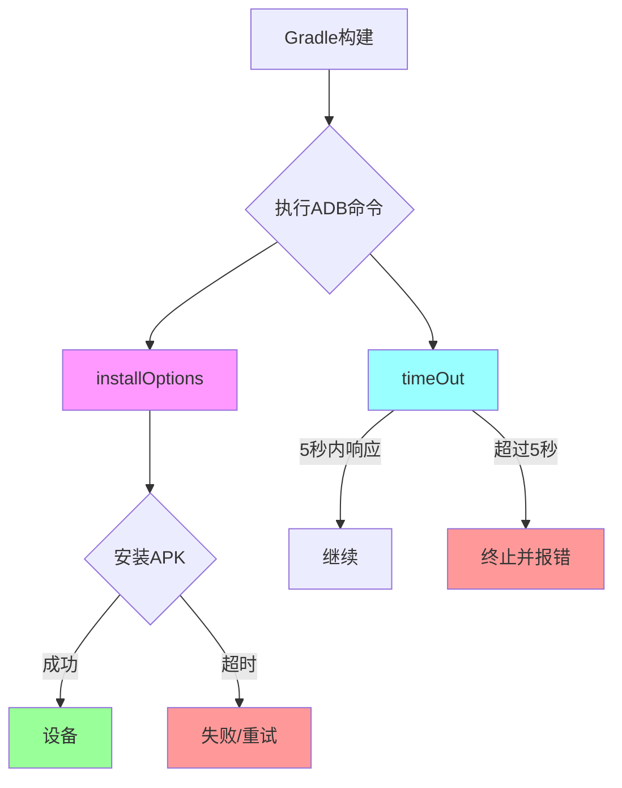
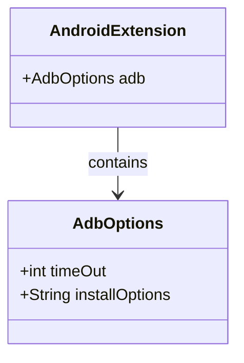

# 21.1.60 Adb选项

夜已经深了。

银河从头顶流过，像一条铺满钻石的河流。露水悄悄地在草叶上凝结，每一棵草尖都挂着一颗小小的水晶珠，在篝火余烬的微光里闪闪发亮。四个女孩裹着厚厚的毛毯，围坐在已经凉下来的火堆旁——不是没有再点火，而是今晚的风太温柔，温度太舒适，让人只想安静地坐着。

黛琳轻轻打了个哈欠，然后把笔记本转过来给大家看。屏幕上是一个 Gradle 配置文件的截图。

"我们今天学点有意思的，"她说，"上次说了ABI分裂，今天来说说AdbOptions——ADB的选项配置。"

"ADB我知道！"洛芙立刻来了精神，"就是那个Android Debug Bridge嘛，可以用来调试手机的对讲机……不对，是调试手机的数据线！"

希尔忍不住笑了出来："什么对讲机，洛芙你也太可爱了。"

"确实是调试桥啦，"伊莎温柔地补充道，"不过它更像一条细细的线，连接着电脑和手机，让两边可以说悄悄话。"

黛琳点点头，在屏幕上指着一个配置块："看，这里就是AdbOptions——我们可以在Gradle里配置ADB的行为，让它更听话、更高效。"

```groovy
android {
    adb {
        // ADB选项配置
        installOptions = '-r -t'
        timeOut = 5000
    }
}
```

"这个timeout我懂！"洛芙指着屏幕说，"是不是就像等别人回消息？如果等太久就算了？"

"差不多是这个意思，"黛琳露出了赞许的微笑，"不过更像是——你在营地里叫希尔过来吃饭，如果她五秒内没回应，你就知道她可能睡着了或者走远了，不用一直喊。"

"我才不会睡着了！"希尔抗议道，然后自己先笑了，"好吧，确实有时候写代码写太投入……"

伊莎插话道："那installOptions呢？像不像给信鸽加急件？"

"对！"黛琳打了个响指，"-installOptions就是告诉ADB怎么安装应用。-r的意思是replace（替换），-t的意思是allow test packages（允许安装测试包）。就像你说'把这封信加急送过去，而且可以送到任何人的手里'。"

洛芙若有所思地点点头："所以这两个配置，一个是'等多长时间'，一个是'怎么安装'？"

"没错，"黛琳说，"我们来看张图，更清楚地看看这两个选项的作用。"



"这张图展示了ADB执行时的两个关键路径，"黛琳解释道，"左边是安装选项的处理，右边是超时控制。洛芙，你能告诉我哪个是'等多久'，哪个是'怎么安装'吗？"

"右边！timeout是等多久，"洛芙很快回答，"左边是installOptions怎么安装！"

"完全正确，"黛琳笑着说，"现在我们来看看具体的代码示例。"

希尔把笔记本拿过去，开始敲代码："我给你们写一个更完整的配置，模拟真实项目里怎么用AdbOptions。"

```groovy
android {
    compileSdk = 34
    
    defaultConfig {
        applicationId = "com.campapp.story"
        minSdk = 24
        targetSdk = 34
    }
    
    buildTypes {
        debug {
            debuggable = true
            minifyEnabled = false
        }
        release {
            minifyEnabled = true
            proguardFiles getDefaultProguardFile('proguard-android-optimize.txt'), 'proguard-rules.pro'
        }
    }
    
    // AdbOptions配置区域
    adb {
        // 超时时间（毫秒）
        // 默认是5000ms，可以根据项目需求调整
        timeOut = 10000  // 等待10秒，给慢设备更多时间
        
        // 安装选项
        // -r: 替换已存在的应用
        // -t: 允许安装测试包
        // -d: 允许降级安装（降版本）
        // -g: 授予所有运行时权限
        installOptions = "-r -t -g"
    }
}
```

"等等，-g是什么？"洛芙问道，"之前我们学过的权限相关吗？"

"对，-g就是grant permissions，"希尔解释道，"会自动授予应用请求的所有运行时权限，省去安装后一个个点'允许'的麻烦。这在自动化测试里特别有用。"

"就像直接给信鸽一把万能钥匙，不用每次都敲门问能不能进去。"伊莎补充道。

黛琳点点头："现在我们来看一个更实际的场景——多设备调试时怎么配置。"

```groovy
android {
    adb {
        timeOut = 8000
        
        // 批量安装时的选项
        // 适合有多个APK要安装的情况
        installOptions = "-R"  // -R: 递归安装目录下的所有APK
    }
    
    // 针对特定构建变体的配置
    applicationVariants.all { variant ->
        variant.outputs.each { output ->
            // 在这里可以进一步自定义每个变体的ADB行为
            if (variant.buildType.name == "debug") {
                // 调试构建使用更长的超时
                output.adbOptions.timeOut = 15000
            }
        }
    }
}
```

"这个- R好方便啊！"洛芙说，"就像一次性把所有的露营装备都打包带走，不用一件一件搬。"

"没错，"黛琳说，"不过要注意，-R选项在某些旧版本的ADB上可能不支持。而且时间也不是越长越好的——如果你设置太长，设备真的卡住时你就要等很久才会发现。"

伊莎轻声说："这就像在山里走路，如果走了一段路没信号，你要继续等还是早点回头找其他路？太执着可能会被困住。"

"伊莎这个比喻太好了，"黛琳赞同道，"所以timeOut的设置是要找平衡的——给够时间，又不要浪费太多。"

希尔突然想到什么："对了，说到ADB，还有个重要的概念要提一下——有时我们不只是配置选项，还要知道怎么通过命令行直接调用ADB。"

"比如呢？"洛芙问。

"比如在终端里直接敲命令："希尔拿过键盘演示，"adb install -r app-debug.apk——这和Gradle里的配置效果是一样的，只是手动和自动的区别。"

```bash
# 常见的ADB安装命令
adb install -r app-debug.apk        # 替换安装
adb install -r -t app-debug.apk    # 替换+允许测试包
adb install -r -t -g app-debug.apk # 替换+测试包+授权权限

# 查看设备
adb devices

# 推送文件
adb push local.txt /sdcard/

# 拉取日志
adb logcat > log.txt
```

"哇，原来命令行也可以这样操作！"洛芙的眼睛亮晶晶的，"那Gradle里的配置和命令行命令到底是什么关系呀？"

黛琳耐心解释："Gradle的AdbOptions其实是给Android Gradle Plugin用的，它在背后帮你调用这些命令。你配置好了，编译时自动就会用这些选项。命令行是你手动操作时用的。"

"就像 —— "伊莎想了想，"你买了一个智能电饭煲，设定好时间，它就自动煮饭。但你也可以自己用锅煮，只是更麻烦。Gradle就是那个智能电饭煲。"

"这个比喻完美！"黛琳笑着说。

夜风吹过，带来远处松林的气息。银河已经偏西，看来真的不早了。

"最后一个问题，"洛芙说，"为什么我们需要学这个？平时Android Studio不都帮我们做好了吗？"

"好问题，"黛琳说，"默认情况下，Android Studio确实够用。但当你遇到特殊情况时——比如很多设备要同时安装、比如设备反应特别慢、比如你要做自动化测试——你就需要了解这些配置了。"

"而且，"希尔补充道，"了解底层原理才能解决问题。比如安装失败了，你看到timeout错误就知道该调高timeout，看到permission错误就知道加-g。"

洛芙若有所思地点点头："感觉和之前学的ABI分裂一样，都是为了'让构建更顺利'的隐藏选项。"

"对，就是这样，"黛琳欣慰地说，"这些选项就像帐篷的防风绳——平时不注意，但到了关键时刻，它们的存在让整个系统更稳固。"

伊莎仰头看向星空："今天学到了好多啊。ADB的timeout、installOptions，还有命令行操作……"

"那我们明天再继续？"希尔打了个哈欠，"确实有点晚了，明天还要早起看日出呢。"

四个女孩相视一笑，开始收拾东西。篝火已经完全冷却，只有几缕淡淡的烟还在升起，像是和星星说着悄悄话。

洛芙把笔记本小心地收进背包，心里默默回想着今晚学到的知识——ADB的连接超时、安装选项、还有那些有趣的命令行。原来开发不只是写代码，还有这么多需要配置的"小细节"呢。

---

## 专业技术总结

> **AdbOptions** — Android Gradle Plugin 中用于配置 ADB（Android Debug Bridge）行为的 DSL 对象，可以设置连接超时时间和安装选项，用于优化调试和安装流程。

### 结构图



### 复杂度与影响

- **性能影响**：timeOut 设置过长会导致失败检测延迟；设置过短会导致慢设备频繁失败
- **可维护性**：合理的 installOptions 可以减少手动操作，提升 CI/CD 效率

### 反模式与陷阱

1. **timeOut 设置过长** → 设备真卡住时浪费等待时间 → 建议：调试环境5-10秒足够
2. **installOptions 遗漏 -r** → 安装失败因为应用已存在 → 建议：调试构建始终使用 -r
3. **混淆 Gradle 配置与命令行** → Gradle 配置只在构建时生效，命令行无效 → 建议：明确使用场景

### 设计哲学

- **渐进式配置**：默认配置足够日常使用，按需自定义
- **开发体验优先**：通过合理的超时和安装选项减少开发者等待
- **与底层工具一致**：AdbOptions 实际上是对底层ADB命令的封装

### 🏕️ 动手练习

**Task 1：配置基本 AdbOptions**

- **目标**：在项目中配置 timeOut 和 installOptions，理解 Gradle DSL 语法
- **步骤**：
  1. 打开项目的 build.gradle（模块级）
  2. 在 android {} 块中添加 adb {} 配置
  3. 设置 timeOut = 10000
  4. 设置 installOptions = "-r -t"
- **验收标准**：
  - [ ] 代码编译通过
  - [ ] installDebug 任务执行时使用新配置
- **提示代码**：
  ```groovy
  android {
      adb {
          timeOut = 10000
          installOptions = "-r -t"
      }
  }
  ```

**Task 2：针对不同构建类型差异化配置**

- **目标**：学习如何根据构建类型调整 ADB 配置
- **步骤**：
  1. 在 applicationVariants.all 块中遍历每个变体
  2. 为 debug 构建设置更长的 timeout（15000ms）
  3. 为 release 构建保持默认或更短（5000ms）
- **验收标准**：
  - [ ] 调试构建和发布构建有不同的 timeout
  - [ ] 代码符合 Gradle Kotlin DSL 语法
- **提示代码**：
  ```kotlin
  android {
      applicationVariants.all {
          if (buildType.name == "debug") {
              outputs.forEach { output ->
                  output.adbOptions.timeOut = 15000
              }
          }
      }
  }
  ```

**Task 3：使用命令行验证 ADB 安装**

- **目标**：熟悉 ADB 命令行操作，理解 Gradle 配置背后的原理
- **步骤**：
  1. 确保设备通过 USB 连接且已开启开发者选项
  2. 在终端运行 `adb devices` 确认设备识别
  3. 运行构建生成 APK
  4. 使用 `adb install -r -t <apk路径>` 手动安装
  5. 对比 Gradle 构建日志中的安装行为
- **验收标准**：
  - [ ] 成功安装 APK 到设备
  - [ ] 能描述 installOptions 中各参数的含义

### 面试热身

- Q1: 为什么需要配置 ADB 的 timeOut？什么情况下需要调整它？
- Q2: installOptions 中的 -r、-t、-g 分别代表什么？分别适用于什么场景？
- Q3: Gradle 的 AdbOptions 配置和直接使用 adb 命令行有什么关系？
- Q4: 如果安装失败并提示 "timeout"，可能的原因有哪些？如何排查？
- Q5: 在 CI/CD 环境中使用 Gradle 构建时，AdbOptions 的最佳实践是什么？

### 参考实现要点

1. 调试构建建议使用 `timeOut = 10000` 以上，应对各种设备性能差异
2. CI 环境建议使用完整的 installOptions：`"-r -t -g -R"` 以支持批量安装和权限授予
3. 遇到"设备未响应"错误时，优先检查 timeOut 设置而非设备本身
4. 多设备测试场景下，可通过 `-s <serial>` 指定设备
5. Gradle 配置的 AdbOptions 只在 Gradle 构建流程中生效，不影响直接的 adb 命令行调用

> 学习建议：在实际项目中尝试调整这些配置，观察不同设置对安装速度和成功率的影响。最佳实践往往来自实际经验的积累。

## 洛芙的小小日记本

今晚学到了AdbOptions——原来ADB不只是数据线，还是需要配置的小系统。timeout就像等朋友回消息的时间，installOptions就像怎么把东西交给对方。黛琳说的对，这些"隐藏选项"就像帐篷的防风绳，平时不注意，关键时刻很重要呀。明天还要早起看日出，晚安！

## 今日关键词

- **ADB (Android Debug Bridge)**：Android 调试桥，连接电脑和 Android 设备的命令行工具
- **AdbOptions**：Gradle 中配置 ADB 行为的 DSL 对象
- **timeOut**：ADB 命令执行的超时时间（毫秒），超过则判定为失败
- **installOptions**：ADB 安装应用时的附加选项，如 -r（替换）、-t（测试包）、-g（授权权限）
- **DSL (Domain Specific Language)**：领域特定语言，专为特定应用领域设计的编程语言
- **Gradle**：Android 项目的构建系统
- **applicationVariants**：Gradle 中遍历应用所有构建变体的属性
