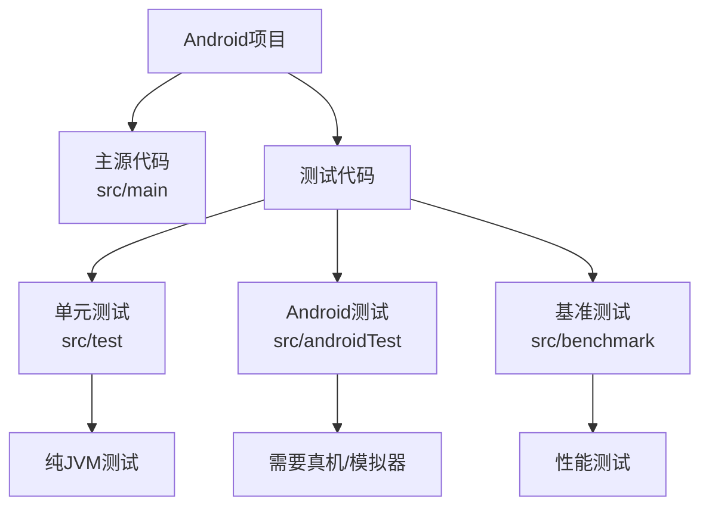
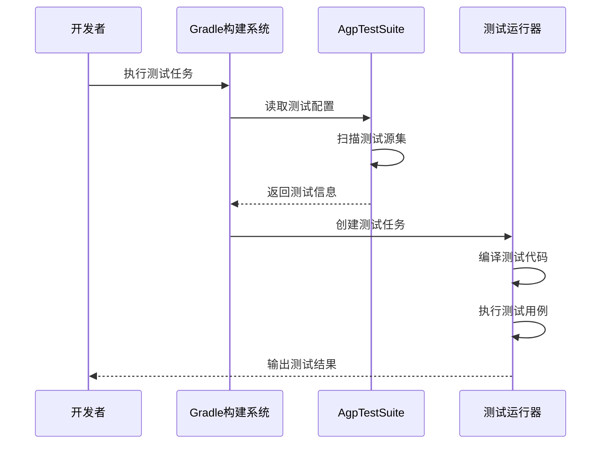

# 21.1.61 AgpTestSuite

夜已经很深了。

银河的光带静静地横亘在头顶，从东边的地平线一直延伸到西边的山脊。露水在草叶上凝结成细小的珠子，每一颗都倒映着星光，仿佛大地也在默默记录着星空的秘密。帐篷外围的防风灯散发出暖黄色的光晕，在凉爽的夏夜里划出一圈温馨的小天地。

四个女孩裹着各自的毯子，围坐在防风灯旁。黛琳刚才讲的AdbOptions让洛芙的大脑皮层微微发麻——installTimeout、jdwTrace、连接选项，这些概念在她脑海里打着转，像一群飞舞的萤火虫。

“所以，”洛芙揉了揉眼睛，声音里带着一丝困倦，“这些ADB选项……到底有什么用啊？感觉好抽象。”

黛琳没有直接回答。她从毯子里伸出手，从身边的背包里掏出一个蓝色的文件夹——那是一个文件袋大小的高级包装，上面印着"Test Suite"几个烫银大字。

“想知道测试怎么‘组织’起来吗？”黛琳的嘴角浮起一丝微笑，“今天我们来讲一个更宏观的概念。”

伊莎好奇地凑过去：“这是什么？又是什么新的魔法道具？”

“这个呀，”黛琳把文件夹放在地上，轻轻拍了拍它的封面，“它叫AgpTestSuite——测试套件管理器。在Android构建系统里，它是专门负责把各种测试整合在一起的‘大管家’。”

“测试套件？”洛芙眨了眨眼，“就是……把我们写的那些单元测试整合起来？”

“对，”希尔不知道什么时候已经把笔记本电脑放在了膝盖上，屏幕的蓝光映照着她跃跃欲试的脸庞，“就是把你写的单元测试、UI测试、集成测试，按类型分开又能统一管理的东西。就像我们露营的时候，炊具、食材、防潮垫分别装在不同的袋子里，但最后都放在一个大背包里方便携带。”

洛斯似懂非懂地点点头。她想起在露营时，希尔教她整理背包的场景——每一次把东西分门别类地装好，找起来就方便多了。

“那这个AgpTestSuite……是做什么的呢？”洛芙问道。

黛琳指了指地上的文件夹：“你可以把它想象成一个‘测试收纳盒’。它负责告诉你：有哪些测试类型、每种测试的源代码在哪里、测试结果要输出到哪里。”

---

## 露营故事：测试收纳盒的魔法

伊莎忽然轻声笑了：“收纳盒……听起来好像露营时的整理箱。”

“对！”黛琳眼睛一亮，“如果我们把整个Android项目想象成一个露营基地，那AgpTestSuite就是那个帮我们把各种测试分门别类整理好的整理箱。”

她站起身，捡起一根细长的树枝，在地面上画了起来：

“你们看，这是一个典型的Android项目里的测试结构。”



“主代码是我们日常要用的功能，测试代码是验证这些功能是否正确的‘试金石’，”黛琳解释道，“AgpTestSuite的任务，就是把这个测试过程自动化、标准化，而且还能让你配置每种测试的特性。”

洛芙看着图，若有所思：“那……AgpTestSuite是怎么知道要运行哪些测试的？”

“问得好，”黛琳点点头，“这就要涉及到测试源集的概念了。AgpTestSuite会读取项目的测试源代码目录——比如你把单元测试放在src/test目录，把Android测试放在src/androidTest目录——然后根据这些目录来配置对应的测试任务。”

---

## 深入理解：AgpTestSuite的接口设计

希尔把笔记本转过来，屏幕上显示着AgpTestSuite接口的简化定义：

```kotlin
/**
 * AgpTestSuite - Android Gradle Plugin的测试套件配置接口
 * 
 * 用于配置和管理Android项目中的各类测试套件
 * @since AGP 8.0+
 */
interface AgpTestSuite {
    
    // 获取测试套件名称
    fun getName(): String
    
    // 配置测试源集
    fun getSources(): TestSourceSet
    
    // 配置测试类型
    fun getType(): TestType
    
    // 配置测试任务
    fun getTask(): TaskProvider<out Test>
    
    // 设置是否启用该测试套件
    fun enable(enabled: Boolean)
    
    // 配置测试选项
    fun getOptions(): TestOptions
}
```

“哇……”洛芙看着这些接口定义，“感觉好专业的样子。”

“这些接口是给Gradle构建系统用的，”黛琳解释道，“作为开发者，你更常用的是在build.gradle里配置这些属性。让我给你展示一下实际的使用方式。”

---

## 实战演练：在项目中配置AgpTestSuite

希尔在笔记本上敲了几行代码，然后转过来给她们看：

```kotlin
android {
    // 配置测试套件
    testOptions {
        unitTests {
            // 启用单元测试
            enableUnitTest = true
            
            // 配置JUnit4作为测试框架
            testFramework = TestFramework.JUNIT4
            
            // 配置测试结果输出
            resultsDir = file("build/test-results/unitTests")
        }
        
        instrumentationTests {
            // 配置Android测试
            enableAndroidTest = true
            
            // 设置默认测试设备
            defaultDevice {
                apiLevel = 34
                screenDensity = 480
            }
        }
    }
}
```

“对了！”希尔兴奋地说，“这个testOptions就是AgpTestSuite在Gradle DSL里的实际应用。你们看，我们可以分别配置单元测试和Android测试的行为。”

洛芙看着代码：“哦……原来是这样。那除了这些，还有什么其他的配置呢？”

黛琳又在白板上补充了几个要点：“还有几个比较重要的概念——”

“第一个是TestType。测试类型决定了测试运行的环境。比如单元测试（UNIT_TEST）只需要JVM，而Android测试（INSTRUMENTATION_TEST）需要真机或模拟器。”

伊莎歪着头：“那……是不是就像我们在山里露营和在家里露营的区别？环境不一样，需要准备的东西也不一样？”

“对，这个比喻很贴切！”黛琳笑着说，“UNIT_TEST就像在自家院子里测试，不需要太多设备；而INSTRUMENTATION_TEST就像要去山里露营，需要带上帐篷、炊具等等。”

“还有吗？”洛芙又问。

“还有TestSourceSet，”黛琳继续说，“它定义了测试源代码的位置。比如你可以在src/test/java里放单元测试，在src/androidTest/java里放Android测试。AgpTestSuite会自动识别这些目录结构。”

---

## 可视化：AgpTestSuite的工作流程

黛琳拿起白板笔，在白板上画了一个完整的流程图：



“整个流程是这样的，”黛琳指着图解释道，“当你运行测试任务时，Gradle会先读取AgpTestSuite的配置，然后扫描对应的测试源集，最后创建并执行测试任务。”

洛芙若有所思地点点头：“原来测试是这样一步一步跑起来的呀……”

---

## 反模式与最佳实践

黛琳忽然表情变得认真起来：“对了，说到测试配置，有几个常见的错误一定要避免。”

“第一，”她竖起一根手指，“不要把单元测试和Android测试混在一起放。有些开发者为了省事，把需要Android环境的测试放在了单元测试目录里，结果运行时各种找不到类的错误。”

伊莎吐了吐舌头：“就像把生肉和熟食放在一起，会串味的！”

“第二，”黛琳继续说，“不要忘记配置测试超时时间。如果某个测试卡住了，整个构建就会卡住。”

希尔补充道：“还有第三点——一定要设置合理的测试结果目录，方便后续查看测试报告。我见过有人忘记配置，结果测试失败时找不到日志。”

洛芙认真地记了下来：“嗯，这些坑我一定会注意的！”

---

## 代码对比：旧写法vs新写法

希尔把笔记本转过来，屏幕上显示着两种不同的测试配置方式：

```kotlin
// ❌ 旧写法（AGP 7.x及之前）
android {
    defaultConfig {
        testInstrumentationRunner = "androidx.test.runner.AndroidJUnitRunner"
    }
    
    testOptions {
        unitTests {
            includeAndroidResources = false
        }
    }
}

// ✅ 新写法（AGP 8.0+）
android {
    testOptions {
        testSuites {
            // 配置单元测试套件
            register("unitTest") {
                testType.set(TestType.UNIT_TEST)
                sources.set(srcDir("src/test"))
                dependencies {
                    // 添加测试依赖
                    implementation("junit:junit:4.13.2")
                }
            }
            
            // 配置Android测试套件
            register("androidTest") {
                testType.set(TestType.INSTRUMENTATION_TEST)
                sources.set(srcDir("src/androidTest"))
                dependencies {
                    implementation("androidx.test:runner:1.5.2")
                    implementation("androidx.test:espresso-core:3.5.1")
                }
            }
        }
    }
}
```

“新写法更灵活，”黛琳点评道，“你可以通过register()方法创建自定义的测试套件，然后分别配置每个套件的源代码、依赖和运行环境。”

洛芙看着对比：“原来升级到AGP 8.0以后，测试配置的方式变化这么大呀！”

---

## 深入理解：TestSourceSet的配置

黛琳翻开小笔记本，翻到新的一页：“我再给你们讲讲TestSourceSet，这是管理测试源代码的核心。”

```kotlin
/**
 * TestSourceSet - 测试源代码集配置接口
 * 
 * 定义测试代码的位置、资源、资产等
 */
interface TestSourceSet {
    
    // 获取Java源代码目录
    fun getJava(): SourceDirectorySet
    
    // 获取Kotlin源代码目录
    fun getKotlin(): SourceDirectorySet
    
    // 获取Android资源目录
    fun getResources(): SourceDirectorySet
    
    // 获取测试依赖
    fun getDependencies(): DependencyHandler
}
```

“每个测试套件都有自己的源代码集，”黛琳解释道，“你可以分别为单元测试和Android测试配置不同的源代码目录、资源目录，甚至可以添加不同的依赖。”

洛芙好奇地问：“那……如果我想在单元测试里用一些库，该怎么办？”

“这个简单，”希尔又在笔记本上敲了起来，“直接通过testImplementation添加依赖就可以了：”

```kotlin
dependencies {
    // 测试代码的依赖（只在测试时有效）
    testImplementation("org.mockito:mockito-core:5.3.1")
    testImplementation("org.jetbrains.kotlinx:kotlinx-coroutines-test:1.7.3")
    
    // Android测试的依赖
    androidTestImplementation("androidx.test:runner:1.5.2")
    androidTestImplementation("androidx.test:espresso-core:3.5.1")
}
```

“原来是这样！”洛芙眼睛一亮，“这些依赖只在测试时用到，不会影响正式的应用代码。”

---

## 实践建议：如何组织项目的测试

黛琳把树枝放下来，拍了拍手上的尘土：“最后给大家几个实践建议——”

“第一，保持测试目录结构清晰。单元测试放src/test，Android测试放src/androidTest，基准测试放src/benchmark。这样AgpTestSuite能正确识别每种测试。”

“第二，为每个测试套件配置明确的目标。比如单元测试验证业务逻辑，Android测试验证UI交互，基准测试验证性能指标。”

“第三，定期运行测试，不要等到发布前才跑。建议配置CI/CD流水线，每次代码提交都自动运行测试。”

伊莎轻声总结：“就像我们每次露营结束后都要整理装备、清理垃圾一样，测试也要养成经常整理的习惯呢。”

“对！”黛琳笑着说，“而且自动化测试就像有一个不知疲倦的助手，帮你24小时盯着代码质量。”

---

夜风轻轻吹过，把防风灯的火苗吹得摇摇晃晃。洛芙裹紧了毯子，心里默默记下了这些要点。

“黛琳，”洛芙忽然开口，“那……如果我想进一步配置测试套件的依赖关系，该怎么做呢？”

黛琳微微一笑：“这个啊，我们下次再讲。先休息一下吧，银河都已经移到西边去了。”

洛芙抬起头，果然看到银河的光带不知什么时候已经偏向西边的天空了。露水越来越重，草叶上凝结的水珠在灯光下闪闪发亮。

四个女孩相视一笑，收拾起白板和笔记本，钻进了各自的帐篷。远处传来几声虫鸣，像是夏夜最后的歌声。

---

> 本章介绍了Android Gradle Plugin中的AgpTestSuite接口，它是用于配置和管理Android项目中测试套件的核心组件。通过理解TestSourceSet、TestType和测试配置选项，开发者可以更灵活地组织和管理项目中的各类测试。

> 学习建议：动手创建一个小项目，分别配置单元测试和Android测试，体会AgpTestSuite的工作方式。注意观察不同测试类型的运行环境和配置差异。

---

## 洛芙的小小日记本

今天学会了AgpTestSuite！原来测试也可以像整理行李一样分门别类——单元测试、Android测试、基准测试，各有各的“收纳盒”。希尔说的对，测试不只是找bug，更是给代码买保险。黛琳说的对，要养成经常跑测试的习惯，就像每次露营结束都要整理装备一样。

---

## 今日关键词

**AgpTestSuite**：Android Gradle Plugin的测试套件配置接口，用于统一管理项目中的各类测试（单元测试、Android测试、基准测试等）。

**TestSourceSet**：测试源代码集配置接口，定义测试代码的位置、资源、依赖等。

**TestType**：测试类型枚举，包括UNIT_TEST（单元测试）和INSTRUMENTATION_TEST（Instrumentation测试）。

**单元测试**：仅需JVM即可运行的测试，不需要Android设备或模拟器。

**Android测试**：需要真机或模拟器运行的测试，用于测试Android组件和UI交互。

**基准测试**：用于测试代码性能指标的测试类型。

**testImplementation**：Gradle中仅在测试代码里有效的依赖配置方式。

**instrumentationRunner**：用于指定Android测试的测试运行器。
