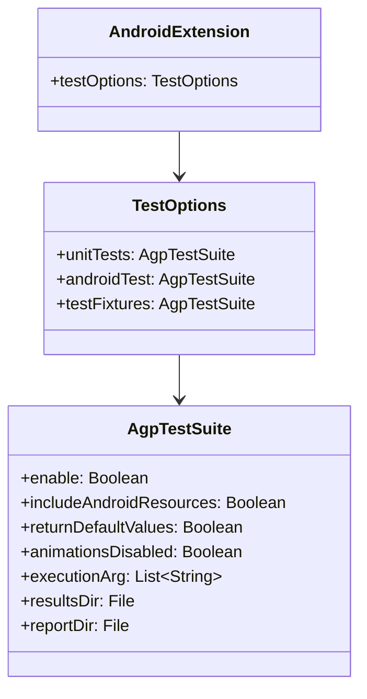

# 21.1.61 AgpTestSuite

蝉鸣声不知什么时候渐渐弱了下去，取而代之的是夜风吹过草叶的沙沙声。洛芙裹紧了身上的薄毯，头顶的银河已经悄咪咪地移到了西边的天空，露水开始在草叶尖上凝结。

“刚才讲的AdbOptions都记下了吗？”黛琳轻声问道，手里的白板笔在月光下闪着微光。

“记下了！”洛芙点点头，“installTimeout设置安装超时，jdwTrace是JDWP调试跟踪，还有timeOut用于通用操作超时……对吧？”

“很好。”黛琳微微笑道，“那今晚我们再来一个新朋友——AgpTestSuite。”

“测试套件？”希尔立刻来了精神，凑近问道，“是那个用来配置单元测试和仪器测试的DSL类型吗？”

“没错。”黛琳点点头，从背包里掏出一个精致的金属盒子，“看，这个叫AgpTestSuite——它是我们露营团的测试指挥官。”

“又是指挥官？”洛芙好奇地接过盒子，仔细端详着，“它能做什么？”

“简单说，”黛琳在白板上画了一个简单的示意图，“在我们开发App的过程中，需要各种测试来确保代码质量。单元测试（Unit Test）验证单个函数或类的行为，仪器测试（Instrumented Test）在真实设备或模拟器上运行，测试App与系统的交互……”

“就像我们露营时要检查帐篷是否牢固（单元测试），还要在山里走一圈看看装备是否真的好用（仪器测试）？”伊莎温柔地补充道。

“对！就是这个意思。”黛琳笑道，“而AgpTestSuite就是统一管理这些测试的配置中心。”

洛芙打开盒子，里面整整齐齐地排列着几个小隔间，每个隔间上都标着不同的标签。

“这个是unitTest（单元测试），”黛琳指着一个隔间说，“这个是androidTest（仪器测试），还有testFixtures（测试固件）……”

“测试固件？”洛芙问道。

“测试固件是辅助测试的代码，比如测试用的数据生成器、Mock对象工厂等。”希尔解释道，“就像我们野炊时的食材处理台，虽然不是正餐，但准备过程离不开它。”

黛琳点点头，继续说道：“AgpTestSuite提供了统一的接口来配置这些测试。下面我们来看看它的核心方法。”

她把白板翻到新的一页，写下了几行代码：

```kotlin
android {
    testOptions {
        unitTests {
            // 配置单元测试
            includeAndroidResources = true
            returnDefaultValues = true
        }
    }
}
```

“等等，”洛芙突然发现问题，“这个testOptions是在android {}块里面的吗？”

“对，这是Android Gradle Plugin提供的测试配置入口。”黛琳解释道，“AgpTestSuite实际上是通过android.testOptions来访问的。AgpTestSuite是一个DSL类型，它定义了如何配置测试套件的各种属性和方法。”

“那这个includeAndroidResources是什么意思？”洛芙指着代码问道。

“它决定了单元测试是否包含Android资源。”黛琳耐心地解释，“当设置为true时，单元测试可以访问android.R资源，比如字符串、颜色等。这对于测试依赖Android资源的代码很有用。”

“那returnDefaultValues呢？”

“这个属性控制当方法返回null或基本类型默认值时的行为。设为true时，未初始化的字段会返回Java默认值（如0、false、null），便于测试。”

洛芙似懂非懂地点点头。希尔已经打开了笔记本，开始敲代码。

“我们来实际配置一个测试套件吧！”希尔兴奋地说。

```kotlin
android {
    defaultConfig {
        // 配置仪器测试的目标设备
        testDeviceId("androidtv")
    }
    
    testOptions {
        unitTests {
            // 单元测试配置
            includeAndroidResources = true
            returnDefaultValues = false
        }
        
        // 仪器测试结果目录
        resultsDir = file("build/test-results")
    }
}
```

“这个testDeviceId是做什么的？”洛芙问道。

“它是用来指定仪器测试运行的目标设备类型的。”黛琳解释道，“比如androidtv表示Android TV设备，wear表示可穿戴设备，phone表示手机等。AGK会根据这个配置选择合适的默认设备来运行测试。”

“原来如此！”洛芙恍然大悟，“那resultsDir就是测试结果输出的目录？”

“对。测试报告会生成在这个目录里，可以用Android Studio查看，也可以被CI/CD系统收集。”

伊莎轻轻拨了拨耳边的发丝，柔声说道：“就像是露营结束后，我们把今天收集的柴火数量、捕获的萤火虫数量都记录下来，方便以后查看呢。”

“对！就是这个道理。”希尔笑道，“测试报告就是我们的'露营日记'。”

黛琳又把白板翻了一页，画出了一个结构图：

```mermaid
graph TD
    A[android {}] --> B[testOptions {}]
    B --> C[unitTests: AgpTestSuite]
    B --> D[androidTest: AgpTestSuite]
    B --> E[testFixtures: AgpTestSuite]
    C --> C1[includeAndroidResources]
    C --> C2[returnDefaultValues]
    D --> D1[animationsDisabled]
    D --> D2[executionArg]
    E --> E1[enable]
    
    style A fill:#e1f5fe
    style B fill:#e1f5fe
    style C fill:#fff3e0
    style D fill:#e8f5e9
    style E fill:#f3e5f5
```

“这就是AgpTestSuite在构建脚本中的位置和结构，”黛琳讲解道，“android {}块是顶层配置，testOptions {}是测试配置入口，而unitTests、androidTest、testFixtures都是AgpTestSuite类型的实例。”

洛芙仔细看着图，突然问道：“那如果我想禁用某个测试套件怎么办？”

“好问题！”黛琳笑道，“AgpTestSuite提供了enable()方法来控制是否启用测试套件。”

她写下了一段代码：

```kotlin
android {
    testOptions {
        unitTests {
            // 禁用单元测试
            enable = false
        }
        
        androidTest {
            // 仪器测试配置
            animationsDisabled = true
            executionArg("--no-window-animation")
        }
    }
}
```

“animationsDisabled = true？”洛芙注意到这个属性。

“它用来禁用仪器测试时的窗口动画，”黛琳解释道，“这可以让测试运行更快、更稳定，因为动画有时会导致测试时序问题。”

“ExecutionArg呢？”

“那是传递给测试运行器的额外参数。”希尔补充道，“比如我们可以用它来传递JVM参数、测试筛选器等。”

洛芙若有所思地点点头：“那如果我想运行特定的测试类或测试方法呢？”

“那就需要用到testInstrumentationRunner了，”黛琳说道，“不过那是另一个话题——runners的配置。AgpTestSuite主要负责测试套件的基础配置，比如是否启用、动画、资源访问等。”

她接着讲道：“我们来看一个更完整的配置示例，展示如何在实际项目中使用AgpTestSuite。”

```kotlin
android {
    defaultConfig {
        // 仪器测试的Runner配置
        testInstrumentationRunner = "androidx.test.runner.AndroidJUnitRunner"
        
        // 启用测试覆盖
        testCoverageEnabled = true
    }
    
    testOptions {
        unitTests {
            // 允许访问Android资源
            includeAndroidResources = true
            // 返回默认值
            returnDefaultValues = true
            // 启用
            enable = true
        }
        
        androidTest {
            // 禁用动画以提高测试稳定性
            animationsDisabled = true
            // 传递额外参数
            executionArg("--verbose")
            executionArg("--no-analytics")
            // 结果目录
            resultsDir = file("${project.buildDir}/test-results/androidTest")
            // 报告目录
            reportDir = file("${project.buildDir}/reports/androidTests")
        }
        
        testFixtures {
            // 启用测试固件
            enable = true
        }
    }
}
```

“好复杂！”洛芙感叹道，“但感觉好强大啊。”

“这些都是为了让测试更加可控、高效。”黛琳温柔地说，“你现在不需要记住每一个细节，重要的是理解AgpTestSuite能做什么——它是我们配置测试套件的统一入口。”

伊莎轻轻拍了拍洛芙的肩膀：“就像露营时，我们不需要记住每一件装备的具体使用方法，只需要知道什么场景用什么装备就够了。”

“对！”洛芙眼睛亮了起来，“AgpTestSuite就是那个告诉我们'什么测试场景用什么配置'的工具！”

黛琳欣慰地笑了：“没错。那么，让我们来看看一个常见的反模式和正确的做法。”

她在白板上写下了两段代码：

**反模式（不推荐）：**

```kotlin
android {
    // 错误：直接修改testOptions的嵌套属性，没有明确的类型
    testOptions {
        // 没有使用AgpTestSuite类型的明确配置
        includeAndroidResources = true  // 不知道属于哪个测试套件
    }
}
```

**正确做法：**

```kotlin
android {
    // 正确：通过明确的测试套件名称配置
    testOptions {
        unitTests {
            includeAndroidResources = true
            returnDefaultValues = true
        }
        
        androidTest {
            animationsDisabled = true
        }
    }
}
```

“第一个例子有什么问题吗？”洛芙问道。

“问题在于属性位置不明确，”黛琳解释道，“在android.testOptions块中直接设置的属性，可能被AGP解释为不同的默认测试套件，容易造成混淆。通过unitTests {}、androidTest {}明确指定测试套件，代码更清晰，也更容易维护。”

希尔补充道：“而且，当你需要为不同类型的测试设置不同配置时，明确指定套件类型是必须的。比如单元测试需要includeAndroidResources，但仪器测试不需要这个属性。”

洛芙点头表示理解。她抬头看了看天空，银河已经完全移到了西边，星星开始变得稀疏。

“时候不早了呢。”伊莎轻声说道。

“我们今天就到这里吧，”黛琳收拾着白板，“AgpTestSuite是一个很重要的概念——它帮助我们统一管理各种测试套件的配置。掌握它，你们就能更好地控制测试行为，提高测试效率。”

“谢谢黛琳！”洛芙裹紧毯子，“今天又学到了新东西！”

“对了，”希尔突然想起什么，“明天我们可能会讲到AgpTestSuite的依赖配置——AgpTestSuiteDependency，到时候会讲到测试依赖的管理哦！”

“期待！”洛芙笑道。

夜风轻轻吹过，草叶上的露珠在星光下闪闪发亮。四个女孩收拾好东西，准备休息了。

---

## 专业技术总结

> **AgpTestSuite** 是 Android Gradle Plugin 提供的测试套件配置 DSL 类型，用于统一配置单元测试（unitTests）、仪器测试（androidTest）和测试固件（testFixtures）的各种属性和行为。

#### 结构图



#### 核心机制与属性

| 属性 | 类型 | 说明 |
|------|------|------|
| enable | Boolean | 是否启用该测试套件 |
| includeAndroidResources | Boolean | 单元测试是否包含Android资源 |
| returnDefaultValues | Boolean | 未初始化字段是否返回默认值 |
| animationsDisabled | Boolean | 仪器测试是否禁用窗口动画 |
| executionArg | List | 传递给测试运行器的额外参数 |
| resultsDir | File | 测试结果输出目录 |
| reportDir | File | 测试报告输出目录 |

#### 反模式与陷阱

1. **属性位置错误**：在testOptions块中直接设置属性，而不是在具体的测试套件（unitTests/androidTest）块中设置，导致配置不明确。
2. **混淆单元测试和仪器测试配置**：单元测试运行在JVM上，不需要animationsDisabled等属性；仪器测试需要真实设备或模拟器，配置项不同。
3. **忘记启用测试套件**：默认enable = true，但明确设置enable = false会完全禁用该测试套件，导致测试不运行。

#### 设计哲学

AgpTestSuite体现了Android Gradle Plugin的**测试分层配置**理念：
- 单元测试（unitTests）在JVM上运行，不需要真实Android环境，但可以通过includeAndroidResources模拟访问资源
- 仪器测试（androidTest）在真实设备或模拟器上运行，更接近用户真实场景
- 测试固件（testFixtures）是可复用的测试辅助代码

通过统一的DSL接口，开发者可以灵活配置不同类型测试的行为，平衡测试速度与覆盖度。

---

> 学习建议：建议在实际项目中尝试配置AgpTestSuite，先从简单的单元测试配置开始，逐步掌握仪器测试的高级配置。注意区分单元测试和仪器测试的适用场景。

---

## 洛芙的小小日记本

今天黛琳讲了AgpTestSuite——测试套件配置！原来我们的App有这么多测试方式，单元测试就像检查帐篷是否牢固，仪器测试就像去山里走一圈看看装备好不好用。希尔说明天要讲测试依赖管理，期待！

---

## 今日关键词

- **AgpTestSuite**: Android Gradle Plugin的测试套件配置DSL类型，用于配置unitTests、androidTest、testFixtures
- **单元测试 (Unit Test)**: 在JVM上运行的测试，不依赖真实Android设备，用于测试单个类或方法的行为
- **仪器测试 (Instrumented Test)**: 在真实设备或模拟器上运行的测试，测试App与Android系统的交互
- **测试固件 (Test Fixtures)**: 辅助测试的代码，如测试数据生成器、Mock对象工厂等
- **includeAndroidResources**: AgpTestSuite属性，控制单元测试是否包含Android资源
- **returnDefaultValues**: AgpTestSuite属性，控制未初始化字段的返回值行为
- **animationsDisabled**: AgpTestSuite属性，控制仪器测试是否禁用窗口动画
- **executionArg**: AgpTestSuite属性，传递给测试运行器的额外参数
- **testInstrumentationRunner**: 用于指定仪器测试的测试Runner类
- **AndroidJUnitRunner**: Google官方提供的仪器测试Runner
