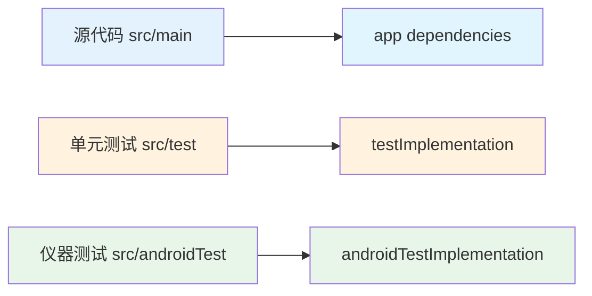
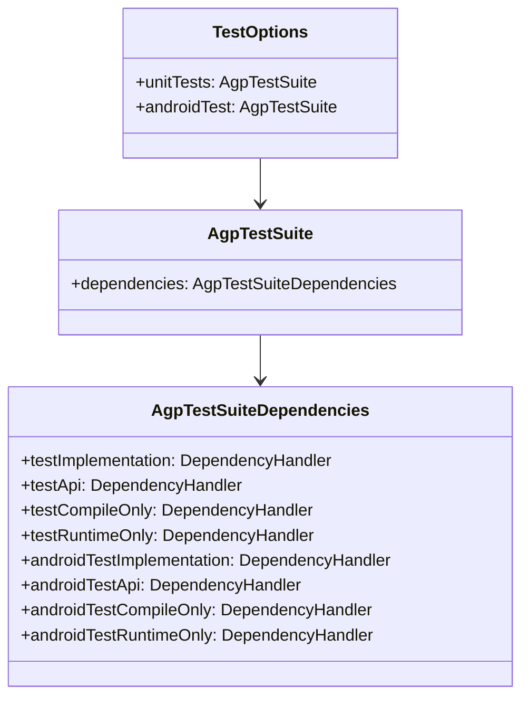
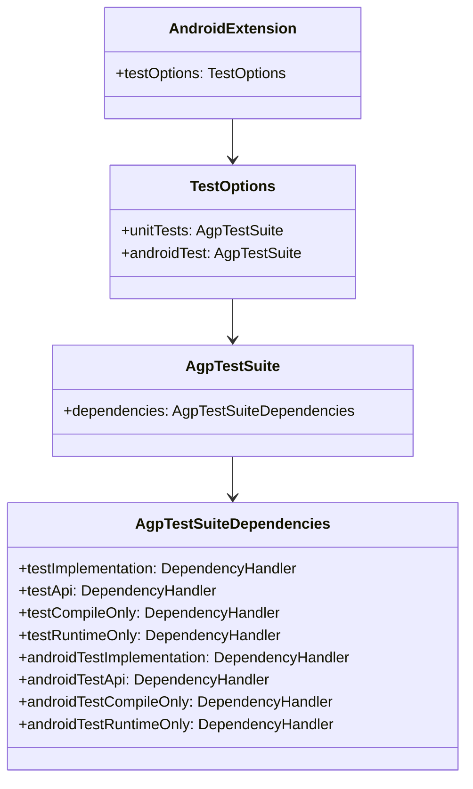

# 21.1.62 AgpTestSuiteDependencies

夜更深了。

洛芙抬头看了看天，银河已经完全偏到了西边，像一条璀璨的河流正在缓缓流向地平线。草叶上的露水越来越多，每一颗都映着星光，像 tiny 的水晶珠子。

“刚才的AgpTestSuite我都记下了！”洛芙小声说道，“unitTests、androidTest、testFixtures的配置都明白了。”

“很好，”黛琳微微笑道，“那今天我们要讲它的好伙伴——AgpTestSuiteDependencies。”

“测试依赖？”希尔立刻凑了过来，眼睛发亮，“是不是就是我们在build.gradle里写的那种testImplementation、androidTestImplementation？”

“对，就是这个！”黛琳点点头，从背包里掏出一个像是试剂瓶的东西，“看，这个小瓶子就是AgpTestSuiteDependencies——测试依赖管理器。”

洛芙接过瓶子仔细端详，瓶子里装着不同颜色的小球，每种颜色都标注着不同的标签。

“这些小球就是各种测试库和依赖，”黛琳解释道，“就好比露营时我们带的各种工具——UNIT TEST的工具放在一个格子里，ANDROID TEST的工具放在另一个格子里。”

“原来是这样！”洛芙恍然大悟，“那这些不同的颜色就是不同的依赖类型？”

“没错！”黛琳把白板翻到新的一页，画出了一个结构图：

```mermaid
graph TD
    A[android {}] --> B[testOptions {}]
    B --> C[unitTests {}]
    B --> D[androidTest {}]
    C --> C1[dependencies]
    D --> D1[dependencies]
    C1 --> C2[testImplementation]
    C1 --> C3[testApi]
    C1 --> C4[testCompileOnly]
    D1 --> D5[androidTestImplementation]
    D1 --> D6[androidTestApi]
    D1 --> D7[androidTestCompileOnly]
    
    style A fill:#e1f5fe
    style B fill:#e1f5fe
    style C fill:#fff3e0
    style D fill:#e8f5e9
    style C1 fill:#f3e5f5
    style D1 fill:#f3e5f5
```

“这个图展示了测试依赖的作用域，”黛琳讲解道，“unitTests的dependencies用于单元测试，androidTest的dependencies用于仪器测试。它们各自有testImplementation、testApi、testCompileOnly等配置方式。”

“这些词好眼熟！”洛芙说道，“是不是和我们平时写dependencies一样？”

“对，原理是一样的，”黛琳解释道，“但这里的作用域更细致。testImplementation相当于只在该测试源集内可见，testApi则允许传递性依赖被其他模块使用，testCompileOnly则只用于编译，不包含在运行时的classpath里。”

伊莎轻轻拨了拨耳边的发丝，柔声说道：“就像是露营时，我们把食物分开放——有的可以直接吃（testImplementation），有的可以借给同伴（testApi），有的只是用来烹饪的容器（testCompileOnly）。”

“这个比喻太贴切了！”洛芙笑道。

希尔已经打开了笔记本，开始敲代码：“我们来看一个具体的例子！”

```kotlin
android {
    testOptions {
        unitTests {
            dependencies {
                // JUnit 4 测试框架
                testImplementation("junit:junit:4.13.2")
                
                // Mockito 用于模拟对象
                testImplementation("org.mockito:mockito-core:5.7.0")
                
                // Kotlin 测试支持
                testImplementation("org.jetbrains.kotlin:kotlin-test-junit")
                
                // 只用于编译的依赖（不包含在运行时）
                testCompileOnly("org.jetbrains.kotlin:kotlin-stdlib")
                
                // 允许依赖传递（其他模块也可使用）
                testApi("com.google.truth:truth:1.1.5")
            }
        }
        
        androidTest {
            dependencies {
                // AndroidX Test 库
                androidTestImplementation("androidx.test:core:1.5.0")
                
                // Espresso 测试框架
                androidTestImplementation("androidx.test.espresso:espresso-core:3.5.1")
                
                // JUnit 测试运行器
                androidTestImplementation("androidx.test.ext:junit:1.1.5")
                
                // Robolectric 用于仪器测试模拟
                androidTestImplementation("org.robolectric:robolectric:4.11.1")
            }
        }
    }
}
```

“好多依赖啊！”洛芙感叹道，“感觉比我平时的app dependencies还复杂。”

“测试依赖确实更复杂一些，”黛琳耐心解释道，“因为测试需要更多的工具来模拟、验证、断言。但核心原理是一样的——你需要什么工具，就加什么依赖。”

洛芙似懂非懂地点点头，突然问道：“那testImplementation和androidTestImplementation有什么区别？我们平时好像只写implementation？”

“这是个好问题！”黛琳在白板上画了一个简单的对比图：



“平时我们写的implementation是给app源代码用的，”黛琳解释道，“testImplementation是专门给单元测试用的，androidTestImplementation是专门给仪器测试用的。它们的作用域是分开的，不会互相污染。”

“就像我们露营时的食物，”伊莎温柔地补充道，“生火的木炭是露营用的，锅碗瓢盆是做饭用的，各自独立，不会混在一起。”

“对！”洛芙眼睛亮了起来，“那testImplementation是不是只能在我的测试代码里用，不能在app代码里用？”

“没错，”黛琳点头道，“这就是依赖隔离——测试依赖不会进入你的app主代码，避免把测试工具打包进正式发布。”

希尔补充道：“而且，这样做可以让你的测试代码更干净——只依赖测试需要的库，不会被app的其他依赖干扰。”

洛芙若有所思地点点头，又问道：“那我怎么看有哪些测试依赖已经加进去了？”

“好问题！”黛琳笑道，“我们可以用gradle dependencies命令来查看，或者在Android Studio的Project窗口里查看External Libraries。”

她接着讲道：“我们来看一个更完整的例子，展示如何根据不同的测试场景选择合适的依赖。”

```kotlin
android {
    // 应用层依赖
    dependencies {
        implementation("androidx.core:core-ktx:1.12.0")
        implementation("androidx.appcompat:appcompat:1.6.1")
    }
    
    testOptions {
        unitTests {
            dependencies {
                // 基础测试框架
                testImplementation("junit:junit:4.13.2")
                
                // Kotlin 测试扩展
                testImplementation("org.jetbrains.kotlin:kotlin-test:1.9.20")
                testImplementation("org.jetbrains.kotlin:kotlin-test-junit:1.9.20")
                
                // 模拟框架
                testImplementation("org.mockito:mockito-core:5.7.0")
                testImplementation("org.mockito.kotlin:mockito-kotlin:5.1.0")
                
                // 断言库
                testImplementation("com.google.truth:truth:1.1.5")
                testImplementation("assertk:assertk:0.27.0")
                
                // Kotlin 协程测试
                testImplementation("org.jetbrains.kotlinx:kotlinx-coroutines-test:1.7.3")
                
                // 只编译不运行
                testCompileOnly("org.jetbrains.kotlin:kotlin-stdlib-jdk8")
            }
        }
        
        androidTest {
            dependencies {
                // Android 测试基础设施
                androidTestImplementation("androidx.test:core-ktx:1.5.0")
                androidTestImplementation("androidx.test:runner:1.5.2")
                androidTestImplementation("androidx.test:rules:1.5.0")
                
                // Espresso 测试框架
                androidTestImplementation("androidx.test.espresso:espresso-core:3.5.1")
                androidTestImplementation("androidx.test.espresso:espresso-intents:3.5.1")
                androidTestImplementation("androidx.test.espresso:espresso-contrib:3.5.1")
                
                // JUnit 4 扩展
                androidTestImplementation("androidx.test.ext:junit:1.1.5")
                androidTestImplementation("androidx.test.ext:junit-ktx:1.1.5")
                
                // 断言库
                androidTestImplementation("com.google.truth:truth:1.1.5")
                
                // UI 测试
                androidTestImplementation("androidx.test.uiautomator:uiautomator:2.2.0")
                
                // Mockito Android
                androidTestImplementation("org.mockito:mockito-android:5.7.0")
            }
        }
    }
}
```

“哇，好多库！”洛芙看得眼花缭乱，“这些分别都是做什么的？”

“让我来给你解释一下，”黛琳指着代码一个个说道，“JUnit是我们的测试基础框架，就像露营时的帐篷——所有测试都基于它。Mockito是用来创建模拟对象的，就像我们野炊时的假食物，用来练习烹饪技术。Truth和AssertK是断言库，用来验证测试结果是否正确……”

“Espresso呢？”洛芙问道。

"Espresso是Google官方的UI测试框架，”黛琳解释道，“它可以模拟用户操作——点击、滑动、输入文字等，就像有一个看不见的手在操作你的app。”

“那androidTestImplementation和testImplementation可以同时用吗？”洛芙又问。

“可以的！”希尔抢答道，“一个测试类如果放在src/test下，就用testImplementation；放在src/androidTest下，就用androidTestImplementation。它们是分开的，但可以同时存在。”

黛琳补充道：“有些库两种都需要，比如JUnit。但要注意，它们各自的作用域是独立的，不能混用。”

“我们来画一个完整的依赖关系图，”黛琳又在白板上画起来：



“这个图展示了AgpTestSuite和AgpTestSuiteDependencies的关系，”黛琳讲解道，“AgpTestSuite有一个dependencies属性，类型是AgpTestSuiteDependencies。我们通过它来配置测试依赖。”

洛芙仔细看着图，突然问道：“那如果我加了冲突的依赖怎么办？比如两个库都依赖了不同版本的同一个东西？”

“好问题！”黛琳的表情变得认真起来，“这是Gradle依赖管理的核心问题。我们可以用resolutionStrategy来解决冲突。”

她在白板上写下了解决方案：

```kotlin
android {
    testOptions {
        unitTests {
            dependencies {
                // 强制指定版本
                testImplementation("junit:junit:4.13.2") {
                    force = true
                }
                
                // 或者排除传递性依赖
                testImplementation("org.mockito:mockito-core:5.7.0") {
                    exclude group: "org.objenesis"
                }
            }
            
            // 配置依赖策略
            configurations.all {
                resolutionStrategy {
                    force "junit:junit:4.13.2"
                    force "org.jetbrains.kotlin:kotlin-stdlib:1.9.20"
                }
            }
        }
    }
}
```

“这个resolutionStrategy好强大！”洛芙感叹道。

“是呀，”黛琳微笑道，“Gradle的依赖管理非常灵活，可以处理各种复杂的场景。但我建议先让Gradle自动解决冲突，除非真的遇到问题再加手动配置。”

伊莎轻轻拍了拍洛芙的肩膀：“就像是露营时，我们先让团队自己协调分工，实在有冲突再出面调解。”

“对！”洛芙笑道，“能自动解决就不手动干预！”

黛琳又翻到一页：“我们来看一个反模式和正确的做法。”

**反模式（不推荐）：**

```kotlin
android {
    // 错误：在app的dependencies里添加测试依赖
    dependencies {
        implementation("junit:junit:4.13.2")  // 错误！测试依赖不应该在这里
        implementation("org.mockito:mockito-core:5.7.0")  // 错误！
    }
    
    testOptions {
        // 正确的地方
    }
}
```

**正确做法：**

```kotlin
android {
    // 应用层依赖
    dependencies {
        implementation("androidx.core:core-ktx:1.12.0")
    }
    
    testOptions {
        unitTests {
            // 测试依赖应该在这里
            dependencies {
                testImplementation("junit:junit:4.13.2")
                testImplementation("org.mockito:mockito-core:5.7.0")
            }
        }
        
        androidTest {
            dependencies {
                androidTestImplementation("androidx.test:core:1.5.0")
                androidTestImplementation("androidx.test.espresso:espresso-core:3.5.1")
            }
        }
    }
}
```

“第一个例子有什么问题吗？”洛芙问道。

“问题在于把测试依赖混入了app的dependencies，”黛琳解释道，“这样会把测试库打包进你的app——JUnit、Mockito这些库会出现在正式版里，不仅增加包体积，还可能引发兼容性问题。”

希尔补充道：“而且，app dependencies的作用域是运行时，测试依赖只在测试时需要。混在一起会让依赖图变得混乱，Gradle解析起来也更慢。”

洛芙点头表示理解。她抬头看了看天，东边已经开始泛起淡淡的青色——黎明快要到了。

“我们要不要休息一下？”伊莎轻声说道，“天快亮了。”

“我们今天就到这里吧，”黛琳收拾着白板，“AgpTestSuiteDependencies是一个很重要的概念——它帮助我们正确地管理测试依赖，让测试代码和app代码分离，保持项目的整洁和高效。”

“谢谢黛琳！”洛芙裹紧毯子，“今天又学到了新东西！原来测试依赖有这么多讲究！”

“对，”希尔打了个哈欠，“掌握了这些，你就能更好地组织你的测试代码了。晚安，洛芙！”

“晚安！”洛芙轻声回应道。

草叶上的露珠在黎明的微光中闪闪发亮，银河已经完全消失在地平线下了。新的一天即将开始。

---

## 专业技术总结

> **AgpTestSuiteDependencies** 是 Android Gradle Plugin 提供的测试依赖配置 DSL 类型，用于在 testOptions 块内配置单元测试（unitTests）和仪器测试（androidTest）的依赖管理。它支持 testImplementation、testApi、testCompileOnly、testRuntimeOnly 等多种依赖配置方式，实现测试代码与应用代码的依赖隔离。

#### 结构图



#### 核心属性与配置

| 属性 | 类型 | 说明 |
|------|------|------|
| testImplementation | DependencyHandler | 单元测试实现依赖，仅在测试时可见 |
| testApi | DependencyHandler | 单元测试API依赖，允许传递性依赖 |
| testCompileOnly | DependencyHandler | 单元测试编译时依赖，不包含在运行时 |
| testRuntimeOnly | DependencyHandler | 单元测试运行时依赖 |
| androidTestImplementation | DependencyHandler | 仪器测试实现依赖 |
| androidTestApi | DependencyHandler | 仪器测试API依赖 |
| androidTestCompileOnly | DependencyHandler | 仪器测试编译时依赖 |
| androidTestRuntimeOnly | DependencyHandler | 仪器测试运行时依赖 |

#### 反模式与陷阱

1. **在app dependencies中混入测试依赖**：将JUnit、Mockito等测试库放在app的dependencies块中，会把测试库打包进正式版本，增加包体积并可能引发兼容性问题。
2. **混淆单元测试和仪器测试依赖**：单元测试运行在JVM上，需要junit、mockito等；仪器测试运行在Android环境，需要androidx.test、espresso等。用错了会无法运行。
3. **忘记测试依赖的传递性**：testImplementation的依赖不会自动传递，testApi才会传递。如果需要让其他模块使用你的测试依赖，要用testApi。

#### 设计哲学

AgpTestSuiteDependencies体现了Android Gradle Plugin的**依赖隔离**理念：
- 测试代码和app代码使用完全独立的依赖作用域
- 单元测试和仪器测试各自有独立的依赖配置
- 通过不同的Implementation后缀（test vs androidTest）实现精确的依赖管理
- 支持Gradle的所有依赖管理特性（版本强制、排除、替换等）

这种设计确保测试工具不会污染生产代码，同时让开发者能够灵活配置测试环境。

---

> 学习建议：建议在实际项目中为单元测试和仪器测试分别配置依赖，先从JUnit和Espresso开始，逐步掌握各种测试框架的集成。注意区分不同Implementation的作用域，正确使用可以避免依赖冲突。

---

## 洛芙的小小日记本

今晚黛琳讲了AgpTestSuiteDependencies——测试依赖管理！原来测试依赖要放在专门的testOptions块里，不能和应用代码混在一起。unitTests用testImplementation，androidTest用androidTestImplementation，分得清清楚楚。伊莎说的对，就像露营时食物和工具要分开放一样！

---

## 今日关键词

- **AgpTestSuiteDependencies**: Android Gradle Plugin的测试依赖配置DSL类型
- **testImplementation**: 单元测试的实现依赖，仅在测试时可见
- **testApi**: 单元测试的API依赖，允许传递性依赖被其他模块使用
- **testCompileOnly**: 单元测试的编译时依赖，不包含在运行时classpath
- **androidTestImplementation**: 仪器测试的实现依赖
- **androidTestApi**: 仪器测试的API依赖
- **androidTestCompileOnly**: 仪器测试的编译时依赖
- **JUnit**: 最流行的Java单元测试框架
- **Mockito**: Java模拟对象框架，用于创建测试用的模拟对象
- **Espresso**: Google官方的Android UI测试框架
- **依赖隔离**: 测试依赖与应用依赖分离，避免测试库进入生产代码
- **resolutionStrategy**: Gradle的依赖版本策略，用于解决依赖冲突