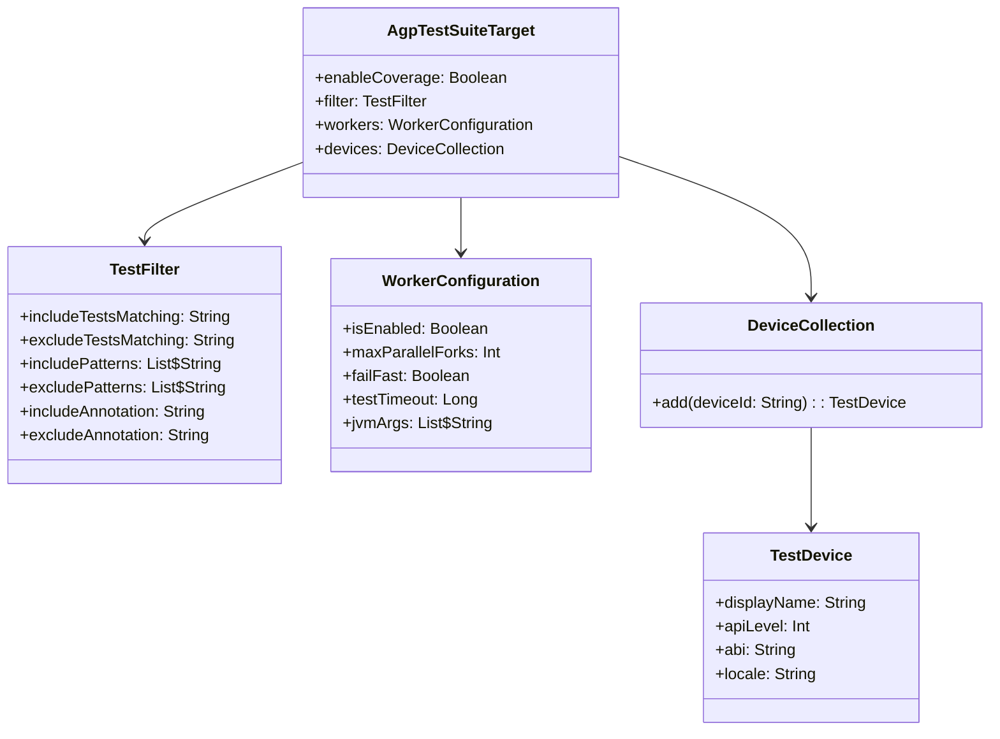

# 21.1.63 AgpTestSuiteTarget

东边的天际开始泛起微微的青色，黎明正在悄悄靠近。

洛芙打了个哈欠，揉了揉眼睛：“黛琳，刚才讲的测试依赖我都记下了！那今天要讲什么？”

黛琳微笑着从背包里拿出一个小巧的金属盒子：“今天我们要讲它的‘指挥官’——AgpTestSuiteTarget。”

“指挥官？”洛芙好奇地接过盒子，仔细端详。盒子上有几个小开关和指示灯。

“对的，”黛琳点点头，“如果说AgpTestSuiteDependencies是士兵的装备，那AgpTestSuiteTarget就是决定派哪些士兵上战场、用什么方式作战的指挥官。”

伊莎轻声补充道：“就像是露营时，谁负责搭帐篷、谁负责做饭、谁负责生火——每个人有不同的目标和工作。”

“原来是这样！”洛芙恍然大悟，“那这个AgpTestSuiteTarget就是用来配置测试的目标和类型的？”

“没错！”希尔已经迫不及待地打开了笔记本，“我们来看具体的配置！”

黛琳把白板架好，画出了一个结构图：

```mermaid
graph TD
    A[android {}] --> B[testOptions {}]
    B --> C[unitTests {}]
    B --> D[androidTest {}]
    C --> C1[AgpTestSuiteTarget]
    D --> D1[AgpTestSuiteTarget]
    C1 --> C2[enableCoverage]
    C1 --> C3[filter {}]
    C1 --> C4[workers {}]
    D1 --> D5[enableCoverage]
    D1 --> D6[filter {}]
    D1 --> D7[devices {}]
    
    style A fill:#e1f5fe
    style B fill:#e1f5fe
    style C fill:#fff3e0
    style D fill:#e8f5e9
    style C1 fill:#f3e5f5
    style D1 fill:#f3e5f5
```

“这个图展示了AgpTestSuiteTarget在测试配置中的位置，”黛琳讲解道，“unitTests和androidTest各自有一个AgpTestSuiteTarget，用来配置它们的具体行为。”

洛芙看着图，好奇地问：“这些小方块都是什么呀？”

“让我一个个解释，”黛琳指着图说道，“enableCoverage是覆盖率开关，filter是测试过滤器，workers是并行执行配置，devices是设备选择（只对instrumented tests有效）。”

“听起来好专业！”洛芙感叹道。

希尔笑了笑：“我们来写代码吧，这样更直观！”

```kotlin
android {
    testOptions {
        // 单元测试配置
        unitTests {
            // 启用代码覆盖率
            enableCoverage = true
            
            // 测试过滤器
            filter {
                // 只运行包含特定模式的测试类
                includeTestsMatching("*Test")
                
                // 排除特定模式的测试类
                excludeTestsMatching("*IntegrationTest")
                
                // 只运行特定包名的测试
                includePatterns += "com.example.app.repository.*"
                excludePatterns += "com.example.app.debug.*"
            }
            
            // 并行执行配置
            workers {
                // 启用并行执行
                isEnabled = true
                
                // 最大并行数
                maxParallelForks = 4
                
                // 是否在失败时停止
                failFast = false
            }
        }
        
        // 仪器测试配置
        androidTest {
            enableCoverage = true
            
            filter {
                // 仪器测试的过滤
                includeAnnotation("androidx.test.filters.SmallTest")
                excludeAnnotation("androidx.test.filters.LargeTest")
            }
            
            // 设备选择（针对托管设备）
            devices {
                // 使用Pixel 6运行测试
                add("Pixel_6_API_33") {
                    // 设备显示名称
                    displayName = "Pixel 6"
                    // API级别
                    apiLevel = 33
                    // 是否支持ABI
                    abi = "arm64-v8a"
                }
                
                // 使用Pixel 7运行测试
                add("Pixel_7_API_34") {
                    displayName = "Pixel 7"
                    apiLevel = 34
                    abi = "arm64-v8a"
                }
            }
        }
    }
}
```

“这么多配置！”洛芙看得眼花缭乱，“它们分别都是做什么的？”

“别急，”黛琳温柔地说道，“我们一个一个来。”

她指着第一个配置说：“先看enableCoverage——代码覆盖率开关。”

“代码覆盖率？”洛芙问道，“是做什么的？”

“简单来说，就是你的测试代码覆盖了多少生产代码，”黛琳解释道，“开启后，Gradle会统计哪些代码被执行了，哪些没有。然后生成一个覆盖率报告。”

希尔补充道：“就像是检查你露营时走过的路——哪些地方你走过了，哪些地方还没去过。一目了然！”

“原来是这样！”洛芙笑道，“那开启覆盖率有什么用呢？”

“可以发现没有被测试覆盖的代码，”黛琳说道，“找出潜在的bug和遗漏的测试场景。”

她翻到白板新的一页，画出了覆盖率的工作流程：


“这个图展示了覆盖率的工作流程，”黛琳讲解道，“编译时注入覆盖率监测代码，测试运行时记录覆盖情况，最后生成报告。”

洛芙似懂非懂地点点头，又问：“那filter又是做什么的？”

“测试过滤器，”黛琳解释道，“就是选择性地运行测试，而不是运行所有的测试。”

“为什么要过滤？”洛芙不解地问。

“有几种情况，”希尔抢答道，“比如你只改了某个模块，想只测试这个模块——就可以用过滤器。或者是debug时只想运行某个特定的测试类。”

她举例说明：

```kotlin
unitTests {
    filter {
        // 只运行名称以 RepositoryTest 结尾的测试
        includeTestsMatching("*RepositoryTest")
        
        // 排除包含 Integration 的测试（通常较慢）
        excludeTestsMatching("*IntegrationTest")
        
        // 也可以按包名过滤
        includePatterns += "com.example.app.data.*"
        
        // 排除特定的测试方法
        excludeTestsMatching("*testDatabaseConnection")
    }
}
```

“这个过滤器太方便了！”洛芙感叹道，“想测什么就测什么！”

“对的，”黛琳点头道，“特别是大型项目，测试上千个，不可能每次都全部运行。用过滤器可以大大提高开发效率。”

伊莎轻轻拨了拨耳边的发丝：“就像是露营时，如果只有一个人需要喝水，就只烧一个人的水，不用烧所有人的。”

“这个比喻太贴切了！”洛芙笑道。

黛琳继续讲解workers配置：“接下来是workers——并行执行配置。”

“并行执行？”洛芙问道，“是同时运行多个测试吗？”

“对！”希尔兴奋地说道，“你可以同时运行多个测试，大大缩短测试时间！”

她在笔记本上敲出了workers的配置：

```kotlin
unitTests {
    workers {
        // 是否启用并行执行
        isEnabled = true
        
        // 最大并行数——同时运行多少个测试进程
        // 建议设为CPU核心数或稍少
        maxParallelForks = Runtime.getRuntime().availableProcessors()
        
        // 是否在第一个测试失败时停止
        // true: 有一个失败就停止全部
        // false: 继续运行所有测试
        failFast = false
        
        // 测试超时时间（毫秒）
        testTimeout = 60000
        
        // JVM参数
        jvmArgs += "-Xmx2048m"
        jvmArgs += "-XX:MaxMetaspaceSize=512m"
    }
}
```

“好多参数！”洛芙感叹道，“maxParallelForks是什么意思？”

“fork在英文里是‘分叉’的意思，”黛琳解释道，“maxParallelForks就是最多同时‘分叉’出多少个测试进程。每个进程可以独立运行测试。”

“原来是这样！”洛芙恍然大悟，“是不是就像同时打开多个锅煮东西？”

“对！”希尔笑道，“同时煮四个锅，当然比一个一个煮快！”

黛琳补充道：“但也不是越多越好——太多进程会消耗大量内存，CPU也会很忙。一般建议设为CPU核心数。”

“那failFast呢？”洛芙又问。

“failFast是‘快速失败’的意思，”黛琳解释道，“如果设为true，当第一个测试失败时，就会停止运行后面的测试。如果设为false，会把所有测试都跑完再报告。”

“什么时候用哪个？”洛芙好奇地问。

“在debug的时候，failFast = true很有用——快速定位问题，”希尔建议道，“但是在CI/CD流水线里，最好设为false——跑完所有测试，这样能看到完整的问题列表。”

洛芙若有所思地点点头：“明白了！”

黛琳翻到新的一页：“接下来是devices配置——这个只对instrumented tests有效。”

“仪器测试？”洛芙问道，“就是androidTest吗？”

“对！”黛琳点头道，“instrumented tests需要在Android设备或模拟器上运行。devices配置让你选择具体的设备。”

她在白板上画出了设备配置的结构：

```mermaid
flowchart TB
    A[androidTest {}] --> B[devices {}]
    B --> C[设备1: Pixel_6_API_33]
    B --> D[设备2: Pixel_7_API_34]
    B --> E[设备3: 自定义设备]
    
    C --> C1[displayName]
    C --> C2[apiLevel]
    C --> C3[abi]
    C --> C4[locale]
    
    style A fill:#e8f5e9
    style B fill:#e8f5e9
    style C fill:#fff3e0
    style D fill:#fff3e0
    style E fill:#fff3e0
```

“这个图展示了设备配置的结构，”黛琳讲解道，“你可以添加多个设备，测试会在每个设备上都运行一遍。”

“为什么要多个设备？”洛芙不解地问。

“为了兼容性！”希尔解释道，“你的app可能在Pixel 6上运行正常，但在Pixel 7上有问题。或者在不同API级别上有差异。多设备测试可以发现这些问题。”

黛琳补充道：“特别是发布到Google Play时，Google Play会根据用户的设备推荐不同的APK。如果在某些设备上崩溃，会影响用户体验和评分。”

洛AMP芽似懂非懂地点头。她低头看了看手表：“哎呀，天快亮了！”

确实，东边的天空已经从青色变成了淡淡的橘红色，星星们开始悄悄隐退。

“我们今天就到这里吧，”伊莎轻声说道，“AgpTestSuiteTarget是一个很重要的概念——它决定了测试的目标、范围和执行方式。”

“对！”黛琳总结道，“enableCoverage帮你了解代码覆盖情况，filter帮你选择性地运行测试，workers帮你并行加速，devices帮你多设备兼容。”

“谢谢黛琳！”洛芙裹紧毯子，“今天又学到了新东西！原来测试配置有这么多讲究！”

希尔打了个哈欠：“掌握了这些，你就能更好地控制你的测试了。晚安，洛芙！”

“晚安！”洛芙轻声回应道。

天边出现了第一缕阳光，草叶上的露珠在晨光中闪闪发亮，像一粒粒小小的钻石。新的一天即将开始。

---

## 专业技术总结

> **AgpTestSuiteTarget** 是 Android Gradle Plugin 提供的测试套件目标配置 DSL 类型，用于配置测试套件的具体行为和属性。它属于 AgpTestSuite 的子配置，控制单元测试（unitTests）和仪器测试（androidTest）的执行方式、过滤规则、覆盖率开关和设备选择等核心行为。

#### 结构图



#### 核心属性与配置

| 属性 | 类型 | 说明 |
|------|------|------|
| enableCoverage | Boolean | 启用代码覆盖率收集，生成Jacoco/Emma覆盖率报告 |
| filter | TestFilter | 测试过滤器，支持按类名、包名、注解过滤 |
| workers | WorkerConfiguration | 并行执行配置，控制测试进程数和执行策略 |
| devices | DeviceCollection | 设备集合，仅对instrumented tests有效 |

#### 反模式与陷阱

1. **单元测试启用devices配置**：devices只对androidTest（instrumented tests）有效，在unitTests中配置会被忽略。错误配置会导致设备选择失效。

2. **maxParallelForks设置过大**：设置过高的并行数会导致内存不足和系统卡顿。建议设为CPU核心数或更少，而非盲目追求高并行。

3. **在CI中启用failFast**：持续集成环境中应关闭failFast，让所有测试都运行完毕，以便一次性看到所有失败的测试报告。

#### 设计哲学

AgpTestSuiteTarget体现了Android Gradle Plugin的**测试控制**理念：
- 通过enableCoverage实现测试质量可视化
- 通过filter实现测试选择的灵活性
- 通过workers实现测试执行的效率优化
- 通过devices实现多设备兼容性验证
- 这些配置让测试从“被动运行”变成“主动可控”

---

> 学习建议：建议在实际项目中根据需要逐步启用这些配置——先从简单的filter开始，选择性地运行测试；然后启用并行执行加速测试；最后根据项目规模考虑覆盖率和多设备测试。注意在CI环境中合理配置workers参数。

---

## 洛芙的小小日记本

今晚黛琳讲了AgpTestSuiteTarget——测试套件目标配置！原来测试可以这么灵活地控制——enableCoverage看覆盖率，filter选要跑的测试，workers并行加速，devices多设备测试。就像露营时谁负责什么工作一样，每个测试也有自己的目标和任务！好厉害！

---

## 今日关键词

- **AgpTestSuiteTarget**: Android Gradle Plugin的测试套件目标配置DSL类型
- **enableCoverage**: 代码覆盖率开关，启用后生成覆盖率报告
- **TestFilter**: 测试过滤器，用于选择性地运行测试
- **includeTestsMatching**: 按测试类名包含测试
- **excludeTestsMatching**: 按测试类名排除测试
- **includePatterns**: 按包名模式包含测试
- **WorkerConfiguration**: 并行执行配置，控制测试进程数
- **maxParallelForks**: 最大并行进程数，建议设为CPU核心数
- **failFast**: 快速失败模式，第一个失败时是否停止
- **DeviceCollection**: 设备集合，用于多设备测试
- **TestDevice**: 测试设备配置，包含设备ID、API级别、ABI等
- **instrumented tests**: 仪器测试，需要在Android设备或模拟器上运行
- **unitTests**: 单元测试，运行在JVM上
- **代码覆盖率**: 测试代码覆盖的生产代码比例
- **Jacoco**: Java代码覆盖率工具
