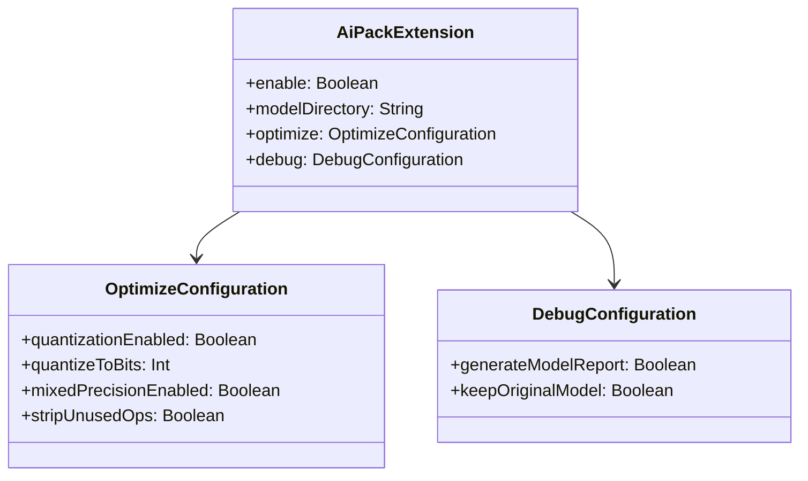

# 21.1.64 AiPackExtension

清晨的露水还没有完全蒸发，阳光就已经迫不及待地穿透了树叶的缝隙，在草地上洒下点点光斑。

洛芙捧着热可可，舒服地靠在树干上：“黛琳昨天讲的测试配置好复杂啊……不过我好像开始理解了呢！”

“那是当然！”希尔正把笔记本放在膝盖上，屏幕上是一段代码，“不过今天我们要讲一个更酷的东西——AiPackExtension！”

“AiPack？”洛芙眨了眨眼睛，“是AI？人工智能的那个AI吗？”

“对！”希尔兴奋地点点头，“就是你上次说的那个能识别野花的应用背后的技术！今天我们就来讲讲怎么把这些AI模型打包到你的App里。”

伊莎轻轻梳理着发丝，柔声说道：“就像是露营时要带的食材和炊具——AI模型就是你的'智能食材'，需要好好打包才能带走。”

“原来是这样！”洛芙好奇地凑过去看希尔的屏幕，“那这个AiPackExtension是做什么的？”

黛琳递过来一块小石头：“你还记得我们之前讲的Apk扩展示览吗？”

“记得！”洛芙点头道，“好像是给App添加各种扩展资源的？”

“对的，”黛琳微笑道，“AiPackExtension就是专门用来打包AI模型的扩展示。它告诉构建系统：'嘿，这里有个ML模型，记得把它也打包进去！'”

希尔把笔记本转向大家，屏幕上是一个配置示例：

```kotlin
android {
    aiPack {
        // 启用AI模型打包
        enable = true
        
        // 模型目录
        modelDirectory = "src/main/ml"
        
        // 模型优化选项
        optimize {
            // 启用量化
            quantizationEnabled = true
            
            // 量化位数
            quantizeToBits = 8
            
            // 启用混合精度
            mixedPrecisionEnabled = false
        }
        
        // 调试选项
        debug {
            // 输出模型分析报告
            generateModelReport = true
            
            // 保留原始模型
            keepOriginalModel = true
        }
    }
}
```

“好多配置！”洛芙看得眼花缭乱，“这些都是做什么的呀？”

“别急，”黛琳拿起白板笔，“我们一个一个来。”

她在白板上画出了一个结构图：

```mermaid
flowchart TB
    A[android {}] --> B[aiPack {}]
    B --> C[enable]
    B --> D[modelDirectory]
    B --> E[optimize {}]
    B --> F[debug {}]
    
    E --> E1[quantizationEnabled]
    E --> E2[quantizeToBits]
    E --> E3[mixedPrecisionEnabled]
    
    F --> F1[generateModelReport]
    F --> F2[keepOriginalModel]
    
    style A fill:#e1f5fe
    style B fill:#e8f5e9
    style C fill:#fff3e0
    style D fill:#fff3e0
    style E fill:#f3e5f5
    style F fill:#f3e5f5
```

“这个图展示了AiPackExtension的主要配置项，”黛琳讲解道，“enable是开关，modelDirectory是模型文件存放目录，optimize是优化选项，debug是调试选项。”

洛芙似懂非懂地点点头，又问：“为什么要打包AI模型？不能直接下载吗？”

“好问题！”希尔抢答道，“打包AI模型有三大好处！”

她伸出三根手指：

“第一，**离线可用**——用户不用联网也能用AI功能，就像你离线地图一样！”

“第二，**加载更快**——模型已经在App里，不用等下载。”

“第三，**版本稳定**——你测试过的模型版本，用户用的也是同一个版本，不会有兼容问题。”

伊莎轻声补充道：“而且有些应用场景不允许联网——比如在深山里识别植物，这时候离线模型就派上用场了！”

“原来如此！”洛芙恍然大悟，“那modelDirectory是放模型的地方？”

“对！”黛琳点头道，“模型文件通常放在ml目录下，支持TFLite模型（.tflite）、TensorFlow模型（.pb）等多种格式。”

她继续讲解优化选项：“接下来是optimize——模型优化。这是最重要的部分！”

洛芙歪着头：“模型还要优化？”

“当然！”希尔解释道，“AI模型通常很大——几十MB甚至上百MB。优化可以让模型变小、运行更快，但可能会有一点点精度损失。”

她在白板上画出了模型优化的流程：


“这个图展示了模型量化的效果，”黛琳讲解道，“从100MB缩小到25MB，体积缩小了75%！”

“这么厉害！”洛芙惊叹道，“那是怎么做到的？”

“简单来说，”希尔想了想，“就是用更少的数据来表示原来的数字。比如原来用一个32位的数字表示一个参数，现在用8位来表示——精度略微下降，但体积大大缩小。”

“就像是照片从高清变成标清，”伊莎温柔地补充道，“细节少了，但文件小了很多，而且对于大多数场景来说仍然够用。”

洛芙若有所思地点点头：“那quantizeToBits是选择多少位的？”

“对的！”黛琳说道，“8位是最常用的，16位精度更高但体积也更大，32位就是原始精度。”

她继续讲解debug选项：“最后是debug——调试选项。”

```kotlin
aiPack {
    debug {
        // 生成模型分析报告
        // 包含模型大小、层数、参数量等信息
        generateModelReport = true
        
        // 保留原始模型（不删除）
        // 方便调试时对比原始和优化后的效果
        keepOriginalModel = true
    }
}
```

“这些调试选项是做什么的？”洛芙问道。

“模型分析报告就像食品的营养成分表，”希尔解释道，“告诉你模型有多少层、有多少参数、推理时间预计多长。”

“而保留原始模型，”黛琳补充道，“让你在优化后还能对比原始版本的效果——看看精度损失了多少。”

洛芙明白了：“原来AI模型打包有这么多讲究！那……我们能实际操作一下吗？”

希尔 grins（露出灿烂的笑容）：“当然可以！让我写一个完整的示例！”

她在笔记本上敲了起来：

```kotlin
// 完整的 AiPackExtension 配置示例
android {
    aiPack {
        // 启用AI模型打包
        enable = true
        
        // 模型文件目录
        // 支持 ml, tf Lite, TensorFlow 等多种格式
        modelDirectory = "src/main/ml"
        
        // 模型优化配置
        optimize {
            // 启用量化（减少模型体积）
            quantizationEnabled = true
            
            // 量化位数：8位（推荐）、16位（高精度）、32位（原始）
            quantizeToBits = 8
            
            // 混合精度（部分层用FP16）
            // 可以进一步减小体积但可能影响兼容性
            mixedPrecisionEnabled = false
            
            // 剥离不需要的Op（减少模型体积）
            stripUnusedOps = true
        }
        
        // 调试配置
        debug {
            // 生成模型分析报告
            generateModelReport = true
            
            // 保留原始模型文件
            keepOriginalModel = true
        }
    }
}

// 模型文件应该放在 src/main/ml 目录下
// 目录结构示例：
// src/main/ml/
// ├── flower_model.tflite      # 花卉识别模型
// ├── plant_model.tflite       # 植物识别模型
// └── labels.txt               # 标签文件
```

“太棒了！”洛芙拍手道，“这样就能把AI模型打包进App了！”

黛琳补充道：“在实际项目中，你还可以配置多个模型——不同的模型用于不同的功能。”

“对！”希尔点头道，“比如一个识别野花的模型，一个识别动物的模型，一个识别天气的模型……”

伊莎轻轻笑道：“那就是一个完整的AI露营助手了！”

洛芙想象了一下那个场景：“以后我们露营时，用手机就能识别周围的植物和动物……太酷了！”

她低头看了看手表：“哎呀，都快中午了！太阳好晒啊！”

确实，阳光已经从温和变得炽热起来，湖水在阳光下闪闪发光。

黛琳收拾着白板：“今天我们学了AiPackExtension——AI模型打包配置。它能让你的App自带AI能力，而且是离线可用的。”

“对！”希尔总结道，“enable是开关，modelDirectory指定模型在哪，optimize让你的模型更小更快，debug帮你分析和调试。”

“谢谢黛琳！谢谢希尔！”洛芙裹紧防晒衣，“原来AI模型也要像行李一样打包好才能带走！”

伊莎轻轻拨了拨被风吹乱的刘海：“技术的世界真是越来越有趣了！”

远处传来一阵鸟鸣声，似乎在为她们的知识探索伴奏。夏天真好，露营真好，学习新东西的时光，更好。

---

## 专业技术总结

> **AiPackExtension** 是 Android Gradle Plugin 提供的 AI 模型打包配置 DSL，用于配置 ML（机器学习）模型的打包方式、资源管理和优化选项。它属于 android {} 块的子配置，让开发者能够将 TensorFlow Lite、TensorFlow 等格式的 AI 模型打包进 App，实现离线 AI 功能。

#### 结构图



#### 核心属性与配置

| 属性 | 类型 | 说明 |
|------|------|------|
| enable | Boolean | 是否启用AI模型打包功能 |
| modelDirectory | String | 模型文件所在目录路径 |
| optimize | OptimizeConfiguration | 模型优化配置 |
| debug | DebugConfiguration | 调试选项配置 |

#### 优化配置详解

| 属性 | 取值 | 说明 |
|------|------|------|
| quantizationEnabled | Boolean | 启用量化，显著减小模型体积 |
| quantizeToBits | 8/16/32 | 量化位数，8位体积最小，32位精度最高 |
| mixedPrecisionEnabled | Boolean | 混合精度，部分层使用FP16 |
| stripUnusedOps | Boolean | 剥离未使用的操作符 |

#### 反模式与陷阱

1. **未启用enable就配置模型**：必须在 aiPack {} 块中先设置 enable = true，否则模型不会被包含在构建中。

2. **模型目录路径错误**：modelDirectory 必须指向实际存在模型文件的目录，否则构建会失败。常用路径为 "src/main/ml"。

3. **过度量化**：将 quantizeToBits 设得太低（如4位或更低）可能导致模型精度严重下降，AI功能无法正常使用。建议从8位开始测试。

#### 设计哲学

AiPackExtension体现了Android构建系统的**ML能力集成**理念：
- 通过enable实现ML功能的开关控制
- 通过modelDirectory统一管理模型资源
- 通过optimize实现模型体积与性能的平衡
- 通过debug提供分析与调试能力
- 让AI能力像普通资源一样被构建系统管理

---

> 学习建议：在实际项目中，建议先准备好待打包的模型文件（.tflite格式），然后从最简单的enable = true配置开始，逐步添加优化选项。注意量化会改变模型精度，应在打包后测试AI功能是否正常工作。可以在debug模式下生成报告来分析模型状态。

---

## 洛芙的小小日记本

今天希尔讲了AiPackExtension——AI模型打包配置！原来AI模型也能像行李一样打包进App里——enable开关、modelDirectory放模型、optimize让模型变小变快，debug分析调试。离线就能用AI功能也太酷了！好期待做出自己的AI露营助手！

---

## 今日关键词

- **AiPackExtension**: Android Gradle Plugin的AI模型打包配置DSL
- **enable**: AI模型打包功能的开关
- **modelDirectory**: 模型文件存放目录
- **optimize**: 模型优化配置块
- **quantizationEnabled**: 量化开关，减小模型体积
- **quantizeToBits**: 量化位数，8/16/32位可选
- **mixedPrecisionEnabled**: 混合精度配置
- **stripUnusedOps**: 剥离未使用的操作符
- **debug**: 调试选项配置块
- **generateModelReport**: 生成模型分析报告
- **keepOriginalModel**: 保留原始模型文件
- **TensorFlow Lite**: Google的移动端机器学习框架
- **模型量化**: 用更少位数表示参数以减小模型体积
- **ML Kit**: Google的机器学习工具包
- **离线AI**: 不需要网络连接即可使用的AI功能
