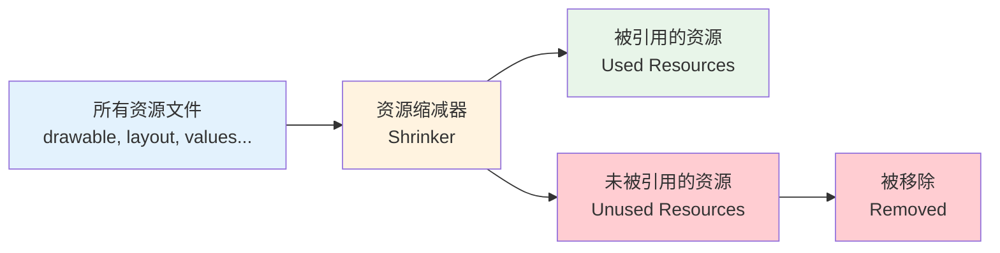
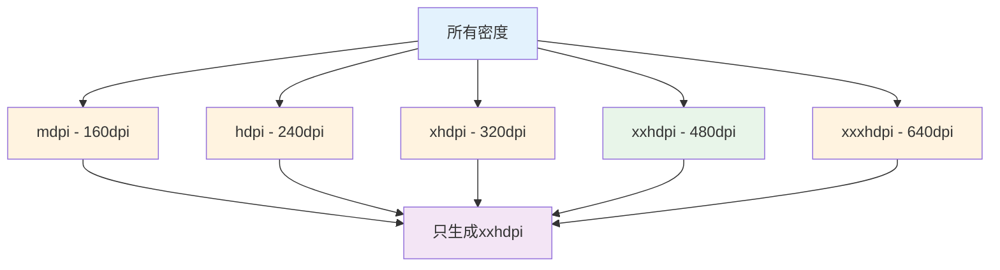
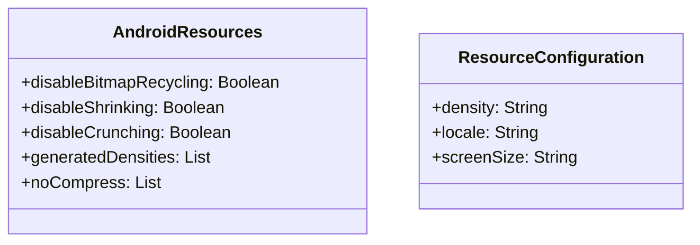

# 21.1.65 AndroidResources

午后的阳光透过茂密的树叶，在草地上投下摇曳的光斑。湖水被微风轻轻拂过，泛起层层涟漪。

洛芙靠在树干上，翻看着手机里刚装好的App：“希尔上午教的AI模型打包好棒啊！我的露营助手好像越来越像样了……”

“那是当然！”希尔正把笔记本放在膝盖上，屏幕上是另外一段代码，“不过今天我们要讲一个更基础但同样重要的东西——资源管理！”

“资源？”洛芙抬起头，好奇地问，“是图片、文字那些吗？”

“对！”黛琳递过来一块小石头，“你知道你的App里都有哪些资源吗？”

洛芙想了想：“图片、字符串、颜色、布局……还有音频？”

“没错！”希尔兴奋地说，“一个典型的App可能有几百个资源文件——图标、插图、动画、音频、字体……这些都需要打包进你的App里。”

伊莎轻轻梳理着发丝，柔声说道：“就像露营时要带的厨具、餐具、食材——资源就是App的'家当'，需要整理好才能带走。”

“原来如此！”洛芙好奇地问，“那AndroidResources是做什么的？”

黛琳微笑道：“AndroidResources就是用来配置这些资源如何打包的工具。它可以告诉构建系统：哪些资源要压缩、哪些要过滤、哪些要保留……”

她在白板上画出了一个结构图：

```mermaid
flowchart TB
    A[android {}] --> B[androidResources {}]
    B --> C[disableBitmapRecycling]
    B --> D[disableShrinking]
    B --> E[disableCrunching]
    B --> F[generatedDensities]
    B --> G[noCompress]
    
    style A fill:#e1f5fe
    style B fill:#e8f5e9
    style C fill:#fff3e0
    style D fill:#fff3e0
    style E fill:#fff3e0
    style F fill:#f3e5f5
    style G fill:#f3e5f5
```

“这个图展示了AndroidResources的主要配置项，”黛琳讲解道，“disableBitmapRecycling是bitmap回收开关，disableShrinking是资源缩减开关，disableCrunching是图片压缩开关，generatedDensities是生成的密度，noCompress是不压缩的文件类型。”

洛芙似懂非懂地点点头，又问：“为什么要配置这些？不能用默认的吗？”

“好问题！”希尔抢答道，“默认的配置通常是最省事的，但不一定是最优的。有时候我们需要自定义配置来满足特殊需求。”

她举起一根手指：“比如说——你想让App的安装包更小，就要配置资源压缩和图片压缩！”

“对！”黛琳点头道，“默认情况下，Gradle会自动压缩资源。但有些资源不能压缩（比如已经压缩过的文件），或者我们想保留原始质量（比如某些图标）。”

洛芙明白了：“那noCompress就是指定哪些文件不要压缩？”

“对的！”希尔 grins（露出灿烂的笑容），“比如一些已经是压缩格式的文件——mp3、mp4、zip——再次压缩不仅没用，还会增加CPU负担。”

黛琳补充道：“接下来我们重点讲讲资源缩减——shrinkResources。”

她在白板上画出了资源缩减的流程：



“这个图展示了资源缩减的工作原理，”黛琳讲解道，“Gradle会分析代码，找出所有被引用的资源，然后把没有被引用的资源从最终打包文件中移除。”

“原来如此！”洛芙惊叹道，“那就可以省掉很多空间！”

“但是要注意，”希尔提醒道，“资源缩减可能会误删一些动态加载的资源！所以shrinkResources通常要配合ProGuard/R8一起使用。”

洛芙歪着头：“ProGuard？那是什么？”

“ProGuard是代码混淆器，”黛琳解释道，“它不仅混淆代码，还会移除没有被使用的类。资源缩减要依赖它来分析哪些资源被引用了。”

她继续讲解另一个重要选项：“接下来是crunching——图片压缩。”

“在Android中，PNG图片在打包时会被重新压缩，”黛琳说道，“这个过程叫crunching。它可以显著减小PNG文件的体积。”

“但是，”希尔补充道，“crunching会增加构建时间。有些开发者会在调试时关闭它来加快构建速度。”

黛琳点头道：“对！disableCrunching = true 可以关闭图片压缩。这在开发阶段很有用，但发布时记得要打开。”

洛芙好奇地问：“那generatedDensities是做什么的？”

“是这样，”希尔解释道，“Android设备有不同密度的屏幕——mdpi、hdpi、xhdpi、xxhdpi、xxxhdpi。默认情况下，每个密度的图片都会生成一份。”

“如果你的App只支持某些密度，”黛琳补充道，“可以用generatedDensities来指定生成哪些。这样可以减小包体积。”

她在白板上画出了密度的层次：



“这个图展示了密度选择的效果，”黛琳讲解道，“如果只生成xxhdpi，其他密度的设备会自动使用xxhdpi的图片，只是显示时会缩放。”

洛芙若有所思地点点头：“那disableBitmapRecycling呢？这个是回收bitmap？”

“对！”希尔说道，“Android系统会在内存紧张时回收bitmap。但是有些情况下我们不想让它回收——比如一些重要的缓存图片。”

她继续解释：“disableBitmapRecycling = true 可以禁止系统回收bitmap。这在某些特殊场景下有用，但会增加内存占用。”

洛芙明白了：“原来资源管理有这么多讲究！那……我们能实际操作一下吗？”

希尔 grins（露出灿烂的笑容）：“当然可以！让我写一个完整的示例！”

她在笔记本上敲了起来：

```kotlin
// 完整的 AndroidResources 配置示例
android {
    // 资源打包配置
    androidResources {
        // 禁止Bitmap回收
        // 设为true时，系统不会在内存紧张时回收bitmap
        // 适用于需要保持缓存图片的场景
        disableBitmapRecycling = false
        
        // 禁止资源缩减
        // 设为true时，不会移除未使用的资源
        // 在某些动态加载资源的场景需要关闭
        disableShrinking = false
        
        // 禁止图片压缩
        // 设为true时，PNG图片不会被重新压缩
        // 开发阶段可以设为true加快构建速度
        disableCrunching = false
        
        // 生成的密度
        // 只生成指定密度的资源文件
        // 可以减小包体积，但低密度设备需要缩放
        generatedDensities = listOf("xxhdpi", "xxxhdpi")
        
        // 不压缩的文件类型
        // 这些格式的文件不会在打包时被压缩
        // 已经是压缩格式的文件应该加入这里
        noCompress = listOf(".mp3", ".mp4", ".zip", ".ogg", ".font")
    }
}

// 资源缩减的完整配置（需要配合shrinkResources）
android {
    buildTypes {
        release {
            // 启用资源缩减
            shrinkResources = true
            
            // 配置ProGuard规则
            proguardFiles(
                getDefaultProguardFile("proguard-android-optimize.txt"),
                "proguard-rules.pro"
            )
        }
    }
}

// proguard-rules.pro 示例
// 保留资源文件
-keepattributes SourceFile,LineNumberTable
-keep class **.R$* { *; }

// 保留动态引用的资源（避免被误删）
-keep class com.example.myapp.** { *; }
```

“太棒了！”洛芙拍手道，“这样就能精细控制资源打包了！”

黛琳补充道：“在实际项目中，资源管理是优化包体积的重要手段。一个好的资源策略可以减少几十MB的包体积！”

“对！”希尔点头道，“尤其是图片比较多的App，图片压缩和密度选择的效果非常明显。”

伊莎轻声说道：“就像露营时要精简行李——带太多用不到的东西只会增加负担。App也是一样的道理。”

洛芙想象了一下那个场景：“以后我一定要好好管理App的资源——不能让它变得太胖！”

她低头看了看手表：“哎呀，都下午了！太阳好晒啊！”

确实，阳光已经从温和变得炽热起来，湖水在阳光下闪闪发光。

黛琳收拾着白板：“今天我们学了AndroidResources——Android资源打包配置。它能让你的App资源管理更加精细。”

“对！”希尔总结道，“disableBitmapRecycling控制bitmap回收，disableShrinking控制资源缩减，disableCrunching控制图片压缩，generatedDensities选择生成的密度，noCompress指定不压缩的文件类型。”

“谢谢黛琳！谢谢希尔！”洛芙裹紧防晒衣，“原来App的资源也要像行李一样精简才行！”

伊莎轻轻拨了拨被风吹乱的刘海：“技术的世界真是越学越有趣了！”

远处传来一阵鸟鸣声，似乎在为她们的知识探索伴奏。夏天真好，露营真好，学习新东西的时光，更好。

---

## 专业技术总结

> **AndroidResources** 是 Android Gradle Plugin 提供的资源打包配置 DSL，用于配置资源的压缩方式、缩减选项、密度生成和文件类型处理。它属于 android {} 块的子配置，让开发者能够精细控制资源文件如何被打包进 App，实现包体积优化和资源管理。

#### 结构图



#### 核心属性与配置

| 属性 | 类型 | 说明 |
|------|------|------|
| disableBitmapRecycling | Boolean | 是否禁止Bitmap回收（true为禁止） |
| disableShrinking | Boolean | 是否禁止资源缩减（true为禁止） |
| disableCrunching | Boolean | 是否禁止图片压缩（true为禁止） |
| generatedDensities | List<String> | 要生成的屏幕密度列表 |
| noCompress | List<String> | 不压缩的文件扩展名列表 |

#### 资源缩减详解

资源缩减（Shrinking）是 Gradle 自动移除未使用资源的功能：
- 默认在 release 构建时启用
- 依赖 ProGuard/R8 分析代码引用
- 可能误删动态加载的资源，需要配置 keep rules
- 配合 shrinkResources = true 使用

#### 图片压缩详解

Crunching 是 Gradle 对 PNG 图片进行重新压缩的过程：
- 默认启用，可显著减小 PNG 体积
- 增加构建时间，开发阶段可禁用
- 对已压缩格式（JPG、WebP）无效

#### 反模式与陷阱

1. **在release构建时关闭资源缩减**：未使用 shrinkResources = true 会导致包体积增大，未使用的资源也被打包进去。

2. **不配置ProGuard规则就启用资源缩减**：动态加载的资源（如反射、动态引用）可能被误删，必须配置 -keep 规则。

3. **generatedDensities设置过多密度**：生成的密度越多，包体积越大。建议只保留主流密度（xxhdpi、xxxhdpi）。

4. **noCompress包含可压缩的格式**：.txt、.json 等文本文件应该被压缩，加入 noCompress 会增加包体积。

#### 设计哲学

AndroidResources体现了Android构建系统的**资源优化**理念：
- 通过shrinkResources实现未使用资源的自动移除
- 通过crunching实现图片体积优化
- 通过generatedDensities控制密度变体数量
- 通过noCompress避免重复压缩
- 让资源管理自动化同时保持可控性

---

> 学习建议：在实际项目中，建议从release构建开始启用资源缩减，并配置好ProGuard规则以避免误删。图片压缩在开发阶段可以关闭以加快构建速度，但在发布时一定要启用。密度选择要根据目标用户群体来决定，如果用户主要是主流设备，可以只生成xxhdpi和xxxhdpi。

---

## 洛芙的小小日记本

今天黛琳讲了AndroidResources——资源打包配置！原来App里的图片、音频、字体这些资源也要管理——shrinkResources缩减未使用的、crunching压缩图片、generatedDensities选密度、noCompress不压缩的格式。包体积优化太重要了！要像精简露营行李一样精简资源~

---

## 今日关键词

- **AndroidResources**: Android Gradle Plugin的资源打包配置DSL
- **disableBitmapRecycling**: 禁止Bitmap回收的开关
- **disableShrinking**: 禁止资源缩减的开关
- **disableCrunching**: 禁止图片压缩的开关
- **generatedDensities**: 要生成的屏幕密度列表
- **noCompress**: 不压缩的文件类型列表
- **shrinkResources**: 构建类型中启用资源缩减的开关
- **资源缩减**: 自动移除未使用资源的功能
- **图片压缩**: PNG图片在打包时的重新压缩
- **ProGuard**: Java代码混淆器和优化器
- **R8**: ProGuard的继任者，Google推荐的代码混淆工具
- **屏幕密度**: Android设备的像素密度（mdpi/hdpi/xhdpi/xxhdpi/xxxhdpi）
- **AAPT**: Android Asset Packaging Tool，资源打包工具
- **包体积优化**: 减小App安装包大小的技术
