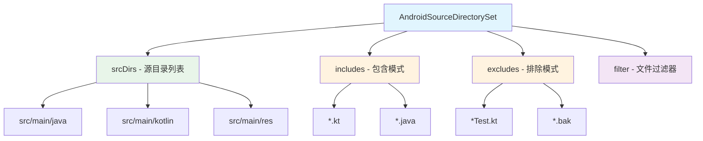
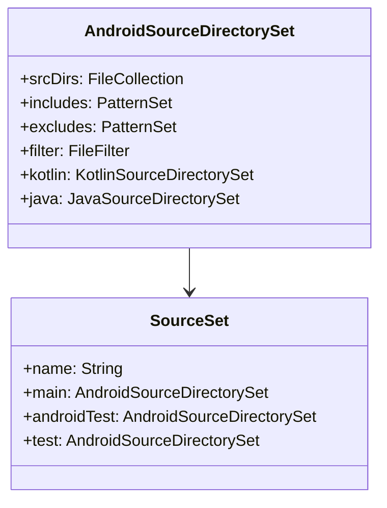

# 21.1.66 AndroidSourceDirectorySet

午后的湖边传来阵阵蝉鸣声，热气从地面蒸腾而上，却被茂密的树冠阻挡在外，留下斑驳的光影。

洛芙用草帽扇着风，眼睛盯着笔记本屏幕上的一大串代码：“黛琳上午讲的资源管理好棒啊！但是……我还有个问题。”

“什么问题？”伊莎递过来一瓶冰镇柠檬水。

洛芙接过喝了一口：“就是……我们的代码文件都放在哪里啊？我看gradle里总是有src啊、main啊这些目录，它们是怎么配置的？”

希尔正好从帐篷里钻出来，怀里抱着一堆零食：“问得好！我正想讲这个呢——今天我们要学的就是AndroidSourceDirectorySet！”

“源目录集？”洛芙歪着头，“是管理源代码目录的东西吗？”

“对！”希尔把零食放在野餐垫上， grinned（露出灿烂的笑容），“你知道你的App里都有哪些源代码吗？”

洛芙掰着手指头数起来：“Java文件、Kotlin文件……还有XML布局文件？”

“没错！”黛琳递过来一块小石头，“但这些文件不是随便放的——它们都放在特定的目录里，由构建系统来管理。”

她继续说道：“在Android项目中，我们用source sets来组织源代码。AndroidSourceDirectorySet就是用来配置这些源目录的 DSL。”

洛芙好奇地问：“source sets……是不是就像露营时的不同营地？每个营地放不同的东西？”

“Exactly！”希尔兴奋地打了个响指，“main里放主代码，androidTest里放测试代码——每个source set就是一个'营地'！”

伊莎轻轻梳理着发丝，柔声说道：“就像露营时要分区域——睡觉的帐篷、做饭的炉灶、存放食材的冰盒。源代码也要分门别类地放好。”

黛琳微笑道：“AndroidSourceDirectorySet就是用来管理这些'区域'的工具。”

她在白板上画出了一个结构图：



“这个图展示了AndroidSourceDirectorySet的主要组成部分，”黛琳讲解道，“srcDirs是源目录列表，includes是包含的文件模式，excludes是排除的文件模式，filter是文件过滤器。”

洛芙似懂非懂地点点头，又问：“为什么要配置这些？不能用默认的吗？”

“好问题！”希尔抢答道，“默认的配置通常够用，但有时候我们需要自定义源目录结构。”

她举起一根手指：“比如说——你想把一些公共代码放在shared模块里，让多个App共享！”

“对！”黛琳点头道，“或者你想排除某些测试文件，不让它们参与构建。”

洛葵明白了：“那includes和excludes就是用来选择哪些文件要、哪些文件不要？”

“对的！”希尔 grins（露出灿烂的笑容），“比如你想只编译Kotlin文件，不编译Java文件，就可以用includes来过滤！”

黛琳补充道：“接下来我们重点讲讲srcDirs——源目录配置。”

她在白板上画出了源目录的层次结构：

```mermaid
flowchart TB
    A[android {}] --> B[sourceSets {}]
    B --> C[main {}]
    B --> D[androidTest {}]
    B --> E[test {}]
    
    C --> C1[java.srcDirs]
    C --> C2[kotlin.srcDirs]
    C --> C3[res.srcDirs]
    C --> C4[assets.srcDirs]
    C --> C5[manifest.srcFile]
    
    style A fill:#e3f2fd
    style B fill:#fff3e0
    style C fill:#e8f5e9
    style D fill:#f3e5f5
    style E fill:#f3e5f5
```

“这个图展示了sourceSets的配置结构，”黛琳讲解道，“main是主源集，androidTest是Android测试代码，test是单元测试代码。每个源集下面都有不同的源目录类型——java、kotlin、res、assets……”

“原来如此！”洛芙惊叹道，“每个类型的文件都有专门的目录！”

希尔补充道：“对！java.srcDirs放Java和Kotlin源代码，res.srcDirs放资源文件，assets.srcDirs放静态资源文件……”

洛芙好奇地问：“那……我们能实际操作一下吗？”

希尔 grinned（露出灿烂的笑容）：“当然可以！让我写一个完整的示例！”

她在笔记本上敲了起来：

```kotlin
// 完整的 AndroidSourceDirectorySet 配置示例
android {
    sourceSets {
        // 主源集配置
        getByName("main") {
            // Java/Kotlin 源代码目录
            // 可以添加多个目录，构建系统会合并这些目录中的文件
            java.srcDirs("src/main/java", "src/main/kotlin")
            
            // 资源文件目录
            res.srcDirs(
                "src/main/res",
                "src/main/res-common"  // 共用资源目录
            )
            
            // assets 目录 - 存放静态文件（如图片、字体等）
            assets.srcDirs("src/main/assets", "src/main/fonts")
            
            // manifest 文件
            manifest.srcFile("src/main/AndroidManifest.xml")
            
            // JNI/Native 代码目录
            jniLibs.srcDirs("src/main/jniLibs")
        }
        
        // 测试源集配置
        getByName("test") {
            java.srcDirs("src/test/java")
        }
        
        // Android 测试源集配置
        getByName("androidTest") {
            java.srcDirs("src/androidTest/java")
        }
        
        // 自定义源集 - 免费版
        create("free") {
            java.srcDirs("src/free/java")
            res.srcDirs("src/free/res")
        }
        
        // 自定义源集 - 付费版
        create("paid") {
            java.srcDirs("src/paid/java")
            res.srcDirs("src/paid/res")
        }
    }
}

// 使用 includes 和 excludes 过滤文件
android {
    sourceSets {
        getByName("main") {
            // 只包含特定目录下的 Kotlin 文件
            kotlin {
                include("**/feature/**/*.kt")
                include("**/core/**/*.kt")
            }
            
            // 排除测试文件和生成的文件
            exclude("**/*Test.kt")
            exclude("**/build/**/*.kt")
            exclude("**/*_Factory*.kt")
            exclude("**/*_Members*.kt")
        }
    }
}

// 使用 filter 进行更复杂的过滤
android {
    sourceSets {
        getByName("main") {
            // 使用 FileFilter 过滤文件
            kotlin {
                filter {
                    // 排除名字以 Test 结尾的类
                    excludeClasses = { className ->
                        className.endsWith("Test")
                    }
                }
            }
        }
    }
}

// 使用 FileCollection 进行更灵活的配置
// FileCollection 代表一组文件，可以来自任意来源
val mySourceFiles: FileCollection = files(
    "src/main/java",
    "src/main/kotlin"
) + fileTree("src/common") {
    include("**/*.kt")
}

android {
    sourceSets {
        getByName("main") {
            // 将自定义的 FileCollection 作为源目录
            java.setSrcDirs(mySourceFiles)
        }
    }
}

// 使用 sourceSet 任务配置
tasks.register<Copy>("copyCustomSources") {
    from("src/custom")
    into("src/main/java")
}
```

“太棒了！”洛芙拍手道，“这样就能精细控制源代码目录了！”

黛琳补充道：“在实际项目中，源目录配置是模块化的基础。一个好的源集结构可以让代码组织更清晰！”

“对！”希尔点头道，“尤其是多模块项目，源集配置非常重要。”

伊莎轻声说道：“就像露营时要规划好区域——帐篷区、炊事区、活动区。代码也要分门别类才能管理好。”

洛芙想象了一下那个场景：“以后我一定要好好规划源代码目录——让每个文件都住在正确的'营地'里！”

她低头看了看手表：“哎呀，都下午了！太阳好晒啊！”

确实，阳光已经从温和变得炽热起来，湖水在阳光下闪闪发光。

黛琳收拾着白板：“今天我们学了AndroidSourceDirectorySet——Android源目录配置。它能让你的源代码组织更加精细。”

“对！”希尔总结道，“srcDirs设置源目录，includes设置包含模式，excludes设置排除模式，filter进行更复杂的过滤。”

“谢谢黛琳！谢谢希尔！”洛芙裹紧防晒衣，“原来源代码也要像露营一样规划好营地才行！”

伊莎轻轻拨了拨被风吹乱的刘海：“技术的世界真是越学越越有趣了！”

远处传来一阵鸟鸣声，似乎在为她们的知识探索伴奏。夏天真好，露营真好，学习新东西的时光，更好。

---

## 专业技术总结

> **AndroidSourceDirectorySet** 是 Android Gradle Plugin 提供的源目录配置 DSL，用于配置 Android 项目中的源代码目录、文件过滤规则和源集结构。它属于 sourceSets {} 块的子配置，让开发者能够精细控制哪些源代码文件参与构建，实现模块化代码组织和构建优化。

#### 结构图



#### 核心属性与配置

| 属性 | 类型 | 说明 |
|------|------|------|
| srcDirs | FileCollection | 源代码目录列表，可以添加多个目录 |
| includes | PatternSet | 要包含的文件模式 |
| excludes | PatternSet | 要排除的文件模式 |
| filter | FileFilter | 文件过滤器，可进行更复杂的过滤 |
| kotlin | KotlinSourceDirectorySet | Kotlin 专用源目录配置 |
| java | JavaSourceDirectorySet | Java 专用源目录配置 |

#### 源集类型详解

Android项目中有几种标准的源集：
- **main**: 主源代码集，包含App的主要代码和资源
- **test**: 单元测试代码集
- **androidTest**: Android仪器化测试代码集
- **buildType**: 构建变体源集（debug、release）
- **flavor**: 产品风味源集（免费版、付费版等）

#### 自定义源集

开发者可以创建自定义源集来实现特定的代码组织需求：
```kotlin
sourceSets {
    create("free") {
        java.srcDirs("src/free/java")
    }
    create("paid") {
        java.srcDirs("src/paid/java")
    }
}
```

#### 反模式与陷阱

1. **在多个源集之间复制相同文件**：重复的代码会导致维护困难，应该使用共享模块或库来避免代码复制。

2. **不合理的源目录结构**：随意放置源文件会导致项目难以维护，应该遵循标准的目录结构约定。

3. **过度使用 excludes 过滤**：大量使用 excludes 会让构建过程变得复杂且难以理解，应该从源头优化目录结构。

4. **忘记配置所有源集类型**：只配置了 main 源集，忘记 androidTest 和 test，会导致测试代码无法运行。

5. **在 srcDirs 中使用不存在的目录**：会导致构建警告或错误，应该确保所有配置的目录都存在。

#### 设计哲学

AndroidSourceDirectorySet体现了Android构建系统的**模块化**理念：
- 通过sourceSets实现代码的逻辑分组
- 通过flavors实现不同版本的代码共享与差异
- 通过includes/excludes实现灵活的代码过滤
- 通过自定义源集满足特定业务需求
- 让源代码组织既规范又灵活

---

> 学习建议：在实际项目中，建议从项目一开始就规划好源集结构。对于多模块项目，合理使用 sourceSets 可以提高代码复用性。测试代码应该放在专门的测试源集中，与主代码分离。flavors 可以用于实现免费版和付费版的代码差异，但要注意不要让 flavor 之间的差异过大。

---

## 洛芙的小小日记本

今天希尔讲了AndroidSourceDirectorySet——源目录配置！原来代码也要像露营一样规划好营地——srcDirs放源码、includes选要编译的文件、excludes排除不要的。模块化组织代码太重要了！要像整理露营装备一样整理源代码~

---

## 今日关键词

- **AndroidSourceDirectorySet**: Android Gradle Plugin的源目录配置DSL
- **sourceSets**: Gradle中管理源集的配置块
- **srcDirs**: 源代码目录列表
- **includes**: 要包含的文件模式
- **excludes**: 要排除的文件模式
- **FileCollection**: Gradle中代表一组文件的接口
- **PatternSet**: 文件名模式匹配集合
- **main**: 主源代码集
- **test**: 单元测试源代码集
- **androidTest**: Android仪器化测试源代码集
- **buildType**: 构建变体（debug/release）
- **flavor**: 产品风味（free/paid等）
- **KotlinSourceDirectorySet**: Kotlin专用源目录配置
- **JavaSourceDirectorySet**: Java专用源目录配置
- **模块化**: 将代码组织成独立可复用模块的做法
- **源集**: 一组源代码文件和资源文件的集合
