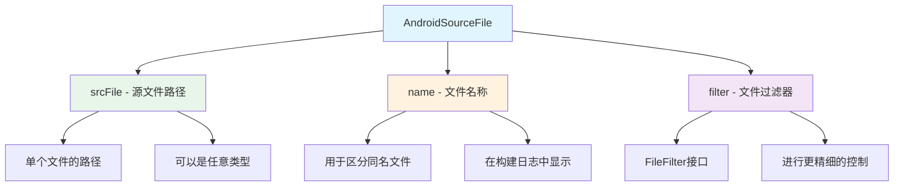
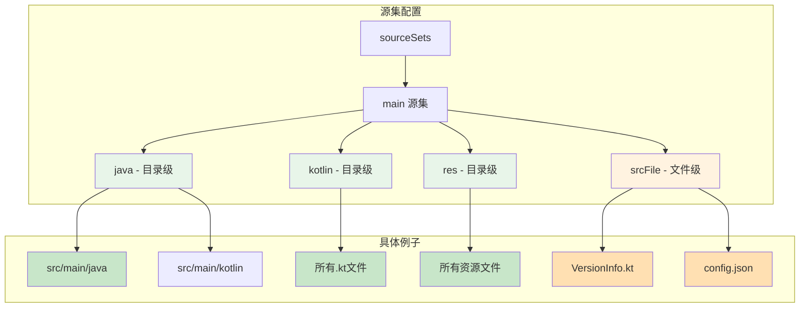
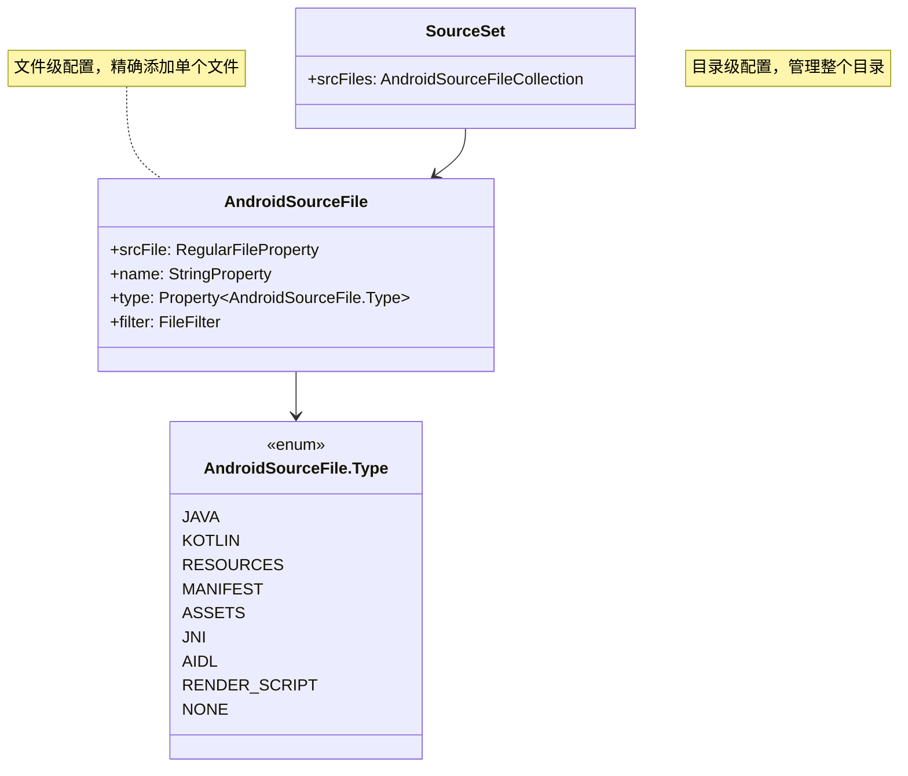

# 21.1.67 AndroidSourceFile

夕阳西斜，金色的光芒洒在湖面上，像是有人不小心打翻了一盒珠宝。

洛芙伸了个懒腰，满足地叹了口气：“今天的源目录配置好棒啊！感觉对代码的组织方式清楚多了！”

伊莎轻轻梳理着被晚风吹乱的长发：“洛芙进步真快呢～上午还是一头雾水，下午就已经能自己配置sourceSets了～”

“哪里哪里！”洛芙不好意思地挠挠头，“都是黛琳和希尔教得好！”

希尔正在收拾笔记本，听到这话抬起头来：“别急着夸自己啊，我还有更酷的东西没讲呢！”

“还有？”洛芙的眼睛亮了起来。

黛琳笑着递过来一块小点心：“下午我们学了源目录——但有时候，我们不需要整个目录，只需要添加一个单独的文件该怎么办呢？”

洛芙歪着头想了想：“单独……文件？”

“对！”希尔兴奋地打了个响指，“比如说——你想在构建时动态插入一个版本信息文件，或者想添加一个只有特定版本才有的配置文件？”

伊莎轻声道：“这就需要用到AndroidSourceFile了——它是用来管理单个源文件的。”

“单个源文件？”洛芙好奇地问，“不是目录，而是文件？”

黛琳点头道：“AndroidSourceFile是Android Gradle Plugin提供的DSL，专门用于配置单个源文件。它和AndroidSourceDirectorySet是配套使用的——一个是目录级别，一个是文件级别。”

洛芙好奇地问：“那……它能做什么呢？”

希尔 grins（露出灿烂的笑容）：“能做的事情可多了！让我一个个给你讲！”

她拿起一根树枝，在地上画了起来：



“这个图展示了AndroidSourceFile的三个核心属性，”黛琳讲解道，“srcFile是源文件的路径，name是文件的名称（用于区分同名文件），filter是文件过滤器。”

洛芙似懂非懂地点点头：“那……它和源目录有什么区别呢？”

“好问题！”希尔抢答道，“源目录是一整个文件夹，里面的所有文件都会被包含。但源文件是精确制导——只添加那一个文件！”

伊莎柔声补充道：“就像露营的时候——源目录就像是整个炊事区域，里面锅碗瓢盆都有；源文件就像是单独带的一个特制调味酱，只在需要的时候才添加进去。”

洛芙恍然大悟：“原来如此！那……具体怎么用呢？”

希尔露出灿烂的笑容：“让我来给你演示一下！”

她在笔记本上敲了起来：

```kotlin
// AndroidSourceFile 配置示例

android {
    sourceSets {
        // 在 main 源集中添加单个源文件
        getByName("main") {
            // 使用 srcFile 添加单个文件
            // srcFile() 接受一个 File 对象或字符串路径
            srcFile("src/main/java/com/example/VersionInfo.kt")
            
            // 给文件起个名字，方便在构建日志中识别
            // name 属性是可选的，但推荐设置
            srcFile("src/main/assets/config.json") {
                name = "app-config"
            }
            
            // 使用 withSourcesJar 生成源文件 JAR
            // 这在发布库时很有用
            java.srcFile("src/main/java/Utils.java") {
                name = "utility-class"
            }
        }
        
        // 在 androidTest 源集中添加测试专用的配置文件
        getByName("androidTest") {
            // 添加测试专用的 mock 数据文件
            srcFile("src/androidTest/assets/mock_users.json") {
                name = "mock-data"
            }
        }
        
        // 使用 create() 创建自定义源集并添加源文件
        create("free") {
            srcFile("src/free/java/AdManager.kt")
            srcFile("src/free/assets/ad_config.xml")
        }
        
        create("paid") {
            // 付费版没有广告相关文件
            // 这里留空，或者添加付费版特有的文件
        }
    }
}

// 使用 android.sourceBlocks 添加源文件（另一种方式）
android {
    sourceBlocks {
        register<AndroidSourceFile>("customSourceFile") {
            // 设置源文件路径
            srcFile.set(file("src/main/java/com/example/CustomProcessor.kt"))
            
            // 设置名称
            name.set("custom-processor")
            
            // 设置文件类型
            // 可以是 JAVA, KOTLIN, RESOURCES, MANIFEST, ASSETS, JNI, AIDL, RENDER_SCRIPT, NONE
            type.set(AndroidSourceFile.Type.JAVA)
        }
        
        register<AndroidSourceFile>("configFile") {
            srcFile.set(file("src/main/assets/app.properties"))
            name.set("app-properties")
            type.set(AndroidSourceFile.Type.RESOURCES)
        }
    }
}

// 实际项目中的典型用法

// 1. 添加动态生成的版本信息文件
tasks.register<WriteVersionFileTask>("writeVersionFile") {
    outputFile.set(file("$buildDir/generated/version.txt"))
}

android {
    sourceSets {
        getByName("main") {
            // 在构建后添加生成的文件
            srcFile(tasks.named<WriteVersionFileTask>("writeVersionFile").map { it.outputFile.get() }) {
                name = "version-info"
            }
        }
    }
}

// 2. 根据构建类型添加不同的配置文件
android {
    sourceSets {
        getByName("debug") {
            // Debug 版本添加调试专用配置
            srcFile("src/debug/assets/debug_config.json") {
                name = "debug-config"
            }
        }
        
        getByName("release") {
            // Release 版本添加发布专用配置
            srcFile("src/release/assets/release_config.json") {
                name = "release-config"
            }
        }
    }
}

// 3. 根据产品风味添加不同的资源文件
android {
    flavorDimensions += "version"
    productFlavors {
        create("free") {
            dimension = "version"
            // 免费版添加广告配置文件
            srcFile("src/free/assets/ad_settings.xml") {
                name = "ad-settings"
            }
        }
        
        create("paid") {
            dimension = "version"
            // 付费版添加付费功能配置文件
            srcFile("src/paid/assets/premium_settings.xml") {
                name = "premium-settings"
            }
        }
    }
}

// 4. 使用 Kotlin DSL 配置源文件
android {
    sourceSets {
        named("main") {
            // Kotlin DSL 风格的配置
            val customFile by registering(AndroidSourceFile::class) {
                srcFile.set(file("src/main/java/CustomPlugin.kt"))
                name.set("custom-plugin")
                type.set(AndroidSourceFile.Type.KOTLIN)
            }
        }
    }
}
```

“太棒了！”洛芙拍手道，“原来可以这样精确控制单个文件！”

黛琳补充道：“AndroidSourceFile和AndroidSourceDirectorySet配合使用，可以实现非常精细的源代码组织。”

洛芙好奇地问：“那……它们两个可以一起用吗？”

希尔点头道：“当然可以！而且在真实项目中，我们通常会同时使用它们！”

她在白板上画出了两者的配合关系：



“这个图展示了目录级配置和文件级配置的区别与联系，”黛琳讲解道，“目录级配置（java、kotlin、res）处理某一类型的所有文件，而文件级配置（srcFile）可以精确添加单个文件。”

洛芙好奇地问：“那……在实际项目中，什么时候该用目录级，什么时候该用文件级呢？”

伊莎轻轻拨了拨耳边的发丝：“问得好呢～”

她继续说道：“大多数情况下，我们使用目录级配置——因为一个目录里的文件通常属于同一类型。但有时候，我们需要添加一些'例外'的文件——”

“对！”希尔接过话题，“比如你想在Java源目录里添加一个Kotlin文件，或者想根据构建类型添加不同的配置文件，这时候就需要源文件级配置了！”

洛芙明白了：“原来如此！那……有没有什么需要注意的地方呢？”

黛琳点头道：“有的！使用AndroidSourceFile时，有几个常见的坑需要避免。”

她在白板上写了起来：

```kotlin
// 反模式 vs 正确写法

// ❌ 反模式1：不存在的文件路径
android {
    sourceSets {
        getByName("main") {
            // 错误的写法：文件不存在会导致构建失败
            srcFile("src/main/java/NonExistent.kt")
        }
    }
}

// ✅ 正确写法1：使用条件判断
android {
    sourceSets {
        getByName("main") {
            // 检查文件是否存在
            val versionFile = file("src/main/java/VersionInfo.kt")
            if (versionFile.exists()) {
                srcFile(versionFile) {
                    name = "version-info"
                }
            }
        }
    }
}

// ❌ 反模式2：重复添加同一文件
android {
    sourceSets {
        getByName("main") {
            // java.srcDirs 已经包含了整个目录
            java.srcDirs("src/main/java")
            // 这里又单独添加目录里的一个文件，会导致重复
            srcFile("src/main/java/Utils.kt")
        }
    }
}

// ✅ 正确写法2：明确区分目录和文件
android {
    sourceSets {
        getByName("main") {
            // 使用目录级配置
            java.srcDirs("src/main/java")
            // 只添加不在目录中的单独文件
            srcFile("src/generated/GeneratedCode.kt")
        }
    }
}

// ❌ 反模式3：混淆文件类型
android {
    sourceSets {
        getByName("main") {
            // 把资源文件当源代码文件添加
            srcFile("src/main/res/values/strings.xml") {
                name = "strings"
                type.set(AndroidSourceFile.Type.JAVA)  // 错误！
            }
        }
    }
}

// ✅ 正确写法3：正确设置文件类型
android {
    sourceSets {
        getByName("main") {
            srcFile("src/main/res/values/strings.xml") {
                name = "strings"
                type.set(AndroidSourceFile.Type.RESOURCES)  // 正确
            }
        }
    }
}

// ❌ 反模式4：在循环中大量添加单个文件
android {
    sourceSets {
        getByName("main") {
            // 错误的做法：效率很低
            listOf("A.kt", "B.kt", "C.kt", "D.kt", "E.kt").forEach { fileName ->
                srcFile("src/main/java/$fileName")
            }
        }
    }
}

// ✅ 正确写法4：使用目录级配置或 FileTree
android {
    sourceSets {
        getByName("main") {
            // 正确做法1：直接使用目录
            java.srcDirs("src/main/java")
            
            // 正确做法2：使用 FileTree
            java.srcDirs(fileTree("src/main/java") {
                include("A.kt", "B.kt", "C.kt")
            })
        }
    }
}
```

洛芙看得眼睛都直了：“原来有这么多要注意的地方！”

希尔 grinning（露出灿烂的笑容）：“这些都是实战中总结出来的经验！”

她继续说道：“现在让我们来一个综合练习——模拟一个真实项目场景！”

“真实项目场景？”洛芙兴奋地问，“快讲快讲！”

希尔清了下嗓子：“比如说——我们要开发一个App，需要根据不同的渠道（渠道A、渠道B、渠道C）添加不同的配置文件。”

她在笔记本上敲了起来：

```kotlin
// 真实项目示例：多渠道配置文件管理

android {
    // 定义渠道维度
    flavorDimensions += "channel"
    
    productFlavors {
        // 渠道A
        create("channelA") {
            dimension = "channel"
            // 为渠道A添加专用配置文件
            sourceSets {
                getByName("main") {
                    srcFile("src/channelA/assets/channel_a_config.json") {
                        name = "channel-a-config"
                    }
                    // 添加渠道A特有的工具类
                    srcFile("src/channelA/java/ChannelAUtils.kt") {
                        name = "channel-a-utils"
                    }
                }
            }
        }
        
        // 渠道B
        create("channelB") {
            dimension = "channel"
            sourceSets {
                getByName("main") {
                    srcFile("src/channelB/assets/channel_b_config.json") {
                        name = "channel-b-config"
                    }
                    srcFile("src/channelB/java/ChannelBUtils.kt") {
                        name = "channel-b-utils"
                    }
                }
            }
        }
        
        // 渠道C - 海外版
        create("channelC") {
            dimension = "channel"
            // 海外版需要额外的本地化配置
            sourceSets {
                getByName("main") {
                    srcFile("src/channelC/assets/channel_c_config.json") {
                        name = "channel-c-config"
                    }
                    // 添加国际化资源
                    srcFile("src/channelC/res/values-en/strings.xml") {
                        name = "english-strings"
                    }
                }
            }
        }
    }
    
    // 构建类型配置
    buildTypes {
        debug {
            // Debug 版本添加测试用的配置文件
            sourceSets {
                getByName("debug") {
                    srcFile("src/debug/assets/test_config.json") {
                        name = "test-config"
                    }
                }
            }
        }
        
        release {
            // Release 版本不包含调试配置
            // 可以在这里做清理
        }
    }
}

// 运行时读取配置文件示例
class ConfigManager(private val context: Context) {
    
    fun loadChannelConfig(): ChannelConfig {
        val fileName = "channel_config.json"
        return try {
            val json = context.assets.open(fileName).bufferedReader().use { it.readText() }
            Gson().fromJson(json, ChannelConfig::class.java)
        } catch (e: Exception) {
            // 如果文件不存在，使用默认配置
            ChannelConfig.default()
        }
    }
    
    data class ChannelConfig(
        val channelId: String,
        val apiEndpoint: String,
        val enableAnalytics: Boolean
    ) {
        companion object {
            fun default() = ChannelConfig(
                channelId = "default",
                apiEndpoint = "https://api.example.com",
                enableAnalytics = true
            )
        }
    }
}
```

洛芙看完后惊叹道：“这样就可以精细控制不同渠道的不同文件了！”

“对！”黛琳点头道，“而且这种方式还有一个好处——构建时只添加对应渠道的文件，不会混淆。”

伊莎轻声说道：“就像露营时，不同的营地使用不同的装备——渠道A用A的装备，渠道B用B的装备，互不干扰～”

洛芙想象了一下那个场景：“以后我也要这样精细地管理配置文件！”

她低头看了看手表：“哎呀，都傍晚了！太阳快下山了！”

确实，夕阳已经快要沉入湖面了，天边的云彩被染成了橙红色。

黛琳收拾着白板：“今天我们学了AndroidSourceFile——Android源文件配置。它可以和AndroidSourceDirectorySet配合使用，实现精细的源代码组织。”

“对！”希尔总结道，“srcFile()添加单个文件，name设置文件名称，type设置文件类型。文件级配置让我们可以精确控制每个文件的添加方式。”

“谢谢黛琳！谢谢希尔！”洛芙裹紧薄外套，“今天又学到了新东西！源目录和源文件配合使用，就像露营时既有整个区域的规划，又有单独的特制装备！”

伊莎轻轻拨了拨被晚风吹乱的刘海：“技术的世界真是越学越有趣了呢～”

远处传来一阵鸟鸣声，夕阳的余晖在湖面上闪烁。夏天傍晚的露营，真是美好极了。

---

## 专业技术总结

> **AndroidSourceFile** 是 Android Gradle Plugin 提供的源文件配置 DSL，用于在 Android 项目中添加单个源文件到源集。它与 AndroidSourceDirectorySet（目录级配置）配合使用，实现从目录到文件的精细化源代码管理。AndroidSourceFile 通过 srcFile 属性指定具体文件，通过 name 属性标识文件，通过 type 属性定义文件类型。

#### 结构图



#### 核心属性与配置

| 属性 | 类型 | 说明 |
|------|------|------|
| srcFile | RegularFileProperty | 源文件的路径，必填 |
| name | StringProperty | 文件名称，用于标识和日志，可选但推荐设置 |
| type | Property<Type> | 文件类型（JAVA、KOTLIN、RESOURCES等），影响构建处理方式 |
| filter | FileFilter | 文件过滤器，可进行更精细的控制 |

#### 文件类型详解

AndroidSourceFile.Type 枚举定义了不同的文件类型：
- **JAVA**: Java 源代码文件
- **KOTLIN**: Kotlin 源代码文件
- **RESOURCES**: Android 资源文件
- **MANIFEST**: AndroidManifest.xml 文件
- **ASSETS**: assets 目录下的资源文件
- **JNI**: JNI 原生代码文件
- **AIDL**: AIDL 接口定义文件
- **RENDER_SCRIPT**: RenderScript 文件
- **NONE**: 未分类文件

#### 与 AndroidSourceDirectorySet 的区别

| 特性 | AndroidSourceDirectorySet | AndroidSourceFile |
|------|---------------------------|-------------------|
| 粒度 | 目录级（整个目录） | 文件级（单个文件） |
| 灵活性 | 低（按类型批量处理） | 高（精确控制） |
| 性能 | 高（批量处理） | 低（逐个处理） |
| 适用场景 | 大多数情况 | 特殊配置、动态文件 |

#### 反模式与陷阱

1. **添加不存在的文件**：构建时会失败，应先检查文件是否存在。

2. **目录和文件重复配置**：如果在 srcDirs 中已经包含了整个目录，又单独添加目录中的某个文件，会导致重复。

3. **文件类型设置错误**：将资源文件设置为源代码类型会导致构建问题，应根据文件实际类型正确设置。

4. **在循环中大量使用**：大量使用 srcFile 添加单个文件效率很低，应该使用目录级配置或 FileTree。

5. **忽略文件存在性检查**：在多模块项目中，某些文件可能只在特定条件下存在，应该使用条件判断。

#### 设计哲学

AndroidSourceFile 体现了 Android 构建系统的**精细化控制**理念：
- 目录级配置处理常规情况，简洁高效
- 文件级配置处理特殊情况，精确灵活
- 两者配合使用，兼顾效率与灵活性
- 通过文件类型区分，实现针对性的构建处理
- 支持动态文件和条件配置，满足高级需求

---

> 学习建议：在实际项目中，优先使用目录级配置（AndroidSourceDirectorySet）处理大多数文件。只有在需要添加例外文件、动态文件或根据构建变体添加不同配置时，才使用 AndroidSourceFile。合理使用两种配置，可以实现既规范又灵活的项目结构。

---

## 洛芙的小小日记本

今天希尔讲了AndroidSourceFile——单个源文件配置！原来除了源目录，还可以精确添加单个文件～srcFile是文件路径，name是文件名称，type是文件类型。和源目录配合使用，就像露营时有整体规划也有特别装备！精细控制太重要了～

---

## 今日关键词

- **AndroidSourceFile**: Android Gradle Plugin的单个源文件配置DSL
- **srcFile**: 源文件路径属性
- **name**: 文件名称属性，用于标识和日志
- **type**: 文件类型属性（Java/Kotlin/Resources等）
- **filter**: 文件过滤器
- **AndroidSourceFile.Type**: 源文件类型枚举
- **AndroidSourceDirectorySet**: 目录级源配置
- **sourceSets**: Gradle源集配置块
- **productFlavor**: 产品风味（渠道/版本等）
- **buildType**: 构建类型（debug/release）
- **FileTree**: Gradle文件树结构
- **RegularFileProperty**: Gradle文件属性类型
- **精细化控制**: 通过目录级和文件级配置实现精确管理
- **条件配置**: 根据构建变体动态添加文件
