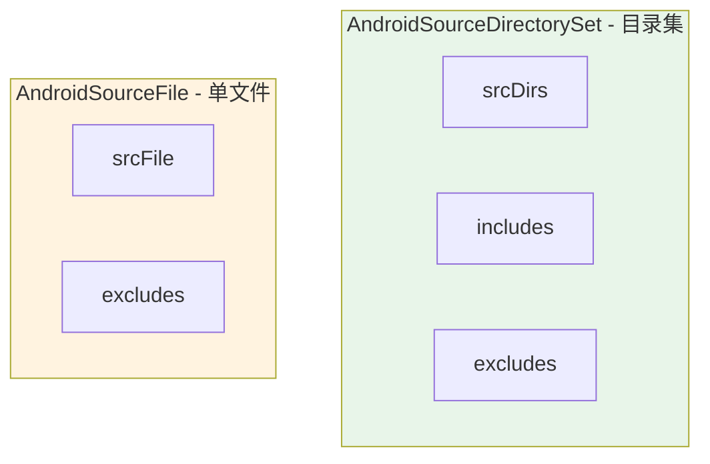
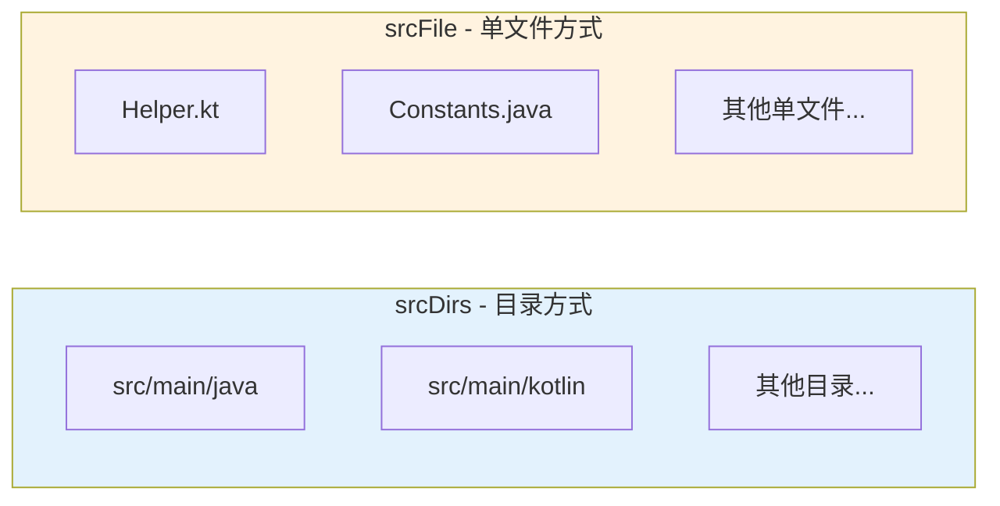
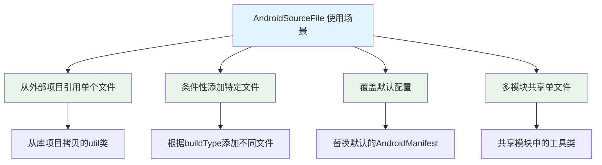
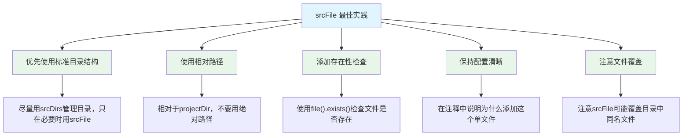
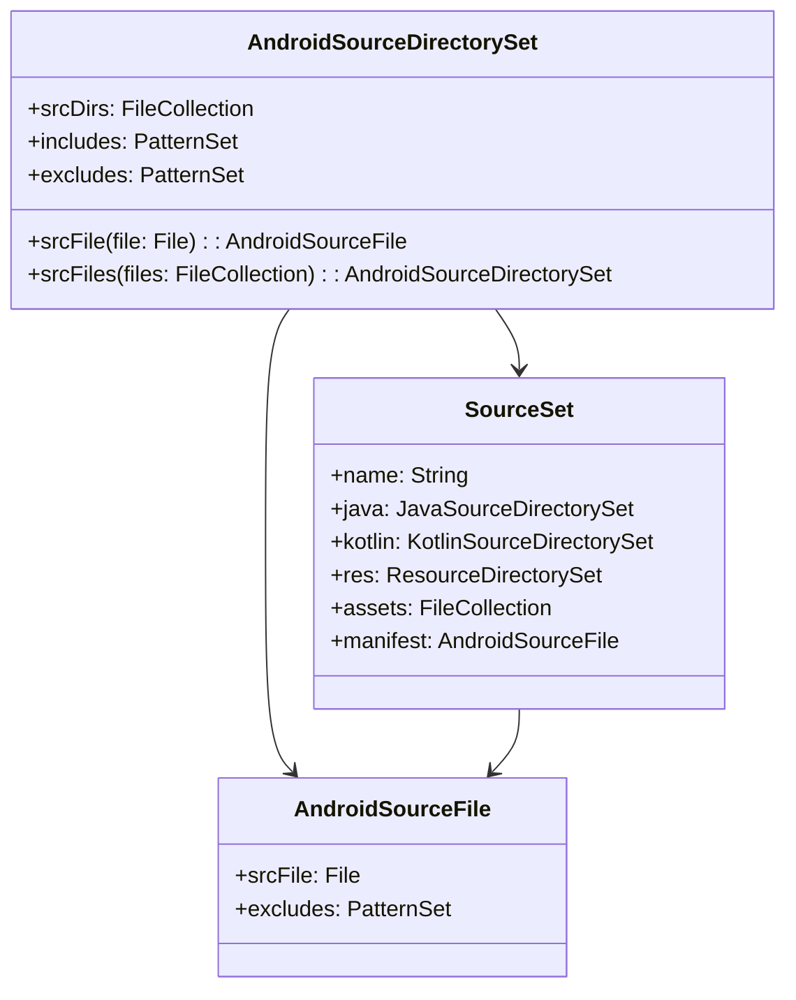

# 21.1.67 AndroidSourceFile

午后的湖边，蝉鸣声一浪高过一浪，热气从地面蒸腾而上，却被茂密的树冠阻挡在外，留下斑驳的光影。

洛芙用草帽扇着风，眼睛盯着笔记本屏幕上的一大串代码。刚才希尔讲的AndroidSourceDirectorySet让她大开眼界——原来源代码也可以像露营装备一样分门别类地整理。

“黛琳，”洛芙忽然想到一个问题，“我刚才听懂了目录的配置方法。可是……如果我想添加一个单独的文件，而不是整个目录，该怎么做呢？”

伊莎正在整理耳边被风吹乱的发丝，听到这个问题不禁微微一笑：“洛芙问得真仔细呢。”

黛琳轻轻点了点头：“好问题。实际上，有时候我们不需要整个目录，只需要添加某个特定的文件——这时候就需要用到AndroidSourceFile了。”

“单个文件？”洛芙眨了眨眼，“就像露营时，我只带一个小盒子，而不是整个背包？”

“Exactly！”希尔不知道什么时候又钻了出来，手里还拿着一盒草莓大福，“想象一下——你有一个特殊的魔法道具，只需要单独那一个文件，而不是一堆文件放在目录里。”

黛琳笑着补充道：“AndroidSourceFile就是用来配置单个源文件的DSL。它属于AndroidSourceDirectorySet的一部分，但专注于处理单个文件。”

她在白板上画出了一个简单的对比图：



“这个图展示了目录集和单个文件配置的区别，”黛琳讲解道，“目录集管理一堆文件，而单个文件配置只关注一个文件。”

洛芙好奇地问：“那……什么时候会用到单独添加一个文件呢？”

希尔举起一根手指：“好问题！比如说——你想添加一个从别的项目拷贝过来的工具类，但不想移动整个目录！”

“对！”黛琳点头道，“或者你想覆盖某个默认文件，用自己修改过的版本。”

伊莎轻声说道：“就像露营时，你想把家里带来的特别配方酱料单独加进去，而不是把整个调味包都倒进去。”

洛芙“扑哧”一声笑了出来：“伊莎的比喻总是这么生动！”

希尔 grinning（露出灿烂的笑容）：“让我来写一个完整的示例！”

她在笔记本上敲了起来：

```kotlin
// 完整的 AndroidSourceFile 配置示例
android {
    sourceSets {
        getByName("main") {
            // 使用 srcFile 添加单个源文件
            // 参数是文件的相对路径（相对于模块根目录）
            srcFile("src/main/java/com/example/util/Helper.kt")
            
            // 也可以添加多个单文件
            srcFile("src/main/java/com/example/core/Constants.java")
            
            // 添加资源文件
            srcFile("src/main/res/values/strings_custom.xml")
            
            // 添加manifest文件（通常不推荐，但可以做到）
            // manifest.srcFile("src/main/AndroidManifest.xml")
        }
        
        // 测试源集也可以添加单文件
        getByName("test") {
            srcFile("src/test/java/com/example/util/HelperTest.kt")
        }
        
        // Android测试源集
        getByName("androidTest") {
            srcFile("src/androidTest/java/com/example/ExampleInstrumentedTest.kt")
        }
    }
}

// 使用 excludes 排除特定文件（针对单文件）
android {
    sourceSets {
        getByName("main") {
            // 在添加文件时排除特定文件
            // 注意：这里的 excludes 作用于整个源集
            excludes += "**/debug/*"
            excludes += "**/*Test.kt"
        }
    }
}

// 同时使用目录和单文件
android {
    sourceSets {
        getByName("main") {
            // 添加整个目录
            java.srcDirs("src/main/java")
            
            // 额外添加一个单独的Kotlin文件
            srcFile("src/main/kotlin-extra/SpecialFeature.kt")
            
            // 添加整个资源目录
            res.srcDirs("src/main/res")
            
            // 额外添加一个单独的资源文件
            srcFile("src/main/res-extra/special_drawable.xml")
        }
    }
}

// 使用 files() 添加单文件（更灵活的方式）
android {
    sourceSets {
        getByName("main") {
            // 使用 files() 可以添加不在标准目录结构中的文件
            srcFile(file("../shared-module/src/main/java/SharedUtil.kt"))
            
            // 使用相对路径
            srcFile(file("${projectDir}/custom/LocalFile.kt"))
            
            // 组合多个文件
            srcFiles(
                file("src/main/java/FeatureA.kt"),
                file("src/main/java/FeatureB.kt")
            )
        }
    }
}

// 动态添加单文件（基于条件）
android {
    sourceSets {
        getByName("main") {
            // 根据构建类型添加不同的文件
            if (hasProperty("enableCustomFeature")) {
                srcFile("src/main/java/com/example/CustomFeature.kt")
            }
            
            // 根据product flavor添加
            srcFile("src/main/java/com/example/${flavorName}/FlavorSpecific.kt")
        }
    }
}
```

“原来可以这样！”洛芙惊叹道，“可是黛琳，我有一个问题——srcFile和srcDirs到底有什么区别啊？”

黛琳微笑着在白板上画出了另一个对比图：



“这个图展示了两种方式的适用场景，”黛琳讲解道，“srcDirs适合批量添加整个目录的文件，而srcFile适合添加单独的文件。”

希尔补充道：“还有一个关键区别——srcDirs会自动扫描子目录，而srcFile只添加你指定的那一个文件！”

洛芙若有所思地点点头：“也就是说，srcDirs是'把这个房间里的东西都搬进来'，而srcFile是'只搬这个特定的盒子进来'？”

“完全正确！”伊莎轻轻鼓掌，“洛芙的领悟力越来越强了！”

黛琳继续说道：“在实际项目中，srcFile有几个典型的使用场景。”

她在白板上列出了几个场景：



“第一个场景是从外部项目引用单个文件，”黛琳讲解道，“比如说你在另一个项目里有个很棒的Utils类，想拿到这个项目用，但又不想把整个目录都搬过来。”

“对！”希尔接话道，“这时候用srcFile就刚刚好！”

“第二个场景是条件性添加特定文件，”黛琳继续说道，“比如说你的debug版本需要一个特殊的调试类，但release版本不需要。”

洛芙举手提问：“那……第三个场景是覆盖默认配置？是指替换AndroidManifest吗？”

“没错！”黛琳点头道，“默认情况下，Android使用src/main/AndroidManifest.xml。但你可以通过srcFile来指定一个不同的manifest文件——当然，这通常不推荐，因为容易造成混乱。”

伊莎轻声补充：“就像露营时，如果有多个人同时负责搭帐篷，最好提前商量好谁来搭哪个，而不是每个人都搭一个不同的帐篷。”

“最后一个场景是多模块共享单文件，”黛琳说道，“在多模块项目中，如果几个模块都需要某个工具类，可以把它放在共享模块里，其他模块通过srcFile来引用。”

洛芙好奇地问：“那……单文件配置会不会有什么问题啊？”

希尔表情认真起来：“好问题！srcFile确实有一些需要注意的地方。”

她接着写道：

```kotlin
// ⚠️ 反模式与注意事项

// 反模式1：添加不存在的文件
android {
    sourceSets {
        getByName("main") {
            // 危险！如果文件不存在会导致构建失败
            srcFile("src/main/java/NonExistent.kt")
        }
    }
}

// ✅ 正确做法：先检查文件是否存在
android {
    sourceSets {
        getByName("main") {
            val customFile = file("src/main/java/Custom.kt")
            if (customFile.exists()) {
                srcFile(customFile)
            }
        }
    }
}

// 反模式2：路径写错
android {
    sourceSets {
        getByName("main") {
            // 错误：相对路径相对于模块根目录，不是相对于build.gradle
            // 这样写可能会找不到文件
            srcFile("app/src/main/java/Helper.kt")  // ❌ 多余的app/
            
            // 正确：直接写相对于模块根目录的路径
            srcFile("src/main/java/Helper.kt")  // ✅
        }
    }
}

// 反模式3：与srcDirs冲突
android {
    sourceSets {
        getByName("main") {
            // 假设这个目录已经通过srcDirs添加了
            java.srcDirs("src/main/java")
            
            // 又通过srcFile添加该目录下的某个文件
            // 这不会出错，但可能造成混淆
            srcFile("src/main/java/DuplicateFile.kt")
            
            // ⚠️ 注意：Gradle会合并这些配置，不会重复编译
            // 但维护起来可能会让其他开发者困惑
        }
    }
}

// 反模式4：忘记更新所有源集
android {
    sourceSets {
        // 只在main源集添加了文件
        getByName("main") {
            srcFile("src/main/java/Helper.kt")
        }
        
        // 忘记在androidTest和test源集添加对应的测试文件
        // ⚠️ 这会导致测试代码无法访问Helper类
    }
}

// ✅ 正确做法：确保所有相关源集都配置好
android {
    sourceSets {
        getByName("main") {
            srcFile("src/main/java/Helper.kt")
        }
        
        getByName("test") {
            srcFile("src/test/java/HelperTest.kt")
        }
        
        getByName("androidTest") {
            srcFile("src/androidTest/java/HelperInstrumentedTest.kt")
        }
    }
}

// 反模式5：硬编码绝对路径
android {
    sourceSets {
        getByName("main") {
            // ❌ 反模式：使用绝对路径
            srcFile("/Users/username/project/Helper.kt")
            
            // ✅ 正确：使用相对路径或projectDir
            srcFile(file("${projectDir}/src/main/java/Helper.kt"))
            srcFile("src/main/java/Helper.kt")  // 最简洁
        }
    }
}
```

“原来有这么多需要注意的地方！”洛芙感叹道。

希尔点点头：“是啊！使用srcFile时，最好遵循几个原则。”

她在白板上写下了最佳实践：



黛琳补充道：“现在让我给你们展示一个完整的项目示例，演示如何合理地结合使用srcDirs和srcFile。”

她在笔记本上写下了最终的综合示例：

```kotlin
// 综合示例：一个完整的多模块项目配置

// 根项目的 build.gradle
plugins {
    id("com.android.application") version "8.2.0"
    id("org.jetbrains.kotlin.android") version "1.9.20"
}

android {
    namespace = "com.example.myapp"
    compileSdk = 34
    
    defaultConfig {
        applicationId = "com.example.myapp"
        minSdk = 24
        targetSdk = 34
    }
    
    // 源集配置
    sourceSets {
        getByName("main") {
            // 使用srcDirs添加标准目录
            java.srcDirs("src/main/java", "src/main/kotlin")
            res.srcDirs("src/main/res")
            assets.srcDirs("src/main/assets")
            
            // 使用srcFile添加额外的单文件
            // 场景：从共享库引用的工具类
            srcFile("src/main/java/com/example/SharedUtils.kt")
            
            // 场景：条件性添加的配置文件
            if (hasProperty("enableAnalytics")) {
                srcFile("src/main/java/com/example/Analytics.kt")
            }
            
            // 场景：特定的编译变体文件
            srcFile("src/main/java/com/example/EnvironmentConfig_${buildType}.kt")
            
            // manifest文件
            manifest.srcFile("src/main/AndroidManifest.xml")
        }
        
        getByName("test") {
            java.srcDirs("src/test/java")
            srcFile("src/test/java/com/example/TestConfig.kt")
        }
        
        getByName("androidTest") {
            java.srcDirs("src/androidTest/java")
            srcFile("src/androidTest/java/com/example/InstrumentedTestConfig.kt")
        }
        
        // 自定义源集：免费版
        create("free") {
            java.srcDirs("src/free/java")
            res.srcDirs("src/free/res")
            // 免费版特有的单文件
            srcFile("src/free/java/com/example/AdsConfig.kt")
        }
        
        // 自定义源集：付费版
        create("paid") {
            java.srcDirs("src/paid/java")
            res.srcDirs("src/paid/res")
            // 付费版特有的单文件（无广告配置）
            srcFile("src/paid/java/com/example/NoAdsConfig.kt")
        }
    }
}

// 构建变体配置
android {
    buildTypes {
        debug {
            isDebuggable = true
            // debug版本添加调试工具文件
            sourceSets.getByName("main") {
                srcFile("src/debug/java/com/example/DebugTools.kt")
            }
        }
        release {
            isMinifyEnabled = true
            // release版本排除调试文件
            sourceSets.getByName("main") {
                excludes += "**/debug/**"
            }
        }
    }
    
    flavorDimensions += "version"
    productFlavors {
        create("free") {
            dimension = "version"
            applicationIdSuffix = ".free"
        }
        create("paid") {
            dimension = "version"
            applicationIdSuffix = ".paid"
        }
    }
}

// 依赖配置
dependencies {
    //  usual dependencies
    implementation("androidx.core:core-ktx:1.12.0")
    implementation("androidx.appcompat:appcompat:1.6.1")
    implementation("com.google.android.material:material:1.11.0")
    
    // 测试依赖
    testImplementation("junit:junit:4.13.2")
    androidTestImplementation("androidx.test.ext:junit:1.1.5")
    androidTestImplementation("androidx.test.espresso:espresso-core:3.5.1")
}

// 任务：验证源集配置
tasks.register<Copy>("verifySourceSets") {
    description = "列出所有源集的源文件用于验证"
    
    doLast {
        android.sourceSets.forEach { sourceSet ->
            println("=== ${sourceSet.name} ===")
            println("Java/Kotlin: ${sourceSet.java.srcDirs}")
            println("Res: ${sourceSet.res.srcDirs}")
            println("Assets: ${sourceSet.assets.srcDirs}")
            println("Manifest: ${sourceSet.manifest.srcFile}")
        }
    }
}
```

“太棒了！”洛芙拍手道，“这样就能灵活地管理源代码了！”

黛琳微笑道：“记住，srcFile和srcDirs都是源集配置的工具。srcDirs是主力，负责添加标准的目录结构；srcFile是补充，用来处理特殊的单文件需求。”

“对！”希尔总结道，“就像露营时，大部分装备放在背包里（目录），但有些特别重要的东西（单文件）要随身带着。”

伊莎轻声补充：“最重要的，是清楚知道每样东西放在哪里——这样才能在需要的时候快速找到它。”

洛芙若有所思地点点头：“我明白了！目录是'营地'，单文件是'随身带的魔法道具'。根据需要选择合适的方式！”

她低头看了看手表：“哎呀，都下午了！太阳好晒啊！”

确实，阳光已经从温和变得炽热起来，湖水在阳光下闪闪发光。远处的山峦轮廓清晰，天空湛蓝高远。

黛琳收拾着白板：“今天我们学了AndroidSourceFile——Android单个源文件配置。它能让你的源代码管理更加精细。”

“对！”希尔补充道，“srcFile用来添加单个文件，srcDirs用来添加整个目录。两者结合使用，才能达到最佳效果！”

“谢谢黛琳！谢谢希尔！”洛芙裹紧防晒衣，“原来代码文件也可以像露营装备一样——有的需要整个背包（目录），有的只需要一个小盒子（单文件）！”

伊莎轻轻拨了拨被风吹乱的刘海，柔声说道：“露营时选择合适的收纳方式能让旅程更轻松，编程中选择合适的源文件管理方式能让项目更清晰。”

远处传来一阵鸟鸣声，似乎在为她们的知识探索伴奏。夏天真好，露营真好，学习新东西的时光，更好。

---

## 专业技术总结

> **AndroidSourceFile** 是 Android Gradle Plugin 提供的单个源文件配置 DSL，用于在 sourceSets 中添加特定的源文件。它与 AndroidSourceDirectorySet（目录集）配合使用，让开发者能够精细控制哪些文件参与构建，实现灵活的项目结构管理。

#### 结构图



#### 核心属性与配置

| 属性 | 类型 | 说明 |
|------|------|------|
| srcFile | File | 添加单个源文件（相对于模块根目录） |
| srcFiles | FileCollection | 添加多个源文件（使用files()） |
| excludes | PatternSet | 排除特定文件模式 |
| manifest | AndroidSourceFile | manifest文件专用配置 |

#### srcFile vs srcDirs

| 特性 | srcDirs | srcFile |
|------|---------|---------|
| 作用 | 添加整个目录 | 添加单个文件 |
| 扫描 | 自动扫描子目录 | 只添加指定文件 |
| 适用场景 | 标准目录结构 | 特殊文件、共享文件 |
| 灵活性 | 低 | 高 |
| 推荐程度 | 首选 | 补充 |

#### 使用场景

1. **从外部项目引用单个文件**：引用其他项目的工具类而不移动整个目录
2. **条件性添加文件**：根据buildType、flavor或属性添加不同文件
3. **覆盖默认配置**：替换默认的AndroidManifest等
4. **多模块共享单文件**：共享模块中的工具类

#### 反模式与陷阱

1. **添加不存在的文件**：会导致构建失败，应使用file().exists()检查
2. **路径写错**：相对路径相对于模块根目录，不是build.gradle所在目录
3. **与srcDirs冲突**：可能造成混淆，建议添加注释说明
4. **忘记更新所有源集**：测试代码可能无法访问新添加的类
5. **使用绝对路径**：会导致项目无法在其他机器上构建

#### 设计哲学

AndroidSourceFile体现了Android构建系统的**灵活性**理念：
- 与AndroidSourceDirectorySet配合使用，实现粗粒度（目录）和细粒度（文件）的双重管理
- 通过条件性添加支持不同构建变体的差异化配置
- 保持与Gradle生态系统的兼容性
- 强调配置的可维护性和可读性
- 让源集配置既规范又灵活

---

> 学习建议：在实际项目中，优先使用标准的目录结构（srcDirs）来管理源代码。只有在特殊场景下才使用srcFile——比如引用外部单文件、条件性配置、或特定的多模块共享场景。无论使用哪种方式，都要在代码中添加清晰的注释，说明为什么这样配置。

---

## 洛芙的小小日记本

今天黛琳和希尔讲了AndroidSourceFile——单个源文件配置！原来代码文件管理也有这么多门道——srcDirs是放整个目录，srcFile是放单个文件。就像露营时，背包放装备（目录），小盒子放随身道具（单文件）！要根据需要选择合适的方式~

---

## 今日关键词

- **AndroidSourceFile**: Android Gradle Plugin的单个源文件配置DSL
- **srcFile**: 用于添加单个源文件的方法
- **srcFiles**: 用于添加多个源文件的方法（使用FileCollection）
- **sourceSets**: Gradle中管理源集的配置块
- **srcDirs**: 源代码目录列表（批量添加）
- **main**: 主源代码集
- **test**: 单元测试源代码集
- **androidTest**: Android仪器化测试源代码集
- **buildType**: 构建变体（debug/release）
- **flavor**: 产品风味（free/paid等）
- **FileCollection**: Gradle中代表一组文件的接口
- **PatternSet**: 文件名模式匹配集合
- **excludes**: 排除的文件模式
- **manifest**: Android清单文件配置
- **相对路径**: 相对于模块根目录的路径
- **模块化**: 将代码组织成独立可复用模块的做法
- **源集**: 一组源代码文件和资源文件的集合
