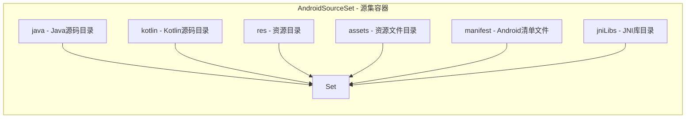
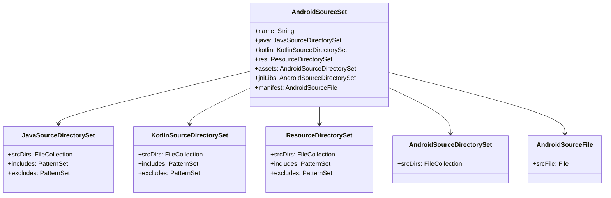
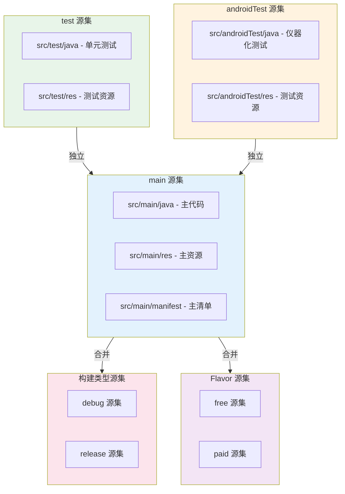
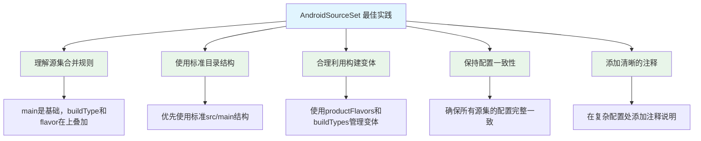
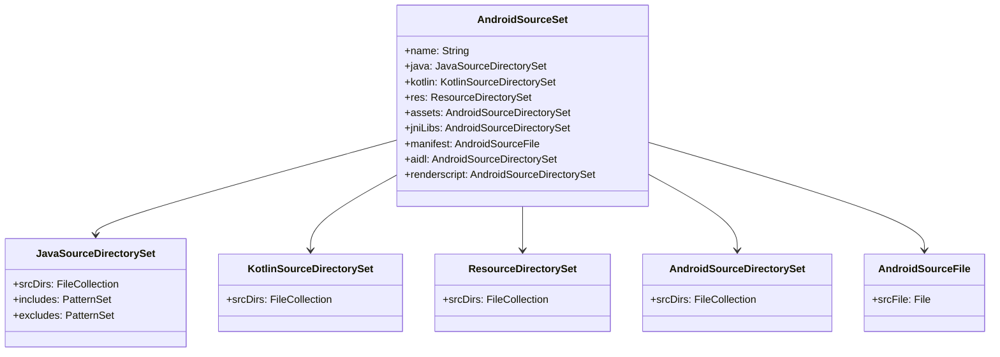

# 21.1.68 AndroidSourceSet

夕阳慢慢下沉，把湖面染成了橘红色。

洛芙伸了个懒腰，发现自己的身体已经完全放松下来了。刚才希尔讲的AndroidSourceFile让她大开眼界——原来代码文件也可以像露营装备一样精细管理。

“洛芙，你有没有想过一个问题？”黛琳忽然开口。

“什么问题？”洛芙歪着头看向黛琳。

“我们之前学了AndroidSourceFile——单个文件的配置方法。”黛琳微微一笑，“但是，如果把所有这些配置——文件、目录、资源、清单——全部放在一起管理，该怎么做呢？”

洛芙愣住了：“这个……难道不是分开管理的吗？”

伊莎轻轻拨了拨耳边的发丝：“洛芙问得好。其实在Android构建系统里，所有这些配置都被组织在一个叫做'源集'的概念里。”

“源集？”洛芙眨了眨眼，“就像……一个大的露营背包，然后把所有装备都放进去？”

“Exactly！”希尔不知道什么时候又冒了出来，手里还拿着半根冰棍，“源集就是一个大容器，把所有的源代码、资源的配置都装在一起！”

黛琳点点头：“AndroidSourceSet就是Android Gradle Plugin提供的源集配置DSL。它就像一个指挥官，负责协调所有的源代码配置。”

她在白板上画出了一个简单的结构图：



“这个图展示了AndroidSourceSet的整体结构，”黛琳讲解道，“它包含多个子配置对象，每个对象负责管理特定类型的源文件。”

洛芙好奇地问：“那……这些配置之间是什么关系呢？”

“好问题！”黛琳又在白板上画了起来，“让我用一个更详细的图来解释。”



“这个类图展示了AndroidSourceSet的完整结构，”黛琳讲解道，“每个属性都对应一种源文件类型的配置。”

希尔补充道：“简单来说，AndroidSourceSet就像一个大家庭的家长，下面管着好几个孩子——java、kotlin、res、assets、jniLibs、manifest，每个孩子都有自己的职责。”

伊莎轻声笑道：“就像露营时，黛琳是队长，下面有负责搭帐篷的、准备食材的、收拾装备的……每个人各司其职。”

洛芙“扑哧”一声笑了出来：“这样比喻我就懂了！那……我们怎么配置这个源集呢？”

黛琳微笑着说：“让我来给你们展示一个完整的配置示例。”

她在笔记本上敲了起来：

```kotlin
// AndroidSourceSet 完整配置示例

android {
    // 源集配置块
    sourceSets {
        // 主源集 - 存放主要的源代码和资源
        getByName("main") {
            // 配置 Java 源码目录
            // java 是 JavaSourceDirectorySet 类型
            java.srcDirs("src/main/java", "src/main/kotlin")
            
            // 配置 Kotlin 源码目录（与java共享）
            kotlin.srcDirs("src/main/kotlin")
            
            // 配置资源目录
            // res 是 ResourceDirectorySet 类型
            res.srcDirs(
                "src/main/res",
                "src/main/res-extra"
            )
            
            // 配置资产目录
            // assets 是 AndroidSourceDirectorySet 类型
            assets.srcDirs("src/main/assets")
            
            // 配置 JNI 本地库目录
            jniLibs.srcDirs("src/main/jniLibs")
            
            // 配置 AndroidManifest
            manifest.srcFile("src/main/AndroidManifest.xml")
            
            // 配置 Aidl 源文件目录
            aidl.srcDirs("src/main/aidl")
            
            // 配置 RenderScript 源文件目录
            renderscript.srcDirs("src/main/rs")
            
            // 配置 CMake 或 ndk-build 配置
            // externalNativeBuild 是在 buildTypes 或 productFlavors 中配置的
        }
        
        // 测试源集 - 单元测试
        getByName("test") {
            java.srcDirs("src/test/java")
            res.srcDirs("src/test/res")
        }
        
        // Android 测试源集 - 仪器化测试
        getByName("androidTest") {
            java.srcDirs("src/androidTest/java")
            res.srcDirs("src/androidTest/res")
        }
        
        // 自定义源集 - 免费版
        create("free") {
            java.srcDirs("src/free/java")
            res.srcDirs("src/free/res")
            assets.srcDirs("src/free/assets")
            manifest.srcFile("src/free/AndroidManifest.xml")
        }
        
        // 自定义源集 - 付费版
        create("paid") {
            java.srcDirs("src/paid/java")
            res.srcDirs("src/paid/res")
            assets.srcDirs("src/paid/assets")
            manifest.srcFile("src/paid/AndroidManifest.xml")
        }
        
        // debug 构建类型专用的源集
        getByName("debug") {
            java.srcDirs("src/debug/java")
            res.srcDirs("src/debug/res")
        }
        
        // release 构建类型专用的源集
        getByName("release") {
            java.srcDirs("src/release/java")
        }
    }
}

// 使用 all 来配置所有源集的公共行为
android.sourceSets.all {
    // 为所有源集添加额外的资源目录
    // 注意：这会影响所有源集，需要谨慎使用
    // excludes += "**/debug/**"
}

// 配置源集之间的继承关系
android {
    sourceSets {
        // free 源集继承 main 源集的配置
        getByName("free") {
            // 继承 main 的 java 目录
            java.srcDirs("src/main/java")
            
            // 添加 free 特有的目录
            java.srcDirs("src/free/java")
        }
    }
}

// 动态配置源集
android {
    sourceSets {
        getByName("main") {
            // 根据项目属性动态添加源目录
            if (hasProperty("enableKotlin")) {
                kotlin.srcDirs("src/main/kotlin")
            }
            
            // 根据 flavor 添加特定目录
            val flavor = if (hasProperty("flavor")) {
                property("flavor").toString()
            } else {
                "default"
            }
            java.srcDirs("src/main-${flavor}/java")
        }
    }
}

// 使用 Kotlin DSL 的类型安全访问
android {
    sourceSets {
        // getByName 返回 AndroidSourceSet
        val mainSourceSet = getByName("main")
        
        // 访问 java 属性（JavaSourceDirectorySet）
        mainSourceSet.java.srcDirs(
            file("src/main/java"),
            file("src/main/kotlin")
        )
        
        // 访问 res 属性（ResourceDirectorySet）
        mainSourceSet.res.srcDirs(
            file("src/main/res")
        )
        
        // 访问 manifest（AndroidSourceFile）
        mainSourceSet.manifest.srcFile(
            file("src/main/AndroidManifest.xml")
        )
    }
}
```

“原来源集可以配置这么多东西！”洛芙惊叹道。

黛琳点点头：“是啊，AndroidSourceSet几乎涵盖了Android项目的所有源代码类型。”

希尔补充道：“而且不同类型的源集还有不同的用途——main是主代码，test是单元测试，androidTest是仪器化测试。”

伊莎轻声说道：“就像露营时有'主力部队'——负责主要工作，还有'后勤部队'——负责测试和保障。”

洛芙好奇地问：“那……这些源集之间有什么关系吗？”

“好问题！”黛琳又在白板上画了起来，“让我解释源集之间的关系。”



“这个图展示了源集之间的关系，”黛琳讲解道，“main源集是最基础的，构建类型源集（debug/release）和flavor源集（free/paid）会与main源集合并，形成最终的编译配置。”

“合并？”洛芙眨了眨眼，“是什么意思？”

“意思就是”——希尔接过话头——“当你配置debug源集时，它的配置会与main源集的配置合并。debug特有的配置会添加到main的配置上。”

“对！”黛琳补充道，“比如说，你在main源集里配置了src/main/java目录，又在debug源集里配置了src/debug/java目录——最终编译时，两个目录的代码都会被包含进去。”

洛裕若有所思地点点头：“也就是说，main是基础，其他源集是在上面的'叠加'？”

“完全正确！”伊莎轻轻鼓掌，“洛芙的领悟力越来越强了！”

黛琳继续说道：“现在让我给你们展示一些常见的源集配置场景。”

她在笔记本上继续写着：

```kotlin
// 场景1：多模块项目中的源集共享

// 根项目的 build.gradle
plugins {
    id("com.android.application") version "8.2.0"
    id("org.jetbrains.kotlin.android") version "1.9.20"
}

// 在模块中引用其他模块的源文件
android {
    sourceSets {
        getByName("main") {
            // 引用 common 模块的 Java 源码
            java.srcDirs("../common/src/main/java")
            
            // 引用 common 模块的资源
            res.srcDirs("../common/src/main/res")
        }
    }
}

// 场景2：根据构建类型条件性配置源集

android {
    sourceSets {
        getByName("debug") {
            // debug 版本添加调试工具类
            java.srcDirs("src/debug/java")
            
            // 添加调试资源
            res.srcDirs("src/debug/res")
            
            // debug 版本使用特殊的 manifest
            manifest.srcFile("src/debug/AndroidManifest.xml")
        }
        
        getByName("release") {
            // release 版本排除调试代码
            // 注意：这只是排除，实际代码分离需要通过 sourceSets 实现
        }
    }
}

// 配置 debug 和 release 使用不同的源集
android {
    sourceSets {
        create("debug") {
            java.srcDirs("src/debug/java")
            res.srcDirs("src/debug/res")
            manifest.srcFile("src/debug/AndroidManifest.xml")
        }
        
        create("release") {
            // 某些情况下，release 可能有不同的源码结构
        }
    }
    
    buildTypes {
        debug {
            // debug 构建使用 debug 源集
            sourceSets.getByName("debug")?.let { debugSet ->
                // debug 的特殊配置
            }
        }
    }
}

// 场景3：根据 productFlavor 配置源集

android {
    flavorDimensions += "version"
    
    productFlavors {
        create("free") {
            dimension = "version"
            applicationIdSuffix = ".free"
            
            // 免费版源集配置
            sourceSets.getByName("free")?.let { freeSet ->
                freeSet.java.srcDirs("src/free/java")
                freeSet.res.srcDirs("src/free/res")
            }
        }
        
        create("paid") {
            dimension = "version"
            applicationIdSuffix = ".paid"
            
            // 付费版源集配置
            sourceSets.getByName("paid")?.let { paidSet ->
                paidSet.java.srcDirs("src/paid/java")
                paidSet.res.srcDirs("src/paid/res")
            }
        }
    }
    
    // flavor 源集会在 main 基础上合并
    sourceSets {
        getByName("free") {
            java.srcDirs("src/free/java")
            res.srcDirs("src/free/res")
            assets.srcDirs("src/free/assets")
            manifest.srcFile("src/free/AndroidManifest.xml")
        }
        
        getByName("paid") {
            java.srcDirs("src/paid/java")
            res.srcDirs("src/paid/res")
            assets.srcDirs("src/paid/assets")
            manifest.srcFile("src/paid/AndroidManifest.xml")
        }
    }
}

// 场景4：源集与构建变体的组合

// 当使用 debug + free 时，源集配置会按以下顺序合并：
// main -> free -> debug
android {
    sourceSets {
        getByName("main") {
            // 基础配置
            java.srcDirs("src/main/java")
        }
        
        getByName("free") {
            // free 叠加在 main 上
            java.srcDirs("src/free/java")
        }
        
        getByName("debug") {
            // debug 再叠加在 free 上
            java.srcDirs("src/debug/java")
        }
    }
}

// 场景5：源集与依赖配置

// 源集还可以用于配置特定源集的依赖
android {
    sourceSets.getByName("main") {
        // 为 main 源集配置依赖
        implementationFileTree(dir: "libs", include: ["*.jar"])
    }
    
    sourceSets.getByName("test") {
        // 为 test 源集配置测试依赖
        // 注意：测试依赖通常在 dependencies 中配置
    }
}
```

“原来源集配置有这么多门道！”洛芙感叹道。

希尔表情认真起来：“是啊！不过在使用源集时，也有一些常见的错误需要注意。”

她继续写道：

```kotlin
// ⚠️ 反模式与注意事项

// 反模式1：源集目录不存在导致构建失败
android {
    sourceSets {
        getByName("main") {
            // 危险！如果不存在的目录会导致构建警告或失败
            java.srcDirs("src/main/java-new")  // 目录不存在
        }
    }
}

// ✅ 正确做法：使用条件判断或 file().exists()
android {
    sourceSets {
        getByName("main") {
            val extraDir = file("src/main/java-extra")
            if (extraDir.exists()) {
                java.srcDirs(extraDir)
            }
        }
    }
}

// 反模式2：源集配置顺序不当导致冲突
android {
    sourceSets {
        // 错误：在 getByName 之后又 create 同名源集
        getByName("main") {
            java.srcDirs("src/main/java")
        }
        
        // 危险：同名源集可能会覆盖之前的配置
        create("main") {
            java.srcDirs("src/other/java")  // 覆盖！
        }
    }
}

// ✅ 正确做法：统一使用 getByName 或 create，避免重复
android {
    sourceSets {
        getByName("main") {
            java.srcDirs("src/main/java")
            // 在同一个配置块中继续添加
            kotlin.srcDirs("src/main/kotlin")
        }
    }
}

// 反模式3：忽略源集合并规则
android {
    sourceSets {
        getByName("main") {
            // 假设这里配置了一些目录
            java.srcDirs("src/main/java")
        }
        
        getByName("debug") {
            // 错误：debug 源集的配置不会自动包含 main 的配置
            // 如果没有显式添加，debug 只会使用 debug 目录
            java.srcDirs("src/debug/java")
            // 缺少 src/main/java！
        }
    }
}

// ✅ 正确做法：显式包含基础源集的目录
android {
    sourceSets {
        getByName("main") {
            java.srcDirs("src/main/java")
        }
        
        getByName("debug") {
            // 包含 main 的目录
            java.srcDirs("src/main/java")
            // 添加 debug 特有的目录
            java.srcDirs("src/debug/java")
        }
    }
}

// 反模式4：源集配置位置错误
android {
    // ❌ 错误：sourceSets 块放错位置
    sourceSets {  // <- 这应该在 android { } 块内部
        getByName("main") {
            java.srcDirs("src/main/java")
        }
    }
}

// ✅ 正确：在 android { } 块内部配置
android {
    sourceSets {  // <- 正确位置
        getByName("main") {
            java.srcDirs("src/main/java")
        }
    }
}

// 反模式5：忘记同步 manifest 配置
android {
    sourceSets {
        getByName("main") {
            java.srcDirs("src/main/java")
            res.srcDirs("src/main/res")
            // ❌ 忘记配置 manifest
        }
        
        getByName("free") {
            // free 版本有不同的 manifest
            manifest.srcFile("src/free/AndroidManifest.xml")
            
            // 但忘记了 java 和 res 的配置
        }
    }
}

// ✅ 正确做法：确保所有源集都有完整配置
android {
    sourceSets {
        getByName("main") {
            java.srcDirs("src/main/java")
            res.srcDirs("src/main/res")
            manifest.srcFile("src/main/AndroidManifest.xml")
        }
        
        getByName("free") {
            // free 版本的完整配置
            java.srcDirs("src/main/java")  // 继承 main
            java.srcDirs("src/free/java")  // free 特有
            res.srcDirs("src/main/res")    // 继承 main
            res.srcDirs("src/free/res")    // free 特有
            manifest.srcFile("src/free/AndroidManifest.xml")
        }
    }
}

// 反模式6：过度使用自定义源集
android {
    sourceSets {
        // ❌ 过多自定义源集导致维护困难
        create("featureA") { ... }
        create("featureB") { ... }
        create("featureC") { ... }
        create("variant1") { ... }
        create("variant2") { ... }
    }
}

// ✅ 正确做法：合理使用源集，结合 buildTypes 和 productFlavors
android {
    // 使用 productFlavors 管理不同版本
    flavorDimensions += "version"
    productFlavors {
        create("free") { ... }
        create("paid") { ... }
    }
    
    // 使用 buildTypes 管理不同构建类型
    buildTypes {
        debug { ... }
        release { ... }
    }
    
    // 只在必要时创建自定义源集
    sourceSets {
        getByName("main") { ... }
        getByName("free") { ... }  // flavor 源集
        getByName("debug") { ... }  // buildType 源集
    }
}
```

“原来有这么多需要注意的地方！”洛芙感叹道。

希尔点点头：“是啊！使用源集时，要记住几个基本原则。”

她在白板上写下了最佳实践：



黛琳补充道：“现在让我展示一个完整的项目示例，综合运用所有源集配置。”

她在笔记本上写下了最终的综合示例：

```kotlin
// 综合示例：一个完整的多模块项目源集配置

// ============================================
// 根项目的 build.gradle.kts
// ============================================
plugins {
    id("com.android.application") version "8.2.0"
    id("org.jetbrains.kotlin.android") version "1.9.20"
}

// ============================================
// 模块的 build.gradle.kts
// ============================================

android {
    namespace = "com.example.myapp"
    compileSdk = 34
    
    defaultConfig {
        applicationId = "com.example.myapp"
        minSdk = 24
        targetSdk = 34
        versionCode = 1
        versionName = "1.0"
        
        // 测试配置
        testInstrumentationRunner = "androidx.test.runner.AndroidJUnitRunner"
    }
    
    // 构建类型配置
    buildTypes {
        debug {
            isDebuggable = true
            isMinifyEnabled = false
            applicationIdSuffix = ".debug"
            versionNameSuffix = "-debug"
        }
        
        release {
            isMinifyEnabled = true
            proguardFiles(
                getDefaultProguardFile("proguard-android-optimize.txt"),
                "proguard-rules.pro"
            )
        }
    }
    
    // 产品风味配置
    flavorDimensions += "version"
    productFlavors {
        create("free") {
            dimension = "version"
            applicationIdSuffix = ".free"
            versionNameSuffix = " (Free)"
            
            // 为 free flavor 添加特有的源集配置
            sourceSets.getByName("free")?.let { freeSet ->
                freeSet.java.srcDirs("src/free/java")
                freeSet.res.srcDirs("src/free/res")
                freeSet.assets.srcDirs("src/free/assets")
            }
        }
        
        create("paid") {
            dimension = "version"
            applicationIdSuffix = ".paid"
            versionNameSuffix = " (Paid)"
            
            // 为 paid flavor 添加特有的源集配置
            sourceSets.getByName("paid")?.let { paidSet ->
                paidSet.java.srcDirs("src/paid/java")
                paidSet.res.srcDirs("src/paid/res")
                paidSet.assets.srcDirs("src/paid/assets")
            }
        }
    }
    
    // ============================================
    // 源集配置 - 核心部分
    // ============================================
    sourceSets {
        // ---------- 主源集 ----------
        getByName("main") {
            // Java/Kotlin 源码目录
            // java 属性的类型是 JavaSourceDirectorySet
            java.srcDirs(
                "src/main/java",
                "src/main/kotlin"
            )
            
            // Kotlin 源码目录（可选，与 java 共享）
            kotlin.srcDirs("src/main/kotlin")
            
            // Android 资源目录
            // res 属性的类型是 ResourceDirectorySet
            res.srcDirs(
                "src/main/res",
                "src/main/res-night"  // 夜间模式资源
            )
            
            // Assets 资源目录
            // assets 属性的类型是 AndroidSourceDirectorySet
            assets.srcDirs("src/main/assets")
            
            // JNI 本地库目录
            jniLibs.srcDirs("src/main/jniLibs")
            
            // AndroidManifest
            // manifest 属性的类型是 AndroidSourceFile
            manifest.srcFile("src/main/AndroidManifest.xml")
            
            // Aidl 源文件目录
            aidl.srcDirs("src/main/aidl")
            
            // RenderScript 源文件目录
            renderscript.srcDirs("src/main/rs")
        }
        
        // ---------- 测试源集 ----------
        getByName("test") {
            // 单元测试源码目录
            java.srcDirs("src/test/java")
            res.srcDirs("src/test/res")
            
            // 测试资源文件
            assets.srcDirs("src/test/assets")
        }
        
        // ---------- Android 测试源集 ----------
        getByName("androidTest") {
            // 仪器化测试源码目录
            java.srcDirs("src/androidTest/java")
            res.srcDirs("src/androidTest/res")
            
            // 测试使用的 assets
            assets.srcDirs("src/androidTest/assets")
        }
        
        // ---------- 构建类型源集 ----------
        // Debug 源集
        getByName("debug") {
            // 包含 debug 特有的源码
            java.srcDirs("src/debug/java")
            res.srcDirs("src/debug/res")
            assets.srcDirs("src/debug/assets")
            
            // Debug 专用的 manifest（合并模式）
            // debug 的 manifest 会与 main 的 manifest 合并
            manifest.srcFile("src/debug/AndroidManifest.xml")
        }
        
        // Release 源集
        getByName("release") {
            // Release 特有的源码（可选）
            java.srcDirs("src/release/java")
            res.srcDirs("src/release/res")
        }
        
        // ---------- 产品风味源集 ----------
        // Free 版本源集
        create("free") {
            java.srcDirs("src/free/java")
            kotlin.srcDirs("src/free/kotlin")
            res.srcDirs("src/free/res")
            assets.srcDirs("src/free/assets")
            manifest.srcFile("src/free/AndroidManifest.xml")
        }
        
        // Paid 版本源集
        create("paid") {
            java.srcDirs("src/paid/java")
            kotlin.srcDirs("src/paid/kotlin")
            res.srcDirs("src/paid/res")
            assets.srcDirs("src/paid/assets")
            manifest.srcFile("src/paid/AndroidManifest.xml")
        }
        
        // ---------- 组合变体源集 ----------
        // 当 build debug + free 时，源集按以下顺序合并：
        // main -> free -> debug
        
        // 可以为特定的组合变体创建源集
        // 注意：这通常由 Gradle 自动处理，不需要手动创建
    }
    
    // ============================================
    // 为所有源集配置公共行为
    // ============================================
    sourceSets.all { sourceSet ->
        // 为所有源集添加根目录到 classpath
        // 这是一个全局配置，会影响所有源集
        
        // 注意：谨慎使用，避免意外覆盖
    }
}

// ============================================
// 依赖配置
// ============================================
dependencies {
    // 主代码依赖
    implementation("androidx.core:core-ktx:1.12.0")
    implementation("androidx.appcompat:appcompat:1.6.1")
    implementation("com.google.android.material:material:1.11.0")
    implementation("androidx.constraintlayout:constraintlayout:2.1.4")
    
    // 测试依赖
    testImplementation("junit:junit:4.13.2")
    testImplementation("org.mockito:mockito-core:5.8.0")
    
    androidTestImplementation("androidx.test.ext:junit:1.1.5")
    androidTestImplementation("androidx.test.espresso:espresso-core:3.5.1")
}

// ============================================
// 自定义任务：验证源集配置
// ============================================
tasks.register<Copy>("verifySourceSets") {
    description = "列出所有源集的源文件用于验证"
    
    doLast {
        android.sourceSets.forEach { sourceSet ->
            println("=== ${sourceSet.name} ===")
            println("Java/Kotlin: ${sourceSet.java.srcDirs}")
            println("Kotlin: ${sourceSet.kotlin.srcDirs}")
            println("Res: ${sourceSet.res.srcDirs}")
            println("Assets: ${sourceSet.assets.srcDirs}")
            println("JNI Libs: ${sourceSet.jniLibs.srcDirs}")
            println("Manifest: ${sourceSet.manifest.srcFile}")
            println("AIDL: ${sourceSet.aidl.srcDirs}")
            println("RenderScript: ${sourceSet.renderscript.srcDirs}")
        }
    }
}
```

“太棒了！”洛芙拍手道，“这样就能全面地管理项目源代码了！”

黛琳微笑道：“记住，AndroidSourceSet是整个源集配置的核心。它把所有源代码相关的配置都整合在一起，形成一个完整的源集。”

“对！”希尔补充道，“main是基础，debug、release、free、paid这些源集在上面叠加。这就是为什么理解源集结构很重要。”

伊莎轻声补充：“就像露营时，要先搭好主帐篷（main源集），再根据需要添加天幕、吊床、篝火堆（其他源集）——每样东西都要放在合适的位置。”

洛芙若有所思地点点头：“我明白了！源集就像露营的营地——先把基础打好（main），再根据需要添加不同的功能区（debug、flavor等）！”

她抬头看了看天空，发现夕阳已经快要沉入湖面了。湖面上泛着金色的波光，远处的山峦变成了黛蓝色。

“哎呀，都这么晚了！”洛芙惊呼道。

黛琳收拾着白板：“今天我们学了AndroidSourceSet——Android源集配置。它是所有源代码配置的大容器。”

“对！”希尔总结道，“它包含java、kotlin、res、assets、manifest等子配置，每个子配置管理不同类型的源文件。”

“谢谢黛琳！谢谢希尔！”洛芙裹紧外套，“原来源代码管理就像搭营地——先把主帐篷搭好（main源集），再根据需要添加各种功能区（debug、flavor源集）！”

伊莎轻轻拨了拨被风吹乱的刘海，柔声说道：“源集的配置决定了编译时包含哪些代码和资源——就像露营时选择带哪些装备，决定了夜晚能在山里做什么。”

远处传来一阵鸟鸣声，似乎在为她们的知识探索伴奏。夏天真好，露营真好，学习新东西的时光，更好。

---

## 专业技术总结

> **AndroidSourceSet** 是 Android Gradle Plugin 提供的源集配置 DSL，作为 Android 项目源代码和资源的容器，管理 Java/Kotlin 源码、资源文件、资产文件、JNI 库、清单元文件等各种源文件的配置。它是整个 Android 构建系统中源集管理的核心接口。

#### 结构图



#### 源集类型与作用

| 源集 | 作用 | 典型目录 |
|------|------|----------|
| main | 主代码和资源 | src/main/ |
| test | 单元测试代码 | src/test/ |
| androidTest | 仪器化测试代码 | src/androidTest/ |
| debug | Debug 构建特有代码 | src/debug/ |
| release | Release 构建特有代码 | src/release/ |
| flavor | 产品风味特有代码 | src/free/, src/paid/ |

#### 源集合并规则

1. **基础源集**：main 是所有其他源集的基础
2. **叠加顺序**：构建时源集按 main → flavor → buildType 的顺序合并
3. **同类型覆盖**：相同类型的配置会后者覆盖前者
4. **独立配置**：test 和 androidTest 是独立的测试源集

#### 反模式与陷阱

1. **源集目录不存在**：会导致构建失败或警告，应使用 file().exists() 检查
2. **配置顺序不当**：同名源集的重复创建会覆盖之前配置
3. **忽略合并规则**：buildType/flavor 源集需要显式包含 main 的配置
4. **配置位置错误**：sourceSets 块必须在 android { } 内部
5. **配置不完整**：某些源集缺少必要的配置（如 manifest）
6. **过度自定义**：过多自定义源集导致维护困难

#### 设计哲学

AndroidSourceSet 体现了 Android 构建系统的**分层管理**理念：
- 统一管理多种源文件类型（Java、Kotlin、Res、Assets 等）
- 支持源集合并，实现配置的灵活组合
- 与构建变体（buildType、productFlavor）无缝配合
- 强调配置的可维护性和可读性
- 提供类型安全的 DSL 接口

---

> 学习建议：在实际项目中，优先使用标准的目录结构（src/main/、src/test/等）。深入理解源集合并规则对于掌握构建变体非常重要。当项目变得复杂时，合理利用 sourceSets 来组织不同版本的代码和资源。

---

## 洛芙的小小日记本

今天黛琳和希尔讲了AndroidSourceSet——源集配置的大容器！原来所有的源代码、资源、资产文件都通过源集来管理——main是主营地，其他源集（debug、free、paid）在上面叠加。就像露营时，先搭主帐篷，再根据需要添加各种功能区~理解源集的结构真的很重要！

---

## 今日关键词

- **AndroidSourceSet**: Android Gradle Plugin 的源集配置 DSL
- **sourceSets**: Gradle 中管理源集的配置块
- **main**: 主源代码集（所有其他源集的基础）
- **test**: 单元测试源代码集
- **androidTest**: Android 仪器化测试源代码集
- **debug**: Debug 构建类型的源代码集
- **release**: Release 构建类型的源代码集
- **free**: 免费版产品风味的源代码集
- **paid**: 付费版产品风味的源代码集
- **JavaSourceDirectorySet**: Java 源码目录集配置接口
- **KotlinSourceDirectorySet**: Kotlin 源码目录集配置接口
- **ResourceDirectorySet**: Android 资源目录集配置接口
- **AndroidSourceDirectorySet**: Android 通用目录集配置接口
- **AndroidSourceFile**: Android 单文件配置接口
- **srcDirs**: 源码目录列表配置方法
- **manifest**: Android 清单文件配置属性
- **flavorDimensions**: 产品风味维度配置
- **buildTypes**: 构建类型配置块
- **源集合并**: 构建时多个源集配置合并的机制
- **构建变体**: buildType 与 productFlavor 组合形成的最终编译版本