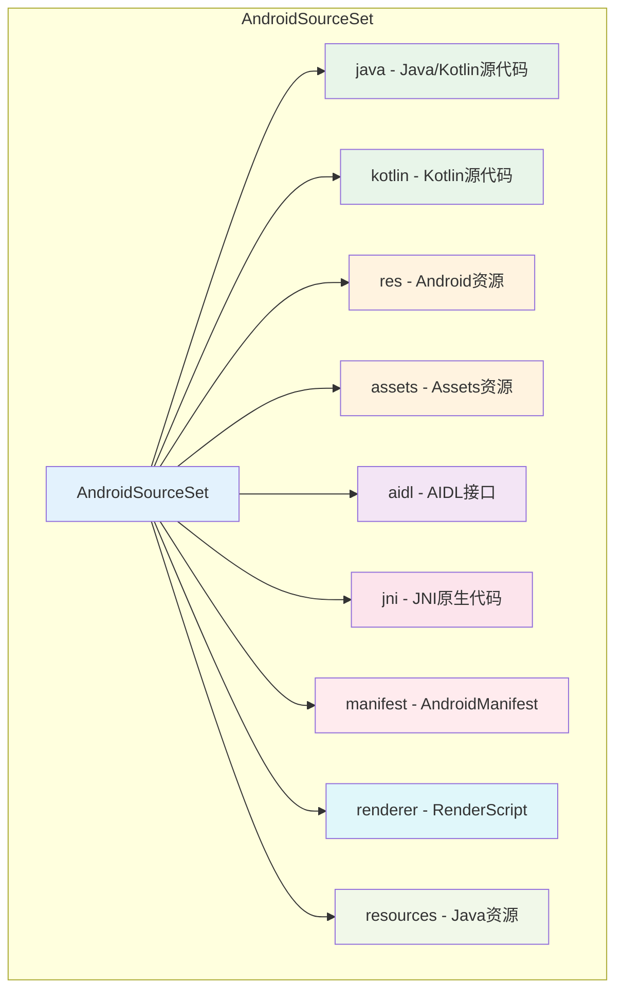
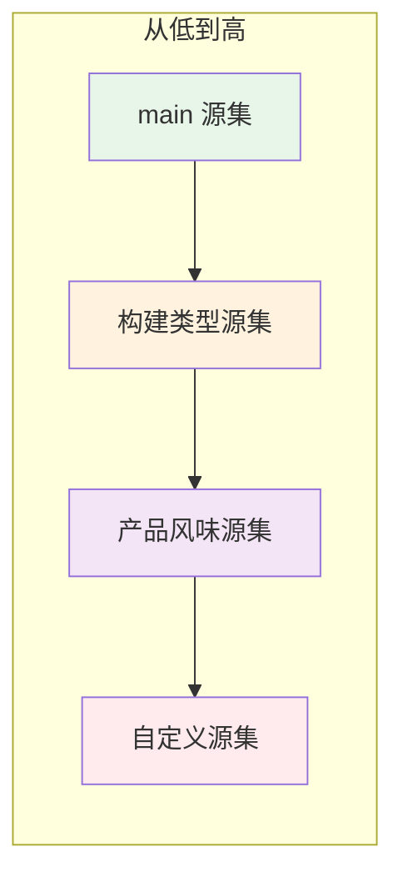
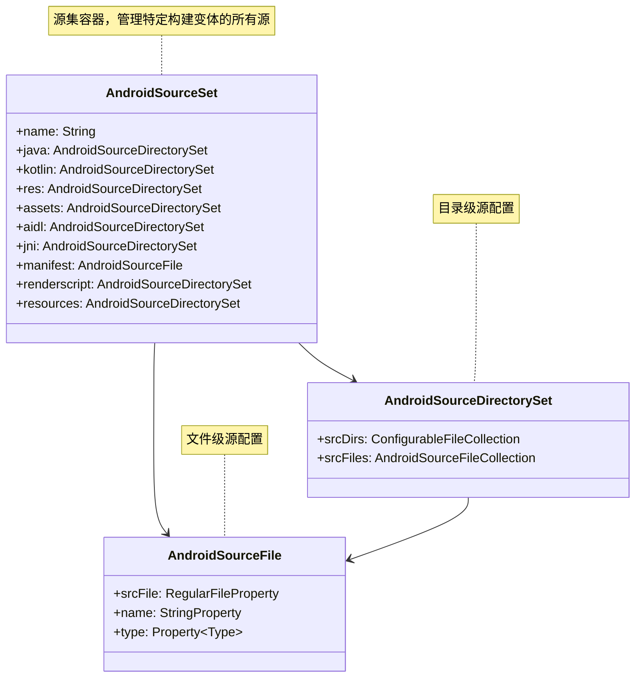

# 21.1.68 AndroidSourceSet

夜幕悄然降临。

起初只是天边最后一抹橘红，然后那颜色渐渐深下去，变成了紫罗兰色，最后完全被深蓝吞噬。星星一颗一颗地冒了出来，先是稀疏的几颗，然后越来越多，越来越多，直到整个天空都洒满了星光。

洛芙仰着头，眼睛里映着星光：“好漂亮啊……白天看湖，晚上看星，露营也太幸福了吧！”

伊莎轻轻倚在洛芙肩上：“夏夜的星空最热闹了呢～流星也特别多～”

黛琳点燃了篝火，暖黄色的火光跳动起来，在四个女孩脸上投下柔和的光影：“今天的Android源文件学得怎么样？”

“超棒！”洛芙兴奋地说，“原来可以精确添加单个文件！希尔讲的渠道配置案例特别实用！”

希尔正在笔记本电脑上敲着什么，头也不抬地说：“那不过是开胃菜而已。今晚我们来点更高级的——聊聊源集。”

“源集？”洛芙歪着头，“就是sourceSets吗？我们今天一直在用它呀！”

黛琳笑着递过来一杯热可可：“是的，我们今天一直在和源集打交道。但你知道吗，sourceSets不仅仅是一个配置块，它里面的每一个‘main'、'debug'、'release'，都是一个完整的AndroidSourceSet对象。”

“一个……对象？”洛芙好奇地问。

“对！”希尔终于抬起头来，眼睛亮晶晶的，“AndroidSourceSet就像是一个大箱子——里面可以装源代码目录、可以装单个源文件、还可以装资源、assets、NDK代码……它是一个容器，把所有源相关的东西都装在一起！”

伊莎轻声道：“就像露营时的背包呢～里面可以装帐篷、睡袋、炊具、食物……各种东西放在一起，才能组成一次完整的露营～”

洛芙眼睛一亮：“啊！原来如此！那AndroidSourceSet就是那个背包！”

“Exactly！”希尔打了个响指，“而且背包还有很多种——有装日常用品的主背包（main源集），有装应急物品的应急包（debug源集），还有装特殊装备的专业背包（自定义源集）！”

黛琳补充道：“每个源集都有自己的职责和用途。默认情况下，Android Gradle Plugin会自动创建一组标准源集，但我们也可以根据需要创建自己的源集。”

洛芙好奇地问：“那……源集里面到底能装什么呢？”

黛琳指了指白板：“让我来给你画个图！”

她拿起白板笔，画了起来：



“这个图展示了AndroidSourceSet可以包含的所有组件，”黛琳讲解道，“每个组件都是一个AndroidSourceDirectorySet（目录级配置）或者AndroidSourceFile（文件级配置）。”

洛芙惊叹道：“原来源集这么丰富！那……这些组件分别是什么呢？”

希尔凑过来，指着图一一解释：

“java和kotlin是源代码目录——所有Java和Kotlin文件都放在这里。res是资源目录——布局文件、图片、字符串都归它管。assets是静态资源目录——比如游戏数据、配置文件这些不会编译的原始文件。”

“AIDL是Android Interface Definition Language，用于进程间通信。JNI是Java Native Interface，用于调用C/C++代码。manifest是AndroidManifest.xml——每个App都必须有的配置文件。”

洛芙连连点头：“原来有这么多东西！那……这些组件怎么使用呢？”

希尔露出灿烂的笑容：“让我来给你演示一下！”

她在笔记本上敲了起来：

```kotlin
// AndroidSourceSet 配置示例

android {
    sourceSets {
        // main 源集 - 核心代码和资源
        getByName("main") {
            // Java/Kotlin 源代码目录
            java.srcDirs("src/main/java")
            kotlin.srcDirs("src/main/kotlin")
            
            // Android 资源目录
            res.srcDirs("src/main/res")
            
            // Assets 资源目录
            assets.srcDirs("src/main/assets")
            
            // AIDL 源目录
            aidl.srcDirs("src/main/aidl")
            
            // JNI 原生代码目录
            jni.srcDirs("src/main/jni")
            
            // AndroidManifest
            manifest.srcFile("src/main/AndroidManifest.xml")
            
            // RenderScript 源码
            renderscript.srcDirs("src/main/renderscript")
            
            // Java 资源目录
            resources.srcDirs("src/main/resources")
        }
        
        // debug 源集 - 调试专用配置
        getByName("debug") {
            // debug 版本的 Java 源码
            java.srcDirs("src/debug/java")
            
            // debug 版本的资源（覆盖 main）
            res.srcDirs("src/debug/res")
            
            // debug 专用的 assets
            assets.srcDirs("src/debug/assets")
        }
        
        // release 源集 - 发布专用配置
        getByName("release") {
            java.srcDirs("src/release/java")
            res.srcDirs("src/release/res")
        }
        
        // androidTest 源集 - Android 单元测试
        getByName("androidTest") {
            java.srcDirs("src/androidTest/java")
            res.srcDirs("src/androidTest/res")
        }
        
        // unitTest 源集 - JVM 单元测试
        getByName("unitTest") {
            java.srcDirs("src/test/java")
        }
    }
}

// 使用 Kotlin DSL 的更优雅写法

android {
    sourceSets {
        // 使用具名闭包配置 main 源集
        main {
            java.srcDirs("src/main/java")
            res.srcDirs("src/main/res")
        }
        
        // 配置 debug 源集
        debug {
            java.srcDirs("src/debug/java")
        }
        
        // 创建自定义源集
        create("free") {
            java.srcDirs("src/free/java")
            res.srcDirs("src/free/res")
        }
        
        create("paid") {
            java.srcDirs("src/paid/java")
            res.srcDirs("src/paid/res")
        }
    }
}
```

洛芙看得入神：“原来可以这样配置！那……这些源集是什么时候会用到呢？”

黛琳耐心地解释道：“当你运行'debug'构建变体时，系统会使用main源集加上debug源集的资源。当你运行'free'产品风味时，会使用main源集加上free源集的资源。如果不同源集里有同名的文件，后加入的会覆盖先前的。”

洛芙好奇地问：“覆盖？那……优先级是怎样的呢？”

希尔画了一个简单的优先级图：



“这个图展示了源集的优先级，”希尔讲解道，“自定义源集优先级最高，然后是产品风味源集，再是构建类型源集，最低是main源集。”

洛芙明白了：“就像穿衣服一样——最里面穿内衣（main），外面穿外套（构建类型），如果有特殊需求再套个防风衣（产品风味）！”

伊莎掩嘴轻笑：“这个比喻……倒也贴切呢～”

黛琳继续说道：“现在我们来看看实际项目中最常见的用法——按构建类型和产品风味组织源代码。”

她在白板上写起了示例：

```kotlin
// 实际项目中的常见用法

android {
    // 定义产品风味维度
    flavorDimensions += "version"
    
    // 创建产品风味
    productFlavors {
        create("free") {
            dimension = "version"
            // 免费版使用 free 源集
            sourceSets {
                getByName("free") {
                    java.srcDirs("src/free/java")
                    res.srcDirs("src/free/res")
                    // 免费版专用的 assets
                    assets.srcDirs("src/free/assets")
                }
            }
        }
        
        create("paid") {
            dimension = "version"
            sourceSets {
                getByName("paid") {
                    java.srcDirs("src/paid/java")
                    res.srcDirs("src/paid/res")
                }
            }
        }
    }
    
    // 配置构建类型
    buildTypes {
        debug {
            // debug 构建使用 debug 源集
            sourceSets {
                getByName("debug") {
                    java.srcDirs("src/debug/java")
                    // debug 专用的测试配置
                    assets.srcDirs("src/debug/assets")
                }
            }
        }
        
        release {
            sourceSets {
                getByName("release") {
                    java.srcDirs("src/release/java")
                }
            }
        }
    }
}

// 复杂项目示例：多维度源集

android {
    flavorDimensions += listOf("environment", "version")
    
    productFlavors {
        // 环境维度：国内/海外
        create("china") {
            dimension = "environment"
            sourceSets {
                getByName("china") {
                    java.srcDirs("src/china/java")
                    res.srcDirs("src/china/res")
                }
            }
        }
        
        create("overseas") {
            dimension = "environment"
            sourceSets {
                getByName("overseas") {
                    java.srcDirs("src/overseas/java")
                    res.srcDirs("src/overseas/res")
                }
            }
        }
        
        // 版本维度：免费/付费
        create("free") {
            dimension = "version"
            sourceSets {
                getByName("free") {
                    java.srcDirs("src/free/java")
                }
            }
        }
        
        create("paid") {
            dimension = "version"
            sourceSets {
                getByName("paid") {
                    java.srcDirs("src/paid/java")
                }
            }
        }
    }
}

// 最终构建时，会组合多个源集
// 例如：chinaFreeDebug = main + china + free + debug
```

洛芙看完后惊叹道：“原来源集可以这样组合！那……如果我想在代码里判断当前是哪个源集，该怎么做呢？”

希尔点头道：“好问题！我们可以用BuildConfig字段来判断！”

她在笔记本上继续敲：

```kotlin
// 在代码中判断当前源集

// 1. 使用 BuildConfig 字段（Gradle 自动生成）
class AppConfig {
    fun getApiEndpoint(): String {
        // Gradle 会根据构建变体自动生成 BuildConfig 字段
        return if (BuildConfig.FLAVOR == "free") {
            "https://api.free.example.com"
        } else if (BuildConfig.FLAVOR == "paid") {
            "https://api.paid.example.com"
        } else {
            "https://api.example.com"
        }
    }
    
    fun isDebugBuild(): Boolean {
        return BuildConfig.DEBUG
    }
}

// 2. 使用 sourceSets API 动态获取源集信息
android {
    sourceSets {
        // 打印所有源集信息
        afterEvaluate {
            sourceSets.forEach { sourceSet ->
                println("源集: ${sourceSet.name}")
                println("  Java源码: ${sourceSet.java.srcDirs}")
                println("  资源: ${sourceSet.res.srcDirs}")
                println("  Assets: ${sourceSet.assets.srcDirs}")
            }
        }
    }
}

// 3. 访问源集属性
android {
    sourceSets {
        getByName("main") {
            // 获取 Java 源码目录
            val javaDirs = java.srcDirs
            println("Main 源集的 Java 源码目录: $javaDirs")
            
            // 获取资源目录
            val resDirs = res.srcDirs
            println("Main 源集的资源目录: $resDirs")
            
            // 检查某个目录是否存在
            val hasDebugResources = file("src/debug/res").exists()
            if (hasDebugResources) {
                println("Debug 资源目录存在")
            }
        }
    }
}

// 4. 条件配置示例
android {
    sourceSets {
        getByName("main") {
            // 根据项目需求动态添加源目录
            if (project.hasProperty("enableAnalytics")) {
                java.srcDirs("src/analytics/java")
            }
            
            // 检查文件是否存在再添加
            val customDir = file("src/custom/java")
            if (customDir.exists()) {
                java.srcDirs(customDir)
            }
        }
    }
}
```

黛琳补充道：“除了默认源集，我们还可以创建完全自定义的源集，用于特殊的构建场景。”

她继续讲解：

```kotlin
// 自定义源集的创建和使用

android {
    sourceSets {
        // 创建自定义源集
        create("benchmark") {
            // 性能测试专用代码
            java.srcDirs("src/benchmark/java")
            res.srcDirs("src/benchmark/res")
        }
        
        create("demo") {
            // 演示模式专用代码
            java.srcDirs("src/demo/java")
        }
        
        // 使用 create() 的高级写法
        create("internal") {
            java.srcDirs(listOf("src/main/java", "src/internal/java"))
            res.srcDirs(listOf("src/main/res", "src/internal/res"))
        }
    }
}

// 在构建类型中使用自定义源集
android {
    buildTypes {
        release {
            // 为 release 构建添加自定义源集
            sourceSets {
                getByName("release") {
                    // 合并 internal 源集
                    java.srcDirs("src/internal/java")
                }
            }
        }
    }
}

// 在产品风味中使用自定义源集
productFlavors {
    create("enterprise") {
        sourceSets {
            getByName("enterprise") {
                java.srcDirs("src/enterprise/java")
                // 企业版包含额外的安全相关代码
                java.srcDirs("src/security/java")
            }
        }
    }
}
```

洛芙好奇地问：“那……有没有什么需要注意的坑呢？”

希尔郑重其事地说：“当然有！而且这些坑我全都踩过！”

她打开一个新的代码页面：

```kotlin
// 反模式 vs 正确写法

// ❌ 反模式1：源集路径配置错误
android {
    sourceSets {
        getByName("main") {
            // 错误的写法：使用了相对路径的字符串
            java.srcDirs("src/main/java")  // 这种写法在某些情况下可能不生效
        }
    }
}

// ✅ 正确写法1：使用 file() 或 files() 包装
android {
    sourceSets {
        getByName("main") {
            // 正确的写法
            java.srcDirs(file("src/main/java"))
            // 或者
            java.srcDirs(files("src/main/java"))
        }
    }
}

// ❌ 反模式2：重复配置相同目录
android {
    sourceSets {
        getByName("main") {
            // 第一次配置
            java.srcDirs("src/main/java")
            // 第二次又配置同样的目录，会导致重复
            java.srcDirs("src/main/java")
        }
    }
}

// ✅ 正确写法2：使用 set() 或合并配置
android {
    sourceSets {
        getByName("main") {
            // 使用 set() 覆盖式配置
            java.srcDirs.set(files("src/main/java"))
            
            // 或者使用 += 追加（不会重复）
            java.srcDirs += file("src/main/java")
        }
    }
}

// ❌ 反模式3：混淆目录和文件
android {
    sourceSets {
        getByName("main") {
            // 错误：把单个文件当作目录
            java.srcFile("src/main/java/Utils.kt")
        }
    }
}

// ✅ 正确写法3：区分目录和文件
android {
    sourceSets {
        getByName("main") {
            // 目录用 srcDirs
            java.srcDirs("src/main/java")
            
            // 单个文件用 srcFile（在 AndroidSourceFile 中讲解）
            java.srcFile("src/main/java/SpecificFile.kt")
        }
    }
}

// ❌ 反模式4：在源集配置中执行耗时操作
android {
    sourceSets {
        getByName("main") {
            // 错误：在配置阶段扫描大量文件
            java.srcDirs(fileTree("src/main/java") {
                include("**/*.kt")
                // 耗时的文件操作
            })
        }
    }
}

// ✅ 正确写法4：使用延迟配置或任务依赖
android {
    sourceSets {
        getByName("main") {
            // 直接配置目录即可，Gradle 会自动处理
            java.srcDirs("src/main/java")
        }
    }
}

// ❌ 反模式5：忘记在 buildTypes 中配置对应源集
android {
    // 定义了 buildTypes
    buildTypes {
        debug { ... }
        staging { ... }  // 自定义构建类型
    }
    
    // 但没有为 staging 配置源集！
    // staging 源集不会自动创建
}

// ✅ 正确写法5：为自定义构建类型配置源集
android {
    buildTypes {
        staging {
            sourceSets {
                getByName("staging") {
                    java.srcDirs("src/staging/java")
                }
            }
        }
    }
}
```

洛芙看完后拍了拍胸口：“还好有这些提醒！要不然肯定要踩坑！”

希尔 grinning（露出灿烂的笑容）：“实战经验就是这样一点点积累起来的！”

她继续说道：“现在让我们来看一个综合示例——模拟一个真实项目的完整源集配置！”

```kotlin
// 真实项目综合示例

android {
    // 定义两个产品风味维度
    flavorDimensions += listOf("environment", "tier")
    
    // 环境维度：国内/海外
    productFlavors {
        create("china") {
            dimension = "environment"
            // 中国区特有的配置
            sourceSets {
                getByName("china") {
                    java.srcDirs("src/china/java")
                    res.srcDirs("src/china/res")
                    assets.srcDirs("src/china/assets")
                }
            }
        }
        
        create("overseas") {
            dimension = "environment"
            sourceSets {
                getByName("overseas") {
                    java.srcDirs("src/overseas/java")
                    res.srcDirs("src/overseas/res")
                    assets.srcDirs("src/overseas/assets")
                }
            }
        }
    }
    
    // 级别维度：免费/付费
    productFlavors {
        create("free") {
            dimension = "tier"
            sourceSets {
                getByName("free") {
                    java.srcDirs("src/free/java")
                    res.srcDirs("src/free/res")
                    // 免费版有广告相关代码
                    java.srcDirs("src/ad/java")
                }
            }
        }
        
        create("paid") {
            dimension = "tier"
            sourceSets {
                getByName("paid") {
                    java.srcDirs("src/paid/java")
                    res.srcDirs("src/paid/res")
                    // 付费版有会员相关代码
                    java.srcDirs("src/membership/java")
                }
            }
        }
    }
    
    // 构建类型配置
    buildTypes {
        debug {
            sourceSets {
                getByName("debug") {
                    java.srcDirs("src/debug/java")
                    assets.srcDirs("src/debug/assets")
                }
            }
        }
        
        release {
            sourceSets {
                getByName("release") {
                    java.srcDirs("src/release/java")
                }
            }
        }
        
        // 自定义构建类型
        create("benchmark") {
            sourceSets {
                getByName("benchmark") {
                    java.srcDirs("src/benchmark/java")
                }
            }
        }
    }
}

// 最终构建variant = flavor1 + flavor2 + buildType
// 例如：chinaFreeRelease = main + china + free + release
// 加载源集顺序：main -> china -> free -> release (后者覆盖前者)

// 在代码中使用源集信息
class SourceSetManager {
    
    fun getActiveSourceSets(): List<String> {
        // 获取当前构建的所有源集
        return BuildConfig::class.java.declaredFields
            .filter { it.name.startsWith("FLAVOR") || it.name == "BUILD_TYPE" }
            .mapNotNull { field ->
                field.isAccessible = true
                field.get(BuildConfig::class.java)?.toString()
            }
    }
    
    fun isPaidVersion(): Boolean {
        return BuildConfig.FLAVOR == "paid"
    }
    
    fun isOverseasVersion(): Boolean {
        return BuildConfig.FLAVOR == "overseas"
    }
}
```

洛芙看完后长舒一口气：“太复杂了……但也太强大了！原来源集可以这样玩！”

黛琳温柔地说：“一开始会觉得很复杂，但实际项目中，你通常只需要关注几个主要的源集。掌握了这个思路，面对再复杂的项目也不会慌。”

伊莎轻声说道：“就像露营一样呢～一开始觉得带的东西好多好乱，但只要分类整理好，就什么都能找到～”

洛芙点点头：“我明白了！源集就是一个大容器，把各种源代码、资、资源放在一起。main是基础，其他源集是在此基础上的叠加和覆盖！”

“对！”希尔竖起大拇指，“就是这个意思！”

夜空中的星星越来越多，篝火里的木柴发出轻微的噼啪声。

黛琳抬头看了看星空：“今天我们学习了AndroidSourceSet——它是整个源代码组织的核心容器。main、debug、release、free、paid……这些都是它的具体实例。”

“每个源集都可以包含java、kotlin、res、assets、aidl、jni、manifest等组件，”希尔补充道，“通过合理配置源集，我们可以实现代码和资源的模块化管理。”

洛芙裹紧外套，满足地说：“谢谢黛琳！谢谢希尔！今天又是收获满满的一天！源集就像露营的大背包，里面什么都能装，还能分门别类！”

伊莎轻轻拨了拨耳边的发丝：“技术的世界真是越学越有趣呢～”

远处传来夜鸟的叫声，夏夜的露营，真是美好极了。

---

## 专业技术总结

> **AndroidSourceSet** 是 Android Gradle Plugin 提供的源集配置 DSL，它是一个容器对象，用于组织和管理特定构建变体的所有源代码、资源和配置文件。每个源集（main、debug、release、productFlavor等）都包含java、kotlin、res、assets、aidl、jni、manifest等组件，可以通过Gradle DSL进行灵活配置，实现代码和资源的模块化管理。

#### 结构图



#### 源集优先级

| 优先级 | 源集类型 | 示例 | 说明 |
|--------|----------|------|------|
| 低 | 主源集 | main | 所有构建变体共享 |
| 中 | 构建类型 | debug, release | 按构建类型分离 |
| 中 | 产品风味 | free, paid | 按产品风味分离 |
| 高 | 自定义 | benchmark, demo | 按特殊需求创建 |

#### 核心组件

| 组件 | 类型 | 说明 |
|------|------|------|
| java | AndroidSourceDirectorySet | Java/Kotlin 源代码目录 |
| kotlin | AndroidSourceDirectorySet | Kotlin 源代码目录 |
| res | AndroidSourceDirectorySet | Android 资源目录 |
| assets | AndroidSourceDirectorySet | 静态资源目录 |
| aidl | AndroidSourceDirectorySet | AIDL 接口定义 |
| jni | AndroidSourceDirectorySet | JNI 原生代码 |
| manifest | AndroidSourceFile | AndroidManifest.xml |
| renderscript | AndroidSourceDirectorySet | RenderScript 代码 |
| resources | AndroidSourceDirectorySet | Java 资源文件 |

#### 反模式与陷阱

1. **路径配置错误**：使用字符串而非file()包装，导致路径解析失败。应使用file()或files()明确包装路径。

2. **重复配置目录**：多次调用srcDirs添加同一目录会导致重复。应使用set()覆盖或+=追加操作符。

3. **混淆目录和文件**：把单个文件当作目录配置。应区分使用srcDirs和srcFile。

4. **配置阶段耗时操作**：在sourceSets配置块中执行大量文件扫描。应保持配置简洁，Gradle会自动处理。

5. **忘记配置自定义构建类型**：创建新的buildType但未配置对应源集。应显式为自定义构建类型配置sourceSets。

#### 设计哲学

AndroidSourceSet体现了Android构建系统的**模块化与分层管理**理念：
- 源集是容器，承载所有源相关配置
- 默认源集（main）提供基础配置
- 构建类型和产品风味在默认源集基础上叠加
- 自定义源集满足特殊需求
- 优先级机制确保正确覆盖顺序
- 通过BuildConfig字段在运行时感知当前源集

---

> 学习建议：在实际项目中，建议先配置好main源集，然后根据需要为debug/release构建类型和productFlavor添加额外配置。善用源集的优先级机制，避免重复配置。使用自定义源集时，要明确其使用场景和覆盖规则。

---

## 洛芙的小小日记本

今晚黛琳讲了AndroidSourceSet——源代码大容器！原来main、debug、release、free、paid这些都是源集，每个源集就像一个大背包，里面可以装java代码、kotlin代码、res资源、assets资源……不同源集还可以叠加，后加的会覆盖前面的！分层管理太重要了，就像露营时分类整理背包一样～

---

## 今日关键词

- **AndroidSourceSet**: Android Gradle Plugin的源集配置DSL容器
- **sourceSets**: Gradle中配置源集的代码块
- **main 源集**: 核心源集，所有构建变体共享
- **debug 源集**: 调试构建专用源集
- **release 源集**: 发布构建专用源集
- **productFlavor 源集**: 产品风味专用源集
- **自定义源集**: 根据特殊需求创建的源集
- **AndroidSourceDirectorySet**: 目录级源代码配置
- **java**: Java/Kotlin源代码目录组件
- **kotlin**: Kotlin源代码目录组件
- **res**: Android资源目录组件
- **assets**: 静态资源目录组件
- **aidl**: AIDL接口定义目录组件
- **jni**: JNI原生代码目录组件
- **manifest**: AndroidManifest配置文件
- **源集优先级**: 决定覆盖顺序的机制
- **BuildConfig**: Gradle自动生成的构建配置类
- **分层管理**: 通过源集实现代码和资源的模块化组织
- **构建变体**: buildType + productFlavor的组合结果
