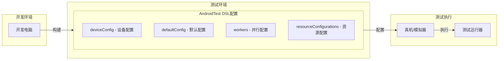
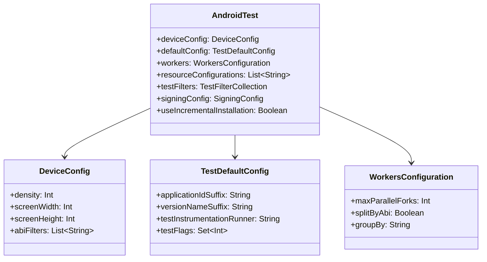
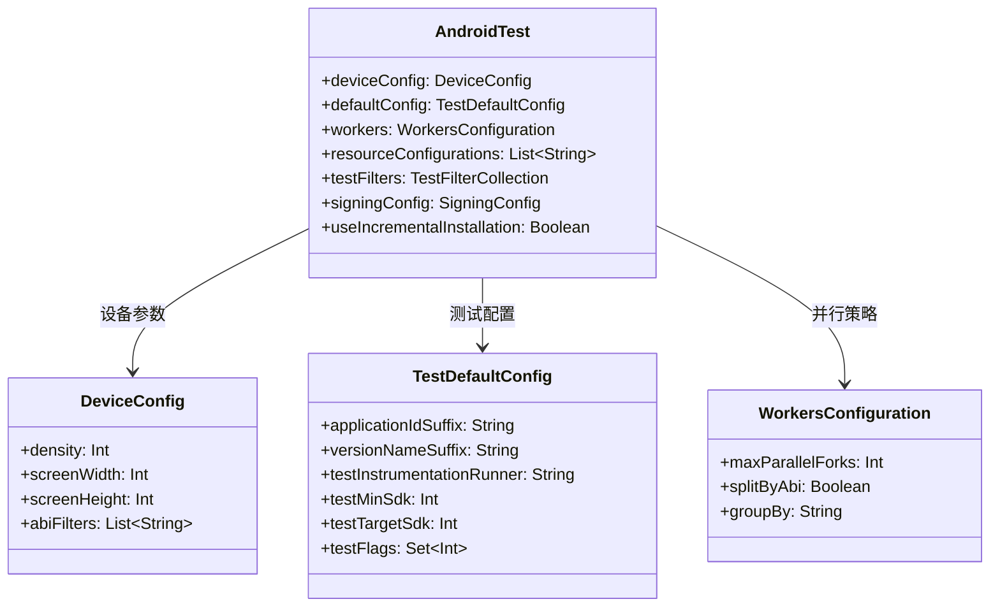

# 21.1.69 Android测试

夕阳慢慢沉入湖面，把整片湖水染成了橘红色。

洛芙伸了个懒腰，感觉今天的知识像这夕阳一样，慢慢沉淀到心底。刚才黛琳讲的AndroidSourceSet让她大开眼界——原来代码管理也可以这么有层次感。

“洛芙，别急着休息！”希尔突然喊道，手里晃着一个U盘，“知道你刚才说的androidTest源集吧？想不想知道怎么配置它？”

洛芙眨了眨眼：“刚才黛琳不是讲过了吗？不就是在sourceSets里配置吗？”

“哎呀，那只是冰山一角！”希尔 grinned（露出灿烂的笑容），“真正的大家伙在后面呢——来，黛琳，给她们看看真正的测试配置！”

黛琳微微一笑，从背包里拿出白板：“今天我们要讲的，是AndroidTest——Android仪器化测试的完整配置系统。”

她把白板架好，在上面写下几个大字：Android测试配置。

“仪器化测试？”洛芙歪着头，“和之前的单元测试不一样吗？”

“不一样哦！”伊莎轻声解释道，“单元测试是在你自己的电脑上跑的，但仪器化测试需要在真实的Android设备或模拟器上运行——就像是把测试设备放进一个特殊的'实验室环境'里跑。”

“实验室？”洛芙好奇地问。

“对！”希尔接过话头，“AndroidTest就是用来配置这个'实验室'的——连接哪台设备、设置什么参数、启用什么功能，全部由它来管！”

黛琳点点头，在白板上画了起来：



“这个图展示了AndroidTest配置在测试流程中的位置，”黛琳讲解道，“它负责配置测试运行时的一切——从设备连接到测试参数。”

洛芙若有所思地点点头：“也就是说，sourceSets只告诉我们测试代码在哪里，而AndroidTest告诉我们怎么跑这些测试？”

“Exactly！”希尔打了个响指，“你理解得很对！来，让我给你展示一个完整的配置示例。”

她在笔记本上敲了起来：

```kotlin
// AndroidTest 完整配置示例

android {
    // Android 仪器化测试配置
    // AndroidTest 是 com.android.build.api.dsl.AndroidTest 接口
    testInstrumentationRunner = "androidx.test.runner.AndroidJUnitRunner"
    
    // defaultConfig 是测试的默认配置
    defaultConfig {
        // 测试运行器类名
        testInstrumentationRunner = "androidx.test.runner.AndroidJUnitRunner"
        
        // 测试应用的 Application ID（可选，默认是主应用ID + ".test"）
        testApplicationId = "com.example.myapp.test"
        
        // 测试的最小 SDK 版本
        testMinSdk = 21
        
        // 测试目标 SDK 版本（默认与主应用相同）
        testTargetSdk = 34
        
        // 测试资源限制配置
        testHandleProfiling = false
        testFunctionalTimeout = "60000ms"  // 功能测试超时时间
        
        // 仪器化测试参数（传递到测试代码中）
        testInstrumentationRunnerArguments += mapOf(
            "package" to "com.example.myapp.tests",
            "notAnnotation" to "org.junit.Ignore"
        )
    }
    
    // 测试构建类型配置
    buildTypes {
        debug {
            // 启用测试覆盖
            isTestCoverageEnabled = true
            
            // 测试 APK 签名配置
            signingConfig = signingConfigs.debug
        }
        
        release {
            // Release 版本禁用某些测试功能
            isTestCoverageEnabled = false
        }
    }
    
    // 完整的 AndroidTest DSL 配置块
    androidTest {
        // ===============================
        // 1. 设备配置 (deviceConfig)
        // ===============================
        
        // 配置测试设备参数
        deviceConfig {
            // 屏幕密度
            density = 420
            
            // 屏幕尺寸
            screenWidth = 1080
            screenHeight = 2340
            
            // ABI 配置（决定使用哪个 native 库）
            abiFilters += listOf("armeabi-v7a", "arm64-v8a", "x86", "x86_64")
        }
        
        // ===============================
        // 2. 默认配置 (defaultConfig)
        // ===============================
        
        // 继承外层的 defaultConfig，可以覆盖
        defaultConfig {
            // 应用 ID 后缀
            applicationIdSuffix = ".test"
            
            // 版本名称后缀
            versionNameSuffix = "-test"
            
            // 仪器化测试运行器
            testInstrumentationRunner = "androidx.test.runner.AndroidJUnitRunner"
            
            // 测试功能标志
            testFlags += listOf(
                // 禁用动画
                android.test.InstrumentationTestRunner.FLAG_DISABLE_ANIMATIONS,
                // 启用长等待
                android.test.InstrumentationTestRunner.FLAG_ENABLE_STORAGE_LOW
            )
        }
        
        // ===============================
        // 3. 并行执行配置 (workers)
        // ===============================
        
        // 配置并行测试执行
        workers {
            // 最大并行进程数
            // 0 表示由系统决定
            maxParallelForks = 4
            
            // 是否按 ABI 分组
            splitByAbi = true
            
            // 分组策略
            groupBy = "ABI"
        }
        
        // ===============================
        // 4. 资源配置 (resourceConfigurations)
        // ===============================
        
        // 指定测试只包含哪些语言的资源
        // 减少测试 APK 大小
        resourceConfigurations += listOf(
            "en",
            "zh-rCN",
            "ja"
        )
        
        // ===============================
        // 5. 增量安装配置
        // ===============================
        
        // 启用增量安装（仅安装变化的资源）
        useIncrementalInstallation = true
        
        // ===============================
        // 6. 测试套件配置
        // ===============================
        
        // 配置测试过滤器
        // 这是一个集合，可以添加多个过滤器
        testFilters += listOf(
            // 只运行特定测试类
            include "com.example.myapp.SmokeTest",
            // 排除特定测试类
            exclude "com.example.myapp.slow.*"
        )
        
        // 添加基于注解的过滤器
        testInstrumentationRunnerArgument("notAnnotation", "org.junit.Ignore")
        
        // ===============================
        // 7. 测试 APK 签名配置
        // ===============================
        
        // 测试 APK 的签名配置
        signingConfig = signingConfigs.debug
        
        // ===============================
        // 8. 测试输出配置
        // ===============================
        
        // 是否在测试失败时返回错误码
        // returnErrorcodes = true
        
        // 测试输出目录（可选）
        // testResultsDir = file("build/test-results")
        
        // 测试报告目录
        // testReportDir = file("build/reports/androidTests")
    }
}

// 为特定构建变体配置测试
android {
    // 为 debug 构建类型配置测试
    buildTypes {
        debug {
            // 启用代码覆盖率
            isTestCoverageEnabled = true
        }
    }
    
    // 为特定 product flavor 配置测试
    flavorDimensions += "version"
    productFlavors {
        create("free") {
            // 免费版测试配置
            dimension = "version"
        }
        
        create("paid") {
            // 付费版测试配置
            dimension = "version"
        }
    }
    
    // 为特定 flavor 组合配置 androidTest
    sourceSets {
        getByName("androidTest") {
            // 共享测试代码
            java.srcDirs("src/androidTest/java")
        }
        
        // 免费版测试源集
        create("androidTestFree") {
            java.srcDirs("src/androidTestFree/java")
        }
        
        // 付费版测试源集
        create("androidTestPaid") {
            java.srcDirs("src/androidTestPaid/java")
        }
    }
}

// 配置测试依赖
dependencies {
    // AndroidX Test 核心库
    androidTestImplementation("androidx.test:core:1.5.0")
    
    // JUnit4 测试框架
    androidTestImplementation("androidx.test.ext:junit:1.1.5")
    
    // Espresso 测试框架
    androidTestImplementation("androidx.test.espresso:espresso-core:3.5.1")
    
    // 测试注解库
    androidTestImplementation("androidx.test:annotations:1.5.0")
    
    // 测试 Runner
    androidTestImplementation("androidx.test:runner:1.5.2")
    
    // 测试规则
    androidTestImplementation("androidx.test:rules:1.5.0")
    
    // 单元测试依赖
    testImplementation("junit:junit:4.13.2")
    testImplementation("org.mockito:mockito-core:5.8.0")
    
    // Kotlin 测试支持
    testImplementation("org.jetbrains.kotlin:kotlin-test:1.9.20")
    testImplementation("org.jetbrains.kotlin:kotlin-test-junit:1.9.20")
}
```

“哇，原来测试配置有这么多名堂！”洛芙惊叹道。

黛琳微笑着说：“这还只是基础配置。让我给你解释每个部分的作用。”

她在白板上画起了结构图：



“这个类图展示了AndroidTest的完整结构，”黛琳讲解道，“每个属性对应一个配置方面。”

希尔补充道：“简单来说，AndroidTest就是测试的'总指挥'——它决定在什么设备上跑测试、跑哪些测试、怎么跑。”

伊莎轻声说道：“就像露营时的后勤队长——不仅要准备食材（测试代码），还要安排谁来做饭（测试运行器）、在哪里做饭（设备配置）、做多少人的份（并行配置）。”

洛裕“扑哧”一声笑了出来：“这个比喻太形象了！”

她好奇地问：“那我能不能针对不同的设备配置不同的测试呢？”

“好问题！”黛琳又在白板上画了起来，“让我展示如何为不同设备配置测试。”

```kotlin
// 场景1：为不同屏幕尺寸配置测试

android {
    // 为手机配置测试
    androidTest {
        deviceConfig {
            screenWidth = 1080
            screenHeight = 2340
            density = 420
        }
    }
    
    // 为平板配置测试（需要创建新的测试 variant）
    // 注意：这通常通过创建多个 androidTest 源集来实现
    sourceSets {
        // 手机测试
        getByName("androidTest") {
            java.srcDirs("src/androidTest/java")
        }
        
        // 平板测试
        create("androidTestTablet") {
            java.srcDirs("src/androidTestTablet/java")
        }
    }
}

// 场景2：为不同 ABI 配置测试

android {
    androidTest {
        deviceConfig {
            // 32位 ARM
            abiFilters += "armeabi-v7a"
            // 64位 ARM
            abiFilters += "arm64-v8a"
            // 32位 x86（模拟器常用）
            abiFilters += "x86"
            // 64位 x86_64（模拟器常用）
            abiFilters += "x86_64"
        }
        
        // 按 ABI 分组执行测试
        workers {
            splitByAbi = true
            groupBy = "ABI"
        }
    }
}

// 场景3：条件性配置测试

android {
    androidTest {
        // 根据项目属性动态配置
        if (project.hasProperty("runSauceLabs")) {
            // Sauce Labs 远程设备测试配置
            // 使用设备农场
        }
        
        // 根据 flavor 配置
        val currentFlavor = getCurrentFlavor()
        when (currentFlavor) {
            "free" -> {
                // 免费版测试：只跑核心功能测试
                testFilters += listOf(
                    exclude "com.example.myapp.premium.*"
                )
            }
            "paid" -> {
                // 付费版测试：跑全部测试
                testFilters += listOf(
                    include "com.example.myapp.*"
                )
            }
        }
    }
}

// 场景4：测试覆盖率配置

android {
    buildTypes {
        debug {
            isTestCoverageEnabled = true
        }
    }
    
    androidTest {
        // 测试覆盖率输出格式
        // 这通常通过 Gradle 插件配置
    }
}

// 场景5：性能测试配置

android {
    androidTest {
        // 设置测试超时
        defaultConfig {
            // 功能测试超时（默认无限）
            testFunctionalTimeout = "300000ms"  // 5分钟
            
            // 性能测试超时
            testPerformanceTimeout = "60000ms"  // 1分钟
        }
        
        // 测试标志
        testFlags += listOf(
            // 禁用系统动画，避免影响测试结果
            android.test.InstrumentationTestRunner.FLAG_DISABLE_ANIMATIONS,
            // 禁用系统备份服务
            android.test.InstrumentationTestRunner.FLAG_DISABLE_BACKUP,
            // 启用性能分析
            android.test.InstrumentationTestRunner.FLAG_ENABLE_PROFILING
        )
    }
}

// 场景6：多模块项目中的测试配置

// 库模块的测试配置
android.library {
    // 库模块的 AndroidTest 配置
    // 注意：库模块的测试不需要 applicationId
    androidTest {
        defaultConfig {
            // 库模块测试不需要 applicationIdSuffix
            // testApplicationId = "com.example.mylib.test"  // 不需要！
            
            testInstrumentationRunner = "androidx.test.runner.AndroidJUnitRunner"
        }
        
        deviceConfig {
            // 库模块的测试设备配置
            abiFilters += listOf("armeabi-v7a", "arm64-v8a")
        }
    }
}
```

“原来测试配置有这么多玩法！”洛芙感叹道。

希尔表情认真起来：“不过在使用这些配置时，也有一些常见的错误需要注意。”

她在笔记本上继续写着：

```kotlin
// ⚠️ 反模式与注意事项

// 反模式1：忘记配置测试运行器
android {
    // ❌ 错误：没有配置测试运行器
    defaultConfig {
        testApplicationId = "com.example.myapp.test"
        // 缺少 testInstrumentationRunner！
    }
}

// ✅ 正确：配置测试运行器
android {
    defaultConfig {
        testApplicationId = "com.example.myapp.test"
        testInstrumentationRunner = "androidx.test.runner.AndroidJUnitRunner"  // 必需！
    }
}

// 反模式2：deviceConfig 和 defaultConfig 混淆
android {
    // ❌ 错误：在 defaultConfig 里配置设备参数
    defaultConfig {
        // 设备参数应该放在 deviceConfig，不是 defaultConfig！
        density = 420  // 错误位置！
        abiFilters += "arm64-v8a"  // 错误位置！
    }
    
    // ✅ 正确：设备参数放在 deviceConfig
    androidTest {
        deviceConfig {
            density = 420
            abiFilters += "arm64-v8a"
        }
        
        defaultConfig {
            // 应用配置放在这里
            testInstrumentationRunner = "androidx.test.runner.AndroidJUnitRunner"
        }
    }
}

// 反模式3：ABI 过滤器配置不完整
android {
    androidTest {
        deviceConfig {
            // ❌ 只配置了一种 ABI，但实际设备可能是其他 ABI
            abiFilters += "arm64-v8a"
        }
    }
}

// ✅ 正确：配置所有可能用到的 ABI
android {
    androidTest {
        deviceConfig {
            abiFilters += listOf(
                "armeabi-v7a",  // 旧手机
                "arm64-v8a",   // 现代手机
                "x86",         // x86 模拟器
                "x86_64"       // x86_64 模拟器
            )
        }
    }
}

// 反模式4：测试过滤器语法错误
android {
    androidTest {
        // ❌ 错误：过滤器字符串格式不对
        testFilters += listOf(
            "com.example.myapp.SmokeTest"  // 缺少 include 关键字！
        )
    }
}

// ✅ 正确：使用正确的过滤器格式
android {
    androidTest {
        testFilters += listOf(
            "include:com.example.myapp.SmokeTest",
            "exclude:com.example.myapp.slow.*"
        )
    }
}

// 反模式5：忘记同步主应用的 minSdk
android {
    defaultConfig {
        // 主应用的 minSdk
        minSdk = 21
    }
    
    androidTest {
        // ❌ 错误：没有配置 testMinSdk，默认使用主应用的 minSdk
        // 但有时测试代码需要更高的 SDK 版本
    }
}

// ✅ 正确：显式配置测试的 minSdk
android {
    defaultConfig {
        minSdk = 21
    }
    
    androidTest {
        defaultConfig {
            testMinSdk = 24  // 测试代码需要 API 24+ 的功能
        }
    }
}

// 反模式6：并行测试配置过度
android {
    androidTest {
        workers {
            // ❌ 错误：设置过高的并行数
            maxParallelForks = Runtime.getRuntime().availableProcessors()
            // 这可能会导致设备资源耗尽！
        }
    }
}

// ✅ 正确：根据设备能力合理配置并行数
android {
    androidTest {
        workers {
            // 建议：不超过 4 个并行进程
            maxParallelForks = 4
            
            // 按 ABI 分组可以更好利用设备
            splitByAbi = true
        }
    }
}

// 反模式7：库模块错误配置 applicationId
android.library {
    // ❌ 错误：库模块不应该配置 applicationId
    defaultConfig {
        testApplicationId = "com.example.mylib.test"  // 错误！
    }
}

// ✅ 正确：库模块不需要 testApplicationId
android.library {
    androidTest {
        defaultConfig {
            // 不需要 testApplicationId！
            testInstrumentationRunner = "androidx.test.runner.AndroidJUnitRunner"
        }
    }
}
```

“原来有这么多坑！”洛芙感叹道。

希尔点点头：“是啊！测试配置看似简单，但其实有很多细节需要注意。”

黛琳补充道：“现在让我给你展示一个最佳实践的完整示例。”

她在笔记本上写下了最终的综合示例：

```kotlin
// 综合示例：企业级 Android 测试配置

// ============================================
// 项目根 build.gradle.kts
// ============================================
plugins {
    id("com.android.application") version "8.2.0"
    id("org.jetbrains.kotlin.android") version "1.9.20"
    id("jacoco")  // 代码覆盖率插件
}

// ============================================
// 模块 build.gradle.kts
// ============================================

android {
    namespace = "com.example.myapp"
    compileSdk = 34
    
    defaultConfig {
        applicationId = "com.example.myapp"
        minSdk = 24
        targetSdk = 34
        versionCode = 1
        versionName = "1.0"
        
        // 必需：配置测试运行器
        testInstrumentationRunner = "androidx.test.runner.AndroidJUnitRunner"
        
        // 测试配置
        testInstrumentationRunnerArguments += mapOf(
            "package" to "com.example.myapp.test",
            "notAnnotation" to "org.junit.Ignore"
        )
    }
    
    // 构建类型
    buildTypes {
        debug {
            isDebuggable = true
            isMinifyEnabled = false
            
            // Debug 构建启用测试覆盖率
            isTestCoverageEnabled = true
        }
        
        release {
            isMinifyEnabled = true
            isTestCoverageEnabled = false
            
            proguardFiles(
                getDefaultProguardFile("proguard-android-optimize.txt"),
                "proguard-rules.pro"
            )
        }
    }
    
    // 产品风味
    flavorDimensions += "version"
    productFlavors {
        create("free") {
            dimension = "version"
            applicationIdSuffix = ".free"
            versionNameSuffix = " (Free)"
        }
        
        create("paid") {
            dimension = "version"
            applicationIdSuffix = ".paid"
            versionNameSuffix = " (Paid)"
        }
    }
    
    // ============================================
    // AndroidTest 配置 - 核心部分
    // ============================================
    androidTest {
        // ---------- 设备配置 ----------
        deviceConfig {
            // 目标设备的屏幕密度
            density = 420
            
            // 目标设备的屏幕分辨率
            screenWidth = 1080
            screenHeight = 2340
            
            // 支持的 ABI（覆盖主流设备）
            abiFilters += listOf(
                "armeabi-v7a",
                "arm64-v8a",
                "x86",
                "x86_64"
            )
        }
        
        // ---------- 默认配置 ----------
        defaultConfig {
            // 测试应用 ID
            testApplicationId = "com.example.myapp.test"
            
            // 测试版本名称
            versionNameSuffix = "-test"
            
            // 测试最小 SDK
            testMinSdk = 24
            
            // 测试目标 SDK
            testTargetSdk = 34
            
            // 测试标志
            testFlags += listOf(
                // 禁用动画，避免影响 UI 测试
                android.test.InstrumentationTestRunner.FLAG_DISABLE_ANIMATIONS,
                // 禁用备份服务
                android.test.InstrumentationTestRunner.FLAG_DISABLE_BACKUP
            )
        }
        
        // ---------- 并行执行配置 ----------
        workers {
            // 最大并行进程数
            maxParallelForks = 4
            
            // 按 ABI 分组执行
            splitByAbi = true
            
            // 分组策略
            groupBy = "ABI"
        }
        
        // ---------- 资源配置 ----------
        // 只包含必要的语言资源，减少 APK 大小
        resourceConfigurations += listOf(
            "en",
            "zh-rCN",
            "zh-rTW",
            "ja",
            "ko"
        )
        
        // ---------- 测试过滤 ----------
        testFilters += listOf(
            // 包含快速冒烟测试
            "include:com.example.myapp.SmokeTest",
            // 排除慢速测试
            "exclude:com.example.myapp.slow.*",
            // 排除需要网络的测试
            "exclude:com.example.myapp.network.*"
        )
        
        // ---------- 签名配置 ----------
        signingConfig = signingConfigs.debug
        
        // ---------- 增量安装 ----------
        useIncrementalInstallation = true
    }
    
    // ============================================
    // 源集配置
    // ============================================
    sourceSets {
        // 主测试源集
        getByName("androidTest") {
            java.srcDirs("src/androidTest/java")
            res.srcDirs("src/androidTest/res")
            assets.srcDirs("src/androidTest/assets")
        }
        
        // 单元测试源集
        getByName("test") {
            java.srcDirs("src/test/java")
        }
    }
}

// ============================================
// 测试依赖配置
// ============================================
dependencies {
    // ---------- 仪器化测试依赖 ----------
    androidTestImplementation("androidx.test:core:1.5.0")
    androidTestImplementation("androidx.test:core-ktx:1.5.0")
    androidTestImplementation("androidx.test.ext:junit:1.1.5")
    androidTestImplementation("androidx.test.ext:junit-ktx:1.1.5")
    androidTestImplementation("androidx.test.espresso:espresso-core:3.5.1")
    androidTestImplementation("androidx.test.espresso:espresso-intents:3.5.1")
    androidTestImplementation("androidx.test.espresso:espresso-web:3.5.1")
    androidTestImplementation("androidx.test:runner:1.5.2")
    androidTestImplementation("androidx.test:rules:1.5.0")
    androidTestImplementation("androidx.test:annotations:1.5.0")
    
    // 测试专用库
    androidTestImplementation("com.google.truth:truth:1.1.5")
    androidTestImplementation("com.google.dagger:hilt-android-testing:2.48")
    
    // Mock 框架
    androidTestImplementation("io.mockk:mockk-android:1.13.8")
    
    // ---------- 单元测试依赖 ----------
    testImplementation("junit:junit:4.13.2")
    testImplementation("org.jetbrains.kotlin:kotlin-test:1.9.20")
    testImplementation("org.jetbrains.kotlin:kotlin-test-junit:1.9.20")
    testImplementation("org.mockito:mockito-core:5.8.0")
    testImplementation("com.google.dagger:hilt-android-testing:2.48")
    testImplementation("io.mockk:mockk:1.13.8")
    
    // ---------- 测试工具 ----------
    // Fragment testing
    androidTestImplementation("androidx.fragment:fragment-testing:1.6.2")
    
    // Activity testing
    androidTestImplementation("androidx.test:activity:1.8.1")
    
    // Navigation testing
    androidTestImplementation("androidx.navigation:navigation-testing:2.7.5")
    
    // Lifecycle testing
    androidTestImplementation("androidx.lifecycle:lifecycle-runtime-testing:2.6.2")
    androidTestImplementation("androidx.lifecycle:lifecycle-viewmodel-testing:2.6.2")
}

// ============================================
// 自定义测试任务
// ============================================
tasks.register<JavaExec>("runSmokeTests") {
    description = "运行冒烟测试"
    
    group = "verification"
    
    // 运行特定测试类
    args = listOf(
        "com.example.myapp.SmokeTest"
    )
    
    // 测试输出配置
    testLogging {
        events("passed", "skipped", "failed")
        showStandardStreams = false
    }
}

// ============================================
// 测试报告配置
// ============================================
tasks.withType<Test> {
    // 测试报告配置
    reports {
        html.required.set(true)
        xml.required.set(true)
    }
    
    // 启用测试覆盖率时生成报告
    if (project.hasProperty("coverage")) {
        jacoco {
            destinationFile = file("${buildDir}/jacoco/jacocoTestReport.xml")
        }
    }
}
```

洛芙看完了整个示例，长长地出了一口气：“原来一个测试配置就有这么多东西！”

黛琳微笑着说：“这就是企业级项目的日常。不过万变不离其宗——理解每个配置项的作用，就能灵活组合。”

“对！”希尔补充道，“AndroidTest 就是测试的'总调度中心'——设备、运行器、过滤器、并行策略，全部由它来管。”

伊莎轻声说道：“就像露营时要安排好每个人的分工——谁负责搭帐篷、谁负责生火、谁负责做饭、谁负责收拾…… alles muss gut organisiert sein（一切都要有条理）。”

洛芙“扑哧”一声笑了出来：“伊莎又开始飙德语了！”

她抬头看了看天空，夕阳已经完全沉下去了，天边只剩下一抹淡淡的晚霞。湖面上倒映着星星点点的灯光——不知道是谁在湖对岸露营。

“谢谢黛琳！谢谢希尔！”洛芙裹紧外套，“今天学的 AndroidTest 就像露营时的后勤总调度——安排测试在什么设备上跑、跑哪些、怎么跑！”

黛琳收拾着白板：“记住，AndroidTest 是 Android Gradle Plugin 提供的测试配置 DSL。它管理测试运行的一切——从设备参数到运行策略。”

“对！”希尔总结道，“deviceConfig 配置设备参数，defaultConfig 配置测试本身，workers 配置并行策略——三者配合，形成完整的测试环境。”

伊莎轻声补充：“测试配置决定了测试能否准确反映应用的真实行为——就像露营时的准备工作，决定了夜晚能否舒适度过。”

洛芙若有所思地点点头：“我明白了！测试配置就是给测试提供一个稳定、可靠的运行环境——就像露营时要选好营地、搭好帐篷一样！”

远处传来一阵轻快的吉他声，不知道是湖对岸的露营者在弹唱。星星开始一颗一颗地冒出来，夏天真好，露营真好，学习新东西的时光，更好。

---

## 专业技术总结

> **AndroidTest** 是 Android Gradle Plugin 提供的仪器化测试配置 DSL，用于配置 Android 应用的仪器化测试环境。它管理测试运行的设备参数、运行器配置、并行执行策略、资源过滤等各个方面，是 Android 测试体系的核心配置接口。

#### 结构图



#### 测试类型与配置关系

| 测试类型 | 源集 | 运行位置 | 配置接口 |
|----------|------|----------|----------|
| 单元测试 | test/ | JVM | test {} |
| 仪器化测试 | androidTest | 设备/模拟器 | androidTest {} |

#### 反模式与陷阱

1. **忘记配置测试运行器**：testInstrumentationRunner 是必需的
2. **deviceConfig 和 defaultConfig 混淆**：设备参数放 deviceConfig，测试参数放 defaultConfig
3. **ABI 过滤器不完整**：应覆盖所有可能的目标 ABI
4. **测试过滤器格式错误**：需要使用 "include:" 或 "exclude:" 前缀
5. **并行数设置过高**：过多并行进程会导致设备资源耗尽
6. **库模块错误配置 applicationId**：库模块不需要 testApplicationId

#### 设计哲学

AndroidTest 体现了 Android 测试系统的**分层配置**理念：
- 设备参数与测试参数分离，便于针对不同设备优化测试
- 支持并行执行，提高测试效率
- 支持按 ABI 分组，充分利用多设备测试
- 与构建变体（buildType、productFlavor）无缝配合
- 提供类型安全的 DSL 接口

---

> 学习建议：在实际项目中，优先配置 testInstrumentationRunner。根据项目需要配置 device 的 ABI 过滤器。合理使用 workers 配置来提高测试效率。对于多设备测试，考虑按 ABI 分组执行。

---

## 洛芙的小小日记本

今天黛琳和希尔讲了AndroidTest——测试配置的大全！原来测试不只是写代码，还要配置运行的环境——设备参数、运行器、并行策略……deviceConfig管设备，defaultConfig管测试本身，workers管怎么跑。就像露营时要安排好谁做饭、谁搭帐篷、谁收拾——一切都要有条理！测试配置原来这么重要~

---

## 今日关键词

- **AndroidTest**: Android Gradle Plugin 的仪器化测试配置 DSL
- **androidTest {}**: 配置仪器化测试的 Gradle DSL 块
- **deviceConfig**: 设备参数配置（屏幕密度、分辨率、ABI 等）
- **defaultConfig**: 测试默认配置（运行器、应用 ID、超时等）
- **workers**: 并行执行配置（并行数、分组策略）
- **testInstrumentationRunner**: 测试运行器类名
- **testApplicationId**: 测试应用的 Application ID
- **testMinSdk**: 测试的最小 SDK 版本
- **testTargetSdk**: 测试的目标 SDK 版本
- **testFlags**: 测试标志（禁用动画、禁用备份等）
- **abiFilters**: ABI 过滤器（决定使用哪个 native 库）
- **splitByAbi**: 按 ABI 分组执行测试
- **maxParallelForks**: 最大并行进程数
- **resourceConfigurations**: 测试包含的资源语言
- **testFilters**: 测试过滤器（包含/排除特定测试）
- **useIncrementalInstallation**: 增量安装配置
- **signingConfig**: 测试 APK 签名配置
- **InstrumentedTest**: 仪器化测试（在真实设备上运行）
- **单元测试**: 在 JVM 上运行的测试
- **AndroidJUnitRunner**: AndroidX 测试运行器
- **Espresso**: Android UI 测试框架
