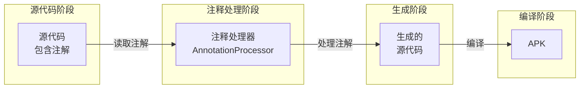
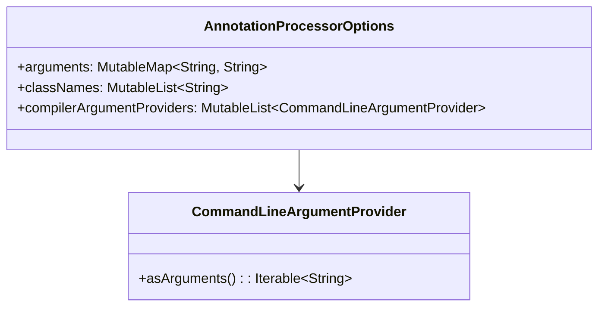
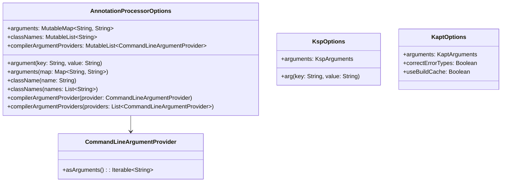

# 21.1.70 AnnotationProcessorOptions

夕阳把湖面染成了一层薄薄的金色。

洛芙趴在草地上，手里拿着一根草茎，有一下没一下地戳着地上的小土坑。刚才黛琳讲的AndroidTest让她大开眼界，原来测试配置有这么多名堂。

“洛芙，别发呆了！”希尔的声音从身后传来，“知道你刚才学的测试配置吧？想不想知道代码是怎么被'变'成APK的？”

洛芙翻了个身，好奇地问：“怎么变？不就是编译一下吗？”

“哪有那么简单！”希尔 grinned（露出灿烂的笑容），在洛芙旁边坐下，“在编译之前，还有很重要的一步——注释处理！”

“注释处理？”洛芙眨了眨眼，“就是 @Override、@Nullable 那种？”

“对，但不止那些！”黛琳不知道什么时候已经架好了白板，“今天我们要讲的，是 AnnotationProcessorOptions——专门用来配置注释处理器的 DSL。”

她在白板上写下几个大字：注释处理器选项。

“注释处理器？”洛芙盘腿坐起来，“就是那个能帮我们自动生成代码的东西？”

“Exactly！”希尔打了个响指，“比如 Room 数据库对吧？你只要写一个 @Entity 注解的类，它就能帮你生成 DAO、Database——这就是注释处理器的魔法！”

伊莎轻声补充道：“就像是露营时的魔法手册——你写下咒语（注解），然后有看不见的精灵（注释处理器）帮你把帐篷搭好、把食材准备好。”

洛裕“扑哧”一声笑了出来：“这个比喻我喜欢！”

她好奇地问：“那 AnnotationProcessorOptions 就是用来配置这些'精灵'的？”

“对！”黛琳点点头，在白板上画了起来：



“这个图展示了注释处理器在构建流程中的位置，”黛琳讲解道，“源代码先经过注释处理器处理，生成新的代码，然后再一起编译成 APK。”

洛芙若有所思地点点头：“也就是说，注解是'原料'，注释处理器是'加工机器'，生成的代码是'产品'？”

“完全正确！”希尔接过话头，“而且 AnnotationProcessorOptions 就是用来配置这台'加工机器'的——告诉它要加工哪些原料、传递什么参数！”

黛琳微笑着说：“让我给你展示一个完整的配置示例。”

她在笔记本上敲了起来：

```kotlin
// AnnotationProcessorOptions 完整配置示例

android {
    // 配置 Java 编译选项
    javaCompileOptions {
        // 注释处理器配置
        annotationProcessorOptions {
            // ===============================
            // 1. 传递参数给注释处理器
            // ===============================
            
            // 方式一：使用 argument() 添加单个参数
            argument("room.schemaLocation", "$projectDir/schemas")
            argument("room.incremental", "true")
            argument("room.generateKotlin", "true")
            
            // 方式二：使用 arguments() 批量添加参数
            arguments += mapOf(
                "room.schemaLocation" to "$projectDir/schemas",
                "room.incremental" to "true",
                "room.generateKotlin" to "true",
                "nullability.annotations" to "$projectDir/annotations"
            )
            
            // ===============================
            // 2. 指定注释处理器类名
            // ===============================
            
            // 添加一个处理器类名
            className("com.example.MyCustomProcessor")
            
            // 添加多个处理器类名
            classNames += listOf(
                "com.example.processor.CustomProcessor",
                "com.google.devtools.ksp.SymbolProcessor"
            )
            
            // ===============================
            // 3. 使用 CommandLineArgumentProvider
            // ===============================
            
            // 当参数是文件或目录时，使用 provider
            compilerArgumentProvider(MyFileArgumentProvider())
            
            // 批量添加 provider
            compilerArgumentProviders += listOf(
                SchemaFileProvider(),
                AnnotationsDirProvider()
            )
        }
    }
}

// ===============================
// 自定义 CommandLineArgumentProvider
// ===============================

// 用于传递文件/目录路径的 Provider
class MyFileArgumentProvider : CommandLineArgumentProvider {
    // 实现 asArguments 方法
    override fun asArguments(): Iterable<String> {
        // 返回传递给注释处理器的参数列表
        return listOf(
            "--schema-location=${projectDir.absolutePath}/schemas",
            "--output-dir=${projectDir.absolutePath}/generated"
        )
    }
}

// Schema 文件 Provider 示例
class SchemaFileProvider : CommandLineArgumentProvider {
    override fun asArguments(): Iterable<String> {
        val schemaDir = file("$projectDir/schemas")
        if (!schemaDir.exists()) {
            schemaDir.mkdirs()
        }
        return listOf(
            "--room.schemaLocation=${schemaDir.absolutePath}"
        )
    }
}

// 注解目录 Provider 示例
class AnnotationsDirProvider : CommandLineArgumentProvider {
    override fun asArguments(): Iterable<String> {
        val annotationsDir = file("$projectDir/custom-annotations")
        return if (annotationsDir.exists()) {
            listOf(
                "--nullability.annotations=${annotationsDir.absolutePath}"
            )
        } else {
            emptyList()
        }
    }
}

// ===============================
// KSP 配置（Kotlin Symbol Processing）
// ===============================

plugins {
    id("com.google.devtools.ksp") version "1.9.20-1.0.14"
}

android {
    ksp {
        // KSP 处理器参数配置
        arg("room.schemaLocation", "$projectDir/schemas")
        arg("room.incremental", "true")
        arg("ksp.generateKotlin", "true")
        
        // 使用 KSP 的方式传递参数
        arguments {
            // Room 模式导出目录
            arg("room.schemaLocation", "$projectDir/schemas")
            
            // Kapt 兼容模式
            arg("ksp.compatibilityMode", "kapt")
            
            // 允许错误的注解
            arg("allow.all.errors", "true")
        }
    }
}

// ===============================
// Kapt 配置（Kotlin Annotation Processing）
// ===============================

kapt {
    // 传递参数给 KAPT 处理器
    arguments {
        // Room 模式位置
        arg("room.schemaLocation", "$projectDir/schemas")
        
        // KAPT 错误检查
        arg("kapt.include.compile.classpath", "false")
        
        // 生成 Kotlin 代码
        arg("kotlin.generate.kotlin", "true")
    }
    
    // KAPT 保留参数（用于调试）
    correctErrorTypes = true
    
    // KAPT 使用工厂模式
    useBuildCache = true
}

// ===============================
// 完整示例：配置 Room 注释处理器
// ===============================

android {
    // Java 编译选项
    javaCompileOptions {
        annotationProcessorOptions {
            // Room 数据库模式文件导出位置
            arguments += mapOf(
                "room.schemaLocation" to "$projectDir/schemas",
                "room.incremental" to "true",
                "room.generateKotlin" to "true",
                "room.roomAnnotations" to "$projectDir/annotations"
            )
        }
    }
    
    // Kotlin 编译选项（KAPT）
    kapt {
        arguments {
            arg("room.schemaLocation", "$projectDir/schemas")
            arg("room.incremental", "true")
        }
    }
    
    // KSP 配置
    ksp {
        arg("room.schemaLocation", "$projectDir/schemas")
        arg("room.incremental", "true")
    }
}

// Room 依赖配置
dependencies {
    // Room 核心库
    implementation("androidx.room:room-runtime:2.6.1")
    implementation("androidx.room:room-ktx:2.6.1")
    
    // Room 注解处理器（用于 Java）
    annotationProcessor("androidx.room:room-compiler:2.6.1")
    
    // Room KAPT 处理器（用于 Kotlin）
    kapt("androidx.room:room-compiler:2.6.1")
    
    // Room KSP 处理器（推荐，用于 Kotlin）
    ksp("androidx.room:room-compiler:2.6.1")
    
    // 测试依赖
    testImplementation("androidx.room:room-testing:2.6.1")
    androidTestImplementation("androidx.room:room-testing:2.6.1")
}
```

“原来注释处理器有这么多配置名堂！”洛芙惊叹道。

黛琳微笑着说：“这还只是基础配置。让我给你解释每个部分的作用。”

她在白板上画起了结构图：



“这个类图展示了 AnnotationProcessorOptions 的核心结构，”黛琳讲解道，“它包含三个主要部分：参数、类名、命令行参数提供者。”

希尔补充道：“简单来说，AnnotationProcessorOptions 就是注释处理器的'控制面板'——告诉处理器要做什么、传什么参数。”

伊莎轻声说道：“就像露营时的准备工作——你要告诉帮你的人（注释处理器）在哪里搭帐篷（className）、带什么工具（arguments）、注意什么事项（compilerArgumentProviders）。”

洛裕“扑哧”一声笑了出来：“这个比喻太形象了！”

她好奇地问：“那 className 和 arguments 有什么区别呢？”

“好问题！”黛琳又在白板上画了起来，“让我展示它们的用途。”

```kotlin
// className vs arguments 的区别

javaCompileOptions {
    annotationProcessorOptions {
        // className：指定要使用的注释处理器类
        // 告诉 Gradle 使用哪个处理器来处理注解
        className("com.google.devtools.ksp.symbol.processing.KspSymbolProcessor")
        
        // arguments：传递给注释处理器的参数
        // 这些参数会在处理器运行时被读取和使用
        arguments += mapOf(
            "room.schemaLocation" to "$projectDir/schemas",
            "room.incremental" to "true"
        )
    }
}

// 常见的注释处理器参数示例

// Room 数据库
arguments += mapOf(
    "room.schemaLocation" to "$projectDir/schemas",  // 数据库模式文件位置
    "room.incremental" to "true",                     // 增量编译
    "room.generateKotlin" to "true",                  // 生成 Kotlin 代码
    "room.annotationProcessor" to "true"              // 启用注解处理器
)

// Dagger/Hilt
arguments += mapOf(
    "dagger.fastInit" to "ENABLED",                   // 快速初始化
    "dagger.hilt.android.internal.disableAndroidSuperclassValidation" to "true"
)

// DataBinding
arguments += mapOf(
    "dataBinding.isEnabled" to "true",
    "dataBinding.enableForTests" to "true"
)

// Lombok
arguments += mapOf(
    "lombok.addLombokGeneratedAnnotation" to "true",
    "lombok.anyConstructorAddConstructorProperties" to "true"
)

// Custom Processor
arguments += mapOf(
    "myprocessor.outputDir" to "$projectDir/generated",
    "myprocessor.verbose" to "true",
    "myprocessor.configFile" to "$projectDir/processor.json"
)
```

“原来 className 是'指定谁来做'，arguments 是'告诉它怎么做'！”洛芙恍然大悟。

希尔表情认真起来：“不过在使用这些配置时，也有一些常见的错误需要注意。”

她在笔记本上继续写着：

```kotlin
// ⚠️ 反模式与注意事项

// 反模式1：参数名称写错
javaCompileOptions {
    annotationProcessorOptions {
        // ❌ 错误：参数名写错了
        arguments += mapOf(
            "room.schemalocation" to "$projectDir/schemas"  // 应该是 schemaLocation！
        )
    }
}

// ✅ 正确：使用正确的参数名（参考官方文档）
javaCompileOptions {
    annotationProcessorOptions {
        arguments += mapOf(
            "room.schemaLocation" to "$projectDir/schemas"
        )
    }
}

// 反模式2：KAPT 和 KSP 混用导致冲突
dependencies {
    // ❌ 错误：同时使用 KAPT 和 KSP 处理同一个库
    kapt("androidx.room:room-compiler:2.6.1")
    ksp("androidx.room:room-compiler:2.6.1")  // 冲突！
}

// ✅ 正确：选择一个使用
dependencies {
    // 方案1：只使用 KSP（推荐）
    ksp("androidx.room:room-compiler:2.6.1")
    
    // 方案2：只使用 KAPT
    kapt("androidx.room:room-compiler:2.6.1")
}

// 反模式3：文件路径使用相对路径导致找不到文件
javaCompileOptions {
    annotationProcessorOptions {
        // ❌ 错误：使用相对路径，在不同工作目录下可能找不到
        arguments += mapOf(
            "room.schemaLocation" to "schemas"  // 相对路径！
        )
    }
}

// ✅ 正确：使用绝对路径或 projectDir
javaCompileOptions {
    annotationProcessorOptions {
        arguments += mapOf(
            "room.schemaLocation" to "$projectDir/schemas"  // 绝对路径
        )
    }
}

// 反模式4：忘记创建输出目录
javaCompileOptions {
    annotationProcessorOptions {
        arguments += mapOf(
            "room.schemaLocation" to "$projectDir/schemas"
        )
    }
}

// ✅ 正确：确保目录存在（在 build.gradle 中创建）
task("createSchemaDir") {
    doLast {
        file("$projectDir/schemas").mkdirs()
    }
}

// 在 Room 依赖处理后运行
dependencies {
    ksp("androidx.room:room-compiler:2.6.1") {
        // 确保在处理依赖前创建目录
        afterEvaluate {
            tasks.named("kspKotlin") {
                dependsOn("createSchemaDir")
            }
        }
    }
}

// 反模式5：KSP 和 KAPT 配置混淆
android {
    // ❌ 错误：在 javaCompileOptions 中配置 KSP 参数
    javaCompileOptions {
        annotationProcessorOptions {
            arg("room.schemaLocation", "$projectDir/schemas")  // KSP 参数放错地方！
        }
    }
    
    // ✅ 正确：KSP 参数放在 ksp {} 块中
    ksp {
        arg("room.schemaLocation", "$projectDir/schemas")
    }
}

// 反模式6：processor path 和 annotation processor 混淆
dependencies {
    // ❌ 错误：把注解处理器库当作普通依赖
    implementation("org.projectlombok:lombok:1.18.30")
    
    // ✅ 正确：使用 annotationProcessor 或 kapt/kpsp
    annotationProcessor("org.projectlombok:lombok:1.18.30")
    annotationProcessor("org.projectlombok:lombok-mapstruct-binding:0.2.0")
    kapt("org.projectlombok:lombok:1.18.30")
    ksp("com.google.devtools.ksp:symbol-processing:1.9.20-1.0.14")
}

// 反模式7：自定义处理器忘记实现正确的接口
// ❌ 错误：普通类不能作为 CommandLineArgumentProvider
class BadProvider {
    fun getArgs(): List<String> = listOf("--arg1", "--arg2")
}

// ✅ 正确：实现 CommandLineArgumentProvider 接口
class GoodProvider : CommandLineArgumentProvider {
    override fun asArguments(): Iterable<String> {
        return listOf("--arg1", "--arg2")
    }
}
```

“原来有这么多坑！”洛芙感叹道。

希尔点点头：“是啊！注释处理器配置看似简单，但其实有很多细节需要注意。”

黛琳补充道：“现在让我给你展示一个最佳实践的完整示例。”

她在笔记本上写下了最终的综合示例：

```kotlin
// 综合示例：企业级注释处理器配置

// ============================================
// 项目根 build.gradle.kts
// ============================================
plugins {
    id("com.android.application") version "8.2.0"
    id("org.jetbrains.kotlin.android") version "1.9.20"
    id("com.google.devtools.ksp") version "1.9.20-1.0.14"
    id("com.google.dagger.hilt.android") version "2.48"
    id("org.jetbrains.kotlin.kapt") version "1.9.20"
}

// ============================================
// 模块 build.gradle.kts
// ============================================

android {
    namespace = "com.example.myapp"
    compileSdk = 34
    
    // ===============================
    // Java 编译选项（用于 KAPT）
    // ===============================
    javaCompileOptions {
        annotationProcessorOptions {
            // 传递参数给 KAPT 注解处理器
            arguments += mapOf(
                // Hilt 参数
                "dagger.hilt.android.internal.disableAndroidSuperclassValidation" to "true",
                "dagger.hilt.disableModulesHaveInstallInCheck" to "true",
                
                // Room 参数
                "room.schemaLocation" to "$projectDir/schemas",
                "room.incremental" to "true",
                "room.generateKotlin" to "true",
                
                // Lombok 参数
                "lombok.addLombokGeneratedAnnotation" to "true",
                "lombok.anyConstructorAddConstructorProperties" to "true"
            )
            
            // 指定自定义注解处理器
            className("com.example.processor.MyCustomProcessor")
        }
    }
    
    // ===============================
    // KSP 配置（推荐）
    // ===============================
    ksp {
        // Room 参数
        arg("room.schemaLocation", "$projectDir/schemas")
        arg("room.incremental", "true")
        
        // Hilt 参数（如果使用 KSP）
        arg("dagger.hilt.android.internal.disableAndroidSuperclassValidation", "true")
        
        // KSP 自定义参数
        arg("myprocessor.verbose", "true")
        arg("myprocessor.configFile", "$projectDir/processor-config.json")
    }
    
    // ===============================
    // KAPT 配置
    // ===============================
    kapt {
        // 保持参数（用于调试）
        correctErrorTypes = true
        
        // KAPT 参数
        arguments {
            arg("kapt.include.compile.classpath", "false")
            arg("kotlin.generate.kotlin", "true")
        }
        
        // 错误处理
        useBuildCache = true
        javacOptions {
            option("-Xmaxerrs", 500)
        }
    }
}

// ============================================
// 自定义 CommandLineArgumentProvider
// ============================================

// 用于 Room Schema 导出的 Provider
class SchemaArgumentProvider : CommandLineArgumentProvider {
    override fun asArguments(): Iterable<String> {
        val schemaDir = file("$projectDir/schemas")
        if (!schemaDir.exists()) {
            schemaDir.mkdirs()
        }
        return listOf(
            "--room.schemaLocation=${schemaDir.absolutePath}"
        )
    }
}

// 用于自定义处理器配置的 Provider
class CustomProcessorProvider : CommandLineArgumentProvider {
    override fun asArguments(): Iterable<String> {
        val configFile = file("$projectDir/processor-config.json")
        return if (configFile.exists()) {
            listOf(
                "--config=${configFile.absolutePath}",
                "--verbose=true",
                "--output=${project.buildDir.absolutePath}/generated"
            )
        } else {
            listOf("--verbose=false")
        }
    }
}

// ============================================
// 依赖配置
// ============================================
dependencies {
    // ---------- Room ----------
    implementation("androidx.room:room-runtime:2.6.1")
    implementation("androidx.room:room-ktx:2.6.1")
    ksp("androidx.room:room-compiler:2.6.1")  // 推荐使用 KSP
    
    // ---------- Hilt ----------
    implementation("com.google.dagger:hilt-android:2.48")
    kapt("com.google.dagger:hilt-android-compiler:2.48")  // Hilt 目前主要用 KAPT
    
    // ---------- 自定义注解 ----------
    implementation(project(":custom-annotations"))
    ksp(project(":custom-processor"))
    
    // ---------- Lombok ----------
    compileOnly("org.projectlombok:lombok:1.18.30")
    annotationProcessor("org.projectlombok:lombok:1.18.30")
    kapt("org.projectlombok:lombok:1.18.30")
    testCompileOnly("org.projectlombok:lombok:1.18.30")
    testAnnotationProcessor("org.projectlombok:lombok:1.18.30")
    
    // ---------- 测试 ----------
    testImplementation("junit:junit:4.13.2")
    testImplementation("org.jetbrains.kotlin:kotlin-test:1.9.20")
}

// ============================================
// 创建 Schema 目录的任务
// ============================================
tasks.register("createSchemaDirectory") {
    doLast {
        val schemaDir = file("$projectDir/schemas")
        if (!schemaDir.exists()) {
            schemaDir.mkdirs()
        }
    }
}

// 确保在 KSP/KAPT 之前创建目录
tasks.matching { it.name.contains("Ksp") || it.name.contains("kapt") }.configureEach {
    dependsOn("createSchemaDirectory")
}

// ============================================
// 配置增量构建
// ============================================
android {
    buildFeatures {
        buildConfig = true
    }
    
    // 启用增量注解处理（KAPT）
    kapt {
        useBuildCache = true
    }
    
    // 启用增量 KSP
    ksp {
        arg("ksp.incremental", "true")
    }
}
```

洛芙看完了整个示例，长长地出了一口气：“原来注释处理器配置有这么多东西！”

黛琳微笑着说：“这就是企业级项目的日常。不过万变不离其宗——理解每个配置项的作用，就能灵活组合。”

“对！”希尔总结道，“AnnotationProcessorOptions 就是注释处理器的'总调度中心'——指定处理器、传递参数、管理命令行参数提供者。”

伊莎轻声补充：“注释处理器让开发更高效——就像露营时的魔法精灵，帮你自动搭帐篷、整理装备。”

洛芙若有所思地点点头：“我明白了！className 指定谁来做工，arguments 告诉它怎么工作，compilerArgumentProvider 处理文件路径——三者配合，让代码自动生成成为可能！”

她抬头看了看天空，夕阳已经完全沉下去了，天边只剩下一抹淡淡的晚霞。湖面上倒映着星星点点的灯光——不知道是谁在湖对岸露营。

“谢谢黛琳！谢谢希尔！”洛芙裹紧外套，“今天学的 AnnotationProcessorOptions 就像露营时的工具箱——指定工具（className）、传递参数（arguments）、处理文件（compilerArgumentProvider）——让代码生成变得可控！”

黛琳收拾着白板：“记住，AnnotationProcessorOptions 是 Android Gradle Plugin 提供的注释处理器配置 DSL。它管理处理器的参数、类名和命令行参数提供者，是代码生成的核心配置接口。”

“对！”希尔补充道，“argument() 和 arguments() 传递参数，className() 和 classNames() 指定处理器，compilerArgumentProvider() 处理文件路径——三者配合，形成完整的处理器配置。”

伊莎轻声说道：“注释处理器让开发更高效——就像有看不见的精灵帮你搭建营地、整理装备——alles wird automatisch（一切都会自动完成）。”

洛裕“扑哧”一声笑了出来：“伊莎又开始飙德语了！”

远处传来一阵轻快的吉他声，不知道是湖对岸的露营者在弹唱。星星开始一颗一颗地冒出来，夏天真好，露营真好，学习新东西的时光，更好。

---

## 专业技术总结

> **AnnotationProcessorOptions** 是 Android Gradle Plugin 提供的注释处理器配置 DSL，用于配置注解处理器的参数和行为。它允许开发者指定要使用的注解处理器、传递配置参数、管理命令行参数提供者，是 Android 代码生成体系的核心配置接口。

#### 结构图



#### 注释处理器类型对比

| 类型 | 配置位置 | 优点 | 缺点 |
|------|----------|------|------|
| KAPT | javaCompileOptions | 兼容性好 | 编译慢 |
| KSP | ksp {} | 编译快 | 不支持所有处理器 |
| APT | annotationProcessorOptions | 简单直接 | 功能有限 |

#### 反模式与陷阱

1. **参数名拼写错误**：每个处理器有自己的参数名，必须参考官方文档
2. **KAPT 和 KSP 混用**：不要同时用同一个处理器，可能导致冲突
3. **文件路径使用相对路径**：应使用 $projectDir 绝对路径
4. **忘记创建输出目录**：如 Room 的 schema 目录需要手动创建
5. **KSP 和 KAPT 配置位置混淆**：KSP 参数放在 ksp {} 块，不是 annotationProcessorOptions
6. **处理器库当作普通依赖**：应使用 annotationProcessor/kapt/ksp 引入

#### 设计哲学

AnnotationProcessorOptions 体现了 Android 构建系统的**配置驱动生成**理念：
- 参数化配置：允许运行时传递配置，控制生成行为
- 接口隔离：通过 CommandLineArgumentProvider 处理文件路径
- 多处理器支持：支持同时配置多个处理器
- 与构建系统集成：无缝集成 KAPT、KSP 等构建工具

---

> 学习建议：在实际项目中，优先使用 KSP（性能更好）。Room 推荐使用 KSP，Hilt 目前主要用 KAPT。确保处理器输出目录存在。使用 CommandLineArgumentProvider 处理文件路径参数。

---

## 洛芙的小小日记本

今天黛琳和希尔讲了AnnotationProcessorOptions——注释处理器配置！原来代码生成不是魔法，而是配置出来的——className指定处理器，arguments传递参数，compilerArgumentProvider处理文件路径。KAPT和KSP各有优缺点，Room推荐KSP，Hilt用KAPT。就像露营时要告诉帮你的人在哪搭帐篷、带什么工具——原来准备工作的门道这么多~

---

## 今日关键词

- **AnnotationProcessorOptions**: Android Gradle Plugin 的注释处理器配置 DSL
- **javaCompileOptions {}**: Java 编译选项配置块
- **annotationProcessorOptions {}**: 注释处理器选项配置块
- **argument()**: 添加单个注解处理器参数
- **arguments**: 注解处理器参数 Map
- **className()**: 指定单个注解处理器类名
- **classNames**: 注解处理器类名列表
- **compilerArgumentProvider()**: 添加命令行参数提供者
- **compilerArgumentProviders**: 命令行参数提供者列表
- **CommandLineArgumentProvider**: Gradle 命令行参数提供者接口
- **KAPT**: Kotlin Annotation Processing Tool
- **KSP**: Kotlin Symbol Processing
- **增量编译**: 只编译变化的代码，提高构建速度
- **Room**: Android 数据库注解处理器
- **Hilt**: Android 依赖注入注解处理器
- **Lombok**: Java 注解处理器，简化样板代码
- **代码生成**: 根据注解自动生成源代码
- **注解处理器**: 处理注解并生成代码的编译器插件
