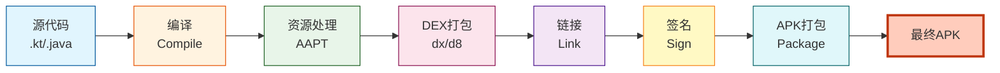

# 21.1.71 ApkExtension — APK构建配置

夕阳慢慢下沉，把湖面染成了蜂蜜色。洛芙靠在树干上，手里捧着一杯温热的可可，看着黛琳在白板上画着各种方框和箭头。

“刚才说的AnnotationProcessorOptions，是不是就像给编译器传小纸条？”洛芙歪着头问。

“差不多是这个意思。”黛琳点点头，把白板笔盖好，“不过说到传小纸条——你有没有想过，你写完代码之后，这个‘小纸条’最后变成什么？”

洛芙眨眨眼：“变成APK呀？”

“对咯。”伊莎笑着接口，从口袋里掏出一颗亮晶晶的石头，在指尖抛来抛去，“那你知道这个APK是怎么组装出来的吗？里面都装了些什么？黛琳今天要讲的，就是组装这个‘魔法包裹’的说明书。”

“说明书？”洛芙好奇地凑过去。

黛琳重新拿起白板笔，在白板角落写下几个字母：**ApkExtension**。

---

## 问题：APK到底是怎么组装出来的？

希尔正盘腿坐在草地上，膝盖上放着她的笔记本电脑。听到这话，她把屏幕转过来给洛芙看：“看，这是我们项目的build.gradle文件。”

```kotlin
android {
    namespace "com.example.camping"
    compileSdk 34

    defaultConfig {
        applicationId "com.example.camping"
        minSdk 24
        targetSdk 34
        versionCode 1
        versionName "1.0"
    }

    buildTypes {
        release {
            minifyEnabled true
            proguardFiles getDefaultProguardFile('proguard-android-optimize.txt'), 'proguard-rules.pro'
        }
        debug {
            applicationIdSuffix ".debug"
            debuggable true
        }
    }
}
```

洛芙看着这些代码，有些眼熟：“这些我好像见过……但是不太明白为什么要这么写。”

“这就是ApkExtension的力量。”黛琳指着白板上的名字说，“在Android Gradle Plugin里，android {}这个块，就是ApkExtension。它负责告诉构建系统：你的APK应该长什么样，要包含什么属性。”

“比如说——”希尔敲了敲键盘，调出另一段配置，“applicationId就是你在应用商店的唯一身份证；versionCode是内部版本号，每次更新都必须比上次大；versionName是给用户看的版本名，比如'1.0'、'2.1.3'这种。”

洛芙掏出自己的手机，翻到设置里的应用信息：“哦——原来'版本号'和'版本名称'是这样来的啊！”

---

## 比喻：像在打包一个露营行李箱

伊莎把手中的石头放在草地上，双手比划着：“你们想想看，出门前打包行李箱，是不是要考虑很多事情？”

“衣服带几件？洗漱用品装哪个袋子？零食要不要多带一点？”洛芙扳着手指数。

“对呀。”伊莎笑着点头，“ApkExtension就像是给你的APK‘打包行李’的清单。它要决定：应用ID叫什么（相当于行李箱上贴的名字标签）、版本是多少（相当于行李箱的编号）、要不要压缩空间（相当于把衣服卷起来节省地方）、要不要混淆代码（相当于把贵重物品藏到夹层里）……”

“原来如此！”洛芙眼睛亮了起来，“那黛琳，快告诉我这个清单上都有什么项目呗？”

黛琳笑着在白板上画了一个大大的行李箱，在箱子上画满各种小格子：“那我们一个一个来看——”

---

## 核心属性详解

### applicationId：应用的身份ID

“首先是这个——”黛琳在行李箱的标签位置画了一个圆圈，“applicationId。它是你应用在设备上的唯一标识，就像你的身份证号一样。”

```kotlin
android {
    defaultConfig {
        // 应用在设备上的唯一标识
        // 格式：通常是完全倒装的域名
        applicationId "com.example.camping"
        
        // 如果你想同时安装调试版和正式版
        applicationIdSuffix ".debug"  // 调试版变成 com.example.camping.debug
    }
    
    buildTypes {
        debug {
            // 调试构建自动添加 .debug 后缀
            applicationIdSuffix ".debug"
        }
    }
}
```

洛芙举手提问：“为什么域名要倒过来写啊？”

“为了保证全世界唯一呀。”希尔解释道，“如果你正着写'com.example'，万一别人也用了呢？但倒过来写，再加上你的应用名，就几乎不会重复了——因为域名是唯一的嘛。”

“就像全世界没有两片相同的叶子！”伊莎补充道。

### versionCode和versionName：版本的双胞胎

“接下来是这对双胞胎。”黛琳在行李箱上画了两个并排的格子，“versionCode是整数，每次发布都必须比上次大；versionName是字符串，给用户看的。”

```kotlin
android {
    defaultConfig {
        // 整数版本号，每次更新必须递增
        // Play商店用这个来判断更新
        versionCode 15
        
        // 字符串版本名，给用户看的
        versionName "2.1.3"
    }
}
```

“为什么需要两个？”洛芙不解。

“分工不同啦。”希尔把电脑转过来，打开一个应用商店的页面，“你看这个应用，versionName是'2.1.3'，但你更新的时候，versionCode可能已经跑到58了。versionCode是给系统和商店用的，versionName是给你看的。”

“就像学号和名字？”洛芙灵机一动。

“差不多！”黛琳笑着点头，“学号（versionCode）是系统用的，名字（versionName）是给人看的。”

---

### minifyEnabled：代码压缩与混淆

黛琳在行李箱的“压缩”格子上画了一个问号：“这个可能有点难懂——minifyEnabled是做什么的？”

“是把代码变小？”洛芙猜测。

“对，但不止变小。”黛琳画了另一个格子来解释混淆的过程，“minifyEnabled = true 会做两件事：第一，压缩（minify）——删除空格、缩短变量名，让文件变小；第二，混淆（obfuscate）——把有意义的类名、方法名改成无意义的字母，比如CampingActivity变成a，onCreate变成a()。”

洛芙皱起眉头：“那代码还能看吗？”

“机器能看懂就行了。”希尔笑着说，“而且混淆还有个好处——别人想逆向工程你的APK时，会非常难懂你的代码在干什么。”

伊莎补充道：“就像把一封写好的信翻译成只有你能懂的密码语言。”

```kotlin
android {
    buildTypes {
        release {
            // 启用代码压缩和混淆
            minifyEnabled true
            
            // 指定混淆规则文件
            // keep 里的类不会被混淆
            proguardFiles getDefaultProguardFile('proguard-android-optimize.txt'), 'proguard-rules.pro'
        }
        
        debug {
            // 调试版不混淆，方便调试
            minifyEnabled false
        }
    }
}
```

黛琳补充道：“不过混淆有风险——有些反射、序列化可能会出问题。所以需要proguard-rules.pro来保护一些不该被混淆的类。”

---

### multiDexEnabled：突破65K方法数限制

“这个是进阶内容了。”黛琳画了一个大大的格子，“Android在5.0之前，每个APK只能包含65536个方法——如果你用了很多库，很容易就超限。”

“哇，65536个？这么多还不够用？”洛芙惊呼。

“现在当然不够啦！”希尔调出一个配置文件，“所以有了multiDexEnabled = true，它会把你的APK拆成多个dex文件，就像把一本很厚的书分成几册来装。”

```kotlin
android {
    defaultConfig {
        // 启用多dex支持
        // 当方法数超过65536时必须开启
        multiDexEnabled true
    }
}
```

伊莎形象的比喻：“就像把大行李箱里的东西分到几个小箱子里，这样每个箱子都不会太重。”

---

### signingConfigs：签名配置

“最后这个很重要——签名。”黛琳的表情认真起来，“APK必须签名才能安装到手机上，不然系统会拒绝。”

```kotlin
android {
    signingConfigs {
        // 发布签名配置
        release {
            // 实际上要填入你的真实密钥路径和密码
            storeFile file("my-release-key.jks")
            storePassword "your_store_password"
            keyAlias "your_key_alias"
            keyPassword "your_key_password"
        }
        
        // 调试签名（自动生成）
        debug {
            // Android Studio会自动配置
            storeFile file("$HOME/.android/debug.keystore")
            storePassword "android"
            keyAlias "androiddebugkey"
            keyPassword "android"
        }
    }

    buildTypes {
        release {
            // 发布构建使用发布签名
            signingConfig signingConfigs.release
        }
        debug {
            // 调试构建使用调试签名
            signingConfig signingConfigs.debug
        }
    }
}
```

洛芙看看自己的手机：“那我的手机怎么知道这个APK是谁签名的？”

“签名就像你的指纹。”伊莎解释道，“系统会检查APK的签名，确认它确实来自你声称的开发者。这样就不会有人偷偷篡改你的应用了。”

---

## 可视化：ApkExtension的完整结构

黛琳画完白板，退后两步让洛芙看整体结构。

“你们看，ApkExtension就是这样一个层层嵌套的配置块——”她画了一个大框图：

```mermaid
graph TD
    A[android {}<br/>ApkExtension] --> B[defaultConfig<br/>基础配置]
    A --> C[buildTypes<br/>构建类型]
    A --> D[signingConfigs<br/>签名配置]
    A --> E[splits<br/>拆分配置]
    A --> F[compileOptions<br/>编译选项]
    
    B --> B1[applicationId]
    B --> B2[versionCode]
    B --> B3[versionName]
    B --> B4[minSdk]
    B --> B5[targetSdk]
    B --> B6[multiDexEnabled]
    
    C --> C1[release]
    C --> C2[debug]
    
    C1 --> C1a[minifyEnabled]
    C1 --> C1b[signingConfig]
    C1 --> C1c[proguardFiles]
    
    C2 --> C2a[applicationIdSuffix]
    C2 --> C2b[debuggable]
    
    style A fill:#ff9900,stroke:#333,stroke-width:2px
    style B fill:#66ccff,stroke:#333
    style C fill:#66ff99,stroke:#333
    style D fill:#ff66cc,stroke:#333
```

洛芙盯着看了一会儿：“好像一个公司的组织架构图啊！”

“对呀，很像！”黛琳笑着说，“defaultConfig就像公司的基础制度，buildTypes像是不同的部门——release部门是面向客户的，debug部门是内部测试的。”

---

## 反模式与重构：常见错误示例

希尔突然举手：“我来讲一个常见的错误吧——很多人喜欢把所有配置都塞到build.gradle里，结果文件越来越乱。”

她在电脑上敲了一段代码：

```kotlin
// ❌ 反模式：把所有配置堆在一起
android {
    compileSdk 34
    namespace "com.example.app"
    
    defaultConfig {
        applicationId "com.example.app"
        versionCode 1
        versionName "1.0"
        minSdk 21
        targetSdk 34
    }
    
    buildTypes {
        release {
            minifyEnabled true
        }
        debug {
            minifyEnabled false
            applicationIdSuffix ".debug"
        }
    }
    
    // 错误：把签名配置直接写在build.gradle里！
    signingConfigs {
        release {
            storeFile file("key.jks")
            storePassword "123456"  // 危险：密码明文存储！
            keyAlias "mykey"
            keyPassword "123456"
        }
    }
}
```

“这有什么问题吗？”洛芙问。

“问题大了！”希尔严肃地说，“第一，密码明文写在文件里，如果把这个文件提交到GitHub，就等于把密钥密码公开了；第二，配置堆在一起，后期很难维护。”

黛琳补充道：“正确做法是把敏感信息放到gradle.properties或者本地配置文件里。”

```kotlin
// ✅ 重构后：分离敏感信息
// gradle.properties 文件
// gradle.properties
// signingKeyPath=my-key.jks
// signingKeyPassword=your_secure_password
// signingKeyAlias=your_alias

android {
    signingConfigs {
        release {
            // 从gradle.properties读取敏感信息
            storeFile file(gradleProperty("signingKeyPath"))
            storePassword gradleProperty("signingKeyPassword")
            keyAlias gradleProperty("signingKeyAlias")
            keyPassword gradleProperty("signingKeyPassword")
        }
    }
}
```

伊莎总结道：“还有一点——不同环境的配置应该分开。开发环境、测试环境、生产环境，需要不同的签名和applicationId。”

```kotlin
// ✅ 更佳实践：使用build variant
android {
    buildTypes {
        release {
            minifyEnabled true
            signingConfig signingConfigs.release
        }
        debug {
            minifyEnabled false
            applicationIdSuffix ".debug"
            signingConfig signingConfigs.debug
        }
    }
    
    // 或者使用product flavors
    productFlavors {
        staging {
            applicationIdSuffix ".staging"
            versionNameSuffix "-staging"
        }
        production {
            // 生产环境配置
        }
    }
}
```

---

## 构建流程图：APK是怎么生成的？

洛芙看着白板上的流程图，若有所思：“所以这些配置都配置好了之后，APK是怎么生成的？”

黛琳重新拿起白板笔，画了一幅流程图：



“整个过程是这样的——”黛琳一边画一边解释，“首先，你的Kotlin或Java源代码被编译成class文件；然后，Android资源处理器（AAPT）处理所有的资源文件比如layout、drawable；接着，dx或d8工具把这些class文件打包成DEX格式——这就是Android虚拟机运行的文件；然后 linker 把所有东西链接起来；最后，用你的签名密钥签名，打包成最终的APK文件。”

洛芙惊叹：“原来一个APK要经过这么多道工序啊！”

“所以这些配置才会这么重要嘛。”希尔说，“每一个步骤的行为，都可以通过ApkExtension来控制。”

---

## 运行示例：看！这就是APK里的东西

希尔突然兴奋起来：“我教你们一个好玩的东西——用Android Studio或者命令行，可以查看APK里都装了些什么！”

她在终端里敲了几个命令：

```bash
# 查看APK基本信息
$ aapt dump badging app.apk

# 输出示例：
package: name='com.example.camping' versionCode='1' versionName='1.0'
sdkVersion:'24'
targetSdkVersion:'34'
application-label:'Camping'
launchable-activity: 'com.example.camping.MainActivity'

# 查看APK里有哪些文件
$ unzip -l app.apk

# 输出示例：
Archive:  app.apk
Length      Date    Time    Name
---------  ---------- -----   ----
     104  01-01-2024 00:00   AndroidManifest.xml
   12345  01-01-2024 00:00   classes.dex
    5678  01-01-2024 00:00   classes2.dex
    8901  01-01-2024 00:00   resources.arsc
    2048  01-01-2024 00:00   res/layout/main_activity.xml
    1024  01-01-2024 00:00   res/drawable/icon.png
     ...
---------                     -------
 1234567                     25 files
```

“看！这就是APK的内部结构。”希尔指着屏幕说，“AndroidManifest.xml是清单文件，classes.dex是编译后的代码，resources.arsc是资源索引表……”

洛芙凑近屏幕，眼睛闪闪发亮：“原来我写的代码，最后变成了classes.dex文件啊！”

“对呀，所以你配置的minifyEnabled、multiDexEnabled这些，都直接影响这些文件的内容和大小。”黛琳总结道。

---

## 夕阳渐落，知识在心中沉淀

天边的晚霞从金色变成了紫红色，湖面上波光粼粼，像是撒了一把碎金子。洛芙仰头看着天空，深深吸了一口气。

“所以啊，ApkExtension就是控制APK怎么打包的说明书。”洛芙总结道，“applicationId是身份证，versionCode是内部编号，versionName是给用户看的名字，minifyEnabled是压缩行李，multiDexEnabled是分箱打包，signingConfigs是签名盖章……”

伊莎笑着鼓掌：“我们的洛芙学得越来越好了！”

黛琳收起白板笔：“今天的露营就到这里吧。回去之后，你们可以试试在自己的项目里修改这些配置，看看APK会有什么变化。”

希尔已经把电脑收进背包，站起身来拍了拍草屑：“明天我们讲splits——怎么把一个APK拆成多个，这样用户只需要下载他们需要的部分。”

“听起来好厉害！”洛芙跟着站起来，伸了个懒腰。

四个女孩收拾好东西，沿着湖边的小路往营地走去。蝉鸣声一浪一浪地从树梢涌上来，头顶的天空从蜜桃色渐渐变成了深蓝色，第一颗星星已经迫不及待地眨起了眼睛。

---

> **学习建议**  
> 理解ApkExtension的配置项是掌握Android构建系统的基石。建议先在本地项目中尝试修改每个配置项，观察APK的变化；熟悉后再学习build variant和product flavors来实现多渠道构建。签名信息一定要妥善保管，绝不能提交到版本控制系统。

---

## 洛芙的小小日记本

今天学会了ApkExtension！原来android {}这个块这么重要——它管着APK的身份证（applicationId）、版本号（versionCode和versionName）、要不要压缩（minifyEnabled）、怎么签名（signingConfigs）……就像行李箱的打包清单一样！回去要把这些配置都玩一遍~⭐

---

## 今日关键词

**ApkExtension** — Android Gradle Plugin中的DSL扩展块，用于配置APK打包的各项参数，相当于构建过程的"总配置清单"。

**applicationId** — 应用在设备上的唯一标识符，格式为倒写域名，确保全球唯一。

**versionCode** — 整型版本号，每次发布必须递增，供系统和应用商店判断更新。

**versionName** — 字符串版本名称，供用户查看，如"1.0"、"2.1.3"。

**minifyEnabled** — 是否启用代码压缩和混淆，true时会压缩代码并混淆类名方法名以保护代码。

**multiDexEnabled** — 是否启用多DEX支持，当方法数超过65536时必须启用。

**signingConfigs** — 签名配置块，包含密钥库路径、别名和密码，用于给APK签名。

**buildTypes** — 构建类型配置，定义release、debug等不同构建版本的参数。

**productFlavors** — 产品风味配置，用于实现多渠道、不同配置的构建variant。

**DEX** — Dalvik Executable，Android虚拟机可执行的文件格式，APK中的classes.dex即为编译后的DEX文件。

**AAPT** — Android Asset Packaging Tool，处理资源文件的构建工具。

**ProGuard** — 代码混淆工具，用于压缩、优化和混淆Java/Kotlin字节码。
