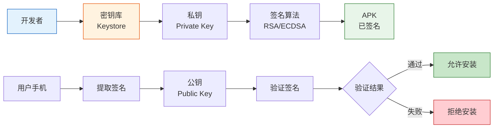
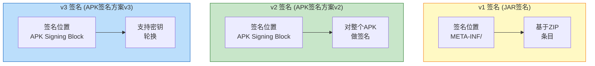

# 21.1.72 Apk签名配置

太阳已经沉下去一大半，把湖面染成了橘红色。洛芙捧着的可可已经凉透了，但她还是舍不得放下——不是渴，只是觉得捧着东西比较有安全感。

“刚才说的signingConfigs，是不是就是给APK‘盖章’的那个配置？”洛芙回想着上一章的内容。

“对，就是那个。”黛琳点点头，把白板笔换了一种颜色，“不过今天我们要讲的ApkSigningConfig，可不只是‘盖章’这么简单——它管的事情可多啦。”

伊莎捡起一颗小石子，在地上画了个圆：“就像盖章之前，你得先有印章吧？ApkSigningConfig就是帮你管理‘印章’的系统。”

“印章？”洛芙眨眨眼，“ APK也需要印章吗？”

“需要得不得了呢。”希尔笑着把笔记本转过来，“而且这个‘印章’还有好几种级别，用错了地方，可能会出大事。”

---

## 问题：APK签名到底是什么？

“那天我问我爸，”洛芙抱着膝盖说，“我说‘签名’是不是就是签字？我爸说不一样。到底哪里不一样？”

黛琳笑着摇头：“你爸说得对。签名（Signature）和签字（Signature Line）是两回事——签字是写名字，签名是盖印章。”

她在地上画了一个简单的图：



“简单来说，签名就是一种数学证明。”黛琳解释道，“它能证明两件事：第一，这个APK确实是你发布的，不是别人伪造的；第二，这个APK发布之后没有被修改过——哪怕只是改了一个像素的图片都不行。”

洛芙举手：“那……怎么做到的啊？”

“密码学。”希尔言简意赅，“你用私钥对APK内容做数学运算，得到一串‘密码’。别人用公钥可以验证这串‘密码’是不是真的。”

伊莎补充道：“就像古代的虎符——只有两块完全吻合，才能证明是真的。”

---

## 比喻：签名就是给行李箱上锁

“看那边——”伊莎指着湖边正在收拾行李的一家人，“他们把行李箱锁起来了，对吧？”

洛芙点点头。

“APK签名呢，就是给Android的‘行李箱’上锁。”伊莎比划着说，“不过这个锁有两个特点：第一，只有一把钥匙能打开（私钥）；第二，如果你打开行李箱想偷偷放点东西进去，锁就坏了（签名验证失败）。”

“这么厉害！”洛芙惊叹。

“所以啊，”黛琳接口道，“ApkSigningConfig就是告诉你：这个锁用什么锁（签名算法）、钥匙长什么样（密钥库）、锁在哪里（配置路径）……”

---

## ApkSigningConfig详解

希尔把笔记本放在草地上，敲出一段代码：

```kotlin
android {
    signingConfigs {
        // 创建签名配置
        create("myRelease") {
            // 密钥库文件路径
            storeFile = file("keys/release-key.jks")
            
            // 密钥库密码
            storePassword = "your_store_password"
            
            // 密钥别名
            keyAlias = "my_app_key"
            
            // 密钥密码
            keyPassword = "your_key_password"
            
            // 签名算法（可选，默认RSA）
            // 可选值：RSA, DSA, EC
            keyAlg = "RSA"
            
            // 签名版本（可选）
            // 可选值：v1, v2, v3, v1+v2, v1+v3, v2+v3, v1+v2+v3
            v1SigningEnabled = true
            v2SigningEnabled = true
            v3SigningEnabled = false
        }
    }
}
```

洛芙盯着屏幕看：“这些……都是什么跟什么啊？”

“别急，我们一个一个来看。”黛琳拿起白板笔，在白板上写下四个大字：**密钥库**。

---

### 密钥库：装钥匙的保险箱

“首先是这个——”黛琳在白板上画了一个大大的保险箱，“storeFile就是密钥库（Keystore）文件。你可以把它想象成一个保险箱，里面装着你的钥匙。”

“那这个文件在哪里？”洛芙问。

“通常是一个.jks或者.keystore文件。”希尔解释道，“你可以用keytool命令来创建它。”

```bash
# 创建密钥库
$ keytool -genkeypair -v -storetype JKS \
    -keyalg RSA -keysize 2048 -validity 10000 \
    -keystore my-release-key.jks \
    -alias my_app_key \
    -storepass your_store_password \
    -keypass your_key_password

# 查看密钥库内容
$ keytool -list -v -keystore my-release-key.jks

# 输出示例：
Keystore type: JKS
Keystore provider: SUN

Your keystore contains 1 entry

Alias name: my_app_key
Creation date: 2024-01-15
Entry type: PrivateKeyEntry
Certificate chain length: 1
Certificate[1]:
Owner: CN=Your Name, OU=Your Unit, O=Your Org, L=City, ST=State, C=US
Issuer: CN=Your Name, OU=Your Unit, O=Your Org, L=City, ST=State, C=US
Serial number: 1a2b3c4d
Valid from: Mon Jan 15 00:00:00 CST 2024 until: Thu Sep 30 00:00:00 CST 2047
Certificate fingerprints:
         SHA1: AA:BB:CC:DD:EE:FF:00:11:22:33:44:55:66:77:88:99:AA:BB:CC:DD
         SHA256: 12:34:56:78:90:AB:CD:EF:12:34:56:78:90:AB:CD:EF:12:34:56:78:90:AB:CD:EF:12:34:56:78
Signature algorithm name: SHA256withRSA
Version: 3
```

“原来是这样！”洛芙凑近屏幕看，“那个Certificate fingerprints就是指纹吧？就像每个钥匙都有独特的齿纹？”

“对！这个指纹可以用来验证密钥的身份。”黛琳点头道。

---

### storePassword和keyPassword：两把密码

“有意思的是，密钥库有两把密码。”黛琳在白板上画了两把钥匙的图案。

```kotlin
signingConfigs {
    create("example") {
        storeFile = file("my-key.jks")
        
        // 密钥库密码：打开保险箱的密码
        storePassword = "store_password_123"
        
        // 密钥密码：使用这把钥匙的密码
        keyPassword = "key_password_456"
    }
}
```

“storePassword是打开保险箱的密码，keyPassword是使用钥匙的密码。”黛琳解释道，“你可以让它们一样，也可以不一样——分开会更安全一些。”

洛芙举手提问：“如果密码忘了怎么办？”

希尔耸耸肩：“那就很麻烦了，基本上只能重新生成一对密钥——然后你的应用就要重新发布，因为旧签名对不上了。”

“而且用户也必须重新下载安装。”伊莎补充道，“所以一定要把密码保管好！”

---

### keyAlias：一把钥匙一个名字

“这个很简单——”黛琳在保险箱旁边画了一个标签，“一个密钥库里可以放很多把钥匙，每把钥匙有一个别名（alias），就像每把钥匙上贴的标签。”

```kotlin
signingConfigs {
    // 一个密钥库可以放多把钥匙
    create("release") {
        storeFile = file("my-keys.jks")
        storePassword = "store_password"
        
        // 第一个密钥
        keyAlias = "app_release_key"
        keyPassword = "release_password"
    }
    
    // 第二个配置用同一密钥库，但用不同的钥匙
    create("internal") {
        storeFile = file("my-keys.jks")  // 同一个库
        storePassword = "store_password"
        
        // 不同的密钥别名
        keyAlias = "app_internal_key"
        keyPassword = "internal_password"
    }
}
```

“为什么要放多把钥匙？”洛芙不解。

“比如说，”希尔解释道，“你有一个应用，但想给企业内部版本和公开版本用不同的签名——这样企业内部的应用可以自动更新，但公开版本不行。”

伊莎补充道：“还有一种情况是密钥轮换——每过几年换一把新钥匙，防止旧钥匙泄露。”

---

### 签名版本：v1、v2、v3的区别

黛琳在白板上画了三个同心圆：



“签名版本这个问题，可有意思了。”黛琳说道，“Android支持三种签名版本——v1、v2、v3，越新的越安全。”

| 特性 | v1 | v2 | v3 |
|------|-----|-----|-----|
| 签名位置 | META-INF/ | APK Signing Block | APK Signing Block |
| 签名范围 | 每个ZIP条目 | 整个APK文件 | 整个APK文件 |
| 安装速度 | 较慢 | 快 | 快 |
| 密钥轮换 | 不支持 | 不支持 | 支持 |
| 兼容性 | Android 4.0+ | Android 7.0+ | Android 9.0+ |

“简单来说，”希尔总结道，“v1是最老的，几乎所有Android版本都支持，但速度慢；v2从Android 7.0开始支持，速度快很多；v3从Android 9.0开始支持，还能换密钥。”

洛芙歪着头：“那应该用哪个？”

“现在的最佳实践是v1+v2+v3都启用。”黛琳说，“兼容性好的旧手机会用v1，新手机会用v2或v3——系统会自动选择最合适的版本。”

```kotlin
signingConfigs {
    create("release") {
        storeFile = file("key.jks")
        storePassword = "password"
        keyAlias = "mykey"
        keyPassword = "password"
        
        // 全部启用，兼容所有情况
        v1SigningEnabled = true
        v2SigningEnabled = true
        v3SigningEnabled = true
    }
}
```

---

## 可视化：签名验证流程

黛琳重新画了一幅大图，完整的签名和验证流程：


“整个流程是这样的——”黛琳指着图解释，“首先，你在开发时用密钥库生成一对密钥；构建APK时，系统会对APK内容计算哈希，然后用私钥生成签名；用户下载APK后，手机会用证书里的公钥验证签名，确认APK没有被篡改。”

---

## 反模式与重构：常见错误

希尔突然严肃起来：“我来讲几个常见的错误——你们千万别犯。”

### 错误一：密码明文写在build.gradle里

```kotlin
// ❌ 反模式：密码明文存储
android {
    signingConfigs {
        release {
            storeFile file("key.jks")
            storePassword "123456"  // 危险！
            keyAlias "mykey"
            keyPassword "123456"    // 危险！
        }
    }
}
```

“这太危险了！”洛芙惊呼。

“对，如果你把这个文件提交到GitHub——”希尔做了个抹脖子的动作，“就等于告诉全世界你的密钥密码。”

### 重构一：使用gradle.properties

```kotlin
// ✅ 重构后：从属性文件读取
// gradle.properties
// RELEASE_KEY_PATH=key.jks
// RELEASE_STORE_PASSWORD=your_secure_password
// RELEASE_KEY_ALIAS=mykey
// RELEASE_KEY_PASSWORD=your_secure_password

android {
    signingConfigs {
        release {
            storeFile file(gradleProperty("RELEASE_KEY_PATH"))
            storePassword gradleProperty("RELEASE_STORE_PASSWORD")
            keyAlias gradleProperty("RELEASE_KEY_ALIAS")
            keyPassword gradleProperty("RELEASE_KEY_PASSWORD")
        }
    }
}
```

“把密码放到本地配置文件里，然后加入.gitignore。”黛琳补充道。

### 错误二：所有环境用同一把密钥

```kotlin
// ❌ 反模式：开发和发布用同一把钥匙
android {
    signingConfigs {
        debug {
            storeFile file("$HOME/.android/debug.keystore")
            storePassword "android"
            keyAlias "androiddebugkey"
            keyPassword "android"
        }
        
        release {
            // 错误：不要用debug的密钥发布！
            storeFile file("$HOME/.android/debug.keystore")
            storePassword "android"
            keyAlias "androiddebugkey"
            keyPassword "android"
        }
    }
}
```

“为什么不行？”洛芙问。

“debug密钥是公开的——任何人的Android SDK里都有这个密钥。”希尔解释道，“如果用debug密钥发布应用，任何人都可以伪造你的应用！”

### 重构二：为每个环境创建独立的签名配置

```kotlin
// ✅ 重构后：分离环境
android {
    signingConfigs {
        // 开发环境
        debug {
            storeFile file("$HOME/.android/debug.keystore")
            storePassword "android"
            keyAlias "androiddebugkey"
            keyPassword "android"
        }
        
        // 测试环境
        staging {
            storeFile file("keys/staging-key.jks")
            storePassword = System.getenv("STAGING_STORE_PASSWORD")
            keyAlias = "app_staging"
            keyPassword = System.getenv("STAGING_KEY_PASSWORD")
        }
        
        // 生产环境
        release {
            storeFile file("keys/release-key.jks")
            storePassword = System.getenv("RELEASE_STORE_PASSWORD")
            keyAlias = "app_release"
            keyPassword = System.getenv("RELEASE_KEY_PASSWORD")
        }
    }
    
    buildTypes {
        debug {
            signingConfig signingConfigs.debug
        }
        release {
            signingConfig signingConfigs.release
        }
    }
}
```

伊莎总结道：“还有一种更安全的做法——把签名密钥完全放在CI/CD服务器上，开发者的机器上根本不存密钥。”

---

## 签名和APK类型的选择

洛芙突然想到一个问题：“那……debug版的APK和release版的APK，签名有什么不同？”

希尔调出配置来解释：

```kotlin
android {
    signingConfigs {
        // Android Studio自动生成的调试密钥
        debug {
            storeFile file("$HOME/.android/debug.keystore")
            storePassword "android"
            keyAlias "androiddebugkey"
            keyPassword "android"
        }
        
        // 你的发布密钥
        release { ... }
    }
    
    buildTypes {
        debug {
            // 调试构建使用debug密钥
            signingConfig signingConfigs.debug
            
            // 调试构建可以签名调试信息
            debuggable true
        }
        
        release {
            // 发布构建使用release密钥
            signingConfig signingConfigs.release
            
            // 启用代码混淆
            minifyEnabled true
        }
    }
}
```

“在Android Studio里点击Run或者Debug时，系统会自动用debug密钥签名。”黛琳补充道，“点击Build → Generate Signed APK时，才会用你的release密钥。”

---

## 验证签名：确保安全

希尔教了洛芙一个有用的命令：

```bash
# 用apksigner验证APK签名
$ apksigner verify -v app-release.apk

# 输出示例：
Verifies
Verified using v1 scheme (JAR signing): true
Verified using v2 scheme (APK Signature Scheme v2): true
Verified using v3 scheme (APK Signature Scheme v3): false
Verified for Source: minSdkVersion=24, targetSdkVersion=34

# 查看签名证书信息
$ apksigner verify --print-certs app-release.apk

# 输出示例：
Signer #1 certificate DN: CN=Your Name, OU=Your Unit, O=Your Org
Signer #1 certificate SHA-256: 12:34:56:78:...
Signer #1 certificate SHA-1: AA:BB:CC:DD:...
```

“看！这样就能验证APK的签名是否正确。”希尔说，“每次发布前都应该验证一下。”

---

## 夕阳完全沉下去了

天边最后一道霞光也消失了，湖面上开始泛起淡淡的夜色。几只夜鸟从头顶飞过，发出清脆的叫声。

“所以啊，”洛芙总结道，“ApkSigningConfig就是管APK签名的东西——密钥库在哪里、密码是什么、要用哪把钥匙、签名的级别是v1还是v2还是v3……”

“对，总结得很好。”黛琳笑着收起白板笔。

伊莎补充道：“最重要的一点——密钥就是开发者的命根子，一定要保管好。泄露了密钥，就等于把应用的‘身份证’给了别人。”

希尔已经把电脑收好，站起身来：“明天我们讲什么？要不要讲讲怎么让APK更小？”

“可以啊！”洛芙兴奋地说，“我还想知道怎么让用户只下载他们需要的部分。”

四个女孩收拾好东西，沿着湖边往营地走去。月亮已经升起来了，倒映在湖面上，像是给湖面撒了一把银色的碎钻。远处的山轮廓模糊不清，只有风吹过树林的沙沙声。

---

> **学习建议**  
> APK签名是应用安全的基石，务必理解签名的工作原理和验证流程。密钥必须妥善保管，建议使用CI/CD系统管理签名密钥，避免在代码库中明文存储密码。对于新项目，优先使用v2或v3签名，旧版本兼容性可以通过v1+v2+v3组合实现。

---

## 洛芙的小小日记本

今天学的是ApkSigningConfig！原来签名就是给APK上锁——用私钥锁，用公钥验证。密钥库是保险箱，密码是两把锁，alias是钥匙标签，还有v1v2v3三种锁级别……感觉比上一章还复杂！但是伊莎说的对，密钥就是命根子，绝对不能泄露！🔐

---

## 今日关键词

**ApkSigningConfig** — Android Gradle Plugin中的DSL扩展，用于配置APK签名参数，包括密钥库、密钥别名、签名算法等。

**密钥库 (Keystore)** — 存储私钥和证书的文件，格式通常为.jks或.keystore，相当于装钥匙的保险箱。

**私钥 (Private Key)** — 用于生成签名的密钥，必须严格保密，相当于保险箱的钥匙。

**公钥 (Public Key)** — 签名验证时使用的密钥，包含在证书中，任何人都可以获得。

**storePassword** — 密钥库的密码，用于打开密钥库文件。

**keyPassword** — 私钥的密码，使用该密钥时需要验证。

**keyAlias** — 密钥库中每把钥匙的别名，用于区分不同的密钥。

**v1签名** — 基于JAR的签名方式，兼容性好但速度较慢，Android 4.0+支持。

**v2签名** — APK签名方案v2，对整个APK做签名，速度快，Android 7.0+支持。

**v3签名** — APK签名方案v3，支持密钥轮换，Android 9.0+支持。

**签名验证** — 用户手机用公钥验证签名是否有效，确保APK未被篡改。

**证书 (Certificate)** — 包含公钥和开发者身份信息的数字文档，用于证明APK来源。
