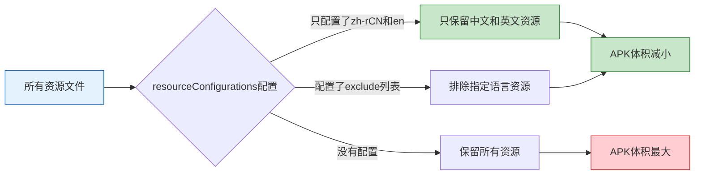
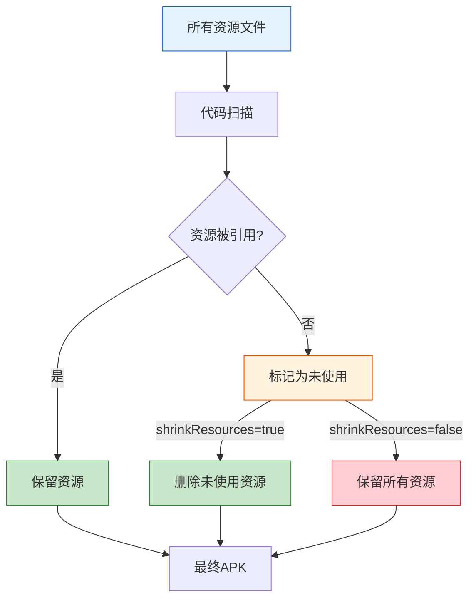

# 21.1.73 应用程序Android资源

太阳已经完全沉入了远处的山脊线后面，只剩下一抹橙红色的余晖还挂在天边。湖面上空的云彩从粉色变成深紫，最后慢慢融化成夜晚的墨蓝。洛芙抬头看着天边刚亮起来的几颗星星，心里有点感慨——这才一会儿功夫，白天就变成黑夜了。

“白天的时候我们讲了签名，”黛琳往篝火里添了一根柴火，火星噼里啪啦地跳起来，“现在我们来聊聊另一个重要的话题——资源。”

“资源？”洛芙把目光从星星上收回来，“就是图片、字符串、布局那些吗？”

“对，就是那些。”黛琳点点头，“不过今天我们要聊的不是怎么写资源，而是怎么配置资源的构建方式——比如怎么让APK更小、怎么让图片加载更快、怎么只保留用得到的语言……”

伊莎拨弄着手指：“就像出门旅行的时候，你会选择带什么东西——带多了累赘，带少了不够用。ApplicationAndroidResources就是帮你决定‘带什么、不带什么’的那个清单。”

---

## 问题：APK里的资源怎么会那么多？

“黛琳，”洛芙凑近了一点，“我之前看我们公司的项目，打出来的APK光资源文件就占了十几MB。这正常吗？”

“正常，也不正常。”希尔正在用树枝在地上画着什么，头也不抬地说，“正常是因为很多App确实有很多资源，不正常是因为——里面肯定有很多用不着的。”

“用不着的？”洛芙不解，“为什么会用不着？”

“多种原因。”黛琳扳着手指数起来，“比如你做了一套多语言支持，中文、英文、日文、韩文、法文、德文……结果你主要用户只说中文，那其他语言的字符串就是白带的。”

“那就删掉不用的语言呗。”洛芙说。

“对，”黛琳点头，“还有图片。设计师给你一套图，xxxhdpi、xxhdpi、xhdpi、hdpi、mdpi……结果你用户大部分用的是xxhdpi的手机，那些xxxhdpi的图片就是白带的。”

伊莎补充道：“还有那种一张PNG图片明明可以用向量 drawable 替代，却用了位图的情况——位图怎么压缩都有损耗，向量图可以无限缩放，而且文件更小。”

希尔终于抬起头来：“而且你们知道吗？Android构建的时候会对PNG做一次‘压缩’，叫crunch。但有些PNG已经压过了，再压不仅没效果，还会浪费构建时间。”

洛芙把这些信息在脑子里过了一遍：“所以ApplicationAndroidResources就是用来……优化这些的？”

“Exactly！”希尔打了个响指，“它就是用来告诉构建系统：哪些资源要保留、哪些要扔掉、怎么压缩、在哪里找资源……一堆配置的集合。”

---

## 比喻：资源就是行李，配置就是打包策略

“我上次去露营，”伊莎用手托着腮帮子说，“带了一个超级大的背包，结果很多衣服都没穿到，累得半死。”

洛芙哈哈笑起来：“我也差不多！”

“所以第二次我就学聪明了。”伊莎眨眨眼，“先想好这几天要干什么，根据活动选衣服——爬山就带运动服，河边就带防水的。ApplicationAndroidResources就是这个道理：先想好你的App在什么环境下跑，然后只带用得着的‘衣服’。”

黛琳补充道：“而且它不仅管带什么，还管怎么打包——比如衣服是叠起来放还是卷起来放，是真空压缩还是直接塞。不同的打包方式，占用的空间不一样。”

“听起来好像很好玩！”洛芙跃跃欲试，“那具体怎么配置呢？”

---

## ApplicationAndroidResources详解

希尔把笔记本架在膝盖上，敲出一段代码：

```kotlin
android {
    // 针对应用程序的资源配置
    applicationResources {
        // 是否启用资源缩减（删除未使用的资源）
        // 类似于：把行李中没穿过的衣服挑出来扔掉
        shrinkResources = true
        
        // 是否对PNG进行crunch（重新压缩）
        // false = 不压缩，节省构建时间（如果图片已经优化过）
        // true = 强制压缩（默认行为）
        crunchPng = false
        
        // 资源配置文件
        // 告诉构建系统要包含哪些配置的资源
        // 比如只保留中文和英文
        resourceConfigurations += listOf("zh-rCN", "en")
        
        // 要排除的资源配置
        // 比如排除日语资源
        resourceConfigurations += listOf("ja", "ko", "fr", "de")
        
        // 指定支持的屏幕密度
        // 类似于：只带合适尺码的衣服
        // 可选：mdpi, hdpi, xhdpi, xxhdpi, xxxhdpi
        densityFilters += listOf("xxhdpi", "xxxhdpi")
        
        // 不压缩的文件类型
        // 某些文件压缩后反而更大或无法使用
        noCompress += listOf(".mp3", ".wav", ".dat", "assets/")
        
        // 是否生成不可变的资源ID映射文件
        // 用于调试和静态分析
        generateLocaleConfig = true
    }
}
```

洛芙盯着代码看了半天：“这个resourceConfigurations，我有点搞不懂……加了以后是保留还是排除？”

“问得好！”黛琳画了个图来解释：



“简单来说，”黛琳解释道，“如果你配置了`resourceConfigurations += listOf("zh-rCN", "en")`，那就只保留中文和英文，其他语言的全扔掉。如果你用的是`exclude`，那就是明确排除某些语言。”

“那如果我想保留大部分，只排除一两个呢？”洛芙问。

“有两种写法，”希尔说，“一种是正面列表（白名单），一种是负面列表（黑名单）。”

```kotlin
// 方式一：白名单（只保留这些）
resourceConfigurations += listOf("zh-rCN", "en", "zh-rTW")

// 方式二：黑名单（排除这些）
resourceConfigurations += listOf("ja", "ko", "fr", "de", "es", "it", "pt", "ru")
```

洛芙若有所思：“原来是这样……那densityFilters呢？这个是干嘛的？”

---

## 屏幕密度过滤：只带合身的衣服

“你们见过那种情况吗？”伊莎忽然说，“一件衣服尺码特别全，XS到XXXXL都有，结果你只穿M码，其他尺码根本用不上。”

洛芙点点头：“见过！网上买衣服的时候。”

“屏幕密度就是这个道理。”伊莎比划着说，“手机屏幕有不同的‘尺码’——mdpi（小）、hdpi（中）、xhdpi（大）、xxhdpi（特大）、xxxhdpi（特大plus）。你的图片也要对应这些尺码做多套。”

黛琳补充道：“但问题是，不是所有用户都需要所有尺码。比如在发达国家，大部分用户都是xxhdpi或xxxhdpi，你带mdpi的图片完全就是浪费。”

“所以densityFilters就是用来过滤的？”洛芙问。

“对。”希尔又敲了一段代码：

```kotlin
applicationResources {
    // 只保留xxhdpi和xxxhdpi的图片资源
    // 这对主流市场的App特别有用
    densityFilters += listOf("xxhdpi", "xxxhdpi")
    
    // 如果你的目标用户主要是亚洲市场
    // 可能需要包含xhdpi
    // densityFilters += listOf("xhdpi", "xxhdpi", "xxxhdpi")
    
    // 如果你想覆盖所有设备
    // 就不要配置这个选项，让系统自动选择
}
```

洛芙好奇地问：“那如果我过滤掉了某些密度，用户用那个密度的手机会怎么样？”

“会fallback（回退）到最近的可用密度。”黛琳解释说，“比如你只有xxxhdpi的图片，但用户用的是mdpi手机，系统会自动缩放xxxhdpi的图片来用。虽然不是最优，但不会出错。”

伊莎补充道：“就像你没有小码的衣服，但有大码——客人勉强也能穿，就是不太合身而已。”

---

## PNG压缩：不是所有PNG都需要crunch

“你们有没有遇到过这种情况？”希尔忽然问，“构建的时候PNGcrunch特别慢，等了好久。”

洛芙举手：“我有！每次release构建都要等好久，proguard之后还要crunch图片，特别慢。”

“这就是问题所在。”希尔说，“有些PNG已经是优化过的（比如用pngcrush、pngquant之类的工具处理过），再crunch不仅没效果，还会浪费时间。”

她敲出配置：

```kotlin
applicationResources {
    // 关闭PNG crunch，节省构建时间
    // 适用于：已经用工具优化过PNG，或者使用WebP的场景
    crunchPng = false
    
    // 如果你确实需要crunch，可以保持默认true
    // 或者针对特定变体配置
}
```

黛琳补充了一个实际案例：“我之前做一个App，设计师给的全是已经压缩过的PNG。构建的时候crunch那一步特别慢，后来我查了文档，发现可以关掉crunch——构建时间直接缩短了一半。”

“这么多图片，省一半时间很厉害啊！”洛芙惊叹。

“对，”希尔说，“但要注意，关掉crunch之前要确保你的PNG确实是已经优化过的。如果是原始的、未压缩的PNG，关掉crunch会让APK变大。”

---

## 资源缩减：清理无用的行李

“如果前面那些是‘打包策略’，那shrinkResources就是‘清理行李’。”黛琳总结道，“它会在打包之前扫描代码，找出哪些资源实际上被引用了，然后删掉那些没用的。”

她画了一个流程图：



“shrinkResources = true 的时候，构建系统会分析你的代码——Java、Kotlin、XML——找出哪些资源文件被引用了，然后删掉那些没有被引用的。”

洛芙举手提问：“那……如果我在代码里用字符串拼接来加载资源呢？比如`getString("prefix_" + id)`这种？”

“这就扫描不到了。”黛琳点头，“所以shrinkResources不是万能的，它只能找到静态引用。动态引用需要用`tools:keep`和`tools:discard`来手动标记。”

希尔补充了代码示例：

```kotlin
// 在res/values/strings.xml中
<resources xmlns:tools="http://schemas.android.com/tools">
    // 告诉构建系统：这个字符串虽然在代码里用动态拼接
    // 但请务必保留
    <string name="prefix_user" tools:keep="true">用户</string>
    <string name="prefix_settings" tools:keep="true">设置</string>
    
    // 告诉构建系统：这个图片虽然存在
    // 但我们确定不需要，可以删掉
    <drawable name="unused_icon" tools:discard="true">@drawable/ic_placeholder</drawable>
</resources>
```

---

## 反模式：过度配置和不做配置

“你们有没有见过那种……”希尔犹豫了一下，“配置了一堆，结果适得其反的情况？”

洛芙摇头。

“比如有人觉得densityFilters越多越好，把所有密度都加进去——mdpi、hdpi、xhdpi、xxhdpi、xxxhdpi，五套图全带。结果APK体积翻倍，用户下载量直接下降。”

黛琳补充道：“还有一种相反的极端——完全不做配置。所有语言、所有密度都带着，APK体积巨大无比，用户抱怨连连。”

伊莎叹了口气：“还有更惨的——有人把noCompress配置错了，把`.json`文件设成不压缩，结果APK体积反而变大了。”

希尔敲出对比：

```kotlin
// 反模式：过度配置
applicationResources {
    densityFilters += listOf("mdpi", "hdpi", "xhdpi", "xxhdpi", "xxxhdpi")
    resourceConfigurations += listOf("zh-rCN", "zh-rTW", "en", "ja", "ko", "fr", "de", "es", "it", "pt", "ru")
    noCompress += listOf(".json", ".xml", ".txt")
    crunchPng = false  // 关闭了但PNG其实没优化过
}

// 推荐配置：按需配置
applicationResources {
    // 只保留主流密度
    densityFilters += listOf("xxhdpi", "xxxhdpi")
    
    // 只保留需要的语言（中文+英文是常见配置）
    resourceConfigurations += listOf("zh-rCN", "en")
    
    // 只对真正不该压缩的文件设置
    noCompress += listOf(".mp3", ".wav", ".ogg")
    
    // PNG已经优化过就关掉crunch
    crunchPng = false
}
```

洛芙看看这个，看看那个：“感觉还是要看情况啊……”

“对，”黛琳总结道，“没有最好的配置，只有最合适的配置。你要了解你的用户群体、你的App特性，然后选择最优的打包策略。”

---

## 实践：配置一个典型的资源优化

希尔新建了一个示例项目，展示完整的资源配置：

```kotlin
// build.gradle (app level)

android {
    // ... 其他配置 ...
    
    applicationResources {
        // 1. 开启资源缩减
        // Release构建时自动开启
        shrinkResources = true
        
        // 2. 针对PNG的优化
        // 关闭crunch，因为PNG已经优化过
        crunchPng = false
        
        // 3. 语言过滤
        // 只保留中文（简体）和英文
        // 这对主要面向国内和英语市场的App很有用
        resourceConfigurations += listOf("zh-rCN", "en")
        
        // 4. 屏幕密度过滤
        // 只保留主流密度
        // xxhdpi和xxxhdpi覆盖了大部分现代设备
        densityFilters += listOf("xxhdpi", "xxxhdpi")
        
        // 5. 不压缩的文件
        // 音频文件、已有的压缩资源不需要再压缩
        noCompress += listOf(".mp3", ".wav", ".ogg", ".dat")
        
        // 6. 生成locale配置
        // 用于Android 13+的per-app language preferences
        generateLocaleConfig = true
    }
}
```

希尔运行了一下构建，对比了优化前后的APK大小：

```
# 优化前
$ ls -lh app/build/outputs/apk/release/app-release-unsigned.apk
-rw-r--r-- 1 root root  45M  app-release-unsigned.apk

# 优化后
$ ls -lh app/build/outputs/apk/release/app-release-unsigned.apk
-rw-r--r-- 1 root root  28M  app-release-unsigned.apk
```

“省了将近40%！”洛芙眼睛亮了。

“这还不是最极端的案例。”希尔说，“有些App做了动态分发（Play Feature Delivery），只保留用户需要的模块，能省得更多。”

---

## 章节回顾与预告

晚风轻轻吹过湖面，带来一阵阵凉爽的气息。洛芙仰躺在草地上，看着天上的星星一颗颗地亮起来。

“今天学的ApplicationAndroidResources，”黛琳总结道，“其实就是帮你决定App里带什么资源、不带什么资源的系统。它不像签名那么‘底层’，但对用户体验影响很大——APK太大，用户可能就不下载了；图片加载太慢，用户可能就卸载了。”

伊莎补充道：“就像露营的时候，背包里的东西要精简到刚好够用——带多了累，带少了不够。资源管理就是这个道理。”

洛芙若有所思地点点头：“我回去要好好看看我们项目的资源情况，把没用的都删掉。”

“那明天我们就来讲讲，”黛琳笑着说，“怎么更进一步——不仅优化资源，还能动态下发模块，让用户只下载他们需要的那部分。”

“听起来就很厉害！”洛芙翻了个身，找了个更舒服的姿势看着星星。湖面上倒映着星光，随着水波轻轻晃动，就像有人在天上地上同时撒了一把碎钻。

---

> 学习建议：理解ApplicationAndroidResources的配置原理后，建议读者先从自己项目的资源分析开始——统计一下实际用到了哪些语言、哪些密度，然后逐步优化。可以先用`resourceConfigurations`做语言过滤，观察APK大小变化；再根据目标用户的设备分布，决定密度过滤策略。记得在优化前后对比APK大小，确保优化有效。

---

## 洛芙的小小日记本

今天学的是资源管理——怎么让APK更小、加载更快。黛琳说就像出门旅行打包行李，要带刚好够用的东西。希尔给我们看了优化前后的对比，APK小了将近一半！原来我们项目里带了七种语言的资源，但其实主要用户只用中文和英文。明天要看看能不能把没用的资源删掉，先从最简单的开始吧。

---

## 今日关键词

- **ApplicationAndroidResources**：Android Gradle DSL中用于配置应用程序资源构建方式的接口，包括资源缩减、PNG压缩、语言过滤、密度过滤等选项。
- **shrinkResources**：资源缩减开关，启用后会自动删除代码中未引用的资源文件，减少APK体积。
- **crunchPng**：PNG压缩开关，对PNG图片进行重新压缩以减小体积；已优化过的PNG可关闭以节省构建时间。
- **resourceConfigurations**：资源配置文件列表，用于指定保留哪些语言/地区的资源，格式如"zh-rCN"（简体中文）、"en"（英文）。
- **densityFilters**：屏幕密度过滤器，用于指定保留哪些密度的图片资源，可大幅减少APK中的图片数量。
- **noCompress**：不压缩的文件类型列表，某些文件（如音频、已压缩资源）压缩后无效或反而更大，需要列入不压缩列表。
- **generateLocaleConfig**：生成locale配置文件，用于支持Android 13+的per-app language preferences功能。
- **白名单 vs 黑名单**：两种资源过滤策略——白名单（明确指定保留哪些）和黑名单（明确指定排除哪些）。
- **资源回退（Fallback）**：当请求的密度资源不存在时，系统自动使用最近密度的资源并缩放适配。
- **动态资源引用**：使用字符串拼接等方式动态加载资源，资源扫描工具无法自动检测，需要手动用tools:keep标记保留。
