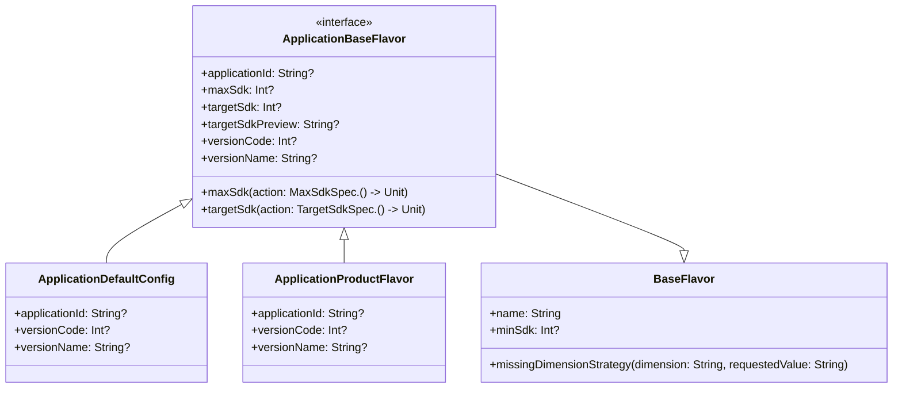

# 21.1.74 应用基础风味

繁星像是谁不小心撒在深蓝色天鹅绒上的钻石粉末，一颗一颗地嵌满了整个夜空。湖畔的晚风带着水汽和青草的香气，轻轻拂过女孩们的脸颊。篝火发出温暖的“噼啪”声，火星一一个个打着旋儿向天空飘去，眨眼间就融入了星河。

洛芙靠在折叠椅上，仰头看了好一会儿星空，才依依不舍地把目光收回到笔记本屏幕上。她刚刚在黛琳的指导下完成了资源优化的练习，正想休息一下，却发现旁边的黛琳已经打开了一个新的配置文件。

“黛琳姐姐，我们接下来要做什么呀？”洛芙凑过去好奇地看。

“这个呀，”黛琳把笔记本转过来让她看清屏幕上的代码，“今天我们要认识一位新朋友——ApplicationBaseFlavor。”

“Flavor？”洛芙歪着头，“是‘风味’的意思吗？”

“对，就是风味。”伊莎笑着接过话头，她正把一根树枝扔进火堆里，看着它慢慢变成炭火，“你想啊，同样的食材，不同的厨师会做出不同的风味——咱们Android应用也是同样的道理。同一个项目，通过不同的Flavor配置，可以变出不同‘味道’的版本。”

希尔正在旁边敲代码，听到这里抬起头来，眼睛亮晶晶的：“比如同一个游戏，可以有免费版和付费版，或者国内版和海外版——它们共享大部分代码，但配置上有些不同。这就是Flavor的妙用。”

“那这个ApplicationBaseFlavor又是做什么的呢？”洛芙问道。

黛琳指着屏幕上的代码解释道：“ApplicationBaseFlavor是Android Gradle插件中定义的一个接口，它是ApplicationDefaultConfig和ApplicationProductFlavor的共同基础。简单来说，它定义了一个Android应用模块最核心的构建配置。”

她调出一个结构图来：



“看这张图，”黛琳继续说道，“ApplicationBaseFlavor就像是一块地基，它定义了所有应用构建变体都需要的核心属性。ApplicationDefaultConfig提供了所有变体的默认配置，而ApplicationProductFlavor则允许你为不同的产品风味定制配置。”

洛芙似懂非懂地点点头：“也就是说，不管你有多少种不同的‘风味’，它们都共享这些基础配置？”

“没错。”黛琳微微一笑，“而且这些配置决定了你的应用长什么样、能跑在什么版本的Android上、版本号是多少。让我一个个来解释。”

她打开Android Studio的build.gradle文件示例：

```kotlin
android {
    defaultConfig {
        applicationId = "com.example.myapp"
        versionCode = 1
        versionName = "1.0.0"
        targetSdk = 34
    }
    
    flavorDimensions += "version"
    productFlavors {
        create("free") {
            applicationIdSuffix = ".free"
            versionNameSuffix = "-free"
        }
        create("premium") {
            applicationIdSuffix = ".premium"
            versionNameSuffix = "-premium"
        }
    }
}
```

“首先是这个——applicationId。”黛琳敲了敲屏幕上的那行字，“你可以把它想象成你家的门牌号。每个应用都必须有唯一一个这样的标识符。在Google Play上，它就是你的应用独一无二的名字。”

“那如果我想同时发布免费版和付费版呢？”洛芙问。

“问得好。”希尔抢着回答，她最擅长这种实操问题了，“看下面两个productFlavor——free和premium。它们都用applicationIdSuffix给自己加了后缀。这样免费版的applicationId就变成了com.example.myapp.free，付费版变成了com.example.myapp.premium。两个应用可以同时安装，互不冲突。”

洛芙掏出随身带的小本子认真地记下来。

“接下来是versionCode和versionName。”黛琳继续说道，“versionCode是一个整数，每次发布新版本都要比上一次大——这是Android系统用来判断版本新旧的方式。versionName则是给用户看的版本号，可以写成'1.0.0'、'2.1.3beta'这种人类能看懂的格式。”

“那targetSdk呢？”伊莎问道，她很少问技术问题，但对这个很感兴趣。

“targetSdk啊，”黛琳的表情变得认真起来，“你可以把它理解为你告诉Android系统：‘我的应用是为这个版本的Android设计的’。当你把targetSdk设为34的时候，你的应用会使用Android 14的最新行为和API。但如果你用了过时的API，系统可能会给你一些兼容提醒。”

她调出另一个配置示例：

```kotlin
android {
    defaultConfig {
        targetSdk = 34
        
        // AGP 8.0+ 推荐的新式配置方式
        targetSdk {
            // 启用特定的行为兼容选项
            enforceUniquePackageNames = false
        }
    }
}
```

“现在是2024年，Google推荐使用新的targetSdk块级配置方式，替代以前那种简单的targetSdk = 34写法。”黛琳补充道，“这种方式更灵活，可以配置更多的行为选项。”

“那maxSdk呢？”洛芙突然想起来刚才图上也有这个属性。

“maxSdk啊，”黛琳笑了笑，“这个就像是给应用设定一个‘最高身高限制’。比如你设置了maxSdk = 33，那这个应用就只会被安装在Android 13及以下版本的设备上，Android 14的用户就看不到它了。”

“为什么要这样做？”洛芙不解地问。

“有几种原因，”希尔解释道，“一是某些API在高版本Android上行为变了，你的应用还没来得及适配；二是你的应用需要用到某个权限，但这个权限在更高版本被限制了——与其让用户安装后发现问题，不如直接在商店里就不展示。”

黛琳点点头：“没错，不过maxSdk要慎用。现在Google Play默认就不让应用设置maxSdk了，除非你是真的因为技术原因必须这样做。”

夜空越来越深，萤火虫开始在草丛中闪烁，像是地上的星星。洛芙打了个哈欠，但眼睛还是亮晶晶地盯着屏幕。

“我们再来看一个完整的例子，”黛琳说，“假设我们要为一个新闻应用创建三个版本——免费版、付费版、企业版。它们共享同一个代码库，但配置不同。”

她快速地敲出了一个完整的配置示例：

```kotlin
android {
    namespace = "com.example.newsapp"
    
    defaultConfig {
        applicationId = "com.example.newsapp"
        versionCode = 100
        versionName = "1.0.0"
        
        // 最小支持Android 8.0
        minSdk = 26
        
        // 目标Android 14
        targetSdk = 34
        
        // 测试设备ID
        testInstrumentationRunner = "androidx.test.runner.AndroidJUnitRunner"
    }
    
    flavorDimensions += "version"
    
    productFlavors {
        // 免费版 - 带广告
        create("free") {
            dimension = "version"
            applicationIdSuffix = ".free"
            versionNameSuffix = "-free"
            
            // 免费版特有的配置
            buildConfigField("boolean", "IS_PREMIUM", "false")
            buildConfigField("boolean", "SHOW_ADS", "true")
            buildConfigField("int", "MAX_ARTICLES_PER_DAY", "10")
        }
        
        // 付费版 - 无广告
        create("premium") {
            dimension = "version"
            applicationIdSuffix = ".premium"
            versionNameSuffix = "-premium"
            
            buildConfigField("boolean", "IS_PREMIUM", "true")
            buildConfigField("boolean", "SHOW_ADS", "false")
            buildConfigField("int", "MAX_ARTICLES_PER_DAY", "Integer.MAX_VALUE")
        }
        
        // 企业版 - 支持更多功能
        create("enterprise") {
            dimension = "version"
            applicationIdSuffix = ".enterprise"
            versionNameSuffix = "-enterprise"
            
            buildConfigField("boolean", "IS_PREMIUM", "true")
            buildConfigField("boolean", "SHOW_ADS", "false")
            buildConfigField("boolean", "ENABLE_ANALYTICS", "true")
            buildConfigField("String", "API_ENDPOINT", "\"https://enterprise.newsapp.com/api\"")
        }
    }
}
```

“哇……”洛芙惊叹道，“一个代码库就这样变成了三个不同的应用！”

“这只是最基础的用法。”希尔笑着说，“等你学会了productFlavors的更多玩法，还能做出更复杂的效果——比如按地区分、按渠道分、按功能分等等。”

黛琳把笔记本合上只剩下一个角：“对了，差点忘了说BaseFlavor里还有一个很有用的东西——missingDimensionStrategy。”

“听起来很复杂的名字。”伊莎吐了吐舌头。

“其实没那么复杂，”黛琳解释道，“想象一下，你的项目依赖了一个库，这个库有不同的flavor版本（比如arm64-v8a和x86_64），但你的项目没有选择其中任何一个。这时候gradle就会报错。missingDimensionStrategy就是告诉gradle：‘如果遇到这种情况，你就用这个默认的选择吧。’”

她给出了使用示例：

```kotlin
// 在某个productFlavor中配置
productFlavors {
    create("armVersion") {
        dimension = "architecture"
        // 依赖库要求选择"cpu"维度的flavor
        // 这里指定默认使用arm64-v8a
        missingDimensionStrategy("cpu", "arm64-v8a")
    }
    
    create("x86Version") {
        dimension = "architecture"
        missingDimensionStrategy("cpu", "x86_64")
    }
}
```

夜风越来越大，篝火需要添新的木柴了。希尔主动去挑了几根干树枝，扔进火里，火苗一下子蹿高了许多，橘红色的光照在每个人的脸上。

“黛琳姐姐，”洛芙忽然想到一个问题，“我之前看到有些应用在Play商店里，同一个应用有‘普通版’和‘折叠屏版’，这也是用Flavor实现的吗？”

“那是Play Feature Delivery的玩法，比Flavor更高级一些。”黛琳点点头，“不过原理类似——都是让一个代码库能生成多个不同的APK。今天我们学的ApplicationBaseFlavor是基础，打好这个基础以后，那些高级玩法就不难理解了。”

伊莎仰头看着天：“星星好像比刚才更多了呢。”

大家纷纷抬起头来。夜空已经变成了纯粹的深蓝色，银河像一条淡淡的光带横贯天际。湖畔的水面映着星光和篝火的光芒，遥遥相对，像是两个平行的星空。

“今天学的这些，你们都记住了吗？”黛琳轻声问道。

洛芙点头如捣蒜：“applicationId是应用ID，versionCode是机器用的版本号，versionName是人类看的版本号，targetSdk是目标Android版本……还有Flavor可以创建不同‘风味’的版本！”

“还有别忘了，”希尔补充道，“deprecated的那些方法不要用了，什么targetSdkVersion()啊、maxSdkVersion()啊，都换成新的block写法。”

大家都会心地笑了。

---

> 本章我们深入学习了Android Gradle Plugin中的ApplicationBaseFlavor API。它是Android应用构建配置的核心抽象层，定义了所有应用变体都需要的核心属性，包括applicationId、版本信息（versionCode/versionName）、SDK版本配置（minSdk/targetSdk/maxSdk）等。通过理解Flavor的层次结构（ApplicationBaseFlavor → ApplicationDefaultConfig + ApplicationProductFlavor），我们可以优雅地管理多版本应用的构建配置，实现免费版/付费版、国内版/海外版等场景。**在实际项目中，优先使用新的block式配置方式（targetSdk {}、minSdk {}、maxSdk {}）替代已废弃的旧方法**，以获得更好的可维护性和未来的兼容性支持。

---

#### 🏕️ 动手练习

**项目目标**：为一个阅读应用创建免费版、付费版、企业版三种变体，练习Flavor配置

**Task 1：创建基础项目配置**
目标：理解ApplicationBaseFlavor的基本属性配置
步骤：
1. 新建一个Android项目（或使用现有项目）
2. 在app/build.gradle的android块中添加productFlavors配置
3. 配置三个flavor：free、premium、enterprise
4. 为每个flavor设置applicationIdSuffix和versionNameSuffix
验收标准：
- [ ] 项目可以成功构建（./gradlew assembleDebug）
- [ ] 构建产物包含三个不同applicationId的APK
- [ ] 每个APK的versionName包含对应的后缀

**Task 2：配置版本信息**
目标：掌握versionCode和versionName的配置
步骤：
1. 在defaultConfig中设置基础versionCode = 1和versionName = "1.0.0"
2. 为每个productFlavor配置不同的versionNameSuffix
3. （可选）在代码中读取BuildConfig获取当前flavor信息
验收标准：
- [ ] free版构建后versionName = "1.0.0-free"
- [ ] premium版构建后versionName = "1.0.0-premium"
- [ ] enterprise版构建后versionName = "1.0.0-enterprise"

**Task 3：配置SDK版本**
目标：理解minSdk、targetSdk的配置及新式block写法
步骤：
1. 使用新的targetSdk块配置targetSdk = 34
2. 配置minSdk = 24
3. 尝试使用maxSdk（选做）
4. 对比旧写法（targetSdk = 34）和新写法的区别
验收标准：
- [ ] 使用新的block式写法配置targetSdk
- [ ] 项目可以正常构建并安装在不同Android版本设备上

**Task 4：使用BuildConfigField传递Flavor特有配置**
目标：通过BuildConfigField实现不同Flavor的业务逻辑差异
步骤：
1. 在各flavor中配置buildConfigField，如：
   - free版：buildConfigField("boolean", "IS_PREMIUM", "false")
   - premium版：buildConfigField("boolean", "IS_PREMIUM", "true")
2. 在代码中根据BuildConfig.IS_PREMIUM显示不同内容
3. 创建一个简单的UI来展示当前版本信息
验收标准：
- [ ] 代码中可以读取BuildConfig中的自定义字段
- [ ] 不同flavor构建的App显示不同的版本标识

**Task 5：配置missingDimensionStrategy**
目标：理解如何处理依赖库的flavor缺失问题
步骤：
1. 添加一个带有flavor的依赖库（如有native库）
2. 在某个productFlavor中配置missingDimensionStrategy
3. 观察配置前后构建行为的差异
验收标准：
- [ ] 了解missingDimensionStrategy的作用场景
- [ ] 能够在实际遇到flavor冲突时正确配置

**面试热身**
- Q1: 请解释applicationId和包名（package name）的区别，它们在什么场景下需要不同？
- Q2: versionCode和versionName有什么区别？为什么versionCode必须是整数且递增？
- Q3: targetSdk和minSdk的作用是什么？设置错误的值会导致什么问题？
- Q4: productFlavor和buildType有什么区别？请举例说明各自的用途。
- Q5: 如果你需要发布一个应用的两个版本（免费版和付费版），你会如何设计构建配置？

---

#### 参考实现要点

1. **applicationId是唯一的应用标识符**，在Google Play上代表你的应用身份，与Java包名（package name）已解耦，可以独立设置。发布更新时不能改变applicationId，但可以改变包名。

2. **versionCode必须是递增的整数**，每次发布正式版都必须大于上一个版本。建议使用类似100、101、102的递进方式，留出测试版本的空间。

3. **targetSdk应该保持最新**，这不仅是最佳实践，某些Play商店政策也会强制要求。Google Play要求新提交的应用targetSdk不能低于特定值（当前是33）。

4. **minSdk决定了你的应用能覆盖多少设备**，建议根据目标用户群体和统计数据分析设置。对于大多数应用，minSdk = 21（Android 5.0）是一个合理的起点。

5. **productFlavor的dimension必须显式声明**，使用`flavorDimensions += "dimensionName"`来声明所有用到的维度，否则构建会报错。

---

洛芙的小小日记本

今天黛琳姐姐教了我们ApplicationBaseFlavor——好长好专业的名字！但说白了就是给应用配置"身份信息"的。applicationId像是身份证号，versionCode是内部版本号，versionName是给人看的版本名。还要学会用productFlavor做出不同"味道"的版本——免费版、付费版、企业版，一套代码搞定！希尔说这就是"一套代码，多种分身"的魔法。好棒！✨

---

#### 今日关键词

**ApplicationBaseFlavor** — Android Gradle Plugin中的DSL接口，定义了应用模块的核心构建配置属性，是ApplicationDefaultConfig和ApplicationProductFlavor的共同基类。

**applicationId** — 应用的唯一标识符，在Google Play上代表应用身份，可通过applicationIdSuffix为不同flavor添加后缀以区分版本。

**versionCode** — 整数值版本号，供Android系统和开发者用于判断版本新旧，必须递增，用于版本更新判断。

**versionName** — 字符串版本号，供用户查看，可自定义格式如"1.0.0"、"2.1.3-beta"。

**targetSdk** — 目标SDK版本，指定应用针对的Android版本，影响系统行为兼容性和Play商店可见性，推荐使用新的block式配置。

**minSdk** — 最小支持SDK版本，指定应用能运行的最低Android版本，决定API可用性。

**maxSdk** — 最大支持SDK版本，限制应用能安装的最高Android版本，Google Play有限制，建议慎用。

**productFlavor** — 产品风味，构建变体的一种，允许同一代码库生成不同配置的版本。

**flavorDimensions** — 风味维度，用于分组不同类型的flavor，AGP 8.0+必须显式声明。

**BuildConfigField** — 在Flavor配置中添加自定义字段，可在代码中通过BuildConfig类读取。

**missingDimensionStrategy** — 当依赖库要求特定flavor但项目未配置时，指定默认使用的flavor。
