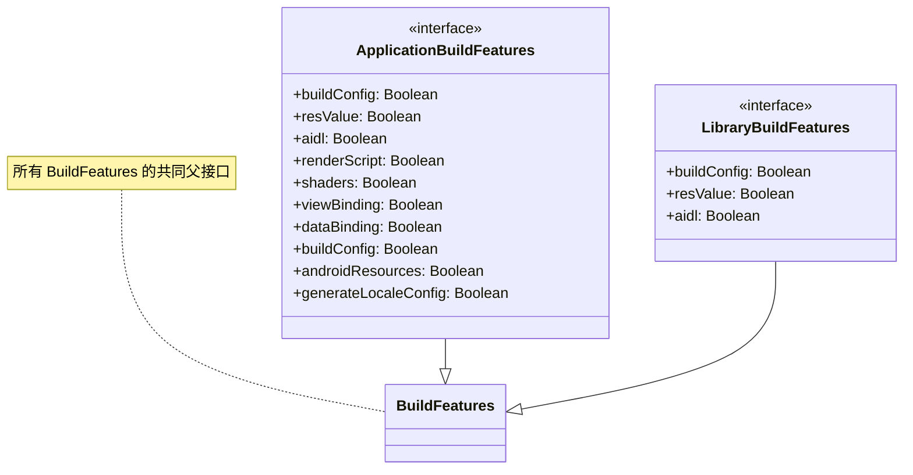
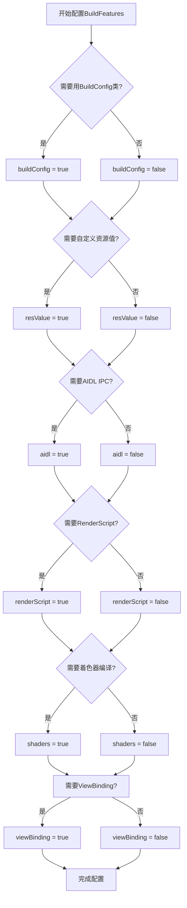

# 21.1.75 应用程序构建功能

夜已深了。

银河像一条淡淡的光带横贯天际，湖畔的水面映着星光和篝火的光芒，遥遥相对。远处偶尔传来几声蛙鸣，打破夏夜的寂静，却让整个夜晚显得更加宁静。

洛芙打了个哈欠，揉了揉眼睛。刚才学的ApplicationBaseFlavor知识在她脑子里转来转去，像是煮沸的咖喱汤一样咕嘟咕嘟冒泡。她喝了口伊莎刚才泡的热可可，柑橘的香气让她的精神又振奋了一些。

“黛琳姐姐，”洛芙把杯子捧在胸前，“我们今天晚上是不是还要学新的东西呀？”

黛琳正把笔记本放在膝盖上，屏幕的光映在她专注的侧脸上。听到洛芙的问题，她微微一笑：“就知道你还想学。今天我们要认识另一位新朋友——ApplicationBuildFeatures。”

“BuildFeatures？”洛芙把这个词重复了一遍，“是‘构建功能’的意思吗？”

“对，就是构建功能。”希尔凑过来，眼睛闪闪发亮，“你知道吗，你的App在构建的时候，Android系统会帮你做很多事情——生成BuildConfig类、处理资源文件、编译AIDL接口……这些帮你干活的功能，都可以通过ApplicationBuildFeatures来开关。”

伊莎正在用树枝拨弄着篝火，让火苗烧得更旺一些。她抬起头来：“听起来像是……像是露营装备的选择？有些功能像是必须的炊具，有些则是可选的装饰品？”

“伊莎的比喻总是这么恰当。”黛琳笑着点头，“没错。想象一下，你要去露营，有些东西是必须带的——帐篷、睡袋、食物；但有些东西是可选的——吉他、投影仪、烟花。ApplicationBuildFeatures就是让你选择‘带什么不带什么’的配置。”

她把笔记本转过来，让大家都看清屏幕上的代码：

```kotlin
android {
    buildFeatures {
        // 开启或关闭各种构建功能
        buildConfig = true
        resValue = true
        aidl = false
        renderScript = false
        shaders = true
    }
}
```

洛芙认真地看着这些配置：“这些……都是什么意思呀？”

“别急，”黛琳调出一张结构图来，“让我一个一个解释。”



“这张图展示了BuildFeatures的家族谱系，”黛琳指着图解释道，“ApplicationBuildFeatures是给App模块用的，LibraryBuildFeatures是给Library模块用的。它们都继承自同一个BuildFeatures基类。”

“那这些功能都是做什么的呢？”洛芙问道。

“先说最常用的——buildConfig。”黛琳敲了敲屏幕上的第一行，“这个功能决定是否生成BuildConfig.java文件。你在代码里用的那个BuildConfig类，就是靠这个功能生成的。”

“原来是它！”洛芙眼睛一亮，“我之前在代码里用过BuildConfig.DEBUG来判断是不是调试模式！”

“对，那就是buildConfig功能的功劳。”希尔接话道，“如果没有buildConfig = true，你就无法在代码中使用BuildConfig类了。”

黛琳点点头，继续说道：“接下来是resValue。这个功能允许你在build.gradle里直接定义资源值，而不需要去修改res/values/目录下的XML文件。”

她给出了一个使用示例：

```kotlin
android {
    buildFeatures {
        resValue = true
    }
    
    // 直接在build.gradle中定义字符串资源
    resValue("string", "app_name", "我的露营App")
    resValue("string", "welcome_message", "欢迎来到露营世界！")
    
    // 定义颜色资源
    resValue("color", "primary_color", "#FF6B35")
    resValue("color", "secondary_color", "#004E89")
    
    // 定义尺寸资源
    resValue("dimen", "text_size_large", "24sp")
    resValue("dimen", "text_size_small", "14sp")
}
```

“哇……”洛芙惊叹道，“这样就不用在XML文件里改来改去了吗？”

“对，尤其是在多flavor的项目里，”黛琳解释道，“你可以根据不同的flavor定义不同的资源值。比如免费版和付费版用不同的应用名称，或者不同地区用不同的文案。”

伊莎好奇地问：“那aidl和renderScript呢？我好像都没用过这些。”

“AIDL是Android Interface Definition Language的缩写，”黛琳耐心地解释，“它是用来实现进程间通信的。如果你需要让两个不同的App或者App和Service之间通信，就要用到AIDL。不过现在很多场景都被其他方案替代了，所以大多数项目可以把它关掉。”

“那renderScript呢？”洛芙追问道。

“RenderScript是一种高性能计算框架，”希尔接过话题，“以前用来做图形渲染和复杂计算的。但现在有了更现代的方案——比如Vulkan、GPUCompute等等。所以renderScript现在也用得越来越少了。”

她补充道：“不过，如果你的项目里还在用老旧的RenderScript代码，那就需要保持renderScript = true。否则可以关掉它，能加快构建速度。”

黛琳指着屏幕上的shaders选项：“这个shaders呢，是用来编译GLSL着色器文件的。如果你用到OpenGL ES或者Vulkan做渲染，就需要这个功能。大多数普通App可以把它关掉。”

洛芙把这些都认真地记在了小本子上。

“我们再来看几个有用的功能。”黛琳滚动着屏幕，“viewBinding和dataBinding，这两个都和UI相关。”

“ViewBinding！”洛芙兴奋地说，“我用过这个！比findViewById方便多了！”

“对，ViewBinding可以自动生成绑定类，省去findViewById的麻烦。”黛琳点点头，“而DataBinding更强大，它支持在XML中使用表达式进行双向绑定。”

```kotlin
android {
    buildFeatures {
        viewBinding = true
        // dataBinding = true  // 如果需要双向绑定，可以开启这个
    }
}
```

“一般来说，”希尔补充道，“viewBinding = true就够用了。dataBinding功能更强大但配置也更复杂，如果没有特别的需要，viewBinding是更好的选择。”

黛琳又调出一张配置清单：



“这个流程图可以帮助你决定需要开启哪些功能。”黛琳说道，“不过我建议对于新项目，保持默认配置就好。Android Gradle插件的默认设置通常是最佳实践。”

“默认配置是怎么样呢？”洛芙好奇地问。

希尔快速地敲了一行代码，然后在屏幕上显示出来：

```bash
# Android Gradle Plugin 8.x 默认配置
android {
    buildFeatures {
        buildConfig = true    # 生成BuildConfig类
        resValue = false      # 不自动生成资源值
        aidl = true           # 启用AIDL支持
        renderScript = false # 默认关闭RenderScript
        shaders = true        # 启用着色器编译
        viewBinding = false  # 默认关闭，需要手动开启
        dataBinding = false  # 默认关闭
        androidResources = true # 启用Android资源处理
    }
}
```

“原来默认值是这样啊……”洛芙若有所思。

“对，”黛琳补充道，“AGP 8.0还增加了一个新特性——generateLocaleConfig。这个功能可以自动生成语言配置，帮助应用更好地支持多语言和系统语言切换。”

她给出了一个配置示例：

```kotlin
android {
    buildFeatures {
        // AGP 8.0+ 新增：生成LocaleConfig
        generateLocaleConfig = true
    }
}
```

“那这个LocaleConfig是做什么的呢？”伊莎问道，她对语言相关的内容很感兴趣。

“简单来说，”黛琳解释道，“它会让你的App更好地响应系统语言设置。比如用户在系统设置里把语言改成日语，你的App就能自动显示日语界面，不需要你手动处理。”

洛芙似懂非懂地点点头：“感觉现在Android越来越智能了呢。”

夜风渐凉，篝火也小了一些。希尔又添加了几根柴火，火苗重新旺了起来，火星打着旋儿向夜空飘去。

“我们再来看看一个实际项目的完整配置吧。”黛琳说道，“假设我们正在开发一个露营主题的App。”

她快速地敲出了一个完整的示例：

```kotlin
android {
    namespace = "com.camping.story"
    
    buildTypes {
        debug {
            isDebuggable = true
            isMinifyEnabled = false
            applicationIdSuffix = ".debug"
            versionNameSuffix = "-debug"
        }
        release {
            isMinifyEnabled = true
            isShrinkResources = true
            proguardFiles(
                getDefaultProguardFile("proguard-android-optimize.txt"),
                "proguard-rules.pro"
            )
        }
    }
    
    flavorDimensions += "version"
    
    productFlavors {
        free {
            dimension = "version"
            applicationIdSuffix = ".free"
            versionNameSuffix = "-free"
            buildConfigField("boolean", "IS_PREMIUM", "false")
        }
        premium {
            dimension = "version"
            applicationIdSuffix = ".premium"
            versionNameSuffix = "-premium"
            buildConfigField("boolean", "IS_PREMIUM", "true")
        }
    }
    
    // 这里是本章的重点——BuildFeatures配置
    buildFeatures {
        // 生成BuildConfig类，供代码中使用
        buildConfig = true
        
        // 开启资源值定义，方便多flavor配置
        resValue = true
        resValue("string", "app_name", "摇曳露营")
        
        // 免费版和付费版用不同的应用名称
        free {
            resValue("string", "app_name", "摇曳露营 - 免费版")
        }
        premium {
            resValue("string", "app_name", "摇曳露营 - 付费版")
        }
        
        // 我们不使用AIDL，所以关闭
        aidl = false
        
        // 不使用RenderScript
        renderScript = false
        
        // 开启ViewBinding，简化UI代码
        viewBinding = true
        
        // 需要编译着色器（如果有用到OpenGL）
        shaders = true
        
        // 开启多语言支持
        generateLocaleConfig = true
    }
}
```

“原来一个配置文件里要考虑这么多东西啊！”洛芙感叹道。

“这就是Android开发的魅力所在，”伊莎微笑着说，“看似简单的配置，背后要考虑很多场景和权衡。”

黛琳把笔记本合上，只留下屏幕的一角还亮着：“对了，还有一点要提醒你们。现在AGP 8.0以后，很多以前必须的配置都变成可选的了。比如buildConfig，在以前是默认开启的，现在可以手动关闭。如果你确定不需要某个功能，关掉它可以加快构建速度。”

“加快构建？”洛芙的眼睛亮了起来，“那能快多少呀？”

“视项目而定，”希尔耸耸肩，“有些项目关掉不需要的功能后，构建时间能减少10%到30%呢。尤其是aidl和renderScript这种不常用的功能，如果用不到，关掉它们会让构建快不少。”

“那我们是不是应该把所有不用的功能都关掉？”洛芙跃跃欲试。

“别急，”黛琳笑着摇头，“首先你要确认真的不需要。其次，有些功能关掉后可能会影响依赖你的库。最重要的是，保持默认配置通常是最安全的选择，除非你有明确的理由。”

夜空更加深邃了，星星像是撒在天鹅绒上的钻石。远处传来几声猫头鹰的叫声，更显得夜晚安静而美好。

“今天学的这些，你们都记住了吗？”黛琳轻声问道。

洛芙点点头：“记住了！buildConfig是生成BuildConfig类的，resValue可以让我们在gradle里直接定义资源，aidl是进程间通信用的，renderScript是高性能计算的，shaders是着色器，viewBinding可以简化UI代码……”

“还有generateLocaleConfig是帮助多语言支持的！”伊莎补充道。

希尔打了个哈欠：“最重要的是，根据实际需求选择性地开启或关闭功能——不要为了优化而优化。”

大家都会心地笑了。篝火中的木柴发出最后的噼啪声，火苗渐渐地弱了下去。女孩们开始收拾东西，准备回帐篷休息。

“黛琳姐姐，”洛芙一边收拾笔记本一边问，“明天我们学什么呀？”

“明天啊，”黛琳微微一笑，“明天我们来聊聊ApplicationBuildType——构建类型。debug和release背后的秘密。”

“听起来很有意思！”洛芙的眼睛又亮了起来。

夜风吹过湖畔，带着水汽和青草的香气。银河依然静静地挂在天际，像是永恒的守护。女孩们钻进了各自的帐篷，不一会儿，露营地就只剩下篝火余烬和远处青蛙的低吟。

---

> 本章我们深入学习了Android Gradle Plugin中的ApplicationBuildFeatures API。这是控制Android应用构建过程中各种功能开关的 DSL 接口。核心功能包括：buildConfig（BuildConfig类生成）、resValue（gradle内联定义资源）、aidl（AIDL接口编译）、renderScript（RenderScript编译）、shaders（GLSL着色器编译）、viewBinding（视图绑定）、dataBinding（数据绑定）、androidResources（Android资源处理）、generateLocaleConfig（语言配置生成）等。**在实际项目中，建议保持默认配置，仅在明确需要某个功能时才开启或关闭对应选项**，以获得最佳的构建体验和兼容性。

---

#### 🏕️ 动手练习

**项目目标**：为一个露营主题App配置BuildFeatures，学习各功能的开关作用

**Task 1：探索默认BuildFeatures配置**
目标：理解Android项目的默认BuildFeatures设置
步骤：
1. 创建一个新的Android项目
2. 找到app/build.gradle文件
3. 在android块中添加buildFeatures块（不配置任何属性）
4. 尝试运行./gradlew app:dependencies查看依赖树
验收标准：
- [ ] 能找到build.gradle中的buildFeatures配置位置
- [ ] 了解默认开启了哪些功能

**Task 2：配置buildConfig功能**
目标：掌握buildConfig的开关及其对代码的影响
步骤：
1. 在buildFeatures中设置buildConfig = true
2. 在代码中使用BuildConfig获取应用信息
3. 尝试设置buildConfig = false，观察编译错误
验收标准：
- [ ] buildConfig = true时可以正常使用BuildConfig类
- [ ] buildConfig = false时BuildConfig类不可用

**Task 3：使用resValue定义资源**
目标：学会在gradle中直接定义资源值
步骤：
1. 开启resValue = true
2. 使用resValue定义一个字符串资源
3. 在布局文件中使用@string/引用该资源
4. 构建APK并验证资源是否正确
验收标准：
- [ ] 可以在代码中使用自定义的resValue资源
- [ ] 理解resValue的使用场景

**Task 4：配置viewBinding**
目标：掌握ViewBinding的开启和使用
步骤：
1. 在buildFeatures中设置viewBinding = true
2. 编译项目，查看生成的绑定类
3. 在Activity/Fragment中使用ViewBinding
验收标准：
- [ ] viewBinding成功生成绑定类
- [ ] 可以在代码中正常使用ViewBinding

**Task 5：尝试关闭不需要的功能**
目标：理解如何优化构建配置
步骤：
1. 将aidl设为false
2. 将renderScript设为false
3. 观察构建时间的变化
验收标准：
- [ ] 成功关闭不需要的功能
- [ ] 项目仍然可以正常构建

**Task 6：理解generateLocaleConfig**
目标：掌握多语言配置功能
步骤：
1. 在AGP 8.0+项目中开启generateLocaleConfig = true
2. 查看生成的文件（build/generated/res/localeConfig）
3. 理解其对多语言支持的作用
验收标准：
- [ ] 成功生成LocaleConfig文件
- [ ] 理解其工作原理

**面试热身**
- Q1: buildConfig功能是做什么的？关闭它会有什么影响？
- Q2: resValue和传统的XML资源文件有什么区别？各自的优缺点是什么？
- Q3: viewBinding和findViewById有什么区别？和DataBinding又有什么区别？
- Q4: 什么情况下需要关闭aidl或renderScript？为什么？
- Q5: generateLocaleConfig是做什么的？它如何改善多语言用户体验？

---

#### 参考实现要点

1. **buildConfig = true时才会生成BuildConfig.java**，这个类包含DEBUG、APPLICATION_ID、VERSION_CODE、VERSION_NAME等字段，供代码在运行时获取应用信息。

2. **resValue非常适合多flavor场景**，可以在不同flavor中定义同名的资源值（如app_name），编译时会自动使用对应flavor的值。

3. **viewBinding比DataBinding更轻量**，如果不需要双向绑定，优先使用viewBinding。两者不能同时开启。

4. **关闭不需要的功能可以加快构建速度**，尤其是aidl、renderScript这种不常用的功能。但要确保关闭后不会影响依赖你的库。

5. **AGP 8.0对BuildFeatures有重大调整**，部分功能的默认值发生了变化。建议在新项目中明确配置所有buildFeatures，保持可维护性。

---

洛芙的小小日记本

今晚黛琳姐姐教了ApplicationBuildFeatures——控制App构建时"带什么装备"的魔法开关！buildConfig生成BuildConfig类，resValue可以直接在gradle里写资源，viewBinding让UI代码更干净……还有aidl、renderScript、shaders这些不太常用的功能。希尔说关掉不用的功能能让构建变快，但我决定先保持默认——毕竟刚入门，稳定最重要！晚安，星空！🌙

---

#### 今日关键词

**ApplicationBuildFeatures** — Android Gradle Plugin中的DSL接口，用于配置应用模块的各种构建功能开关，是BuildFeatures在App模块的具体实现。

**buildConfig** — 控制是否生成BuildConfig.java文件的配置，生成的类包含DEBUG、APPLICATION_ID、VERSION_CODE等字段，供代码使用。

**resValue** — 允许在build.gradle中直接定义资源值（字符串、颜色、尺寸等），无需修改XML文件，适合多flavor场景。

**aidl** — Android Interface Definition Language支持开关，用于进程间通信的接口定义，大多数App可以关闭。

**renderScript** — RenderScript高性能计算框架支持开关，现代项目中已较少使用，可以关闭以加快构建。

**shaders** — GLSL着色器编译支持，用于OpenGL ES/Vulkan图形渲染，需要用到着色器的项目需要开启。

**viewBinding** — 视图绑定功能，自动生成绑定类替代findViewByCode，比DataBinding更轻量。

**dataBinding** — 数据绑定功能，支持XML中的表达式和双向绑定，比viewBinding功能更强大但也更复杂。

**androidResources** — Android资源处理开关，控制是否处理res目录下的资源文件。

**generateLocaleConfig** — AGP 8.0+新增功能，自动生成LocaleConfig文件，帮助应用更好地响应系统语言设置。

**BuildConfig** — 由buildConfig功能自动生成的类，包含应用运行时信息（DEBUG、APPLICATION_ID、VERSION_CODE、VERSION_NAME等）。
