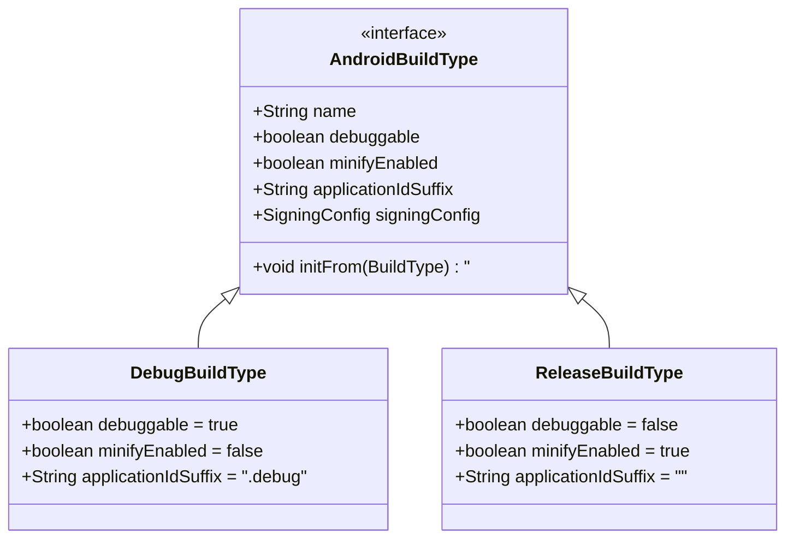
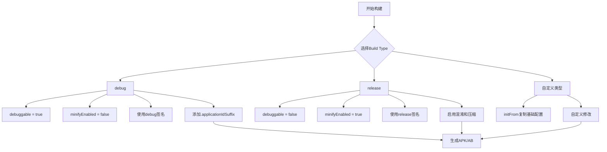

# 21.1.76 ApplicationBuildType

夜色渐深，湖面上倒映的星光开始变得模糊——那是夜风起了。

黛琳把白板笔在指尖转了一圈，炭火的红光在她眼睛里跳动着。她刚才讲完了ApplicationBuildFeatures（应用构建功能配置），洛芙似懂非懂地点着头，手指无意识地在笔记本触控板上画着圈。

“刚才说的那些功能开关，”黛琳看向洛芙，“你觉得它们什么时候会用到？”

洛芙抬起头：“呃……比如我想调试的时候开debuggable，想发布的时候关掉？”

“对，但不止于此。”黛琳微微一笑，“你刚才说的是开关，但实际开发中，我们需要的是完全不同的‘环境’——开发时用一个配置，测试时用另一个，正式发布又是第三个。这就是我们今天要讲的构建类型。”

她说着，从背包里掏出三块不同颜色的小木牌，分别是绿色、黄色和红色。洛芙立刻来了精神：“又是露营道具？”

“道具？”黛琳笑着把木牌排在石头上，“可以说是露营时的不同‘状态’吧。绿色是我们在营地debug的时候，黄色的临时标记是给测试人员用的，红色呢……”

“发布！”希尔抢答道，手指在键盘上啪嗒一声，“release版本，要关掉所有调试功能。”

“正确。”黛琳点点头，“在Android Gradle里，我们用Build Type来定义这些不同的‘环境’。最常见的就是debug和release两种。”

---

## 黛琳的白板：构建类型是什么

黛琳拿起白板笔，在白板上画了一个简单的表格：

```
┌────────────────┬─────────────┬─────────────┐
│    属性        │   debug     │   release   │
├────────────────┼─────────────┼─────────────┤
│ debuggable     │     true    │    false    │
│ minifyEnabled  │    false    │    true     │
│ signingConfig  │   debug.keystore │  release  │
│ applicationIdSuffix │  .debug  │   (none)   │
└────────────────┴─────────────┴─────────────┘
```

“这就是debug和release最核心的区别。”黛琳用笔尖点点表格，“debug类型默认开启调试，release默认开启混淆和压缩——当然，这些都是可以自己配置的。”

伊莎凑近看了一眼：“听起来就像是……我们在露营时，白天穿轻便的衣服，晚上要加外套？”

“差不多是这个意思。”黛琳点头，“build type就是定义你的app在不同阶段要穿什么‘衣服’。开发时你需要方便调试的‘轻便衣服’，发布时你需要安全紧凑的‘正装’。”

洛芙立刻举手：“那如果我们想加更多类型呢？比如给测试团队一个专门的build？”

“问得好。”黛琳笑了，“我们完全可以自定义build type。希尔，给她演示一下怎么加？”

希尔早就等着了。她把笔记本转过来，屏幕上是一个build.gradle文件的片段：

```kotlin
android {
    // 默认已经有 debug 和 release 两个 build type
    // 现在我们要添加第三个：staging（预发布测试用）
    
    buildTypes {
        debug {
            // debuggable 默认为 true，可以不写
            applicationIdSuffix ".debug"
            versionNameSuffix "-debug"
        }
        
        release {
            // 开启代码混淆
            minifyEnabled true
            // 启用资源压缩
            shrinkResources true
            // 配置文件签名
            signingConfig signingConfigs.release
        }
        
        // 自定义 build type：staging（给测试团队用）
        staging {
            // 类似于 debug，但有些特殊配置
            debuggable true
            // 使用测试专用的签名配置
            signingConfig signingConfigs.staging
            // 给 applicationId 加后缀，方便和正式版共存
            applicationIdSuffix ".staging"
            // 版本名后缀
            versionNameSuffix "-staging"
        }
    }
}
```

洛芙眨眨眼：“applicationIdSuffix……是让同一个应用能同时安装多个版本？”

“对！”希尔打了个响指，“加了`.debug`后，你的app包名就变成`com.example.myapp.debug`，这样你可以在手机里同时安装debug版、staging版和正式版，互不冲突。开发的时候特别方便。”

洛芙想象了一下：“就像……露营的时候，我们有炊事帐篷、住宿帐篷、储物帐篷？虽然是同一个营地，但各有各的用途？”

“哈，这个比喻不错。”希尔笑着点头。

---

## 深夜的萤火虫：debuggable的真相

夜风吹过湖面，带来一阵清凉。黛琳抬头看了看天，星星比刚才更亮了。她不急着继续讲，而是拈起一块小石头，轻轻扔进水里。

水面泛起涟漪，一圈一圈地荡开。

“洛芙，你刚才说debuggable等于调试，对也不对。”

洛芙歪着头：“难道不是吗？”

“它是让你可以调试，”黛琳说，“但它做的事情远不止于此。debuggable=true的时候，系统会做很多事情——允许你连接调试器、输出详细日志、允许堆栈跟踪……这些在正式版里都是安全隐患。”

她顿了顿：“所以release版本一定要关掉debuggable，不是为了别的，是为了安全。”

伊莎轻声说：“就像营火——白天我们不需要它，还容易引发危险；但晚上我们需要它的光亮和温暖。debuggable就是那堆火，在对的时间是对的，在错的时间就是隐患。”

洛芙若有所思地点点头。

黛琳继续道：“而且debuggable还会影响Android系统的一些行为。比如有些API在debuggable=false时会被限制调用——这是系统层面的保护机制。”

“那如果我在release版里遇到问题想调试怎么办？”洛芙问。

“有几个办法。”希尔接过话题，“第一，使用BuildConfig来控制——我们在代码里可以判断当前是什么build type；第二，用beta测试通道，Google Play的beta测试版本也是可以调试的；第三……”

她顿了顿：“在AndroidManifest里用`android:debuggable="true"`强制开启——但这是**不推荐**的，因为会被系统认为是安全风险，google play可能会拒绝发布。”

洛芙吐了吐舌头：“那还是不用为妙。”

---

## 希尔的技术演示：构建类型的实战

希尔把笔记本放在膝盖上，调整了一下坐姿：“我给你们看一个更完整的build type配置吧。这是我们项目里实际用的配置。”

```kotlin
android {
    signingConfigs {
        // 定义签名配置
        create("staging") {
            storeFile file("keystores/staging.keystore")
            storePassword "staging_password"
            keyAlias "staging_key"
            keyPassword "staging_key_password"
        }
    }
    
    buildTypes {
        debug {
            // 开启调试
            debuggable true
            // 允许虚拟机调试
            jvmTargetCompatibility JavaVersion.VERSION_17
            // debug版的applicationId后缀
            applicationIdSuffix ".debug"
            // 版本名后缀
            versionNameSuffix "-debug"
            // 启用日志（release默认会移除日志）
            buildConfigField "boolean", "ENABLE_LOG", "true"
            // 使用debug签名
            signingConfig signingConfigs.debug
        }
        
        release {
            // 关闭调试
            debuggable false
            // 启用混淆
            minifyEnabled true
            // 启用资源压缩
            shrinkResources true
            // 启用代码混淆规则
            proguardFiles getDefaultProguardFile('proguard-android-optimize.txt'), 'proguard-rules.pro'
            // 禁用日志
            buildConfigField "boolean", "ENABLE_LOG", "false"
            // 使用release签名
            signingConfig signingConfigs.release
            // 启用R8全量优化
            isMinifyEnabled = true
            // 启用zipalign优化
            isZipAlignEnabled = true
        }
        
        // 内部测试版本
        internal {
            initWith release
            applicationIdSuffix ".internal"
            versionNameSuffix "-internal"
            // 内部版本可以调试，方便测试
            debuggable true
            // 但日志默认关闭
            buildConfigField "boolean", "ENABLE_LOG", "false"
        }
    }
}
```

洛芙看着屏幕：“initFrom release是什么？”

“很好的问题。”黛琳说，“它会把release的所有配置复制过来，然后我们在internal里只改我们需要的部分。这样就不用重复写一堆配置了。”

“原来如此！”洛芙明白了，“就像我们在营地里，先搭一个标准帐篷，然后内部版本只是在这个基础上加点装饰。”

“对，就是这个意思。”希尔补充道，“而且注意internal里的`debuggable true`——这说明build type的配置是灵活的，不是非黑即白的。你可以根据需要组合。”

---

## 伊莎的比喻：构建类型的哲学

夜空中开始有萤火虫闪烁，远远近近的，像是会飞的小星星。

伊莎看着那些萤火虫，轻声说：“我在想……build type就像是我们对待时间的方式。”

黛琳看向她：“怎么说？”

“debug模式像是我们有无限的時間——可以慢慢来，可以犯错，可以回头重试。release模式呢……像是表演的时刻，所有的错误都会被看到，所以要提前准备好每一个细节。”

她顿了顿：“而staging或者internal，像是彩排——不完全是正式演出，但也不是随意的练习。要认真，但又保留一些余地。”

洛芙听得入神：“这样一說，感觉build type不只是技术配置，更是一种……做事的态度？”

“对的。”黛琳点头，“技术永远是为了目的服务的。你需要什么样的开发体验，就需要什么样的build type。”

她指着白板上的表格：“比如我们团队里，debug版专门给开发人员用——日志全开，随时可以调试；internal版给内部测试——日志关掉但可以调试，模拟真实环境；release版给外部用户——最快最安全。”

---

## 代码中的构建类型判断

希尔打开了一个新的代码文件：“最后再讲一个常用的——怎么在代码里判断当前是什么build type。”

```kotlin
// BuildConfig 是 Gradle 自动生成的类
// 每次 build 的时候会自动根据当前的 build type 填充字段

object BuildConfig {
    // 当前是否是 debug build
    const val DEBUG = true  // debug build 时为 true，release 时为 false
    
    // applicationId
    const val APPLICATION_ID = "com.example.myapp"
    const val APPLICATION_ID_SUFFIX = ".debug"  // 只有 debug 才有
    
    // 版本信息
    const val VERSION_CODE = 1
    const val VERSION_NAME = "1.0.0"
    const val VERSION_NAME_SUFFIX = "-debug"  // 只有 debug 才有
    
    // 我们自定义的字段（在前面的 build.gradle 里定义过）
    const val ENABLE_LOG = true
}

// 在代码里使用
fun doNetworkRequest() {
    if (BuildConfig.ENABLE_LOG) {
        Log.d("Network", "Starting request...")
    }
    
    // 根据 build type 做不同的事情
    if (BuildConfig.DEBUG) {
        // debug 模式：使用本地服务器
        baseUrl = "http://10.0.2.2:8080/api/"
    } else {
        // release 模式：使用正式服务器
        baseUrl = "https://api.example.com/api/"
    }
}
```

“这个BuildConfig太方便了！”洛芙说，“我在代码里就能知道现在是哪个版本。”

“而且它是在编译时确定的，”黛琳补充道，“不是运行时判断，所以不会影响性能。”

---

## 夜深了：该休息了

远处的山轮廓渐渐模糊，夜色彻底笼罩了营地。黛琳合上白板，看看身边的几位伙伴。

“今天就到这里吧。build type是Android开发里非常基础但重要的概念——你们以后会天天和它打交道。”

洛芙伸了个懒腰，打了个哈欠：“原来build type就是给app穿不同的‘衣服’——开发时穿方便的，发布时穿安全的。”

“你总结得很好。”黛琳笑着收起白板。

希尔已经把笔记本收进包里：“明天我们可以讲讲签名配置——application signing。那是build type的好搭档。”

“那是release发布前的最后一步吧？”伊莎问。

“对，”黛琳点头，“没有签名，app是没办法安装到手机上的。”

萤火虫还在远处闪烁，像是在黑夜里眨眼的小星星。女孩们开始收拾东西，准备回帐篷休息。

洛芙最后回头看了一眼湖面——星空倒映在水中，已经看不清哪些是真正的星星了。她满足地笑了笑，今天又学到了新东西呢。

---

# 专业技术总结

> ApplicationBuildType（应用程序构建类型）是Android Gradle中用于定义不同构建环境的配置机制，允许开发者为开发、测试、生产等不同场景创建差异化的构建配置。

## 结构图





## 反模式与陷阱

1. **release版本忘记关闭debuggable** — 安全隐患，敏感信息可能被窃取。修复：在build.gradle中显式设置`debuggable false`。

2. **release版本忘记配置签名** — 无法安装到设备。修复：确保`signingConfig`正确配置。

3. **混淆规则不完整导致release崩溃** — R8/ProGuard可能错误移除了必需的类和方法。修复：添加`-keep`规则到proguard-rules.pro文件。

4. **在代码中用字符串判断build type** — 易出错且维护困难。修复：使用Gradle自动生成的`BuildConfig.DEBUG`常量。

5. **debug和release使用同一个签名** — 导致版本冲突无法同时安装。修复：给debug版本添加`applicationIdSuffix ".debug"`。

## 设计哲学

**构建类型的核心理念：环境隔离与差异化管理**

- **开发体验优先**：debug模式注重调试便利性，开启所有可用的诊断工具
- **发布安全优先**：release模式注重性能和安全，启用所有优化和防护措施
- **配置可复用**：通过`initFrom`实现配置继承，避免重复定义
- **编译时确定**：BuildConfig字段在编译时确定，运行时无性能开销

**实践建议：**
1. 始终在release中显式设置`debuggable false`
2. 为不同团队成员创建专用的build type
3. 使用BuildConfig而非常量判断环境
4. 保持build type配置简洁，复杂逻辑放在defaultConfig中
5. 定期检查并更新混淆规则

---

> 学习建议：理解debug和release的核心差异，掌握自定义build type的方法，记住BuildConfig是编译时生成的常量而非运行时判断。

---

## 洛芙的小小日记本

> 今晚黛琳讲的是build type——给app穿什么"衣服"。debug版像穿便服方便调试，release版像穿正装要安全体面。原来同一个app可以同时安装debug版和release版，只要加个后缀就行！开发时真的超方便呀～🌙

---

## 今日关键词

**ApplicationBuildType** — 应用程序构建类型，定义不同构建环境的配置

**debug** — 调试构建类型，默认开启调试功能，用于开发阶段

**release** — 发布构建类型，默认开启混淆压缩，用于正式发布

**minifyEnabled** — 启用代码混淆压缩，release版默认开启

**debuggable** — 允许调试器连接，debug版为true，release版必须为false

**applicationIdSuffix** — 应用ID后缀，用于区分不同build type的安装包

**signingConfig** — 签名配置，定义apk的签名密钥

**BuildConfig** — Gradle自动生成的编译配置类，包含当前构建环境信息

**proguard-rules.pro** — ProGuard/R8混淆规则文件

**initFrom** — 从另一个build type复制配置的方法
