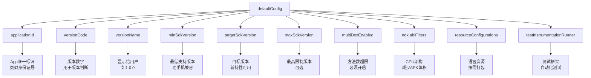
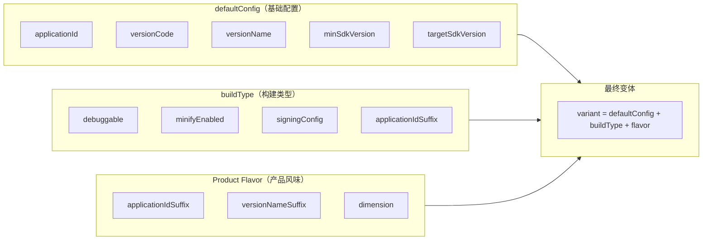
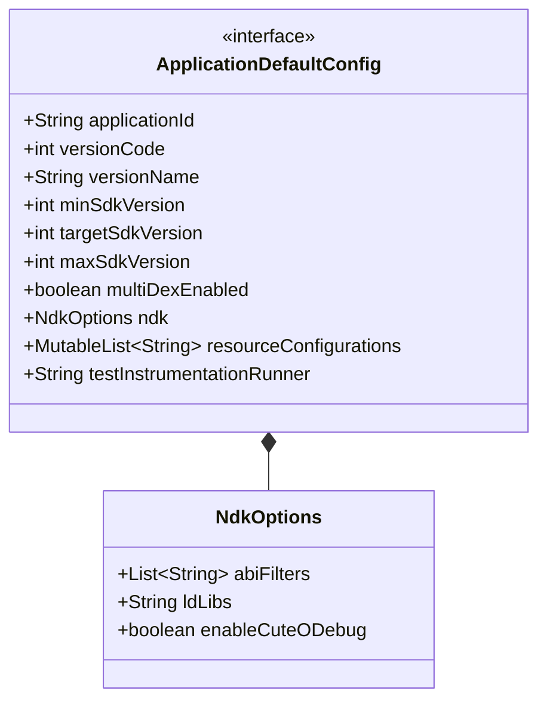
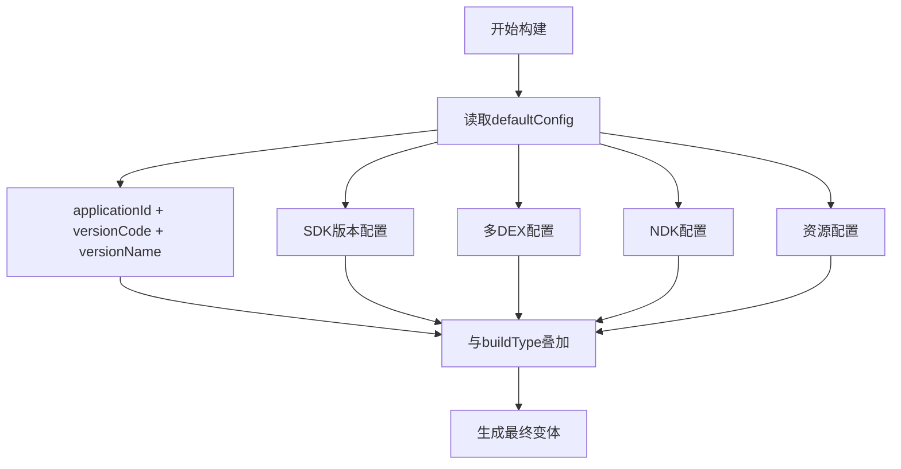

# 21.1.77 ApplicationDefaultConfig

夜色愈发深沉了。

湖面上的星光比刚才更加清晰，倒映在平静的水面上，仿佛天上和水里各有一片银河。远处偶尔传来夜鸟的低鸣，还有风吹过树梢的沙沙声。女孩们并没有要休息的意思——黛琳的白板还支着呢，刚才讲完build type，她的目光里写着"还有更重要的话题"。

洛芙正把玩着一根细细的树枝，她刚才记住了debug和release的区别，心里正得意着呢。她用树枝在地上画着圈圈，忽然想起一个问题："黛琳姐姐，那个……build type是管不同环境的，那有没有什么东西是管所有的呢？比如我们app的版本号啥的，总不能每个build type都写一遍吧？"

黛琳微微一笑，洛芙这个问题问得正是时候。

"你问得很好。"黛琳把白板翻到新的一页，"我们刚才讲的build type，是针对不同的‘环境’——开发、测试、发布。但还有一些配置，是不管你用什么环境都一样的，比如你的app叫什么、版本号是多少、用哪个SDK版本……这些就是'默认配置'，用ApplicationDefaultConfig来设置。"

她顿了顿，环顾四周："简单来说，build type是'什么环境下怎么构建'，defaultConfig是'不管什么环境，都要用的基础配置'。就像我们露营——不管你是夏天来还是冬天来露营，你都需要带帐篷和睡袋；但穿什么衣服，就取决于是什么季节了。"

伊莎轻轻鼓了鼓掌："这个比喻好。defaultConfig就是那个'帐篷和睡袋'，不管什么build type都少不了的。"

"那defaultConfig都管些什么呀？"洛芙好奇地问。

黛琳掰着手指头数起来："applicationId——你的app在手机上的唯一标识；versionCode——版本数字；versionName——用户看到的版本名；minSdkVersion——最低支持的安卓版本；targetSdkVersion——目标安卓版本；还有multiDexEnable、ndk配置、resourceConfigurations……太多了。"

"听起来都是很重要的基础配置！"洛芙说。

"对，这些都是你app的'身份证'和'基本装备'。"黛琳点点头，"来，希尔，给大家演示一下 defaultConfig 怎么写。"

---

## 希尔的标准示范

希尔早就准备好了。她把笔记本转过来，屏幕上是一个完整的defaultConfig配置：

```kotlin
android {
    defaultConfig {
        // 应用唯一标识符（类似包名，但可以自定义）
        applicationId "com.example.myapp"
        
        // 版本号（整数，升级时必须比上次大）
        versionCode 1
        
        // 用户可见的版本名（字符串）
        versionName "1.0.0"
        
        // 最低支持的Android版本（API级别）
        minSdkVersion 21
        
        // 目标Android版本（你主要针对哪个版本优化）
        targetSdkVersion 34
        
        // 测试 instrumentation runner
        testInstrumentationRunner "androidx.test.runner.AndroidJUnitRunner"
        
        // 是否启用多DEX（超过65536方法时需要）
        multiDexEnabled false
        
        // NDK ABI过滤器（只保留需要的CPU架构）
        ndk {
            abiFilters 'armeabi-v7a', 'arm64-v8a', 'x86', 'x86_64'
        }
        
        // 支持的语言（减少APK体积）
        resourceConfigurations += ['en', 'zh-rCN', 'ja']
    }
}
```

洛芙眼睛都直了："这么多配置！"

"别担心，"希尔笑了笑，"我来一个个解释。"

---

## 黛琳的白板：核心配置详解

黛琳拿起白板笔，在白板上画了一个大表格：



"我挑几个最重要的讲。"黛琳指着表格说。

### applicationId——你的app叫什么

"applicationId是你app在手机上的唯一标识，就像每个人的身份证号。"黛琳解释道，"用户去应用商店搜索、下载、安装，用的都是这个ID。"

"那和原来的packageName有什么区别吗？"洛芙问。

"问得好！"黛琳点头，"在以前老的Android版本里，applicationId就是packageName。但现在它们分开了——packageName用来识别Java包结构，applicationId用来标识应用本身。这样你就可以随意改包名而不影响应用商店的上架状态。"

伊莎补充道："就像一个人可以改名字，但身份证号不变？"

"对，就是这个意思。"黛琳笑着说。

### versionCode和versionName——版本的双胞胎

"versionCode是一个整数，每次发布新版本都必须比上次大。"黛琳继续说，"这个数字是给系统和应用商店用的——它们可不管你叫什么'1.0'还是'2.0'，它们只认数字。"

"那versionName呢？"洛芙问。

"versionName是给用户看的。"黛琳说，"比如'1.0.0'、'2.1.3 Beta'、'圣诞特别版'——随便你写什么都行，只要用户看得懂。"

希尔插话道："记住，versionCode只能递增，不能重复或者减少。每次上传到Play Store，如果versionCode比上次小，会被拒绝的。"

"原来如此！"洛芙记了下来。

### minSdkVersion和targetSdkVersion——SDK版本的两兄弟

"这两个是SDK配置里最重要的。"黛琳的表情变得认真起来，"minSdkVersion决定了你的app能在多老的手机上运行；targetSdkVersion决定了你用哪个版本的Android特性。"

"听起来有点复杂……"洛芙皱起眉头。

"让我用露营来比喻。"伊莎说道，"minSdkVersion就像是你带的最低配置装备——比如帐篷，至少要有防雨功能吧？targetSdkVersion就像是你的目标装备清单——你希望最终带齐哪些高级装备。"

黛琳点头："伊莎的比喻很恰当。一般来说，minSdkVersion 21（Android 5.0）是个不错的起点，能覆盖绝大多数活跃设备。targetSdkVersion则应该尽量用最新的稳定版——现在是34。"

"为什么要用最新的？"洛芙问。

"因为新的SDK版本会带来新的安全特性和性能优化。"黛琳解释道，"而且用户的新手机都是新系统，你不用新版本，岂不是浪费了？"

---

## 洛芙的实践：动手配置defaultConfig

"光说不练假把式。"希尔把笔记本递给洛芙，"你来写一个defaultConfig试试。"

洛芙深吸一口气，回想刚才学的内容，在笔记本上敲起来：

```kotlin
android {
    defaultConfig {
        applicationId "com.camping.lovers"
        versionCode 1
        versionName "1.0.0"
        minSdkVersion 24
        targetSdkVersion 34
        
        multiDexEnabled true
        
        ndk {
            abiFilters 'arm64-v8a', 'x86_64'
        }
    }
}
```

写完后，洛芙抬起头："我这样写对吗？"

黛琳仔细看了看，点点头："基本正确！我发现你开了multiDexEnabled，是发现什么问题了吗？"

洛芙吐了吐舌头："我之前看文档说方法数超过65536就要开多DEX，我就先开着了……"

"哈哈，你很谨慎嘛！"希尔笑道，"不过如果你的app不大，其实不需要开。开了多DEX会增加启动时间。"

"那我应该关掉吗？"洛芙问。

"这样吧，"黛琳说，"我们先关掉，如果以后遇到方法数超限的错误再加。现在先保持简单。"

---

## 反模式：常见的defaultConfig错误

黛琳的表情变得严肃起来："讲完了怎么写，我来给大家讲讲常见的错误。"

她在白板上画了一个大大的"×"：

**错误一：minSdkVersion设得太高**

```kotlin
// ❌ 错误：把minSdkVersion设成34
defaultConfig {
    minSdkVersion 34
    // 这意味着Android 8.0以下的手机都用不了你的app
    // 会丢失大量用户！
}
```

"有些人为了省事，直接用最新的SDK做minSdkVersion，觉得这样兼容性测试简单。"黛琳摇着头说，"但这等于放弃了所有老手机用户。"

**错误二：versionCode不递增**

```kotlin
// ❌ 错误：每次发布都写死同样的versionCode
defaultConfig {
    versionCode 1  // 永远是1，永远无法更新！
}
```

"这是我见过最常见的错误。"黛琳说，"有些人把versionCode写死成1，然后app永远无法更新到应用商店。"

**错误三：忘记配置abiFilters**

```kotlin
// ❌ 错误：没有abiFilters，所有架构都打包
defaultConfig {
    // 默认会打包所有架构，APK体积超大！
}
```

"现在的手机大多数是arm64-v8a架构。"希尔补充道，"你如果不需要兼容超老手机，完全可以只保留arm64-v8a，能省不少空间。"

---

## 重构示例：从混乱到整洁

黛琳又翻到一页白板："来，我们看一个真实的'反面教材'，然后把它改造成正确的。"

她指着一个充满问题的build.gradle示例：

```kotlin
// ❌ 反面教材：把所有配置混在一起
android {
    defaultConfig {
        applicationId "com.example.app"
        versionCode 1
        versionName "1.0"
        minSdkVersion 16
        targetSdkVersion 33
    }
    
    buildTypes {
        debug {
            applicationIdSuffix ".debug"
            versionNameSuffix "-debug"
        }
    }
}
```

"这个有什么问题吗？"洛芙歪着头问。

"问题多了去了。"黛琳数落起来，"第一，minSdkVersion 16太低了，很多新特性用不了；第二，targetSdkVersion 33已经过时了，现在是34；第三，applicationId没有区分渠道，debug和release会冲突；第四，versionName'1.0'太简单了，应该用语义化版本号。"

希尔把这些改成了正确的写法：

```kotlin
// ✅ 正确示范：清晰、规范的defaultConfig
android {
    defaultConfig {
        applicationId "com.camping.myapp"
        versionCode 1
        versionName "1.0.0"
        minSdkVersion 21
        targetSdkVersion 34
        multiDexEnabled false
        
        ndk {
            abiFilters 'arm64-v8a'
        }
        
        resourceConfigurations += ['en', 'zh-rCN']
    }
    
    buildTypes {
        debug {
            debuggable true
            applicationIdSuffix ".debug"
            versionNameSuffix "-debug"
            minifyEnabled false
        }
        
        release {
            debuggable false
            minifyEnabled true
            signingConfig signingConfigs.release
        }
    }
}
```

"这样就好多了！"洛芙看看对比，"结构清晰，该有的都有。"

---

## 白板：defaultConfig与buildType的关系

黛琳又画了一张图来解释defaultConfig和buildType的关系：



"这张图展示了Android构建配置的层次关系。"黛琳指着图解释道，"defaultConfig提供基础配置，buildType提供环境差异，Product Flavor提供渠道差异——它们三个叠加在一起，才是最终的构建变体。"

"也就是说，如果我有一个debug构建类型，再加上一个免费版的产品风味，就会生成一个'freeDebug'的变体？"洛芙问。

"对，就是这个意思！"黛琳笑着点头，"这就是Android构建系统的强大之处——你可以自由组合，生成无数种变体。"

---

## 深夜的尾声

洛芙伸了个懒腰，抬头看向天空。银河依旧明亮，几颗流星划过夜空，转瞬即逝。

"原来app的配置也有这么多讲究啊……"洛芙感慨道，"比露营装备的选择还复杂。"

"露营装备和app配置是一样的道理。"伊莎轻声说，"你要先想清楚用户需要什么（minSdkVersion），然后决定自己要提供什么（targetSdkVersion），最后才是怎么包装（versionName）。"

黛琳收拾着白板："明天我们来讲签名配置——application signing。没有签名，app是没办法安装到手机上的。"

"那是不是就像露营时的'入场券'？"洛芙问。

"比入场券还重要。"希尔眨眨眼，"没有签名，你的app连'身份证'都没有。"

夜风轻轻吹过，炭火堆发出轻微的噼啪声。女孩们开始收拾东西，洛芙最后看了一眼湖面上闪烁的星光，满足地笑了。

今天又学到了新东西呢。

---

# 专业技术总结

> ApplicationDefaultConfig（应用程序默认配置）是Android Gradle中用于定义所有构建变体通用基础配置的DSL接口，包括应用标识、版本信息、SDK版本等核心属性，这些配置会与buildType和productFlavor叠加生成最终的构建变体。

## 结构图





## 反模式与陷阱

1. **minSdkVersion设得太高** — 丢失大量潜在用户。修复：根据目标用户群体合理设置，建议21起步。

2. **versionCode忘记递增** — 应用无法更新到应用商店。修复：使用Gradle自动递增或维护版本号脚本。

3. **abiFilters缺失** — APK体积过大。修复：明确指定需要的CPU架构，如['arm64-v8a']。

4. **targetSdkVersion长期不更新** — 无法使用新特性和安全修复。修复：尽量使用最新的稳定版SDK。

5. **defaultConfig和buildType配置冲突** — 某些属性被覆盖导致意外行为。修复：理解配置优先级，必要时在buildType中显式覆盖。

## 设计哲学

**默认配置的设计理念：统一基础，差异叠加**

- **统一基础**：defaultConfig定义所有变体共享的核心配置，避免重复
- **差异叠加**：通过buildType和productFlavor实现差异化配置
- **编译时确定**：所有defaultConfig属性在编译时确定，运行时无开销
- **版本语义化**：versionName遵循语义化版本规范（SemVer）

**实践建议：**
1. minSdkVersion建议设为21，覆盖绝大多数活跃设备
2. targetSdkVersion保持最新稳定版
3. 使用abiFilters减少APK体积，只保留需要的架构
4. versionName使用语义化版本号，如"1.0.0"、"2.1.0-beta"
5. 复杂配置考虑使用buildConfigField自定义字段

---

## 🏕️ 动手练习

### 练习目标
配置一个完整的defaultConfig，理解各个属性的作用和最佳实践。

### 目标
为一个露营主题App配置defaultConfig，验证对核心配置项的理解。

### 你需要做的事

1. **创建新的Android项目或使用现有项目**
2. **在app/build.gradle中配置defaultConfig**
   - applicationId设为"com.camping.lover"（露营爱好者）
   - versionCode从1开始
   - versionName使用"1.0.0"
   - minSdkVersion设为21
   - targetSdkVersion设为34
   - 开启multiDexEnabled
   - 配置ndk.abiFilters只保留arm64-v8a
3. **在buildTypes中添加debug和release配置**
4. **编译项目验证配置正确**

### 验收标准

- [ ] applicationId配置正确且符合规范
- [ ] versionCode和versionName配置完整
- [ ] minSdkVersion和targetSdkVersion设置合理
- [ ] ndk.abiFilters已配置且只保留必要架构
- [ ] debug和release构建类型都能正常编译
- [ ] 生成的APK文件名包含版本信息

### 提示

```kotlin
android {
    defaultConfig {
        applicationId "com.camping.lover"
        versionCode 1
        versionName "1.0.0"
        minSdkVersion 21
        targetSdkVersion 34
        multiDexEnabled false  // 如果方法数未超限，保持false
        
        ndk {
            abiFilters 'arm64-v8a'  // 只保留64位ARM架构
        }
    }
    
    buildTypes {
        debug {
            applicationIdSuffix ".debug"
            versionNameSuffix "-debug"
            debuggable true
        }
        release {
            minifyEnabled true
            // release配置...
        }
    }
}
```

### 面试热身

1. 请解释applicationId和packageName的区别，以及为什么需要分开？
2. versionCode和versionName分别用于什么场景？为什么要区分？
3. minSdkVersion和targetSdkVersion的区别是什么？分别影响什么？
4. 什么情况下需要开启multiDexEnabled？如何判断？
5. ndk.abiFilters的作用是什么？如何选择合适的CPU架构？

---

> 学习建议：defaultConfig是Android构建的基石，理解它与其他配置层的关系非常重要。建议多动手实践，尝试不同的配置组合，观察生成的变体差异。记住：合理的SDK版本选择既能覆盖更多用户，又能享受新特性——这是权衡的艺术。

---

# 洛芙的小小日记本

今天学到了defaultConfig！原来app的身份证、版本号、SDK版本都是在这里配置的。黛琳说build type是"什么环境下怎么构建"，defaultConfig是"不管什么环境都要用的基础装备"。好形象的比喻呀！明天要学签名配置了，据说没有签名app都装不了手机呢……好期待！

---

# 今日关键词

- **ApplicationDefaultConfig**：Android Gradle DSL中定义应用默认配置的接口
- **applicationId**：应用在设备上的唯一标识符，类似身份证号
- **versionCode**：用于版本判断的整数，必须递增
- **versionName**：用户可见的版本名称字符串
- **minSdkVersion**：最低支持的Android API级别
- **targetSdkVersion**：目标Android API级别
- **maxSdkVersion**：最高限制的Android API级别（可选）
- **multiDexEnabled**：是否启用多DEX功能（方法数超65536时需开启）
- **abiFilters**：NDK ABI过滤器，指定支持的CPU架构
- **resourceConfigurations**：资源配置过滤，减少APK体积
- **testInstrumentationRunner**：AndroidJUnit测试框架运行器
- **buildType**：构建类型配置（debug/release等）
- **productFlavor**：产品风味配置（渠道/版本等）
- **variant**：构建变体，由defaultConfig+buildType+flavor组合生成
