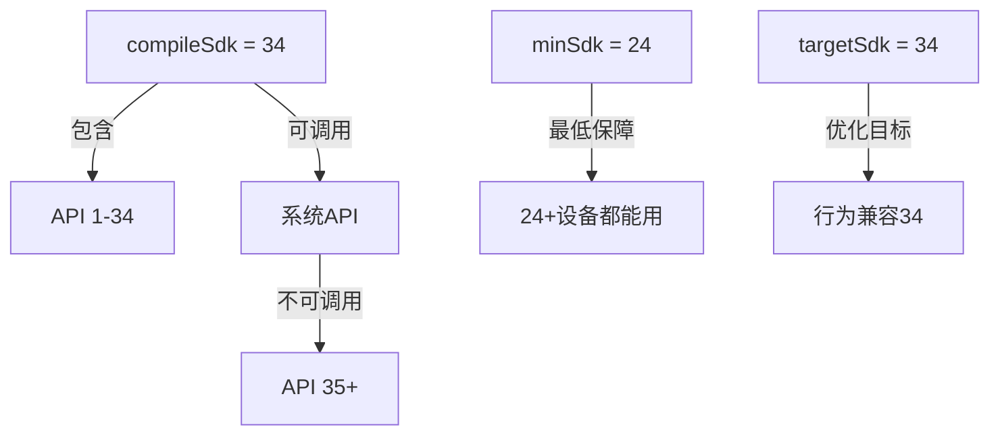
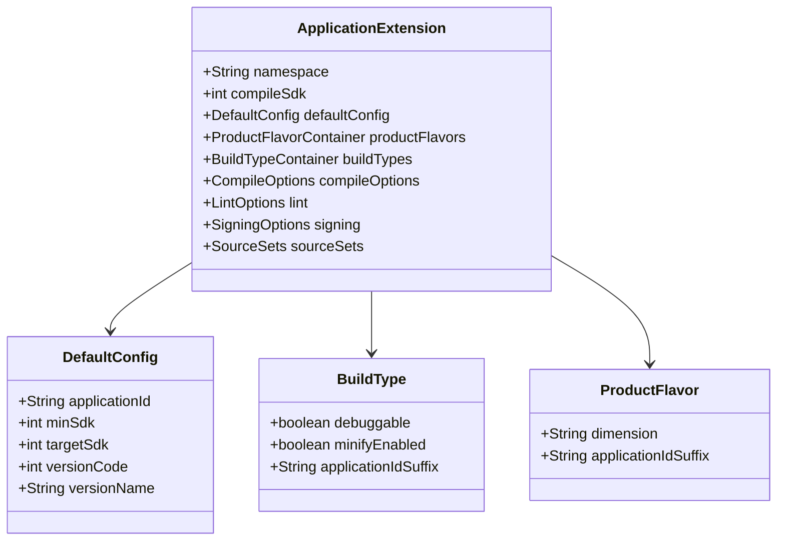

# 21.1.78 应用扩展

夜色渐深，湖畔的虫鸣声此起彼伏，像是一场永不落幕的夏季音乐会。

黛琳用树枝拨弄了一下炭火堆，几颗火星蹦跳着升上夜空，转瞬即逝。洛芙托着腮帮子，看着那些火星发呆，忽然意识到一个问题。

"黛琳姐，"洛芙犹豫了一下，"你之前讲完了DefaultConfig和BuildType 可是......它们是归谁来管的啊？就像一个公司里 谁是部门经理 谁又是普通员工？"

黛琳抬起头，眼里映着跳动的火光。她笑了笑，从笔记本里抽出一张白纸，在上面画了一个简单的组织结构图。

"问得好，"她说，"在Android构建系统里 有一个大管家 叫ApplicationExtension 所有的应用级配置 都归它管。DefaultConfig和BuildType 都是它手下的部门 而已。"

"大管家？"洛芙眨了眨眼 脑海中浮现出一个戴着单片眼镜、穿着管家制服的小人形象。

"来 我们看看它的代码长什么样，"希尔把自己的笔记本转过来 屏幕上显示着build.gradle文件

```groovy
android {
    namespace 'com.example.myapp'
    compileSdk 34
    
    defaultConfig {
        applicationId "com.example.myapp"
        minSdk 24
        targetSdk 34
        versionCode 1
        versionName "1.0"
    }
    
    buildTypes {
        release {
            minifyEnabled true
            proguardFiles getDefaultProguardFile('proguard-android-optimize.txt'), 'proguard-rules.pro'
        }
        debug {
            applicationIdSuffix ".debug"
            debuggable true
        }
    }
    
    compileOptions {
        sourceCompatibility JavaVersion.VERSION_17
        targetCompatibility JavaVersion.VERSION_17
    }
}
```

伊莎凑过来看，指着最外层的`android {}`块说："这个就是ApplicationExtension 本尊啦 就像露营地里最大的那顶指挥帐篷"

"指挥帐篷？"洛芙来兴趣了

"对呀 "伊莎拾起一根草茎 在地上画了起来 你想 整个营地是不是需要一个总指挥？它要决定用什么帐篷（namespace）、在哪里扎营（compileSdk）、准备多少物资（defaultConfig）、分成哪些小组（buildType）......"

"原来如此！"洛芙恍然大悟 所以`android {}`块就是那个总指挥

黛琳点点头 接话道：ApplicationExtension就是Android Gradle插件为应用模块提供的 DSL入口 通过它 你可以配置几乎所有应用级别的构建参数

洛芙赶紧在自己的笔记本上记录：ApplicationExtension = Android应用构建的"大管家"

---

### 指挥帐篷的"墙壁"——Namespace

"我们一个一个来看 "黛琳指着屏幕上的namespace说 先说这个——它相当于帐篷的墙壁 确定了你们的"领地"范围

```groovy
android {
    namespace 'com.example.myapp'
}
```

"namespace就是Java包名 "黛琳解释道 它有两个重要作用 第一 你的AndroidManifest.xml里声明的activity、service等组件 必须在正确的包名下 第二 它决定了最终APK的根包名

洛芙举手提问：一定要写namespace吗？

"从Android Studio 3.0开始是必须的 "希尔操作性回答，之前可以只靠AndroidManifest.xml的package属性，但现在推荐两边保持一致

"而且 "黛琳补充道 namespace还关系到AAR依赖的资源合并——如果两个库用了相同的资源名称 编译器会通过namespace来区分它们

伊莎在旁边轻笑："就像两个探险队进了同一片森林 各自挂上自己的队旗 就不会走错啦"

---

### 指挥帐篷的"高度"——CompileSdk

"接下来是这个 "希尔指向compileSdk 34 这个数字 代表你们能用的"最高海拔"

洛芙不解：海拔？

"compileSdk就像地图上的海拔等高线 "希尔解释道 你只能使用到这个高度以下的所有"装备"（API） 比方说 compileSdk 34 意味着你可以调用Android 34及以下的所有系统API

黛琳画了一张简单的示意图：



"这里有三个容易混淆的概念 "黛琳说 compileSdk、minSdk和targetSdk 它们的区别就像——

"就像露营时的装备清单！"伊莎灵机一动

"对！"黛琳笑着说 compileSdk是你"想带"的装备（理论上可用的最新装备） minSdk是"必须带"的装备（最低保障） targetSdk是"重点测试"的装备（确保在这个版本下行为正确）

洛芙赶紧记笔记：

- compileSdk：编译时使用的SDK版本 决定你能调用哪些API
- minSdk：最低支持版本 决定哪些设备能安装你的App
- targetSdk：目标版本 用于兼容性测试和行为适配

---

### 帐篷里的"部门"——BuildTypes

"接下来是buildTypes "黛琳滑动屏幕 它定义了不同的"行动小组"

```groovy
android {
    buildTypes {
        release { ... }
        debug { ... }
        staging { ... }
    }
}
```

"我们已经有debug和release了 "洛芙说 "还能自定义更多？"

"当然 "希尔操作性回答 比如你想给测试人员一个特殊的版本 可以添加staging

她现场写了一个例子：

```groovy
buildTypes {
    release {
        minifyEnabled true
        shrinkResources true
        proguardFiles getDefaultProguardFile('proguard-android-optimize.txt'), 'proguard-rules.pro'
    }
    debug {
        applicationIdSuffix ".debug"
        debuggable true
        fakeAdsEnabled true  // 测试用广告
    }
    staging {
        initWith release
        applicationIdSuffix ".staging"
        buildConfigField "String", "BASE_URL", '"https://staging.example.com/"'
    }
}
```

"看 不同的buildType可以有不同的配置 "希尔说 这就像 野营时 正式演出和排练时需要不同的场地布置

洛芙注意到一个新东西：buildConfigField 这是什么？

"buildConfigField可以在BuildConfig类中生成静态字段 "黛琳解释道 比如staging版本的BASE_URL和正式版不同 就可以用这个方式注入

---

### 帐篷的"工具箱"——CompileOptions

"然后是compileOptions "黛琳指向下一段代码 它决定了编译时使用的"工具"

```groovy
android {
    compileOptions {
        sourceCompatibility JavaVersion.VERSION_17
        targetCompatibility JavaVersion.VERSION_17
    }
}
```

"sourceCompatibility和targetCompatibility通常设成一样 "希尔说 这决定了编译器用什么版本的Java语法和字节码

洛芙举手：我记得Java有不同版本 我们应该选哪个？

"现在主流是Java 17 "黛琳说 Android Gradle插件8.0+推荐使用Java 17 一是性能更好 二是能用到更多的语言特性

她停顿了一下 补充道：如果你用的是Java 8 还可以开启coreLibraryDesugaring来使用一些新API

```groovy
android {
    compileOptions {
        coreLibraryDesugaringEnabled true
        sourceCompatibility JavaVersion.VERSION_17
        targetCompatibility JavaVersion.VERSION_17
    }
}

dependencies {
    coreLibraryDesugaring 'com.android.tools:desugar_jdk_libs:2.0.4'
}
```

"这个coreLibraryDesugaring可厉害了 "希尔操作性解释 它让低版本Android也能用高版本API 比如java.time包在Android 26+才内置 但开启desugaring后 minSdk 21就能用

---

### 帐篷的"装修风格"——ProductFlavors（番外）

黛琳正准备讲下一个话题 伊莎忽然插话：对了 你们知道还有ProductFlavors吗？就像同一个露营地 可以同时有两种"装修风格"

"我知道！"洛芙兴奋地说 之前看到过 好像是有免费版和付费版那种？

"对 "黛琳点点头 ProductFlavors让你可以创建不同"风味"的App版本

```groovy
android {
    flavorDimensions += "version"
    productFlavors {
        free {
            dimension "version"
            applicationIdSuffix ".free"
            versionNameSuffix "-free"
        }
        premium {
            dimension "version"
            applicationIdSuffix ".premium"
            versionNameSuffix "-premium"
        }
    }
}
```

"免费版和付费版可以共享大部分代码 "希尔操作性补充 但在src/free和src/premium目录下可以放各自特有的资源或代码

洛芙感叹：原来一个项目可以同时build出好几个App啊！

"对的 "黛琳总结道 BuildType × ProductFlavors = 实际构建的变体数量 如果你有2个flavor + 2个buildType 那就会有4个APK输出

---

### 全景图——ApplicationExtension的完整结构

希尔把整个ApplicationExtension的结构画成了一张大图：



"这张图展示了ApplicationExtension的主要组成部分 "黛琳说 实际上它还包括更多配置项比如splits（APK拆分）、aaptOptions（资源压缩）、packagingOptions（打包选项）等

洛芙看得眼花缭乱：感觉好复杂啊......

"别担心 "伊莎温柔地说 刚建项目时 很多配置都用默认值就好了 就像露营时 指挥帐篷只要能挡风遮雨就行 慢慢添置装备嘛

黛琳点点头：确实 常见的配置就那么多 以后遇到特殊需求再查文档

---

### 实战——配置一个完整的ApplicationExtension

"我们来写一个实际可用的配置吧 "希尔操作性建议

她新建了一个build.gradle文件：

```groovy
plugins {
    id 'com.android.application'
}

android {
    // 1. 基础配置
    namespace 'com.camp.myapp'
    compileSdk 34
    
    // 2. 默认配置
    defaultConfig {
        applicationId "com.camp.myapp"
        minSdk 24
        targetSdk 34
        versionCode 1
        versionName "1.0.0"
        
        // 测试设备池
        testInstrumentationRunner "androidx.test.runner.AndroidJUnitRunner"
    }
    
    // 3. 构建类型
    buildTypes {
        debug {
            applicationIdSuffix ".debug"
            debuggable true
            buildConfigField "String", "API_BASE", '"http://10.0.2.2:8080/"'
        }
        release {
            minifyEnabled true
            shrinkResources true
            proguardFiles getDefaultProguardFile('proguard-android-optimize.txt'), 'proguard-rules.pro'
            buildConfigField "String", "API_BASE", '"https://api.myapp.com/"'
        }
    }
    
    // 4. 产品风味（可选）
    flavorDimensions += "channel"
    productFlavors {
        google {
            dimension "channel"
            applicationIdSuffix ".google"
        }
        huawei {
            dimension "channel"
            applicationIdSuffix ".huawei"
        }
    }
    
    // 5. 编译选项
    compileOptions {
        sourceCompatibility JavaVersion.VERSION_17
        targetCompatibility JavaVersion.VERSION_17
    }
    
    // 6. 代码压缩
    buildFeatures {
        buildConfig true
        shrinkResources true
    }
    
    // 7. lint检查
    lint {
        abortOnError false
        checkReleaseBuilds true
    }
}

dependencies {
    // 依赖配置...
}
```

"哇 这么长！"洛芙感叹

"其实很多是模板 "希尔操作性解释 你用Android Studio创建新项目时 自动生成的模板就包含这些

黛琳补充道：而且现在流行的做法是把敏感配置抽到gradle.properties或local.properties里 不要直接写在build.gradle里

---

### 反模式——常见错误与修正

"最后 我们来说说常见错误 "黛琳的表情变得认真起来

**错误一：namespace和AndroidManifest.xml的package不一致**

```groovy
// build.gradle
android {
    namespace 'com.example.app'
}
```

```xml
<!-- AndroidManifest.xml -->
<manifest package="com.other.app">  <!-- 错误！ -->
```

"这会导致Activity找不到 "黛琳说 正确的做法是只保留build.gradle里的namespace 删除AndroidManifest.xml的package属性（或者让两者一致）

**错误二：compileSdk和targetSdk混用**

```groovy
android {
    compileSdk 34
    targetSdk 33  // 不推荐！targetSdk应该>=compileSdk-1
}
```

"targetSdk应该接近或等于compileSdk "黛琳解释 否则可能会有隐藏的兼容性问题

**错误三：在BuildType里改applicationId导致多维度覆盖**

```groovy
buildTypes {
    release {
        applicationId "com.myapp"  // 错误！applicationId应该只在productFlavors里改
    }
}
```

"applicationId是App的唯一标识 "希尔操作性说 在BuildType里用applicationIdSuffix来添加后缀就好

---

### 章节收尾

夜空中划过一颗流星 洛芙赶紧闭上眼睛许愿。

"许了什么愿？"伊莎笑着问

"希望能熟练掌握这些配置......"洛芙吐了吐舌头

黛琳微笑着把笔记本合上：慢慢来 先把namespace、compileSdk、defaultConfig、buildType这几个核心概念理解透 以后遇到新需求再扩展

"就像露营 "伊莎说 "先把帐篷搭稳 睡袋铺好 其他的锅碗瓢盆 慢慢添"

远处的青蛙叫了几声 像是也在点头同意。

---

> 本章我们学习了Android应用构建的核心配置入口——ApplicationExtension。它是Android Gradle插件为应用模块提供的DSL入口，通过`android {}`块进行配置，主要包括：
> 
> - **namespace**：应用的包名标识
> - **compileSdk**：编译时使用的SDK版本
> - **defaultConfig**：默认的应用配置
> - **buildTypes**：构建类型（debug/release等）
> - **productFlavors**：产品风味（多版本策略）
> - **compileOptions**：Java编译选项
> 
> 理解ApplicationExtension的结构 是掌握Android构建系统的关键一步。

---

## 洛芙的小小日记本

今天黛琳姐讲了大管家ApplicationExtension！原来我们之前学的buildType和defaultConfig都是它手下的部门呀～还知道了namespace相当于帐篷的墙壁，compileSdk相当于海拔最高点。感觉Android构建系统好有组织性！伊莎的比喻太形象了——指挥帐篷和露营装备～

---

## 今日关键词

**ApplicationExtension** - Android Gradle插件为应用模块提供的DSL配置入口，是android{}块的类型定义

**namespace** - Android应用的包名标识，决定Manifest和资源的命名空间

**compileSdk** - 编译时使用的SDK版本，决定可用API的最高版本

**minSdk** - 最低支持版本，决定App支持的设备范围

**targetSdk** - 目标SDK版本，用于行为兼容性和测试

**buildType** - 构建类型，如debug、release，定义不同的构建变体

**productFlavors** - 产品风味，用于创建不同版本（如免费版/付费版）

**compileOptions** - 编译选项，设置Java版本和字节码兼容性

**BuildConfig** - 构建时生成的配置类，存储buildConfigField定义的常量

**coreLibraryDesugaring** - 核心库降级，允许低版本Android使用高版本Java API

**shrinkResources** - 资源压缩，移除未使用的资源文件

**proguard** - 代码混淆和压缩工具
