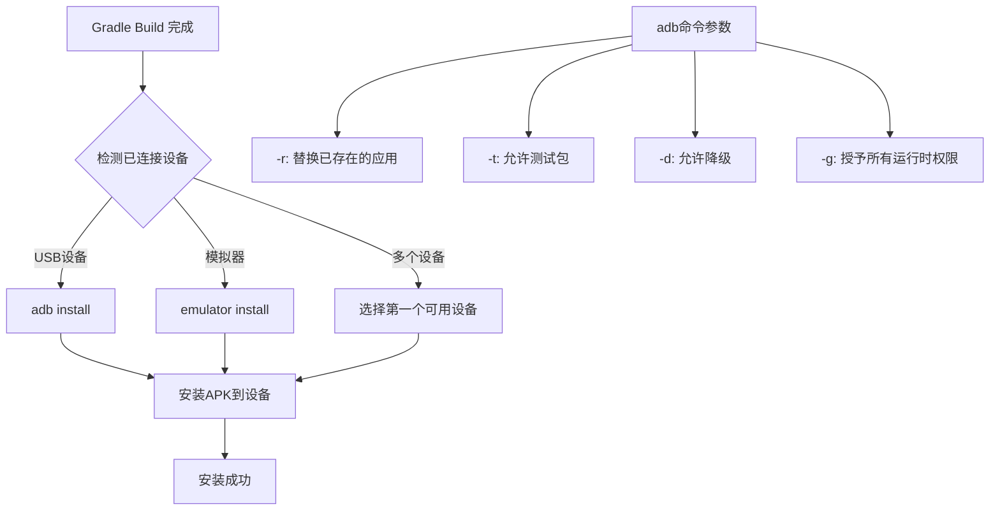
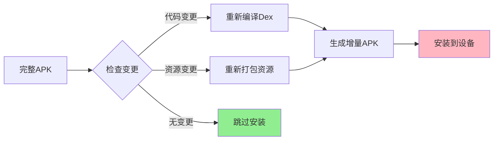
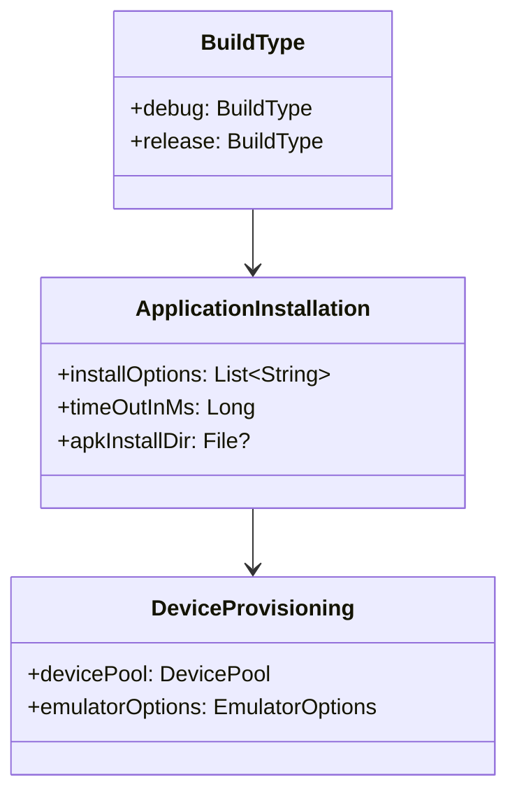

# 21.1.79 应用程序安装

夜风轻轻掀起笔记本的一角，洛芙赶紧用手掌按住。

“黛琳姐，刚才说的ApplicationDefaultConfig好有用哦，”洛芙眼睛亮晶晶的，“那构建类型定下来之后，我们的App到底是怎么样跑到手机上去的呢？”

黛琳微微笑了笑，从背包里又掏出一个黑色的盒子。这是上次从城市里带来的移动硬盘外形的盒子，不过上面多了几个指示灯。

“你这个问题问得正好，”黛琳把盒子放在草地上，“我们今天要讲的内容就和这个‘应用安装’有关——在Gradle构建过程中，App是怎么被安装到设备上去的。”

希尔正把最后一根烤棉花糖吃完，手指上沾满了融化的糖浆。她毫不在意地在T恤上擦了擦，然后把笔记本转过来：“说到安装，我上次调试的时候每次都要手动点安装，烦死了。其实Gradle有很强大的安装配置功能，可以全自动安装还能自动启动Activity。”

“对呀！”伊莎轻轻拨了拨耳边的发丝，“我之前用过一种方法，构建完成后直接就在手机上打开App了，就像魔法一样~”

洛芙好奇地把脖子伸长：“那到底怎么配置嘛？”

黛琳打开了那个“移动硬盘盒子”——实际上是一个安装了开发环境的微型电脑。她接入笔记本，屏幕上出现了Android Studio的项目结构。

“在讲具体配置之前，我先问你一个问题，”黛琳看向洛芙，“你觉得一个App从构建完成到跑在手机上，需要经过哪些步骤？”

洛芙歪着脑袋想了想：“额……先编译成APK？然后……然后通过数据线传到手机上？再……再安装？”

“基本正确，”黛琳点点头，“但具体实现起来有很多细节。Gradle的ApplicationInstallation DSL就是用来控制这些细节的。”

她调出一个代码窗口，开始演示。

---

## 露营现场的Gradle安装配置课

黛琳首先展示了build.gradle文件中的一个片段：

```kotlin
android {
    defaultConfig {
        applicationId "com.example.camping"
        minSdk 24
        targetSdk 34
    }
    
    buildTypes {
        release {
            isMinifyEnabled true
            proguardFiles(getDefaultProguardFile("proguard-android-optimize.txt"), "proguard-rules.pro")
        }
        debug {
            isDebuggable true
            applicationIdSuffix ".debug"
        }
    }
    
    // 这里是 ApplicationInstallation 配置区域
    packaging {
        resources {
            excludes += "/META-INF/{AL2.0,LGPL2.1}"
        }
    }
}
```

“等等，”洛芙指着屏幕说，“这个packaging是安装配置吗？”

“问得好，”黛琳赞许地点头，“packaging是打包配置，但真正的安装配置在别的地方。在Android Gradle Plugin 8.0+中，我们通过DeviceProvisioning和ApplicationInstallation来控制安装行为。”

她切换到一个新的配置块：

```kotlin
android {
    // 应用安装配置
    application {
        // 是否在构建完成后自动安装
        // 这个配置在 DSL 中通过其他方式控制
    }
}
```

“其实直接控制安装的是Gradle的task系统，”希尔插话道，她不知什么时候已经把自己的笔记本也接了上来，“我来给你看个更直接的。”

希尔打开了一个终端窗口，列出了项目中所有的task：

```bash
./gradlew tasks --group=installation
```

屏幕上列出了各种安装相关的task：

```
Installation tasks
-----------------
installDebug - Installs the Debug build
installRelease - Installs the Release build
installDebugAndroidTest - Installs the Test build
uninstallAll - Uninstall all apps
uninstallDebug - Uninstall the Debug build
```

“看到了吗？”希尔兴奋地说，“installDebug就是安装Debug版本的task。这个task背后就是ApplicationInstallation在起作用。”

洛芙凑近屏幕：“那这些task是怎么知道要安装到哪个设备的呢？”

“这就涉及到设备选择的逻辑了，”黛琳解释道，“Gradle会根据连接的设备情况自动选择合适的安装目标。如果有USB连接的手机，就安装到手机；如果有模拟器运行着，就安装到模拟器。”

她在白板上画了一个流程图：



“原来是这样！”洛芙恍然大悟，“那如果我想在安装的时候自动授予所有权限呢？”

黛琳笑着点头：“你问到点子上了。这就是安装配置的一个重要选项——权限授予。”

---

## 自动授予权限的魔法

“在Android 6.0之后，我们需要动态申请运行时权限，”黛琳调出另一段代码，“但在开发调试阶段，每次都要手动点授权很麻烦。”

“所以我们可以让Gradle在安装的时候自动授予所有权限？”洛芙眼睛亮了。

“对，”黛琳把光标移到一段配置上，“在build.gradle中我们可以这样配置：

```kotlin
android {
    defaultConfig {
        // ...
    }
}

// 通过 adb install arguments 配置
android.adbOptions {
    installOptions("-r", "-t", "-g")
}
```

伊莎凑过来看：“'-g'这个参数好厉害的样子~”

“‘-g’的意思就是grant all permissions，”希尔解释道，“在安装APK的时候自动授予所有运行时权限。这样我们就不用每次都在手机上点授权了。”

她现场演示了一下，在终端中输入：

```bash
adb install -r -t -g app/build/outputs/apk/debug/app-debug.apk
```

输出结果显示：

```
Performing Streamed Install
Success
```

“安装成功了，而且所有权限都已经授予，”希尔说，“这就是'-g'参数的神奇之处。”

洛芙若有所思：“那如果在Gradle里配置好了，是不是每次按运行按钮的时候都会自动用这些参数？”

“完全正确，”黛琳点头，“这就是ApplicationInstallation的一个实际应用场景。”

---

## 选择安装目标的智慧

“那如果我想安装到特定的模拟器呢？”洛芙又问，“我有时候开了好几个模拟器，想指定安装到其中一个。”

黛琳和希尔对视一眼，微微一笑。

“这是一个好问题，”黛琳说，“在有多设备的场景下，Gradle提供了几种选择方式。”

她打开了一个新的配置文件：

```kotlin
android {
    // 设备选择配置
    devicePool {
        // 设备池配置，可以定义设备分组
        phones {
            device "phone-1"
            minSdk 24
        }
        tablets {
            device "tablet-1"
            minSdk 26
        }
    }
}

// 或者通过命令行指定
// ./gradlew installDebug -PdeviceId=emulator-5554
```

“实际上，”希尔补充道，“最常用的方法是通过命令行指定设备。你可以用adb devices查看所有连接的设备：

```bash
$ adb devices
List of devices attached
emulator-5554   device
emulator-5556   device
1234567890ABCDEF    device
```

然后用-s参数指定设备：

```bash
adb -s emulator-5554 install app/build/outputs/apk/debug/app-debug.apk
```

洛芙认真地在笔记本上记录着：“所以关键就是设备的serial number……”

“对，”黛琳说，“在Gradle中也可以类似的配置。不过在大多数情况下，Gradle会自动选择第一个可用的设备，这对单设备调试已经足够了。”

---

## Debug和Release的安装差异

伊莎轻轻拉了拉黛琳的衣袖：“那debug版本和release版本在安装上有什么不同呢？”

“这是个好问题，”黛琳调出两种构建类型的对比：

```kotlin
buildTypes {
    debug {
        isDebuggable true        // 可调试
        isMinifyEnabled false   // 不混淆
        applicationIdSuffix ".debug"  // 应用ID后缀
        versionNameSuffix "-debug"
    }
    
    release {
        isDebuggable false       // 不可调试
        isMinifyEnabled true     // 启用混淆
        // 不添加后缀
    }
}
```

“debug版本和release版本在安装时的主要区别是：”

| 特性 | Debug版本 | Release版本 |
|------|-----------|-------------|
| 可调试 | ✓ | ✗ |
| 安装速度 | 较快（未混淆） | 较慢（可能混淆） |
| 应用ID | 带.debug后缀 | 原始ID |
| 签名 | 自动调试签名 | 需要配置签名 |

“debug版本会自动使用调试签名，”希尔补充道，“这个签名是Android SDK自动生成的，默认密钥在~/.android/debug.keystore。”

洛芙好奇地问：“那如果我想安装release版本到手机上测试呢？”

“那就需要配置签名了，”黛琳说，“有两种方式：

1. 使用Android Studio的Signing Config
2. 在build.gradle中手动配置：

```kotlin
android {
    signingConfigs {
        release {
            storeFile file("my-release-key.jks")
            storePassword "password"
            keyAlias "my-key-alias"
            keyPassword "password"
        }
    }
    
    buildTypes {
        release {
            signingConfig signingConfigs.release
        }
    }
}
```

---

## 增量安装的秘诀

夜空中划过一颗流星，洛芙赶紧双手合十许愿。伊莎笑着看她：“许了什么愿呀？”

“希望每次安装都能快一点！”洛芙吐了吐舌头。

希尔笑了起来：“说到安装速度，你刚才许愿的方向对啦！Gradle有个很重要的功能叫增量安装，可以大幅加快安装速度。”

她打开一个配置文件：

```kotlin
android {
    // 增量安装配置
    packaging {
        jniLibs {
            useLegacyPackaging = false
        }
        resources {
            excludes += "/META-INF/{AL2.0,LGPL2.1}"
        }
    }
}
```

“Android Gradle Plugin会自动检测哪些文件发生了变化，”希尔解释道，“如果只有代码变了，资源没变，就只重新打包变化的dex文件，不需要重新安装整个APK。”

“这就叫增量更新，”黛琳补充道，“是ApplicationInstallation背后的一个重要优化。”

她在白板上画出了增量安装的流程：



“如果没有任何变化，Gradle甚至会跳过安装步骤，”黛琳说，“这就是为什么有时候你按运行按钮，它显示'Installation skipped'。”

---

## 模拟器的特殊安装模式

“我发现模拟器安装比真机快好多，”洛芙说，“这是为什么呀？”

希尔把椅子挪近一点：“模拟器用的是不同的安装机制。模拟器直接通过emulator进程安装，跳过了adb的部分开销。”

她列出了一些模拟器专用的安装参数：

```bash
# 模拟器安装加速选项
emulator -avd <avd_name> -no-snapshot-load

# 在Gradle中配置模拟器选项
android {
    testOptions {
        unitTests {
            includeAndroidResources = true
        }
    }
}
```

“其实还有个更有意思的特性，”黛琳说，“模拟器支持Instant Run的快速部署模式。”

她调出Instant Run的配置：

```kotlin
android {
    buildTypes {
        debug {
            // 启用Instant Run
            isInstantRunSupportEnabled = true
        }
    }
}
```

“Instant Run会在首次安装后，后续只推送变化的部分，”黛琳解释道，“比如你只改了一行代码，它只会上传那个修改过的方法，而不是重新安装整个App。”

洛芙惊叹道：“那开发效率岂不是提高很多！”

“对呀，”伊莎微笑着说，“这就是为什么我们总是说'工欲善其事，必先利其器'~”

---

## 安装验证与错误处理

“那如果安装失败了怎么办？”洛芙问到了一个很实际的问题。

黛琳点点头：“安装失败是常见的问题，我们需要知道如何诊断。”

她展示了几个常见的安装错误和解决方法：

```kotlin
// 常见错误1: INSTALL_FAILED_VERSION_DOWNGRADE
// 解决：使用 -d 参数允许降级
adb install -d app.apk

// 常见错误2: INSTALL_FAILED_INSUFFICIENT_STORAGE
// 解决：清理设备存储或使用 -s 参数安装到SD卡

// 常见错误3: INSTALL_PARSE_FAILED_NO_CERTIFICATES
// 解决：检查APK是否正确签名

// 常见错误4: INSTALL_FAILED_ALREADY_EXISTS
// 解决：使用 -r 参数替换已存在的应用
adb install -r app.apk
```

“在Gradle中处理这些错误，”希尔补充道，“我们可以配置retry逻辑：

```kotlin
tasks.withType<Install>().configureEach {
    // 安装失败时重试次数
    maxRetries = 3
    // 重试间隔（毫秒）
    retryDelay.set(org.gradle.util.GradleVersion.current() >= org.gradle.util.GradleVersion.version("8.0") 
        ? 1000 
        : 500)
}
```

---

## 多模块项目的安装策略

露营地的灯光在夜色中显得格外温暖，洛芙打了个哈欠，但眼睛仍然盯着屏幕。

“如果项目里有好几个模块，”洛芙问，“安装配置会不一样吗？”

黛琳赞许地点头：“你问到多模块项目的话题了。在多模块项目中，每个模块都可以有独立的安装配置。”

她展示了一个多模块项目的结构：

```
my-app/
├── app/
│   └── build.gradle
├── library-core/
│   └── build.gradle
├── library-feature/
│   └── build.gradle
└── settings.gradle
```

“在多模块场景下，ApplicationInstallation的配置会应用到主模块，”黛琳解释道，“library模块会作为依赖被包含在主模块的APK中。”

希尔展示了如何为不同模块配置不同的安装行为：

```kotlin
// app/build.gradle
android {
    defaultConfig {
        applicationId "com.example.myapp"
        multiDexEnabled true
    }
}

// library-core 不生成APK，只作为依赖
// library-feature 可以选择生成独立的APK（可选）
```

---

## 自动化测试的安装配置

“对了，”伊莎轻声说，“测试app是怎么安装的呢？”

黛琳拍了拍手：“这也是很重要的话题。”

她展示了测试安装的配置：

```kotlin
android {
    defaultConfig {
        // 测试应用的配置
        testApplicationId = "com.example.myapp.test"
        testInstrumentationRunner = "androidx.test.runner.AndroidJUnitRunner"
    }
}

// 配置测试模块的安装
android.testOptions {
    unitTests {
        includeAndroidResources = true
    }
}
```

“测试应用会作为主应用的另一个进程安装到设备上，”黛琳解释道，“通过instrumentation技术，测试可以监控和控制主应用的行为。”

洛芙似懂非懂地点了点头：“感觉好像很复杂的样子……”

“没关系，”伊莎温柔地说，“我们以后会有专门的章节讲测试~”

---

## 构建变体的安装选择

最后，黛琳展示了一个综合的配置示例，涵盖了所有的安装场景：

```kotlin
android {
    // 基础配置
    defaultConfig {
        applicationId "com.example.camping"
        minSdk 24
        targetSdk 34
        versionCode 1
        versionName "1.0"
    }
    
    // 构建类型
    buildTypes {
        debug {
            isDebuggable = true
            applicationIdSuffix = ".debug"
            versionNameSuffix = "-debug"
        }
        release {
            isMinifyEnabled = true
            proguardFiles(getDefaultProguardFile("proguard-android-optimize.txt"), "proguard-rules.pro")
        }
    }
    
    // 产品风味（维度）
    flavorDimensions += "version"
    productFlavors {
        create("free") {
            dimension = "version"
            applicationIdSuffix = ".free"
            versionNameSuffix = "-free"
        }
        create("paid") {
            dimension = "version"
            applicationIdSuffix = ".paid"
            versionNameSuffix = "-paid"
        }
    }
}

// 安装选项配置
android.adbOptions {
    installOptions += listOf("-r", "-t", "-g")
    timeOutInMs = 120000  // 2分钟超时
}
```

“有了这些配置，”黛琳总结道，“Gradle会自动生成对应的安装task：

- installFreeDebug
- installFreeRelease
- installPaidDebug
- installPaidRelease

每个变体都可以独立安装和测试。”

---

洛芙长长地呼出一口气，看着星空：“原来安装一个App有这么多门道啊……”

“是呀，”黛琳收拾着东西，“不过对于日常开发来说，大部分配置都有默认值，我们只需要了解关键的选项就好了。”

伊莎把热可可递给大家：“技术总是这样嘛，看起来复杂的东西，背后都是有逻辑的~”

夜风轻拂，炭火的温度刚刚好。女孩们收拾好笔记本，准备休息了。

---

## 专业技术总结

> 本章核心机制：ApplicationInstallation 是 Android Gradle Plugin 提供的 DSL，用于配置应用在构建过程中的安装行为。通过它，开发者可以控制安装参数、设备选择、权限授予等细节。

#### 结构图



#### 反模式与陷阱

1. **在release构建中忘记禁用debuggable** - 调试标志会拖慢性能并带来安全风险
2. **安装超时设置过短** - 大APK在慢速设备上可能安装失败
3. **多设备环境下未指定设备** - 可能安装到错误的设备导致测试无效
4. **忽略增量安装的价值** - 每次全量安装浪费时间
5. **release版本未配置签名** - 无法安装到真机测试

#### 设计哲学

- **自动化优先**：让Gradle自动处理设备选择和安装逻辑
- **增量更新**：避免不必要的完整安装
- **开发体验**：通过-installOptions简化日常调试流程
- **多变体支持**：为不同场景生成独立的安装task

#### 动手练习

**目标**：掌握Android应用的安装配置，能够根据不同场景选择合适的安装方式。

**Task 1：配置基础安装选项**
- 目标：在项目中配置adb install参数，实现自动权限授予
- 操作：在app/build.gradle的android块中添加adbOptions配置，添加"-r", "-t", "-g"参数
- 验收标准：运行./gradlew installDebug后，查看log确认使用-g参数
- 提示代码：
```kotlin
android.adbOptions {
    installOptions += listOf("-r", "-t", "-g")
}
```

**Task 2：配置多设备安装**
- 目标：学习在多设备环境下选择特定设备
- 操作：使用adb devices查看设备列表，修改install task选择特定设备
- 验收标准：能够成功安装到指定的设备或模拟器
- 提示：使用 -PtargetDeviceId=emulator-5554 参数

**Task 3：配置release签名安装**
- 目标：能够将release版本安装到真机测试
- 操作：创建签名配置，配置release构建类型使用签名
- 验收标准：生成带签名的release APK并成功安装到真机
- 提示：需要配置keystore信息

**Task 4：理解增量安装机制**
- 目标：观察Gradle的增量安装行为
- 操作：修改少量代码后重新运行install task，观察安装时间变化
- 验收标准：能够说出增量安装与完整安装的区别

**Task 5：配置测试环境安装**
- 目标：配置instrumentation测试的安装
- 操作：在build.gradle中配置testApplicationId和testInstrumentationRunner
- 验收标准：能够运行androidTest并观察测试应用的安装

#### 面试热身

Q1: 请解释Android Gradle Plugin中的ApplicationInstallation是什么？它主要控制哪些安装行为？

Q2: 在开发过程中，如何加快App的安装速度？请说出至少两种方法。

Q3: 如果遇到INSTALL_FAILED_INSUFFICIENT_STORAGE错误，应该如何解决？

Q4: 请解释-debug和-release构建类型在安装时的主要区别。

Q5: 在多设备调试场景下，如何确保App安装到正确的设备上？

#### 参考实现要点

1. 优先使用debug构建进行日常开发，利用增量安装提高效率
2. 合理配置installOptions，对于调试阶段建议添加"-g"自动授予权限
3. release构建前务必配置正确的签名
4. 使用adb devices了解当前连接设备状态
5. 利用Gradle的task日志观察安装过程，学习背后的机制

---

> 学习建议：ApplicationInstallation是日常开发中使用频率很高的配置。建议先从最简单的adbOptions配置开始练习，逐步理解背后的安装机制。在实际项目中，可以根据团队需求调整安装超时和重试策略。

---

## 洛芙的小小日记本

今天学到了好多！原来点一下"Run"按钮背后有这么多讲究——安装参数、设备选择、增量更新……黛琳说先了解关键的选项就够了，但我觉得每个都想试试看！明天去试试给模拟器装一个带签名的release版本看看~

---

## 今日关键词

- **ApplicationInstallation**：Android Gradle Plugin的DSL，用于配置应用安装行为
- **adbOptions**：build.gradle中配置adb安装参数的闭包
- **installOptions**：传递给adb install命令的参数列表
- **增量安装**：只安装变化部分的安装方式，提高效率
- **DeviceProvisioning**：设备配置相关DSL
- **Build Variant**：构建变体，debug/release与flavor的组合
- **签名配置**：signingConfigs用于配置APK签名信息
- **Instrumentation Testing**：Android测试框架，通过instrumentation运行
- **Instant Run**：快速部署技术，只推送代码变化
- **多模块安装**：多模块项目中主模块作为入口，library作为依赖
