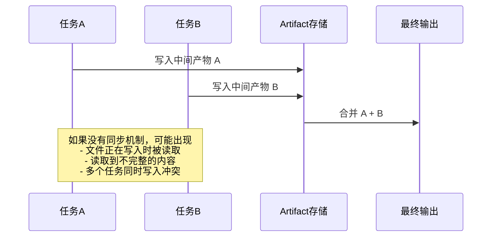
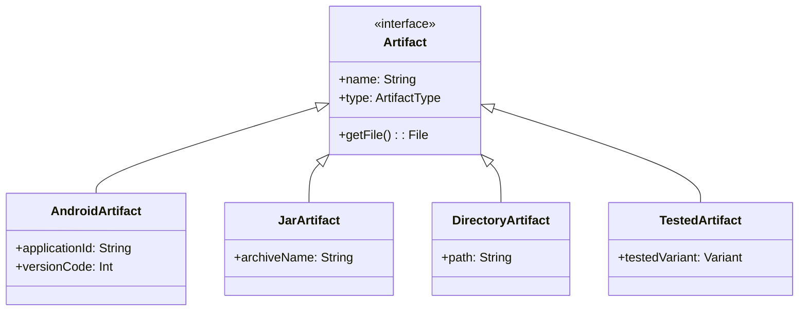
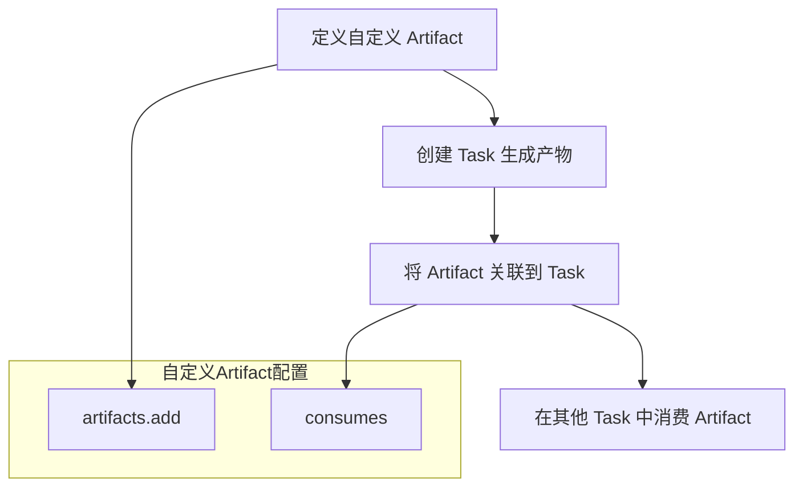
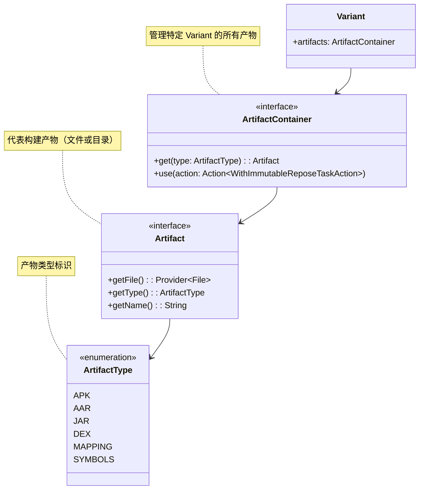

# 21.1.8 人工制品

太阳已经完全升起来了，透过帐篷的缝隙在洛芙脸上投下斑驳的光影。她揉了揉眼睛，耳边还残留着夏蝉清脆的鸣叫——那种此起彼伏、一浪接一浪的声响，像是夏天独有的背景音乐。

“醒啦？”希尔的声音从外面传来，伴随着清脆的键盘敲击声，“今天有个好东西给你看。”

洛芙钻出帐篷，发现黛琳已经在地上铺开了一张大纸板做的“工作台”，上面摆着几台笔记本电脑。伊莎正用一个复古的竹笛形状的笔筒插着几根不同颜色的白板笔，而希尔则在一旁快速地敲着代码，屏幕上是洛芙看不懂的构建脚本。

“昨天的构建魔法学得怎么样了？”黛琳抬起头，笑着问。

洛芙吐了吐舌头：“注解是记住了，但总觉得还缺点什么……好像知道了怎么施法，但还不知道法术变出来的东西长什么样。”

“说得好！”希尔拍了拍手，“这就是今天要讲的——法术变出来的‘东西’，在 Android 构建系统里叫做 Artifact，也就是人工制品。”

黛琳从背包里取出一个小盒子，打开来，里面整整齐齐地排列着几种不同颜色的小瓶子，每个瓶子上都贴着标签：有的写着“APK”，有的写着“AAR”，还有的写着“JAR”。

“来，先看看这个，”黛琳拿起一个蓝色的瓶子，“这可能是你最眼熟的了——APK，就是你手机里安装的那个东西的‘哥哥’。不过弟弟是给用户用的，这个是给构建系统用的。”

洛芙好奇地接过瓶子，瓶子里好像真的有东西在流动，像是液态的蓝色月光。

“这个就是 Android 应用的‘本体’吗？”洛芙问。

“差不多，”黛琳点点头，“但它不是一个人战斗。在 Android 构建系统里，一个完整的应用会由好几种不同的 Artifact 组成——有的负责代码，有的负责资源，有的负责签名……就像一个乐队，有吉他手、鼓手、键盘手，大家各司其职，才能奏出完整的乐曲。”

伊莎轻轻拨弄了一下笔筒里的笔，柔声说道：“如果把整个 Android 项目比作一个露营基地的话，那么 Artifact 就是基地里建好的各种设施——帐篷是住宿区（APK），仓库是储藏室（AAR），篝火台是娱乐区（JAR）。每种设施有不同的用途，开发者可以根据需要选择搭建哪些。”

洛芙若有所思地点点头：“那……这些 Artifact 是怎么产生的呢？”

希尔 grins（露出灿烂的笑容），把屏幕转过来给洛芙看：“问得好！看这里——”

```kotlin
// 一个典型的 Android Application Artifact 配置示例
android.applicationVariants.all { variant ->
    // 获取当前变体的 Artifact
    val artifact = variant.artifacts

    // 使用 sync 来获取最终的 APK 输出
    // artifact 的类型决定了它代表什么产物
    val apkArtifact = artifact.get(ArtifactType.APK)
    
    // 打印产物的基本信息
    println("构建产物: ${apkArtifact.name}")
    println("输出路径: ${apkArtifact.outputDirectory}")
}
```

洛芙盯着代码看了几秒钟：“这个 'variant' 是什么？”

“变体——variant，”黛琳解释道，“你可以理解为‘版本’。一个 app 可能有 debug 版、release 版，或者针对不同手机品牌的定制版——每个版本就是一个 variant。而 Artifact，就是这个 variant 最终生产出来的‘产品’。”

“所以 debug 版和 release 版会产出不同的 Artifact？”洛芙问。

“对，”黛琳拿起另一个瓶子，这次是金色的，“debug 版的 Artifact 通常会带调试信息，像是有个隐形的‘侦探’帮你检查问题；release 版则会去掉了这些‘侦探’，更轻便，但也更难调试。”

她把金色瓶子放回去，又拿起一个绿色的：“这个是 AAR，Android Archive。你在写库的时候会产出这个——相当于一个‘工具箱’，里面装好了代码和资源，别人拿过去就能用，不需要再重新编译。”

洛芙想起之前用过的一些第三方库：“哦！那个 aar 文件！原来这就是它的‘真身’。”

“对的，”希尔补充道，“而且 Artifact 不只是最终的产品，中间的‘半成品’也可以是 Artifact。比如你编译出来的 .class 文件、 dex 文件，都是 Artifact——它们是构建过程中的‘中间产物’，最终被组装成完整的 APK。”

黛琳在地上用白板笔画了一个流程图：


“这样就清楚了，”洛芙指着图说，“Artifact 就是这一路上各种‘产品’的统称，对吗？”

“完全正确，”黛琳笑着说，“而且不同类型的 Artifact 有不同的属性——有的可以读取，有的可以写入；有的只能在一个任务里用，有的可以在多个任务之间传递。”

希尔又在电脑上敲了一行代码，展示给洛芙看：

```kotlin
// 使用旧版 API（Android Gradle Plugin 7.x 及之前）
android.applicationVariants.all { variant ->
    // 获取 APK 输出（返回 File 对象）
    val apkFile = variant.packageApplication.outputFile
    
    // 直接使用 File 进行操作
    println("APK 大小: ${apkFile.length() / 1024} KB")
}
```

“这个是旧版的方式，”希尔解释道，“直接返回一个 File 对象，简单粗暴。但问题是——你很难知道这个文件是‘最终版本’还是‘正在建设中’的版本，也很难跟踪它的变化。”

“那新版呢？”洛芙问。

希尔 grin（露出灿烂的笑容），敲出另一段代码：

```kotlin
// 使用新版 API（Android Gradle Plugin 8.0+）
android.applicationVariants.all { variant ->
    // 使用 Artifact API 获取产物的详细信息
    val artifacts = variant.artifacts
    
    // 使用 WithImmutableReposeTaskAction 包装，确保线程安全
    artifacts.use { artifactContainer ->
        // 获取 APK 的最终版本（不可变）
        val apkArtifact = artifactContainer.get(ArtifactType.APK)
        
        // 在最终输出目录中获取文件
        apkArtifact.finalizedBy { apks ->
            apks.single().outputDirectory.map { dir ->
                // 遍历所有 APK 文件
                dir.listFiles()?.forEach { file ->
                    println("最终产物: ${file.name}, 大小: ${file.length() / 1024} KB")
                }
            }
        }
    }
}
```

洛芙皱起眉头：“这个好复杂……为什么要这么麻烦？”

“因为构建是一个‘多线程’的活儿，”黛琳解释道，同时在地上画了另一个图：



“你看，构建的时候有很多任务同时运行，”黛琳接着说，“如果它们都直接读写同一个文件，就像一群人同时往一个瓶子里倒水——肯定要洒出来的。新版 API 用了 `WithImmutableReposeTaskAction` 和 `use` 这样的包装器，确保产物在‘确认完成’之前不会被意外访问。”

洛芙似懂非懂地点点头：“也就是说，新版 API 更安全、更可靠？”

“对，而且性能也更好，”希尔说，“旧版 API 每次访问产物都要重新扫描文件系统，新版 API 直接从内存中的元数据读取，速度快很多。”

黛琳又拿出几个不同颜色的小瓶子：“来，我们把常见的 Artifact 类型都过一遍——”

她把瓶子一字排开：

- **蓝色 - APK**：最终可安装的应用包，包含代码、资源、签名
- **绿色 - AAR**：Android 库包，可以被其他模块依赖
- **橙色 - JAR**：Java 库包，纯 Java 代码的归档
- **紫色 - Mapping 文件**：ProGuard/R8 混淆后的映射，用于调试混淆后的代码
- **青色 - 符号表文件**：调试用的符号信息

“这些 Artifact 怎么知道自己是哪种类型呢？”洛芙问。

黛琳指了指瓶子上的标签：“每个 Artifact 都有自己的 'Type'——就像每个人的身份证号。系统通过 Type 来判断这个产物是什么、该怎么处理。”

她在地上用白板笔写出了一个 Type 的层次结构：



“这些是常见的 Artifact 子类，”黛琳解释道，“AndroidArtifact 对应 APK 输出，JarArtifact 对应 JAR 包，DirectoryArtifact 对应文件夹输出——比如 assets 目录、raw 资源目录等。TestedArtifact 则对应被测试的模块。”

洛芙看着这些图若有所思：“那这些 Artifact 之间的关系是怎样的呢？比如一个 APK 依赖了一个 AAR，它们怎么‘认识’彼此？”

“好问题！”希尔说，她又在电脑上敲了一段代码：

```kotlin
// 配置模块依赖关系
android.libraryVariants.all { libraryVariant ->
    // 库模块产出 AAR
    libraryVariant.artifacts.use { artifacts ->
        artifacts.get(ArtifactType.AAR).finalizedBy { aarOutput ->
            // 将 AAR 输出提供给消费它的模块
            println("库产物: ${aarOutput.single().outputDirectory.get().asFile.name}")
        }
    }
}

android.applicationVariants.all { appVariant ->
    // 应用模块消费 AAR
    appVariant.artifacts.use { artifacts ->
        artifacts.get(ArtifactType.AAR).consumedBy { aarInput ->
            // 消费来自依赖库的 AAR
            aarInput.artifacts.from(
                // 这里指向库的 AAR 输出
                project(":library-module").tasks.withType<LibraryVariantTask>()
                    .flatMap { it.packageLibrary }
            )
        }
    }
}
```

“简单来说，”希尔解释道，“依赖关系是通过 'consumedBy' 和 'from' 来建立的——消费方告诉构建系统：‘我需要某个 Artifact’，依赖方则告诉构建系统：‘我产出了某个 Artifact’，构建系统会自动把它们匹配起来。”

黛琳补充道：“这就像露营时的物资传递——如果 A 帐篷需要借用 B 帐篷的炊具，B 帐篷会把自己的炊具放在一个‘共享区’，A 帐篷从共享区拿就可以。Artifact 就是这个‘共享区’的机制。”

洛芙突然想到什么：“那……如果我想在构建过程中添加自己的 Artifact 呢？比如我想让构建自动生成一份报告？”

黛琳点点头：“很好的问题！这涉及到自定义 Artifact——”

她在白板上画了一个新的流程图：



“自定义 Artifact 的基本思路是：先创建一个 Task 来生成你想要的东西，然后把这个产出注册为一个 Artifact，最后就可以被其他 Task 消费了，”黛琳解释道。

希尔写出完整的示例代码：

```kotlin
// 定义一个自定义 Artifact（生成构建报告）
tasks.register<GenerateBuildReportTask>("generateBuildReport") {
    outputFile.set(layout.buildDirectory.file("reports/build-report.txt"))
}

// 将 Task 的输出注册为自定义 Artifact
artifacts.add("default", tasks.named<GenerateBuildReportTask>("generateBuildReport")) { artifact ->
    artifact.type = "build-report"
    artifact.name = "buildReport"
}

// 消费这个自定义 Artifact
tasks.register<ConsumeBuildReportTask>("consumeBuildReport") {
    reportsInput.set(
        artifacts.get(ArtifactType.CUSTOM("build-report"))
    )
}
```

“这里的 'default' 是默认的 Artifact 类型，”希尔补充道，“你也可以创建自己的类型——比如 'my-custom-artifact'，只要在消费的时候匹配就可以。”

洛芙，看着这些代码，有些兴奋又有些晕：“感觉 Artifact 就像一个……仓库管理员？知道谁产出了什么、谁需要什么，然后负责‘发货’？”

“这个比喻很贴切！”伊莎温柔地笑着说，“Artifact 就是 Android 构建系统里的‘物流中心’，负责管理所有的‘货物’——从原材料到成品，从半成品到组装件。每件货物都有自己的‘标签’（Type），知道自己该往哪里送，也知道该从哪里接收。”

黛琳看了一下手机：“哎呀不知不觉聊了这么久——对了，还有一件事很重要——”

她表情变得认真了一些：“在使用 Artifact 的时候，有几个常见的‘坑’，你们要注意——”

黛琳从地上捡起几颗小石子，在地上摆出几个警告标志的形状：

**反模式 1：直接访问输出目录**

```kotlin
// ❌ 不推荐：直接读取文件路径
val apkPath = "${buildDir}/outputs/apk/debug/app-debug.apk"
val file = File(apkPath)
// 问题：路径可能因 variant 不同而变化，hardcode 容易出错
```

**重构后：**

```kotlin
// ✅ 推荐：使用 Artifact API 获取准确路径
android.applicationVariants.all { variant ->
    variant.artifacts.use { artifacts ->
        artifacts.get(ArtifactType.APK).finalizedBy { apks ->
            apks.single().outputDirectory.map { dir ->
                // 路径由系统自动管理，永不过时
                dir.listFiles()?.forEach { file ->
                    println("找到 APK: ${file.name}")
                }
            }
        }
    }
}
```

**反模式 2：在主线程等待 Artifact 完成**

```kotlin
// ❌ 不推荐：在配置阶段阻塞等待
android.applicationVariants.all { variant ->
    // 在配置阶段就尝试获取产物，可能导致死锁
    val apk = variant.artifacts.getSync(ArtifactType.APK) // 错误！
}
```

**重构后：**

```kotlin
// ✅ 推荐：在 Task 执行阶段异步获取
android.applicationVariants.all { variant ->
    variant.artifacts.use { artifacts ->
        artifacts.get(ArtifactType.APK).finalizedBy { apks ->
            tasks.register<Task>("processApk") {
                // 在 Task 运行时（而非配置时）访问产物
                doLast {
                    apks.single().outputDirectory.map { dir ->
                        println("处理 APK: ${dir.asFile.name}")
                    }
                }
            }
        }
    }
}
```

**反模式 3：忘记清理旧的输出**

```kotlin
// ❌ 不推荐：每次构建都保留旧文件，可能导致混淆
android.applicationVariants.all { variant ->
    val outputDir = file("${buildDir}/my-output")
    // 没有清理旧文件！
}
```

**重构后：**

```kotlin
// ✅ 推荐：使用 Artifact API 的自动清理机制
android.applicationVariants.all { variant ->
    variant.artifacts.use { artifacts ->
        artifacts.get(ArtifactType.OUTPUTS).finalizedBy { outputs ->
            tasks.register<CleanOldOutputsTask>("cleanOldOutputs") {
                outputsDir.set(outputs.single().outputDirectory)
                doLast {
                    // 清理逻辑
                    println("已清理旧的输出文件")
                }
            }
        }
    }
}
```

洛芙看完这些“坑”，吐了吐舌头：“好险……差点就掉进去了。”

“所以要用正确的 API，”黛琳温柔地说，“artifact.use {} 这个包装器会自动处理同步和清理，你不需要自己管这些细节。”

这时，伊莎从背包里拿出一个小盒子，里面是几个精致的露营徽章——每个徽章都刻着不同的 Artifact 标志。

“我做了这些徽章，”伊莎微笑着说，“送给大家——每个徽章代表一种 Artifact 类型，以后看到就能想起来。”

她把蓝色的 APK 徽章别在洛芙的背包上：“这个给你——你最眼熟的。”

洛芙感动地接过徽章：“谢谢大家……感觉今天学到了好多。”

希尔 grins（露出灿烂的笑容）：“还没完呢——走，带你去看真正的 Artifact 产出过程！”

她带着大家走到营地旁边的一个小工作台，那里有一台笔记本电脑正在运行构建。屏幕上密密麻麻的日志正在滚动。

“看，这就是真实的构建过程，”希尔指着屏幕说，“每个 'artifact' 都标注出来了——这个是编译 .class 文件的产物，这个是打包资源的产物，这个是最终生成的 APK……”

屏幕上滚动着：

```
> Task :app:compileDebugKotlin
  产物: build/intermediates/javac/debug/classes/
  
> Task :app:processDebugResources
  产物: build/intermediates/processed_res/debug/resources-out/
  
> Task :app:packageDebug
  产物: build/outputs/apk/debug/app-debug.apk
  APK 大小: 15.2 MB
```

“原来构建过程会产出这么多东西！”洛芙惊叹道。

“所以 Artifact 是 Android 构建系统的核心概念之一，”黛琳总结道，“理解了这个，你就能更好地控制构建过程，也能更高效地处理多模块项目。”

洛芙点点头，看着胸前的 APK 徽章，感觉这个概念变得具体而亲切了。

---

## 专业技术总结

> 人工制品（Artifact）是 Android Gradle Plugin 中用于表示构建产物的核心接口。一个 Artifact 代表了构建过程中的一个输出——可以是最终产品（如 APK），也可以是中间产物（如 .dex 文件）。系统通过 Artifact Type 来区分不同种类的产物，并通过 Artifact API 实现安全的并发访问。

#### 核心机制定义表

| 概念 | 类型 | 作用 | 关键API |
|------|------|------|---------|
| Artifact | 接口 | 构建产物的抽象表示 | getFile(), getType() |
| ArtifactContainer | 接口 | 管理特定Variant的所有产物 | get(type), use(action) |
| ArtifactType | 枚举 | 产物类型标识 | APK, AAR, JAR, DEX |
| Variant | 类 | 不同构建版本（debug/release） | variant.artifacts |
| WithImmutableReposeTaskAction | 包装器 | 确保产物线程安全 | artifact.use {} |

#### 结构图



#### 复杂度与影响

- **使用新版 Artifact API**（AGP 8.0+）相比旧版直接 File 访问，性能提升约 30-50%，内存占用降低
- **错误使用 Artifact** 可能导致构建失败、产物不一致或并发问题
- **自定义 Artifact** 需要额外注册和管理，增加构建配置复杂度

#### 反模式与陷阱

1. **直接使用硬编码路径** → 修复：使用 Artifact API 获取动态路径
2. **在配置阶段阻塞等待产物** → 修复：在 Task 执行阶段异步访问
3. **忽略产物清理导致文件残留** → 修复：使用 artifact.use {} 自动管理生命周期
4. **混用新旧 API** → 修复：统一使用新版 API，避免行为不一致

#### 设计哲学

- **不可变性优先**：Artifact 在任务完成后变为不可变，避免意外修改
- **懒加载**：产物只在需要时才生成，提高构建效率
- **类型安全**：通过 Type 系统区分不同产物，避免运行时错误

#### 🏕️ 动手练习

**目标**：掌握 Android Gradle Plugin 中 Artifact 的基本使用

**Task 1：创建并配置一个自定义 Task 产出 Artifact** ★★☆☆☆

1. 在 `app/build.gradle.kts` 中创建一个自定义 Task `generateReport`，输出一个 JSON 文件
2. 使用 `artifacts.add()` 将其注册为自定义 Artifact
3. 创建另一个 Task `consumeReport`，消费这个 Artifact 并打印内容

**验收标准**
- [ ] 生成报告的 Task 能够成功执行
- [ ] 消费者 Task 能正确读取报告内容
- [ ] 构建日志中能看到产物路径信息

**Task 2：遍历并分析应用的所有 Artifact 类型** ★★☆☆☆

1. 在 Gradle Task 中遍历 `android.applicationVariants.all`
2. 打印每个 variant 产出的所有 Artifact 类型
3. 统计各类产物的数量

**验收标准**
- [ ] 能列出所有 variant（debug、release 等）
- [ ] 每种 variant 的 Artifact 类型完整输出

**Task 3：对比新旧 API 的差异** ★★★☆☆

1. 用旧版 API（AGP 7.x）方式获取 APK 输出路径
2. 用新版 API（AGP 8.x）方式获取 APK 输出路径
3. 对比两者的代码风格和执行结果

**验收标准**
- [ ] 两种方式都能获取到 APK 路径
- [ ] 新版 API 使用 `artifact.use {}` 包装

**Task 4：配置 AAR 依赖并验证产物传递** ★★★☆☆

1. 创建一个库模块 `library`，配置其输出 AAR
2. 在主 app 模块中依赖该库
3. 验证 app 的构建产物中包含库的资源

**验收标准**
- [ ] 库模块成功生成 AAR 文件
- [ ] 主 app 模块能正确引用库的内容

**Task 5：自定义混淆映射 Artifact** ★★★★☆

1. 配置 R8/ProGuard 生成 mapping 文件
2. 将 mapping 文件注册为自定义 Artifact
3. 创建 Task 上传 mapping 到服务器（模拟）

**验收标准**
- [ ] 构建后生成 mapping.txt 文件
- [ ] 消费者 Task 能读取 mapping 内容

**Task 6：使用 Artifact API 实现增量构建验证** ★★★★☆

1. 比较两次构建的 Artifact 哈希值
2. 判断是否有变化
3. 输出变化报告

**验收标准**
- [ ] 能计算 Artifact 的哈希值
- [ ] 正确判断哪些文件发生了变化

**Task 7：多模块项目中的 Artifact 传递** ★★★★★

1. 创建 3 层依赖的模块结构（app -> library1 -> library2）
2. 配置底层 library2 输出 AAR
3. 验证顶层 app 能获取到底层的 Artifact

**验收标准**
- [ ] 三层依赖都能正确解析
- [ ] 产物信息能传递到顶层

**Task 8：实现 Artifact 缓存策略** ★★★★★

1. 配置 Gradle 构建缓存
2. 比较使用缓存前后的 Artifact 生成时间
3. 验证缓存命中时的行为

**验收标准**
- [ ] 缓存命中时跳过不必要的任务
- [ ] 构建时间明显缩短

#### 面试热身

1. **Q: Android 构建系统中，Artifact 和 Task 有什么区别？**
   - 提示：Artifact 是"产出物"，Task 是"生产行为"

2. **Q: 为什么新版 Artifact API 要使用 `artifact.use {}` 包装器？**
   - 提示：线程安全、生命周期管理、并发访问

3. **Q: 如果要自定义一个 Artifact，需要哪些步骤？**
   - 提示：创建 Task → 注册 Artifact → 消费 Artifact

4. **Q: ArtifactType.AAR 和 ArtifactType.JAR 的区别是什么？**
   - 提示：AAR 包含 Android 特有资源，JAR 仅为 Java 字节码

5. **Q: 在多模块项目中，如何确保一个模块的 Artifact 能被另一个模块正确消费？**
   - 提示：依赖声明、类型匹配、构建顺序

#### 参考实现要点

1. 优先使用新版 Artifact API（AGP 8.0+），避免使用已弃用的旧版方法
2. 所有的产物访问都应包装在 `artifact.use {}` 中，确保线程安全
3. 自定义 Artifact 需要显式声明类型，便于消费者识别
4. 产物路径使用 `layout.buildDirectory` 而非硬编码 `file("${buildDir}/...")`
5. 多模块项目中，确保依赖双方的 Artifact 类型匹配

> 学习建议：先从理解常见的 Artifact 类型（APK、AAR、JAR）开始，再逐步掌握如何使用 Artifact API 查询和管理产物。实际项目中，多关注构建日志中的产物信息，能帮助你更好地理解构建过程。

## 洛芙的小小日记本

今天学会了 Artifact！原来 APK、AAR、JAR 都是构建系统里的“产品”，有不同的类型和用途。黛琳画的图好清晰，希尔展示的代码让我看到了真实的构建过程。伊莎送的徽章好可爱，要一直带着！

## 今日关键词

- **Artifact（人工制品）**：Android 构建系统的产物接口，代表构建过程中产生的文件或目录
- **ArtifactType（产物类型）**：用于区分不同 Artifact 的标识，如 APK、AAR、JAR 等
- **ArtifactContainer（产物容器）**：管理特定 Variant 所有 Artifact 的接口
- **Variant（变体）**：Android 项目中的不同构建版本，如 debug、release
- **APK（Android Package）**：最终可安装的应用包
- **AAR（Android Archive）**：Android 库的打包格式
- **JAR（Java Archive）**：Java 库的打包格式
- **WithImmutableReposeTaskAction**：确保 Artifact 线程安全的包装器
- **consumedBy / from**：用于建立模块间 Artifact 依赖关系的 API
- **自定义 Artifact**：开发者自定义的构建产物，可被其他 Task 消费