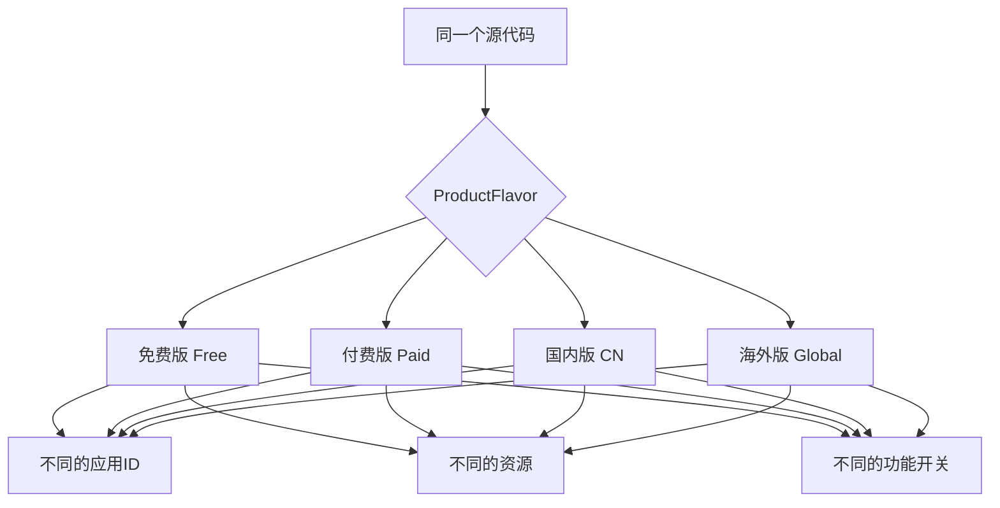
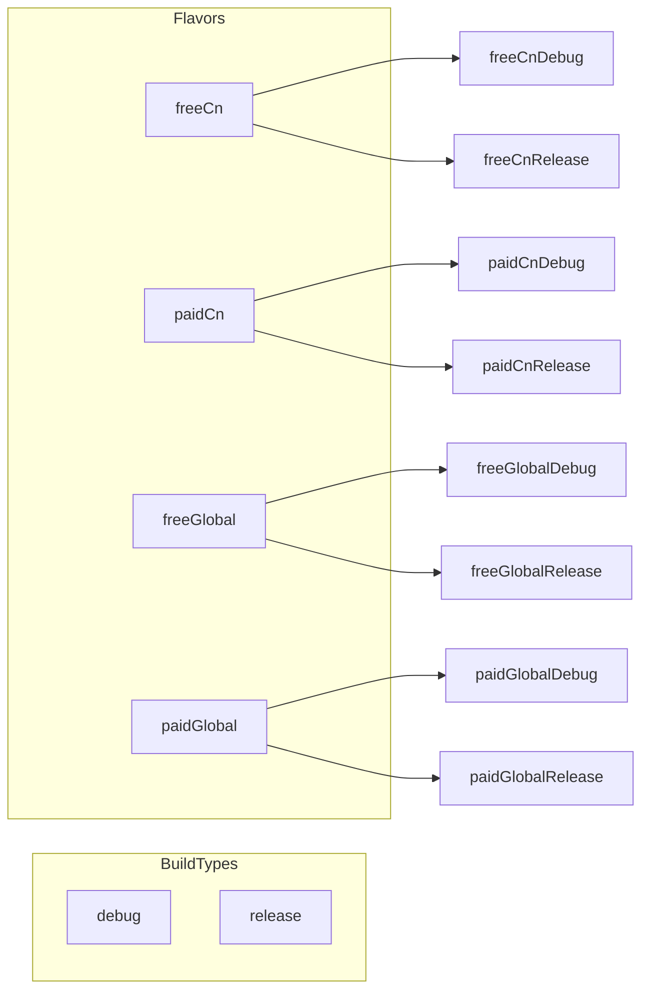
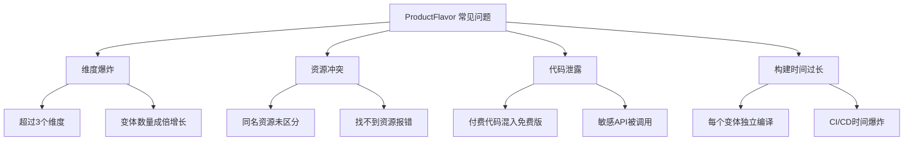
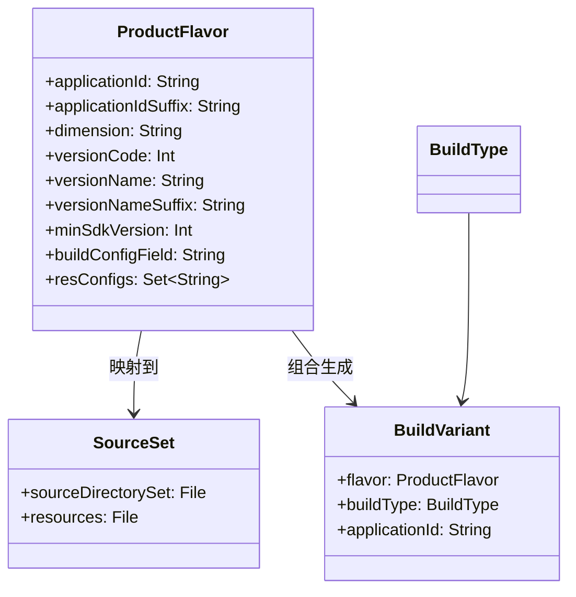

# 21.1.80 应用产品风味

炭火发出轻微的噼啪声，洛芙趴在草地上，双手撑着脸颊，眼睛盯着黛琳的笔记本屏幕。

“刚才那个flavor的代码例子好好玩，”洛芙说，“free和paid两种版本，还可以有不同的applicationId后缀……那是不是说，我们可以同时装两个版本的App到手机上？”

黛琳微微点头：“你问到最核心的问题了。这就是ProductFlavor——产品风味的魔法。”

“从名字上就好浪漫呀，”伊莎轻声说，“产品风味……就像露营的时候，我们可以准备不同口味的料理一样~”

希尔正在把玩着一根细长的草茎，闻言抬起头：“产品风味这个翻译确实很妙。官方文档叫ProductFlavor，直译是‘产品风味'，但我觉得它更像是给同一个App做出不同的'口味'——可以是免费版、付费版，也可以是面向不同渠道、不同用户的版本。”

洛芙来了精神，翻身坐起来：“那具体要怎么配置嘛？我刚才看代码里只是写了flavorDimensions和productFlavors，里面好像有好多属性可以设。”

“对，”黛琳调出详细的配置代码，“我们今天就深入讲讲ProductFlavor的方方面面。”

---

## 为什么需要产品风味

黛琳先在白板上画了一个简单的示意图：



“你想象一下，”黛琳解释道，“你开发了一个露营App，需要同时发布到应用商店和给企业内部使用。应用商店版需要展示广告、要有付费功能；企业内部版不需要广告、要有特殊的内部功能。”

洛芙举手：“我知道！可以建两个项目！”

“也可以，”希尔笑着摇头，“但那样代码就要维护两份了，很麻烦。用ProductFlavor的话，你只需要维护一套代码，通过配置来区分不同的版本。”

伊莎托着腮帮子：“就像用不同的调味料做同一道菜~”

“对！”黛琳笑了，“这就是'风味'的含义。同样的食材（源代码），不同的调味料（Flavor配置），做出不同口味的菜（App版本）。”

---

## 第一个ProductFlavor实战

黛琳打开代码编辑器，开始写第一个示例：

```kotlin
android {
    // 定义风味维度
    // Flavor dimension 就像是对风味进行分类的维度
    // 可以有多个维度，比如 "version" + "distribution"
    flavorDimensions += "version"
    
    productFlavors {
        // 创建免费版风味
        create("free") {
            dimension = "version"
            // 免费版的应用ID后缀
            applicationIdSuffix = ".free"
            // 免费版的版本名后缀
            versionNameSuffix = "-free"
            // 免费版不付费，所以功能受限
            // 这里的 buildConfigField 可以在代码中读取
            buildConfigField("Boolean", "IS_PREMIUM", "false")
            buildConfigField("String", "API_BASE_URL", "\"https://api.free.example.com\"")
        }
        
        // 创建付费版风味
        create("paid") {
            dimension = "version"
            applicationIdSuffix = ".paid"
            versionNameSuffix = "-paid"
            // 付费版是高级版本
            buildConfigField("Boolean", "IS_PREMIUM", "true")
            buildConfigField("String", "API_BASE_URL", "\"https://api.paid.example.com\"")
        }
    }
}
```

洛芙认真地看着代码：“这个dimension是什么呀？一定要写吗？”

“问得好，”黛琳点点头，“在Android Gradle Plugin 3.0+中，flavorDimensions是必须的。你可以把它理解成风味的'分类维度'。”

她切换到另一个更复杂的例子：

```kotlin
android {
    // 多个维度 - 更复杂的场景
    flavorDimensions += "version"
    flavorDimensions += "distribution"
    
    productFlavors {
        // 组合维度：免费 + Google Play渠道
        create("freeGoogle") {
            dimension = "version"
            applicationIdSuffix = ".free"
            
            // 第二个维度
            dimension = "distribution"  // 这样会覆盖上面的dimension！
        }
    }
}
```

“等等！”希尔突然出声，“这样写是有问题的！”

黛琳笑着看向希尔：“你说说看？”

“在同一个flavor block里，dimension只能设置一次，”希尔快速说道，“如果要多个维度，应该用这样的写法：”

```kotlin
android {
    // 正确的多维度写法
    flavorDimensions += "version"
    flavorDimensions += "distribution"
    
    productFlavors {
        // 方法1：每个flavor指定属于哪个维度
        create("free") {
            dimension "version"
            // 属于 version 维度
        }
        
        create("google") {
            dimension "distribution"
            // 属于 distribution 维度
        }
        
        // 方法2：使用命名约定 (维度1维度2)
        // freeGoogle 会被自动分配到 free 和 google 两个维度
    }
}
```

洛芙歪着脑袋：“好复杂……那到底怎么写才对？”

“其实最常用的是单维度，”黛琳安慰道，“先从简单的开始。多个维度是高级用法，我们后面会专门讲。”

---

## 风味专属资源

“刚才说的是配置，”伊莎问道，“那不同的风味可以用不同的资源吗？”

“当然可以！”黛琳打开一个文件目录结构：

```
app/
├── src/
│   ├── main/
│   │   ├── java/
│   │   │   └── com/example/app/
│   │   └── res/
│   │       ├── values/
│   │       │   └── strings.xml
│   │       └── drawable/
│   │           └── logo.png
│   ├── free/
│   │   ├── java/
│   │   │   └── com/example/app/
│   │   │       └── FreeConfig.kt      // 免费版专属代码
│   │   └── res/
│   │       ├── values/
│   │       │   └── strings.xml        // 免费版专属字符串
│   │       └── drawable/
│   │           └── logo_free.png     // 免费版专属Logo
│   └── paid/
│       ├── java/
│       │   └── com/example/app/
│       │       └── PaidConfig.kt     // 付费版专属代码
│       └── res/
│           ├── values/
│           │   └── strings.xml        // 付费版专属字符串
│           └── drawable/
│               └── logo_paid.png      // 付费版专属Logo
```

“main目录是所有风味共有的，”黛琳解释道，“free目录里的资源会和main合并，paid目录里的也是。如果有同名文件，会用flavor目录里的替换main里的。”

洛芙眼睛亮了：“那也就是说，免费版的Logo和付费版的Logo可以完全不同！”

“对，”黛琳点头，“这就是资源定向（Resource Qualifier）的力量。”

她展示了免费版和付费版的strings.xml：

```xml
<!-- src/free/res/values/strings.xml -->
<resources>
    <string name="app_name">露营助手 Free</string>
    <string name="welcome_message">欢迎使用免费版！</string>
    <string name="premium_feature">升级到付费版解锁</string>
    <string name="ad_banner">广告</string>
</resources>

<!-- src/paid/res/values/strings.xml -->
<resources>
    <string name="app_name">露营助手 Pro</string>
    <string name="welcome_message">欢迎使用专业版！</string>
    <string name="premium_feature">已是专业版</string>
    <!-- 付费版没有广告 -->
</resources>
```

---

## 在代码中判断当前风味

“那在代码里，怎么知道当前是哪个风味？”洛芙问。

黛琳调出代码示例：

```kotlin
// 在 Kotlin 代码中读取 BuildConfig
class MainActivity : AppCompatActivity() {
    override fun onCreate(savedInstanceState: Bundle?) {
        super.onCreate(savedInstanceState)
        
        // 通过 BuildConfig 判断当前版本
        if (BuildConfig.IS_PREMIUM) {
            // 付费版逻辑
            showPremiumFeatures()
        } else {
            // 免费版逻辑
            showAdBanner()
        }
        
        // 也可以直接读取 applicationId
        val isPaid = BuildConfig.APPLICATION_ID.endsWith(".paid")
        
        // 读取 API 地址
        val apiUrl = BuildConfig.API_BASE_URL
    }
}
```

“BuildConfig是Gradle自动生成的类，”黛琳说明道，“里面的字段就是我们在productFlavors里用buildConfigField定义的。”

希尔补充道：“除了buildConfigField，还有一种更灵活的方式是用BuildConfigField：

```kotlin
productFlavors {
    create("free") {
        buildConfigField("Boolean", "SHOW_ADS", "true")
        buildConfigField("int", "MAX_CAMPSITES", "3")
    }
    
    create("paid") {
        buildConfigField("Boolean", "SHOW_ADS", "false")
        buildConfigField("int", "MAX_CAMPSITES", "100")
    }
}
```

这样在代码里就可以根据这些配置来做不同的功能决策。”

---

## 多维度风味组合

夜色渐深，洛芙打了个小哈欠，但仍然精神十足。

“如果我想同时区分免费/付费和国内/海外呢？”洛芙问，“是不是要有四个组合？”

“完全正确，”黛琳说，“这就是多维度风味的威力。”

她展示了多维度配置：

```kotlin
android {
    // 定义两个维度
    flavorDimensions += "version"
    flavorDimensions += "region"
    
    productFlavors {
        // 免费版 + 国内
        create("freeCn") {
            dimension "version"
            applicationIdSuffix = ".free"
            dimension = "region"
            resValue("string", "app_name", "露营助手 Free")
        }
        
        // 付费版 + 国内
        create("paidCn") {
            dimension "version"
            applicationIdSuffix = ".paid"
            dimension = "region"
            resValue("string", "app_name", "露营助手 Pro")
        }
        
        // 免费版 + 海外
        create("freeGlobal") {
            dimension "version"
            applicationIdSuffix = ".free"
            dimension = "region"
            resValue("string", "app_name", "Camping Helper Free")
        }
        
        // 付费版 + 海外
        create("paidGlobal") {
            dimension "version"
            applicationIdSuffix = ".paid"
            dimension = "region"
            resValue("string", "app_name", "Camping Helper Pro")
        }
    }
}
```

“这会产生多少个构建变体呢？”伊莎好奇地问。

黛琳画了一个图表：



“4个Flavor × 2个BuildType = 8个变体，”黛琳解释道，“每个变体都可以独立构建、安装和测试。”

洛芙惊叹道：“那管理起来会不会很复杂？”

“确实会有挑战，”黛琳承认，“所以通常建议只使用必要的维度，不要过度设计。”

---

## ApplicationProductFlavor DSL详解

希尔把笔记本转过来，展示官方DSL的结构：

```kotlin
// ApplicationProductFlavor 的主要属性
applicationId: String              // 应用唯一标识
applicationIdSuffix: String?        // 应用ID后缀
dimension: String?                 // 所属维度
versionCode: Int?                  // 版本号
versionName: String?               // 版本名
versionNameSuffix: String?         // 版本名后缀
minSdkVersion: Int?                // 最低SDK版本
targetSdkVersion: Int?             // 目标SDK版本
multiDexEnabled: Boolean?         // 是否启用多DEX
resConfigs: MutableSet<String>    // 资源配置过滤
buildConfigField: String          // 构建配置字段
resourceConfigurations: MutableList<String>  // 资源配置列表
```

“在ApplicationProductFlavor中，”希尔解释道，“最常用的几个属性是：”

```kotlin
productFlavors {
    create("demo") {
        // 应用ID后缀 - 这样可以同时安装多个版本
        applicationIdSuffix = ".demo"
        
        // 版本名后缀
        versionNameSuffix = "-demo"
        
        // 覆盖默认的minSdkVersion
        minSdkVersion = 21
        
        // 资源配置过滤 - 只包含中文和英文资源，减小APK体积
        resourceConfigurations += listOf("en", "zh")
        
        // 构建配置字段 - 在代码中可读取
        buildConfigField("Boolean", "IS_DEMO", "true")
        buildConfigField("Long", "TRIAL_DAYS", "30L")
    }
}
```

---

## 风味专属的依赖和配置

“不同风味可能需要不同的依赖呢？”伊莎问。

黛琳展示了这个高级特性：

```kotlin
android {
    productFlavors {
        create("free") {
            applicationIdSuffix = ".free"
            
            // 免费版依赖广告SDK
            dependencies {
                implementation("com.google.android.gms:play-services-ads:22.0.0")
            }
            
            // 免费版特有的ProGuard规则
            proguardFiles += "proguard-free-rules.pro"
        }
        
        create("paid") {
            applicationIdSuffix = ".paid"
            
            // 付费版依赖分析SDK（更详细）
            dependencies {
                implementation("com.google.android.gms:play-services-analytics:21.5.0")
            }
            
            // 付费版不需要广告
        }
    }
}
```

“这样做的好处是，”黛琳继续说，“免费版的APK不会包含付费版的SDK，付费版也不会包含广告SDK，APK体积更优化。”

---

## 风味切换与构建

“那怎么构建某个特定的风味呢？”洛芙问。

黛琳展示了Gradle命令：

```bash
# 构建免费版的Debug版本
./gradlew assembleFreeDebug

# 构建付费版的Release版本
./gradlew assemblePaidRelease

# 构建所有免费版变体
./gradlew assembleFree

# 构建所有变体
./gradlew assemble
```

希尔补充了Android Studio中的操作：

“在Android Studio中，你可以点击侧边栏的Build Variants，然后选择想要的变体组合：”

```
Build Variants
├── freeCnDebug
├── freeCnRelease
├── freeGlobalDebug
├── freeGlobalRelease
├── paidCnDebug
├── paidCnRelease
├── paidGlobalDebug
└── paidGlobalRelease
```

“选中的变体会高亮显示，”希尔说，“然后点击Run或Debug按钮，就会构建和安装那个特定的版本。”

---

## 常见的风味设计模式

伊莎轻轻梳理着发丝：“在实际项目中，都有哪些常见的风味设计呢？”

黛琳列举了几个经典的模式：

```kotlin
// 模式1：免费版/付费版
flavorDimensions += "version"
productFlavors {
    create("free") { ... }
    create("paid") { ... }
}

// 模式2：渠道分发
flavorDimensions += "channel"
productFlavors {
    create("google") { ... }    // Google Play
    create("amazon") { ... }    // Amazon Appstore
    create("huawei") { ... }    // 华为应用市场
    create("xiaomi") { ... }    // 小米应用商店
}

// 模式3：环境区分
flavorDimensions += "environment"
productFlavors {
    create("dev") {
        // 开发环境
        buildConfigField("String", "API_URL", "\"https://dev.api.com\"")
    }
    create("staging") {
        // 测试环境
        buildConfigField("String", "API_URL", "\"https://staging.api.com\"")
    }
    create("prod") {
        // 生产环境
        buildConfigField("String", "API_URL", "\"https://api.com\"")
    }
}

// 模式4：功能开关（不需要额外维度）
productFlavors {
    create("standard") {
        dimension "feature"
        buildConfigField("Boolean", "ENABLE_PREMIUM", "false")
    }
    create("premium") {
        dimension "feature"
        buildConfigField("Boolean", "ENABLE_PREMIUM", "true")
    }
}
```

“每种模式适用不同的场景，”黛琳总结道，“初学者建议先从免费/付费或者环境区分开始。”

---

## 反模式与最佳实践

夜空中星星越来越多，洛芙躺在草地上，看着天。

“黛琳姐，”洛芙突然问，“有什么需要避免的错误吗？”

黛琳点点头：“确实有几个常见的坑。”

她在白板上列出：



“第一个问题是维度爆炸，”黛琳说，“如果你有3个维度，每个维度2个值，就会产生8个风味。再乘以2个构建类型，就是16个变体！每个变体都要编译、测试，工作量会成倍增加。”

洛芙吐吐舌头：“那怎么办？”

“建议是：最多使用2个维度，”希尔插话道，“或者用BuildConfig的布尔字段来代替额外的维度。”

“第二个问题是代码泄露，”黛琳继续说，“即使你在代码里用if判断，如果付费功能的代码在免费版里仍然存在，只是被跳过，那恶意用户仍然可以绕过这个检查。”

她展示了正确的做法：

```kotlin
// 错误示例 - 代码仍然存在
class PremiumManager {
    fun unlockPremium() {
        if (BuildConfig.IS_PREMIUM) {
            // 这里只是跳过执行
            // 但代码仍然在APK里
        }
    }
}

// 正确示例 - 使用 ProductFlavor 的 sourceSets 隔离
// src/free/java/com/example/app/PremiumFeature.kt
// 这个文件只有免费版会有
object PremiumFeature {
    // 免费版返回 null 或空实现
    fun getPremiumContent(): String? = null
}

// src/paid/java/com/example/app/PremiumFeature.kt
// 这个文件只有付费版会有
object PremiumFeature {
    // 付费版返回真实内容
    fun getPremiumContent(): String = "这里是付费专属内容"
}
```

“通过sourceSets，不同的风味可以使用不同的代码文件，”黛琳解释道，“这样付费代码根本不会出现在免费版里。”

---

## 实际项目示例

最后，黛琳展示了一个真实项目中的完整配置：

```kotlin
android {
    // 维度定义
    flavorDimensions += "version"
    flavorDimensions += "environment"
    
    defaultConfig {
        applicationId "com.camping.app"
        minSdk 24
        targetSdk 34
        
        // 所有风味共用的配置
        multiDexEnabled true
        vectorDrawables.useSupportLibrary = true
    }
    
    buildTypes {
        debug {
            isDebuggable = true
            isMinifyEnabled = false
        }
        release {
            isMinifyEnabled = true
            isShrinkResources = true
            proguardFiles(getDefaultProguardFile("proguard-android-optimize.txt"), "proguard-rules.pro")
        }
    }
    
    productFlavors {
        // === 版本维度 ===
        create("free") {
            dimension "version"
            applicationIdSuffix = ".free"
            versionNameSuffix = "-Free"
            
            // 免费版配置
            buildConfigField("Boolean", "IS_PREMIUM", "false")
            buildConfigField("Boolean", "SHOW_ADS", "true")
            buildConfigField("Int", "MAX_CAMPSITES", "3")
            
            // 资源配置过滤（去掉付费资源）
            resourceConfigurations += listOf("en", "zh")
            
            // 免费版依赖
            dependencies {
                implementation("com.google.android.gms:play-services-ads:22.0.0")
            }
        }
        
        create("paid") {
            dimension "version"
            applicationIdSuffix = ".paid"
            versionNameSuffix = "-Pro"
            
            // 付费版配置
            buildConfigField("Boolean", "IS_PREMIUM", "true")
            buildConfigField("Boolean", "SHOW_ADS", "false")
            buildConfigField("Int", "MAX_CAMPSITES", "999")
            
            // 付费版不需要广告SDK
            dependencies {
                implementation("com.google.android.gms:play-services-analytics:21.5.0")
            }
        }
        
        // === 环境维度 ===
        create("dev") {
            dimension "environment"
            
            // 开发环境API
            buildConfigField("String", "API_BASE_URL", "\"https://dev-api.camping.com\"")
            buildConfigField("Boolean", "ENABLE_LOGGING", "true")
            buildConfigField("Boolean", "MOCK_DATA", "true")
            
            // 开发版可以降级安装
            applicationIdSuffix = ".dev"
        }
        
        create("prod") {
            dimension "environment"
            
            // 生产环境API
            buildConfigField("String", "API_BASE_URL", "\"https://api.camping.com\"")
            buildConfigField("Boolean", "ENABLE_LOGGING", "false")
            buildConfigField("Boolean", "MOCK_DATA", "false")
        }
    }
}

// 所有风味共用的依赖
dependencies {
    implementation("androidx.core:core-ktx:1.12.0")
    implementation("androidx.appcompat:appcompat:1.6.1")
    implementation("org.jetbrains.kotlinx:kotlinx-coroutines-android:1.7.3")
}
```

洛芙看着这长长的一段代码：“感觉好像在织一张网……”

“你的比喻很贴切，”伊莎微笑着说，“ProductFlavor就是用配置把代码这张网分成不同的版本~”

---

黛琳收拾好笔记本，抬头看了看星空。

“今晚的星星好亮啊，”她说，“ProductFlavor就像天上的星星一样——看起来复杂，但只要找到了规律，就很容易理解。”

洛芙伸了个懒腰：“今天学到了好多！原来一个App可以变出这么多版本，而且还能精确控制每个版本的功能和资源……”

“这就是Gradle的强大之处，”希尔总结道，“一套代码，多个版本，灵活配置。”

夜风轻拂，炭火只剩下红红的余烬。女孩们收拾好东西，准备休息了。

---

## 专业技术总结

> 本章核心机制：ApplicationProductFlavor（应用产品风味）是Android Gradle Plugin提供的DSL，用于在同一代码库中创建多个不同配置的App版本。通过定义flavorDimensions（风味维度）和productFlavors（产品风味），开发者可以为不同的分发渠道、用户群体或功能版本构建独立的APK。

#### 结构图



#### 反模式与陷阱

1. **维度数量过多** - 超过2个维度会导致变体数量爆炸，维护成本激增
2. **资源文件未隔离** - 同名资源未放在正确目录会导致编译错误或覆盖
3. **敏感代码未隔离** - 使用if判断而非sourceSets会导致付费代码泄露到免费版
4. **applicationId冲突** - 不同风味未设置不同applicationIdSuffix会导致安装失败
5. **构建时间失控** - 变体过多会导致CI/CD时间成倍增长

#### 设计哲学

- **代码复用** - 一套代码，多个版本，减少维护成本
- **资源隔离** - sourceSets机制确保不同风味使用不同资源
- **配置驱动** - 通过buildConfigField在代码中动态判断当前风味
- **按需分发** - 不同渠道/用户群体获得恰好需要的版本

#### 动手练习

**目标**：掌握ProductFlavor的配置方法，能够设计并实现多版本App构建。

**Task 1：创建基础免费/付费风味**
- 目标：在项目中配置免费版和付费版两个ProductFlavor
- 操作：在app/build.gradle中添加flavorDimensions和productFlavors配置
- 验收标准：能够通过./gradlew assembleFreeDebug和assemblePaidDebug分别构建两个版本
- 提示代码：
```kotlin
flavorDimensions += "version"
productFlavors {
    create("free") {
        dimension = "version"
        applicationIdSuffix = ".free"
        buildConfigField("Boolean", "IS_PREMIUM", "false")
    }
    create("paid") {
        dimension = "version"
        applicationIdSuffix = ".paid"
        buildConfigField("Boolean", "IS_PREMIUM", "true")
    }
}
```

**Task 2：实现风味专属资源**
- 目标：创建免费版和付费版专属的字符串和图标资源
- 操作：在src/free/res和src/paid/res下创建对应的资源文件
- 验收标准：两个版本安装后显示不同的应用名称

**Task 3：在代码中读取风味配置**
- 目标：在MainActivity中根据当前风味显示不同内容
- 操作：使用BuildConfig读取IS_PREMIUM字段，执行不同逻辑
- 验收标准：免费版显示广告，付费版不显示

**Task 4：添加环境维度**
- 目标：添加开发环境和生产环境两个额外维度
- 操作：添加第二个flavorDimensions并创建dev和prod风味
- 验收标准：最终产生4个变体（freeDev, freeProd, paidDev, paidProd）

**Task 5：隔离风味专属代码**
- 目标：使用sourceSets隔离不同风味的代码
- 操作：在src/free/java和src/paid/java下创建同名但不同实现的文件
- 验收标准：付费代码不会出现在免费版APK中

#### 面试热身

Q1: 请解释什么是ProductFlavor？它和BuildType有什么区别？

Q2: 如何在代码中判断当前App是哪个Flavor版本？

Q3: 如果有3个维度，每个维度有3个值，会产生多少个变体？这会带来什么问题？

Q4: 请解释sourceSets是如何实现不同风味使用不同代码的？

Q5: 在设计ProductFlavor时，应该考虑哪些因素来避免维度爆炸？

#### 参考实现要点

1. 优先使用单维度风味（免费/付费或环境），确实需要再添加第二个维度
2. 使用applicationIdSuffix确保不同风味有不同的应用ID，可以同时安装
3. 利用buildConfigField在代码中灵活判断当前版本特性
4. 通过sourceSets隔离敏感代码，防止泄露
5. 使用resourceConfigurations过滤不需要的资源，减小APK体积

---

> 学习建议：ProductFlavor是大型项目中非常重要的构建配置。建议先从最简单的免费/付费二分法开始练习，理解基本概念后再尝试多维度组合。记住不要过度设计——只有在确实需要区分版本时才添加新的Flavor。

---

## 洛芙的小小日记本

今晚的星空好美！跟着黛琳学了ProductFlavor，原来一个App可以变出这么多版本——免费版、付费版、国内版、海外版……就像露营的时候，同一道菜可以做出不同口味一样！希尔说不要加太多维度，不然变体会爆炸，我记住了~明天来试试真的构建两个版本看看！

---

## 今日关键词

- **ProductFlavor**：产品风味，用于定义App的多版本配置
- **flavorDimensions**：风味维度，对Flavor进行分类的维度
- **ApplicationProductFlavor**：DSL中配置单个风味的类
- **applicationIdSuffix**：应用ID后缀，用于区分不同风味
- **buildConfigField**：构建配置字段，在代码中可读取的风味配置
- **SourceSet**：源码集，不同风味使用的代码和资源集合
- **Build Variant**：构建变体，Flavor与BuildType的组合结果
- **resourceConfigurations**：资源配置过滤，指定包含哪些资源
- **维度爆炸**：Flavor维度过多导致变体数量失控的问题
- **多维度风味**：使用多个flavorDimensions创建复杂变体组合
