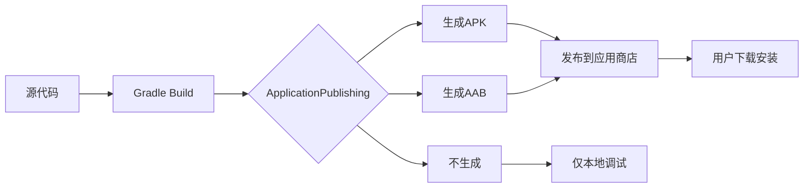
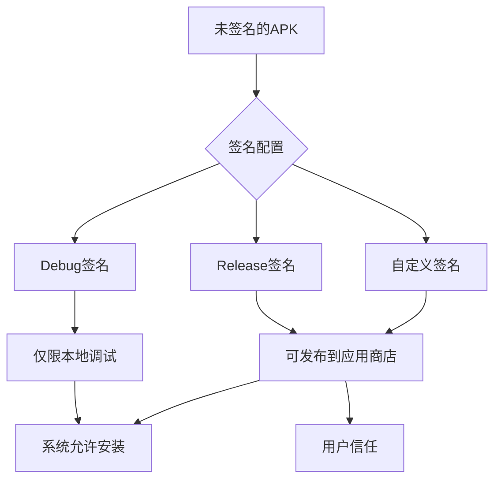
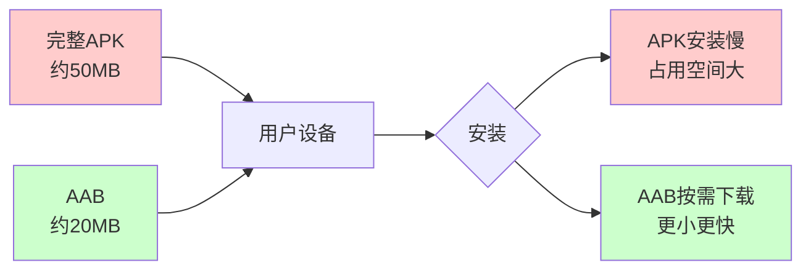

# 21.1.81 应用发布

午夜的风轻轻吹过湖畔，带着一丝凉爽的湿意。星空愈发深邃，像是有人把深蓝色的天鹅绒铺在了头顶，星星一颗一颗地亮了起来。

洛芙仰躺在草地上，双手枕在脑袋后面，看着天空中闪烁的星星。在她旁边，黛琳正把笔记本放在膝盖上，屏幕上显示着刚才写的ProductFlavor配置代码。

“黛琳，”洛芙突然开口，“我们刚才学会了怎么用ProductFlavor做出不同版本的App——免费版、付费版、国内版、海外版……可是，做出来之后呢？怎么把这些版本发布到应用商店去？”

希尔正在用树枝拨弄着炭火，闻言抬起头来：“对哦，这是一个好问题。总不能每次都手动导出APK然后上传吧？”

伊莎轻轻笑了笑：“就像做好了一道菜，还得学会怎么端上桌呢~”

黛琳点了点头：“你们问得很及时。今天我们来讲ApplicationPublishing——应用发布配置。这是Android Gradle Plugin里专门用来管理如何发布App的DSL接口。”

---

## 什么是应用发布

黛琳调出一张新的白板图，在上面画了一个简单的流程：



“简单来说，”黛琳解释道，“ApplicationPublishing就是控制你的App怎么‘端上桌’的配置。它决定了生成什么类型的安装包，要不要签名，以及发布到哪些渠道。”

洛芙眨了眨眼：“所以它就像……餐厅的服务员？负责把做好的菜端给客人？”

“這個比喻挺形象的，”黛琳笑了，“服务员要确认菜品、摆盘、还要送到正确的餐桌。ApplicationPublishing也是类似——它要确认生成什么格式的包、用什么签名、发布到哪里。”

---

## 第一个发布配置实战

黛琳打开代码编辑器，开始写第一个示例：

```kotlin
android {
    // 这是一个完整的应用发布配置示例
    
    // 首先定义发布配置
    publishing {
        // 单变体发布配置（只发布当前的变体）
        singleVariant("release") {
            // 是否启用发布
            enable = true
            
            // 生成 APK
            generate apk = true
            
            // 生成 Android App Bundle
            generate aab = true
            
            // APK 文件名是否包含变体名称
            apkName = "myapp-${variantName}"
        }
    }
}
```

“等等，”洛芙举手，“这个singleVariant是什么？我记得之前好像见过类似的说法。”

黛琳点点头：“问得好。singleVariant是Android Gradle Plugin 3.0之后引入的简化配置方式。它让你可以一次性为一个构建变体配置发布选项，而不需要逐个指定输出项。”

希尔补充道：“我之前研究过这个。在3.0之前，配置发布要写一堆generateApk、generateAab之类的代码，很繁琐。现在用singleVariant简洁多了。”

---

## 发布变体的详细配置

黛琳又展示了更详细的配置方式：

```kotlin
android {
    publishing {
        // 多变体发布配置（可以同时配置多个变体）
        variants.withType(ApplicationVariantType::class.java) { variant ->
            // 为每个变体配置发布选项
            val variantName = variant.name
            
            // 创建发布配置
            create<ApkPublishingConfig>("${variantName}Publish") {
                // 应用ID后缀（可选）
                applicationIdSuffix = if (variant.buildType.name == "debug") {
                    ".debug"
                } else {
                    ""
                }
                
                // 版本名称后缀
                versionNameSuffix = if (variant.buildType.name == "debug") {
                    "-debug"
                } else {
                    ""
                }
                
                // 签名配置
                signing = SigningConfigType.DEBUG
            }
        }
    }
}
```

“这里有个很重要的概念，”黛琳指着屏幕说，“ApkPublishingConfig——APK发布配置。它控制生成APK的各种细节。”

洛芙凑近屏幕：“我看到有applicationIdSuffix和versionNameSuffix……这些是用来做什么的？”

“很好的观察，”黛琳说，“你还记得我们之前学的ProductFlavor吗？flavor可以给App添加后缀，比如'.free'、'.paid'。这里的后缀是针对构建类型的——debug版本自动添加'.debug'后缀，这样你就可以同时安装debug版和release版到同一台手机上，不会冲突。”

---

## 签名配置——让APK获得“身份证”

伊莎插话道：“我记得发布到应用商店需要签名……就像给包裹贴上快递单一样？”

“对，”黛琳点头，“签名是Android应用发布的核心。没有签名的APK就像没有身份证的人——系统不会让它安装，用户也不会信任它。”

黛琳在白板上画了一个流程图：



“在Android开发中，我们通常有三种签名配置，”黛琳解释道：

1. **Debug签名** - 开发时自动使用，只能用于本地调试，不能发布到应用商店
2. **Release签名** - 发布时使用，需要你自己生成或从应用商店获取
3. **自定义签名** - 高级用法，可以使用自己配置的签名密钥

洛芙举手：“那我们要怎么配置自己的签名？我看很多教程都说要去应用商店申请什么的……”

“不完全是申请，”希尔接过话题，“签名密钥是你自己生成的，然后用这个密钥给App签名。上传到Google Play时，你需要先在Play Console上传一次签名的APK或AAB，Google Play会帮你管理这个密钥，之后更新都用同一个密钥。”

黛琳补充道：“这就是Google Play的'App Signing'功能。你可以选择让Google帮你管理签名密钥（推荐），也可以继续使用自己的密钥。”

---

## 完整的签名配置示例

黛琳写出了一个完整的签名配置示例：

```kotlin
android {
    signingConfigs {
        // 创建发布签名配置
        create("release") {
            // 密钥库文件路径
            storeFile = file("keystore/myapp.keystore")
            
            // 密钥库密码
            storePassword = "your-store-password"
            
            // 密钥别名
            keyAlias = "your-key-alias"
            
            // 密钥密码
            keyPassword = "your-key-password"
            
            // 可选：指定密钥类型
            keyAlgorithm = "RSA"
            
            // 可选：密钥库类型
            storeType = "PKCS12"
        }
        
        // 也可以基于已有的配置创建
        create("custom") {
            // 从现有的debug配置复制
            // 这在实际项目中很常见
        }
    }
    
    buildTypes {
        release {
            // 在构建类型中使用签名配置
            signingConfig = signingConfigs.release
            
            // Release构建的其他配置
            isMinifyEnabled = true
            isShrinkResources = true
            proguardFiles getDefaultProguardFile("proguard-android-optimize.txt")
        }
        
        debug {
            // Debug构建使用debug签名
            signingConfig = signingConfigs.debug
            
            // Debug构建的配置
            isDebuggable = true
        }
    }
}
```

洛芙看着代码，有些担心地说：“这个密码直接写在代码里……会不会不太安全？”

“你问得非常专业，”黛琳赞许地说，“这是一个很重要的安全问题。在实际项目中，我们绝对不应该把密码明文写在build.gradle里。”

---

## 安全最佳实践：不要把密码写进代码

希尔敲了敲键盘，调出一段新的代码：

```kotlin
// ❌ 错误做法：密码明文写在代码里
android {
    signingConfigs {
        create("release") {
            storeFile = file("keystore/myapp.keystore")
            storePassword = "my-secret-password"  // 危险！
            keyAlias = "my-key-alias"
            keyPassword = "another-secret"  // 危险！
        }
    }
}

// ✅ 正确做法：使用环境变量或本地属性文件

// 方法1：在gradle.properties中配置
// gradle.properties:
/*
org.gradle.properties:
keystore.password=my-secret-password
key.alias.password=another-secret
*/

// 然后在build.gradle中读取
android {
    signingConfigs {
        create("release") {
            storeFile = file("keystore/myapp.keystore")
            storePassword = project.property("keystore.password") as String
            keyAlias = "my-key-alias"
            keyPassword = project.property("key.alias.password") as String
        }
    }
}

// 方法2：在local.properties中配置（推荐，不会提交到版本控制）
android {
    signingConfigs {
        create("release") {
            storeFile = file("keystore/myapp.keystore")
            
            // 从local.properties读取
            val localProps = java.util.Properties()
            localProps.load(rootProject.file("local.properties").inputStream())
            
            storePassword = localProps.getProperty("keystore.password", "")
            keyAlias = localProps.getProperty("key.alias", "")
            keyPassword = localProps.getProperty("key.password", "")
        }
    }
}
```

“local.properties是更好的选择，”希尔解释道，“因为这个文件默认会被加入.gitignore，不会提交到Git仓库里。”

伊莎轻声说：“就像把重要的东西锁在保险箱里，而不是放在桌面上呢~”

---

## APK和AAB——不同的发布格式

黛琳又打开一个新的代码块：

```kotlin
android {
    publishing {
        // 配置APK发布选项
        applicationVariants.all { variant ->
            variant.outputs.all { output ->
                // 自定义APK文件名
                output.outputFileName = "${variant.name}-${variant.versionName}.apks"
                
                // 或者使用更详细的配置
                (output as? com.android.build.OutputFile)?.let { apkOutput ->
                    // 获取APK输出信息
                    val apkFile = apkOutput.outputFile
                    
                    // 可以在此添加版本控制信息
                    println("APK生成位置: ${apkFile.absolutePath}")
                }
            }
        }
        
        // AAB发布配置（针对Google Play）
        // AAB = Android App Bundle，是一种新的发布格式
        // Google Play会根据用户的设备动态生成优化的APK
        aab {
            // AAB输出配置
            bundle {
                // 是否启用代码压缩
                enableResourceOptimizations = true
                
                // 是否启用分割
                enableSplit = true
                
                // 排除不需要的语言资源
                language {
                    includeSplits = true
                }
                
                // 排除不需要的ABI
                abi {
                    enableSplit = true
                }
                
                // 屏幕密度分割
                density {
                    enableSplit = true
                }
            }
        }
    }
}
```

“这里涉及到两种发布格式的選擇，”黛琳说，“APK和AAB。”

洛芙好奇地问：“AAB是什么？听起来好像比APK高级？”

“可以说是，也可以说不是，”黛琳笑着解释，“AAB是Android App Bundle，它是Google Play推荐的新格式。最大的特点是‘动态分发’——用户下载的不是完整的App，而是根据他的设备定制的最小安装包。”



希尔补充道：“Google Play从2018年开始就推荐使用AAB了。对于新应用，上传AAB是必须的。不过如果你们只是做内部测试或者发布到其他应用商店，APK还是更通用。”

---

## 多渠道发布配置

洛芙又有了新问题：“如果我们不只是发布到Google Play，还要发布到华为应用市场、小米应用商店……要怎么配置？”

“这是多渠道发布的问题，”黛琳调出新的代码，“在Android Gradle Plugin里，我们通常用ProductFlavor来实现多渠道。”

```kotlin
android {
    // 渠道维度
    flavorDimensions += "channel"
    
    productFlavors {
        // Google Play渠道
        create("google") {
            dimension = "channel"
            // Google Play特有的应用ID
            applicationId = "com.example.app"
            
            // 可以在此添加渠道特定的代码
        }
        
        // 华为应用市场渠道
        create("huawei") {
            dimension = "channel"
            applicationId = "com.example.app.huawei"
        }
        
        // 小米应用商店渠道
        create("xiaomi") {
            dimension = "channel"
            applicationId = "com.example.app.xiaomi"
        }
        
        // 独立分发渠道（官网下载）
        create("official") {
            dimension = "channel"
            applicationId = "com.example.app.official"
        }
    }
    
    // 然后为每个渠道配置签名
    applicationVariants.all { variant ->
        variant.outputs.all { output ->
            val flavorName = output.name.replace(variant.buildType.name, "")
                .replaceFirstChar { it.uppercase() }
            
            // 为不同渠道配置不同的签名
            if (output.name.contains("google")) {
                output.signingConfig = signingConfigs.googlePlay
            } else if (output.name.contains("huawei")) {
                output.signingConfig = signingConfigs.huawei
            } else {
                output.signingConfig = signingConfigs.release
            }
        }
    }
}
```

洛芙眼睛亮了起来：“原来ProductFlavor还可以这么用！这样每个渠道都可以有独立的应用ID和签名……”

“对，”黛琳点头，“这样用户安装不同渠道的App时，不会互相覆盖。而且每个渠道可以独立更新。”

---

## 发布前检查清单

伊莎提议说：“我们整理一个发布前的检查清单吧？就像出发前要检查装备一样~”

“好主意！”洛芙积极响应。

黛琳打开一个新文件，开始记录：

```kotlin
// ============================================
// App发布前检查清单
// ============================================

/*
 
1. 版本信息检查
   - [ ] versionCode 是否递增？
   - [ ] versionName 是否更新？（遵守语义化版本规范）
   - [ ] 应用名称、应用图标是否正确？
 
2. 构建配置检查
   - [ ] debuggable = false（Release版本）
   - [ ] minifyEnabled = true（启用混淆）
   - [ ] shrinkResources = true（移除未使用资源）
   - [ ] proguard规则是否完整？
 
3. 签名检查
   - [ ] 签名密钥是否正确备份？
   - [ ] 密钥密码是否记录在安全的地方？
   - [ ] 是否使用了正确的签名配置？
 
4. 渠道配置检查（如果使用多渠道）
   - [ ] 每个渠道的applicationId是否正确？
   - [ ] 每个渠道的签名是否配置？
   - [ ] 渠道特定的代码是否正确包含/排除？
 
5. 测试检查
   - [ ] 是否在测试设备上安装验证过？
   - [ ] 是否测试了所有关键流程？
   - [ ] 是否测试了不同Android版本的兼容性？
 
6. 隐私与合规检查
   - [ ] 隐私政策是否更新？
   - [ ] 权限使用是否合理？
   - [ ] 是否符合应用商店的审核政策？
 
7. 资源检查
   - [ ] 应用图标是否清晰？
   - [ ] 截图和描述是否准备完毕？
   - [ ] 商店页面信息是否完整？
 
*/
```

“好详细！”洛芙感叹道，“感觉发布一个App要考虑的细节好多啊……”

希尔拍了拍洛芙的肩膀：“习惯就好！这些检查做习惯了之后，每次发布也就是勾选几个checkbox的事儿。关键是第一次要仔细做好。”

---

## 实际发布流程演示

黛琳最后演示了一个完整的发布命令：

```bash
# 清理并构建Release版本
./gradlew clean assembleRelease

# 如果使用AAB格式
./gradlew bundleRelease

# 查看生成的输出文件
ls -la app/build/outputs/apk/release/
ls -la app/build/outputs/bundle/release/

# 输出示例：
# app/build/outputs/apk/release/
# ├── app-google-release.apk
# ├── app-huawei-release.apk
# ├── app-xiaomi-release.apk
# └── app-official-release.apk
#
# app/build/outputs/bundle/release/
# └── app-release.aab
```

“如果是在CI/CD环境中，”希尔补充道，“你还可以使用Gradle的任务过滤来只构建特定的渠道版本：

```bash
# 只构建Google Play版本
./gradlew assembleGoogleRelease

# 只构建Google Play的AAB
./gradlew bundleGoogleRelease
```

---

炭火已经快要燃尽了，只剩下几点红色的余烬在夜色中微微闪烁。洛芙裹了裹身上的外套，感觉夜风比刚才更凉爽了一些。

“今天学的内容好多啊……”洛芙感慨道，“从ProductFlavor到ApplicationPublishing，感觉发布一个App要考虑好多东西。”

黛琳微微一笑：“这是因为发布是App开发的最后一步，也是最重要的一步。再好的App，如果不能顺利发布到用户手里，就没有任何意义。”

伊莎轻声说：“就像露营一样~准备工作做得再充分，如果最后忘记带燃料，就没办法生火了呢~”

希尔打了个哈欠：“时间不早了，我们明天还有别的要学呢。今天先到这里吧。”

洛芙最后抬头看了一眼星空，星星比来的时候更多了。她在心里默默记下了今天学到的知识——

> 应用发布的关键在于：选择正确的发布格式（APK或AAB），配置安全的签名，正确管理渠道。

“黛琳，明天要讲什么呀？”洛芙忍不住好奇地问。

黛琳合上笔记本：“明天啊……我们来讲讲应用变体的选择器——ApplicationVariantSelector。这是控制哪些变体可以被构建、哪些不可以的重要工具。”

“听起来好高级！”洛芙的眼睛又亮了起来，“那今晚先睡觉啦！”

夜幕下，四个女孩收拾好各自的物品，准备回到帐篷里。湖畔的虫鸣声此起彼伏，像是夏夜的交响乐。星光依旧闪烁，等待着明天新的学习旅程。

---

> 应用发布配置是Android应用开发的关键环节。通过ApplicationPublishing DSL，我们可以精细控制生成的APK/AAB格式、签名方式、渠道配置等重要参数。合理使用ProductFlavor配合发布配置，可以实现多渠道高效发布。始终记住：安全的签名管理和规范的版本控制是成功发布的基础。

## 洛芙的小小日记本

今天学到了ApplicationPublishing！原来发布一个App有这么多讲究——要选APK还是AAB格式、要配置签名密钥、不同的应用商店要用不同的渠道……黛琳还教了我们不要把密码明文写在代码里，要用local.properties。感觉发布比开发还复杂呢！不过希尔说得对，习惯就好了~期待明天学ApplicationVariantSelector！

---

## 今日关键词

**ApplicationPublishing** - Android Gradle Plugin的DSL接口，用于配置应用的发布选项，包括生成APK/AAB、签名配置、发布渠道等。

**ApkPublishingConfig** - APK发布配置对象，控制APK生成的各种细节，如应用ID后缀、版本名后缀、签名方式等。

**SigningConfig** - 签名配置，包含密钥库文件、密码、密钥别名等，用于给APK/AAB签名。

**Android App Bundle (AAB)** - Google Play推荐的发布格式，可以根据用户设备动态生成优化的APK，减小安装包体积。

**ProductFlavor维度** - 通过ProductFlavor实现多渠道发布，每个渠道可以有独立的applicationId和签名配置。

**singleVariant** - Android Gradle Plugin 3.0引入的简化发布配置方式，可以一次性为一个构建变体配置发布选项。

**local.properties** - 本地属性文件，用于存储敏感配置（如签名密码），默认被Git忽略，保护信息安全。

**versionCode** - Android应用的内部版本号，每次发布必须递增，用于系统判断版本新旧。

**versionName** - Android应用的显示版本号，用户可见，遵守语义化版本规范。

**proguard** - 代码混淆工具，用于压缩、优化和混淆Java/Kotlin代码，增加逆向工程难度。
