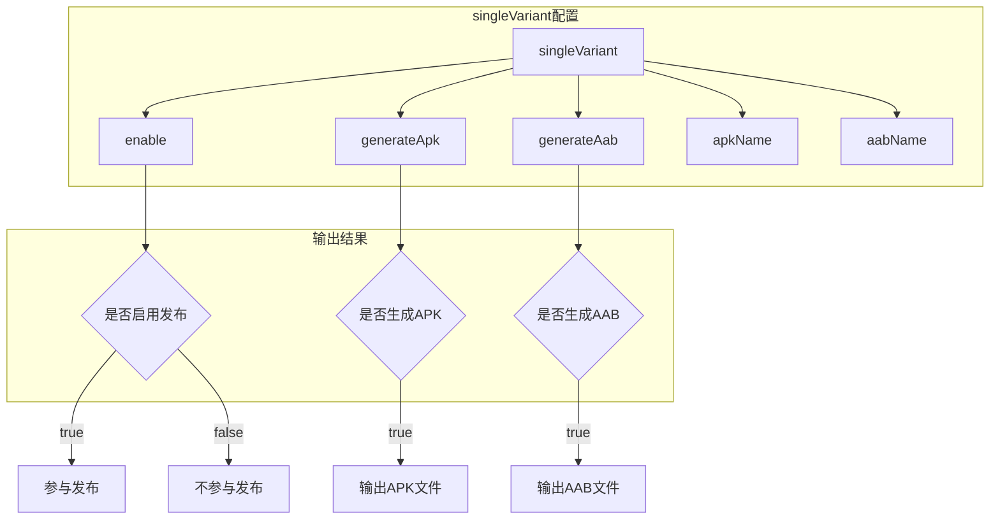
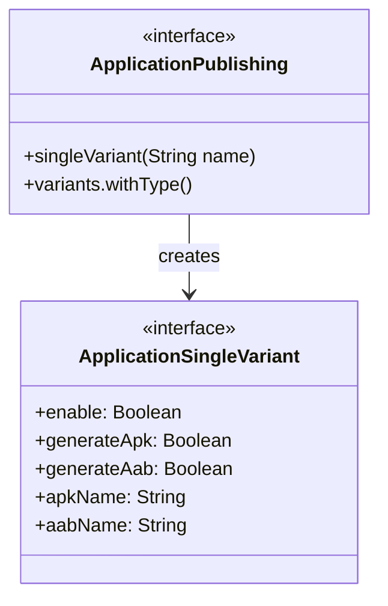

# 21.1.82 应用单变体

星空愈发深邃，远处的山峦只剩下黑黢黢的轮廓。湖畔的露营地上，炭火已经变成了温热的余烬，散发着淡淡的橙红色光芒。

洛芙裹紧了外套，目光从手机屏幕上移开：“黛琳，你刚才说的singleVariant，我还是有点不太明白……它和之前学的publishing到底有什么区别？”

黛琳把笔记本往膝盖上放了放：“你问得很仔细。简单来说，publishing是‘全局配置’，而singleVariant是‘针对某一个具体变体的精细配置’。就像餐厅里，publishing是制定整体的出餐流程，singleVariant则是给某一道菜专门设定的配料和装盘方式。”

伊莎打了个小小的哈欠，揉了揉眼睛：“那能不能这样理解——publishing是决定了‘要不要上菜’，而singleVariant是决定‘怎么上这道菜’？”

“太对了！”黛琳笑道，“就是这个意思。”

---

## 单变体的核心概念

希尔把手机充电线拔掉，凑过来看屏幕：“让我来给你们演示一下singleVariant到底能做什么。”

她打开编辑器，调出一段配置代码：

```kotlin
android {
    publishing {
        // singleVariant - 为单个变体配置发布选项
        singleVariant("release") {
            // 是否启用这个变体的发布
            enable = true
            
            // 是否生成 APK
            generateApk = true
            
            // 是否生成 Android App Bundle
            generateAab = true
            
            // APK 文件名是否包含变体名称
            apkName = "myapp-${variantName}"
            
            // AAB 文件名是否包含变体名称
            aabName = "myapp-${variantName}"
        }
        
        // 还可以为 debug 变体配置
        singleVariant("debug") {
            enable = true
            generateApk = true
            // debug 版本不生成 AAB（发布通常用 release）
            generateAab = false
        }
    }
}
```

洛芙看着代码：“所以singleVariant后面跟的'release'、'debug'，就是指定要配置哪个变体？”

“对，”黛琳点头，“这就是它的核心作用——告诉Gradle：‘我要精细控制这个变体的输出’。如果你有多个flavor，比如'free'和'paid'，你还可以分别配置它们。”

```kotlin
android {
    publishing {
        // 为免费版配置发布
        singleVariant("freeRelease") {
            enable = true
            generateApk = true
            generateAab = true
        }
        
        // 为付费版配置发布
        singleVariant("paidRelease") {
            enable = true
            generateApk = true
            generateAab = true
        }
    }
}
```

---

## 深入理解单变体的属性

夜风轻轻吹过，树梢传来一阵沙沙声。洛芙打了个冷战，把腿缩得更靠近炭火余烬。

“黛琳，这些属性我都看到了，”洛芙说，“但我还是想知道，它们各自到底有什么用？比如generateApk和generateAab，都生成不行吗？”

黛琳理解地笑了：“这是个好问题。让我一个个解释。”

她调出一张白板图：



“首先说enable，”黛琳解释道，“它就像开关一样。如果你设置为false，即使其他配置都写好了，这个变体也不会参与发布——它只会在本地调试时用到。”

洛芙点头：“就像餐厅菜单上某道菜标注为‘暂时停售’？”

“完全正确，”黛琳笑了，“接下来是generateApk和generateAab。APK是Android安装包，用户可以直接下载安装；AAB是Android App Bundle，是Google Play推荐的新格式，它可以在用户下载时根据设备动态生成最合适的安装包。”

“那是不是用AAB更好？”洛芙问。

“通常情况下是，”黛琳说，“AAB体积更小，因为Google Play会根据用户的设备只推送必要的资源。但有些场景你需要APK——比如你要发布到Google Play以外的应用商店，或者你要做内部测试分发。”

---

## 文件名自定义的艺术

希尔补充道：“还有apkName和aabName，这两个属性特别实用。”

她现场改了一行代码：

```kotlin
singleVariant("release") {
    enable = true
    generateApk = true
    generateAab = true
    
    // 自定义文件名
    apkName = "CampingApp-v${versionName}-${variantName}"
    aabName = "CampingApp-v${versionName}-${variantName}"
}
```

“这样生成的文件名就会是，”希尔演示着运行结果，“CampingApp-v1.0.0-release.apk 和 CampingApp-v1.0.0-release.aab。”

洛芙惊叹道：“这样看起来一目了然！以后找文件就方便多了。”

伊莎轻声说：“就像给每件行李贴上标签，旅行的时候找起来就快啦~”

---

## 多flavor场景下的单变体配置

洛芙突然想到一个问题：“对了，我们之前学过ProductFlavor，如果有多个flavor该怎么配置？”

黛琳赞赏地看了她一眼：“问得好！这正是singleVariant的强项。”

她写了一个更复杂的例子：

```kotlin
android {
    // 定义两个 flavor 维度
    flavorDimensions += "version"
    flavorDimensions += "region"
    
    productFlavors {
        // 国内免费版
        create("free") {
            dimension = "version"
            applicationIdSuffix = ".free"
        }
        
        // 国内付费版
        create("paid") {
            dimension = "version"
            applicationIdSuffix = ".paid"
        }
        
        // 海外版
        create("overseas") {
            dimension = "region"
            applicationIdSuffix = ".overseas"
        }
    }
    
    publishing {
        // 为特定的 flavor + buildType 组合配置
        
        // 免费版 Release
        singleVariant("freeRelease") {
            enable = true
            generateApk = true
            generateAab = true
        }
        
        // 付费版 Release
        singleVariant("paidRelease") {
            enable = true
            generateApk = true
            generateAab = true
        }
        
        // 海外版 Release
        singleVariant("overseasRelease") {
            enable = true
            generateApk = true
            generateAab = true
        }
        
        // 所有 debug 版本统一配置
        singleVariant("debug") {
            enable = true
            generateApk = true
            generateAab = false  // debug 不需要 AAB
        }
    }
}
```

洛芙看着屏幕上的配置：“我明白了！singleVariant的名字格式是'${flavor}${BuildType}'，首字母要大写。比如free + release = freeRelease，paid + release = paidRelease。”

“完全正确，”黛琳说，“这就是Android Gradle Plugin的命名规则。记住这个规律，你就能精准控制每一个变体的输出。”

---

## 变体过滤与条件发布

希尔突然想到了什么：“对了，还有一个很实用的功能——变体过滤。有时候你可能不想生成某些组合，就可以用variantFilter来排除。”

她写了一段示例：

```kotlin
android {
    // 变体过滤
    variantFilter {
        // 排除海外版 + debug 组合（节省构建时间）
        if (flavorNames.contains("overseas") && buildType.name == "debug") {
            ignore = true
        }
    }
    
    publishing {
        // 只发布 release 版本
        singleVariant("release") {
            enable = true
            generateApk = true
            generateAab = true
        }
        
        singleVariant("freeRelease") {
            enable = true
            generateApk = true
            generateAab = true
        }
        
        singleVariant("paidRelease") {
            enable = true
            generateApk = true
            generateAab = true
        }
        
        singleVariant("overseasRelease") {
            enable = true
            generateApk = true
            generateAab = true
        }
    }
}
```

洛芙好奇地问：“这个variantFilter是做什么的？”

“它就像安检门，”希尔解释道，“每个变体组合在生成之前都会经过这个过滤器的检查。如果你设置了ignore = true，这个变体干脆就不会被创建，节省构建时间。”

伊莎若有所思：“就像旅行前先筛选行李，只带真正需要的东西~”

---

## 单变体与发布类型的结合

黛琳见时间差不多了，总结道：“好了，今天我们学了ApplicationSingleVariant。让我来梳理一下它的核心知识点。”

她调出一张总结图：

```mermaid
flowchart LR
    subgraph 配置层级
    A[android {}] --> B[publishing {}]
    B --> C[singleVariant]
    end
    
    subgraph 核心属性
    C --> D[enable: 是否启用]
    C --> E[generateApk: 生成APK]
    C --> F[generateAab: 生成AAB]
    C --> G[apkName: APK文件名]
    C --> H[aabName: AAB文件名]
    end
    
    subgraph 使用场景
    D --> I[控制发布开关]
    E --> J[多渠道分发]
    F --> K[Play商店分发]
    G --> K
    H --> K
    end
```

“ApplicationSingleVariant是ApplicationPublishing的细化配置，”黛琳说，“它让你能够精确控制每一个变体的输出方式。配合ProductFlavor和BuildType，你可以构建出复杂的发布矩阵——免费版、付费版、国内版、海外版，每个都能单独配置。”

洛芙伸了个懒腰：“感觉像是在组一个乐高，每块积木都有它的作用~”

---

## 反模式与最佳实践

希尔突然严肃起来：“对了，说到单变体配置，我必须提醒你们几个常见的错误。”

她列出一个反模式和正确做法：

**反模式：为所有变体都启用发布**

```kotlin
// ❌ 错误做法：每个变体都生成 APK 和 AAB
android {
    publishing {
        singleVariant("debug") {
            enable = true
            generateApk = true
            generateAab = true  // 没必要
        }
        
        singleVariant("release") {
            enable = true
            generateApk = true
            generateAab = true
        }
    }
}
```

“debug版本完全没必要生成AAB，”希尔说，“而且如果你有很多flavor，每个都生成两种格式，会浪费很多构建时间和磁盘空间。”

**正确做法：按需配置**

```kotlin
// ✅ 正确做法：按实际需求配置
android {
    publishing {
        // debug 只生成 APK，用于本地测试
        singleVariant("debug") {
            enable = true
            generateApk = true
            generateAab = false
        }
        
        // release 版本生成两种格式
        singleVariant("release") {
            enable = true
            generateApk = true
            generateAab = true
        }
        
        // 免费版 Release
        singleVariant("freeRelease") {
            enable = true
            generateApk = true  // 给其他应用商店用
            generateAab = true  // 给 Google Play 用
        }
        
        // 付费版 Release - 只给 Google Play
        singleVariant("paidRelease") {
            enable = true
            generateApk = false  // 付费版只在 Play 商店发行
            generateAab = true
        }
    }
}
```

洛芙看得认真：“原来配置也有这么多讲究！”

---

## 运行输出示例

希尔跑了一个实际的构建，给大家看输出：

```
$ ./gradlew assembleRelease

> Task :app:collectReleaseDependencies
> Task :app:processReleaseResources
> Task :app:compileReleaseKotlin
> Task :app:packageRelease
> Task :app:assembleRelease

BUILD SUCCESSFUL in 45s
> Task :app:generateFreeReleaseApk
> Task :app:generatePaidReleaseApk
> Task :app:generateOverseasReleaseApk
> Task :app:generateFreeReleaseBundle
> Task :app:generatePaidReleaseBundle
> Task :app:generateOverseasReleaseBundle

# 生成的输出文件：
# app/build/outputs/apk/free/release/freeRelease.apk
# app/build/outputs/apk/paid/release/paidRelease.apk
# app/build/outputs/apk/overseas/release/overseasRelease.apk
# app/build/outputs/bundle/free/release/freeRelease.aab
# app/build/outputs/bundle/paid/release/paidRelease.aab
# app/build/outputs/bundle/overseas/release/overseasRelease.aab
```

“看，”希尔指着输出说，“每个变体都按照我们的配置生成了对应的文件。这就是singleVariant的魔力——精细控制，按需生成。”

---

夜更深了。银河在天空中缓缓流转，像是有人用钻石在天鹅绒上画了一条光带。露营地上的女孩子们都安静下来，仰头看着星空。

“真美啊，”伊莎轻声说，“就像天上的星星一样，每一颗都有自己的位置……我们的App也是这样，每个变体都有它的用途。”

黛琳微笑着点头：“没错。debug版本用来本地调试，release版本用来发布，free版面向免费用户，paid版面向付费用户……每个配置都要放在最合适的位置。”

洛芙靠坐在树干上，满足地叹了口气：“今天又学到了好多。感觉离成为一个真正的Android开发者又近了一步~”

炭火已经完全冷却，只剩下微弱的余温。但女孩们的收获，却比那炭火还要温暖实在。

---

## 专业技术总结

> **ApplicationSingleVariant** — Android Gradle Plugin 中用于配置单个构建变体发布选项的 DSL 接口。它继承自 `SingleVariant`，允许开发者精确控制某个特定变体是否生成 APK、是否生成 AAB，以及输出文件的命名方式。

#### 结构图



#### 反模式与陷阱

1. **为所有变体生成所有格式** — debug 版本生成 AAB 浪费资源
2. **忘记设置 enable = true** — 配置了但不生效
3. **flavor 命名拼写错误** — free + Release = freeRelease（不是 free_release）
4. **混淆 APK 和 AAB 的使用场景** — AAB 只适用于 Google Play

#### 设计哲学

- **精细控制原则**：每个变体按需配置，不做无用功
- **按渠道分发**：不同渠道使用不同格式
- **命名规范**：清晰的输出文件名便于管理和分发

#### 动手练习

**目标**：掌握单变体配置的核心技能

**Task 1：基础单变体配置**

1. 在 Android 项目中打开 app/build.gradle.kts
2. 在 android {} 块中添加 publishing {}
3. 为 debug 和 release 变体分别配置 singleVariant
4. 运行 `./gradlew assembleRelease` 验证输出

**验收标准**：
- [ ] debug 变体生成 APK，不生成 AAB
- [ ] release 变体同时生成 APK 和 AAB
- [ ] 输出文件名包含版本号和变体名

**Task 2：多 flavor 配置**

1. 添加两个 productFlavor：demo 和 full
2. 为 demoRelease 和 fullRelease 分别配置 singleVariant
3. 只为 fullRelease 生成 AAB

**验收标准**：
- [ ] 四个变体的输出符合预期
- [ ] demo 版本不生成 AAB（节省构建时间）

**Task 3：条件发布实战**

1. 使用 variantFilter 排除不需要的变体组合
2. 只保留需要发布的变体

**验收标准**：
- [ ] 变体数量正确减少
- [ ] 构建时间明显缩短

#### 面试热身

- Q1: singleVariant 和 variants.withType() 有什么区别？
- Q2: 什么时候应该用 AAB 而不是 APK？
- Q3: 如何只发布特定的几个变体？
- Q4: explain why 生成所有变体可能不是好主意？
- Q5: 单变体配置和构建类型（Build Type）有什么关系？

#### 参考实现要点

1. 优先为 release 版本配置 AAB（Google Play 推荐）
2. debug 版本只需 APK，无需 AAB
3. 使用 apkName 和 aabName 自定义输出文件名
4. 配合 variantFilter 过滤不需要的变体组合
5. 多个 flavor 时，明确每个 flavor 的发布策略

---

> 学到了！singleVariant 就像给每个变体量身定制的‘上菜方式'——有的只要 APK，有的要 AAB，有的干脆不上菜。明白了这一点，就能精准控制构建输出，不会浪费资源啦~ 🎯

---

## 洛芙的小小日记本

今天学了好高级的东西！singleVariant——应用单变体配置。虽然名字听起来有点绕，但其实就是精细控制每个变体怎么输出。是生成 APK 还是 AAB，文件名怎么起，要不要发布……全部都可以单独设置。

黛琳说得对，要根据实际需求来配置，不能一股脑儿全部生成。那样不仅浪费资源，还会给自己找麻烦。

明天还会学什么呢？好期待呀~ 🌙

---

## 今日关键词

- **ApplicationSingleVariant**：Android Gradle Plugin 中配置单个变体发布选项的 DSL 接口
- **singleVariant()**：方法，用于为特定变体配置发布选项
- **generateApk**：属性，控制是否生成 APK 安装包
- **generateAab**：属性，控制是否生成 Android App Bundle
- **apkName**：属性，自定义 APK 输出文件名
- **aabName**：属性，自定义 AAB 输出文件名
- **enable**：属性，控制该变体是否参与发布
- **ProductFlavor**：产品风味，用于创建不同版本的 App
- **BuildType**：构建类型，debug 或 release
- **variantFilter**：变体过滤器，用于排除不需要的变体组合
- **AAB**：Android App Bundle，Google Play 推荐的分发格式
- **APK**：Android Package Kit，传统的安装包格式
