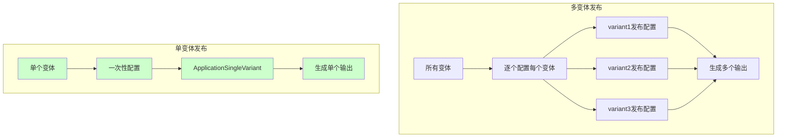
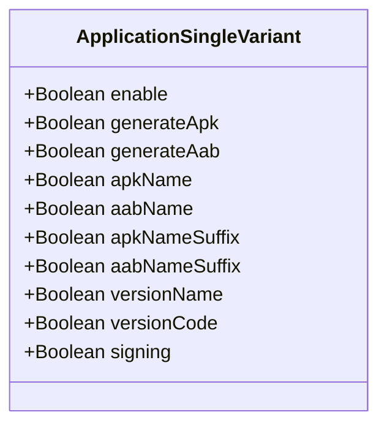
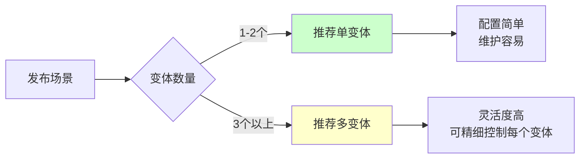
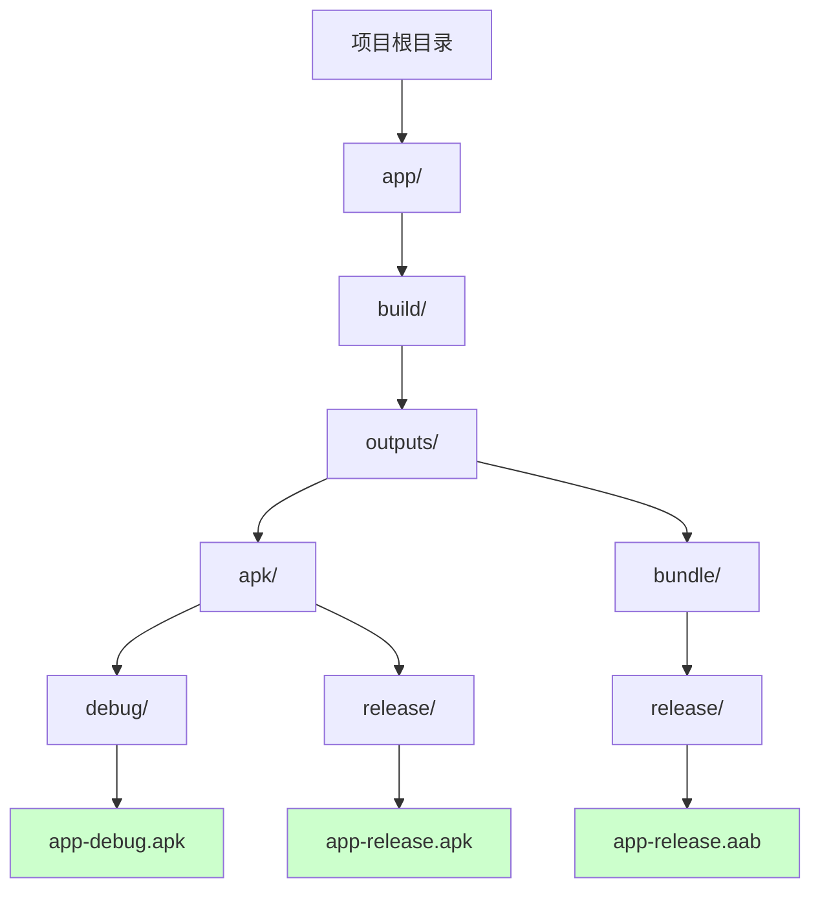

# 21.1.82 ApplicationSingleVariant

凌晨的露营地比白天安静了许多，只有偶尔的虫鸣和远处水面泛起的轻微涟漪声。星空比刚才更加清晰，银色的光芒洒落在湖面上，像是被打散的钻石。

洛芙靠在折叠椅上，手里捧着一杯温热的可可。黛琳还在刚才的笔记本上写着什么，屏幕的蓝光在夜色中格外显眼。

“黛琳，”洛芙打了个小哈欠，“刚才学的ApplicationPublishing好复杂啊……有没有简单一点的用法？”

希尔正在整理数据线，抬起头来：“你终于问到点上了。其实对于大多数项目来说，根本不需要那么复杂的配置。”

伊莎轻轻笑了笑：“就像露营一样~有时候搭个简易帐篷就够了，不需要每次都搭城堡~”

黛琳点了点头：“今天我们要学的ApplicationSingleVariant，就是那个‘简易帐篷’。它是ApplicationPublishing的简化版，专门用来处理单变体的发布配置。”

---

## 什么是单变体发布

黛琳把笔记本转过来，指着屏幕上的新内容：“先来看一张图，了解单变体和多变体的区别。”



“简单来说，”黛琳解释道，“单变体发布就是一次性为一个构建变体配置所有发布选项，不需要逐个指定output、signing、APK生成这些细节。”

洛芙歪着头：“那……什么情况下用单变体就够了？”

“问得好，”黛琳说，“大多数App项目其实只需要发布一两个变体——比如只有release版本要发布到应用商店，或者debug版本用于测试。这时用单变体配置最简单。”

---

## 第一个单变体配置

黛琳开始写代码：

```kotlin
android {
    publishing {
        // 最简单的单变体配置
        singleVariant("release") {
            // 是否启用这个变体的发布
            enable = true
            
            // 是否生成APK文件
            generateApk = true
            
            // 是否生成AAB文件
            generateAab = true
        }
    }
}
```

“就……这么短？”洛芙有些不敢相信。

“对就这么短，”希尔笑着说，“这就是单变体的魅力。一次性配置，自动帮你搞定所有细节。”

伊莎补充道：“就像直接买露营套餐~比自己一样一样准备要方便多啦~”

---

## 单变体的核心属性

黛琳调出一张属性表格：



“ApplicationSingleVariant有这几个核心属性，”黛琳一个个解释：

**enable** - 是否启用发布。设为false时，这个变体不会被发布。

**generateApk** - 是否生成APK文件。

**generateAab** - 是否生成AAB（Android App Bundle）文件。

**apkName / aabName** - 自定义输出文件名。

**apkNameSuffix / aabNameSuffix** - 给文件名添加后缀。

**versionName / versionCode** - 覆盖版本信息。

**signing** - 指定签名配置。

---

## 实际配置示例

黛琳写出了一个更完整的示例：

```kotlin
android {
    publishing {
        // 为release变体配置单变体发布
        singleVariant("release") {
            // 启用发布
            enable = true
            
            // 生成APK
            generateApk = true
            
            // 生成AAB（推送到Google Play时需要）
            generateAab = true
            
            // 自定义APK文件名
            apkName = "MyApp-v${versionName}"
            
            // 自定义AAB文件名
            aabName = "MyApp-v${versionName}"
            
            // 给版本名添加后缀（可选）
            versionNameSuffix = "-release"
            
            // 使用发布签名
            signing = SigningConfigType.RELEASE
        }
        
        // 也可以为debug变体配置
        singleVariant("debug") {
            enable = false  // 不发布debug版本
        }
    }
}
```

洛芙看着代码：“我注意到有个versionNameSuffix……这个是做什么用的？”

“很好的观察，”黛琳说，“versionNameSuffix会在版本名后面添加指定的后缀。比如你的versionName是'1.0.0'，加上'-release'后，就变成'1.0.0-release'。”

希尔补充道：“这个在多渠道发布时特别有用。比如Google Play用正式版号，官网下载的版本加个'-direct'后缀，方便区分。”

---

## 单变体vs多变体：怎么选

伊莎提出了一个问题：“那什么时候用单变体，什么时候用多变体呢？”

黛琳画了一张对比图：



“简单来说，”黛琳总结道：

**单变体适用场景：**
- 只有一个发布变体（比如只有release要发布）
- 项目不复杂，不需要精细控制每个输出
- 追求配置简洁

**多变体适用场景：**
- 多个发布变体（免费版、付费版、国内版、海外版）
- 每个变体需要不同的签名、不同的输出格式
- 需要对每个输出进行精细配置

---

## 反模式：过度配置单变体

希尔突然表情严肃起来：“在讲单变体的时候，必须提一下常见的错误用法。”

```kotlin
// ❌ 错误做法：把单变体当多变体用

android {
    publishing {
        // 这里完全不需要用singleVariant
        singleVariant("release") {
            // 试图配置每个输出的细节
            // 但singleVariant是为简单场景设计的！
            
            // 错误：试图访问outputs集合
            // outputs.all { output -> ... }  // 这在singleVariant中不可用！
            
            // 错误：试图创建多个配置
            // create<ApkPublishingConfig>("config1") { ... }
            // create<ApkPublishingConfig>("config2") { ... }
        }
    }
}

// ✅ 正确做法：需要复杂配置时用多变体

android {
    publishing {
        variants.withType(ApplicationVariantType::class.java) { variant ->
            // 这里可以访问每个variant的outputs
            variant.outputs.all { output ->
                // 可以精细配置每个输出
                output.outputFileName = "${variant.name}-custom.apk"
            }
            
            // 可以创建多个发布配置
            create<ApkPublishingConfig>("${variant.name}Publish") { ... }
        }
    }
}
```

“单变体的设计初衷就是简化，”希尔解释道，“如果你发现需要访问outputs集合或者创建多个发布配置，那就说明你需要用多变体而不是单变体。”

洛芙若有所思：“就像工具一样，用对了地方才能发挥最大效果。”

---

## 实践：配置一个完整的单变体发布

黛琳提议说：“我们来做个完整的练习吧。假设你要发布一个App到Google Play，只需要release版本。”

```kotlin
// app/build.gradle.kts

android {
    // ... 其他配置 ...
    
    publishing {
        // 为release变体配置单变体发布
        singleVariant("release") {
            // 启用发布
            enable = true
            
            // Google Play需要AAB
            generateAab = true
            
            // 同时也生成APK作为备份
            generateApk = true
            
            // APK文件名包含版本信息
            apkName = "myapp-v${versionName}-${versionCode}"
            
            // AAB文件名同样包含版本信息
            aabName = "myapp-v${versionName}-${versionCode}"
            
            // 使用发布签名
            signing = SigningConfigType.RELEASE
        }
    }
    
    buildTypes {
        release {
            isMinifyEnabled = true
            proguardFiles(getDefaultProguardFile("proguard-android-optimize.txt"), "proguard-rules.pro")
        }
    }
}
```

“现在来验证一下配置是否正确，”希尔说，“运行命令看看输出：”

```bash
# 构建release版本
./gradlew assembleRelease

# 查看输出
ls -la app/build/outputs/apk/release/
ls -la app/build/outputs/bundle/release/

# 输出示例：
# app/build/outputs/apk/release/
# └── myapp-v1.0.0-1.apk
#
# app/build/outputs/bundle/release/
# └── myapp-v1.0.0-1.aab
```

洛芙兴奋地说：“真的生成了！文件名正好是我们配置的格式！”

---

## 单变体的版本控制

黛琳又补充了一个重要话题：“单变体还有一个好用的特性，就是可以动态控制版本信息。”

```kotlin
android {
    // 在defaultConfig中定义基础版本
    defaultConfig {
        applicationId = "com.example.myapp"
        versionCode = 1
        versionName = "1.0.0"
    }
    
    publishing {
        singleVariant("release") {
            // 可以在单变体配置中覆盖版本信息
            // 比如给正式版本添加build号
            
            // 覆盖versionCode（必须是整数）
            // versionCode = 2
            
            // 覆盖versionName
            // versionName = "1.0.0-final"
            
            // 或者使用动态计算
            versionNameSuffix = "-build-${project.property('buildNumber')}"
        }
    }
}
```

“注意，”黛琳特别提醒，“versionCode必须是整数，而且每次发布必须大于之前的值。versionName则是字符串，可以随便设置。”

---

## 单变体的输出路径

伊莎好奇地问：“生成的APK和AAB都放在哪里呢？”

黛琳画了一张路径图：



“输出路径是固定的，”黛琳解释道：

- APK: `app/build/outputs/apk/{variant}/{apkName}.apk`
- AAB: `app/build/outputs/bundle/{variant}/{aabName}.aab`

“如果想自定义输出目录，”希尔补充道，“可以使用完整的publishing配置（多变体方式），单变体不支持自定义路径。”

---

## 常见问题与解答

洛芙举手提问：“如果我想同时发布APK和AAB，但只需要一个签名，该怎么配置？”

黛琳给出了答案：

```kotlin
android {
    signingConfigs {
        create("release") {
            storeFile = file("keystore/release.keystore")
            storePassword = project.property("keystore.password") as String
            keyAlias = "releasekey"
            keyPassword = project.property("key.password") as String
        }
    }
    
    publishing {
        singleVariant("release") {
            enable = true
            generateApk = true
            generateAab = true
            
            // 统一使用release签名
            signing = SigningConfigType.RELEASE
        }
    }
}
```

“那如果我想发布到不同的应用商店，用不同的签名呢？”洛芙又问。

“那就需要用多变体配合ProductFlavor了，”黛琳说，“我们明天可以专门讲讲这个。今天的单变体主要是解决简单场景的需求。”

---

## 章节练习

黛琳设置了一个小练习：“来，大家一起想想怎么配置。”

```kotlin
// 练习题：下面的需求该怎么配置单变体？

/*
需求：
1. 只发布release版本
2. 生成APK和AAB
3. APK文件名为：MyApp-正式版-v{versionName}
4. 使用release签名

请写出完整的singleVariant配置块。
*/

// 参考答案：
android {
    publishing {
        singleVariant("release") {
            enable = true
            generateApk = true
            generateAab = true
            apkName = "MyApp-正式版-v${versionName}"
            signing = SigningConfigType.RELEASE
        }
    }
}
```

---

夜空中的星星开始逐渐暗淡，天边泛起了一丝鱼肚白。洛芙打了个长长的哈欠，感觉眼皮越来越重。

“不知不觉就天亮了啊……”洛芙感慨道。

黛琳合上笔记本：“今天学的ApplicationSingleVariant，是Android Gradle Plugin 3.0之后引入的简化配置方式。对于大多数只需要发布一两个变体的项目来说，它比完整的多变体配置要简洁得多。”

伊莎轻声说：“就像露营一样~简单的方法也能到达目的地呢~”

希尔收拾着东西：“好了，今天到此为止。回去睡觉吧，明天还有新的内容。”

洛芙最后抬头看了一眼天空，晨曦开始照亮远处的山峦。她在心里默默记下了今天学到的——

> 单变体发布的精髓在于：简单场景用单变体，复杂场景用多变体。选对工具，才能事半功倍。

“黛琳，明天要讲什么呀？”洛芙一边收拾椅子一边问。

黛琳微微一笑：“明天啊……我们来讲LibrarySingleVariant。这是专门给库项目用的单变体配置。”

“听起来好像差不多？”洛芙有些困惑。

“有些区别，”黛琳说，“具体内容明天再说。快去睡觉吧！”

四个女孩收拾好营地，朝着各自的帐篷走去。湖面上的晨雾渐渐散去，新的一天即将开始。

---

> ApplicationSingleVariant是Android Gradle Plugin提供的简化发布配置接口，适用于只需要配置单个变体的场景。它通过一次性配置所有发布选项（enable、generateApk、generateAab、signing等），大大简化了build.gradle的写法。记住：简单场景用单变体，复杂场景用多变体。

## 洛芙的小小日记本

今天学到了ApplicationSingleVariant！原来发布App可以这么简单——只需要配置一个singleVariant块就可以了。黛琳说大多数项目用这个就够了，不需要像昨天那样写复杂的配置。不过也要注意，如果需要精细控制每个输出，还是得用多变体。明天要学LibrarySingleVariant据说是给库项目用的，期待~晚安啦~🌙

---

## 今日关键词

**ApplicationSingleVariant** - Android Gradle Plugin的DSL接口，用于简化单变体的发布配置，提供enable、generateApk、generateAab等属性。

**singleVariant()** - 发布配置方法，接收变体名称作为参数，返回ApplicationSingleVariant对象用于配置。

**generateApk** - 单变体属性，控制是否生成APK输出文件。

**generateAab** - 单变体属性，控制是否生成AAB（Android App Bundle）输出文件。

**signing** - 单变体属性，指定使用的签名配置（Debug、Release或自定义）。

**apkName / aabName** - 单变体属性，用于自定义输出文件名。

**versionNameSuffix** - 单变体属性，给版本名添加后缀。

**ApplicationVariantType** - Gradle中的变体类型枚举，包括DEBUG、RELEASE等。

**SigningConfigType** - 签名配置类型枚举，包括DEBUG、RELEASE等。

**ProductFlavor** - 产品风味，用于创建不同版本的App（免费版、付费版等）。

**变体（Variant）** - 构建变体，由buildType和productFlavor组合而成。
