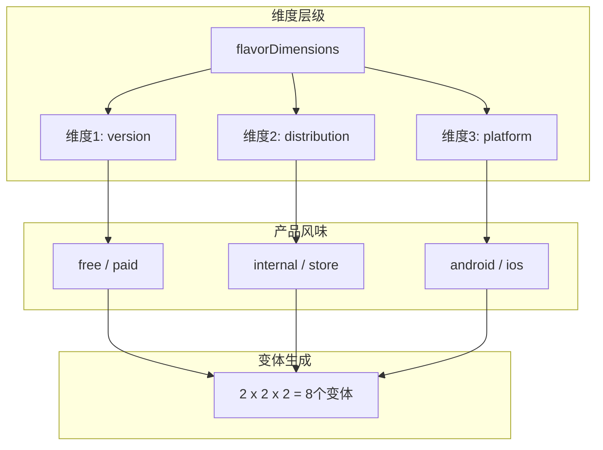
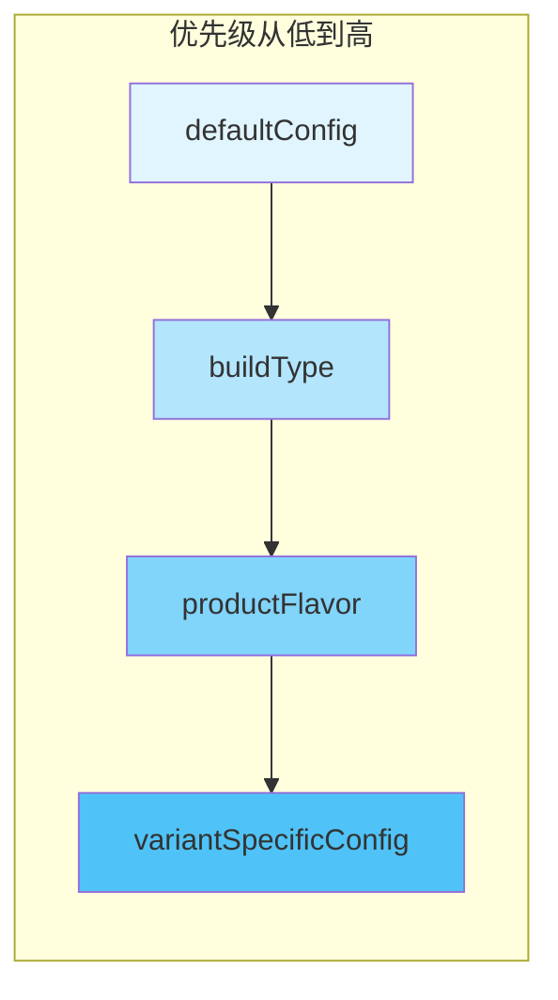

# 21.1.83 应用程序变体尺寸

星空愈发深邃，远处的山峦只剩下黑黢黢的轮廓。湖畔的露营地上，炭火已经变成了温热的余烬，散发着淡淡的橙红色光芒。

洛芙打了个小小的哈欠，揉了揉眼睛：“黛琳，你刚才说的singleVariant我已经明白了……可是我还是不太清楚，这些变体到底是怎么组合出来的？我们之前学的buildType和productFlavor，它们和变体之间是什么关系呀？”

黛琳把笔记本往膝盖上放了放：“你问到这个，就等于问到了变体构建的核心了。走，我们今天来讲讲变体尺寸——VariantDimension。”

---

## 变体尺寸的本质

希尔把手机充电线拔掉，凑过来看屏幕：“让我来给你们演示一下变体尺寸到底是怎么工作的。”

她打开编辑器，调出一段配置代码：

```kotlin
android {
    // 首先定义构建类型
    buildTypes {
        debug {
            isDebuggable = true
            isMinifyEnabled = false
        }
        release {
            isMinifyEnabled = true
            proguardFiles(getDefaultProguardFile("proguard-android-optimize.txt"), "proguard-rules.pro")
        }
    }
    
    // 然后定义产品风味
    flavorDimensions += "version"
    productFlavors {
        free {
            dimension = "version"
            applicationIdSuffix = ".free"
        }
        paid {
            dimension = "version"
            applicationIdSuffix = ".paid"
        }
    }
}
```

洛芙看着代码：“这些我们之前都学过呀……buildType有debug和release，flavor有free和paid。那变体到底是怎么来的？”

黛琳笑了：“问得好。你算算，如果有两个buildType和两个flavor，会产生多少个变体？”

洛芙扳着手指头数起来：“debug+free、debug+paid、release+free、release+paid……4个！”

“没错，”黛琳点头，“这就是变体尺寸的魔法。buildType和productFlavor就像两个不同的维度，它们交叉相乘，就产生了变体。而ApplicationVariantDimension，就是用来配置这些维度的接口。”

伊莎轻声说：“就像纬线和经线交叉形成网格一样~”

“对！”黛琳笑道，“就是这个意思。VariantDimension就是帮我们管理这些‘纬线’和‘经线’的。”

---

## 深入理解维度组合

夜风轻轻吹过，树梢传来一阵沙沙声。洛芙打了个冷战，把腿缩得更靠近炭火余烬。

“黛琳，那如果我有更多的flavor维度呢？”洛芙问，“比如不只是'版本'，还有'渠道'、'功能'什么的？”

黛琳理解地笑了：“这是个好问题。维度可以有很多个，组合出来的变体数量是它们数量的乘积。让我给你演示一下多维度的配置。”

她调出一张白板图：



“你看，”黛琳解释道，“每个flavorDimensions都会产生一组productFlavors。它们组合起来，就是最终的应用变体。”

洛芙惊讶地睁大眼睛：“那如果我有3个维度，每个维度有2个flavor，岂不是有2×2×2=8个变体？”

“完全正确，”黛琳说，“这就是为什么变体管理变得复杂的原因。ApplicationVariantDimension就是来帮我们精细控制这些组合的。”

```kotlin
android {
    // 定义多个风味维度
    flavorDimensions += listOf("version", "distribution", "platform")
    
    productFlavors {
        // 第一个维度：版本
        create("free") {
            dimension = "version"
            applicationIdSuffix = ".free"
        }
        create("paid") {
            dimension = "version"
            applicationIdSuffix = ".paid"
        }
        
        // 第二个维度：分发渠道
        create("internal") {
            dimension = "distribution"
            buildConfigField("String", "CHANNEL", "\"internal\"")
        }
        create("store") {
            dimension = "distribution"
            buildConfigField("String", "CHANNEL", "\"store\"")
        }
        
        // 第三个维度：平台
        create("android") {
            dimension = "platform"
            buildConfigField("String", "PLATFORM", "\"android\"")
        }
    }
}
```

洛芙看着代码：“好复杂……那生成的变体名会是什么样的？”

希尔接管了话题：“问得好！变体名生成的规则是：【flavor1】【flavor2】...【flavor3】【BuildType】，首字母大写。比如：”

```kotlin
// 上面配置会生成以下变体（假设BuildType是debug和release）：
// FreeInternalAndroidDebug
// FreeInternalAndroidRelease
// FreeInternalStoreDebug
// FreeInternalStoreRelease
// FreeStoreAndroidDebug
// FreeStoreAndroidRelease
// PaidInternalAndroidDebug
// PaidInternalAndroidRelease
// PaidInternalStoreDebug
// PaidInternalStoreRelease
// PaidStoreAndroidDebug
// PaidStoreAndroidRelease
// ... 以此类推
```

洛芙吐了吐舌头：“8个flavor × 2个buildType = 16个变体！天啊！”

“所以，”黛琳总结道，“变体尺寸管理是非常重要的。一个好的策略是：只定义必要的维度，不要滥用。”

---

## ApplicationVariantDimension的核心配置

希尔把笔记本转过来，指着屏幕说：“现在我们来看看ApplicationVariantDimension具体能配置什么。”

她调出详细的API配置：

```kotlin
android {
    defaultConfig {
        // 默认配置 - 应用于所有变体
        applicationId = "com.example.myapp"
        minSdk = 24
        targetSdk = 34
    }
    
    // 为特定变体维度配置设置
    applicationVariants.configureEach { variant ->
        println("Configuring variant: ${variant.name}")
    }
}

// 或者在productFlavor中配置
android {
    flavorDimensions += "version"
    
    productFlavors {
        free {
            dimension = "version"
            
            // ApplicationVariantDimension的核心配置
            // 1. 应用ID配置
            applicationId = "com.example.myapp.free"
            applicationIdSuffix = ".free"
            
            // 2. 版本配置
            versionCode = 1
            versionName = "1.0.0"
            
            // 3. 构建配置字段
            buildConfigField("boolean", "IS_PREMIUM", "false")
            buildConfigField("String", "API_BASE_URL", "\"https://api.free.example.com\"")
            
            // 4. 多Dex配置
            multiDexEnabled = false
            
            // 5. 签名配置
            signingConfig = signingConfigs.debug
            
            // 6. ProGuard配置
            proguardFiles("proguard-rules-free.pro")
            
            // 7. 资源裁剪
            resourceConfigurations += listOf("en", "zh-rCN", "ja")
            
            // 8. 维度特定的依赖
            implementation("com.google.firebase:firebase-analytics-free")
        }
        
        paid {
            dimension = "version"
            applicationId = "com.example.myapp.paid"
            applicationIdSuffix = ".paid"
            
            versionCode = 1
            versionName = "1.0.0"
            
            buildConfigField("boolean", "IS_PREMIUM", "true")
            buildConfigField("String", "API_BASE_URL", "\"https://api.paid.example.com\"")
            
            multiDexEnabled = false
            
            signingConfig = signingConfigs.release
            
            proguardFiles("proguard-rules-paid.pro")
            
            resourceConfigurations += listOf("en", "zh-rCN", "ja", "de", "fr", "es")
            
            implementation("com.google.firebase:firebase-analytics")
        }
    }
}
```

洛芙看得入神：“原来变体维度可以配置这么多东西……applicationId、versionCode、资源配置、依赖……那这些配置是怎么生效的？”

黛琳解释道：“每个productFlavor都实现了ApplicationVariantDimension接口，所以你可以为每个flavor单独配置这些属性。当Gradle构建某个具体变体时，它会合并defaultConfig、buildType配置和flavor配置。”

---

## 变体合并规则与优先级

伊莎插话道：“我有个问题~如果我在defaultConfig里设置了applicationId，又在flavor里设置了，会怎么样呀？”

“这是个好问题，”黛琳说，“变体配置有明确的优先级规则。”

她画了一个流程图：



“配置优先级是：defaultConfig < buildType < productFlavor < variantSpecificConfig。也就是说，如果你在flavor里设置了applicationId，它会覆盖defaultConfig里的设置。”

洛芙好奇地问：“那如果我想让某个flavor使用特定的签名配置，但是其他的用默认的，怎么办？”

“很简单，就像代码里写的那样，在flavor里单独指定signingConfig就可以了。”黛琳说。

---

## 实战：多维度变体管理策略

希尔打开了真实项目的配置，给大家演示一个更复杂的例子：

```kotlin
android {
    // 维度定义策略：只定义必要的维度
    flavorDimensions += listOf("environment", "platform")
    
    // 第一个维度：环境（测试/生产）
    productFlavors {
        staging {
            dimension = "environment"
            applicationIdSuffix = ".staging"
            versionNameSuffix = "-staging"
            buildConfigField("String", "BASE_URL", "\"https://staging-api.example.com\"")
            buildConfigField("Boolean", "ENABLE_LOGGING", "true")
            
            // 测试环境使用测试服务器签名
            signingConfig = signingConfigs.debug
        }
        
        production {
            dimension = "environment"
            buildConfigField("String", "BASE_URL", "\"https://api.example.com\"")
            buildConfigField("Boolean", "ENABLE_LOGGING", "false")
            
            // 生产环境使用发布签名
            signingConfig = signingConfigs.release
        }
    }
    
    // 第二个维度：平台版本
    productFlavors {
        create("standard") {
            dimension = "platform"
            // 标准版配置
            buildConfigField("Boolean", "IS_PREMIUM", "false")
            applicationIdSuffix = ".standard"
        }
        
        create("premium") {
            dimension = "platform"
            // 高级版配置
            buildConfigField("Boolean", "IS_PREMIUM", "true")
            applicationIdSuffix = ".premium"
        }
    }
    
    buildTypes {
        debug {
            isDebuggable = true
            isMinifyEnabled = false
        }
        release {
            isMinifyEnabled = true
            proguardFiles(getDefaultProguardFile("proguard-android-optimize.txt"), "proguard-rules.pro")
        }
    }
}
```

“这样配置会产生4个基础变体×2个buildType=8个最终变体。”希尔解释道。

洛芙扳着手指头数：“stagingStandardDebug、stagingStandardRelease、stagingPremiumDebug、stagingPremiumRelease、productionStandardDebug、productionStandardRelease、productionPremiumDebug、productionPremiumRelease……8个！”

“对，”希尔笑着说，“但实际上，你可能不需要发布所有这些。你可以用之前学的singleVariant来选择发布哪些。”

黛琳补充道：“这就是为什么变体管理需要策略。太多的变体会导致构建时间变长、测试工作量增加。通常建议：”

```kotlin
android {
    publishing {
        // 只发布生产环境的release版本
        singleVariant("productionRelease") {
            enable = true
            generateApk = true
            generateAab = true
        }
        
        // staging的debug版本用于内部测试
        singleVariant("stagingDebug") {
            enable = true
            generateApk = true
            generateAab = false
        }
    }
}
```

---

## 动态配置与变体过滤

洛芙突然想到一个问题：“黛琳，如果我有些变体不想要，能不能不要生成？”

“问得好！”黛琳说，“这就要用到变体过滤了。”

她调出变体过滤的代码：

```kotlin
android {
    // 变体过滤 - 排除不需要的变体
    applicationVariants.configureEach { variant ->
        val flavorNames = variant.productFlavors.map { it.name }
        
        // 过滤条件示例
        when {
            // 排除所有包含 "staging" 且是 release 的变体
            flavorNames.contains("staging") && variant.buildType.name == "release" -> {
                variant.enable = false
            }
            
            // 排除 premium + debug 组合（测试用标准版就够了）
            flavorNames.contains("premium") && variant.buildType.name == "debug" -> {
                variant.enable = false
            }
            
            // 排除任何免费的 release 版本（免费版只做debug测试）
            flavorNames.contains("free") && variant.buildType.name == "release" -> {
                variant.enable = false
            }
        }
    }
}
```

洛芙惊讶地说：“这样就可以动态控制变体的生成了！那我可以在debug版本里生成所有变体用于测试，但在发布时只生成需要的变体？”

“完全正确，”黛琳说，“这就是ApplicationVariantDimension和变体过滤的组合威力。”

---

## 变体命名约定的最佳实践

希尔补充道：“还有一点很重要，就是变体的命名约定。一个好的命名约定可以让变体管理更清晰。”

```kotlin
android {
    // 推荐使用下划线分隔的命名风格
    // 风格：[环境]_[平台]_[特殊标识]Debug/Release
    
    // 好例子：
    // staging_standard_debug
    // staging_premium_release
    // production_standard_debug
    // production_premium_release
    
    // 避免：
    // StagingDebug (不清晰)
    // ProdStdRel (难以理解)
    // Premium (缺少环境信息)
    
    // 配置示例
    flavorDimensions += listOf("environment", "tier")
    
    productFlavors {
        // 环境维度
        staging { dimension = "environment" }
        production { dimension = "environment" }
        
        // 级别维度  
        standard { dimension = "tier" }
        premium { dimension = "tier" }
    }
}
```

伊莎轻声说：“清晰的命名，就像给每个露营装备贴上标签一样~”

“对，”黛琳笑了，“这样团队里的每个人都能一眼看出每个变体是什么用途。”

---

## 本章小结

洛芙仰头看着星空，长长地呼出一口气。

“所以，ApplicationVariantDimension就是……”

黛琳接话道：“就是用来配置每个变体维度的核心接口。它定义了如何设置applicationId、versionCode、资源配置、依赖等等。当buildType和productFlavor交叉组合时，VariantDimension的配置就会被应用上去。”

洛芙点头：“我明白了！buildType是横轴，flavorDimensions是纵轴，VariantDimension就是每个交叉点上的配置！”

“太对了！”希尔笑着说，“你现在已经是变体大师了！”

洛芙挠挠头，有些不好意思地笑了。远处传来几声虫鸣，夜色愈发深沉，但她的心里却亮堂得很。

---

> 本章介绍了ApplicationVariantDimension的核心概念与配置方法。变体尺寸是Android Gradle构建系统的核心概念，它与BuildType和ProductFlavor共同决定了最终生成的应用程序变体数量和配置。掌握好维度的规划和变体过滤，可以让构建配置既灵活又高效。

## 洛芙的小小日记本

今天学会了变体尺寸！原来buildType和flavor交叉组合就是变体，每个交叉点都可以单独配置——applicationId、签名、资源、依赖……黛琳说不要滥用维度，不然变体会指数增长。8个变体×2个buildType=16个，听起来就头大！还好有变体过滤可以控制生成哪些。看来构建配置也是一门艺术呀~🌙

---

## 今日关键词

**ApplicationVariantDimension**：Android Gradle DSL接口，用于配置应用程序变体维度的属性，如applicationId、versionCode、签名配置等。

**flavorDimensions**：定义产品风味的维度，每个维度会产生一组flavor，多个维度组合生成变体。

**productFlavors**：产品风味配置块，每个flavor对应一个维度值，如free/paid、staging/production。

**buildTypes**：构建类型配置，如debug、release，决定是否启用调试、混淆等。

**variant**：构建变体，由buildType和所有productFlavor组合而成的具体构建版本。

**applicationIdSuffix**：应用ID后缀，用于区分同一基础applicationId的不同变体。

**signingConfig**：签名配置，指定用于签署APK/AAB的密钥和证书。

**buildConfigField**：构建配置字段，在BuildConfig类中生成静态常量，供代码运行时读取。

**resourceConfigurations**：资源过滤配置，指定包含哪些语言/资源配置。

**multiDexEnabled**：是否启用多Dex，用于解决65536方法数限制。

**variant.enable**：变体启用开关，用于过滤掉不需要生成的变体。

**singleVariant**：单变体发布配置，用于选择哪些变体参与发布。
