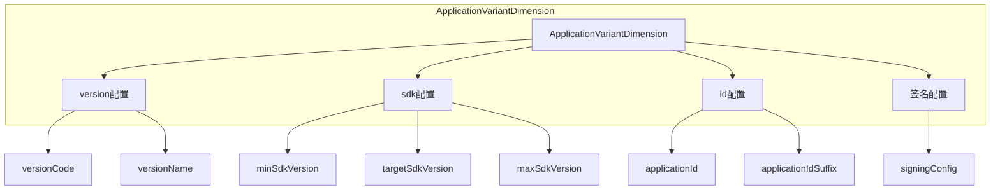
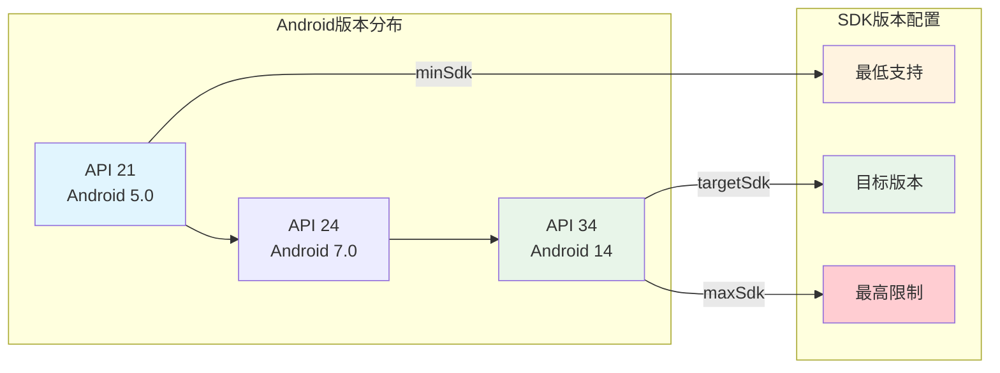
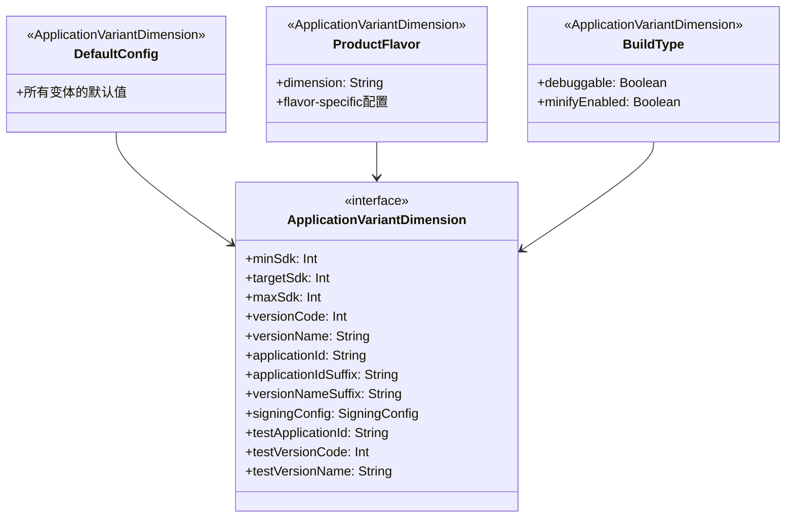

# 21.1.83 应用变体尺寸

银河在天空中缓缓流淌，像是被揉碎了的钻石洒在天鹅绒上。露营地上的炭火已经彻底冷却，只剩下微微发白的灰烬。

洛芙把手机放在膝盖上，屏幕上的代码在黑暗中发出柔和的光。"黛琳，我有个问题，"她抬起头，"你说.singleVariant是控制单个变体怎么输出，那……如果我想让不同的变体面向不同的用户，比如免费版和付费版，它们的那些版本号啊、应用ID啊，该怎么分别设置？"

黛琳正在整理背包，，听到这话手上一顿。"你问得很深入嘛，"她笑了笑，把最后一件东西塞进背包，"免费版和付费版——这个在Android里，就是ProductFlavor要解决的问题。而具体到每个版本怎么配置它的'身份证'，就是今天要学的ApplicationVariantDimension了。"

伊莎已经把睡袋铺好了，听到这话又坐了起来："Variant Dimension……变体的尺寸？好有意思的名字~"

"不是'尺寸'啦，"希尔正在笔记本电脑上敲代码，抬起头来解释道，"Dimension是'维度'的意思。就像一个立方体有长、宽、高三个维度，我们的App也可以有不同的'维度'来区分版本——比如按地区分、按功能分、按收费方式分……每个维度都可以单独配置。"

洛芙似懂非懂地点点头："所以……VariantDimension就是给这些维度配置具体参数的？"

"对，"黛琳打了个响指，"比如版本号是多少、应用ID是什么、最低SDK版本是多少……这些都属于VariantDimension的配置范畴。"

---

## 变体维度的核心概念

夜已经很深了，但四个女孩毫无睡意。黛琳把白板支起来，在上面画了一个简单的示意图。

"在Android Gradle Plugin里，"她一边画一边解释，"ApplicationVariantDimension是一个接口，它定义了单个变体的所有可配置属性。你可以把它想象成——每个变体的'身份证'，上面记录着这个变体的一切身份信息。"



"这张图就是VariantDimension能配置的所有大类，"黛琳说，"希尔，来给她演示一下具体怎么写代码。"

希尔把笔记本转过来："看好了，这就是最基础的VariantDimension配置——在android {}块里的defaultConfig {}。"

```kotlin
android {
    namespace "com.camping.app"
    compileSdk = 34

    defaultConfig {
        // 最低支持的Android版本
        minSdk = 24
        
        // 目标SDK版本
        targetSdk = 34
        
        // 版本号（整数，每次更新必须增大）
        versionCode = 1
        
        // 版本名称（用户可见的版本字符串）
        versionName = "1.0.0"
        
        // 应用ID（应用的唯一标识）
        applicationId = "com.camping.app"
        
        // 测试应用ID（用于测试变体）
        testApplicationId = "com.camping.app.test"
        
        // 测试版本Code
        testVersionCode = 1
        
        // 测试版本名称
        testVersionName = "1.0.0"
    }
}
```

洛芙盯着代码看了半天："这个defaultConfig……是所有变体都会用的默认配置吗？"

"聪明，"黛琳笑了，"defaultConfig就是'默认值'。如果你不为某个特定的flavor或buildType单独配置，这些就是它们会用的默认值。就像酒店的基准房型——价格、面积都是标准的，除非你升级到套房。"

---

## 多维度配置：ProductFlavor

伊莎托着腮帮子："那……如果我想同时区分'免费版'和'付费版'，该怎么写？"

希尔眼睛一亮："问得好！这就要用到productFlavors了。"

她噼里啪啦地敲出一段代码：

```kotlin
android {
    // 首先定义有哪些维度
    flavorDimensions += "version"  // 版本维度
    flavorDimensions += "region"   // 地区维度

    productFlavors {
        // 免费版
        create("free") {
            dimension = "version"
            
            // 免费版的应用ID后缀
            applicationIdSuffix = ".free"
            
            // 版本名称添加标识
            versionNameSuffix = "-free"
            
            // 免费版版本号基准（会在后面加上flavor的版本）
            versionCode = 100
        }
        
        // 付费版
        create("paid") {
            dimension = "version"
            applicationIdSuffix = ".paid"
            versionNameSuffix = "-paid"
            versionCode = 200
        }
        
        // 国内版
        create("cn") {
            dimension = "region"
            // 国内版可能需要不同的应用ID
            // 这里我们把region维度的配置和version维度组合
        }
        
        // 海外版
        create("overseas") {
            dimension = "region"
        }
    }
}
```

洛芙看着代码："我看到了！applicationIdSuffix是在应用ID后面加东西。那最终的applicationId会变成什么样？"

希尔运行了一下gradle tasks，给她看实际生成的应用ID：

```
$ ./gradlew tasks --group=build

# 生成的变体组合：
# freeCnDebug, freeCnRelease
# freeOverseasDebug, freeOverseasRelease
# paidCnDebug, paidCnRelease
# paidOverseasDebug, paidOverseasRelease

# 对应的applicationId：
# freeCnDebug:     com.camping.app.free.cn
# freeCnRelease:  com.camping.app.free.cn
# freeOverseasDebug:  com.camping.app.free.overseas
# freeOverseasRelease: com.camping.app.free.overseas
# paidCnDebug:     com.camping.app.paid.cn
# paidCnRelease:  com.camping.app.paid.cn
# paidOverseasDebug:  com.camping.app.paid.overseas
# paidOverseasRelease: com.camping.app.paid.overseas
```

"原来如此！"洛芙惊叹道，"不同的flavor组合会生成不同的applicationId，这样就能同时发布到应用商店了！"

伊莎轻声说："就像不同的航线——免费航线和付费航线，国内航线和国际航线，每条航线都有自己独特的航班号~"

---

## 为每个Flavor单独配置

黛琳见洛芙理解了基本的flavor概念，便进一步深入："但是有时候，免费版和付费版不仅仅是应用ID不同，它们可能需要完全不同的SDK版本、不同的资源、甚至不同的代码。"

"啊？"洛芙愣了一下，"还能这样？"

希尔笑着点头："当然可以。每个flavor都可以有自己完整的VariantDimension配置。"

```kotlin
productFlavors {
    // 免费版
    create("free") {
        dimension = "version"
        applicationIdSuffix = ".free"
        versionNameSuffix = "-free"
        
        // 免费版特有的配置
        minSdk = 21          // 免费版支持更低的系统版本
        targetSdk = 34
        versionCode = 100
        
        // 免费版使用一套签名
        signingConfig = signingConfigs.debug
        
        // 启用一些付费功能（但运行时检查）
        // 这里只是构建配置，实际功能在代码里判断
    }
    
    // 付费版
    create("paid") {
        dimension = "version"
        applicationIdSuffix = ".paid"
        versionNameSuffix = "-paid"
        
        // 付费版可以要求更高的系统版本
        minSdk = 24          // 付费版需要稍微新一点的系统
        targetSdk = 34
        versionCode = 200
        
        // 付费版使用正式签名
        signingConfig = signingConfigs.release
    }
}
```

洛芙认真地看着代码："我注意到paid版本没有设置testApplicationId……"

"观察得很仔细！"黛琳赞许地说，"如果不单独设置，testApplicationId会自动在applicationId后面加上.test后缀。比如paid版本的就是com.camping.app.paid.test。"

---

## SDK版本配置的学问

夜风轻轻吹过，带着湖水特有的凉意。洛芙缩了缩脖子，把腿收得更靠近膝盖。

"黛琳，我有个问题，"她说，"minSdk、targetSdk、maxSdk这三个，到底有什么区别？为什么有时候看到不同的配置？"

黛琳在白板上画了一个简单的图：



"minSdk是你声明的'最低门槛'，"黛琳解释道，"低于这个版本的设备，你的App不会在应用商店向他们展示。"

洛芙点头："就像游乐园的最低身高要求？"

"太对了！"希尔插嘴道，"低于1.2米的小朋友，很多刺激的项目都不能玩。"

"targetSdk呢？"洛芙又问。

"targetSdk是你的'目标版本'，"黛琳说，"你告诉系统，我的App是为这个版本的系统设计的。系统会根据这个来启用兼容行为。比如你的App在Android 14上运行良好，targetSdk设为34，系统就会用最新的行为模式来运行它。"

伊莎好奇地问："那maxSdk呢？很少看到这个配置~"

"maxSdk是'最高限制'，"黛琳说，"基本上很少用。它声明你的App最高支持到哪个版本。超过这个版本的设备，应用商店不会展示。这个主要是一些特殊场景，比如你的App用到了某个即将被废弃的API，新的系统版本已经移除了它，你暂时没时间适配……"

"原来如此！"洛芙长舒一口气，"感觉这些SDK版本配置就像……给不同体型的游客准备不同大小的救生衣？"

"这个比喻太恰当了！"黛琳笑道，"minSdk是身体尺寸，targetSdk是最合身的尺寸，maxSdk是最高上限。"

---

## 构建类型与变体维度

希尔见大家聊得差不多了，便把话题引向另一个重要概念："对了，说了flavor，再来说说BuildType——构建类型。这也是一个重要的'维度'。"

```kotlin
buildTypes {
    debug {
        // 调试版本的应用ID后缀
        applicationIdSuffix = ".debug"
        
        // 调试版本的版本名称后缀
        versionNameSuffix = "-debug"
        
        // 是否可调试
        debuggable = true
        
        // 是否混淆
        minifyEnabled = false
        
        // 是否启用dex分包
        multiDexEnabled = false
    }
    
    release {
        // 发布版本不添加后缀
        // applicationIdSuffix = ""  // 默认没有
        
        // 发布版本名称后缀
        versionNameSuffix = ""
        
        // 是否可调试
        debuggable = false
        
        // 是否启用混淆
        minifyEnabled = true
        
        // 是否启用dex分包
        multiDexEnabled = true
        
        // 压缩级别
        shrinkResources = true
        
        // 混淆文件
        proguardFiles(
            getDefaultProguardFile("proguard-android-optimize.txt"),
            "proguard-rules.pro"
        )
    }
}
```

洛芙看着代码："所以debug和release的区别，主要在于能否调试、是否混淆……还有应用ID？"

"对，"希尔说，"你注意看，debug版本会有'.debug'后缀。这样你就可以同时在手机上安装调试版和正式版，不会冲突——它们是两个不同的应用。"

"就像同时拥有训练模式和正式比赛模式！"伊莎眼睛亮晶晶的，"运动员可以在训练场上随便折腾，但正式比赛时用的是另一套装备~"

---

## 多维度组合的化学反应

黛琳见时间已经过去很久，但洛芙的眼神里还有探索的欲望，便决定再深入一点："洛芙，如果我把flavor和buildType组合起来，你觉得会发生什么？"

洛芙想了想："应该就是……每个flavor都有自己的debug和release版本？"

"没错！"黛琳打了个响指，"而且每个组合都可以单独配置。让我给你看一个更复杂的例子。"

```kotlin
android {
    // 定义两个维度
    flavorDimensions += "version"
    flavorDimensions += "content"

    productFlavors {
        // 免费版 + 基础内容
        create("free") {
            dimension = "version"
            applicationIdSuffix = ".free"
            versionNameSuffix = "-free"
            versionCode = 100
        }
        
        // 付费版 + 完整内容
        create("paid") {
            dimension = "version"
            applicationIdSuffix = ".paid"
            versionNameSuffix = "-paid"
            versionCode = 200
        }
        
        // 基础内容版
        create("basic") {
            dimension = "content"
            // 不改变applicationId，只是资源/代码上的区别
        }
        
        // 完整内容版
        create("full") {
            dimension = "content"
        }
    }
    
    buildTypes {
        debug {
            applicationIdSuffix = ".debug"
            versionNameSuffix = "-DEBUG"
            debuggable = true
        }
        release {
            debuggable = false
            minifyEnabled = true
        }
    }
}
```

希尔运行构建，给洛芙看生成的所有变体：

```
$ ./gradlew tasks | grep -i assemble

# 生成的变体（维度组合 + 构建类型）：
# freeBasicDebug, freeBasicRelease
# freeFullDebug, freeFullRelease
# paidBasicDebug, paidBasicRelease
# paidFullDebug, paidFullRelease

# 对应的应用ID：
# freeBasicDebug:     com.camping.app.free.basic.debug
# freeBasicRelease:  com.camping.app.free.basic
# freeFullDebug:     com.camping.app.free.full.debug
# freeFullRelease:  com.camping.app.free.full
# paidBasicDebug:     com.camping.app.paid.basic.debug
# paidBasicRelease:  com.camping.app.paid.basic
# paidFullDebug:     com.camping.app.paid.full.debug
# paidFullRelease:  com.camping.app.paid.full
```

洛芙看得目瞪口呆："四个flavor乘以两个buildType，就是八个变体！而且每个都有自己独特的应用ID……"

"这就是VariantDimension的强大之处，"黛琳微笑着说，"你完全可以按照自己的产品策略，精细地定义每一个变体的'身份'。"

---

## 常见的配置陷阱

希尔突然严肃起来："对了，说到VariantDimension配置，有几个常见的坑一定要提醒你们。"

她在白板上写了一个"❌"：

**反模式一：版本号冲突**

```kotlin
// ❌ 错误：所有flavor使用相同的versionCode
productFlavors {
    create("free") {
        versionCode = 1  // 冲突！
    }
    create("paid") {
        versionCode = 1  // 再次冲突！
    }
}
```

"如果所有flavor都用相同的versionCode，"希尔解释道，"当你同时发布到应用商店时，系统会认为这是同一个App的更新，导致用户更新后安装了错误的版本。"

**正确做法：为每个flavor分配独立的版本号区间**

```kotlin
// ✅ 正确：为每个flavor分配独立的版本号段
productFlavors {
    create("free") {
        versionCode = 100  // 免费版：100-199
    }
    create("paid") {
        versionCode = 200  // 付费版：200-299
    }
}
```

---

**反模式二：applicationIdSuffix使用不当**

```kotlin
// ❌ 错误：release版本也加suffix，导致正式包和应用商店的不一致
buildTypes {
    release {
        applicationIdSuffix = ".release"  // 不推荐！
    }
}
```

"applicationIdSuffix只在debug版本使用，"希尔说，"正式发布版本不应该加后缀，否则会导致签名不一致的问题。"

---

**反模式三：混淆minSdk和targetSdk的作用**

```kotlin
// ❌ 错误：以为targetSdk越高越好
defaultConfig {
    minSdk = 21
    targetSdk = 999  // 错误！这没有意义
}
```

"targetSdk应该设置为你实际测试过的最高版本，"希尔解释道，"设置一个不存在的版本号没有任何好处。"

---

洛芙认真地记下这些教训："原来配置也有这么多讲究……"

---

## 运行时的变体识别

伊莎突然想到一个问题："对了，如果我们想在代码里判断当前是哪个变体，该怎么做？"

希尔笑着点头："这也是个很实用的问题。你可以在BuildConfig里找到所有变体信息。"

```kotlin
// 在代码中获取当前变体的信息
object BuildInfo {
    fun printVariantInfo() {
        println("=== 当前变体信息 ===")
        println("应用ID: ${BuildConfig.APPLICATION_ID}")
        println("版本号: ${BuildConfig.VERSION_CODE}")
        println("版本名称: ${BuildConfig.VERSION_NAME}")
        println("构建类型: ${BuildConfig.BUILD_TYPE}")
        println("Flavor: ${BuildConfig.FLAVOR}")
        println("是否调试版本: ${BuildConfig.DEBUG}")
    }
}
```

"BuildConfig是Gradle自动生成的类，"希尔补充道，"它包含了所有你定义的variant信息。"

运行输出：

```
=== 当前变体信息 ===
应用ID: com.camping.app.free.paid.debug
版本号: 101
版本名称: 1.0.0-free-paid-DEBUG
构建类型: debug
Flavor: freePaid
是否调试版本: true
```

洛芙惊喜地说："这样就能在代码里根据不同的版本来做不同的事情！比如免费版不显示某些功能~"

---

夜已经很深了。银河完美地横跨天际，偶尔有一两颗流星划过，留下转瞬即逝的光痕。

黛琳抬头看了看天："好了，今天我们学了ApplicationVariantDimension——应用变体维度的配置。简单来说，它就是每个变体的'身份证'，记录着版本号、SDK版本、应用ID这些关键信息。"

洛芙伸了个懒腰："感觉像是给每个版本的App都发了一张身份证……免费版和付费版、国内版和海外版，每个都有自己独特的身份~"

伊莎轻声说："就像世界上没有两片完全相同的雪花，每个变体也都是独一无二的~"

希尔收拾着笔记本电脑："variantDimension配合flavor和buildType，可以组合出非常复杂的变体矩阵。企业级应用经常用这种方式来管理不同渠道、不同客户群体的版本。"

炭火已经完全冷却，但女孩们的收获，却比那炭火还要温暖实在。星星在天空中继续它们的旅程，就像Android系统里的各个组件，各司其职，井然有序。

---

## 专业技术总结

> **ApplicationVariantDimension** — Android Gradle Plugin 中用于配置单个构建变体身份属性的 DSL 接口。它定义了每个变体的版本信息（versionCode、versionName）、SDK版本（minSdk、targetSdk、maxSdk）、应用标识（applicationId）以及签名配置等核心属性。

#### 结构图



#### 复杂度与影响

- **变体数量计算**：flavor维度数 × flavor选项数 × buildType数量 = 总变体数
- **构建时间影响**：变体数量越多，构建时间越长，建议使用variantFilter过滤不需要的组合
- **应用商店发布**：每个唯一applicationId对应一个独立的应用商店条目

#### 反模式与陷阱

1. **所有flavor使用相同versionCode** → 导致应用商店更新冲突
2. **release版本添加applicationIdSuffix** → 导致签名不一致
3. **混淆minSdk和targetSdk的作用** → 设置不合理的SDK版本
4. **不设置versionCode** → 应用商店无法更新
5. **targetSdk设置为过高的不存在版本** → 没有任何实际意义

#### 设计哲学

- **版本号分段策略**：为不同flavor分配独立的versionCode区间（如100-199、200-299）
- **applicationId唯一性**：确保每个发布的变体有唯一的applicationId
- **SDK版本合理性**：minSdk基于用户覆盖率，targetSdk基于实际测试
- **构建类型分离**：debug用于开发测试，release用于正式发布

---

> 学习建议：理解VariantDimension的配置是构建多渠道、多版本App的基础。建议先从单个维度开始实验，掌握后再逐步增加复杂度。记得为每个flavor分配独立的versionCode段，避免发布冲突。

---

## 🏕️ 动手练习

**目标**：掌握ApplicationVariantDimension的核心配置技能

**Task 1：基础VariantDimension配置**

1. 在Android项目中打开app/build.gradle.kts
2. 在android {}块中配置defaultConfig {}
3. 设置minSdk = 24、targetSdk = 34、versionCode = 1、versionName = "1.0.0"
4. 运行`./gradlew assembleDebug`验证构建

**验收标准**：
- [ ] defaultConfig配置正确
- [ ] 构建成功生成APK
- [ ] BuildConfig中包含正确的版本信息

**Task 2：多flavor配置**

1. 添加两个productFlavor：demo和full
2. 为demo版本设置applicationIdSuffix = ".demo"，versionCode = 100
3. 为full版本设置applicationIdSuffix = ".full"，versionCode = 200
4. 分别构建两个flavor的release版本

**验收标准**：
- [ ] 生成demoRelease和fullRelease两个变体
- [ ] 两个变体的applicationId不同
- [ ] 两个变体的versionCode不同

**Task 3：构建类型配置**

1. 在buildTypes中添加preRelease变体
2. 设置preRelease使用release签名但保留调试符号
3. 配置applicationIdSuffix = ".pre"

**验收标准**：
- [ ] preRelease变体可以构建
- [ ] 应用ID带有.pre后缀
- [ ] 混淆被启用

**Task 4：变体信息运行时获取**

1. 在MainActivity中添加代码读取BuildConfig信息
2. 在Log中打印当前变体的applicationId、versionCode、versionName
3. 运行debug版本验证输出

**验收标准**：
- [ ] Logcat正确输出变体信息
- [ ] 信息与build.gradle.kts中的配置一致

**Task 5：Flavor组合实战**

1. 定义两个维度：version和platform
2. version维度：free、paid
3. platform维度：android、ios（模拟）
4. 观察生成的变体数量和applicationId

**验收标准**：
- [ ] 生成4个flavor组合
- [ ] 每个组合有debug和release，共8个变体

---

#### 面试热身

- Q1: minSdk和targetSdk的区别是什么？分别在什么场景下设置？
- Q2: 如何避免多个flavor的versionCode冲突？
- Q3: applicationId和applicationIdSuffix的关系是什么？
- Q4: 什么时候应该使用productFlavor而不是buildType？
- Q5: 解释flavorDimensions的作用以及如何规划维度？

---

#### 参考实现要点

1. 为每个flavor分配独立的versionCode段（如100-199、200-299），避免发布冲突
2. debug版本必须添加applicationIdSuffix，release版本不应添加
3. minSdk基于目标用户群体的设备覆盖率，通常设置为21-24
4. targetSdk设置为实际测试过的最高稳定版本，不追求最新
5. 使用BuildConfig在代码中判断当前变体，实现差异化功能
6. 复杂的变体矩阵使用variantFilter过滤不需要的组合，节省构建时间
7. 签名配置在buildTypes中设置，flavor中可覆盖

---

## 洛芙的小小日记本

今天又学到了好厉害的东西！VariantDimension——变体维度，原来每个版本的App都有自己的"身份证"！版本号、应用ID、SDK版本……这些组合起来，就能生成面向不同用户的不同版本。

黛琳说免费版用100-199的版本号，付费版用200-299，这样就不会冲突了。好有道理！感觉Gradle真的很强大，可以精细控制这么多东西~

明天还会学什么呢？好期待呀~ 🌙

---

## 今日关键词

- **ApplicationVariantDimension**：Android Gradle Plugin中配置单个变体身份属性的DSL接口
- **defaultConfig**：所有变体使用的默认配置
- **productFlavors**：产品风味，用于创建不同版本的App
- **flavorDimensions**：变体维度，定义flavor的分类方式
- **buildTypes**：构建类型，debug或release
- **versionCode**：版本号（整数），应用商店更新用
- **versionName**：版本名称（字符串），用户可见
- **applicationId**：应用ID，应用的唯一标识
- **applicationIdSuffix**：应用ID后缀
- **versionNameSuffix**：版本名称后缀
- **minSdk**：最低SDK版本
- **targetSdk**：目标SDK版本
- **maxSdk**：最高SDK版本
- **signingConfig**：签名配置
- **BuildConfig**：Gradle自动生成的构建配置类
- **variantFilter**：变体过滤器，用于排除不需要的组合
- **多维度组合**：flavor × buildType = 总变体数
