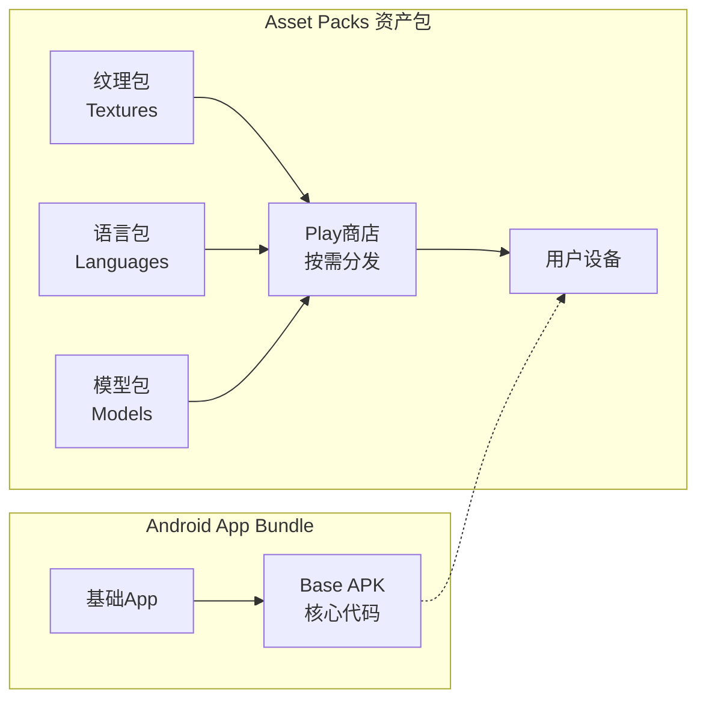
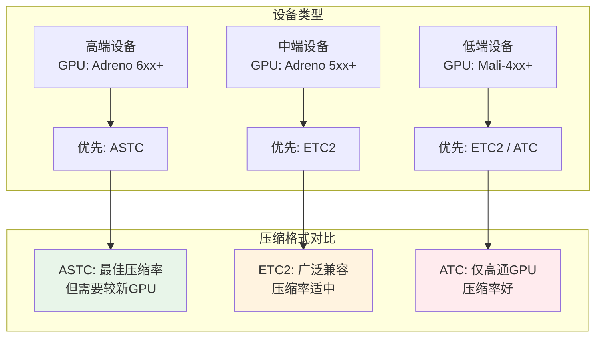
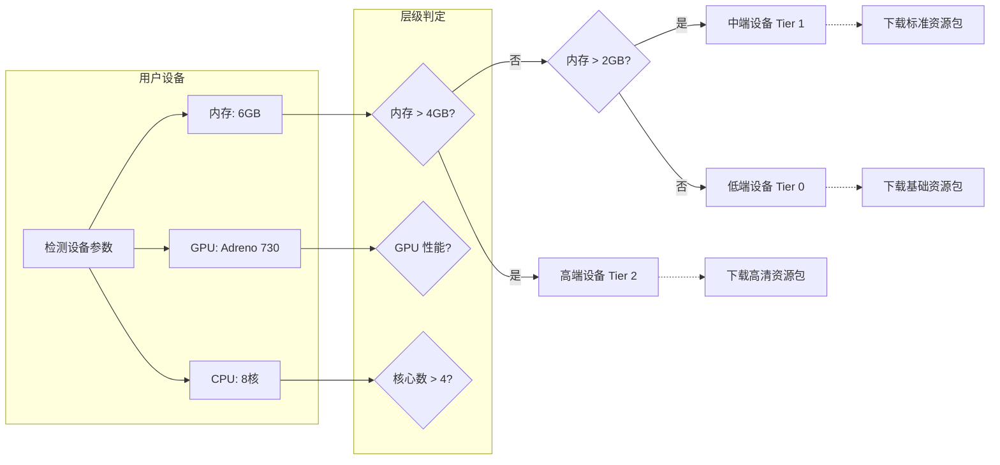

# 21.1.84 AssetPackBundleExtension

晨雾像轻纱一样笼罩着湖面。

洛芙睁开酸涩的眼睛，发现天边已经泛起了鱼肚白。守夜的希尔不知什么时候靠在大树上睡着了，黛琳正轻轻地把睡袋往洛芙身边挪了挪。

“醒了？”伊莎递过来一个温热的保温杯，“温度刚好。”

洛芙接过杯子，感受着杯壁传来的温度：“黛琳呢？”

“那儿呢。”伊莎下巴往白板的方向点了点。

黛琳不知什么时候已经架好了白板，正低头在上面画着什么。晨光穿过薄雾，在白板上投下柔和的光晕。

“黛琳，又在画什么好东西呢？”洛芙凑过去好奇地问。

“在画我们今天要讲的东西。”黛琳抬起头，嘴角带着笑意，“你昨天不是问我，如果有些资源很大，比如游戏纹理、3D模型、语音包什么的，怎么办吗？”

洛芙眼睛一亮：“对呀！总不能把所有资源都塞进apk里吧？用户下载会很大的！”

“所以呀，”黛琳笑了笑，“今天我们来讲讲Asset Pack——资产包。这是Android App Bundle的一个重要特性，可以让大型资源在用户需要时再下载，而不是一开始就打包进应用里。”

---

## 资产包的基本概念

希尔不知什么时候醒了，揉着眼睛凑过来：“asset pack？这个我懂！就像你买了一个游戏本体，然后要下载额外的 DLC 一样！”

“对！”黛琳笑着说，“Asset Pack就是这种思路。它允许你把大型资源（ textures 纹理、models 模型、language packs 语言包、AI models 机器学习模型等）单独打包，用户在需要时再从Play商店下载。”

她指着白板上画的图示解释道：



“你看，”黛琳解释道，“传统的APK会把所有资源都打包进去，用户一下载就是几百MB。但用Asset Pack，你可以把大型资源拆分成独立的包，用户需要什么再下载什么。”

洛芙好奇地问：“那这些资产包是怎么配置的呢？”

“这就要用到AssetPackBundleExtension了。”黛琳说，“它是Android Gradle DSL的一个接口，专门用来配置Asset Pack的行为。”

---

## AssetPackBundleExtension的核心配置

希尔打开笔记本，调出配置代码：“让我来给你们演示一下AssetPackBundleExtension都能配置些什么。”

```kotlin
android {
    // 在 app 模块的 build.gradle 中配置 assetPack
    androidResources {
        // 配置 asset pack
        assetPacks = listOf(":texture_pack", ":language_pack")
    }
}

// 在 asset pack 模块中配置
android {
    // AssetPackBundleExtension 的核心属性
    
    // 1. 资产包名称
    // 打包后生成的资产包名称
    
    // 2. 分发模式
    // onDemand: 按需下载（默认）
    // installTime: 安装时一起下载
    // fastFollow: 安装后快速跟进下载
    packaging {
        jniLibs {
            useLegacyPackaging = true
        }
    }
}
```

黛琳补充道：“AssetPackBundleExtension主要提供以下几个关键配置：”

她扳着手指头数起来：

“**aiModelVersion** —— 配置AI模型版本，用于机器学习模型的版本管理；**countrySet** —— 限定资产包只在特定国家/地区分发；**deviceTier** —— 根据设备性能层级（低端/中端/高端）分发不同的资源包；**signingConfig** —— 资产包的签名配置；**texture** —— 纹理压缩格式配置；**assetPacks** —— 关联的资产包列表。”

洛芙歪着头问：“这些配置具体怎么用呀？”

“别急，”黛琳笑着说，“我们一个个来看。”

---

## 纹理包配置（Texture Compression）

希尔调出纹理包的配置示例：“先说纹理包，这是游戏开发中最常用的场景。”

```kotlin
android {
    // 纹理包模块的 build.gradle
    android {
        defaultConfig {
            // 纹理包配置
            texture {
                // 指定支持的纹理压缩格式
                formats = listOf(
                    TextureFormat.ATC,        // AMD Texture Compression
                    TextureFormat.ETC2,       // Ericsson Texture Compression 2
                    TextureFormat.ASTC        // Adaptive Scalable Texture Compression
                )
                
                // 纹理压缩格式优先级（Play商店会根据设备特性选择最合适的）
                // 从高到低排序
                formatPriorities = listOf(
                    TextureFormatPriority.HIGH,
                    TextureFormatPriority.MEDIUM,
                    TextureFormatPriority.LOW
                )
            }
        }
    }
    
    // AssetPackBundleExtension 的纹理配置
    texture {
        // 是否允许纹理压缩格式降级
        // 例如：设备不支持ASTC时，自动降级到ETC2
        allowFormatFallback = true
        
        // 纹理包的目标设备级别
        // all: 所有设备
        // premium: 高端设备（GPU性能强）
        targetDeviceClass = DeviceClass.PREMIUM
    }
}
```

洛芙看着代码：“这个纹理压缩格式……有什么讲究吗？”

“讲究大了！”希尔兴奋地说，“不同的GPU支持不同的纹理压缩格式。用对了，纹理加载快、内存占用少；用错了，纹理根本显示不了！”

她画了一个图来解释：



“你看，”希尔解释道，“ASTC是目前最先进的纹理压缩格式，压缩率高，画质好，但需要比较新的GPU。ETC2兼容性最好，几乎所有设备都支持。ATC则是高通的专属格式。”

洛芙点头：“原来如此！所以要配置多个格式，让Play商店根据设备自动选择！”

“没错！”希尔笑着说，“这就是AssetPackBundleExtension的智能之处。”

---

## 设备层级配置（Device Tier）

黛琳接过话题：“说完纹理，我们来说设备层级。这个功能非常强大，可以让同一个应用在不同性能的手机上呈现不同的效果。”

她调出配置代码：

```kotlin
android {
    // 设备层级配置
    deviceTier {
        // 启用设备层级筛选
        enableDeviceTier = true
        
        // 定义层级
        tiers = listOf(
            // 低端设备：只包含基础资源
            DeviceTierConfig {
                tierRank = 0  // 最低优先级
                // 只有当设备内存 <= 2GB 时使用此配置
                conditions = listOf(
                    Condition("deviceRam", LessOrEqual(2048))
                )
            },
            // 中端设备：包含标准资源
            DeviceTierConfig {
                tierRank = 1
                conditions = listOf(
                    Condition("deviceRam", GreaterThan(2048)),
                    Condition("deviceRam", LessOrEqual(4096))
                )
            },
            // 高端设备：包含最高质量资源
            DeviceTierConfig {
                tierRank = 2  // 最高优先级
                conditions = listOf(
                    Condition("deviceRam", GreaterThan(4096))
                )
            }
        )
    }
}
```

伊莎轻声说：“就像露营时~根据每个人的体力~准备不同的背包~”

“对！”黛琳笑着说，“高端手机可以下载高清纹理、复杂模型，而低端手机只下载基础资源，既节省流量，又保证流畅运行。”

洛芙好奇地问：“这个设备层级是怎么判断的？”

“主要看几个指标，”希尔解释道，“内存大小、GPU性能、CPU核心数等等。系统会自动检测用户设备属于哪个层级，然后分发对应的资源包。”



---

## 国家/地区分发配置（Country Set）

黛琳继续讲解：“还有一个很实用的功能是countrySet——按国家/地区分发资源包。”

“比如，”她举例道，“你的应用有不同国家的语音包：美国英语、英国英语、澳大利亚英语。你不需要让所有用户都下载所有语音包，只需要让他们下载自己所在地区的版本。”

```kotlin
android {
    // 国家/地区分发配置
    countrySet {
        // 允许的国家代码列表
        // 如果不配置，默认所有国家都可获取
        allowedCountries = listOf(
            "US",  // 美国
            "GB",  // 英国
            "AU",  // 澳大利亚
            "CA"   // 加拿大
        )
        
        // 或者使用排除模式
        // excludeCountries = listOf("CN", "RU")
        
        // 国家分组
        // 不同组别下载不同的资源包
        groups = listOf(
            CountryGroup("north_america", listOf("US", "CA", "MX")),
            CountryGroup("europe", listOf("GB", "DE", "FR", "ES")),
            CountryGroup("asia_pacific", listOf("JP", "KR", "AU"))
        )
    }
}
```

洛芙惊叹：“这样就不用让日本用户下载德语包了！”

“Exactly！”黛琳笑着说，“省流量就是省钱，而且用户体验也更好——打开应用就是自己熟悉的语言和内容。”

---

## AI模型版本配置（AI Model Version）

希尔突然想起什么：“对了，还有AI模型版本配置！这个也很重要，因为AI模型更新很快。”

```kotlin
android {
    // AI模型版本配置
    aiModelVersion {
        // 模型版本号
        version = "1.0.0"
        
        // 模型元数据
        metadata {
            // 模型类型
            modelType = ModelType.ONNX  // 或 TensorFlow Lite, Core ML 等
            // 模型大小（MB）
            modelSize = 50  // MB
            // 推理引擎版本
            runtimeVersion = "1.14.0"
        }
        
        // 模型优化的目标设备
        targetDevices = listOf(
            ModelOptimizationTarget.EDGE_GPU,
            ModelOptimizationTarget.NPU,
            ModelOptimizationTarget.CPU
        )
        
        // 是否支持模型更新
        allowModelUpdates = true
        
        // 模型更新的优先级
        // onDemand: 按需更新
        // fastFollow: 快速跟进更新
        updatePriority = UpdatePriority.FAST_FOLLOW
    }
}
```

“机器学习模型通常都很大，”希尔解释道，“几十MB甚至上百MB。用Asset Pack的话，可以在用户需要AI功能时再下载，而且可以单独更新模型，不用更新整个应用。”

洛芙点头：“就像露营时，需要用钓鱼竿才从包里拿出来，不需要就一直放着！”

“完全正确！”希尔笑着说，“这就是按需加载的精髓。”

---

## 资产包的声明与关联

黛琳把所有的配置整合在一起：“现在我们来看完整的资产包配置。”

```kotlin
// 根项目的 settings.gradle.kts
pluginManagement {
    repositories {
        google()
        mavenCentral()
        gradlePluginPortal()
    }
}

dependencyResolutionManagement {
    repositoriesMode.set(RepositoriesMode.FAIL_ON_PROJECT_REPOS)
    repositories {
        google()
        mavenCentral()
    }
}

rootProject.name = "MyCampingApp"
include(":app")
include(":texture_pack")
include(":language_pack")
include(":model_pack")

// app/build.gradle.kts
android {
    namespace = "com.example.campingapp"
    compileSdk = 34

    defaultConfig {
        applicationId = "com.example.campingapp"
        minSdk = 24
        targetSdk = 34
        versionCode = 1
        versionName = "1.0.0"
    }

    // 关联资产包
    androidResources {
        assetPacks = listOf(
            ":texture_pack",
            ":language_pack",
            ":model_pack"
        )
    }
}

// texture_pack/build.gradle.kts
android {
    namespace = "com.example.campingapp.texture"
    
    // AssetPackBundleExtension 配置
    bundle {
        // 资产包类型
        // APP: 基础资源包，随应用一起
        // ASSET: 独立资产包，按需下载
        packageType = PackageType.ASSET
        
        // 分发模式
        deliveryType = DeliveryType.ON_DEMAND
        
        // 纹理配置
        texture {
            formats = listOf(
                TextureFormat.ETC2,
                TextureFormat.ASTC
            )
            formatPriorities = listOf(
                TextureFormatPriority.HIGH,
                TextureFormatPriority.MEDIUM
            )
        }
        
        // 设备层级配置
        deviceTier {
            enableDeviceTier = true
            tiers = listOf(
                DeviceTierConfig {
                    tierRank = 0
                    conditions = listOf(
                        Condition("deviceRam", LessOrEqual(2048))
                    )
                },
                DeviceTierConfig {
                    tierRank = 1
                    conditions = listOf(
                        Condition("deviceRam", GreaterThan(2048))
                    )
                }
            )
        }
        
        // 国家/地区配置
        countrySet {
            // 不限国家，默认所有国家都可下载
        }
    }
}

dependencies {
    // 资产包依赖 Play Core 库
    implementation("com.google.android.play:asset-delivery:1.11.0")
}
```

洛芙看着这复杂的配置，有点晕：“好复杂……那这些资产包在运行时怎么用呢？”

“这就涉及到代码层面的调用了。”黛琳笑着说，“不过今天的重点是构建配置，运行时API我们点到为止。”

---

## 运行时请求资产包

希尔还是演示了一下运行时的基本用法：“好吧，那就给你们看一点点运行时代码，省得你们抓耳挠腮想知道怎么用。”

```kotlin
import com.google.android.play.core.assetpacks.AssetPackManager
import com.google.android.play.core.assetpacks.AssetPackManagerFactory
import com.google.android.play.core.assetpacks.AssetPackLocation
import com.google.android.play.core.assetpacks.AssetPackState
import com.google.android.play.core.assetpacks.AssetPackStates
import kotlinx.coroutines.flow.Flow
import kotlinx.coroutines.flow.map

class AssetPackManagerHelper(private val context: Context) {
    
    private val assetPackManager: AssetPackManager = 
        AssetPackManagerFactory.getInstance(context)
    
    // 请求下载资产包
    suspend fun requestPack(packName: String): Flow<AssetPackState> {
        val packNames = listOf(packName)
        
        // 开始下载请求
        assetPackManager.requestPackStates(packNames)
            .addOnCompleteListener { task ->
                if (task.isSuccessful) {
                    val states = task.result
                    // 处理状态
                }
            }
        
        // 返回状态流
        return assetPackManager.packStatesFlow(packNames)
            .map { states: AssetPackStates ->
                states.packStates[packName]
            }
    }
    
    // 获取已下载资产包的位置
    fun getPackLocation(packName: String): AssetPackLocation? {
        return assetPackManager.getPackLocation(packName)
    }
    
    // 读取资产包中的文件
    fun readAsset(packName: String, assetPath: String): InputStream? {
        val location = getPackLocation(packName) ?: return null
        // 资产包根路径 + assets/ + 包名 + 文件路径
        val assetsPath = "${location.assetsPath()}/$packName/$assetPath"
        return File(assetsPath).inputStream()
    }
}
```

“看到没？”希尔说，“用AssetPackManager可以请求下载、查询状态、获取文件路径。API设计得很直观。”

洛芙似懂非懂地点头：“感觉……像是一个资源商店，需要什么就买什么？”

“精确！”黛琳笑着说，“Play商店就是这个大仓库，你需要什么资源，就去请求什么资源。”

---

## 资产包的构建与发布

黛琳最后总结道：“资产包配置好了之后，构建和发布也很简单。”

```kotlin
// 在终端执行构建命令
// 构建包含所有资产包的App Bundle
./gradlew :app:bundleDebug

// 或者构建发布版本
./gradlew :app:bundleRelease

// 构建完成后，会生成以下文件：
// app/build/outputs/bundle/debug/app-debug.aab
// app/build/outputs/bundle/release/app-release.aab

// AAB文件中包含的资产包：
// - texture_pack (纹理资源)
// - language_pack (语言资源)  
// - model_pack (AI模型资源)

// Play商店会自动处理资产包的分发：
// 1. 根据设备型号选择合适的资源
// 2. 根据用户地区选择对应语言
// 3. 按需下载，用户需要时再获取
```

“构建出来的AAB文件，”黛琳解释道，“包含了所有资产包的配置信息。Play商店会根据用户设备的情况，自动选择下载哪些资源。”

---

## 本章小结

洛芙伸了个懒腰，感受着清晨第一缕阳光的温度。

“所以，AssetPackBundleExtension就是……”

黛琳接话道：“就是用来精细配置Asset Pack资产包的接口。它让你能控制纹理压缩格式、设备层级分发、国家地区限定、AI模型版本……让大型资源的分发变得可控又高效。”

洛芙点头：“我明白了！就像我们露营时，会根据每个人的需求准备不同的装备——体力好的多背点，体力少的少背点。Asset Pack也是这个道理！”

“对！”希尔笑着说，“而且是自动的，用户无感知，Play商店都帮你处理好了。”

远处传来一阵鸟鸣，太阳已经完全升起来了。新的一天开始了，洛芙觉得自己的知识库又充实了一点。

---

> AssetPackBundleExtension是Android Gradle DSL中用于配置Asset Pack资产包的核心接口。通过它，开发者可以精细控制大型资源（纹理、模型、语言包、AI模型等）的分发方式，包括按需下载、安装时分发、设备层级适配、地区限定等特性。结合运行时API，应用可以智能地请求和管理这些资源包，既优化了APK体积，又提升了用户体验。

## 洛芙的小小日记本

今天学会了AssetPackBundleExtension！原来App Bundle可以这么智能——按设备性能分发不同质量的纹理，按地区下载对应的语言包，按需加载AI模型……就像露营时根据每个人的体力分配背包一样！黛琳说这就是"让合适的资源出现在合适的设备上"。好棒的设计思路呀~☀️

---

## 今日关键词

**AssetPackBundleExtension**：Android Gradle DSL接口，用于配置Asset Pack资产包的属性和行为。

**Asset Pack**：Android App Bundle中的动态资源包，用于按需分发大型资源（纹理、模型、语言包等）。

**Texture Compression**：纹理压缩格式，如ASTC、ETC2、ATC等，用于优化游戏图形的存储和加载。

**Device Tier**：设备层级配置，根据设备性能（内存、GPU等）分发不同的资源包。

**Country Set**：国家/地区配置，限定资产包只在特定国家/地区分发。

**AI Model Version**：AI模型版本配置，用于管理机器学习模型的版本和更新。

**Play Asset Delivery**：Google Play提供的动态资源分发服务。

**DeliveryType**：资产包分发类型，包括ON_DEMAND（按需）、INSTALL_TIME（安装时）、FAST_FOLLOW（快速跟进）。

**PackageType**：资产包类型，APP表示基础包，ASSET表示独立资产包。

**AssetPackManager**：运行时API，用于请求和管理资产包的下载、状态查询和文件读取。
